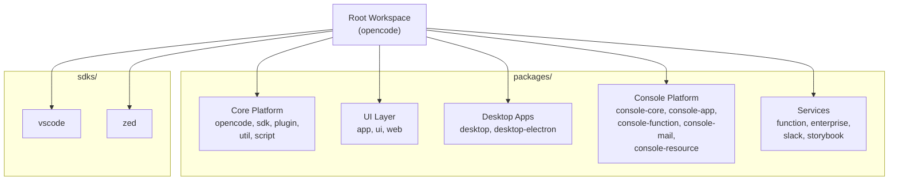
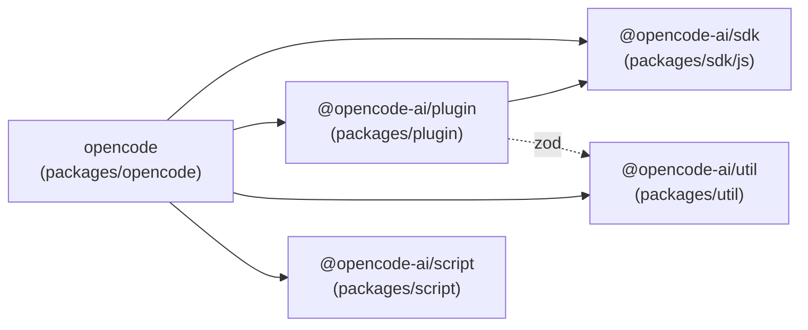
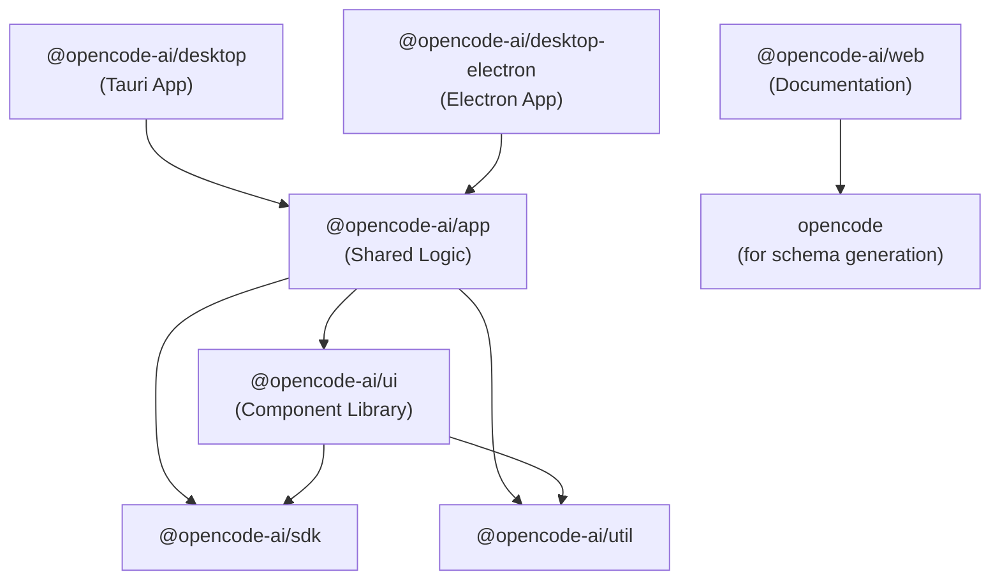
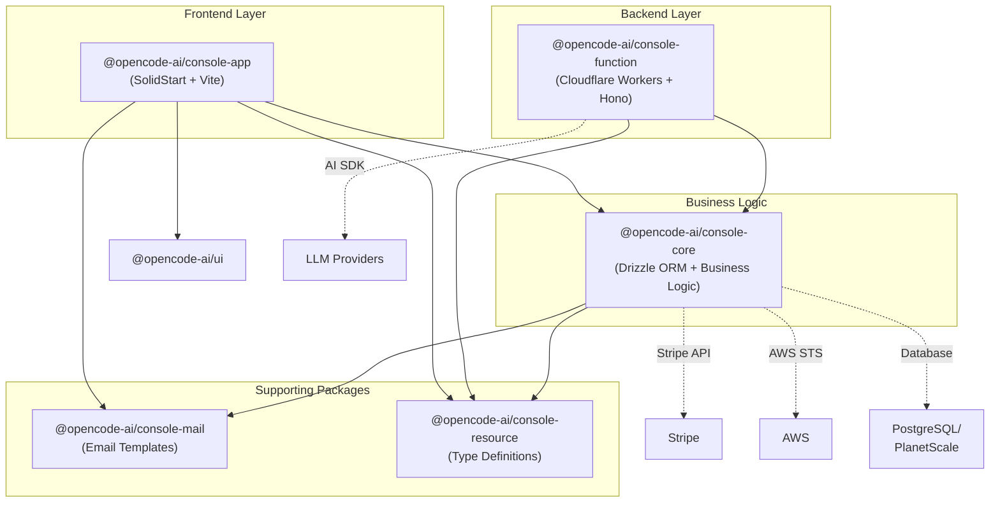
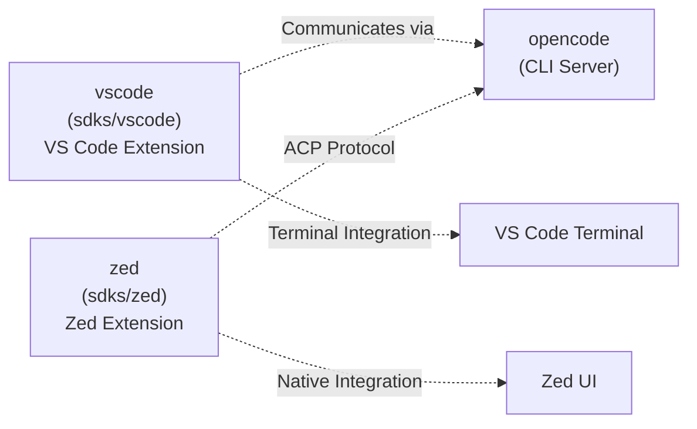
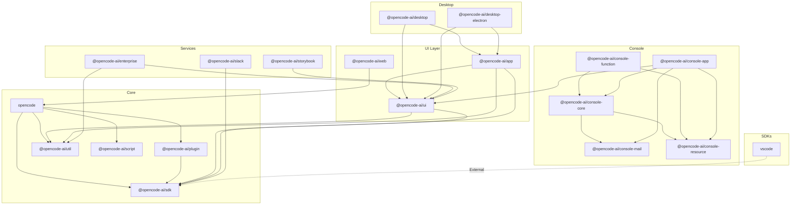

# Repository Structure & Packages

Relevant source files

The following files were used as context for generating this wiki page:

- [bun.lock](bun.lock)
- [packages/console/app/package.json](packages/console/app/package.json)
- [packages/console/core/package.json](packages/console/core/package.json)
- [packages/console/function/package.json](packages/console/function/package.json)
- [packages/console/mail/package.json](packages/console/mail/package.json)
- [packages/desktop/package.json](packages/desktop/package.json)
- [packages/function/package.json](packages/function/package.json)
- [packages/opencode/package.json](packages/opencode/package.json)
- [packages/plugin/package.json](packages/plugin/package.json)
- [packages/sdk/js/package.json](packages/sdk/js/package.json)
- [packages/web/package.json](packages/web/package.json)
- [sdks/vscode/package.json](sdks/vscode/package.json)

This document describes the monorepo organization of the OpenCode repository, including workspace structure, package categories, and inter-package dependencies. OpenCode uses Bun workspaces to manage multiple packages that together provide CLI tools, desktop applications, web interfaces, IDE extensions, and a managed cloud platform.

For information about the architectural patterns and runtime behavior of these systems, see [Architecture Overview](#1.2).

---

## Workspace Organization

OpenCode is organized as a monorepo with workspaces defined in [bun.lock:4-578](). The repository contains 20+ packages distributed across three primary directories:

| Directory   | Purpose                                    | Package Count  |
| ----------- | ------------------------------------------ | -------------- |
| `packages/` | Core platform, UI components, and services | 15 packages    |
| `sdks/`     | IDE integrations and extensions            | 2+ packages    |
| Root        | Main CLI package and build tooling         | Workspace root |

**Workspace Configuration**

The root workspace [bun.lock:5-26]() defines shared dependencies and catalog versions that child packages inherit. The catalog system [bun.lock:593-636]() ensures consistent versioning across all packages for shared dependencies like `typescript`, `vite`, `solid-js`, and `zod`.

**Workspace Dependencies**

Packages reference each other using the `workspace:*` protocol [packages/opencode/package.json:91-94](), which Bun resolves to local package paths during development and proper versions during publishing.

Sources: [bun.lock:1-636](), [packages/opencode/package.json:1-146]()

---

## Core Platform Packages

The core platform provides the foundational CLI, SDK, and plugin system that all other packages depend on.

### opencode

**Location**: `packages/opencode/`  
**Package Name**: `opencode`  
**Type**: Main CLI application and server

The primary package containing the OpenCode server, CLI commands, tool system, and runtime [packages/opencode/package.json:1-146](). This is the main entry point users interact with.

**Key Features**:

- CLI commands via `bin/opencode` [packages/opencode/package.json:21-23]()
- HTTP server with Hono framework
- Tool registry and execution engine
- LSP server management
- Provider integrations for 20+ LLM services
- Session and agent management

**Major Dependencies**:

- AI SDK ecosystem: `ai`, `@ai-sdk/*` [packages/opencode/package.json:58-86]()
- Effect runtime: `effect`, `@effect/platform-node` [packages/opencode/package.json:98,114]()
- UI framework: `solid-js`, `@opentui/solid` [packages/opencode/package.json:96-97,130]()
- Database: `drizzle-orm` [packages/opencode/package.json:113]()

### @opencode-ai/sdk

**Location**: `packages/sdk/js/`  
**Package Name**: `@opencode-ai/sdk`  
**Type**: Client SDK library

Provides the JavaScript SDK for interacting with OpenCode servers [packages/sdk/js/package.json:1-31](). Consumed by all client applications and IDE extensions.

**Exports** [packages/sdk/js/package.json:11-18]():

- `.`: Main client interface (`./src/index.ts`)
- `./client`: Client creation utilities
- `./server`: Server-side utilities
- `./v2/*`: Next-generation API with OpenAPI code generation

**Build Process**:

- TypeScript compilation via `tsgo`
- Custom build script [packages/sdk/js/package.json:9]()
- No runtime dependencies (peer dependencies only)

### @opencode-ai/plugin

**Location**: `packages/plugin/`  
**Package Name**: `@opencode-ai/plugin`  
**Type**: Plugin development kit

Defines the plugin API and types for extending OpenCode [packages/plugin/package.json:1-28](). Used by both core and third-party plugins.

**Exports** [packages/plugin/package.json:11-14]():

- `.`: Main plugin interface
- `./tool`: Tool development utilities

**Dependencies** [packages/plugin/package.json:18-21]():

- `@opencode-ai/sdk`: For client communication
- `zod`: Schema validation

### @opencode-ai/util

**Location**: `packages/util/`  
**Package Name**: `@opencode-ai/util`

Shared utility functions used across multiple packages [bun.lock:534-543](). Minimal dependencies (only `zod` for validation).

### @opencode-ai/script

**Location**: `packages/script/`  
**Package Name**: `@opencode-ai/script`

Build and deployment scripts [bun.lock:432-440](). Contains version management utilities and build automation.

**Dependency Diagram**

Sources: [packages/opencode/package.json:1-146](), [packages/sdk/js/package.json:1-31](), [packages/plugin/package.json:1-28](), [bun.lock:432-543]()

---

## UI Component Packages

These packages provide user interface components and application shells that run in browsers, desktop apps, and terminals.

### @opencode-ai/ui

**Location**: `packages/ui/`  
**Package Name**: `@opencode-ai/ui`  
**Type**: Shared UI component library

Component library built with SolidJS and Tailwind [bun.lock:488-532](). Provides reusable UI primitives consumed by all graphical interfaces.

**Key Components**:

- Session rendering: `SessionTurn`, `MessagePart`, `SessionReview`
- Code display: Syntax highlighting with Shiki, diff viewing with Pierre
- Form controls: Buttons, icons, inputs (60+ icon components)
- Layout primitives: Sidebar, header, modal systems

**External Dependencies** [bun.lock:491-519]():

- `@kobalte/core`: Accessible component primitives
- `@pierre/diffs`: Diff rendering engine
- `shiki`: Syntax highlighting
- `marked`: Markdown parsing
- `katex`: Math rendering
- `motion`, `motion-dom`: Animations

**Build Configuration** [bun.lock:520-532]():

- Vite for bundling
- Tailwind CSS via `@tailwindcss/vite`
- Icon spritesheet generation via `vite-plugin-icons-spritesheet`

### @opencode-ai/app

**Location**: `packages/app/`  
**Package Name**: `@opencode-ai/app`  
**Type**: Shared application logic

Application shell and business logic shared between desktop apps and web interfaces [bun.lock:27-76](). Contains routing, state management, and SDK integration.

**Key Features**:

- Session management and event handling
- Multi-project workspace support
- Real-time synchronization with SDK
- Terminal emulator integration via `ghostty-web`
- Autocomplete and command palette

**Dependencies** [bun.lock:30-62]():

- `@opencode-ai/sdk`: Server communication
- `@opencode-ai/ui`: Component library
- `@opencode-ai/util`: Shared utilities
- `@solidjs/router`: Client-side routing
- `@solid-primitives/*`: Reactive primitives (10+ packages)
- `effect`: Effect runtime
- `virtua`: Virtual scrolling

**Testing Infrastructure** [bun.lock:63-76]():

- `@playwright/test`: E2E testing
- `@happy-dom/global-registrator`: DOM environment

### @opencode-ai/web

**Location**: `packages/web/`  
**Package Name**: `@opencode-ai/web`  
**Type**: Static documentation site

Astro-based marketing and documentation website [packages/web/package.json:1-43](). Not an interactive client—purely informational.

**Stack** [packages/web/package.json:14-35]():

- `astro`: Static site generator
- `@astrojs/starlight`: Documentation theme
- `@astrojs/cloudflare`: Deployment adapter
- `@astrojs/solid-js`: Component integration
- `toolbeam-docs-theme`: Custom documentation styling

**Build Output**: Static HTML, CSS, and JS deployed to Cloudflare Pages

Sources: [bun.lock:27-76,488-532](), [packages/web/package.json:1-43]()

---

## Desktop Application Packages

Two desktop application implementations using different frameworks, both built on the shared `@opencode-ai/app` package.

### @opencode-ai/desktop

**Location**: `packages/desktop/`  
**Package Name**: `@opencode-ai/desktop`  
**Type**: Tauri desktop application

Native desktop app using Tauri v2 [packages/desktop/package.json:1-44](). Compiles to platform-specific binaries for macOS, Windows, and Linux.

**Tauri Plugins** [packages/desktop/package.json:20-33]():

- `@tauri-apps/plugin-shell`: Command execution
- `@tauri-apps/plugin-dialog`: Native dialogs
- `@tauri-apps/plugin-updater`: Auto-update system
- `@tauri-apps/plugin-store`: Persistent storage
- `@tauri-apps/plugin-clipboard-manager`: Clipboard access
- `@tauri-apps/plugin-deep-link`: URL scheme handling
- `@tauri-apps/plugin-window-state`: Window persistence

**Build System** [packages/desktop/package.json:7-13]():

- Vite for frontend bundling
- `@tauri-apps/cli` for native compilation
- Pre-dev script for environment setup

### @opencode-ai/desktop-electron

**Location**: `packages/desktop-electron/`  
**Package Name**: `@opencode-ai/desktop-electron`  
**Type**: Electron desktop application

Desktop app using Electron [bun.lock:220-249](). Alternative to Tauri with different trade-offs.

**Electron Features** [bun.lock:231-237]():

- `electron-log`: Logging
- `electron-store`: Settings persistence
- `electron-updater`: Auto-update
- `electron-window-state`: Window state management
- `tree-kill`: Process management

**Build Tools** [bun.lock:244-248]():

- `electron-vite`: Development server
- `electron-builder`: Application packaging

**Comparison Table**

| Feature       | Tauri (@opencode-ai/desktop) | Electron (@opencode-ai/desktop-electron) |
| ------------- | ---------------------------- | ---------------------------------------- |
| Runtime       | Rust + WebView               | Chromium + Node.js                       |
| Bundle Size   | ~5-10MB                      | ~100-150MB                               |
| Memory Usage  | Lower                        | Higher                                   |
| Native APIs   | Via Rust plugins             | Via Node.js                              |
| Update System | Built-in updater             | electron-updater                         |
| File Path     | `packages/desktop/`          | `packages/desktop-electron/`             |

Sources: [packages/desktop/package.json:1-44](), [bun.lock:220-249]()

---

## Console Platform Packages

The Console platform provides a managed SaaS offering for OpenCode Zen and Go services. Built as a three-tier architecture.

### @opencode-ai/console-core

**Location**: `packages/console/core/`  
**Package Name**: `@opencode-ai/console-core`  
**Type**: Business logic and database layer

Core business logic using Drizzle ORM [packages/console/core/package.json:1-52](). Shared between frontend and backend workers.

**Database Layer** [packages/console/core/package.json:8-19]():

- `drizzle-orm`: Type-safe ORM
- `postgres`: PostgreSQL driver
- `@planetscale/database`: PlanetScale support
- Database migrations via `drizzle-kit`

**External Integrations** [packages/console/core/package.json:9-19]():

- `stripe`: Payment processing
- `@aws-sdk/client-sts`: AWS credential management
- `aws4fetch`: AWS request signing

**Scripts** [packages/console/core/package.json:25-40]():

- `db`, `db-dev`, `db-prod`: Database migrations
- `update-models`, `promote-models-*`: Model management
- `update-limits`, `promote-limits-*`: Rate limit configuration

### @opencode-ai/console-function

**Location**: `packages/console/function/`  
**Package Name**: `@opencode-ai/console-function`  
**Type**: Cloudflare Workers backend

Serverless backend functions deployed to Cloudflare Workers [packages/console/function/package.json:1-31](). Handles AI streaming and API endpoints.

**AI Integration** [packages/console/function/package.json:19-22]():

- `@ai-sdk/anthropic`: Claude models
- `@ai-sdk/openai`: GPT models
- `@ai-sdk/openai-compatible`: Generic providers
- `ai`: AI SDK core

**HTTP Stack** [packages/console/function/package.json:23,28]():

- `hono`: HTTP framework
- `@hono/zod-validator`: Request validation

**Authentication** [packages/console/function/package.json:26]():

- `@openauthjs/openauth`: OpenAuth integration

### @opencode-ai/console-app

**Location**: `packages/console/app/`  
**Package Name**: `@opencode-ai/console-app`  
**Type**: SolidStart frontend application

Web frontend built with SolidStart [packages/console/app/package.json:1-46](). Deployed to Cloudflare Pages with SSR.

**Frontend Stack** [packages/console/app/package.json:13-35]():

- `@solidjs/start`: Meta-framework
- `@solidjs/router`, `@solidjs/meta`: Routing and metadata
- `@opencode-ai/ui`: Shared component library
- `vite`: Build system
- `nitro`: Server runtime

**Payment Integration** [packages/console/app/package.json:28,32]():

- `@stripe/stripe-js`: Stripe client SDK
- `solid-stripe`: Stripe components for SolidJS

**Analytics** [packages/console/app/package.json:29]():

- `chart.js`: Usage visualization

**Development** [packages/console/app/package.json:6-11]():

- Local dev server on `0.0.0.0`
- Remote dev mode with staging environment
- Schema generation for config validation

### @opencode-ai/console-mail

**Location**: `packages/console/mail/`  
**Package Name**: `@opencode-ai/console-mail`  
**Type**: Email templates

Email templates using JSX Email [packages/console/mail/package.json:1-22](). Provides transactional email rendering.

**Email Framework** [packages/console/mail/package.json:4-7]():

- `@jsx-email/all`: Component library
- `@jsx-email/cli`: Template preview tool
- React-based templating system

**Exports** [packages/console/mail/package.json:12-14]():

- Templates exported from `emails/templates/*`

### @opencode-ai/console-resource

**Location**: `packages/console/resource/`  
**Package Name**: `@opencode-ai/console-resource`  
**Type**: Type definitions

Shared TypeScript types for Cloudflare resources [bun.lock:175-185](). Defines resource bindings and environment types.

**Console Architecture Diagram**

Sources: [packages/console/core/package.json:1-52](), [packages/console/function/package.json:1-31](), [packages/console/app/package.json:1-46](), [packages/console/mail/package.json:1-22](), [bun.lock:175-185]()

---

## Service Packages

Specialized packages for integrations and enterprise features.

### @opencode-ai/function

**Location**: `packages/function/`  
**Package Name**: `@opencode-ai/function`  
**Type**: GitHub integration worker

Cloudflare Worker for GitHub App integration [packages/function/package.json:1-20](). Handles GitHub webhooks and repository operations.

**GitHub Integration** [packages/function/package.json:14-18]():

- `@octokit/auth-app`: GitHub App authentication
- `@octokit/rest`: GitHub REST API client
- `jose`: JWT handling for GitHub authentication
- `hono`: HTTP routing

### @opencode-ai/enterprise

**Location**: `packages/enterprise/`  
**Package Name**: `@opencode-ai/enterprise`  
**Type**: Enterprise features

Enterprise functionality including session sharing and collaboration [bun.lock:251-278](). Deployed as SolidStart application.

**Core Features** [bun.lock:254-269]():

- Session viewing and sharing
- `@opencode-ai/ui`: Component reuse
- `@pierre/diffs`: Diff rendering
- `luxon`: Time handling
- `aws4fetch`: AWS integration

**Deployment** [bun.lock:260-266]():

- `@solidjs/start`: SSR framework
- `nitro`: Server runtime
- `hono`, `hono-openapi`: API layer

### @opencode-ai/slack

**Location**: `packages/slack/`  
**Package Name**: `@opencode-ai/slack`  
**Type**: Slack bot integration

Slack bot built with Bolt framework [bun.lock:453-464](). Provides OpenCode access via Slack commands.

**Slack Integration** [bun.lock:456-459]():

- `@slack/bolt`: Official Slack SDK
- `@opencode-ai/sdk`: OpenCode client for backend communication

### @opencode-ai/storybook

**Location**: `packages/storybook/`  
**Package Name**: `@opencode-ai/storybook`  
**Type**: Component documentation

Storybook setup for UI component development [bun.lock:466-486](). Development-only package.

**Storybook Configuration** [bun.lock:468-485]():

- `storybook`, `storybook-solidjs-vite`: Core framework
- `@storybook/addon-*`: Various addons (a11y, docs, vitest)
- Component testing and documentation

Sources: [packages/function/package.json:1-20](), [bun.lock:251-278,453-486]()

---

## IDE Extension Packages

Integration packages for code editors and development environments.

### vscode

**Location**: `sdks/vscode/`  
**Package Name**: `opencode`  
**Type**: VS Code extension

Visual Studio Code extension [sdks/vscode/package.json:1-108](). Published to VS Code marketplace as `sst-dev.opencode`.

**Extension Configuration** [sdks/vscode/package.json:23-82]():

- Main entry: `./dist/extension.js`
- Three commands: `openTerminal`, `openNewTerminal`, `addFilepathToTerminal`
- Keybindings: `Cmd+Escape`, `Cmd+Shift+Escape`, `Cmd+Alt+K`
- Editor title button integration

**Build System** [sdks/vscode/package.json:83-95]():

- esbuild for bundling
- TypeScript compilation
- ESLint for linting
- `vscode-test` for testing

### zed

**Location**: `sdks/zed/`  
**Type**: Zed editor extension

Zed editor integration supporting Agent Client Protocol (ACP). Configuration-based extension without custom package.json in the lock file.

Sources: [sdks/vscode/package.json:1-108]()

---

## Dependency Graph

The following diagram shows workspace-level dependencies between packages using the `workspace:*` protocol.

Sources: [bun.lock:4-577]()

---

## Package Categories Summary

| Category             | Packages                                                                                                                                               | Primary Purpose                                                    |
| -------------------- | ------------------------------------------------------------------------------------------------------------------------------------------------------ | ------------------------------------------------------------------ |
| **Core Platform**    | `opencode`, `@opencode-ai/sdk`, `@opencode-ai/plugin`, `@opencode-ai/util`, `@opencode-ai/script`                                                      | CLI, SDK, plugin system, shared utilities                          |
| **UI Components**    | `@opencode-ai/ui`, `@opencode-ai/app`, `@opencode-ai/web`                                                                                              | Shared UI library, application logic, documentation site           |
| **Desktop Apps**     | `@opencode-ai/desktop`, `@opencode-ai/desktop-electron`                                                                                                | Native desktop applications (Tauri and Electron)                   |
| **Console Platform** | `@opencode-ai/console-core`, `@opencode-ai/console-function`, `@opencode-ai/console-app`, `@opencode-ai/console-mail`, `@opencode-ai/console-resource` | Managed cloud platform (SaaS)                                      |
| **Services**         | `@opencode-ai/function`, `@opencode-ai/enterprise`, `@opencode-ai/slack`, `@opencode-ai/storybook`                                                     | GitHub integration, enterprise features, Slack bot, component docs |
| **IDE Extensions**   | `vscode`, `zed`                                                                                                                                        | Editor integrations                                                |

---

## Build and Distribution

### Catalog Dependencies

The workspace uses Bun's catalog feature [bun.lock:593-636]() to manage shared dependency versions. Key cataloged packages include:

- **Frameworks**: `solid-js@1.9.10`, `vite@7.1.4`, `astro@5.7.13`
- **AI**: `ai@5.0.124`, all `@ai-sdk/*` providers
- **Database**: `drizzle-orm@1.0.0-beta.16-ea816b6`, `drizzle-kit@1.0.0-beta.16-ea816b6`
- **Utilities**: `zod@4.1.8`, `typescript@5.8.2`, `luxon@3.6.1`

### Build Tools

Common build tools across packages:

- **Bundlers**: Vite (most packages), esbuild (VS Code), Astro (web)
- **TypeScript**: `@typescript/native-preview@7.0.0-dev.20251207.1` for fast type checking via `tsgo`
- **CSS**: `tailwindcss@4.1.11`, `@tailwindcss/vite@4.1.11`
- **Testing**: `@playwright/test@1.51.0`, `@happy-dom/global-registrator`

### Patched Dependencies

The repository includes patches for specific packages [bun.lock:585-588]():

- `@openrouter/ai-sdk-provider@1.5.4`: Custom modifications for OpenRouter integration
- `@standard-community/standard-openapi@0.2.9`: OpenAPI specification fixes

Sources: [bun.lock:579-636]()

---

## Distribution Targets

Each package category targets different distribution channels:

| Package Type       | Distribution Method                                                         |
| ------------------ | --------------------------------------------------------------------------- |
| `opencode`         | npm (with platform binaries), Docker, Homebrew, AUR, Nix, Chocolatey, Scoop |
| Desktop apps       | GitHub Releases (installers), auto-update manifests                         |
| `@opencode-ai/sdk` | npm registry as TypeScript package                                          |
| Console platform   | Cloudflare Pages (app), Cloudflare Workers (function)                       |
| VS Code extension  | VS Code Marketplace                                                         |
| Zed extension      | Zed extension repository                                                    |

For detailed information about the build pipeline and release process, see [Build & Release](#8).

Sources: [packages/opencode/package.json:1-146](), [packages/desktop/package.json:1-44](), [bun.lock:220-249]()
