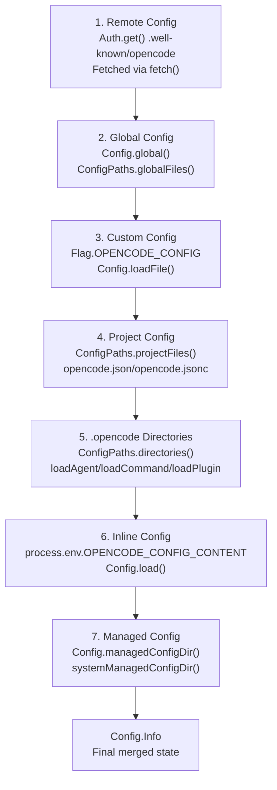
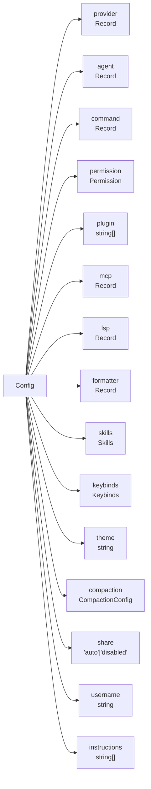
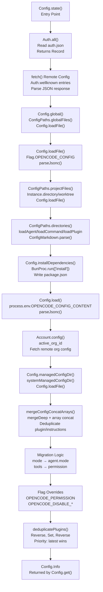

# Configuration Options

<details>
<summary>Relevant source files</summary>

The following files were used as context for generating this wiki page:

- [README.md](README.md)
- [packages/opencode/script/schema.ts](packages/opencode/script/schema.ts)
- [packages/opencode/src/auth/index.ts](packages/opencode/src/auth/index.ts)
- [packages/opencode/src/auth/service.ts](packages/opencode/src/auth/service.ts)
- [packages/opencode/src/cli/ui.ts](packages/opencode/src/cli/ui.ts)
- [packages/opencode/src/config/config.ts](packages/opencode/src/config/config.ts)
- [packages/opencode/src/env/index.ts](packages/opencode/src/env/index.ts)
- [packages/opencode/src/provider/error.ts](packages/opencode/src/provider/error.ts)
- [packages/opencode/src/provider/models.ts](packages/opencode/src/provider/models.ts)
- [packages/opencode/src/provider/provider.ts](packages/opencode/src/provider/provider.ts)
- [packages/opencode/src/provider/transform.ts](packages/opencode/src/provider/transform.ts)
- [packages/opencode/src/server/server.ts](packages/opencode/src/server/server.ts)
- [packages/opencode/src/session/compaction.ts](packages/opencode/src/session/compaction.ts)
- [packages/opencode/src/session/index.ts](packages/opencode/src/session/index.ts)
- [packages/opencode/src/session/llm.ts](packages/opencode/src/session/llm.ts)
- [packages/opencode/src/session/message-v2.ts](packages/opencode/src/session/message-v2.ts)
- [packages/opencode/src/session/message.ts](packages/opencode/src/session/message.ts)
- [packages/opencode/src/session/prompt.ts](packages/opencode/src/session/prompt.ts)
- [packages/opencode/src/session/revert.ts](packages/opencode/src/session/revert.ts)
- [packages/opencode/src/session/summary.ts](packages/opencode/src/session/summary.ts)
- [packages/opencode/src/tool/task.ts](packages/opencode/src/tool/task.ts)
- [packages/opencode/test/config/config.test.ts](packages/opencode/test/config/config.test.ts)
- [packages/opencode/test/provider/amazon-bedrock.test.ts](packages/opencode/test/provider/amazon-bedrock.test.ts)
- [packages/opencode/test/provider/gitlab-duo.test.ts](packages/opencode/test/provider/gitlab-duo.test.ts)
- [packages/opencode/test/provider/provider.test.ts](packages/opencode/test/provider/provider.test.ts)
- [packages/opencode/test/provider/transform.test.ts](packages/opencode/test/provider/transform.test.ts)
- [packages/opencode/test/session/llm.test.ts](packages/opencode/test/session/llm.test.ts)
- [packages/opencode/test/session/message-v2.test.ts](packages/opencode/test/session/message-v2.test.ts)
- [packages/opencode/test/session/revert-compact.test.ts](packages/opencode/test/session/revert-compact.test.ts)
- [packages/sdk/js/src/gen/sdk.gen.ts](packages/sdk/js/src/gen/sdk.gen.ts)
- [packages/sdk/js/src/gen/types.gen.ts](packages/sdk/js/src/gen/types.gen.ts)
- [packages/sdk/js/src/v2/gen/sdk.gen.ts](packages/sdk/js/src/v2/gen/sdk.gen.ts)
- [packages/sdk/js/src/v2/gen/types.gen.ts](packages/sdk/js/src/v2/gen/types.gen.ts)
- [packages/sdk/openapi.json](packages/sdk/openapi.json)
- [packages/web/src/components/Lander.astro](packages/web/src/components/Lander.astro)
- [packages/web/src/content/docs/go.mdx](packages/web/src/content/docs/go.mdx)
- [packages/web/src/content/docs/index.mdx](packages/web/src/content/docs/index.mdx)
- [packages/web/src/content/docs/providers.mdx](packages/web/src/content/docs/providers.mdx)
- [packages/web/src/content/docs/zen.mdx](packages/web/src/content/docs/zen.mdx)

</details>

This page provides a complete reference for all OpenCode configuration options, including the structure of `opencode.json`, environment variables, and configuration precedence. For general usage and examples, see [Config](#2.2). For information about customizing agents and commands, see [Session & Agent System](#2.3).

---

## Configuration Hierarchy

OpenCode uses a 7-layer configuration system implemented in `Config.state()`. Each layer merges using `mergeConfigConcatArrays()` with later layers overriding earlier ones.



**Configuration Loading Priority (Low → High)**

The `Config.state()` function orchestrates loading in this order, with `mergeConfigConcatArrays()` handling deep merging. Arrays (`plugin`, `instructions`) are concatenated and deduplicated via `deduplicatePlugins()`.

Sources: [packages/opencode/src/config/config.ts:78-266]()
</thinking>

<old_str>

### Platform-Specific Paths

| Platform | Global Config                           | State/Data                | Cache                           | Managed Config                          |
| -------- | --------------------------------------- | ------------------------- | ------------------------------- | --------------------------------------- |
| macOS    | `~/.config/opencode/opencode.json`      | `~/.local/share/opencode` | `~/.cache/opencode`             | `/Library/Application Support/opencode` |
| Linux    | `~/.config/opencode/opencode.json`      | `~/.local/share/opencode` | `~/.cache/opencode`             | `/etc/opencode`                         |
| Windows  | `%LOCALAPPDATA%\opencode\opencode.json` | `%LOCALAPPDATA%\opencode` | `%LOCALAPPDATA%\opencode\Cache` | `C:\ProgramData\opencode`               |

### Project Structure

```
project-root/
├── opencode.json           # Project configuration
├── opencode.jsonc          # Alternative (JSON with comments)
└── .opencode/              # Convention-based extensions
    ├── agents/             # Custom agent definitions (*.md)
    ├── commands/           # Custom commands (*.md)
    ├── plugins/            # Local plugins (*.ts, *.js)
    ├── skills/             # Skill files (SKILL.md)
    └── opencode.json       # Additional config overrides
```

Sources: [packages/opencode/src/config/config.ts:46-59](), [packages/opencode/src/config/paths.ts:1-100]()
</str>

<new_str>

### Platform-Specific Paths

Paths are determined by `Global.Path` and `Config.managedConfigDir()`:

| Platform | Global Config                           | State/Data (`Global.Path.state`) | Cache (`Global.Path.cache`)     | Managed Config                          |
| -------- | --------------------------------------- | -------------------------------- | ------------------------------- | --------------------------------------- |
| macOS    | `~/.config/opencode/opencode.json`      | `~/.local/share/opencode`        | `~/.cache/opencode`             | `/Library/Application Support/opencode` |
| Linux    | `~/.config/opencode/opencode.json`      | `~/.local/share/opencode`        | `~/.cache/opencode`             | `/etc/opencode`                         |
| Windows  | `%LOCALAPPDATA%\opencode\opencode.json` | `%LOCALAPPDATA%\opencode`        | `%LOCALAPPDATA%\opencode\Cache` | `C:\ProgramData\opencode`               |

The managed config directory is returned by `systemManagedConfigDir()` based on `process.platform` and can be overridden via `OPENCODE_TEST_MANAGED_CONFIG_DIR`.

### Project Structure

```
project-root/
├── opencode.json           # Project configuration (Config.loadFile)
├── opencode.jsonc          # Alternative with comments (parseJsonc)
└── .opencode/              # ConfigPaths.directories()
    ├── agents/             # loadAgent() - *.md with frontmatter
    ├── commands/           # loadCommand() - *.md templates
    ├── plugins/            # loadPlugin() - *.ts, *.js
    ├── skills/             # SKILL.md files
    ├── package.json        # Auto-created by installDependencies()
    └── opencode.json       # Additional config (merged)
```

Sources: [packages/opencode/src/config/config.ts:46-62](), [packages/opencode/src/config/paths.ts:1-150](), [packages/opencode/src/global.ts:1-100]()

---

## File Locations

### Platform-Specific Paths

| Platform | Global Config                           | State/Data                | Cache                           | Managed Config                          |
| -------- | --------------------------------------- | ------------------------- | ------------------------------- | --------------------------------------- |
| macOS    | `~/.config/opencode/opencode.json`      | `~/.local/share/opencode` | `~/.cache/opencode`             | `/Library/Application Support/opencode` |
| Linux    | `~/.config/opencode/opencode.json`      | `~/.local/share/opencode` | `~/.cache/opencode`             | `/etc/opencode`                         |
| Windows  | `%LOCALAPPDATA%\opencode\opencode.json` | `%LOCALAPPDATA%\opencode` | `%LOCALAPPDATA%\opencode\Cache` | `C:\ProgramData\opencode`               |

### Project Structure

```
project-root/
├── opencode.json           # Project configuration
├── opencode.jsonc          # Alternative (JSON with comments)
└── .opencode/              # Convention-based extensions
    ├── agents/             # Custom agent definitions (*.md)
    ├── commands/           # Custom commands (*.md)
    ├── plugins/            # Local plugins (*.ts, *.js)
    ├── skills/             # Skill files (SKILL.md)
    └── opencode.json       # Additional config overrides
```

Sources: [packages/opencode/src/config/config.ts:46-59](), [packages/opencode/src/config/paths.ts:1-100]()

---

## Core Configuration Schema

The root configuration object follows the `Config.Info` schema:



Sources: [packages/opencode/src/config/config.ts:1049-1365]()

---

## Provider Configuration

Providers are configured under the `provider` key, with each provider identified by `ProviderID`. The schema is defined in `Config.Info` and provider details come from `ModelsDev` (models.dev JSON).

### Schema

```typescript
{
  "provider": {
    "[providerID]": {                // ProviderID.zod validated
      "models": {
        "[modelID]": {               // ModelID.zod validated
          "variant": "string",       // Default variant (e.g., "high", "low")
          "options": {}              // Model-specific ProviderTransform options
        }
      },
      "options": {
        "apiKey": "string",          // API key (Auth.get() fallback)
        "baseURL": "string",         // Custom base URL for SDK
        "headers": {},               // Custom headers
        // Provider-specific options passed to SDK createProvider()
      }
    }
  }
}
```

Provider credentials are stored separately in `Auth.all()` (`~/.local/share/opencode/auth.json`) and merged at runtime. The `Provider.list()` function filters and transforms based on config + auth state.

### Provider-Specific Options

Each provider has a custom loader in `CUSTOM_LOADERS` object that processes options:

| Provider                | Key Options                         | Loader Function                           | Notes                             |
| ----------------------- | ----------------------------------- | ----------------------------------------- | --------------------------------- |
| `anthropic`             | `headers.anthropic-beta`            | `CUSTOM_LOADERS.anthropic`                | Beta headers for extended context |
| `openai`                | `baseURL`, `organization`           | `CUSTOM_LOADERS.openai`                   | Uses `sdk.responses()` for GPT-5+ |
| `azure`                 | `resourceName`, `useCompletionUrls` | `CUSTOM_LOADERS.azure`                    | `AZURE_RESOURCE_NAME` env var     |
| `amazon-bedrock`        | `region`, `profile`, `endpoint`     | `CUSTOM_LOADERS["amazon-bedrock"]`        | Uses `fromNodeProviderChain()`    |
| `google-vertex`         | `project`, `location`               | `CUSTOM_LOADERS["google-vertex"]`         | Requires `GoogleAuth` token       |
| `openrouter`            | `headers.HTTP-Referer`              | `CUSTOM_LOADERS.openrouter`               | Sets `X-Title: opencode`          |
| `gitlab`                | `instanceUrl`, `aiGatewayHeaders`   | `CUSTOM_LOADERS.gitlab`                   | Uses `@gitlab/gitlab-ai-provider` |
| `cloudflare-ai-gateway` | `accountId`, `gateway`              | `CUSTOM_LOADERS["cloudflare-ai-gateway"]` | Uses `ai-gateway-provider`        |

### Example

```json
{
  "provider": {
    "anthropic": {
      "options": {
        "headers": {
          "anthropic-beta": "claude-code-20250219"
        }
      }
    },
    "openai": {
      "models": {
        "gpt-5": {
          "variant": "high"
        }
      }
    },
    "amazon-bedrock": {
      "options": {
        "region": "us-west-2",
        "profile": "my-aws-profile"
      }
    }
  }
}
```

Sources: [packages/opencode/src/config/config.ts:1064-1117](), [packages/opencode/src/provider/provider.ts:109-661]()

---

## Agent Configuration

Agents are defined under the `agent` key using the `Config.Agent` schema. The schema includes a transform function that migrates legacy fields and extracts unknown keys into `options`.

### Schema

```typescript
{
  "agent": {
    "[agentName]": {
      "model": "string",                    // ModelID (validated by models.dev)
      "variant": "string",                  // ProviderTransform.variants() key
      "temperature": 0.0-1.0,               // Model temperature (ProviderTransform.temperature)
      "top_p": 0.0-1.0,                     // Top-p sampling (ProviderTransform.topP)
      "prompt": "string",                   // SystemPrompt.generate() base
      "description": "string",              // Agent.list() filtering
      "mode": "primary" | "subagent" | "all", // Agent selection behavior
      "hidden": boolean,                    // Hide from autocomplete (subagent only)
      "color": "#RRGGBB" | "primary",       // UI color (hex or theme)
      "steps": number,                      // Max iterations in SessionPrompt.loop()
      "permission": Permission,             // PermissionNext.Ruleset override
      "options": {}                         // Catchall for unknown keys
    }
  }
}
```

The `Config.Agent` schema includes a `.transform()` that:

1. Migrates `maxSteps` → `steps`
2. Converts `tools` → `permission` (legacy compatibility)
3. Extracts unknown properties into `options`

### Agent Modes

| Mode       | Description                | Usage             |
| ---------- | -------------------------- | ----------------- |
| `primary`  | Default agent for sessions | Use Tab to switch |
| `subagent` | Available via `@mention`   | Specialized tasks |
| `all`      | Available everywhere       | Both contexts     |

### Built-in Agents

| Agent     | Mode     | Description                          |
| --------- | -------- | ------------------------------------ |
| `build`   | primary  | Full-access development agent        |
| `plan`    | primary  | Read-only analysis agent             |
| `general` | subagent | Complex searches and multistep tasks |

### Example

```json
{
  "agent": {
    "build": {
      "model": "anthropic/claude-sonnet-4-5",
      "variant": "high",
      "temperature": 0.7,
      "steps": 50,
      "permission": {
        "edit": "allow",
        "bash": "allow"
      }
    },
    "architect": {
      "mode": "subagent",
      "description": "System design and architecture analysis",
      "model": "openai/gpt-5",
      "permission": {
        "edit": "deny",
        "bash": "ask"
      },
      "color": "#2563eb"
    }
  }
}
```

Sources: [packages/opencode/src/config/config.ts:712-799](), [packages/opencode/src/agent/agent.ts:1-200]()

---

## Permission Configuration

Permissions are defined using `Config.Permission` which uses preprocessing and transformation to preserve key order (important for rule matching). The schema supports both simple actions and pattern-based rules.

### Schema

```typescript
{
  "permission": {
    "[toolName]": "ask" | "allow" | "deny" | {  // Config.PermissionRule
      "[pattern]": "ask" | "allow" | "deny"      // Glob pattern → action
    }
  }
}
```

The `Config.Permission` schema uses:

- `permissionPreprocess()` - Captures original key order in `__originalKeys`
- `permissionTransform()` - Rebuilds object in original order
- `Config.PermissionAction` - Enum: `"ask"`, `"allow"`, `"deny"`
- `Config.PermissionObject` - Record mapping patterns to actions

Permission evaluation is handled by `PermissionNext.evaluate()` which walks rulesets in order.

### Permission Actions

| Action  | Behavior                     |
| ------- | ---------------------------- |
| `allow` | Always permit without asking |
| `deny`  | Always reject                |
| `ask`   | Prompt user for approval     |

### Tool Permissions

| Tool                 | Description                | Default |
| -------------------- | -------------------------- | ------- |
| `read`               | File reading               | ask     |
| `edit`               | File editing               | ask     |
| `glob`               | File pattern matching      | allow   |
| `grep`               | Content search             | allow   |
| `list`               | Directory listing          | allow   |
| `bash`               | Shell command execution    | ask     |
| `task`               | Subagent invocation        | ask     |
| `external_directory` | Access outside project     | ask     |
| `lsp`                | Language server operations | allow   |
| `skill`              | Skill execution            | ask     |
| `webfetch`           | HTTP requests              | ask     |
| `websearch`          | Web search                 | ask     |
| `codesearch`         | Code search                | ask     |

### Pattern Matching

Permissions support glob patterns for fine-grained control:

```json
{
  "permission": {
    "edit": {
      "src/**/*.ts": "allow", // Allow TypeScript edits
      "*.config.js": "ask", // Ask for config files
      ".env*": "deny" // Deny env files
    },
    "bash": {
      "npm install": "allow",
      "rm -rf *": "deny",
      "*": "ask"
    }
  }
}
```

### Wildcard Permissions

Use `*` to set default for all tools:

```json
{
  "permission": "*" // "allow", "deny", or "ask" for all tools
}
```

Sources: [packages/opencode/src/config/config.ts:626-692](), [packages/opencode/src/permission/next.ts:1-700]()

---

## MCP Configuration

Model Context Protocol (MCP) servers are configured using `Config.Mcp` discriminated union with `type` field. The schemas are `Config.McpLocal` and `Config.McpRemote`.

### Local Server Schema (`Config.McpLocal`)

```typescript
{
  "mcp": {
    "[serverName]": {
      "type": "local",                 // z.literal("local")
      "command": ["string"],           // Command array (stdio transport)
      "environment": {},               // z.record(z.string(), z.string())
      "enabled": boolean,              // MCP.init() checks this
      "timeout": number                // Request timeout (default: 5000ms)
    }
  }
}
```

### Remote Server Schema (`Config.McpRemote`)

```typescript
{
  "mcp": {
    "[serverName]": {
      "type": "remote",                // z.literal("remote")
      "url": "string",                 // Server URL (SSE transport)
      "headers": {},                   // z.record(z.string(), z.string())
      "enabled": boolean,              // MCP.init() checks this
      "timeout": number,               // Request timeout (default: 5000ms)
      "oauth": {                       // Config.McpOAuth
        "clientId": "string",          // OAuth 2.0 client ID (optional)
        "clientSecret": "string",      // OAuth secret (optional)
        "scope": "string"              // OAuth scopes (optional)
      } | false                        // false = disable auto-detection
    }
  }
}
```

Servers are initialized by `MCP.init()` which iterates config and spawns processes or establishes SSE connections.

### Example

```json
{
  "mcp": {
    "filesystem": {
      "type": "local",
      "command": [
        "npx",
        "-y",
        "@modelcontextprotocol/server-filesystem",
        "/path/to/allowed"
      ],
      "enabled": true,
      "timeout": 10000
    },
    "postgres": {
      "type": "local",
      "command": ["npx", "-y", "@modelcontextprotocol/server-postgres"],
      "environment": {
        "POSTGRES_CONNECTION_STRING": "postgresql://localhost/mydb"
      }
    },
    "custom-api": {
      "type": "remote",
      "url": "https://api.example.com/mcp",
      "headers": {
        "Authorization": "Bearer ${API_TOKEN}"
      },
      "oauth": {
        "clientId": "my-client-id",
        "scope": "read write"
      }
    }
  }
}
```

Sources: [packages/opencode/src/config/config.ts:563-624](), [packages/opencode/src/mcp/index.ts:1-1000]()

---

## LSP Configuration

Language Server Protocol (LSP) servers provide code intelligence.

### Schema

```typescript
{
  "lsp": {
    "[serverName]": {
      "command": "string",             // Server command
      "args": ["string"],              // Command arguments
      "languages": ["string"],         // Supported languages
      "initialize": {},                // Initialize options
      "commands": {                    // Custom commands
        "[commandName]": "string"
      }
    }
  }
}
```

### Example

```json
{
  "lsp": {
    "typescript": {
      "command": "typescript-language-server",
      "args": ["--stdio"],
      "languages": [
        "typescript",
        "javascript",
        "typescriptreact",
        "javascriptreact"
      ],
      "initialize": {
        "preferences": {
          "importModuleSpecifierPreference": "relative"
        }
      }
    },
    "rust": {
      "command": "rust-analyzer",
      "languages": ["rust"],
      "initialize": {
        "cargo": {
          "features": "all"
        }
      }
    }
  }
}
```

Sources: [packages/opencode/src/config/config.ts:1144-1188](), [packages/opencode/src/lsp/server.ts:1-600]()

---

## Formatter Configuration

Formatters automatically format code on file edits.

### Schema

```typescript
{
  "formatter": {
    "[extension]": {
      "command": ["string"],           // Formatter command
      "env": {}                        // Environment variables
    }
  }
}
```

### Example

```json
{
  "formatter": {
    "ts": {
      "command": ["prettier", "--write", "--parser", "typescript"]
    },
    "js": {
      "command": ["prettier", "--write"]
    },
    "py": {
      "command": ["black", "-"],
      "env": {
        "BLACK_CACHE_DIR": "/tmp/black-cache"
      }
    },
    "go": {
      "command": ["gofmt"]
    }
  }
}
```

Sources: [packages/opencode/src/config/config.ts:1226-1273](), [packages/opencode/src/format/index.ts:1-300]()

---

## Command Configuration

Custom commands define reusable prompt templates with variable expansion.

### Schema

```typescript
{
  "command": {
    "[commandName]": {
      "template": "string",            // Prompt template with {{variables}}
      "description": "string",         // Command description
      "agent": "string",               // Default agent
      "model": "string",               // Default model
      "subtask": boolean               // Run as subtask
    }
  }
}
```

### Template Variables

Commands support variable expansion:

- `{{clipboard}}` - Current clipboard contents
- `{{selection}}` - Selected text/files
- Custom variables from context

### Markdown File Format

Commands can be defined as `.md` files in `.opencode/commands/`:

```markdown
---
description: Explain code with examples
agent: general
---

Explain the following code and provide usage examples:

{{selection}}
```

### Example

```json
{
  "command": {
    "explain": {
      "template": "Explain the following code:\
\
{{selection}}",
      "description": "Explain selected code",
      "agent": "general"
    },
    "test": {
      "template": "Write unit tests for:\
\
{{selection}}",
      "description": "Generate unit tests",
      "agent": "build",
      "subtask": true
    }
  }
}
```

Sources: [packages/opencode/src/config/config.ts:648-655](), [packages/opencode/src/config/config.ts:338-374](), [packages/opencode/src/command/index.ts:1-200]()

---

## Skill Configuration

Skills provide specialized context and capabilities.

### Schema

```typescript
{
  "skills": {
    "paths": ["string"],               // Additional skill directories
    "urls": ["string"]                 // Remote skill URLs
  }
}
```

### Skill File Format

Skills are defined as `SKILL.md` files with frontmatter:

```markdown
---
name: database-expert
description: Database design and optimization
---

# Database Skills

You are an expert in database design, optimization, and query writing.

Key responsibilities:

- Design normalized schemas
- Optimize query performance
- Recommend appropriate indexes
```

### Example

```json
{
  "skills": {
    "paths": ["~/.opencode/skills", "./custom-skills"],
    "urls": ["https://example.com/.well-known/skills/"]
  }
}
```

Sources: [packages/opencode/src/config/config.ts:657-664](), [packages/opencode/src/skill/skill.ts:1-400]()

---

## Keybinds Configuration

Customize TUI keyboard shortcuts.

### Schema

```typescript
{
  "keybinds": {
    "leader": "string",                // Leader key (default: "ctrl+x")
    "[action]": "string"               // Comma-separated keybinds
  }
}
```

### Leader Key Syntax

The leader key enables vim-style key sequences. Use `<leader>` in keybind definitions:

```json
{
  "keybinds": {
    "leader": "ctrl+x",
    "session_new": "<leader>n" // Triggers: ctrl+x then n
  }
}
```

### Available Actions

| Category     | Actions                                                                                                                                                                                             |
| ------------ | --------------------------------------------------------------------------------------------------------------------------------------------------------------------------------------------------- |
| **App**      | `app_exit`, `editor_open`, `theme_list`, `sidebar_toggle`, `scrollbar_toggle`, `status_view`                                                                                                        |
| **Session**  | `session_new`, `session_list`, `session_timeline`, `session_fork`, `session_rename`, `session_delete`, `session_export`, `session_share`, `session_unshare`, `session_interrupt`, `session_compact` |
| **Messages** | `messages_page_up`, `messages_page_down`, `messages_line_up`, `messages_line_down`, `messages_first`, `messages_last`, `messages_copy`, `messages_undo`, `messages_redo`, `messages_toggle_conceal` |
| **Model**    | `model_list`, `model_cycle_recent`, `model_cycle_favorite`, `model_provider_list`, `model_favorite_toggle`                                                                                          |
| **Command**  | `command_list`, `agent_list`                                                                                                                                                                        |

### Special Keys

- `ctrl`, `alt`, `shift` - Modifiers
- `<leader>` - Leader key reference
- `none` - Disable keybind
- Multiple keybinds: comma-separated (e.g., `"ctrl+c,ctrl+d,<leader>q"`)

### Example

```json
{
  "keybinds": {
    "leader": "ctrl+a",
    "app_exit": "ctrl+q",
    "session_new": "<leader>n,ctrl+n",
    "session_list": "<leader>l",
    "model_list": "ctrl+m",
    "messages_copy": "<leader>y",
    "tool_details": "none"
  }
}
```

Sources: [packages/opencode/src/config/config.ts:755-840]()

---

## UI Configuration

Configure terminal user interface appearance and behavior.

### Schema

```typescript
{
  "theme": "string",                   // Theme name or path
  "username": "string",                // Display name
  "instructions": ["string"]           // Additional instructions
}
```

### Theme Options

Themes can be:

- Built-in theme names: `"dark"`, `"light"`, `"terminal"`
- File paths: `"~/.config/opencode/themes/custom.json"`
- URLs: `"https://example.com/theme.json"`

### Example

```json
{
  "theme": "dark",
  "username": "developer",
  "instructions": [
    "Always use TypeScript for new files",
    "Follow the project's ESLint rules"
  ]
}
```

Sources: [packages/opencode/src/config/config.ts:1275-1303]()

---

## Session Configuration

Control session behavior and sharing.

### Schema

```typescript
{
  "share": "auto" | "disabled",        // Session sharing
  "compaction": {
    "auto": boolean,                   // Auto-compact on overflow
    "prune": boolean,                  // Prune old tool outputs
    "reserved": number                 // Reserved tokens (default: 20000)
  }
}
```

### Sharing Options

| Value      | Behavior                |
| ---------- | ----------------------- |
| `auto`     | Auto-share new sessions |
| `disabled` | Never share sessions    |

### Compaction

Context compaction manages conversation length:

- **Auto**: Automatically compact when approaching context limit
- **Prune**: Remove old tool outputs to save space
- **Reserved**: Tokens to reserve for model responses

### Example

```json
{
  "share": "auto",
  "compaction": {
    "auto": true,
    "prune": true,
    "reserved": 30000
  }
}
```

Sources: [packages/opencode/src/config/config.ts:1304-1327](), [packages/opencode/src/session/compaction.ts:1-300]()

---

## Plugin Configuration

Load custom plugins to extend OpenCode functionality.

### Schema

```typescript
{
  "plugin": [
    "string"                           // npm package or file:// URL
  ]
}
```

### Plugin Formats

| Format              | Example                                                 |
| ------------------- | ------------------------------------------------------- |
| npm package         | `"oh-my-opencode"`                                      |
| npm with version    | `"oh-my-opencode@1.2.3"`                                |
| Local file          | `"file:///path/to/plugin.ts"`                           |
| .opencode directory | Automatically loaded from `.opencode/plugins/*.{ts,js}` |

### Plugin Loading Order

1. Built-in plugins
2. Global config plugins
3. Project config plugins
4. .opencode/plugins/ directory

Later entries override earlier ones with the same name.

### Example

```json
{
  "plugin": [
    "oh-my-opencode@2.4.3",
    "opencode-jira@latest",
    "file:///home/user/.opencode/plugins/custom.ts"
  ]
}
```

Sources: [packages/opencode/src/config/config.ts:1328-1365](), [packages/opencode/src/plugin/index.ts:1-100](), [packages/opencode/src/config/config.ts:451-515]()

---

## Environment Variables

Environment variables are accessed via the `Flag` namespace and override configuration at runtime. The `Config.state()` function applies these overrides after merging all config layers.

### Configuration Variables

| Variable                           | Flag Constant                           | Purpose                    | Applied In               |
| ---------------------------------- | --------------------------------------- | -------------------------- | ------------------------ |
| `OPENCODE_CONFIG`                  | `Flag.OPENCODE_CONFIG`                  | Custom config file path    | `Config.state():118-120` |
| `OPENCODE_CONFIG_CONTENT`          | `process.env.OPENCODE_CONFIG_CONTENT`   | Inline config JSON         | `Config.state():169-178` |
| `OPENCODE_CONFIG_DIR`              | `Flag.OPENCODE_CONFIG_DIR`              | Custom .opencode directory | `Config.state():137-139` |
| `OPENCODE_DISABLE_PROJECT_CONFIG`  | `Flag.OPENCODE_DISABLE_PROJECT_CONFIG`  | Ignore project config      | `Config.state():124-128` |
| `OPENCODE_DISABLE_DEFAULT_PLUGINS` | `Flag.OPENCODE_DISABLE_DEFAULT_PLUGINS` | Skip built-in plugins      | Plugin loading           |

### Permission Variables

| Variable                       | Flag Constant                       | Applied In               |
| ------------------------------ | ----------------------------------- | ------------------------ |
| `OPENCODE_PERMISSION`          | `Flag.OPENCODE_PERMISSION`          | `Config.state():226-228` |
| `OPENCODE_DISABLE_AUTOCOMPACT` | `Flag.OPENCODE_DISABLE_AUTOCOMPACT` | `Config.state():252-254` |
| `OPENCODE_DISABLE_PRUNE`       | `Flag.OPENCODE_DISABLE_PRUNE`       | `Config.state():255-257` |

### Server Variables

| Variable                   | Flag Constant                   | Used In                         |
| -------------------------- | ------------------------------- | ------------------------------- |
| `OPENCODE_SERVER_PASSWORD` | `Flag.OPENCODE_SERVER_PASSWORD` | `Server.createApp()` basic auth |
| `OPENCODE_SERVER_USERNAME` | `Flag.OPENCODE_SERVER_USERNAME` | `Server.createApp()` basic auth |

### Feature Flags

| Variable                                 | Flag Constant                                 | Purpose                                |
| ---------------------------------------- | --------------------------------------------- | -------------------------------------- |
| `OPENCODE_AUTO_SHARE`                    | `Flag.OPENCODE_AUTO_SHARE`                    | `Session.createNext():330` auto-share  |
| `OPENCODE_EXPERIMENTAL_OUTPUT_TOKEN_MAX` | `Flag.OPENCODE_EXPERIMENTAL_OUTPUT_TOKEN_MAX` | `ProviderTransform.OUTPUT_TOKEN_MAX`   |
| `OPENCODE_STRICT_CONFIG_DEPS`            | `Flag.OPENCODE_STRICT_CONFIG_DEPS`            | `Config.installDependencies():310-322` |

### Testing Variables

| Variable                           | Used In                        |
| ---------------------------------- | ------------------------------ |
| `OPENCODE_TEST_MANAGED_CONFIG_DIR` | `Config.managedConfigDir():61` |

Sources: [packages/opencode/src/flag/flag.ts:1-150](), [packages/opencode/src/config/config.ts:118-257]()

---

## Configuration Loading Process

The `Config.state()` function (Instance.state wrapper) orchestrates loading through these steps:



### Loading Steps

1. **Auth.all()** - Read `~/.local/share/opencode/auth.json` for provider credentials
2. **Remote Config** - For each `wellknown` auth entry, `fetch()` `.well-known/opencode`
3. **Config.global()** - Load from `ConfigPaths.globalFiles()` using `Config.loadFile()`
4. **Custom Config** - If `Flag.OPENCODE_CONFIG` set, load via `Config.loadFile()`
5. **Project Config** - Call `ConfigPaths.projectFiles()` for project/worktree configs
6. **Directory Extensions** - `ConfigPaths.directories()` returns `.opencode/` paths; call `loadAgent()`, `loadCommand()`, `loadPlugin()` for each
7. **Install Dependencies** - `Config.installDependencies()` writes `package.json` and runs `BunProc.run(['install'])`
8. **Inline Config** - Parse `process.env.OPENCODE_CONFIG_CONTENT` via `Config.load()`
9. **Account Config** - If `Account.active()` has `active_org_id`, fetch via `Account.config()`
10. **Managed Config** - Load from `Config.managedConfigDir()` (read-only enterprise policies)
11. **Merge & Migrate** - `mergeConfigConcatArrays()` combines layers; migrate `mode` field to `agent`; convert `tools` to `permission`
12. **Apply Flags** - Override `permission`, `compaction` based on `Flag.OPENCODE_*` env vars
13. **Deduplicate** - `deduplicatePlugins()` removes duplicates by canonical name, preserving load order

### Merge Strategy

The `mergeConfigConcatArrays()` function uses `mergeDeep()` with special array handling:

- **Objects**: Deep merge (later overwrites earlier)
- **Arrays** (`plugin`, `instructions`): Concatenate, then deduplicate via `Array.from(new Set([...]))`
- **Primitives**: Later value wins (standard `mergeDeep` behavior)

Sources: [packages/opencode/src/config/config.ts:78-266](), [packages/opencode/src/config/config.ts:66-76]()

---

## Common Patterns

### Multi-Environment Setup

Use different configs per environment:

```bash
# Development
OPENCODE_CONFIG=~/.config/opencode/dev.json opencode

# Production
OPENCODE_CONFIG=~/.config/opencode/prod.json opencode
```

### Team Configuration

Share project config, customize per user:

```json
// Project opencode.json (committed)
{
  "agent": {
    "build": {
      "model": "anthropic/claude-sonnet-4"
    }
  },
  "lsp": {
    "typescript": {
      "command": "typescript-language-server",
      "args": ["--stdio"]
    }
  }
}

// User ~/.config/opencode/opencode.json (personal)
{
  "provider": {
    "anthropic": {
      "options": {
        "apiKey": "sk-..."
      }
    }
  },
  "keybinds": {
    "leader": "ctrl+space"
  }
}
```

### Enterprise Deployment

Enforce policies via managed config:

```json
// /etc/opencode/opencode.json (read-only)
{
  "provider": {
    "openai": {
      "options": {
        "baseURL": "https://internal-proxy.company.com"
      }
    }
  },
  "permission": {
    "external_directory": "deny",
    "webfetch": "deny"
  },
  "share": "disabled"
}
```

### Dynamic Model Selection

Configure model fallbacks:

```json
{
  "agent": {
    "build": {
      "model": "opencode/gpt-5",
      "options": {
        "fallback": ["anthropic/claude-sonnet-4", "openai/gpt-4"]
      }
    }
  }
}
```

### Permission Profiles

Create permission profiles for different security levels:

```json
{
  "agent": {
    "readonly": {
      "mode": "subagent",
      "permission": {
        "edit": "deny",
        "bash": "deny",
        "read": "allow"
      }
    },
    "restricted": {
      "mode": "subagent",
      "permission": {
        "edit": {
          "src/**": "allow",
          "*": "deny"
        },
        "bash": {
          "npm test": "allow",
          "*": "ask"
        }
      }
    }
  }
}
```

Sources: [packages/opencode/src/config/config.ts:1-1400]()
