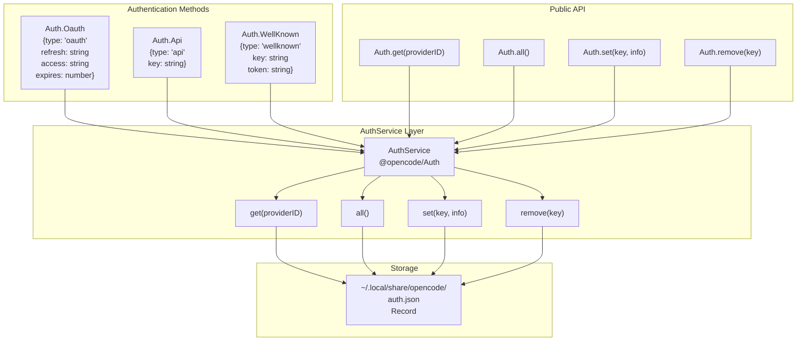
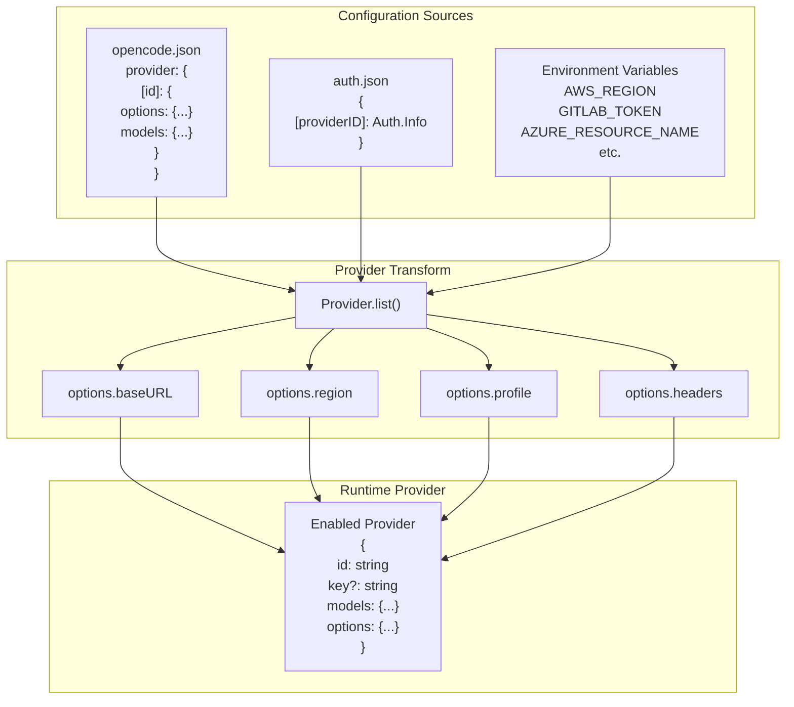
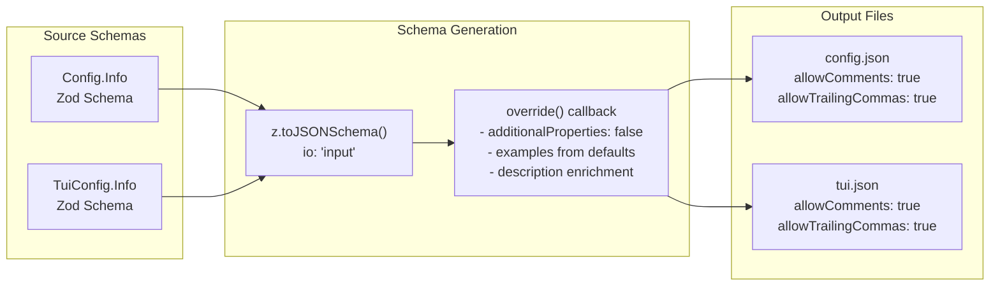

# Reference

<details>
<summary>Relevant source files</summary>

The following files were used as context for generating this wiki page:

- [README.md](README.md)
- [packages/opencode/script/schema.ts](packages/opencode/script/schema.ts)
- [packages/opencode/src/auth/index.ts](packages/opencode/src/auth/index.ts)
- [packages/opencode/src/auth/service.ts](packages/opencode/src/auth/service.ts)
- [packages/opencode/src/cli/ui.ts](packages/opencode/src/cli/ui.ts)
- [packages/opencode/test/provider/amazon-bedrock.test.ts](packages/opencode/test/provider/amazon-bedrock.test.ts)
- [packages/opencode/test/provider/gitlab-duo.test.ts](packages/opencode/test/provider/gitlab-duo.test.ts)
- [packages/web/src/components/Lander.astro](packages/web/src/components/Lander.astro)
- [packages/web/src/content/docs/go.mdx](packages/web/src/content/docs/go.mdx)
- [packages/web/src/content/docs/index.mdx](packages/web/src/content/docs/index.mdx)
- [packages/web/src/content/docs/providers.mdx](packages/web/src/content/docs/providers.mdx)
- [packages/web/src/content/docs/zen.mdx](packages/web/src/content/docs/zen.mdx)

</details>

This page provides quick reference documentation for common OpenCode tasks, configurations, and command patterns. It covers the most frequently accessed information needed when working with OpenCode.

For comprehensive provider and model listings, see [Providers & Models](#9.1). For TUI-specific commands and keybindings, see [TUI Commands & Keybindings](#9.2). For complete configuration schema documentation, see [Configuration Schema Reference](#9.3).

---

## Common Tasks

### Installation

OpenCode can be installed through multiple package managers:

| Method         | Command                                          |
| -------------- | ------------------------------------------------ |
| Install script | `curl -fsSL https://opencode.ai/install \| bash` |
| npm            | `npm install -g opencode-ai`                     |
| Bun            | `bun install -g opencode-ai`                     |
| Homebrew       | `brew install anomalyco/tap/opencode`            |
| Arch Linux     | `sudo pacman -S opencode`                        |
| AUR            | `paru -S opencode-bin`                           |
| Chocolatey     | `choco install opencode`                         |
| Scoop          | `scoop install opencode`                         |
| Docker         | `docker run -it --rm ghcr.io/anomalyco/opencode` |
| Nix            | `nix run nixpkgs#opencode`                       |

**Sources:** [README.md:46-62](), [packages/web/src/content/docs/index.mdx:32-129]()

### Authentication Setup

Connect to a provider using the `/connect` command in the TUI:

```bash
/connect
```

This command guides you through selecting a provider and configuring credentials. Authentication data is stored in `~/.local/share/opencode/auth.json`.

**Sources:** [packages/web/src/content/docs/index.mdx:134-159](), [packages/opencode/src/auth/service.ts:36]()

### Model Selection

Select or change the active model using the `/models` command:

```bash
/models
```

**Sources:** [packages/web/src/content/docs/providers.mdx:77-81]()

---

## Authentication System

OpenCode supports three authentication methods for providers: OAuth, API keys, and well-known authentication.



**Authentication Type Definitions**

The `Auth.Info` discriminated union supports three authentication types:

| Type        | Properties                                                     | Use Case                                                |
| ----------- | -------------------------------------------------------------- | ------------------------------------------------------- |
| `oauth`     | `refresh`, `access`, `expires`, `accountId?`, `enterpriseUrl?` | OAuth 2.0 providers (Anthropic, GitHub Copilot, GitLab) |
| `api`       | `key`                                                          | API key-based providers (OpenAI, most providers)        |
| `wellknown` | `key`, `token`                                                 | Well-known authentication endpoints                     |

**Sources:** [packages/opencode/src/auth/index.ts:13-39](), [packages/opencode/src/auth/service.ts:8-29]()

---

## Provider Configuration

Providers are configured through a hierarchical system combining `opencode.json`, `auth.json`, and environment variables.



**Configuration Precedence**

For most provider options, the precedence order is:

1. `opencode.json` provider config (`provider.[id].options`)
2. Environment variables (provider-specific)
3. Default values

**Special Cases:**

- **Amazon Bedrock**: Bearer token from `auth.json` or `AWS_BEARER_TOKEN_BEDROCK` takes precedence over AWS credential chain
- **GitLab**: `options.apiKey` in config takes precedence over `GITLAB_TOKEN` environment variable
- **Azure**: `AZURE_RESOURCE_NAME` environment variable is required

**Sources:** [packages/web/src/content/docs/providers.mdx:26-48](), [packages/opencode/test/provider/amazon-bedrock.test.ts:12-42](), [packages/opencode/test/provider/gitlab-duo.test.ts:171-199]()

---

## File Locations

OpenCode uses several well-defined file locations for configuration and data storage:

| File              | Path                                | Purpose                                              |
| ----------------- | ----------------------------------- | ---------------------------------------------------- |
| Authentication    | `~/.local/share/opencode/auth.json` | Stores provider credentials (OAuth tokens, API keys) |
| Global Config     | `~/.config/opencode/opencode.json`  | User-level configuration                             |
| Project Config    | `./opencode.json`                   | Project-specific configuration                       |
| Project Agents    | `./AGENTS.md`                       | Project analysis and patterns (generated by `/init`) |
| Config Schema     | `https://opencode.ai/config.json`   | JSON schema for configuration validation             |
| TUI Config Schema | `https://opencode.ai/tui.json`      | JSON schema for TUI-specific configuration           |

**Sources:** [packages/opencode/src/auth/service.ts:36](), [packages/web/src/content/docs/index.mdx:177-192]()

---

## Environment Variables

### Provider-Specific Variables

| Provider                 | Variable                                 | Purpose                                |
| ------------------------ | ---------------------------------------- | -------------------------------------- |
| Amazon Bedrock           | `AWS_REGION`                             | AWS region for Bedrock                 |
| Amazon Bedrock           | `AWS_PROFILE`                            | AWS named profile                      |
| Amazon Bedrock           | `AWS_ACCESS_KEY_ID`                      | AWS access key                         |
| Amazon Bedrock           | `AWS_SECRET_ACCESS_KEY`                  | AWS secret key                         |
| Amazon Bedrock           | `AWS_BEARER_TOKEN_BEDROCK`               | Bedrock bearer token                   |
| Amazon Bedrock           | `AWS_WEB_IDENTITY_TOKEN_FILE`            | EKS IRSA token file path               |
| Amazon Bedrock           | `AWS_ROLE_ARN`                           | AWS role ARN for IRSA                  |
| Azure OpenAI             | `AZURE_RESOURCE_NAME`                    | Azure resource name                    |
| Azure Cognitive Services | `AZURE_COGNITIVE_SERVICES_RESOURCE_NAME` | Azure Cognitive Services resource name |
| Cloudflare AI Gateway    | `CLOUDFLARE_ACCOUNT_ID`                  | Cloudflare account ID                  |
| Cloudflare AI Gateway    | `CLOUDFLARE_GATEWAY_ID`                  | Cloudflare gateway ID                  |
| Cloudflare AI Gateway    | `CLOUDFLARE_API_TOKEN`                   | Cloudflare API token                   |
| GitLab Duo               | `GITLAB_TOKEN`                           | GitLab personal access token           |
| GitLab Duo               | `GITLAB_INSTANCE_URL`                    | Self-hosted GitLab instance URL        |
| GitLab Duo               | `GITLAB_AI_GATEWAY_URL`                  | Custom AI gateway URL                  |
| GitLab Duo               | `GITLAB_OAUTH_CLIENT_ID`                 | OAuth client ID for self-hosted        |
| Google Vertex AI         | `GOOGLE_CLOUD_PROJECT`                   | Google Cloud project ID                |
| Google Vertex AI         | `GOOGLE_APPLICATION_CREDENTIALS`         | Path to service account JSON           |
| Google Vertex AI         | `VERTEX_LOCATION`                        | Vertex AI region (default: `global`)   |

### Installation Variables

| Variable               | Purpose                        | Default Fallback                                     |
| ---------------------- | ------------------------------ | ---------------------------------------------------- |
| `OPENCODE_INSTALL_DIR` | Custom installation directory  | `$XDG_BIN_DIR` → `$HOME/bin` → `$HOME/.opencode/bin` |
| `XDG_BIN_DIR`          | XDG-compliant binary directory | `$HOME/bin`                                          |

**Sources:** [packages/web/src/content/docs/providers.mdx:176-256](), [README.md:86-98]()

---

## Common Commands

### TUI Slash Commands

| Command    | Purpose                                                   |
| ---------- | --------------------------------------------------------- |
| `/init`    | Initialize OpenCode for the project (creates `AGENTS.md`) |
| `/connect` | Configure provider authentication                         |
| `/models`  | Select or change the active model                         |
| `/share`   | Generate a shareable link for the current conversation    |
| `/undo`    | Revert the last set of changes                            |
| `/redo`    | Re-apply previously undone changes                        |

For a complete reference of TUI commands and keybindings, see [TUI Commands & Keybindings](#9.2).

**Sources:** [packages/web/src/content/docs/index.mdx:177-344]()

---

## UI Output Styles

The `UI` namespace in the CLI provides standardized output formatting:

| Style Constant            | ANSI Code  | Use Case                           |
| ------------------------- | ---------- | ---------------------------------- |
| `UI.Style.TEXT_HIGHLIGHT` | `\x1b[96m` | Highlighting important text (cyan) |
| `UI.Style.TEXT_DIM`       | `\x1b[90m` | De-emphasized text (gray)          |
| `UI.Style.TEXT_NORMAL`    | `\x1b[0m`  | Reset to normal                    |
| `UI.Style.TEXT_WARNING`   | `\x1b[93m` | Warning messages (yellow)          |
| `UI.Style.TEXT_DANGER`    | `\x1b[91m` | Error messages (red)               |
| `UI.Style.TEXT_SUCCESS`   | `\x1b[92m` | Success messages (green)           |
| `UI.Style.TEXT_INFO`      | `\x1b[94m` | Informational messages (blue)      |

**Key Functions:**

- `UI.println(...message)` - Print with newline
- `UI.print(...message)` - Print without newline
- `UI.error(message)` - Print error with formatting
- `UI.logo(pad?)` - Render OpenCode ASCII logo
- `UI.input(prompt)` - Prompt for user input

**Sources:** [packages/opencode/src/cli/ui.ts:9-116]()

---

## OpenCode Services

OpenCode provides two managed services for model access:

### OpenCode Zen

Pay-as-you-go access to 40+ curated models. Pricing per 1M tokens ranges from free models to premium options.

- **Endpoint Format**: `https://opencode.ai/zen/v1/...`
- **Model ID Format**: `opencode/<model-id>`
- **Auto-reload**: Reloads $20 when balance drops below $5 (configurable)
- **Free Models**: Big Pickle, MiMo V2 Flash Free, Nemotron 3 Super Free, MiniMax M2.5 Free

### OpenCode Go

Low-cost subscription ($5 first month, $10/month) for reliable access to popular open models.

- **Endpoint Format**: `https://opencode.ai/zen/go/v1/...`
- **Model ID Format**: `opencode-go/<model-id>`
- **Models**: GLM-5, Kimi K2.5, MiniMax M2.5
- **Limits**:
  - 5 hour limit: $12 of usage
  - Weekly limit: $30 of usage
  - Monthly limit: $60 of usage

**Sources:** [packages/web/src/content/docs/zen.mdx:10-104](), [packages/web/src/content/docs/go.mdx:10-129]()

---

## Configuration Schema Generation

OpenCode uses Zod schemas to generate JSON schemas for configuration validation:



**Schema Generation Features:**

- `io: "input"` mode treats `optional().default()` fields as not required
- `additionalProperties: false` enforces strict object validation
- Default values are included in the `examples` array
- Descriptions are enriched with default value documentation
- `allowComments` and `allowTrailingCommas` enable JSONC support

**Sources:** [packages/opencode/script/schema.ts:7-63]()

---

## Provider Authentication Methods

Different providers support different authentication methods:

| Provider         | OAuth              | API Key                   | Environment Variables | Special Config                  |
| ---------------- | ------------------ | ------------------------- | --------------------- | ------------------------------- |
| Anthropic        | ✓ (Claude Pro/Max) | ✓                         | -                     | -                               |
| OpenAI           | -                  | ✓                         | -                     | -                               |
| GitHub Copilot   | ✓ (device flow)    | -                         | -                     | -                               |
| GitLab Duo       | ✓                  | ✓ (Personal Access Token) | `GITLAB_TOKEN`        | `instanceUrl`, `featureFlags`   |
| Amazon Bedrock   | -                  | ✓ (bearer token)          | `AWS_*`               | `region`, `profile`, `endpoint` |
| Azure OpenAI     | -                  | ✓                         | `AZURE_RESOURCE_NAME` | -                               |
| Google Vertex AI | -                  | -                         | `GOOGLE_*`            | Service account JSON            |
| Ollama           | -                  | -                         | -                     | Local server                    |

**OAuth Dummy Key**: When OAuth authentication is used, the provider's `key` field is set to `OAUTH_DUMMY_KEY` constant (`"opencode-oauth-dummy-key"`).

**Sources:** [packages/web/src/content/docs/providers.mdx:296-903](), [packages/opencode/src/auth/service.ts:6]()
