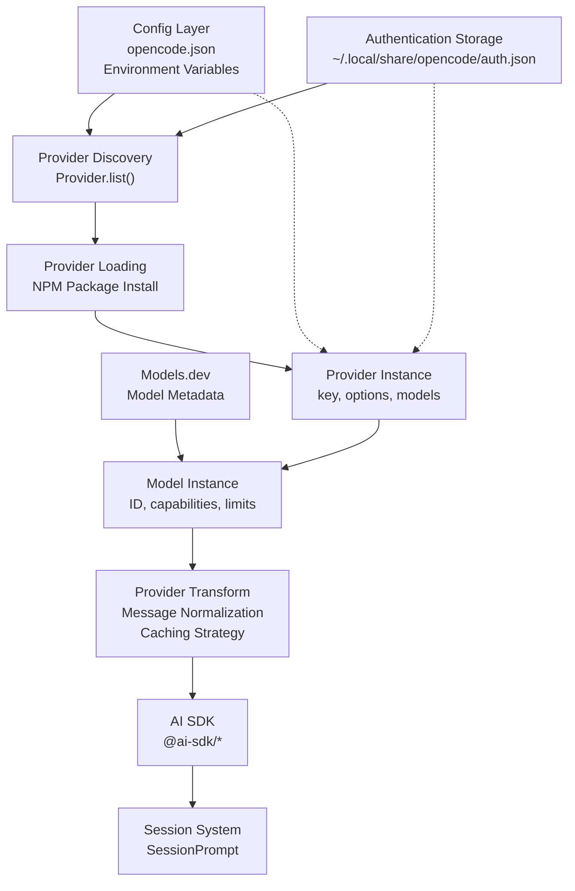
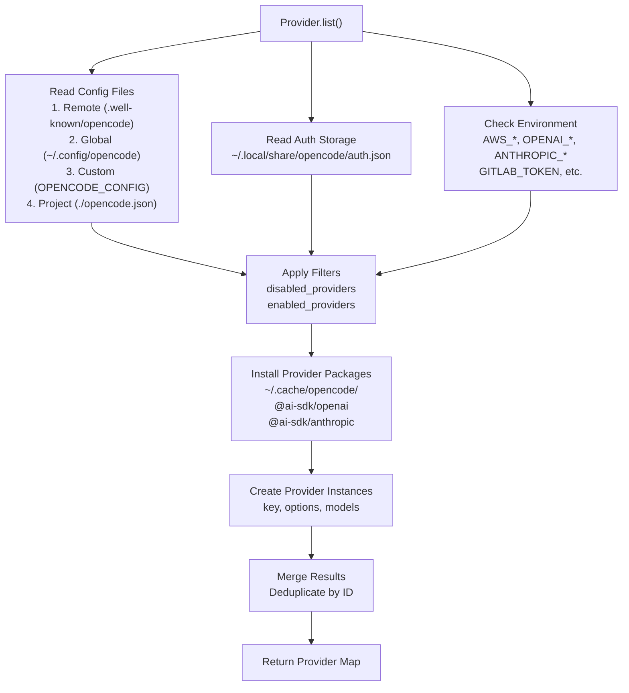
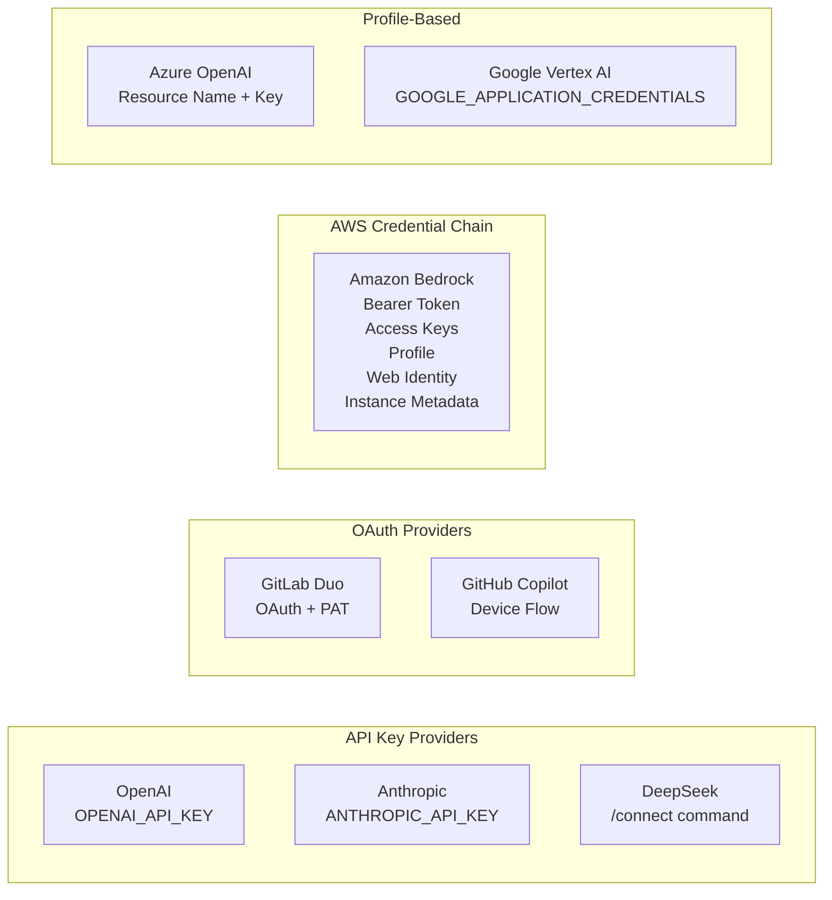
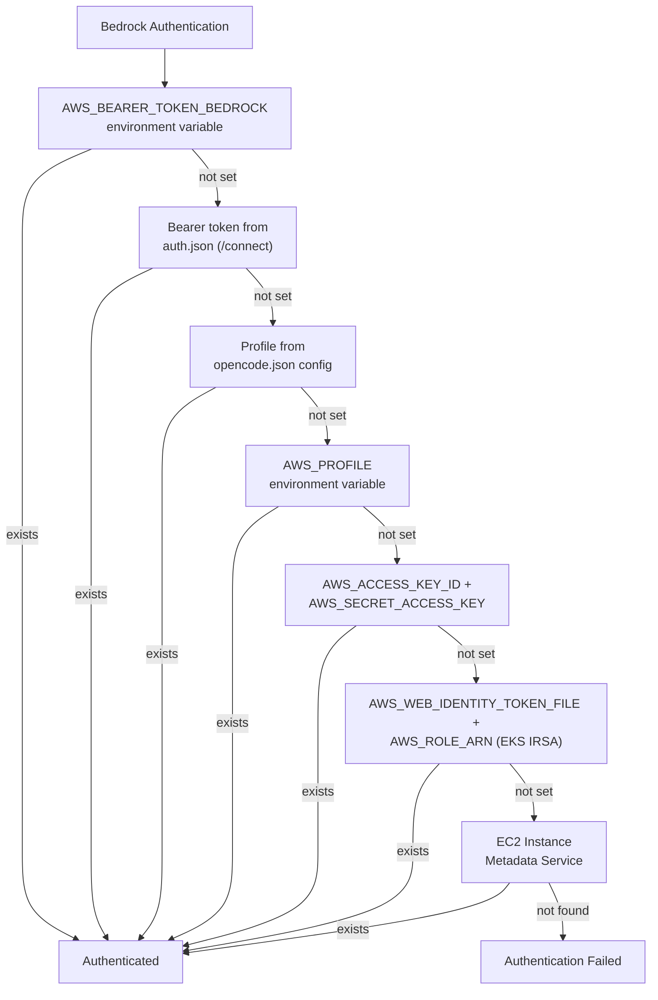
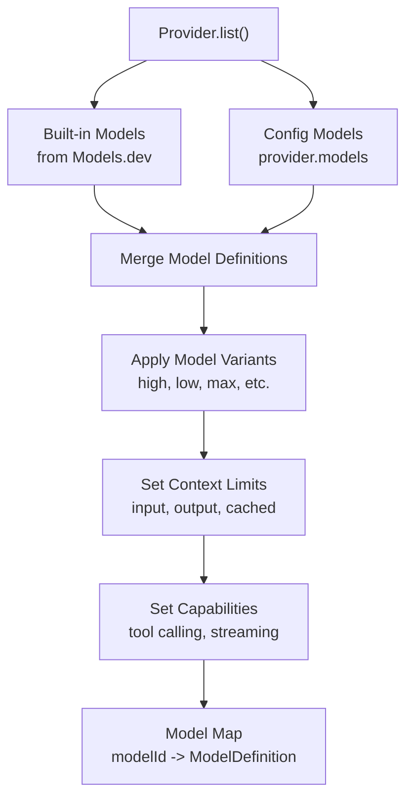
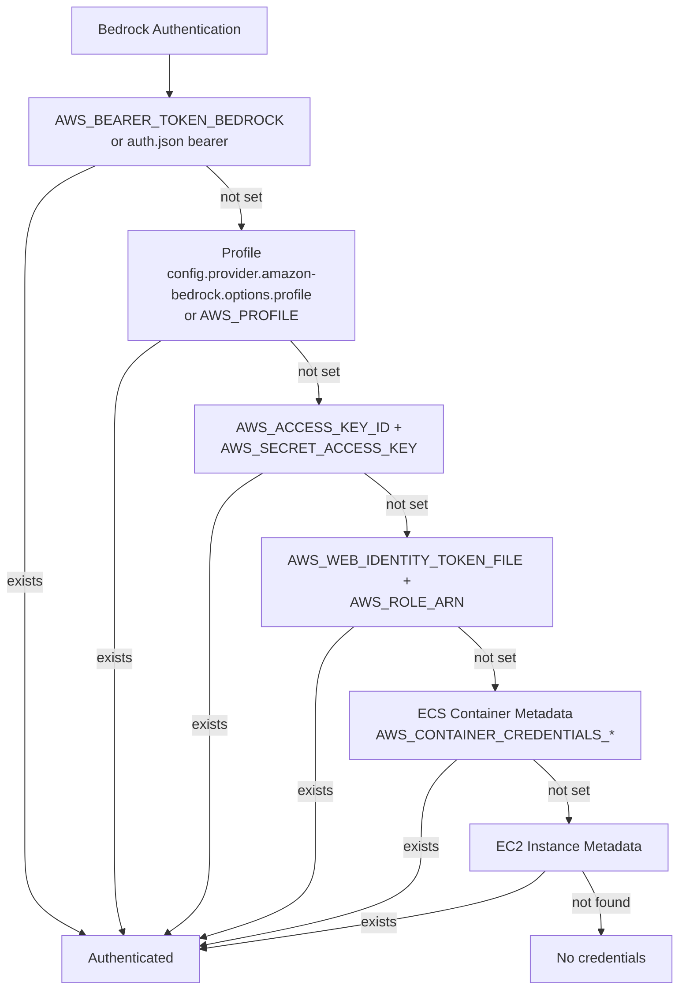
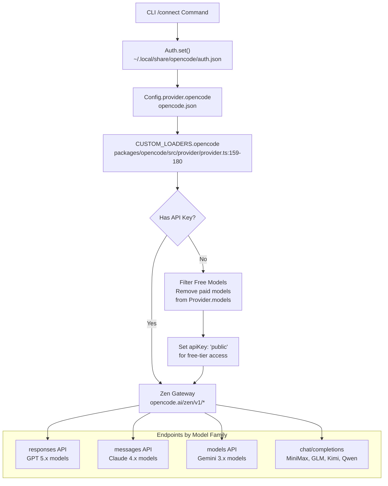
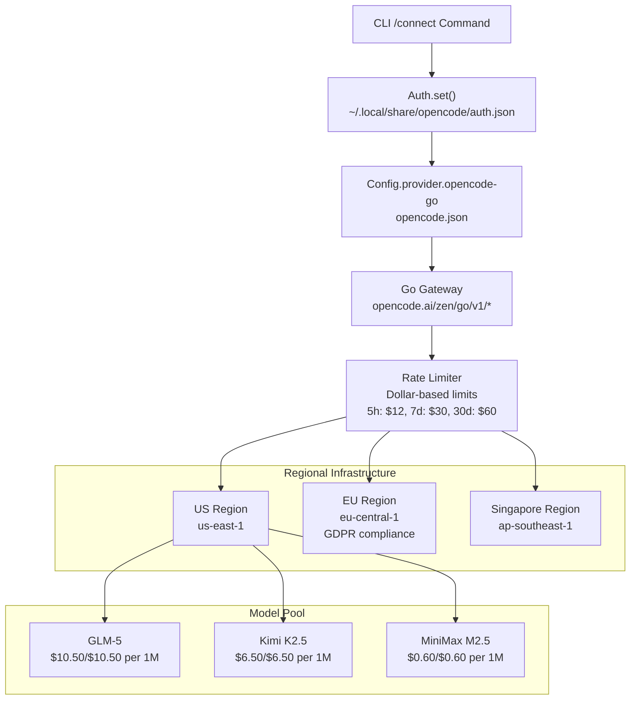
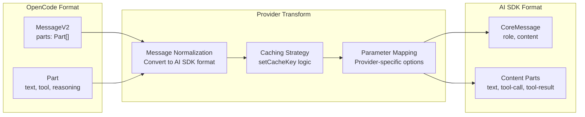

# Providers & Models

<details>
<summary>Relevant source files</summary>

The following files were used as context for generating this wiki page:

- [README.md](README.md)
- [packages/opencode/script/schema.ts](packages/opencode/script/schema.ts)
- [packages/opencode/src/auth/index.ts](packages/opencode/src/auth/index.ts)
- [packages/opencode/src/auth/service.ts](packages/opencode/src/auth/service.ts)
- [packages/opencode/src/cli/ui.ts](packages/opencode/src/cli/ui.ts)
- [packages/opencode/src/config/config.ts](packages/opencode/src/config/config.ts)
- [packages/opencode/src/env/index.ts](packages/opencode/src/env/index.ts)
- [packages/opencode/src/provider/error.ts](packages/opencode/src/provider/error.ts)
- [packages/opencode/src/provider/models.ts](packages/opencode/src/provider/models.ts)
- [packages/opencode/src/provider/provider.ts](packages/opencode/src/provider/provider.ts)
- [packages/opencode/src/provider/transform.ts](packages/opencode/src/provider/transform.ts)
- [packages/opencode/src/server/server.ts](packages/opencode/src/server/server.ts)
- [packages/opencode/src/session/compaction.ts](packages/opencode/src/session/compaction.ts)
- [packages/opencode/src/session/index.ts](packages/opencode/src/session/index.ts)
- [packages/opencode/src/session/llm.ts](packages/opencode/src/session/llm.ts)
- [packages/opencode/src/session/message-v2.ts](packages/opencode/src/session/message-v2.ts)
- [packages/opencode/src/session/message.ts](packages/opencode/src/session/message.ts)
- [packages/opencode/src/session/prompt.ts](packages/opencode/src/session/prompt.ts)
- [packages/opencode/src/session/revert.ts](packages/opencode/src/session/revert.ts)
- [packages/opencode/src/session/summary.ts](packages/opencode/src/session/summary.ts)
- [packages/opencode/src/tool/task.ts](packages/opencode/src/tool/task.ts)
- [packages/opencode/test/config/config.test.ts](packages/opencode/test/config/config.test.ts)
- [packages/opencode/test/provider/amazon-bedrock.test.ts](packages/opencode/test/provider/amazon-bedrock.test.ts)
- [packages/opencode/test/provider/gitlab-duo.test.ts](packages/opencode/test/provider/gitlab-duo.test.ts)
- [packages/opencode/test/provider/provider.test.ts](packages/opencode/test/provider/provider.test.ts)
- [packages/opencode/test/provider/transform.test.ts](packages/opencode/test/provider/transform.test.ts)
- [packages/opencode/test/session/llm.test.ts](packages/opencode/test/session/llm.test.ts)
- [packages/opencode/test/session/message-v2.test.ts](packages/opencode/test/session/message-v2.test.ts)
- [packages/opencode/test/session/revert-compact.test.ts](packages/opencode/test/session/revert-compact.test.ts)
- [packages/sdk/js/src/gen/sdk.gen.ts](packages/sdk/js/src/gen/sdk.gen.ts)
- [packages/sdk/js/src/gen/types.gen.ts](packages/sdk/js/src/gen/types.gen.ts)
- [packages/sdk/js/src/v2/gen/sdk.gen.ts](packages/sdk/js/src/v2/gen/sdk.gen.ts)
- [packages/sdk/js/src/v2/gen/types.gen.ts](packages/sdk/js/src/v2/gen/types.gen.ts)
- [packages/sdk/openapi.json](packages/sdk/openapi.json)
- [packages/web/src/components/Lander.astro](packages/web/src/components/Lander.astro)
- [packages/web/src/content/docs/go.mdx](packages/web/src/content/docs/go.mdx)
- [packages/web/src/content/docs/index.mdx](packages/web/src/content/docs/index.mdx)
- [packages/web/src/content/docs/providers.mdx](packages/web/src/content/docs/providers.mdx)
- [packages/web/src/content/docs/zen.mdx](packages/web/src/content/docs/zen.mdx)

</details>

This document describes OpenCode's provider and model system, including provider discovery, authentication, model selection, and the provider transform layer. It covers how OpenCode integrates with 75+ LLM providers through the AI SDK and Models.dev, and explains the curated services OpenCode Zen and OpenCode Go.

For information about configuring providers in your project, see [Configuration Options](#9.3). For TUI commands to manage providers and models, see [TUI Commands](#9.2).

---

## System Architecture

OpenCode's provider system abstracts away differences between LLM providers, allowing seamless switching between models from different vendors. The system is built on three key components: the AI SDK for provider integration, Models.dev for model metadata, and a provider transform layer for message normalization.

### High-Level Provider Flow



**Sources:** [packages/web/src/content/docs/providers.mdx:9-14](), [packages/web/src/content/docs/models.mdx:1-6](), [README.md:129-138]()

---

## Provider Discovery and Loading

OpenCode discovers and loads providers through a multi-stage process that checks configuration files, environment variables, and stored credentials.

### Provider Discovery Process

The `Provider.list()` function orchestrates provider discovery:



**Sources:** [packages/opencode/test/provider/amazon-bedrock.test.ts:12-42](), [packages/web/src/content/docs/providers.mdx:9-16](), [packages/web/src/content/docs/config.mdx:574-613]()

### Provider Configuration Precedence

Provider configuration is merged from multiple sources with later sources overriding earlier ones:

| Priority    | Source                | Location                             | Purpose                 |
| ----------- | --------------------- | ------------------------------------ | ----------------------- |
| 1 (Lowest)  | Remote Config         | `.well-known/opencode`               | Organizational defaults |
| 2           | Global Config         | `~/.config/opencode/opencode.json`   | User preferences        |
| 3           | Custom Config         | `OPENCODE_CONFIG` env var            | Override path           |
| 4           | Project Config        | `./opencode.json`                    | Project-specific        |
| 5           | Environment Variables | `OPENAI_API_KEY`, `AWS_REGION`, etc. | Runtime overrides       |
| 6           | Inline Config         | `OPENCODE_CONFIG_CONTENT` env var    | Inline JSON             |
| 7 (Highest) | Managed Config        | `/etc/opencode`                      | Enterprise policies     |

**Sources:** [packages/web/src/content/docs/config.mdx:42-56]()

### Provider Package Installation

Provider packages are dynamically installed from NPM and cached locally:

```json
{
  "provider": {
    "anthropic": {
      "npm": "@ai-sdk/anthropic"
    },
    "openai": {
      "npm": "@ai-sdk/openai"
    },
    "custom-local": {
      "npm": "@ai-sdk/openai-compatible",
      "options": {
        "baseURL": "http://localhost:11434/v1"
      }
    }
  }
}
```

Cache location: `~/.cache/opencode/` (or `%USERPROFILE%\.cache\opencode` on Windows)

**Sources:** [packages/web/src/content/docs/providers.mdx:1076-1111](), [packages/web/src/content/docs/troubleshooting.mdx:253-269]()

---

## Authentication System

OpenCode supports multiple authentication methods with a clear precedence order that varies by provider.

### Authentication Storage

Credentials are stored in `~/.local/share/opencode/auth.json` with different formats for different auth types:

```json
{
  "anthropic": {
    "type": "api",
    "key": "sk-ant-..."
  },
  "amazon-bedrock": {
    "type": "api",
    "key": "bearer-token-..."
  },
  "gitlab": {
    "type": "oauth",
    "access": "access-token",
    "refresh": "refresh-token",
    "expires": 1234567890
  }
}
```

**Sources:** [packages/web/src/content/docs/providers.mdx:18-22](), [packages/opencode/test/provider/amazon-bedrock.test.ts:69-135]()

### Authentication Methods by Provider

Different providers support different authentication mechanisms:



**Sources:** [packages/web/src/content/docs/providers.mdx:157-273](), [packages/web/src/content/docs/providers.mdx:679-825]()

### Amazon Bedrock Authentication Precedence

Amazon Bedrock has a specific authentication priority:



**Sources:** [packages/web/src/content/docs/providers.mdx:248-267](), [packages/opencode/test/provider/amazon-bedrock.test.ts:12-235](), [packages/web/src/content/docs/config.mdx:275-302]()

### GitLab Duo Authentication

GitLab supports both OAuth and Personal Access Token (PAT) authentication:

| Method | Environment Variable | Auth Storage Type                           | Notes                         |
| ------ | -------------------- | ------------------------------------------- | ----------------------------- |
| OAuth  | -                    | `oauth` with `access`, `refresh`, `expires` | Recommended, auto-refresh     |
| PAT    | `GITLAB_TOKEN`       | `api` with `key`                            | For self-hosted instances     |
| Config | -                    | `apiKey` in config options                  | Takes precedence over env var |

**Sources:** [packages/web/src/content/docs/providers.mdx:679-825](), [packages/opencode/test/provider/gitlab-duo.test.ts:1-263]()

---

## Model Discovery and Selection

OpenCode discovers models from providers using Models.dev metadata and provider-specific APIs.

### Model Identification Format

Models are identified using the format `provider_id/model_id`:

```
anthropic/claude-sonnet-4-5
openai/gpt-5.1-codex
opencode/gpt-5.3-codex
openrouter/google/gemini-2.5-flash
lmstudio/google/gemma-3n-e4b
```

**Sources:** [packages/web/src/content/docs/models.mdx:54-62](), [packages/web/src/content/docs/troubleshooting.mdx:214-230]()

### Model Discovery Flow



**Sources:** [packages/web/src/content/docs/models.mdx:68-106](), [packages/web/src/content/docs/models.mdx:138-197]()

### Model Configuration

Models can be configured globally in `opencode.json`:

```json
{
  "provider": {
    "openai": {
      "models": {
        "gpt-5": {
          "options": {
            "reasoningEffort": "high",
            "textVerbosity": "low",
            "reasoningSummary": "auto"
          },
          "variants": {
            "high": {
              "reasoningEffort": "high"
            },
            "low": {
              "reasoningEffort": "low"
            }
          }
        }
      }
    }
  }
}
```

**Sources:** [packages/web/src/content/docs/models.mdx:68-135](), [packages/web/src/content/docs/config.mdx:232-267]()

### Model Variants

Many models support variants with different configurations:

| Provider  | Variants                                            | Purpose                    |
| --------- | --------------------------------------------------- | -------------------------- |
| Anthropic | `high`, `max`                                       | Thinking budget levels     |
| OpenAI    | `none`, `minimal`, `low`, `medium`, `high`, `xhigh` | Reasoning effort levels    |
| Google    | `low`, `high`                                       | Effort/token budget levels |

Variants can be cycled using the `variant_cycle` keybind in the TUI.

**Sources:** [packages/web/src/content/docs/models.mdx:138-201]()

---

## Provider Directory

OpenCode supports 20+ LLM providers through the AI SDK. This section provides comprehensive reference information for each provider.

### Common Provider Options

All providers in the `Provider.BUNDLED_PROVIDERS` map support these base options:

```json
{
  "provider": {
    "<provider-id>": {
      "npm": "@ai-sdk/<package>",
      "options": {
        "timeout": 600000,
        "setCacheKey": true,
        "baseURL": "https://custom.endpoint.com/v1",
        "apiKey": "sk-..."
      }
    }
  }
}
```

| Option        | Type              | Default               | Description                                                                  |
| ------------- | ----------------- | --------------------- | ---------------------------------------------------------------------------- |
| `timeout`     | `number \| false` | `300000`              | Request timeout in milliseconds (5 minutes), or `false` to disable           |
| `setCacheKey` | `boolean`         | `false`               | Ensure cache key is set for provider (affects `ProviderTransform.options()`) |
| `baseURL`     | `string`          | Provider default      | Custom base URL for proxy or VPC endpoints                                   |
| `apiKey`      | `string`          | From auth.json or env | Override API key from configuration                                          |

**Sources:** [packages/opencode/src/provider/provider.ts:50-661](), [packages/opencode/src/provider/transform.ts:1-662]()

---

### Anthropic (Claude)

**Provider ID:** `anthropic`  
**NPM Package:** `@ai-sdk/anthropic`  
**Endpoint:** `https://api.anthropic.com/v1`

#### Authentication

```bash
# Environment variable
export ANTHROPIC_API_KEY=sk-ant-...

# Or use /connect command
/connect
# Select "Anthropic" and enter API key
```

Storage location: `~/.local/share/opencode/auth.json` with type `"api"` and key field.

#### Custom Headers

The `CUSTOM_LOADERS.anthropic` function sets default headers:

```json
{
  "provider": {
    "anthropic": {
      "options": {
        "headers": {
          "anthropic-beta": "claude-code-20250219,interleaved-thinking-2025-05-14,fine-grained-tool-streaming-2025-05-14"
        }
      }
    }
  }
}
```

#### Model IDs

```
anthropic/claude-opus-4-6
anthropic/claude-opus-4-5
anthropic/claude-opus-4-1
anthropic/claude-sonnet-4-6
anthropic/claude-sonnet-4-5
anthropic/claude-sonnet-4
anthropic/claude-haiku-4-5
anthropic/claude-3-5-haiku
```

**Sources:** [packages/opencode/src/provider/provider.ts:147-158](), [packages/web/src/content/docs/providers.mdx:294-333]()

---

### Amazon Bedrock

**Provider ID:** `amazon-bedrock`  
**NPM Package:** `@ai-sdk/amazon-bedrock`  
**Custom Loader:** `CUSTOM_LOADERS["amazon-bedrock"]`

#### Authentication Hierarchy



#### Configuration Options

```json
{
  "provider": {
    "amazon-bedrock": {
      "options": {
        "region": "us-east-1",
        "profile": "my-aws-profile",
        "endpoint": "https://bedrock-runtime.us-east-1.vpce-xxxxx.amazonaws.com"
      }
    }
  }
}
```

| Option     | Type     | Precedence                            | Description                             |
| ---------- | -------- | ------------------------------------- | --------------------------------------- |
| `region`   | `string` | Config > `AWS_REGION` > `"us-east-1"` | AWS region for Bedrock API              |
| `profile`  | `string` | Config > `AWS_PROFILE`                | Named profile from `~/.aws/credentials` |
| `endpoint` | `string` | Config (alias for `baseURL`)          | Custom VPC endpoint URL                 |

#### Cross-Region Inference Profiles

The `getModel()` function in the custom loader handles region prefixing:

| Prefix    | Regions                            | Example Model ID                                 |
| --------- | ---------------------------------- | ------------------------------------------------ |
| `us.`     | `us-*` (except `us-gov-*`)         | `us.anthropic.claude-opus-4-5-20251101-v1:0`     |
| `eu.`     | `eu-*`                             | `eu.anthropic.claude-sonnet-4-20250514-v1:0`     |
| `jp.`     | `ap-northeast-1`                   | `jp.anthropic.claude-sonnet-4-20250514-v1:0`     |
| `apac.`   | Other `ap-*` (except AU)           | `apac.anthropic.claude-sonnet-4-20250514-v1:0`   |
| `au.`     | `ap-southeast-2`, `ap-southeast-4` | `au.anthropic.claude-sonnet-4-5-20250929-v1:0`   |
| `global.` | Pre-configured cross-region        | `global.anthropic.claude-opus-4-5-20251101-v1:0` |

Models with prefixes are passed through without modification. Models without prefixes get region-specific prefixes based on the configured region.

**Sources:** [packages/opencode/src/provider/provider.ts:242-389](), [packages/opencode/test/provider/amazon-bedrock.test.ts:12-446]()

---

### Azure OpenAI

**Provider ID:** `azure`  
**NPM Package:** `@ai-sdk/azure`  
**Custom Loader:** `CUSTOM_LOADERS.azure`

#### Environment Variables

```bash
export AZURE_RESOURCE_NAME=your-resource-name
export AZURE_API_KEY=your-api-key
```

#### Configuration

```json
{
  "provider": {
    "azure": {
      "options": {
        "resourceName": "your-resource-name",
        "useCompletionUrls": false
      }
    }
  }
}
```

| Option              | Type      | Default               | Description                                  |
| ------------------- | --------- | --------------------- | -------------------------------------------- |
| `resourceName`      | `string`  | `AZURE_RESOURCE_NAME` | Azure OpenAI resource name                   |
| `useCompletionUrls` | `boolean` | `false`               | Use completion URLs instead of responses API |

**Important:** The deployment name must match the model ID for OpenCode to work correctly. The custom loader's `getModel()` function calls `sdk.responses(modelID)` or `sdk.chat(modelID)` based on `useCompletionUrls`.

**Sources:** [packages/opencode/src/provider/provider.ts:200-224](), [packages/web/src/content/docs/providers.mdx:334-382]()

---

### Azure Cognitive Services

**Provider ID:** `azure-cognitive-services`  
**NPM Package:** `@ai-sdk/azure`  
**Custom Loader:** `CUSTOM_LOADERS["azure-cognitive-services"]`

#### Environment Variables

```bash
export AZURE_COGNITIVE_SERVICES_RESOURCE_NAME=your-resource-name
export AZURE_API_KEY=your-api-key
```

#### Configuration

The custom loader sets `baseURL` automatically:

```json
{
  "provider": {
    "azure-cognitive-services": {
      "options": {
        "useCompletionUrls": false
      }
    }
  }
}
```

Base URL format: `https://{resourceName}.cognitiveservices.azure.com/openai`

**Sources:** [packages/opencode/src/provider/provider.ts:225-241]()

---

### Google Gemini

**Provider ID:** `google`  
**NPM Package:** `@ai-sdk/google`  
**Endpoint:** `https://generativelanguage.googleapis.com/v1beta`

#### Authentication

```bash
export GOOGLE_GENERATIVE_AI_API_KEY=your-api-key
```

#### Model IDs

```
google/gemini-3.1-pro
google/gemini-3-flash
google/gemini-2.5-flash
google/gemini-2.5-pro
google/gemini-2-flash
```

**Sources:** [packages/opencode/src/provider/provider.ts:109-132](), [packages/web/src/content/docs/providers.mdx:826-862]()

---

### Google Vertex AI

**Provider ID:** `google-vertex`  
**NPM Package:** `@ai-sdk/google-vertex`  
**Custom Loader:** `CUSTOM_LOADERS["google-vertex"]`

#### Environment Variables

```bash
export GOOGLE_CLOUD_PROJECT=your-project-id
export VERTEX_LOCATION=global
export GOOGLE_APPLICATION_CREDENTIALS=/path/to/service-account.json
```

#### Configuration

```json
{
  "provider": {
    "google-vertex": {
      "options": {
        "project": "your-project-id",
        "location": "global"
      }
    }
  }
}
```

| Option     | Type     | Precedence                                                              | Description      |
| ---------- | -------- | ----------------------------------------------------------------------- | ---------------- |
| `project`  | `string` | Config > `GOOGLE_CLOUD_PROJECT` > `GCP_PROJECT` > `GCLOUD_PROJECT`      | GCP project ID   |
| `location` | `string` | Config > `GOOGLE_VERTEX_LOCATION` > `VERTEX_LOCATION` > `"us-central1"` | Vertex AI region |

The custom loader sets up automatic authentication using `GoogleAuth` and injects bearer tokens via a custom `fetch()` function.

**Sources:** [packages/opencode/src/provider/provider.ts:412-458](), [packages/web/src/content/docs/providers.mdx:863-904]()

---

### Google Vertex AI (Anthropic)

**Provider ID:** `google-vertex-anthropic`  
**NPM Package:** `@ai-sdk/google-vertex/anthropic`  
**Custom Loader:** `CUSTOM_LOADERS["google-vertex-anthropic"]`

#### Environment Variables

```bash
export GOOGLE_CLOUD_PROJECT=your-project-id
export VERTEX_LOCATION=global
export GOOGLE_APPLICATION_CREDENTIALS=/path/to/service-account.json
```

Provides access to Anthropic models through Vertex AI with the same authentication as Google Vertex AI.

**Sources:** [packages/opencode/src/provider/provider.ts:459-475]()

---

### OpenAI

**Provider ID:** `openai`  
**NPM Package:** `@ai-sdk/openai`  
**Custom Loader:** `CUSTOM_LOADERS.openai`

#### Authentication

```bash
export OPENAI_API_KEY=sk-...
```

#### Model API Selection

The custom loader's `getModel()` function selects the appropriate API:

```typescript
async getModel(sdk: any, modelID: string) {
  return sdk.responses(modelID)
}
```

All OpenAI models use the responses API by default.

#### Model IDs

```
openai/gpt-5.4-pro
openai/gpt-5.4
openai/gpt-5.3-codex
openai/gpt-5.3-codex-spark
openai/gpt-5.2
openai/gpt-5.2-codex
openai/gpt-5.1
openai/gpt-5.1-codex
openai/gpt-5.1-codex-max
openai/gpt-5.1-codex-mini
openai/gpt-5
openai/gpt-5-codex
openai/gpt-5-nano
openai/gpt-4o
openai/gpt-4o-mini
```

**Sources:** [packages/opencode/src/provider/provider.ts:181-189](), [packages/web/src/content/docs/providers.mdx:905-927]()

---

### OpenRouter

**Provider ID:** `openrouter`  
**NPM Package:** `@openrouter/ai-sdk-provider`  
**Custom Loader:** `CUSTOM_LOADERS.openrouter`

#### Authentication

```bash
export OPENROUTER_API_KEY=sk-or-...
```

#### Custom Headers

```json
{
  "provider": {
    "openrouter": {
      "options": {
        "headers": {
          "HTTP-Referer": "https://opencode.ai/",
          "X-Title": "opencode"
        }
      }
    }
  }
}
```

These headers help OpenRouter track usage from OpenCode.

**Sources:** [packages/opencode/src/provider/provider.ts:390-400](), [packages/web/src/content/docs/providers.mdx:928-958]()

---

### xAI (Grok)

**Provider ID:** `xai`  
**NPM Package:** `@ai-sdk/xai`  
**Endpoint:** `https://api.x.ai/v1`

#### Authentication

```bash
export XAI_API_KEY=xai-...
```

#### Model IDs

```
xai/grok-3
xai/grok-3-mini
xai/grok-2
```

**Sources:** [packages/opencode/src/provider/provider.ts:109-132](), [packages/web/src/content/docs/providers.mdx:1067-1087]()

---

### Mistral AI

**Provider ID:** `mistral`  
**NPM Package:** `@ai-sdk/mistral`

#### Authentication

```bash
export MISTRAL_API_KEY=...
```

#### Model IDs

```
mistral/mistral-large
mistral/mistral-medium
mistral/mistral-small
mistral/codestral
```

**Sources:** [packages/opencode/src/provider/provider.ts:109-132]()

---

### Groq

**Provider ID:** `groq`  
**NPM Package:** `@ai-sdk/groq`  
**Endpoint:** `https://api.groq.com/openai/v1`

#### Authentication

```bash
export GROQ_API_KEY=gsk_...
```

#### Model IDs

```
groq/llama-3.3-70b-versatile
groq/llama-3.1-70b-versatile
groq/mixtral-8x7b-32768
```

**Sources:** [packages/opencode/src/provider/provider.ts:109-132](), [packages/web/src/content/docs/providers.mdx:836-862]()

---

### DeepInfra

**Provider ID:** `deepinfra`  
**NPM Package:** `@ai-sdk/deepinfra`

#### Authentication

```bash
export DEEPINFRA_API_KEY=...
```

**Sources:** [packages/opencode/src/provider/provider.ts:109-132]()

---

### Cerebras

**Provider ID:** `cerebras`  
**NPM Package:** `@ai-sdk/cerebras`  
**Custom Loader:** `CUSTOM_LOADERS.cerebras`

#### Authentication

```bash
export CEREBRAS_API_KEY=...
```

#### Custom Headers

```json
{
  "provider": {
    "cerebras": {
      "options": {
        "headers": {
          "X-Cerebras-3rd-Party-Integration": "opencode"
        }
      }
    }
  }
}
```

**Sources:** [packages/opencode/src/provider/provider.ts:640-649]()

---

### Cohere

**Provider ID:** `cohere`  
**NPM Package:** `@ai-sdk/cohere`

#### Authentication

```bash
export COHERE_API_KEY=...
```

**Sources:** [packages/opencode/src/provider/provider.ts:109-132]()

---

### Together AI

**Provider ID:** `togetherai`  
**NPM Package:** `@ai-sdk/togetherai`

#### Authentication

```bash
export TOGETHER_AI_API_KEY=...
```

**Sources:** [packages/opencode/src/provider/provider.ts:109-132]()

---

### Perplexity

**Provider ID:** `perplexity`  
**NPM Package:** `@ai-sdk/perplexity`

#### Authentication

```bash
export PERPLEXITY_API_KEY=pplx-...
```

**Sources:** [packages/opencode/src/provider/provider.ts:109-132]()

---

### Vercel AI

**Provider ID:** `vercel`  
**NPM Package:** `@ai-sdk/vercel`  
**Custom Loader:** `CUSTOM_LOADERS.vercel`

#### Authentication

```bash
export VERCEL_API_KEY=...
```

#### Custom Headers

```json
{
  "provider": {
    "vercel": {
      "options": {
        "headers": {
          "http-referer": "https://opencode.ai/",
          "x-title": "opencode"
        }
      }
    }
  }
}
```

**Sources:** [packages/opencode/src/provider/provider.ts:401-411]()

---

### GitHub Copilot

**Provider ID:** `github-copilot`  
**NPM Package:** Custom OpenAI-compatible provider  
**Custom Loader:** `CUSTOM_LOADERS["github-copilot"]`

#### Authentication

Requires GitHub Copilot subscription and authentication through GitHub CLI:

```bash
gh auth login
```

#### Model API Selection

The custom loader determines which API to use based on model ID:

```typescript
async getModel(sdk: any, modelID: string) {
  if (useLanguageModel(sdk)) return sdk.languageModel(modelID)
  return shouldUseCopilotResponsesApi(modelID)
    ? sdk.responses(modelID)
    : sdk.chat(modelID)
}
```

Models with `gpt-5` or higher use the responses API.

**Sources:** [packages/opencode/src/provider/provider.ts:55-59](), [packages/opencode/src/provider/provider.ts:190-199]()

---

### GitLab Duo

**Provider ID:** `gitlab`  
**NPM Package:** `@gitlab/gitlab-ai-provider`  
**Custom Loader:** `CUSTOM_LOADERS.gitlab`

#### Authentication Options

| Method | Environment Variable | Config Option | Type                                        |
| ------ | -------------------- | ------------- | ------------------------------------------- |
| OAuth  | -                    | -             | `oauth` with `access`, `refresh`, `expires` |
| PAT    | `GITLAB_TOKEN`       | -             | `api` with `key`                            |
| Config | -                    | `apiKey`      | Inline API key                              |

#### Configuration

```json
{
  "provider": {
    "gitlab": {
      "options": {
        "instanceUrl": "https://gitlab.example.com",
        "aiGatewayHeaders": {},
        "featureFlags": {
          "duo_agent_platform_agentic_chat": true,
          "duo_agent_platform": true
        }
      }
    }
  }
}
```

| Option             | Type     | Default                                         | Description                        |
| ------------------ | -------- | ----------------------------------------------- | ---------------------------------- |
| `instanceUrl`      | `string` | `GITLAB_INSTANCE_URL` or `"https://gitlab.com"` | GitLab instance URL                |
| `aiGatewayHeaders` | `object` | Custom User-Agent + `anthropic-beta`            | Headers for AI gateway             |
| `featureFlags`     | `object` | `{}`                                            | Feature flags for Duo capabilities |

The custom loader's `getModel()` function calls `sdk.agenticChat(modelID, { ... })` to enable agentic chat features.

**Sources:** [packages/opencode/src/provider/provider.ts:511-553](), [packages/web/src/content/docs/providers.mdx:679-825]()

---

### SAP AI Core

**Provider ID:** `sap-ai-core`  
**NPM Package:** Custom provider  
**Custom Loader:** `CUSTOM_LOADERS["sap-ai-core"]`

#### Environment Variables

```bash
export AICORE_SERVICE_KEY='{"clientid":"...","clientsecret":"...","url":"..."}'
export AICORE_DEPLOYMENT_ID=your-deployment-id
export AICORE_RESOURCE_GROUP=your-resource-group
```

The custom loader checks `AICORE_SERVICE_KEY` environment variable or auth.json bearer token.

**Sources:** [packages/opencode/src/provider/provider.ts:476-499]()

---

### Cloudflare Workers AI

**Provider ID:** `cloudflare-workers-ai`  
**NPM Package:** `@ai-sdk/cloudflare`  
**Custom Loader:** `CUSTOM_LOADERS["cloudflare-workers-ai"]`

#### Environment Variables

```bash
export CLOUDFLARE_ACCOUNT_ID=your-account-id
export CLOUDFLARE_API_KEY=your-api-key
```

**Sources:** [packages/opencode/src/provider/provider.ts:554-580]()

---

### Cloudflare AI Gateway

**Provider ID:** `cloudflare-ai-gateway`  
**NPM Package:** `ai-gateway-provider`  
**Custom Loader:** `CUSTOM_LOADERS["cloudflare-ai-gateway"]`

#### Environment Variables

```bash
export CLOUDFLARE_ACCOUNT_ID=your-account-id
export CLOUDFLARE_GATEWAY_ID=your-gateway-id
export CLOUDFLARE_API_TOKEN=your-api-token
# Alternative: CF_AIG_TOKEN
```

#### Configuration

```json
{
  "provider": {
    "cloudflare-ai-gateway": {
      "options": {
        "metadata": {},
        "cacheTtl": 3600,
        "cacheKey": "custom-key",
        "skipCache": false,
        "collectLog": true
      }
    }
  }
}
```

The custom loader uses the Unified API format for model IDs: `provider/model` (e.g., `anthropic/claude-sonnet-4-5`).

**Sources:** [packages/opencode/src/provider/provider.ts:581-639]()

---

### Local Providers (Ollama, LM Studio, llama.cpp)

#### Ollama

**Provider ID:** `ollama`  
**NPM Package:** `@ai-sdk/openai-compatible`  
**Default Endpoint:** `http://localhost:11434/v1`

```json
{
  "provider": {
    "ollama": {
      "npm": "@ai-sdk/openai-compatible",
      "options": {
        "baseURL": "http://localhost:11434/v1"
      },
      "models": {
        "llama3": {
          "id": "llama3"
        }
      }
    }
  }
}
```

#### LM Studio

**Provider ID:** `lmstudio`  
**NPM Package:** `@ai-sdk/openai-compatible`  
**Default Endpoint:** `http://localhost:1234/v1`

```json
{
  "provider": {
    "lmstudio": {
      "npm": "@ai-sdk/openai-compatible",
      "options": {
        "baseURL": "http://localhost:1234/v1"
      }
    }
  }
}
```

#### llama.cpp

**Provider ID:** `llama-cpp`  
**NPM Package:** `@ai-sdk/openai-compatible`  
**Default Endpoint:** `http://localhost:8080/v1`

```json
{
  "provider": {
    "llama-cpp": {
      "npm": "@ai-sdk/openai-compatible",
      "options": {
        "baseURL": "http://localhost:8080/v1"
      }
    }
  }
}
```

**Sources:** [packages/web/src/content/docs/providers.mdx:959-1003]()

---

### Chinese Model Providers

#### DeepSeek

**Provider ID:** `deepseek`  
**Endpoint:** `https://api.deepseek.com/v1`

```bash
export DEEPSEEK_API_KEY=sk-...
```

#### Zhipu AI (GLM)

**Provider ID:** `zhipuai`  
**Endpoint:** `https://open.bigmodel.cn/api/paas/v4`

```bash
export ZHIPUAI_API_KEY=...
```

#### Moonshot AI (Kimi)

**Provider ID:** `moonshot`  
**Endpoint:** `https://api.moonshot.cn/v1`

```bash
export MOONSHOT_API_KEY=sk-...
```

#### MiniMax

**Provider ID:** `minimax`  
**Endpoint:** `https://api.minimax.chat/v1`

```bash
export MINIMAX_API_KEY=...
export MINIMAX_GROUP_ID=...
```

#### Alibaba Cloud (Qwen)

**Provider ID:** `alibaba`  
**Endpoint:** `https://dashscope.aliyuncs.com/compatible-mode/v1`

```bash
export ALIBABA_CLOUD_API_KEY=sk-...
```

**Sources:** [packages/web/src/content/docs/providers.mdx:424-678]()

---

## OpenCode Zen

OpenCode Zen is a curated AI gateway providing tested and verified models optimized for coding agents. It is implemented as the `opencode` provider.

### System Architecture



### Provider ID and Model ID Format

**Provider ID:** `opencode`  
**Model ID Format:** `opencode/<model-name>`

```
opencode/gpt-5.4-pro
opencode/gpt-5.3-codex
opencode/claude-opus-4-6
opencode/claude-sonnet-4-6
opencode/gemini-3.1-pro
opencode/gemini-3-flash
opencode/minimax-m2.5
opencode/glm-5
opencode/kimi-k2.5
opencode/qwen-max
opencode/big-pickle
opencode/gpt-5-nano
```

### Authentication and Free Tier Logic

The `CUSTOM_LOADERS.opencode` function implements conditional model availability:

```typescript
async opencode(input) {
  const hasKey = await (async () => {
    const env = Env.all()
    if (input.env.some((item) => env[item])) return true
    if (await Auth.get(input.id)) return true
    const config = await Config.get()
    if (config.provider?.["opencode"]?.options?.apiKey) return true
    return false
  })()

  if (!hasKey) {
    // Filter out paid models (models with cost.input > 0)
    for (const [key, value] of Object.entries(input.models)) {
      if (value.cost.input === 0) continue
      delete input.models[key]
    }
  }

  return {
    autoload: Object.keys(input.models).length > 0,
    options: hasKey ? {} : { apiKey: "public" },
  }
}
```

**Free Models:** When no API key is present, only models with `cost.input === 0` remain available. These include `big-pickle`, `minimax-m2.5-free`, and `gpt-5-nano`.

**Sources:** [packages/opencode/src/provider/provider.ts:159-180](), [packages/web/src/content/docs/zen.mdx:44-106]()

### Zen Endpoints

Zen uses different endpoint patterns based on model family:

| Model Family   | Endpoint Path              | AI SDK Package              | Example Model ID             |
| -------------- | -------------------------- | --------------------------- | ---------------------------- |
| GPT 5.x        | `/zen/v1/responses`        | `@ai-sdk/openai`            | `opencode/gpt-5.3-codex`     |
| Claude 4.x     | `/zen/v1/messages`         | `@ai-sdk/anthropic`         | `opencode/claude-sonnet-4-6` |
| Gemini 3.x     | `/zen/v1/models/gemini-*`  | `@ai-sdk/google`            | `opencode/gemini-3.1-pro`    |
| Chinese Models | `/zen/v1/chat/completions` | `@ai-sdk/openai-compatible` | `opencode/minimax-m2.5`      |

Base URL: `https://opencode.ai`

**Sources:** [packages/web/src/content/docs/zen.mdx:61-102]()

### Pricing Model

Zen uses pay-as-you-go pricing with automatic credit reload:

| Feature                 | Value                                           |
| ----------------------- | ----------------------------------------------- |
| Pricing Model           | Per-token (per 1M input/output tokens)          |
| Auto-reload Threshold   | $5 balance                                      |
| Auto-reload Amount      | $20                                             |
| Credit Card Fee         | 4.4% + $0.30 per transaction                    |
| Monthly Spending Limits | Optional (per workspace, per member)            |
| Free Models             | `big-pickle`, `minimax-m2.5-free`, `gpt-5-nano` |

**Pricing Examples:**

| Model             | Input (per 1M) | Output (per 1M) | Cache Read (per 1M) | Cache Write (per 1M) |
| ----------------- | -------------- | --------------- | ------------------- | -------------------- |
| GPT 5.3 Codex     | $3.00          | $15.00          | -                   | -                    |
| Claude Sonnet 4.6 | $3.00          | $15.00          | $0.30               | $3.75                |
| Gemini 3.1 Pro    | $0.00          | $0.00           | -                   | -                    |
| MiniMax M2.5      | $0.60          | $0.60           | -                   | -                    |
| GLM-5             | $10.50         | $10.50          | -                   | -                    |

**Sources:** [packages/web/src/content/docs/zen.mdx:119-198]()

### Zen for Teams (Workspace Features)

Workspaces enable team collaboration with role-based access control:

| Feature                   | Description                              | Role Requirement |
| ------------------------- | ---------------------------------------- | ---------------- |
| Workspace Creation        | Create shared billing entity             | Any user         |
| Member Invitations        | Invite team members                      | Admin            |
| Role Management           | Assign Admin or Member roles             | Admin            |
| Monthly Spending Limits   | Set per-member and workspace-wide limits | Admin            |
| Model Access Control      | Enable/disable specific models           | Admin            |
| Bring Your Own Key (BYOK) | Use personal OpenAI/Anthropic keys       | Member           |
| API Key Management        | Create/delete own API keys               | Member           |

**Roles:**

- **Admin:** Full workspace management, billing, member management, model access control
- **Member:** Manage own API keys and usage within assigned limits

**Sources:** [packages/web/src/content/docs/zen.mdx:225-278]()

---

## OpenCode Go

OpenCode Go is a $10/month subscription providing unlimited access to curated open coding models. It is implemented as the `opencode-go` provider.

### System Architecture



### Provider ID and Model ID Format

**Provider ID:** `opencode-go`  
**Model ID Format:** `opencode-go/<model-name>`

```
opencode-go/glm-5
opencode-go/kimi-k2.5
opencode-go/minimax-m2.5
```

**Sources:** [packages/web/src/content/docs/go.mdx:118-129]()

### Subscription Model

| Feature          | Value                                       |
| ---------------- | ------------------------------------------- |
| Monthly Cost     | $10 USD                                     |
| Billing Cycle    | Calendar month                              |
| Cancellation     | Instant, access until end of billing period |
| Regional Support | US, EU, Singapore                           |

### Usage Limits (Dollar-Based)

Go uses dollar-value limits instead of request counts:

| Time Period | Dollar Limit | GLM-5 Requests | Kimi K2.5 Requests | MiniMax M2.5 Requests |
| ----------- | ------------ | -------------- | ------------------ | --------------------- |
| 5 hours     | $12.00       | ~1,150         | ~1,850             | ~20,000               |
| 7 days      | $30.00       | ~2,880         | ~4,630             | ~50,000               |
| 30 days     | $60.00       | ~5,750         | ~9,250             | ~100,000              |

**Request estimates** assume 100K input + 1K output tokens per request.

**Fallback Behavior:**

1. When limits are reached, paid Go models become unavailable
2. Free Zen models (`big-pickle`, `minimax-m2.5-free`, `gpt-5-nano`) remain available
3. If "Use balance" is enabled in settings, requests fall back to Zen pay-as-you-go balance

**Sources:** [packages/web/src/content/docs/go.mdx:46-113]()

### Model Pricing (for Context)

Even though Go is subscription-based, understanding model costs helps explain limits:

| Model        | Input (per 1M tokens) | Output (per 1M tokens) |
| ------------ | --------------------- | ---------------------- |
| GLM-5        | $10.50                | $10.50                 |
| Kimi K2.5    | $6.50                 | $6.50                  |
| MiniMax M2.5 | $0.60                 | $0.60                  |

The dollar-based limits allow flexible usage across models with different costs.

**Sources:** [packages/web/src/content/docs/go.mdx:74-113]()

---

## Provider Transform Layer

The provider transform layer normalizes messages between OpenCode's internal format and provider-specific formats.

### Transform Responsibilities



**Sources:** [packages/web/src/content/docs/config.mdx:247-267]()

### Message Normalization

The transform layer handles:

1. **Message Structure Conversion** - OpenCode's `MessageV2` with `Part[]` to AI SDK's `CoreMessage` format
2. **Tool Call Formatting** - Provider-specific tool call syntax (OpenAI vs Anthropic vs Google)
3. **Reasoning Content** - Extended thinking blocks for models that support reasoning
4. **Attachment Handling** - Image and file attachments in provider-specific formats

### Caching Strategies

Different providers have different caching mechanisms:

| Provider  | Caching Mechanism                     | Config Option       |
| --------- | ------------------------------------- | ------------------- |
| Anthropic | Prompt caching with cache breakpoints | `setCacheKey: true` |
| OpenAI    | Prompt caching (automatic)            | Native support      |
| Google    | Context caching                       | Native support      |
| Others    | No caching                            | N/A                 |

The `setCacheKey` option ensures cache breakpoints are set for providers that support it:

```json
{
  "provider": {
    "anthropic": {
      "options": {
        "setCacheKey": true
      }
    }
  }
}
```

**Sources:** [packages/web/src/content/docs/config.mdx:247-267]()

### Cross-Region Inference Profiles (Bedrock)

For Amazon Bedrock, the transform layer handles cross-region inference profile prefixes:

```
global.anthropic.claude-opus-4-5-20251101-v1:0
us.anthropic.claude-opus-4-5-20251101-v1:0
eu.anthropic.claude-opus-4-5-20251101-v1:0
jp.anthropic.claude-sonnet-4-20250514-v1:0
apac.anthropic.claude-sonnet-4-20250514-v1:0
au.anthropic.claude-sonnet-4-5-20250929-v1:0
```

Models with these prefixes are passed through without modification. Models without prefixes in US regions get `us.` prepended.

**Sources:** [packages/opencode/test/provider/amazon-bedrock.test.ts:237-446]()

---

## Configuration Reference

### Provider Configuration Schema

```json
{
  "$schema": "https://opencode.ai/config.json",
  "provider": {
    "<provider-id>": {
      "npm": "<npm-package>",
      "name": "<display-name>",
      "options": {
        "baseURL": "<url>",
        "timeout": 600000,
        "setCacheKey": true,
        "apiKey": "<api-key>"
      },
      "models": {
        "<model-id>": {
          "id": "<override-id>",
          "name": "<display-name>",
          "options": {},
          "variants": {
            "<variant-name>": {}
          },
          "limit": {
            "context": 128000,
            "output": 65536
          }
        }
      }
    }
  },
  "model": "<provider-id>/<model-id>",
  "small_model": "<provider-id>/<model-id>",
  "disabled_providers": ["<provider-id>"],
  "enabled_providers": ["<provider-id>"]
}
```

**Sources:** [packages/web/src/content/docs/config.mdx:232-267](), [packages/web/src/content/docs/models.mdx:54-106]()

### Environment Variables

Common environment variables for providers:

| Variable                         | Provider         | Purpose                    |
| -------------------------------- | ---------------- | -------------------------- |
| `OPENAI_API_KEY`                 | OpenAI           | API authentication         |
| `ANTHROPIC_API_KEY`              | Anthropic        | API authentication         |
| `GOOGLE_APPLICATION_CREDENTIALS` | Google Vertex AI | Service account JSON path  |
| `GOOGLE_CLOUD_PROJECT`           | Google Vertex AI | GCP project ID             |
| `AWS_REGION`                     | Amazon Bedrock   | AWS region                 |
| `AWS_PROFILE`                    | Amazon Bedrock   | AWS named profile          |
| `AWS_BEARER_TOKEN_BEDROCK`       | Amazon Bedrock   | Long-term API key          |
| `AWS_WEB_IDENTITY_TOKEN_FILE`    | Amazon Bedrock   | EKS IRSA token file        |
| `AWS_ROLE_ARN`                   | Amazon Bedrock   | IAM role ARN               |
| `AZURE_RESOURCE_NAME`            | Azure OpenAI     | Resource name              |
| `GITLAB_TOKEN`                   | GitLab Duo       | Personal access token      |
| `GITLAB_INSTANCE_URL`            | GitLab Duo       | Self-hosted instance URL   |
| `VERTEX_LOCATION`                | Google Vertex AI | Region (default: `global`) |

**Sources:** [packages/web/src/content/docs/providers.mdx:157-904]()

### Provider Filter Configuration

Control which providers are loaded:

```json
{
  "disabled_providers": ["openai", "gemini"],
  "enabled_providers": ["anthropic", "opencode"]
}
```

**Precedence:** `disabled_providers` takes priority over `enabled_providers`.

**Sources:** [packages/web/src/content/docs/config.mdx:574-614]()

### Model Selection Precedence

Models are selected in this order:

1. `--model` or `-m` command-line flag: `provider_id/model_id`
2. `model` key in `opencode.json` config file
3. Last used model (stored in session data)
4. First model using internal priority

**Sources:** [packages/web/src/content/docs/models.mdx:203-224]()
