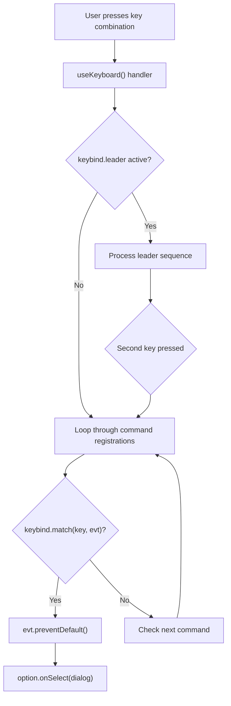
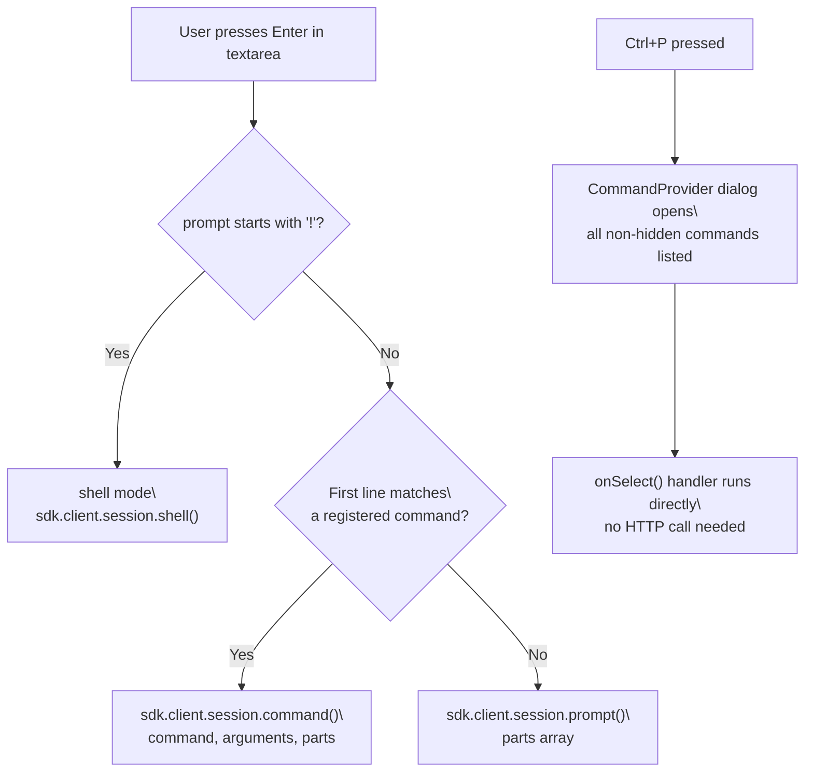
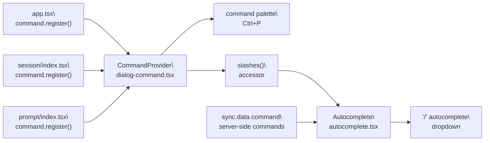

# TUI Commands & Keybindings

Relevant source files

The following files were used as context for generating this wiki page:

- [packages/opencode/src/cli/cmd/tui/app.tsx](packages/opencode/src/cli/cmd/tui/app.tsx)
- [packages/opencode/src/cli/cmd/tui/attach.ts](packages/opencode/src/cli/cmd/tui/attach.ts)
- [packages/opencode/src/cli/cmd/tui/component/dialog-command.tsx](packages/opencode/src/cli/cmd/tui/component/dialog-command.tsx)
- [packages/opencode/src/cli/cmd/tui/component/prompt/autocomplete.tsx](packages/opencode/src/cli/cmd/tui/component/prompt/autocomplete.tsx)
- [packages/opencode/src/cli/cmd/tui/component/prompt/index.tsx](packages/opencode/src/cli/cmd/tui/component/prompt/index.tsx)
- [packages/opencode/src/cli/cmd/tui/context/args.tsx](packages/opencode/src/cli/cmd/tui/context/args.tsx)
- [packages/opencode/src/cli/cmd/tui/context/exit.tsx](packages/opencode/src/cli/cmd/tui/context/exit.tsx)
- [packages/opencode/src/cli/cmd/tui/context/local.tsx](packages/opencode/src/cli/cmd/tui/context/local.tsx)
- [packages/opencode/src/cli/cmd/tui/context/sdk.tsx](packages/opencode/src/cli/cmd/tui/context/sdk.tsx)
- [packages/opencode/src/cli/cmd/tui/routes/session/header.tsx](packages/opencode/src/cli/cmd/tui/routes/session/header.tsx)
- [packages/opencode/src/cli/cmd/tui/routes/session/index.tsx](packages/opencode/src/cli/cmd/tui/routes/session/index.tsx)
- [packages/opencode/src/cli/cmd/tui/routes/session/sidebar.tsx](packages/opencode/src/cli/cmd/tui/routes/session/sidebar.tsx)
- [packages/opencode/src/cli/cmd/tui/win32.ts](packages/opencode/src/cli/cmd/tui/win32.ts)
- [packages/opencode/src/command/index.ts](packages/opencode/src/command/index.ts)
- [packages/opencode/src/command/template/review.txt](packages/opencode/src/command/template/review.txt)
- [packages/sdk/js/src/v2/client.ts](packages/sdk/js/src/v2/client.ts)

This page is a complete reference for all slash commands, command palette entries, and keybindings available in the opencode Terminal User Interface. It documents command names, aliases, categories, associated keybindings, and behavior for each command and keyboard shortcut.

For general TUI layout and navigation, see [3.1. Terminal User Interface (TUI)](). For configuration schema including keybinding customization, see [9.3. Configuration Schema Reference](). For provider configuration referenced by `/connect`, see [9.1. Providers & Models]().

---

## Overview

The TUI provides three primary interaction methods:

1. **Slash Commands** — Typed directly into the prompt with `/` prefix
2. **Command Palette** — Opened with `Ctrl+P` to search all commands
3. **Keybindings** — Direct keyboard shortcuts for frequent actions

This page documents all three methods and their mappings.

---

## How Commands Work

The TUI exposes two overlapping ways to invoke commands.

**Slash commands** are typed directly into the prompt input. When the first character is `/` and the text before any space matches a registered command name (or alias), submitting the prompt routes through `sdk.client.session.command()` rather than the normal `sdk.client.session.prompt()` path. The autocomplete dropdown opens automatically when `/` is the first character of the input.

**Command palette** is opened with `Ctrl+P` (default keybind `command_list`). It lists every non-hidden registered command, searchable by title. Commands with a `slash` field appear in both places; commands without a `slash` field appear only in the palette.

Sources: [packages/opencode/src/cli/cmd/tui/component/prompt/index.tsx:586-654](), [packages/opencode/src/cli/cmd/tui/component/prompt/autocomplete.tsx:356-383]()

---

## Keybinding System

The TUI uses a centralized keybinding system that maps named actions (like `session_share` or `messages_undo`) to key combinations. Keybindings can be customized in `opencode.json` under the `tui.keybinds` field.

### Keybind Architecture

**Diagram: Keybinding Dispatch Flow**

The `useKeybind` hook provides:

- `match(key: KeybindKey, evt: KeyEvent): boolean` — Tests if an event matches a keybind name
- `print(key: KeybindKey): string` — Returns human-readable key combination (e.g., "Ctrl+P")
- `leader` — Tracks if leader key sequence is active

Commands register keybindings via the `keybind` field in their `CommandOption` objects. The `CommandProvider` loops through all registered commands and calls `keybind.match()` for each one. When a match is found, the command's `onSelect` handler runs immediately.

Sources: [packages/opencode/src/cli/cmd/tui/component/dialog-command.tsx:60-70](), [packages/opencode/src/cli/cmd/tui/app.tsx:218-245]()

### Text Input Keybindings

The prompt textarea supports standard text editing shortcuts. These are handled by `useTextareaKeybindings()` and do not route through the command system.

| Keybinding         | Action                                             |
| ------------------ | -------------------------------------------------- |
| `Ctrl+A` or `Home` | Move cursor to start of line                       |
| `Ctrl+E` or `End`  | Move cursor to end of line                         |
| `Ctrl+K`           | Delete from cursor to end of line                  |
| `Ctrl+U`           | Delete from cursor to start of line                |
| `Ctrl+W`           | Delete word before cursor                          |
| `Alt+Backspace`    | Delete word before cursor                          |
| `Up` or `Ctrl+P`   | Navigate prompt history (when at start of input)   |
| `Down` or `Ctrl+N` | Navigate prompt history (when at end of input)     |
| `Ctrl+V`           | Paste (special handling for images)                |
| `Ctrl+C`           | Interrupt session (when active) or exit shell mode |
| `Escape`           | Exit shell mode                                    |
| `Enter`            | Submit prompt                                      |
| `Shift+Enter`      | Insert newline                                     |

Sources: [packages/opencode/src/cli/cmd/tui/component/prompt/index.tsx:850-928](), [packages/opencode/src/cli/cmd/tui/component/textarea-keybindings.tsx]()

### Autocomplete Navigation

When the autocomplete dropdown is visible (triggered by `@` or `/`):

| Keybinding         | Action                                    |
| ------------------ | ----------------------------------------- |
| `Up` or `Ctrl+P`   | Move selection up                         |
| `Down` or `Ctrl+N` | Move selection down                       |
| `Enter`            | Select current item                       |
| `Tab`              | Select current item (or expand directory) |
| `Escape`           | Close autocomplete                        |

Sources: [packages/opencode/src/cli/cmd/tui/component/prompt/autocomplete.tsx:543-582]()

### Session Navigation Keybindings

These keybindings control scrolling and navigation within the message timeline:

| Keybinding                | Command Value                | Action                              |
| ------------------------- | ---------------------------- | ----------------------------------- |
| `messages_page_up`        | `session.page.up`            | Scroll up half viewport height      |
| `messages_page_down`      | `session.page.down`          | Scroll down half viewport height    |
| `messages_half_page_up`   | `session.half.page.up`       | Scroll up quarter viewport height   |
| `messages_half_page_down` | `session.half.page.down`     | Scroll down quarter viewport height |
| `messages_first`          | `session.first`              | Jump to first message               |
| `messages_last`           | `session.last`               | Jump to last message                |
| `messages_last_user`      | `session.messages_last_user` | Jump to most recent user message    |
| `messages_next`           | `session.message.next`       | Jump to next visible message        |
| `messages_previous`       | `session.message.previous`   | Jump to previous visible message    |
| `messages_line_up`        | `session.line.up`            | Scroll up one line (disabled)       |
| `messages_line_down`      | `session.line.down`          | Scroll down one line (disabled)     |

These commands use the `ScrollBoxRenderable` API to calculate positions and scroll offsets. The "next/previous message" commands filter for messages with non-synthetic, non-ignored text parts.

Sources: [packages/opencode/src/cli/cmd/tui/routes/session/index.tsx:658-792]()

### Quick Action Keybindings

Fast access to common operations:

| Keybinding          | Command Value            | Action                                        |
| ------------------- | ------------------------ | --------------------------------------------- |
| `session_interrupt` | `session.interrupt`      | Abort running session (press twice within 5s) |
| `session_share`     | `session.share`          | Create/copy share link                        |
| `session_compact`   | `session.compact`        | Summarize session context                     |
| `session_rename`    | `session.rename`         | Rename current session                        |
| `session_timeline`  | `session.timeline`       | Open timeline dialog                          |
| `session_fork`      | `session.fork`           | Fork from message                             |
| `session_export`    | `session.export`         | Export session transcript                     |
| `messages_undo`     | `session.undo`           | Revert last message                           |
| `messages_redo`     | `session.redo`           | Redo reverted message                         |
| `messages_copy`     | `messages.copy`          | Copy last assistant message                   |
| `sidebar_toggle`    | `session.sidebar.toggle` | Show/hide sidebar                             |

Sources: [packages/opencode/src/cli/cmd/tui/routes/session/index.tsx:359-636]()

### Model and Agent Switching Keybindings

These keybindings cycle through models and agents without opening a dialog:

| Keybinding                     | Command Value                  | Action                           |
| ------------------------------ | ------------------------------ | -------------------------------- |
| `model_list`                   | `model.list`                   | Open model selection dialog      |
| `model_cycle_recent`           | `model.cycle_recent`           | Cycle to next recent model       |
| `model_cycle_recent_reverse`   | `model.cycle_recent_reverse`   | Cycle to previous recent model   |
| `model_cycle_favorite`         | `model.cycle_favorite`         | Cycle to next favorite model     |
| `model_cycle_favorite_reverse` | `model.cycle_favorite_reverse` | Cycle to previous favorite model |
| `agent_list`                   | `agent.list`                   | Open agent selection dialog      |
| `agent_cycle`                  | `agent.cycle`                  | Cycle to next agent              |
| `agent_cycle_reverse`          | `agent.cycle.reverse`          | Cycle to previous agent          |
| `variant_cycle`                | `variant.cycle`                | Cycle model variant              |

The "favorite" cycle commands require at least one model to be marked as favorite. If no favorites exist, a toast notification is shown.

Sources: [packages/opencode/src/cli/cmd/tui/app.tsx:428-520](), [packages/opencode/src/cli/cmd/tui/context/local.tsx:232-277]()

### Subagent Session Navigation

When viewing a subagent (child) session, these keybindings navigate between parent and sibling sessions:

| Keybinding                    | Command Value            | Action                               |
| ----------------------------- | ------------------------ | ------------------------------------ |
| `session_parent`              | `session.parent`         | Navigate to parent session           |
| `session_child_first`         | `session.child.first`    | Navigate to first child session      |
| `session_child_cycle`         | `session.child.next`     | Navigate to next sibling session     |
| `session_child_cycle_reverse` | `session.child.previous` | Navigate to previous sibling session |

These commands are only enabled when `session()?.parentID` exists and the dialog stack is empty.

Sources: [packages/opencode/src/cli/cmd/tui/routes/session/index.tsx:927-978]()

### Display Toggle Keybindings

Control what's visible in the session view:

| Keybinding                | Command Value              | Action                                |
| ------------------------- | -------------------------- | ------------------------------------- |
| `display_thinking`        | `session.toggle.thinking`  | Show/hide reasoning blocks            |
| `tool_details`            | `session.toggle.actions`   | Show/hide tool call details           |
| `messages_toggle_conceal` | `session.toggle.conceal`   | Enable/disable code concealment       |
| `scrollbar_toggle`        | `session.toggle.scrollbar` | Show/hide scrollbar                   |
| `terminal_title_toggle`   | `terminal.title.toggle`    | Enable/disable terminal title updates |

Sources: [packages/opencode/src/cli/cmd/tui/routes/session/index.tsx:605-658](), [packages/opencode/src/cli/cmd/tui/app.tsx:645-658]()

### System Keybindings

| Keybinding         | Command Value      | Action                            |
| ------------------ | ------------------ | --------------------------------- |
| `command_list`     | —                  | Open command palette (Ctrl+P)     |
| `session_list`     | `session.list`     | Open session list                 |
| `session_new`      | `session.new`      | Create new session                |
| `status_view`      | `opencode.status`  | View system status                |
| `theme_list`       | `theme.switch`     | Open theme selector               |
| `editor_open`      | `prompt.editor`    | Open $EDITOR for prompt           |
| `input_submit`     | `prompt.submit`    | Submit prompt (Enter)             |
| `input_paste`      | `prompt.paste`     | Paste from clipboard              |
| `input_clear`      | —                  | Clear prompt input                |
| `history_previous` | —                  | Navigate prompt history backward  |
| `history_next`     | —                  | Navigate prompt history forward   |
| `terminal_suspend` | `terminal.suspend` | Suspend terminal (Ctrl+Z on Unix) |
| `app_exit`         | —                  | Exit application                  |

Sources: [packages/opencode/src/cli/cmd/tui/app.tsx:126-136](), [packages/opencode/src/cli/cmd/tui/component/prompt/index.tsx:172-244]()

---

### Invocation Flow

**Diagram: Prompt Submission Routing**

Sources: [packages/opencode/src/cli/cmd/tui/component/prompt/index.tsx:528-658]()

---

### Command Registration Architecture

Commands are registered via `command.register()` callbacks supplied to the `CommandProvider` context. The `useCommandDialog` hook exposes both `register()` (add commands) and `trigger()` (programmatically invoke by `value`). The `slashes()` accessor filters to only those commands with a `slash` field, and `autocomplete.tsx` merges them with server-side MCP prompt commands.

**Diagram: Command Registration Data Flow**

Sources: [packages/opencode/src/cli/cmd/tui/component/dialog-command.tsx:1-110](), [packages/opencode/src/cli/cmd/tui/component/prompt/autocomplete.tsx:356-383](), [packages/opencode/src/cli/cmd/tui/app.tsx:360-678]()

---

## Slash Command Reference

Slash commands are grouped by where they are registered. All slash commands also appear in the command palette (`Ctrl+P`).

---

### Global Commands

Registered in `app.tsx` via `command.register()`. Available at all times regardless of the current route.

| Slash Command | Aliases              | Command Value      | Keybind        | Description                                                 |
| ------------- | -------------------- | ------------------ | -------------- | ----------------------------------------------------------- |
| `/sessions`   | `resume`, `continue` | `session.list`     | `session_list` | Opens `DialogSessionList` to switch sessions                |
| `/new`        | `clear`              | `session.new`      | `session_new`  | Navigates to the home screen; preserves current prompt text |
| `/models`     | —                    | `model.list`       | `model_list`   | Opens `DialogModel` to select a provider and model          |
| `/agents`     | —                    | `agent.list`       | `agent_list`   | Opens `DialogAgent` to switch the active agent              |
| `/mcps`       | —                    | `mcp.list`         | —              | Opens `DialogMcp` to enable/disable MCP servers             |
| `/connect`    | —                    | `provider.connect` | —              | Opens `DialogProviderList` to add provider credentials      |
| `/status`     | —                    | `opencode.status`  | `status_view`  | Opens `DialogStatus` showing server diagnostics             |
| `/themes`     | —                    | `theme.switch`     | `theme_list`   | Opens `DialogThemeList` to pick a theme                     |
| `/help`       | —                    | `help.show`        | —              | Opens `DialogHelp`                                          |
| `/exit`       | `quit`, `q`          | `app.exit`         | —              | Exits the application                                       |

Sources: [packages/opencode/src/cli/cmd/tui/app.tsx:361-577]()

---

### Session Commands

Registered in `session/index.tsx`. Available when viewing a session. Most operate on the current `sessionID`.

| Slash Command | Aliases             | Command Value               | Keybind            | Description                                                                                                                                      |
| ------------- | ------------------- | --------------------------- | ------------------ | ------------------------------------------------------------------------------------------------------------------------------------------------ |
| `/share`      | —                   | `session.share`             | `session_share`    | Creates a share link; if one exists, copies it to clipboard                                                                                      |
| `/unshare`    | —                   | `session.unshare`           | `session_unshare`  | Removes the share link (only enabled when session is shared)                                                                                     |
| `/rename`     | —                   | `session.rename`            | `session_rename`   | Opens `DialogSessionRename`                                                                                                                      |
| `/timeline`   | —                   | `session.timeline`          | `session_timeline` | Opens `DialogTimeline` to jump to or fork from a message                                                                                         |
| `/fork`       | —                   | `session.fork`              | `session_fork`     | Opens `DialogForkFromTimeline` to create a fork from a selected message                                                                          |
| `/compact`    | `summarize`         | `session.compact`           | `session_compact`  | Calls `sdk.client.session.summarize()` with the current model                                                                                    |
| `/undo`       | —                   | `session.undo`              | `messages_undo`    | Aborts any in-progress generation, then calls `sdk.client.session.revert()` to the last user message; restores that message text into the prompt |
| `/redo`       | —                   | `session.redo`              | `messages_redo`    | Re-applies the most recently reverted message                                                                                                    |
| `/timestamps` | `toggle-timestamps` | `session.toggle.timestamps` | —                  | Toggles display of per-message timestamps                                                                                                        |
| `/thinking`   | `toggle-thinking`   | `session.toggle.thinking`   | `display_thinking` | Toggles display of AI reasoning/thinking blocks                                                                                                  |
| `/copy`       | —                   | `session.copy`              | —                  | Copies full formatted session transcript to clipboard via `formatTranscript()`                                                                   |
| `/export`     | —                   | `session.export`            | `session_export`   | Opens `DialogExportOptions`, writes transcript to a file, and optionally opens it in `$EDITOR`                                                   |

#### `/compact` behavior

`/compact` requires a model to be selected. If no model is connected, a warning toast is shown and the command is not sent. The summary replaces the session's message history with a compacted version.

Sources: [packages/opencode/src/cli/cmd/tui/routes/session/index.tsx:359-979]()

#### `/undo` behavior

`/undo` first aborts the session if it is currently running (status is not `idle`), then calls `sdk.client.session.revert()`. The text and file parts from the reverted user message are placed back into the prompt input so the user can edit and resubmit.

Sources: [packages/opencode/src/cli/cmd/tui/routes/session/index.tsx:504-540]()

#### `/export` options

The export dialog (`DialogExportOptions`) allows the user to:

- Set the output filename (default: `session-<id-prefix>.md`)
- Toggle inclusion of thinking blocks, tool details, and assistant metadata
- Choose to open the transcript in `$EDITOR` without writing to disk

Sources: [packages/opencode/src/cli/cmd/tui/routes/session/index.tsx:866-925]()

---

### Prompt Commands

Registered in `prompt/index.tsx`. These interact with the prompt input itself.

| Slash Command | Aliases | Command Value   | Keybind       | Description                                                                                 |
| ------------- | ------- | --------------- | ------------- | ------------------------------------------------------------------------------------------- |
| `/editor`     | —       | `prompt.editor` | `editor_open` | Opens `$EDITOR` with the current prompt text; on close, the edited text replaces the prompt |
| `/skills`     | —       | `prompt.skills` | —             | Opens `DialogSkill` to pick a skill; selecting one prefills `/skillname ` in the prompt     |

Sources: [packages/opencode/src/cli/cmd/tui/component/prompt/index.tsx:245-356]()

---

### MCP and Server-Side Commands

Commands from connected MCP servers appear in the `/` autocomplete dropdown with a `:mcp` suffix after the command name (e.g., `/my_prompt:mcp`). These are listed under `sync.data.command` with `source === "mcp"`. Selecting one calls `sdk.client.session.command()` with the MCP prompt name as the command.

Skill commands (`source === "skill"`) are filtered out of the slash autocomplete dropdown and are accessible only via `/skills`.

Built-in server-side commands (e.g., `init`, `review`) defined in `packages/opencode/src/command/index.ts` also appear in the autocomplete as plain slash commands.

Sources: [packages/opencode/src/cli/cmd/tui/component/prompt/autocomplete.tsx:356-383](), [packages/opencode/src/command/index.ts:1-100]()

---

## Command Palette (Non-Slash Commands)

The following commands appear in the palette (`Ctrl+P`) but are not invokable via a slash prefix in the prompt.

| Title                           | Command Value                        | Keybind                   | Description                                                                     |
| ------------------------------- | ------------------------------------ | ------------------------- | ------------------------------------------------------------------------------- |
| Toggle sidebar                  | `session.sidebar.toggle`             | `sidebar_toggle`          | Shows or hides the session sidebar                                              |
| Enable/Disable code concealment | `session.toggle.conceal`             | `messages_toggle_conceal` | Toggles syntax-highlighted code block concealment                               |
| Show/Hide tool details          | `session.toggle.actions`             | `tool_details`            | Toggles expanded display of tool calls                                          |
| Toggle session scrollbar        | `session.toggle.scrollbar`           | `scrollbar_toggle`        | Shows or hides the scroll bar in the message view                               |
| Show/Hide header                | `session.toggle.header`              | —                         | Toggles the session header bar                                                  |
| Show/Hide generic tool output   | `session.toggle.generic_tool_output` | —                         | Toggles output for tools without a custom renderer                              |
| Toggle appearance               | `theme.switch_mode`                  | —                         | Switches between dark and light mode                                            |
| Copy last assistant message     | `messages.copy`                      | `messages_copy`           | Copies the most recent assistant response to clipboard                          |
| Stash prompt                    | `prompt.stash`                       | —                         | Saves current prompt to the stash stack (only enabled when prompt is non-empty) |
| Stash pop                       | `prompt.stash.pop`                   | —                         | Restores the most recently stashed prompt                                       |
| Stash list                      | `prompt.stash.list`                  | —                         | Opens `DialogStash` to browse all stashed prompts                               |
| Enable/Disable terminal title   | `terminal.title.toggle`              | `terminal_title_toggle`   | Controls whether the terminal window title is updated                           |
| Enable/Disable animations       | `app.toggle.animations`              | —                         | Toggles spinner and other animations                                            |
| Enable/Disable diff wrapping    | `app.toggle.diffwrap`                | —                         | Toggles word-wrap mode in diff views                                            |
| Open docs                       | `docs.open`                          | —                         | Opens `https://opencode.ai/docs` in the system browser                          |
| Toggle debug panel              | `app.debug`                          | —                         | Toggles the opentui debug overlay                                               |
| Toggle console                  | `app.console`                        | —                         | Toggles the opentui developer console                                           |

The following commands are registered but `hidden: true` (they do not appear in the palette; they are only reachable via keybind):

| Title                     | Command Value                  | Keybind                        |
| ------------------------- | ------------------------------ | ------------------------------ |
| Page up                   | `session.page.up`              | `messages_page_up`             |
| Page down                 | `session.page.down`            | `messages_page_down`           |
| Half page up              | `session.half.page.up`         | `messages_half_page_up`        |
| Half page down            | `session.half.page.down`       | `messages_half_page_down`      |
| First message             | `session.first`                | `messages_first`               |
| Last message              | `session.last`                 | `messages_last`                |
| Jump to last user message | `session.messages_last_user`   | `messages_last_user`           |
| Next message              | `session.message.next`         | `messages_next`                |
| Previous message          | `session.message.previous`     | `messages_previous`            |
| Go to child session       | `session.child.first`          | `session_child_first`          |
| Go to parent session      | `session.parent`               | `session_parent`               |
| Next child session        | `session.child.next`           | `session_child_cycle`          |
| Previous child session    | `session.child.previous`       | `session_child_cycle_reverse`  |
| Model cycle               | `model.cycle_recent`           | `model_cycle_recent`           |
| Model cycle reverse       | `model.cycle_recent_reverse`   | `model_cycle_recent_reverse`   |
| Favorite cycle            | `model.cycle_favorite`         | `model_cycle_favorite`         |
| Favorite cycle reverse    | `model.cycle_favorite_reverse` | `model_cycle_favorite_reverse` |
| Agent cycle               | `agent.cycle`                  | `agent_cycle`                  |
| Agent cycle reverse       | `agent.cycle.reverse`          | `agent_cycle_reverse`          |
| Variant cycle             | `variant.cycle`                | `variant_cycle`                |
| Interrupt session         | `session.interrupt`            | `session_interrupt`            |
| Suspend terminal          | `terminal.suspend`             | `terminal_suspend`             |
| Submit prompt             | `prompt.submit`                | `input_submit`                 |
| Clear prompt              | `prompt.clear`                 | —                              |
| Paste image               | `prompt.paste`                 | `input_paste`                  |

Sources: [packages/opencode/src/cli/cmd/tui/app.tsx:361-660](), [packages/opencode/src/cli/cmd/tui/routes/session/index.tsx:554-960](), [packages/opencode/src/cli/cmd/tui/component/prompt/index.tsx:171-355]()

---

## Special Prompt Behaviors

Beyond slash commands, the prompt input handles several other special inputs.

### Shell Mode (`!` prefix)

Typing `!` as the very first character of an otherwise-empty prompt switches the input to shell mode. The prompt border highlights in the primary color and the placeholder changes to shell examples. Submitting calls `sdk.client.session.shell()` with the text as a shell `command` string.

- Exit shell mode: `Backspace` at cursor position 0, or `Escape`

Sources: [packages/opencode/src/cli/cmd/tui/component/prompt/index.tsx:874-886]()

### File and Agent Mentions (`@` prefix)

Typing `@` anywhere in the prompt (not at position 0, or at any position where the character before it is whitespace) opens the `@` autocomplete dropdown. The dropdown shows:

- **Files**: fuzzy-matched against the project directory via `sdk.client.find.files()`, sorted by frecency then path depth
- **Agents**: non-hidden, non-primary agents from `sync.data.agent`
- **MCP resources**: from `sync.data.mcp_resource`

A file reference with a line range can be specified as `@path/to/file.ts#10-25`. Directories end in `/` and can be expanded by pressing `Tab` in the dropdown.

Selecting an item inserts a virtual extmark (a display placeholder) into the textarea. The actual file content or resource data is attached as a `FilePart` or `AgentPart` in `store.prompt.parts` and sent with the message.

Sources: [packages/opencode/src/cli/cmd/tui/component/prompt/autocomplete.tsx:220-354]()

### Built-in Text Shortcuts

The following literal text strings, entered as the entire prompt and submitted, are handled before any network call is made:

| Input  | Behavior                         |
| ------ | -------------------------------- |
| `exit` | Calls `exit()` (same as `/exit`) |
| `quit` | Calls `exit()`                   |
| `:q`   | Calls `exit()`                   |

Sources: [packages/opencode/src/cli/cmd/tui/component/prompt/index.tsx:533-537]()

---

## Command Dispatch Architecture

**Diagram: Command Value to Handler Mapping**

```mermaid
flowchart TD
    subgraph "Registered via app.tsx"
        SL["session.list → DialogSessionList"]
        SN["session.new → navigate home"]
        ML["model.list → DialogModel"]
        AL["agent.list → DialogAgent"]
        PC["provider.connect → DialogProviderList"]
        AE["app.exit → exit()"]
    end

    subgraph "Registered via session/index.tsx"
        SS["session.share → session.share() API"]
        SC["session.compact → session.summarize() API"]
        SU["session.undo → session.revert() API"]
        ST["session.timeline → DialogTimeline"]
        SF["session.fork → DialogForkFromTimeline"]
        SE["session.export → DialogExportOptions + Bun.write()"]
    end

    subgraph "Registered via prompt/index.tsx"
        PE["prompt.editor → Editor.open()"]
        PS["prompt.skills → DialogSkill"]
        PST["prompt.stash → stash.push()"]
    end

    CommandProvider["CommandProvider\
trigger(value)"] --> SL
    CommandProvider --> SN
    CommandProvider --> ML
    CommandProvider --> AL
    CommandProvider --> PC
    CommandProvider --> AE
    CommandProvider --> SS
    CommandProvider --> SC
    CommandProvider --> SU
    CommandProvider --> ST
    CommandProvider --> SF
    CommandProvider --> SE
    CommandProvider --> PE
    CommandProvider --> PS
    CommandProvider --> PST
```

Sources: [packages/opencode/src/cli/cmd/tui/app.tsx:361-660](), [packages/opencode/src/cli/cmd/tui/routes/session/index.tsx:354-961](), [packages/opencode/src/cli/cmd/tui/component/prompt/index.tsx:171-527](), [packages/opencode/src/cli/cmd/tui/component/dialog-command.tsx:1-100]()
