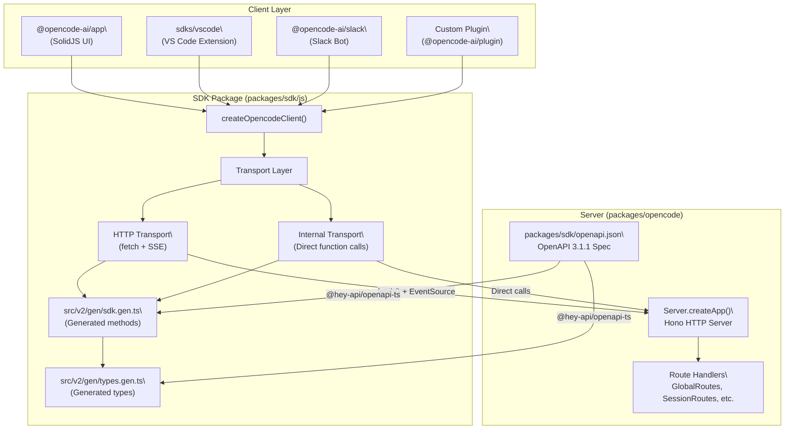
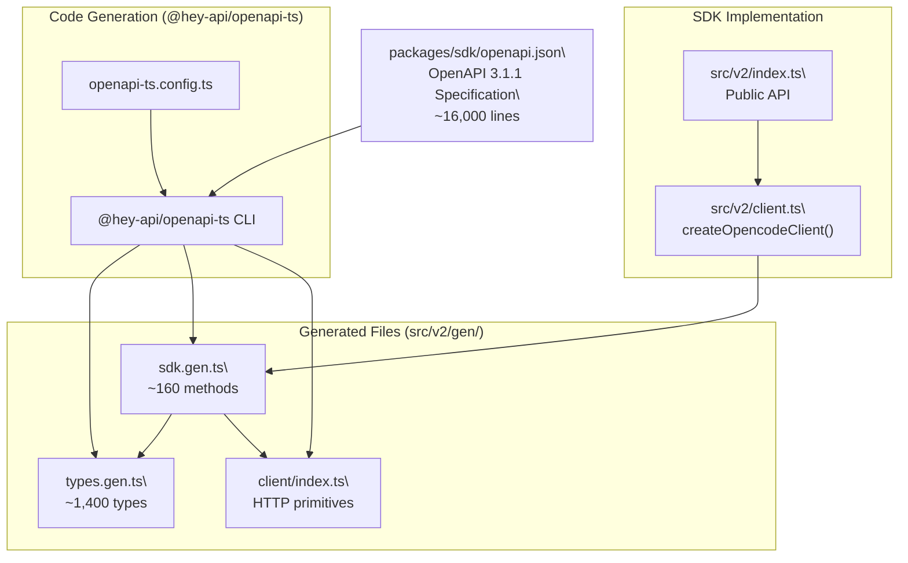
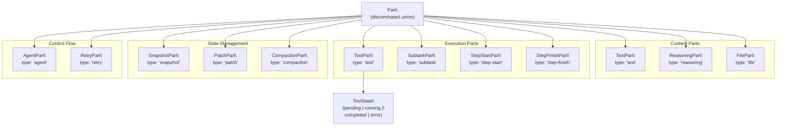

# SDK & API

<details>
<summary>Relevant source files</summary>

The following files were used as context for generating this wiki page:

- [packages/opencode/src/config/config.ts](packages/opencode/src/config/config.ts)
- [packages/opencode/src/env/index.ts](packages/opencode/src/env/index.ts)
- [packages/opencode/src/provider/error.ts](packages/opencode/src/provider/error.ts)
- [packages/opencode/src/provider/models.ts](packages/opencode/src/provider/models.ts)
- [packages/opencode/src/provider/provider.ts](packages/opencode/src/provider/provider.ts)
- [packages/opencode/src/provider/transform.ts](packages/opencode/src/provider/transform.ts)
- [packages/opencode/src/server/server.ts](packages/opencode/src/server/server.ts)
- [packages/opencode/src/session/compaction.ts](packages/opencode/src/session/compaction.ts)
- [packages/opencode/src/session/index.ts](packages/opencode/src/session/index.ts)
- [packages/opencode/src/session/llm.ts](packages/opencode/src/session/llm.ts)
- [packages/opencode/src/session/message-v2.ts](packages/opencode/src/session/message-v2.ts)
- [packages/opencode/src/session/message.ts](packages/opencode/src/session/message.ts)
- [packages/opencode/src/session/prompt.ts](packages/opencode/src/session/prompt.ts)
- [packages/opencode/src/session/revert.ts](packages/opencode/src/session/revert.ts)
- [packages/opencode/src/session/summary.ts](packages/opencode/src/session/summary.ts)
- [packages/opencode/src/tool/task.ts](packages/opencode/src/tool/task.ts)
- [packages/opencode/test/config/config.test.ts](packages/opencode/test/config/config.test.ts)
- [packages/opencode/test/provider/provider.test.ts](packages/opencode/test/provider/provider.test.ts)
- [packages/opencode/test/provider/transform.test.ts](packages/opencode/test/provider/transform.test.ts)
- [packages/opencode/test/session/llm.test.ts](packages/opencode/test/session/llm.test.ts)
- [packages/opencode/test/session/message-v2.test.ts](packages/opencode/test/session/message-v2.test.ts)
- [packages/opencode/test/session/revert-compact.test.ts](packages/opencode/test/session/revert-compact.test.ts)
- [packages/sdk/js/src/gen/sdk.gen.ts](packages/sdk/js/src/gen/sdk.gen.ts)
- [packages/sdk/js/src/gen/types.gen.ts](packages/sdk/js/src/gen/types.gen.ts)
- [packages/sdk/js/src/v2/gen/sdk.gen.ts](packages/sdk/js/src/v2/gen/sdk.gen.ts)
- [packages/sdk/js/src/v2/gen/types.gen.ts](packages/sdk/js/src/v2/gen/types.gen.ts)
- [packages/sdk/openapi.json](packages/sdk/openapi.json)

</details>

This page explains how the `@opencode-ai/sdk` JavaScript package and the `packages/sdk/openapi.json` OpenAPI specification work together to give clients typed, programmatic access to the opencode HTTP server. It covers the package layout, code-generation pipeline, and a summary of the API surface.

For the HTTP server implementation that the SDK talks to, see [HTTP Server & REST API](#2.5). For the JavaScript SDK module exports and SSE consumption patterns, see [JavaScript SDK](#5.1). For the full endpoint reference derived from the OpenAPI spec, see [OpenAPI Specification & Code Generation](#5.2).

---

## How the pieces fit together

The SDK provides a typed client for the OpenCode HTTP server. The server (`packages/opencode/src/server/server.ts`) exposes a Hono-based REST API with Server-Sent Events (SSE) for real-time updates. The OpenAPI specification (`packages/sdk/openapi.json`) defines all endpoints, and `@hey-api/openapi-ts` generates TypeScript types and client methods from it.

The SDK supports two transport modes:

- **HTTP transport**: Remote server connections via `fetch()`
- **Internal transport**: In-process function calls when the SDK and server run in the same Node/Bun process

**Diagram: SDK architecture and transport modes**



Sources: [packages/opencode/src/server/server.ts:53-277](), [packages/sdk/js/package.json:1-43](), [packages/sdk/openapi.json:1-43]()

---

## Package structure

The `@opencode-ai/sdk` package lives at `packages/sdk/js/`. It uses TypeScript with multiple entry points defined via the `exports` field in `package.json`.

| Export path       | Source file                  | Purpose                                                 |
| ----------------- | ---------------------------- | ------------------------------------------------------- |
| `.`               | `src/index.ts`               | Legacy export, re-exports `./v2`                        |
| `./client`        | `src/client.ts`              | Low-level HTTP client primitives                        |
| `./server`        | `src/server.ts`              | Server-side utilities (not for client use)              |
| `./v2`            | `src/v2/index.ts`            | **Main entry point** - exports `createOpencodeClient()` |
| `./v2/client`     | `src/v2/client.ts`           | Client factory with transport selection                 |
| `./v2/gen/client` | `src/v2/gen/client/index.ts` | Generated low-level HTTP/SSE client                     |
| `./v2/gen/types`  | `src/v2/gen/types.gen.ts`    | All generated TypeScript types                          |
| `./v2/gen/sdk`    | `src/v2/gen/sdk.gen.ts`      | Generated SDK methods                                   |
| `./v2/server`     | `src/v2/server.ts`           | Server-side SSE and event utilities                     |

The build output goes to `dist/`, which is published to npm. Monorepo packages import source files directly via workspace references.

**Dependencies:**

- Runtime: None (uses native `fetch` and `EventSource`)
- Dev: `@hey-api/openapi-ts@0.90.10` for code generation

Sources: [packages/sdk/js/package.json:11-43]()

---

## Code generation pipeline

The OpenAPI specification at `packages/sdk/openapi.json` is the canonical source for all API surface definitions. The build process uses `@hey-api/openapi-ts` to generate three files:

1. **`src/v2/gen/types.gen.ts`** — All TypeScript type definitions (300+ types including models, events, errors)
2. **`src/v2/gen/sdk.gen.ts`** — Typed SDK client classes with methods for each endpoint
3. **`src/v2/gen/client/index.ts`** — Low-level HTTP/SSE client implementation

All generated files include the header `// This file is auto-generated by @hey-api/openapi-ts` and must never be edited manually. Changes must be made to `openapi.json` and regenerated.

**Diagram: Code generation and build flow**



The generation happens during `bun run build` via the `generate` script defined in `package.json`. The OpenAPI spec is maintained manually, with each route defined using `describeRoute()` calls in the server code.

Sources: [packages/sdk/js/src/v2/gen/types.gen.ts:1-2](), [packages/sdk/js/src/v2/gen/sdk.gen.ts:1-4](), [packages/sdk/openapi.json:1-10]()

---

## Client API structure

`createOpencodeClient()` returns an `OpencodeClient` instance that aggregates all resource-specific client classes. Each endpoint group maps to a client class with typed methods.

**Diagram: OpencodeClient structure and method groups**

```mermaid
graph TB
    CREATE["createOpencodeClient(options)\
Factory function"]

    subgraph "OpencodeClient Instance"
        GLOBAL["global: GlobalClient\
- health()\
- event()\
- dispose()\
- config.get()\
- config.update()"]
        AUTH["auth: AuthClient\
- set(providerID, auth)\
- remove(providerID)"]
        CONFIG["config: ConfigClient\
- get()\
- update()\
- providers()"]
        PROJECT["project: ProjectClient\
- list()\
- current()\
- update()\
- initGit()"]
        SESSION["session: SessionClient\
- list()\
- create()\
- get()\
- delete()\
- prompt()\
- fork()\
- share()"]
        PTY["pty: PtyClient\
- list()\
- create()\
- get()\
- update()\
- remove()\
- connect()"]
        PERMISSION["permission: PermissionClient\
- list()\
- respond()"]
        QUESTION["question: QuestionClient\
- list()\
- reply()"]
        PROVIDER["provider: ProviderClient\
- list()\
- auth()\
- oauth.authorize()\
- oauth.callback()"]
        MCP["mcp: McpClient\
- status()\
- add()\
- connect()\
- disconnect()"]
        FILE["file: FileClient\
- list()\
- read()\
- status()"]
        EXPERIMENTAL["experimental: ExperimentalClient\
- workspace.create()\
- workspace.list()\
- session.list()"]
    end

    CREATE --> GLOBAL
    CREATE --> AUTH
    CREATE --> CONFIG
    CREATE --> PROJECT
    CREATE --> SESSION
    CREATE --> PTY
    CREATE --> PERMISSION
    CREATE --> QUESTION
    CREATE --> PROVIDER
    CREATE --> MCP
    CREATE --> FILE
    CREATE --> EXPERIMENTAL
```



**Example usage:**

```typescript
import { createOpencodeClient } from '@opencode-ai/sdk'

const client = createOpencodeClient({
  baseUrl: 'http://localhost:8080',
  // optional: directory, workspace, fetch override
})

// Global operations
const health = await client.global.health()
const config = await client.global.config.get()

// Session operations
const session = await client.session.create({ title: 'My Session' })
await client.session.prompt({
  sessionID: session.id,
  parts: [{ type: 'text', text: 'Hello!' }],
})

// Subscribe to events (SSE)
for await (const event of client.global.event()) {
  console.log(event.type, event.properties)
}
```

Sources: [packages/sdk/js/src/v2/gen/sdk.gen.ts:1-200](), [packages/sdk/js/src/v2/client.ts:1-50]()

---

## API endpoints reference

The OpenAPI specification defines 80+ endpoints organized into 15 resource groups. Each endpoint has an `operationId` that maps to a generated SDK method.

| Group            | Endpoint examples                                                                                                                 | Operation IDs                                                                                   | SDK methods                                                                                                                |
| ---------------- | --------------------------------------------------------------------------------------------------------------------------------- | ----------------------------------------------------------------------------------------------- | -------------------------------------------------------------------------------------------------------------------------- |
| **Global**       | `GET /global/health`<br>`GET /global/event`<br>`PATCH /global/config`                                                             | `global.health`<br>`global.event`<br>`global.config.update`                                     | `client.global.health()`<br>`client.global.event()`<br>`client.global.config.update()`                                     |
| **Auth**         | `PUT /auth/{providerID}`<br>`DELETE /auth/{providerID}`                                                                           | `auth.set`<br>`auth.remove`                                                                     | `client.auth.set()`<br>`client.auth.remove()`                                                                              |
| **Project**      | `GET /project`<br>`GET /project/current`<br>`PATCH /project/{projectID}`                                                          | `project.list`<br>`project.current`<br>`project.update`                                         | `client.project.list()`<br>`client.project.current()`<br>`client.project.update()`                                         |
| **Session**      | `GET /session`<br>`POST /session`<br>`POST /session/{sessionID}/prompt`                                                           | `session.list`<br>`session.create`<br>`session.prompt`                                          | `client.session.list()`<br>`client.session.create()`<br>`client.session.prompt()`                                          |
| **Message**      | `GET /session/{sessionID}/message/{messageID}`<br>`PATCH /session/{sessionID}/message/{messageID}`                                | `message.get`<br>`message.update`                                                               | `client.session.message.get()`<br>`client.session.message.update()`                                                        |
| **Part**         | `PATCH /session/{sessionID}/message/{messageID}/part/{partID}`<br>`DELETE /session/{sessionID}/message/{messageID}/part/{partID}` | `part.update`<br>`part.delete`                                                                  | `client.session.message.part.update()`<br>`client.session.message.part.delete()`                                           |
| **Permission**   | `GET /session/{sessionID}/permission`<br>`POST /session/{sessionID}/permission/{requestID}`                                       | `permission.list`<br>`permission.respond`                                                       | `client.permission.list()`<br>`client.permission.respond()`                                                                |
| **Question**     | `GET /session/{sessionID}/question`<br>`POST /session/{sessionID}/question/{requestID}`                                           | `question.list`<br>`question.reply`                                                             | `client.question.list()`<br>`client.question.reply()`                                                                      |
| **Provider**     | `GET /provider`<br>`GET /provider/{providerID}/oauth/authorize`                                                                   | `provider.list`<br>`provider.oauth.authorize`                                                   | `client.provider.list()`<br>`client.provider.oauth.authorize()`                                                            |
| **MCP**          | `GET /mcp`<br>`POST /mcp`<br>`POST /mcp/{name}/connect`                                                                           | `mcp.status`<br>`mcp.add`<br>`mcp.connect`                                                      | `client.mcp.status()`<br>`client.mcp.add()`<br>`client.mcp.connect()`                                                      |
| **PTY**          | `GET /pty`<br>`POST /pty`<br>`GET /pty/{ptyID}/connect`                                                                           | `pty.list`<br>`pty.create`<br>`pty.connect`                                                     | `client.pty.list()`<br>`client.pty.create()`<br>`client.pty.connect()`                                                     |
| **Config**       | `GET /config`<br>`PATCH /config`<br>`GET /config/providers`                                                                       | `config.get`<br>`config.update`<br>`config.providers`                                           | `client.config.get()`<br>`client.config.update()`<br>`client.config.providers()`                                           |
| **File**         | `GET /file`<br>`GET /file/read`<br>`GET /file/status`                                                                             | `file.list`<br>`file.read`<br>`file.status`                                                     | `client.file.list()`<br>`client.file.read()`<br>`client.file.status()`                                                     |
| **LSP/Format**   | `GET /lsp/status`<br>`GET /formatter/status`                                                                                      | `lsp.status`<br>`formatter.status`                                                              | `client.lsp.status()`<br>`client.formatter.status()`                                                                       |
| **Experimental** | `POST /experimental/workspace`<br>`GET /experimental/workspace`<br>`GET /experimental/session`                                    | `experimental.workspace.create`<br>`experimental.workspace.list`<br>`experimental.session.list` | `client.experimental.workspace.create()`<br>`client.experimental.workspace.list()`<br>`client.experimental.session.list()` |

**Query parameters:**
Most endpoints accept `directory` and `workspace` query parameters to scope operations to a specific project instance. These are automatically added by the SDK client based on initialization options.

Sources: [packages/sdk/openapi.json:8-1800](), [packages/opencode/src/server/server.ts:131-277]()

---

## Event system (SSE)

OpenCode uses Server-Sent Events (SSE) for real-time updates. Two SSE endpoints exist:

1. **`GET /global/event`** — Cross-instance events wrapped in `GlobalEvent` (includes `directory` field)
2. **`GET /event`** — Per-instance events (deprecated in favor of global endpoint)

### GlobalEvent structure

Every event emitted by `/global/event` follows this envelope pattern:

```typescript
type GlobalEvent = {
  directory: string // Which project instance emitted this event
  payload: Event // The actual event (one of 40+ event types)
}
```

The `directory` field allows clients to filter events by project when monitoring multiple instances.

### Event type hierarchy

The `Event` union type encompasses all possible event payloads. Events are organized by subsystem:

**Diagram: Event type categories and counts**

```mermaid
graph TB
    Event["Event\
(discriminated union, 40+ types)"]

    subgraph "Session Events (8)"
        SE1["EventSessionCreated"]
        SE2["EventSessionUpdated"]
        SE3["EventSessionDeleted"]
        SE4["EventSessionStatus"]
        SE5["EventSessionIdle"]
        SE6["EventSessionCompacted"]
        SE7["EventSessionDiff"]
        SE8["EventSessionError"]
    end

    subgraph "Message Events (5)"
        ME1["EventMessageUpdated"]
        ME2["EventMessageRemoved"]
        ME3["EventMessagePartUpdated"]
        ME4["EventMessagePartDelta"]
        ME5["EventMessagePartRemoved"]
    end

    subgraph "Permission & Question (6)"
        PQ1["EventPermissionAsked"]
        PQ2["EventPermissionReplied"]
        PQ3["EventQuestionAsked"]
        PQ4["EventQuestionReplied"]
        PQ5["EventQuestionRejected"]
    end

    subgraph "Infrastructure (10)"
        IE1["EventServerConnected"]
        IE2["EventServerInstanceDisposed"]
        IE3["EventGlobalDisposed"]
        IE4["EventInstallationUpdated"]
        IE5["EventInstallationUpdateAvailable"]
        IE6["EventProjectUpdated"]
        IE7["EventPtyCreated"]
        IE8["EventPtyUpdated"]
        IE9["EventPtyExited"]
        IE10["EventPtyDeleted"]
    end

    subgraph "Code Intelligence (4)"
        CI1["EventLspClientDiagnostics"]
        CI2["EventLspUpdated"]
        CI3["EventFileEdited"]
        CI4["EventFileWatcherUpdated"]
    end

    subgraph "Other (7+)"
        OE1["EventVcsBranchUpdated"]
        OE2["EventWorktreeReady"]
        OE3["EventWorkspaceReady"]
        OE4["EventMcpToolsChanged"]
        OE5["EventTuiPromptAppend"]
        OE6["EventTuiCommandExecute"]
        OE7["EventCommandExecuted"]
    end

    Event --> SE1 & SE2 & SE3 & SE4 & SE5 & SE6 & SE7 & SE8
    Event --> ME1 & ME2 & ME3 & ME4 & ME5
    Event --> PQ1 & PQ2 & PQ3
    Event --> IE1 & IE2 & IE3 & IE4 & IE5 & IE6 & IE7 & IE8 & IE9 & IE10
    Event --> CI1 & CI2 & CI3 & CI4
    Event --> OE1 & OE2 & OE3 & OE4 & OE5 & OE6 & OE7
```



### Consuming events

The SDK provides an async iterator for SSE consumption:

```typescript
import { createOpencodeClient } from '@opencode-ai/sdk'

const client = createOpencodeClient()

// Subscribe to all events
for await (const event of client.global.event()) {
  // Type-safe event handling
  switch (event.payload.type) {
    case 'session.created':
      console.log('New session:', event.payload.properties.info)
      break
    case 'message.part.delta':
      // Stream text as AI generates it
      process.stdout.write(event.payload.properties.delta)
      break
    case 'session.error':
      console.error('Error:', event.payload.properties.error)
      break
  }
}
```

**Server implementation:** The server publishes events using `Bus.publish()` from various subsystems ([packages/opencode/src/bus/global.ts]()). The HTTP handler at `/global/event` uses Hono's `streamSSE()` to multiplex events from the global bus to connected SSE clients.

Sources: [packages/sdk/js/src/v2/gen/types.gen.ts:959-1009](), [packages/opencode/src/server/server.ts:131-160](), [packages/sdk/openapi.json:44-68]()

---

## Core data types

The generated `types.gen.ts` file exports 300+ TypeScript types. The most important types for building clients are documented below.

### Session and message types

| Type               | Description                      | Key fields                                                                                                                  |
| ------------------ | -------------------------------- | --------------------------------------------------------------------------------------------------------------------------- |
| `Session`          | Conversation thread record       | `id`, `projectID`, `workspaceID`, `title`, `permission`, `summary`, `share`, `time.created`, `time.updated`                 |
| `UserMessage`      | User turn in conversation        | `id`, `sessionID`, `role: "user"`, `agent`, `model: {providerID, modelID}`, `format?`, `system?`, `variant?`                |
| `AssistantMessage` | AI response turn                 | `id`, `sessionID`, `role: "assistant"`, `parentID`, `modelID`, `providerID`, `agent`, `cost`, `tokens`, `finish?`, `error?` |
| `Message`          | Union of user/assistant messages | Discriminated by `role` field                                                                                               |

### Part types (message content)

Messages consist of one or more `Part` objects. Each part has a `type` field that determines its structure:

| Part type     | Type name        | Purpose                         | Key fields                                             |
| ------------- | ---------------- | ------------------------------- | ------------------------------------------------------ |
| `text`        | `TextPart`       | Plain text content              | `text`, `synthetic?`, `ignored?`                       |
| `reasoning`   | `ReasoningPart`  | AI reasoning/thinking trace     | `text`, `time`                                         |
| `file`        | `FilePart`       | Attached file reference         | `url`, `filename`, `mime`, `source?`                   |
| `tool`        | `ToolPart`       | Tool execution record           | `callID`, `tool`, `state: ToolState`                   |
| `step-start`  | `StepStartPart`  | Marks beginning of agentic step | `snapshot?`                                            |
| `step-finish` | `StepFinishPart` | Marks end of agentic step       | `reason`, `snapshot?`, `cost`, `tokens`                |
| `snapshot`    | `SnapshotPart`   | File system snapshot reference  | `snapshot` (hash)                                      |
| `patch`       | `PatchPart`      | Git patch reference             | `hash`, `files[]`                                      |
| `agent`       | `AgentPart`      | Agent/mode switch directive     | `name`, `source?`                                      |
| `retry`       | `RetryPart`      | Retry attempt after error       | `attempt`, `error`                                     |
| `compaction`  | `CompactionPart` | Context compaction marker       | `auto`, `overflow?`                                    |
| `subtask`     | `SubtaskPart`    | Delegated subtask request       | `prompt`, `description`, `agent`, `model?`, `command?` |

**Diagram: Part type hierarchy**



### Tool execution state

`ToolState` is a discriminated union representing the lifecycle of a tool call:

```typescript
type ToolState =
  | { status: 'pending'; input: Record<string, unknown>; raw: string }
  | {
      status: 'running'
      input: Record<string, unknown>
      title?: string
      metadata?: Record<string, unknown>
      time: { start: number }
    }
  | {
      status: 'completed'
      input: Record<string, unknown>
      output: string
      title: string
      metadata: Record<string, unknown>
      time: { start: number; end: number }
      attachments?: FilePart[]
    }
  | {
      status: 'error'
      input: Record<string, unknown>
      error: string
      metadata?: Record<string, unknown>
      time: { start: number; end: number }
    }
```

### Other key types

| Type                | Description                                                                                   |
| ------------------- | --------------------------------------------------------------------------------------------- |
| `Project`           | Project metadata: `id`, `worktree`, `vcs`, `name`, `icon`, `commands`, `sandboxes[]`          |
| `Pty`               | Pseudo-terminal session: `id`, `command`, `args[]`, `cwd`, `env`, `status`, `pid`, `title`    |
| `PermissionRequest` | Runtime permission prompt: `id`, `sessionID`, `permission`, `patterns[]`, `metadata`, `tool?` |
| `QuestionRequest`   | Interactive question to user: `id`, `sessionID`, `questions[]`, `tool?`                       |
| `Provider`          | LLM provider config: `id`, `name`, `models[]`, `default`                                      |
| `Config`            | OpenCode configuration object (mirrors `Config.Info` from server)                             |
| `FileDiff`          | File change record: `file`, `before`, `after`, `additions`, `deletions`, `status?`            |
| `OutputFormat`      | Structured output spec: `text` or `json_schema` with schema                                   |

**Error types:** All API errors are typed. Common error types include `UnknownError`, `ProviderAuthError`, `APIError`, `ContextOverflowError`, `StructuredOutputError`, `MessageOutputLengthError`, and `MessageAbortedError`. Each error has a `name` and `data` field with error-specific details.

Sources: [packages/sdk/js/src/v2/gen/types.gen.ts:21-1014](), [packages/opencode/src/session/message-v2.ts:20-212]()

---

## SDK consumers in the monorepo

| Package               | Import path used                  | Role                                             |
| --------------------- | --------------------------------- | ------------------------------------------------ |
| `@opencode-ai/app`    | `@opencode-ai/sdk`                | Web frontend data fetching and SSE subscriptions |
| `@opencode-ai/ui`     | `@opencode-ai/sdk`                | Types for session/message rendering components   |
| `@opencode-ai/plugin` | `@opencode-ai/sdk`                | Plugin API types and client access               |
| `@opencode-ai/slack`  | `@opencode-ai/sdk`                | Slack bot interaction with opencode sessions     |
| `sdks/vscode`         | `@opencode-ai/sdk`                | VS Code extension communication                  |
| `opencode` (CLI)      | `@opencode-ai/sdk` (workspace:\*) | Internal use within the opencode process         |

Sources: [bun.lock:26-33](), [bun.lock:377-390](), [bun.lock:408-420](), [packages/plugin/package.json:18-20]()
