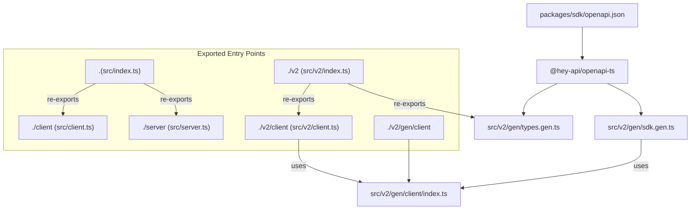
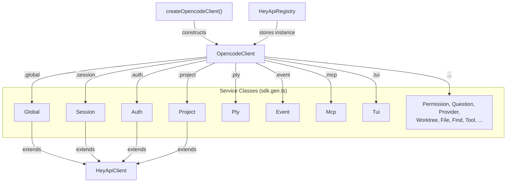

# JavaScript SDK

<details>
<summary>Relevant source files</summary>

The following files were used as context for generating this wiki page:

- [packages/opencode/src/config/config.ts](packages/opencode/src/config/config.ts)
- [packages/opencode/src/env/index.ts](packages/opencode/src/env/index.ts)
- [packages/opencode/src/provider/error.ts](packages/opencode/src/provider/error.ts)
- [packages/opencode/src/provider/models.ts](packages/opencode/src/provider/models.ts)
- [packages/opencode/src/provider/provider.ts](packages/opencode/src/provider/provider.ts)
- [packages/opencode/src/provider/transform.ts](packages/opencode/src/provider/transform.ts)
- [packages/opencode/src/server/server.ts](packages/opencode/src/server/server.ts)
- [packages/opencode/src/session/compaction.ts](packages/opencode/src/session/compaction.ts)
- [packages/opencode/src/session/index.ts](packages/opencode/src/session/index.ts)
- [packages/opencode/src/session/llm.ts](packages/opencode/src/session/llm.ts)
- [packages/opencode/src/session/message-v2.ts](packages/opencode/src/session/message-v2.ts)
- [packages/opencode/src/session/message.ts](packages/opencode/src/session/message.ts)
- [packages/opencode/src/session/prompt.ts](packages/opencode/src/session/prompt.ts)
- [packages/opencode/src/session/revert.ts](packages/opencode/src/session/revert.ts)
- [packages/opencode/src/session/summary.ts](packages/opencode/src/session/summary.ts)
- [packages/opencode/src/tool/task.ts](packages/opencode/src/tool/task.ts)
- [packages/opencode/test/config/config.test.ts](packages/opencode/test/config/config.test.ts)
- [packages/opencode/test/provider/provider.test.ts](packages/opencode/test/provider/provider.test.ts)
- [packages/opencode/test/provider/transform.test.ts](packages/opencode/test/provider/transform.test.ts)
- [packages/opencode/test/session/llm.test.ts](packages/opencode/test/session/llm.test.ts)
- [packages/opencode/test/session/message-v2.test.ts](packages/opencode/test/session/message-v2.test.ts)
- [packages/opencode/test/session/revert-compact.test.ts](packages/opencode/test/session/revert-compact.test.ts)
- [packages/sdk/js/src/gen/sdk.gen.ts](packages/sdk/js/src/gen/sdk.gen.ts)
- [packages/sdk/js/src/gen/types.gen.ts](packages/sdk/js/src/gen/types.gen.ts)
- [packages/sdk/js/src/v2/gen/sdk.gen.ts](packages/sdk/js/src/v2/gen/sdk.gen.ts)
- [packages/sdk/js/src/v2/gen/types.gen.ts](packages/sdk/js/src/v2/gen/types.gen.ts)
- [packages/sdk/openapi.json](packages/sdk/openapi.json)

</details>

The `@opencode-ai/sdk` package (`packages/sdk/js`) is the official JavaScript/TypeScript client for the opencode HTTP server. It provides typed wrappers around all REST and SSE endpoints, with client code auto-generated from `packages/sdk/openapi.json`. This page covers the package layout, entry point functions, the generated service class layer, SSE event consumption, and the core type system.

For the HTTP server that the SDK communicates with, see [HTTP Server & REST API](#2.5). For the OpenAPI spec and the code generation pipeline, see [OpenAPI Specification & Code Generation](#5.2).

---

## Package Overview

**Package name:** `@opencode-ai/sdk`  
**Location:** `packages/sdk/js`  
**Module type:** ESM (`"type": "module"`)  
**Runtime dependencies:** none  
**Code generator:** `@hey-api/openapi-ts` v0.90.10  
**Build script:** `bun ./script/build.ts`

When published, only the `dist/` directory is shipped. Generated files under `src/v2/gen/` must not be edited manually.

### Export Paths

The package exposes seven named subpath exports in `package.json`:

| Export path       | Source file                  | Primary exports                                     |
| ----------------- | ---------------------------- | --------------------------------------------------- |
| `.`               | `src/index.ts`               | `createOpencode`, re-exports from client and server |
| `./client`        | `src/client.ts`              | `createOpencodeClient`                              |
| `./server`        | `src/server.ts`              | `createOpencodeServer`, `ServerOptions`             |
| `./v2`            | `src/v2/index.ts`            | All v2 types and `createOpencodeClient`             |
| `./v2/client`     | `src/v2/client.ts`           | `createOpencodeClient` (primary internal path)      |
| `./v2/gen/client` | `src/v2/gen/client/index.ts` | Raw HTTP client primitives used by service classes  |
| `./v2/server`     | `src/v2/server.ts`           | Server spawn utilities                              |

The `./v2` and `./v2/client` paths are what all internal consumers use. The root `.` export is a convenience layer for external scripts.

**SDK package structure and code generation pipeline:**



Sources: [packages/sdk/js/package.json:1-43](), [packages/sdk/js/src/index.ts:1-21]()

---

## Entry Points

### `createOpencode`

Defined in `src/index.ts` [packages/sdk/js/src/index.ts:8-21](). Spawns an opencode server subprocess and returns both a server handle and a typed client already connected to it. Useful when you need opencode to manage the server lifecycle.

```typescript
import { createOpencode } from '@opencode-ai/sdk'

const { client, server } = await createOpencode({
  hostname: '127.0.0.1',
  port: 4096,
  config: { model: 'anthropic/claude-sonnet-4-5' },
})
// server.url contains the base URL
// call server.close() when done
```

`ServerOptions` parameters (forwarded to `createOpencodeServer`):

| Option     | Type          | Default     | Description                                  |
| ---------- | ------------- | ----------- | -------------------------------------------- |
| `hostname` | `string`      | `127.0.0.1` | Server hostname                              |
| `port`     | `number`      | `4096`      | Server port                                  |
| `signal`   | `AbortSignal` | —           | Cancellation signal                          |
| `timeout`  | `number`      | `5000`      | Server start timeout in ms                   |
| `config`   | `Config`      | `{}`        | Config overrides merged with `opencode.json` |

### `createOpencodeClient`

Creates a typed HTTP client for an already-running opencode server. This is the most commonly used function — both inside the opencode CLI and in external integrations.

```typescript
import { createOpencodeClient } from '@opencode-ai/sdk/v2'

const client = createOpencodeClient({
  baseUrl: 'http://localhost:4096',
  directory: '/path/to/project',
})

const sessions = await client.session.list()
```

Client constructor options:

| Option         | Type          | Default                 | Description                                                             |
| -------------- | ------------- | ----------------------- | ----------------------------------------------------------------------- |
| `baseUrl`      | `string`      | `http://localhost:4096` | Server base URL                                                         |
| `fetch`        | `function`    | `globalThis.fetch`      | Custom fetch implementation                                             |
| `directory`    | `string`      | —                       | Project directory; appended as `?directory=` on project-scoped requests |
| `workspace`    | `string`      | —                       | Workspace name; appended as `?workspace=` on scoped requests            |
| `signal`       | `AbortSignal` | —                       | Cancellation signal                                                     |
| `throwOnError` | `boolean`     | `false`                 | Throw on HTTP errors rather than returning them                         |

When `directory` is provided, it is sent as a query parameter on all requests that require a project context, routing them to the correct instance on the server.

Sources: [packages/sdk/js/src/index.ts:1-21](), [packages/opencode/src/cli/cmd/tui/worker.ts:59-64](), [packages/opencode/src/cli/cmd/acp.ts:28-29](), [packages/web/src/content/docs/sdk.mdx:26-91]()

---

## Generated Client Architecture

All code under `src/v2/gen/` is auto-generated. Running `bun ./script/build.ts` regenerates from `packages/sdk/openapi.json`.

### Base Infrastructure

`HeyApiClient` in `sdk.gen.ts` [packages/sdk/js/src/v2/gen/sdk.gen.ts:204-210]() is the base class for every service class. It stores a reference to the underlying HTTP `Client`:

```typescript
class HeyApiClient {
  protected client: Client
  constructor(args?: { client?: Client }) {
    this.client = args?.client ?? client // falls back to module-level default
  }
}
```

`HeyApiRegistry<T>` [packages/sdk/js/src/v2/gen/sdk.gen.ts:212-228]() provides a keyed singleton store for `OpencodeClient` instances. Its `get()` method throws `"No SDK client found. Create one with new OpencodeClient()"` if accessed before initialization.

### Client Composition

`OpencodeClient` (defined in `src/v2/client.ts`) composes all service class instances as named properties. `createOpencodeClient()` is a factory that constructs and returns a configured `OpencodeClient`.

**Service class hierarchy:**



Sources: [packages/sdk/js/src/v2/gen/sdk.gen.ts:204-479]()

---

## Service Classes

Each service class in `sdk.gen.ts` wraps one group of HTTP routes. Methods map to HTTP verbs:

- Standard methods call `this.client.get/post/patch/put/delete<TResponse, TError>()`
- SSE methods call `this.client.sse.get<TResponse>()` and return an object with a `.stream` async iterable

**Note:** `Config` is a lazy-initialized sub-accessor on `Global`, accessible as `client.global.config.get()` and `client.global.config.update()` [packages/sdk/js/src/v2/gen/sdk.gen.ts:305-308]().

**Complete service class reference:**

| Class                          | Key Methods                                                                                                                                                                                                                                                                                                                                                                                  | Route Prefix          |
| ------------------------------ | -------------------------------------------------------------------------------------------------------------------------------------------------------------------------------------------------------------------------------------------------------------------------------------------------------------------------------------------------------------------------------------------- | --------------------- |
| `Global`                       | `health()`, `event()` (SSE), `dispose()`                                                                                                                                                                                                                                                                                                                                                     | `/global/`            |
| `Config` (via `Global.config`) | `get()`, `update()`                                                                                                                                                                                                                                                                                                                                                                          | `/global/config`      |
| `Auth`                         | `set(providerID, auth)`, `remove(providerID)`                                                                                                                                                                                                                                                                                                                                                | `/auth/{providerID}`  |
| `Project`                      | `list()`, `current()`, `update(projectID, ...)`                                                                                                                                                                                                                                                                                                                                              | `/project/`           |
| `Session`                      | `create()`, `get(id)`, `list()`, `delete(id)`, `prompt(id, ...)`, `promptAsync(id, ...)`, `abort(id)`, `fork(id)`, `share(id)`, `unshare(id)`, `summarize(id)`, `revert(id, ...)`, `unrevert(id)`, `diff(id)`, `init(id)`, `update(id, ...)`, `children(id)`, `command(id, ...)`, `shell(id, ...)`, `status()`, `messages(id)`, `message(id, msgId)`, `deleteMessage(id, msgId)`, `todo(id)` | `/session/`           |
| `Part`                         | `update(id, ...)`, `delete(id)`                                                                                                                                                                                                                                                                                                                                                              | `/part/`              |
| `Provider`                     | `list()`, `auth(id)`, `oauthAuthorize(id)`, `oauthCallback(id, ...)`                                                                                                                                                                                                                                                                                                                         | `/provider/`          |
| `Pty`                          | `list()`, `create(...)`, `get(id)`, `update(id, ...)`, `remove(id)`, `connect(id)`                                                                                                                                                                                                                                                                                                           | `/pty/`               |
| `Mcp`                          | `status()`, `connect(name)`, `disconnect(name)`, `add(...)`, `authStart(name)`, `authAuthenticate(name, ...)`, `authCallback(name, ...)`, `authRemove(name)`                                                                                                                                                                                                                                 | `/mcp/`               |
| `Permission`                   | `list()`, `reply(id, ...)`, `respond(id, ...)`                                                                                                                                                                                                                                                                                                                                               | `/permission/`        |
| `Question`                     | `list()`, `reply(id, ...)`, `reject(id)`                                                                                                                                                                                                                                                                                                                                                     | `/question/`          |
| `Worktree`                     | `create(...)`, `list()`, `remove(...)`, `reset(...)`                                                                                                                                                                                                                                                                                                                                         | `/worktree/`          |
| `Vcs`                          | `get()`                                                                                                                                                                                                                                                                                                                                                                                      | `/vcs/`               |
| `File`                         | `read(path)`, `list()`, `status(path)`                                                                                                                                                                                                                                                                                                                                                       | `/file/`              |
| `Find`                         | `files(...)`, `symbols(...)`, `text(...)`                                                                                                                                                                                                                                                                                                                                                    | `/find/`              |
| `Lsp`                          | `status()`                                                                                                                                                                                                                                                                                                                                                                                   | `/lsp/`               |
| `Formatter`                    | `status()`                                                                                                                                                                                                                                                                                                                                                                                   | `/formatter/`         |
| `Tool`                         | `ids()`, `list(...)`                                                                                                                                                                                                                                                                                                                                                                         | `/experimental/tool/` |
| `Event`                        | `subscribe(...)` (SSE)                                                                                                                                                                                                                                                                                                                                                                       | `/event/subscribe`    |
| `Tui`                          | `appendPrompt(...)`, `submitPrompt()`, `clearPrompt()`, `executeCommand(...)`, `controlNext()`, `controlResponse()`, `openSessions()`, `openModels()`, `openThemes()`, `openHelp()`, `publish(...)`, `selectSession(...)`, `showToast(...)`                                                                                                                                                  | `/tui/`               |
| `Instance`                     | `dispose()`                                                                                                                                                                                                                                                                                                                                                                                  | `/instance/`          |
| `Command`                      | `list()`                                                                                                                                                                                                                                                                                                                                                                                     | `/command/`           |
| `App`                          | `agents()`, `skills()`, `log(...)`                                                                                                                                                                                                                                                                                                                                                           | `/app/`               |
| `Path`                         | `get()`                                                                                                                                                                                                                                                                                                                                                                                      | `/path/`              |

Sources: [packages/sdk/js/src/v2/gen/sdk.gen.ts:230-end](), [packages/sdk/openapi.json:1-end]()

---

## SSE Event Stream

`Event.subscribe()` opens a server-sent events connection. The return value has a `.stream` property that is an async iterable of `GlobalEvent` objects.

Usage from the TUI worker [packages/opencode/src/cli/cmd/tui/worker.ts:66-94]():

```typescript
const events = await sdk.event.subscribe({}, { signal })

for await (const event of events.stream) {
  // event.directory: string — which project instance emitted this
  // event.payload: Event   — discriminated union narrowed by .type
  if (event.payload.type === 'session.updated') {
    const session = event.payload.properties.info // typed as Session
  }
}
```

`

---

**Note: This wiki page content was truncated due to reaching the token limit.**
