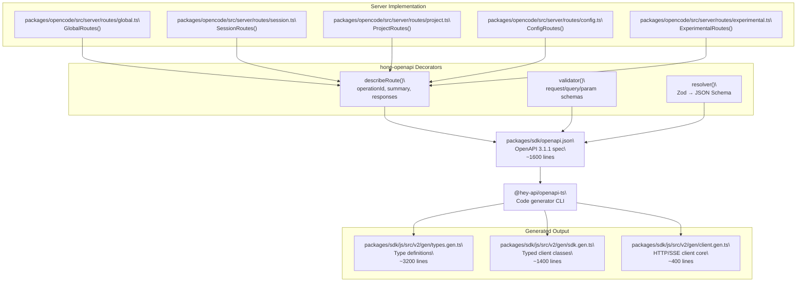
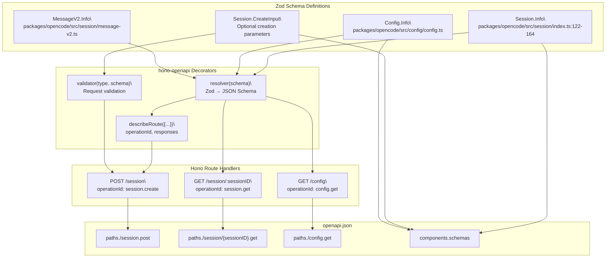
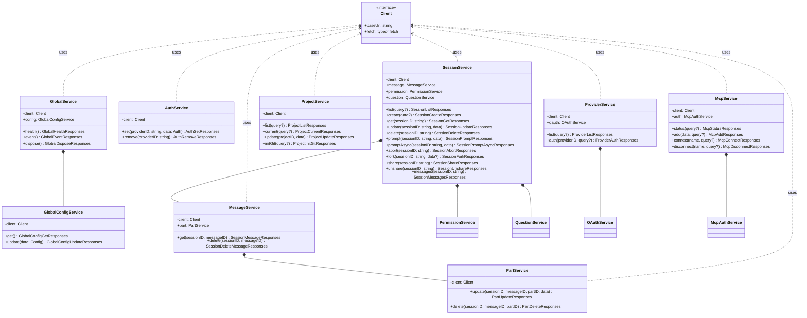
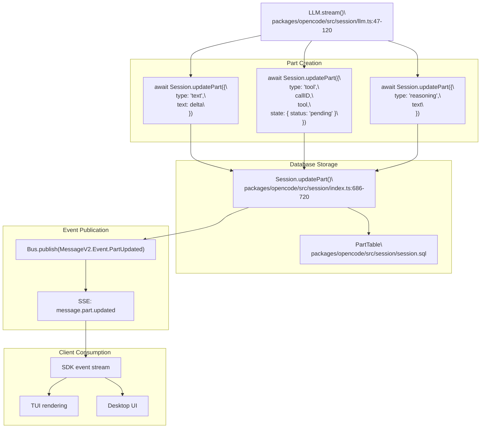
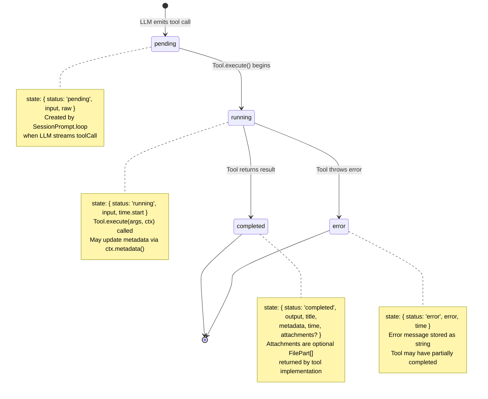
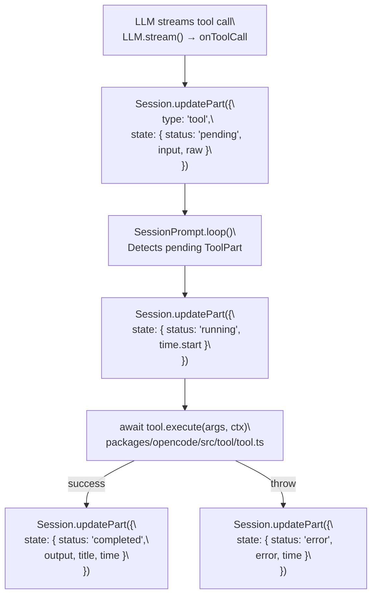

# OpenAPI Specification & Code Generation

<details>
<summary>Relevant source files</summary>

The following files were used as context for generating this wiki page:

- [packages/opencode/src/config/config.ts](packages/opencode/src/config/config.ts)
- [packages/opencode/src/env/index.ts](packages/opencode/src/env/index.ts)
- [packages/opencode/src/provider/error.ts](packages/opencode/src/provider/error.ts)
- [packages/opencode/src/provider/models.ts](packages/opencode/src/provider/models.ts)
- [packages/opencode/src/provider/provider.ts](packages/opencode/src/provider/provider.ts)
- [packages/opencode/src/provider/transform.ts](packages/opencode/src/provider/transform.ts)
- [packages/opencode/src/server/server.ts](packages/opencode/src/server/server.ts)
- [packages/opencode/src/session/compaction.ts](packages/opencode/src/session/compaction.ts)
- [packages/opencode/src/session/index.ts](packages/opencode/src/session/index.ts)
- [packages/opencode/src/session/llm.ts](packages/opencode/src/session/llm.ts)
- [packages/opencode/src/session/message-v2.ts](packages/opencode/src/session/message-v2.ts)
- [packages/opencode/src/session/message.ts](packages/opencode/src/session/message.ts)
- [packages/opencode/src/session/prompt.ts](packages/opencode/src/session/prompt.ts)
- [packages/opencode/src/session/revert.ts](packages/opencode/src/session/revert.ts)
- [packages/opencode/src/session/summary.ts](packages/opencode/src/session/summary.ts)
- [packages/opencode/src/tool/task.ts](packages/opencode/src/tool/task.ts)
- [packages/opencode/test/config/config.test.ts](packages/opencode/test/config/config.test.ts)
- [packages/opencode/test/provider/provider.test.ts](packages/opencode/test/provider/provider.test.ts)
- [packages/opencode/test/provider/transform.test.ts](packages/opencode/test/provider/transform.test.ts)
- [packages/opencode/test/session/llm.test.ts](packages/opencode/test/session/llm.test.ts)
- [packages/opencode/test/session/message-v2.test.ts](packages/opencode/test/session/message-v2.test.ts)
- [packages/opencode/test/session/revert-compact.test.ts](packages/opencode/test/session/revert-compact.test.ts)
- [packages/sdk/js/src/gen/sdk.gen.ts](packages/sdk/js/src/gen/sdk.gen.ts)
- [packages/sdk/js/src/gen/types.gen.ts](packages/sdk/js/src/gen/types.gen.ts)
- [packages/sdk/js/src/v2/gen/sdk.gen.ts](packages/sdk/js/src/v2/gen/sdk.gen.ts)
- [packages/sdk/js/src/v2/gen/types.gen.ts](packages/sdk/js/src/v2/gen/types.gen.ts)
- [packages/sdk/openapi.json](packages/sdk/openapi.json)

</details>

## Purpose and Scope

This page documents `packages/sdk/openapi.json` as the single source of truth for the opencode HTTP API, explains how the generated TypeScript files `types.gen.ts` and `sdk.gen.ts` are produced from it, and provides a reference for all API endpoints and SSE event schemas.

For how the typed SDK client is consumed by downstream packages, see [JavaScript SDK](#5.1). For how the HTTP server implements these routes at runtime, see [HTTP Server & REST API](#2.5).

---

## The Spec as Source of Truth

`packages/sdk/openapi.json` is an OpenAPI 3.1.1 document that describes every REST endpoint, every request/response schema, and every SSE event type. All generated TypeScript types and the typed client classes are derived from this single file.

Server-side route handlers are decorated using `hono-openapi`'s `describeRoute`, `validator`, and `resolver` helpers. These attach schema metadata to each Hono route and are used to keep the implementation synchronized with the spec. See for example [packages/opencode/src/server/routes/session.ts:26-70]() and [packages/opencode/src/server/routes/experimental.ts:15-50]().

---

## Code Generation Pipeline

`@hey-api/openapi-ts` reads `openapi.json` and emits files into `packages/sdk/js/src/v2/gen/`. The generated files include both TypeScript types and typed client classes. All generated files carry the header comment `// This file is auto-generated by @hey-api/openapi-ts` and must not be edited by hand.

| Output file     | Role                                                     | Key exports                                                       |
| --------------- | -------------------------------------------------------- | ----------------------------------------------------------------- |
| `types.gen.ts`  | All TypeScript types derived from spec component schemas | `Project`, `Session`, `Message`, `Part`, event types, error types |
| `sdk.gen.ts`    | Typed client classes, one per resource group             | `GlobalService`, `SessionService`, `ProjectService`, etc.         |
| `client.gen.ts` | Low-level HTTP/SSE client used by `sdk.gen.ts`           | `client` factory function, request builders                       |

**Code generation pipeline**



The generation process involves:

1. **Route Definition**: Server routes are defined in `packages/opencode/src/server/routes/*.ts` using Hono handlers decorated with `describeRoute`, `validator`, and `resolver` from `hono-openapi`.

2. **Spec Extraction**: The `hono-openapi` decorators attach OpenAPI metadata to routes, which is consolidated into `packages/sdk/openapi.json`. This spec defines all endpoints, request/response schemas, and component types.

3. **Code Generation**: The `@hey-api/openapi-ts` CLI reads the spec and generates TypeScript types and client classes. The generator maps:
   - Component schemas → TypeScript interfaces/types in `types.gen.ts`
   - Paths and operationIds → Typed client methods in `sdk.gen.ts`
   - SSE event schemas → Event type unions

4. **Client Usage**: Generated types and clients are exported from `packages/sdk/js/src/v2/index.ts` and consumed by UI packages (`app`, `desktop`, `tui`) and external integrations.

Sources: [packages/sdk/openapi.json:1-10](), [packages/sdk/js/src/v2/gen/types.gen.ts:1-2](), [packages/sdk/js/src/v2/gen/sdk.gen.ts:1-4](), [packages/opencode/src/server/server.ts:4-7](), [packages/opencode/src/server/routes/session.ts:1-20]()

---

## Route Decoration Pattern

Each Hono handler is annotated with `describeRoute` (summary, `operationId`, response schemas) and `validator` (request/query schemas). The `resolver` helper converts Zod schemas to inline JSON Schema for the spec.

**Example: Session create endpoint**

The session creation endpoint demonstrates the decoration pattern:

```typescript
// From packages/opencode/src/server/routes/session.ts
.post(
  "/",
  describeRoute({
    summary: "Create session",
    operationId: "session.create",
    responses: {
      200: {
        description: "Created session",
        content: {
          "application/json": {
            schema: resolver(Session.Info),
          },
        },
      },
    },
  }),
  validator("json", Session.CreateInput.optional()),
  async (c) => {
    const input = c.req.valid("json")
    const result = await Session.create(input)
    return c.json(result)
  }
)
```

**Route decoration data flow**



The pattern ensures that:

- Runtime validation (via `validator`) uses the same schema as the OpenAPI spec
- Response types (via `resolver`) are automatically derived from Zod schemas
- The `operationId` provides a stable identifier for code generation
- All schemas are centralized in domain modules (Session, Config, etc.) and referenced consistently

Sources: [packages/opencode/src/server/routes/session.ts:26-70](), [packages/opencode/src/server/routes/config.ts:15-50](), [packages/opencode/src/session/index.ts:122-164](), [packages/opencode/src/config/config.ts:42-267](), [packages/opencode/src/server/server.ts:4-7]()

---

## Generated SDK Client Architecture

`sdk.gen.ts` exports service classes generated from OpenAPI `operationId` values. Each service is initialized with a base client configured for HTTP or internal fetch transport.

**Generated client class structure**



**OperationId to method name mapping**

The code generator converts `operationId` values to method names:

| `operationId` (in spec) | Generated method            | Service class     |
| ----------------------- | --------------------------- | ----------------- |
| `global.health`         | `GlobalService.health()`    | `GlobalService`   |
| `session.create`        | `SessionService.create()`   | `SessionService`  |
| `session.prompt`        | `SessionService.prompt()`   | `SessionService`  |
| `session.message`       | `MessageService.get()`      | `MessageService`  |
| `part.update`           | `PartService.update()`      | `PartService`     |
| `config.get`            | `ConfigService.get()`       | `ConfigService`   |
| `config.providers`      | `ConfigService.providers()` | `ConfigService`   |
| `mcp.status`            | `McpService.status()`       | `McpService`      |
| `provider.list`         | `ProviderService.list()`    | `ProviderService` |

Sources: [packages/sdk/js/src/v2/gen/sdk.gen.ts:1-200](), [packages/sdk/openapi.json:8-50](), [packages/sdk/openapi.json:258-301](), [packages/sdk/openapi.json:1300-1400]()

---

## API Endpoint Reference

Most project-scoped endpoints accept optional `directory` (string) and `workspace` (string) query parameters to select the target project instance.

### Global

| Method  | Path              | `operationId`          | Description                                        |
| ------- | ----------------- | ---------------------- | -------------------------------------------------- |
| `GET`   | `/global/health`  | `global.health`        | Health check; returns `{ healthy: true, version }` |
| `GET`   | `/global/event`   | `global.event`         | SSE stream of `GlobalEvent` objects                |
| `GET`   | `/global/config`  | `global.config.get`    | Retrieve global configuration                      |
| `PATCH` | `/global/config`  | `global.config.update` | Update global configuration                        |
| `POST`  | `/global/dispose` | `global.dispose`       | Dispose all server instances                       |

### Auth

| Method   | Path                 | `operationId` | Description                       |
| -------- | -------------------- | ------------- | --------------------------------- |
| `PUT`    | `/auth/{providerID}` | `auth.set`    | Store credentials for a provider  |
| `DELETE` | `/auth/{providerID}` | `auth.remove` | Remove credentials for a provider |

### Config (project-scoped)

| Method  | Path                | `operationId`      | Description                                     |
| ------- | ------------------- | ------------------ | ----------------------------------------------- |
| `GET`   | `/config`           | `config.get`       | Get project-level configuration                 |
| `PATCH` | `/config`           | `config.update`    | Update project-level configuration              |
| `GET`   | `/config/providers` | `config.providers` | List configured AI providers and default models |

### Project

| Method  | Path                   | `operationId`     | Description                                    |
| ------- | ---------------------- | ----------------- | ---------------------------------------------- |
| `GET`   | `/project`             | `project.list`    | List all known projects                        |
| `GET`   | `/project/current`     | `project.current` | Get the currently active project               |
| `PATCH` | `/project/{projectID}` | `project.update`  | Update project name, icon, or startup commands |

### Session

| Method   | Path                                       | `operationId`           | Description                                |
| -------- | ------------------------------------------ | ----------------------- | ------------------------------------------ |
| `GET`    | `/session`                                 | `session.list`          | List sessions, most-recently-updated first |
| `GET`    | `/session/status`                          | `session.status`        | Status map for all sessions                |
| `POST`   | `/session`                                 | `session.create`        | Create a session                           |
| `GET`    | `/session/{sessionID}`                     | `session.get`           | Get session metadata                       |
| `PATCH`  | `/session/{sessionID}`                     | `session.update`        | Update session title or archived timestamp |
| `DELETE` | `/session/{sessionID}`                     | `session.delete`        | Permanently delete a session               |
| `GET`    | `/session/{sessionID}/children`            | `session.children`      | List forked child sessions                 |
| `GET`    | `/session/{sessionID}/todo`                | `session.todo`          | Get todo list for a session                |
| `POST`   | `/session/{sessionID}/init`                | `session.init`          | Generate `AGENTS.md` for the project       |
| `POST`   | `/session/{sessionID}/fork`                | `session.fork`          | Fork session at a specific message         |
| `POST`   | `/session/{sessionID}/abort`               | `session.abort`         | Abort active LLM processing                |
| `POST`   | `/session/{sessionID}/share`               | `session.share`         | Create a public share link                 |
| `DELETE` | `/session/{sessionID}/share`               | `session.unshare`       | Remove the share link                      |
| `GET`    | `/session/{sessionID}/diff`                | `session.diff`          | Get file diffs for a message               |
| `POST`   | `/session/{sessionID}/summarize`           | `session.summarize`     | Compact session via AI summary             |
| `GET`    | `/session/{sessionID}/message`             | `session.messages`      | List all messages in a session             |
| `GET`    | `/session/{sessionID}/message/{messageID}` | `session.message`       | Get a specific message                     |
| `DELETE` | `/session/{sessionID}/message/{messageID}` | `session.deleteMessage` | Delete a message                           |
| `POST`   | `/session/{sessionID}/prompt`              | `session.prompt`        | Send a user prompt (synchronous)           |
| `POST`   | `/session/{sessionID}/prompt/async`        | `session.prompt.async`  | Send a user prompt (asynchronous)          |
| `POST`   | `/session/{sessionID}/revert`              | `session.revert`        | Revert to a prior snapshot                 |
| `POST`   | `/session/{sessionID}/unrevert`            | `session.unrevert`      | Undo a revert                              |
| `POST`   | `/session/{sessionID}/command`             | `session.command`       | Execute a named command in session context |
| `POST`   | `/session/{sessionID}/shell`               | `session.shell`         | Run a shell command in session context     |

### Message Parts

| Method   | Path                                                     | `operationId` | Description           |
| -------- | -------------------------------------------------------- | ------------- | --------------------- |
| `PATCH`  | `/session/{sessionID}/message/{messageID}/part/{partID}` | `part.update` | Update a message part |
| `DELETE` | `/session/{sessionID}/message/{messageID}/part/{partID}` | `part.delete` | Delete a message part |

### Permissions

| Method | Path                                                  | `operationId`        | Description                      |
| ------ | ----------------------------------------------------- | -------------------- | -------------------------------- |
| `GET`  | `/session/{sessionID}/permission`                     | `permission.list`    | List pending permission requests |
| `POST` | `/session/{sessionID}/permission/{requestID}`         | `permission.reply`   | Reply to a permission request    |
| `POST` | `/session/{sessionID}/permission/{requestID}/respond` | `permission.respond` | Alternative respond endpoint     |

### Questions

| Method   | Path                                        | `operationId`     | Description            |
| -------- | ------------------------------------------- | ----------------- | ---------------------- |
| `GET`    | `/session/{sessionID}/question`             | `question.list`   | List pending questions |
| `POST`   | `/session/{sessionID}/question/{requestID}` | `question.reply`  | Answer a question      |
| `DELETE` | `/session/{sessionID}/question/{requestID}` | `question.reject` | Reject a question      |

### PTY

| Method   | Path                   | `operationId` | Description                             |
| -------- | ---------------------- | ------------- | --------------------------------------- |
| `GET`    | `/pty`                 | `pty.list`    | List active PTY sessions                |
| `POST`   | `/pty`                 | `pty.create`  | Create a PTY session                    |
| `GET`    | `/pty/{ptyID}`         | `pty.get`     | Get PTY session info                    |
| `PUT`    | `/pty/{ptyID}`         | `pty.update`  | Update PTY title or terminal dimensions |
| `DELETE` | `/pty/{ptyID}`         | `pty.remove`  | Terminate a PTY session                 |
| `GET`    | `/pty/{ptyID}/connect` | `pty.connect` | Attach to PTY over WebSocket            |

### MCP

| Method   | Path                            | `operationId`           | Description                        |
| -------- | ------------------------------- | ----------------------- | ---------------------------------- |
| `GET`    | `/mcp`                          | `mcp.status`            | List MCP server statuses           |
| `POST`   | `/mcp`                          | `mcp.add`               | Register and connect an MCP server |
| `POST`   | `/mcp/{name}/connect`           | `mcp.connect`           | Connect to an MCP server           |
| `DELETE` | `/mcp/{name}`                   | `mcp.disconnect`        | Disconnect an MCP server           |
| `POST`   | `/mcp/{name}/auth`              | `mcp.auth.start`        | Begin OAuth for an MCP server      |
| `GET`    | `/mcp/{name}/auth/callback`     | `mcp.auth.callback`     | Handle OAuth callback              |
| `POST`   | `/mcp/{name}/auth/authenticate` | `mcp.auth.authenticate` | Complete OAuth authentication      |
| `DELETE` | `/mcp/{name}/auth`              | `mcp.auth.remove`       | Remove stored OAuth token          |

### Providers

| Method | Path                                     | `operationId`              | Description                                |
| ------ | ---------------------------------------- | -------------------------- | ------------------------------------------ |
| `GET`  | `/provider`                              | `provider.list`            | List configured providers with model lists |
| `GET`  | `/provider/{providerID}/auth`            | `provider.auth`            | Check authentication status                |
| `GET`  | `/provider/{providerID}/oauth/authorize` | `provider.oauth.authorize` | Start OAuth authorization                  |
| `GET`  | `/provider/{providerID}/oauth/callback`  | `provider.oauth.callback`  | OAuth callback handler                     |

### Files & Search

| Method | Path            | `operationId`  | Description                           |
| ------ | --------------- | -------------- | ------------------------------------- |
| `GET`  | `/file`         | `file.list`    | List files in the project             |
| `GET`  | `/file/read`    | `file.read`    | Read a file's contents                |
| `GET`  | `/file/status`  | `file.status`  | VCS status of a file                  |
| `GET`  | `/find/files`   | `find.files`   | Search for files by name/glob pattern |
| `GET`  | `/find/symbols` | `find.symbols` | Search for symbols via LSP            |
| `GET`  | `/find/text`    | `find.text`    | Full-text search in workspace         |

### LSP & Formatters

| Method | Path         | `operationId`      | Description              |
| ------ | ------------ | ------------------ | ------------------------ |
| `GET`  | `/lsp`       | `lsp.status`       | List LSP server statuses |
| `GET`  | `/formatter` | `formatter.status` | List formatter statuses  |

### VCS

| Method | Path   | `operationId` | Description                          |
| ------ | ------ | ------------- | ------------------------------------ |
| `GET`  | `/vcs` | `vcs.get`     | Get VCS state (current branch, etc.) |

### TUI Control

These endpoints let external processes drive the TUI directly. See [Terminal User Interface (TUI)](#3.1) for context.

| Method | Path                  | `operationId`        | Description                         |
| ------ | --------------------- | -------------------- | ----------------------------------- |
| `POST` | `/tui/prompt/append`  | `tui.appendPrompt`   | Append text to the TUI prompt input |
| `POST` | `/tui/prompt/clear`   | `tui.clearPrompt`    | Clear the TUI prompt input          |
| `POST` | `/tui/prompt/submit`  | `tui.submitPrompt`   | Submit the TUI prompt               |
| `POST` | `/tui/command`        | `tui.executeCommand` | Execute a TUI command by name       |
| `POST` | `/tui/session/select` | `tui.selectSession`  | Navigate TUI to a session           |
| `POST` | `/tui/toast`          | `tui.showToast`      | Display a toast notification        |
| `GET`  | `/tui/sessions`       | `tui.openSessions`   | Open the sessions list panel        |
| `GET`  | `/tui/models`         | `tui.openModels`     | Open the model picker               |
| `GET`  | `/tui/themes`         | `tui.openThemes`     | Open the theme picker               |
| `GET`  | `/tui/help`           | `tui.openHelp`       | Open the help panel                 |

### Experimental

Endpoints under `/experimental/` are subject to change.

| Method   | Path                           | `operationId`                   | Description                                            |
| -------- | ------------------------------ | ------------------------------- | ------------------------------------------------------ |
| `GET`    | `/experimental/tool/ids`       | `tool.ids`                      | List all registered tool IDs                           |
| `GET`    | `/experimental/tool`           | `tool.list`                     | List tools with JSON schemas for a provider/model pair |
| `POST`   | `/experimental/worktree`       | `worktree.create`               | Create a git worktree                                  |
| `GET`    | `/experimental/worktree`       | `worktree.list`                 | List worktree directories                              |
| `DELETE` | `/experimental/worktree`       | `worktree.remove`               | Remove a git worktree and its branch                   |
| `POST`   | `/experimental/worktree/reset` | `worktree.reset`                | Reset worktree to the default branch                   |
| `GET`    | `/experimental/session`        | `experimental.session.list`     | List sessions across all projects (global)             |
| `GET`    | `/experimental/resource`       | `experimental.resource.list`    | List available MCP resources                           |
| `POST`   | `/experimental/workspace/{id}` | `experimental.workspace.create` | Create a named workspace                               |

Sources: [packages/sdk/openapi.json:1-1270](), [packages/opencode/src/server/routes/session.ts:23-600](), [packages/opencode/src/server/routes/experimental.ts:15-270](), [packages/sdk/js/src/v2/gen/sdk.gen.ts:1-186]()

---

## SSE Event Stream

`GET /global/event` returns a `text/event-stream` response. Each emitted event conforms to `GlobalEvent`:

```typescript
type GlobalEvent = {
  directory: string
  payload: Event
}
```

The `directory` field identifies which project instance emitted the event. The `payload` field is a discriminated union keyed on `type`.

**Event publication pattern**

Server-side code publishes events using `Bus.publish`:

```typescript
// From packages/opencode/src/session/index.ts
Database.effect(() =>
  Bus.publish(Event.Created, {
    info: result,
  })
)
```

Events are defined using `BusEvent.define`:

```typescript
// From packages/opencode/src/session/index.ts
export const Event = {
  Created: BusEvent.define(
    'session.created',
    z.object({
      info: Info,
    })
  ),
  Updated: BusEvent.define(
    'session.updated',
    z.object({
      info: Info,
    })
  ),
  // ...
}
```

The `GlobalBus` aggregates events from all instances and wraps them with the `directory` field before streaming to clients via SSE.

**SSE `Event` type taxonomy**

```mermaid
graph TD
    GlobalEvent["GlobalEvent\
{directory, payload: Event}"]

    GlobalEvent --> InstallationGroup["Installation events"]
    GlobalEvent --> ServerGroup["Server events"]
    GlobalEvent --> SessionGroup["Session events"]
    GlobalEvent --> MessageGroup["Message events"]
    GlobalEvent --> PartGroup["Part events"]
    GlobalEvent --> PermissionGroup["Permission events"]
    GlobalEvent --> QuestionGroup["Question events"]
    GlobalEvent --> LspGroup["LSP events"]
    GlobalEvent --> FileGroup["File events"]
    GlobalEvent --> TuiGroup["TUI events"]
    GlobalEvent --> McpGroup["MCP events"]
    GlobalEvent --> PtyGroup["PTY events"]
    GlobalEvent --> MiscGroup["Misc events"]

    InstallationGroup --> EIU["EventInstallationUpdated\
type: installation.updated"]
    InstallationGroup --> EIUA["EventInstallationUpdateAvailable\
type: installation.update-available"]

    ServerGroup --> ESID["EventServerInstanceDisposed\
type: server.instance.disposed"]
    ServerGroup --> ESC["EventServerConnected\
type: server.connected"]
    ServerGroup --> EGD["EventGlobalDisposed\
type: global.disposed"]

    SessionGroup --> ESCr["EventSessionCreated\
type: session.created"]
    SessionGroup --> ESUp["EventSessionUpdated\
type: session.updated"]
    SessionGroup --> ESDel["EventSessionDeleted\
type: session.deleted"]
    SessionGroup --> EStat["EventSessionStatus\
type: session.status"]
    SessionGroup --> ESI["EventSessionIdle\
type: session.idle"]
    SessionGroup --> ESComp["EventSessionCompacted\
type: session.compacted"]
    SessionGroup --> ESDiff["EventSessionDiff\
type: session.diff"]
    SessionGroup --> ESErr["EventSessionError\
type: session.error"]

    MessageGroup --> EMU["EventMessageUpdated\
type: message.updated"]
    MessageGroup --> EMR["EventMessageRemoved\
type: message.removed"]

    PartGroup --> EMPU["EventMessagePartUpdated\
type: message.part.updated"]
    PartGroup --> EMPD["EventMessagePartDelta\
type: message.part.delta"]
    PartGroup --> EMPR["EventMessagePartRemoved\
type: message.part.removed"]

    PermissionGroup --> EPA["EventPermissionAsked\
type: permission.asked"]
    PermissionGroup --> EPR["EventPermissionReplied\
type: permission.replied"]

    QuestionGroup --> EQA["EventQuestionAsked\
type: question.asked"]
    QuestionGroup --> EQR["EventQuestionReplied\
type: question.replied"]
    QuestionGroup --> EQRej["EventQuestionRejected\
type: question.rejected"]

    LspGroup --> ELCD["EventLspClientDiagnostics\
type: lsp.client.diagnostics"]
    LspGroup --> ELU["EventLspUpdated\
type: lsp.updated"]

    FileGroup --> EFE["EventFileEdited\
type: file.edited"]
    FileGroup --> EFWU["EventFileWatcherUpdated\
type: file.watcher.updated"]

    TuiGroup --> ETPA["EventTuiPromptAppend\
type: tui.prompt.append"]
    TuiGroup --> ETCE["EventTuiCommandExecute\
type: tui.command.execute"]
    TuiGroup --> ETTS["EventTuiToastShow\
type: tui.toast.show"]
    TuiGroup --> ETSS["EventTuiSessionSelect\
type: tui.session.select"]

    McpGroup --> EMTC["EventMcpToolsChanged\
type: mcp.tools.changed"]
    McpGroup --> EMBOF["EventMcpBrowserOpenFailed\
type: mcp.browser.open.failed"]

    PtyGroup --> EPtyCr["EventPtyCreated\
type: pty.created"]
    PtyGroup --> EPtyUp["EventPtyUpdated\
type: pty.updated"]
    PtyGroup --> EPtyEx["EventPtyExited\
type: pty.exited"]
    PtyGroup --> EPtyDel["EventPtyDeleted\
type: pty.deleted"]

    MiscGroup --> ETU["EventTodoUpdated\
type: todo.updated"]
    MiscGroup --> EPU["EventProjectUpdated\
type: project.updated"]
    MiscGroup --> EVcsBU["EventVcsBranchUpdated\
type: vcs.branch.updated"]
    MiscGroup --> EWtR["EventWorktreeReady\
type: worktree.ready"]
    MiscGroup --> EWtF["EventWorktreeFailed\
type: worktree.failed"]
    MiscGroup --> EWsR["EventWorkspaceReady\
type: workspace.ready"]
    MiscGroup --> EWsF["EventWorkspaceFailed\
type: workspace.failed"]
    MiscGroup --> ECE["EventCommandExecuted\
type: command.executed"]
```



Sources: [packages/sdk/js/src/v2/gen/types.gen.ts:959-1009](), [packages/sdk/openapi.json:44-68]()

---

## Key Schema Types

### `Part` — Message Part Union

`Part` is a discriminated union used to represent individual chunks within an assistant message. Each variant has a unique `type` field. Parts are stored in the `PartTable` database table and streamed to clients via `message.part.updated` events.

| `type`          | TypeScript type  | Purpose                                    | Database storage                                         |
| --------------- | ---------------- | ------------------------------------------ | -------------------------------------------------------- |
| `"text"`        | `TextPart`       | Plain text assistant output                | `{ type, text, synthetic?, ignored?, time?, metadata? }` |
| `"reasoning"`   | `ReasoningPart`  | Internal reasoning/thinking content        | `{ type, text, metadata?, time }`                        |
| `"tool"`        | `ToolPart`       | Tool call with `ToolState` lifecycle       | `{ type, callID, tool, state, metadata? }`               |
| `"file"`        | `FilePart`       | Attached file or image                     | `{ type, mime, filename?, url, source? }`                |
| `"subtask"`     | `SubtaskPart`    | Delegated subagent invocation              | `{ type, prompt, description, agent, model?, command? }` |
| `"step-start"`  | `StepStartPart`  | Beginning of an agent reasoning step       | `{ type, snapshot? }`                                    |
| `"step-finish"` | `StepFinishPart` | End of a step; carries token and cost data | `{ type, reason, snapshot?, cost, tokens }`              |
| `"snapshot"`    | `SnapshotPart`   | Filesystem snapshot reference              | `{ type, snapshot }`                                     |
| `"patch"`       | `PatchPart`      | Git patch record with affected files       | `{ type, hash, files[] }`                                |
| `"agent"`       | `AgentPart`      | Agent identity marker                      | `{ type, name, source? }`                                |
| `"retry"`       | `RetryPart`      | Retry attempt record                       | `{ type, attempt, error, time }`                         |
| `"compaction"`  | `CompactionPart` | Context compaction boundary marker         | `{ type, auto, overflow? }`                              |

**Part lifecycle in message stream**



Sources: [packages/sdk/js/src/v2/gen/types.gen.ts:378-546](), [packages/opencode/src/session/message-v2.ts:86-210](), [packages/opencode/src/session/index.ts:686-720](), [packages/opencode/src/session/session.sql:1-50]()

### `ToolState` — Tool Execution Lifecycle

A `ToolPart`'s `state` field is itself a discriminated union on `status`:

| `status`      | TypeScript type      | Notable fields                                                 | State transition                       |
| ------------- | -------------------- | -------------------------------------------------------------- | -------------------------------------- |
| `"pending"`   | `ToolStatePending`   | `input`, `raw`                                                 | Initial state when LLM emits tool call |
| `"running"`   | `ToolStateRunning`   | `input`, `title?`, `metadata?`, `time.start`                   | Tool.execute() starts                  |
| `"completed"` | `ToolStateCompleted` | `input`, `output`, `title`, `metadata`, `time`, `attachments?` | Tool.execute() succeeds                |
| `"error"`     | `ToolStateError`     | `input`, `error`, `metadata?`, `time`                          | Tool.execute() throws                  |

**Tool execution state machine**



**Tool execution code path**



Sources: [packages/sdk/js/src/v2/gen/types.gen.ts:477-530](), [packages/opencode/src/session/prompt.ts:544-670](), [packages/opencode/src/tool/tool.ts:1-100]()

### `AssistantMessage` Error Union

The optional `error` field on `AssistantMessage` is a named-error discriminated union on the `name` field:

| `name`                       | TypeScript type            |
| ---------------------------- | -------------------------- |
| `"ProviderAuthError"`        | `ProviderAuthError`        |
| `"UnknownError"`             | `UnknownError`             |
| `"MessageOutputLengthError"` | `MessageOutputLengthError` |
| `"MessageAbortedError"`      | `MessageAbortedError`      |
| `"StructuredOutputError"`    | `StructuredOutputError`    |
| `"ContextOverflowError"`     | `ContextOverflowError`     |
| `"APIError"`                 | `ApiError`                 |

Sources: [packages/sdk/js/src/v2/gen/types.gen.ts:362-522](), [packages/sdk/js/src/v2/gen/types.gen.ts:143-244]()
