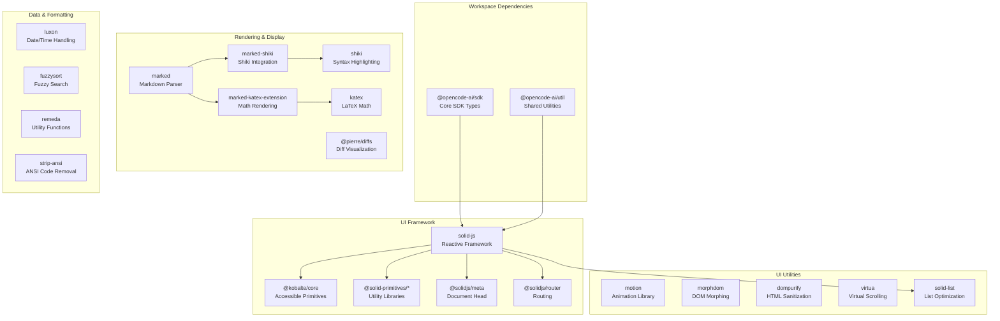
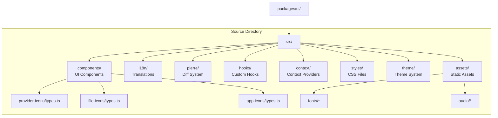

# Component Architecture & Exports

<details>
<summary>Relevant source files</summary>

The following files were used as context for generating this wiki page:

- [packages/ui/package.json](packages/ui/package.json)
- [packages/ui/src/components/button.css](packages/ui/src/components/button.css)
- [packages/ui/src/components/icon-button.css](packages/ui/src/components/icon-button.css)
- [packages/ui/src/components/icon-button.tsx](packages/ui/src/components/icon-button.tsx)
- [packages/ui/src/components/icon.tsx](packages/ui/src/components/icon.tsx)

</details>

## Purpose & Scope

This document describes the architecture and export system of the `@opencode-ai/ui` package, which serves as the foundational UI component library for OpenCode. It covers the package structure, export patterns, dependency architecture, and how components are organized for consumption by other workspace packages.

For details on specific UI components like `SessionTurn` and message rendering, see [Session Turn & Message Rendering](#4.2). For styling and theming implementation, see [Styling System & Themes](#4.3).

**Sources:** [packages/ui/package.json:1-76]()

## Package Overview

The `@opencode-ai/ui` package (`@opencode-ai/ui`) provides a comprehensive UI component library built on SolidJS and Kobalte. It serves as the base layer for all OpenCode user interfaces, including the web application, desktop applications, and the console management system.

Key characteristics:

- **Version**: 1.2.21
- **Framework**: SolidJS with TypeScript
- **UI Primitives**: Built on `@kobalte/core` for accessible components
- **Syntax Highlighting**: Integrated Shiki for code display
- **Diff Visualization**: Pierre library for file diffs
- **Styling**: Tailwind CSS with custom theme system

**Sources:** [packages/ui/package.json:2-4](), [packages/ui/package.json:44-75]()

## Package Structure & Exports

The package uses a granular export system that provides fine-grained access to different subsystems. This architecture allows consumers to import only what they need, reducing bundle size and improving tree-shaking.

### Export Categories

```mermaid
graph TB
    subgraph "Package Exports"
        PKG["@opencode-ai/ui"]
    end

    subgraph "Component Exports"
        COMP["Components<br/>./*"]
        ICONS_PROVIDER["Provider Icons<br/>./icons/provider"]
        ICONS_FILE["File Icons<br/>./icons/file-type"]
        ICONS_APP["App Icons<br/>./icons/app"]
    end

    subgraph "Functionality Exports"
        I18N["Internationalization<br/>./i18n/*"]
        PIERRE["Pierre Diffs<br/>./pierre, ./pierre/*"]
        HOOKS["React Hooks<br/>./hooks"]
        CONTEXT["Context Providers<br/>./context, ./context/*"]
    end

    subgraph "Styling Exports"
        STYLES["Base Styles<br/>./styles"]
        TAILWIND["Tailwind Styles<br/>./styles/tailwind"]
        THEME["Theme System<br/>./theme, ./theme/*"]
        THEME_CTX["Theme Context<br/>./theme/context"]
    end

    subgraph "Asset Exports"
        FONTS["Fonts<br/>./fonts/*"]
        AUDIO["Audio Files<br/>./audio/*"]
    end

    PKG --> COMP
    PKG --> ICONS_PROVIDER
    PKG --> ICONS_FILE
    PKG --> ICONS_APP
    PKG --> I18N
    PKG --> PIERRE
    PKG --> HOOKS
    PKG --> CONTEXT
    PKG --> STYLES
    PKG --> TAILWIND
    PKG --> THEME
    PKG --> THEME_CTX
    PKG --> FONTS
    PKG --> AUDIO
```



**Sources:** [packages/ui/package.json:6-25]()

### Export Mappings

The package exports are defined in `package.json` and map to the following file system locations:

| Export Path         | File System Path                           | Purpose                         |
| ------------------- | ------------------------------------------ | ------------------------------- |
| `./*`               | `./src/components/*.tsx`                   | Direct component imports        |
| `./i18n/*`          | `./src/i18n/*.ts`                          | Internationalization utilities  |
| `./pierre`          | `./src/pierre/index.ts`                    | Pierre diff library main export |
| `./pierre/*`        | `./src/pierre/*.ts`                        | Individual Pierre modules       |
| `./hooks`           | `./src/hooks/index.ts`                     | Custom SolidJS hooks            |
| `./context`         | `./src/context/index.ts`                   | Context provider index          |
| `./context/*`       | `./src/context/*.tsx`                      | Individual context providers    |
| `./styles`          | `./src/styles/index.css`                   | Base CSS styles                 |
| `./styles/tailwind` | `./src/styles/tailwind/index.css`          | Tailwind configuration          |
| `./theme`           | `./src/theme/index.ts`                     | Theme utilities                 |
| `./theme/*`         | `./src/theme/*.ts`                         | Theme modules                   |
| `./theme/context`   | `./src/theme/context.tsx`                  | Theme context provider          |
| `./icons/provider`  | `./src/components/provider-icons/types.ts` | Provider icon types             |
| `./icons/file-type` | `./src/components/file-icons/types.ts`     | File icon types                 |
| `./icons/app`       | `./src/components/app-icons/types.ts`      | App icon types                  |
| `./fonts/*`         | `./src/assets/fonts/*`                     | Font files                      |
| `./audio/*`         | `./src/assets/audio/*`                     | Audio assets                    |

**Sources:** [packages/ui/package.json:6-25]()

### Component Import Pattern

Components use a wildcard export pattern where each `.tsx` file in `src/components/` is directly importable:

```typescript
// Consumer usage example:
import { Button } from '@opencode-ai/ui/button'
import { Dialog } from '@opencode-ai/ui/dialog'
import { SessionTurn } from '@opencode-ai/ui/session-turn'
```

This pattern defined at [packages/ui/package.json:8]() maps `@opencode-ai/ui/*` to `./src/components/*.tsx`, allowing direct imports without an index file.

**Sources:** [packages/ui/package.json:8]()

## Dependency Architecture

The package has a carefully curated dependency tree that provides specific functionality:

### Core Framework Dependencies



**Sources:** [packages/ui/package.json:44-75]()

### Key Dependencies by Function

#### UI Framework & Primitives

- **solid-js**: Core reactive framework for building user interfaces
- **@kobalte/core**: Unstyled, accessible UI primitives (dialogs, dropdowns, tooltips, etc.)
- **@solid-primitives/bounds**: Element size and position tracking
- **@solid-primitives/lifecycle**: Component lifecycle utilities
- **@solid-primitives/media**: Media query reactive primitives
- **@solid-primitives/page-visibility**: Page visibility state tracking
- **@solid-primitives/resize-observer**: Resize observation
- **@solid-primitives/rootless**: Portal/teleport utilities
- **@solidjs/meta**: Document head management
- **@solidjs/router**: Client-side routing

**Sources:** [packages/ui/package.json:45](), [packages/ui/package.json:50-57](), [packages/ui/package.json:71]()

#### Code Display & Syntax Highlighting

- **shiki**: Syntax highlighting engine using TextMate grammars
- **@shikijs/transformers**: Code transformers for enhanced display
- **marked**: Markdown parsing to HTML
- **marked-shiki**: Shiki integration for marked
- **marked-katex-extension**: KaTeX math rendering for marked
- **katex**: LaTeX math typesetting

**Sources:** [packages/ui/package.json:49](), [packages/ui/package.json:60-64](), [packages/ui/package.json:70]()

#### Diff Visualization

- **@pierre/diffs**: Advanced diff visualization library for showing file changes

**Sources:** [packages/ui/package.json:48]()

#### Animation & DOM Manipulation

- **motion**: Animation library for smooth transitions
- **motion-dom**: DOM-specific motion utilities
- **motion-utils**: Motion utility functions
- **morphdom**: Efficiently morph one DOM tree into another

**Sources:** [packages/ui/package.json:65-68]()

#### Performance Optimization

- **virtua**: Virtual scrolling for large lists
- **solid-list**: Optimized list rendering for SolidJS

**Sources:** [packages/ui/package.json:72](), [packages/ui/package.json:74]()

#### Utilities

- **luxon**: Modern date and time library
- **fuzzysort**: Fast fuzzy search algorithm
- **remeda**: Functional utility library
- **dompurify**: HTML sanitization to prevent XSS
- **strip-ansi**: Remove ANSI escape codes from strings

**Sources:** [packages/ui/package.json:58-59](), [packages/ui/package.json:61](), [packages/ui/package.json:69](), [packages/ui/package.json:73]()

#### Workspace Dependencies

- **@opencode-ai/sdk**: Provides TypeScript types and interfaces for the OpenCode API
- **@opencode-ai/util**: Shared utility functions used across the workspace

**Sources:** [packages/ui/package.json:46-47]()

## Directory Structure

Based on the export mappings, the package follows this directory structure:



**Sources:** [packages/ui/package.json:6-25]()

## Build & Development Configuration

### TypeScript Configuration

The package uses TypeScript for type checking with the `tsgo` tool, configured with Node.js 22 types:

```json
"scripts": {
  "typecheck": "tsgo --noEmit"
}
```

**Sources:** [packages/ui/package.json:27]()

### Styling System

The package includes both base CSS and Tailwind CSS:

- **Base Styles**: Available via `@opencode-ai/ui/styles`
- **Tailwind Styles**: Available via `@opencode-ai/ui/styles/tailwind`
- **Tailwind Generation**: Custom script at `script/tailwind.ts` for generating Tailwind configuration

**Sources:** [packages/ui/package.json:15-16](), [packages/ui/package.json:29]()

### Development Tools

The package uses Vite for development with several plugins:

- **@tailwindcss/vite**: Tailwind CSS integration
- **vite-plugin-solid**: SolidJS support
- **vite-plugin-icons-spritesheet**: Icon spritesheet generation

**Sources:** [packages/ui/package.json:28](), [packages/ui/package.json:31-42]()

## Usage Patterns

### Consuming Components

Other workspace packages consume `@opencode-ai/ui` components through the defined export paths:

```typescript
// Import individual components
import { Button } from '@opencode-ai/ui/button'
import { SessionTurn } from '@opencode-ai/ui/session-turn'

// Import hooks
import { useTheme } from '@opencode-ai/ui/hooks'

// Import context providers
import { ThemeProvider } from '@opencode-ai/ui/theme/context'

// Import styles
import '@opencode-ai/ui/styles'
import '@opencode-ai/ui/styles/tailwind'

// Import theme utilities
import { colors } from '@opencode-ai/ui/theme'

// Import Pierre diff utilities
import { DiffView } from '@opencode-ai/ui/pierre'

// Import icon types
import type { ProviderIcon } from '@opencode-ai/ui/icons/provider'
import type { FileIcon } from '@opencode-ai/ui/icons/file-type'
```

**Sources:** [packages/ui/package.json:8-23]()

### Integration with Other Packages

The UI package is consumed by:

- **@opencode-ai/app**: Application-level components that build on UI primitives
- **@opencode-ai/console-app**: Console frontend application
- **@opencode-ai/web**: Public website
- **@opencode-ai/desktop**: Desktop application (Tauri)
- **@opencode-ai/desktop-electron**: Electron desktop application

These packages import components, hooks, contexts, and styles from `@opencode-ai/ui` to build their user interfaces.

**Sources:** Package ecosystem diagram from system overview

## Component Categories

While specific components are documented in [Session Turn & Message Rendering](#4.2), the package organizes components into these functional categories based on the icon type exports:

### Icon Type Categories

The package exports TypeScript types for three icon categories:

1. **Provider Icons** (`./icons/provider`): Type definitions for AI provider logos and icons
2. **File Type Icons** (`./icons/file-type`): Type definitions for file extension and language icons
3. **App Icons** (`./icons/app`): Type definitions for application and UI icons

These type exports suggest corresponding component implementations in the `src/components/` directory.

**Sources:** [packages/ui/package.json:20-22]()

## Summary

The `@opencode-ai/ui` package provides a modular, well-architected component library with:

- **Granular Exports**: Fine-grained export system allowing consumers to import only what they need
- **Direct Component Access**: Wildcard export pattern for straightforward component imports
- **Rich Dependencies**: Comprehensive set of libraries for rendering, animation, syntax highlighting, and utilities
- **Type Safety**: Full TypeScript support with exported type definitions
- **Multiple Subsystems**: Components, hooks, contexts, themes, and utilities organized into distinct namespaces
- **Asset Management**: Exported fonts and audio files for consistent branding

This architecture enables other workspace packages to build rich, interactive user interfaces while maintaining a clean separation of concerns and optimal bundle sizes.

**Sources:** [packages/ui/package.json:1-76]()
