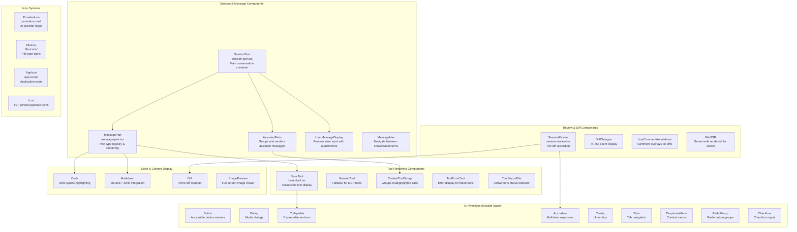
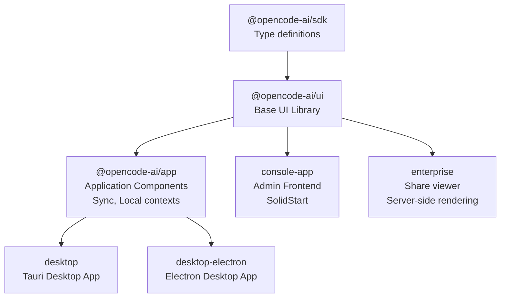
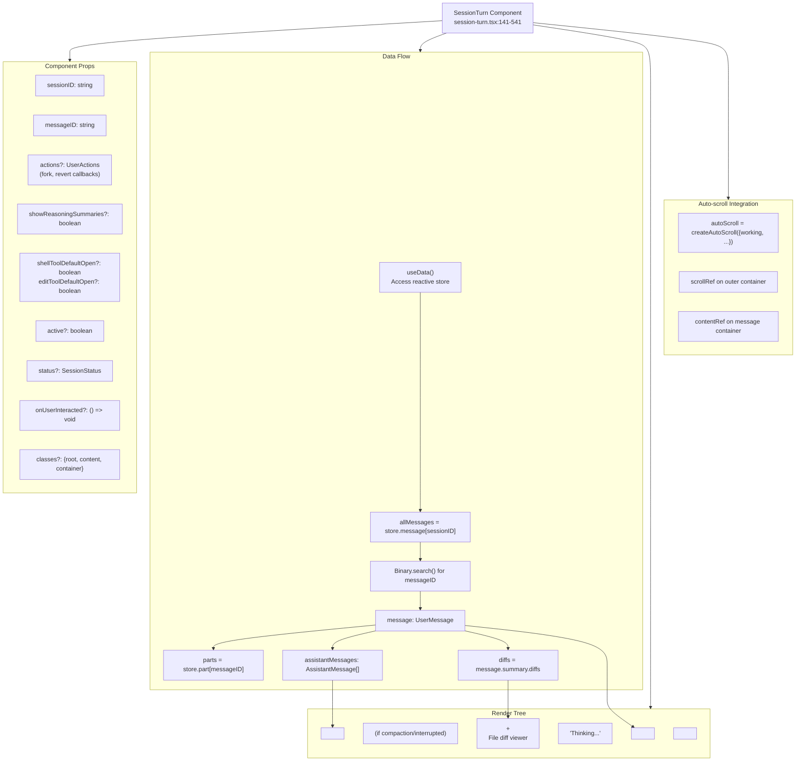
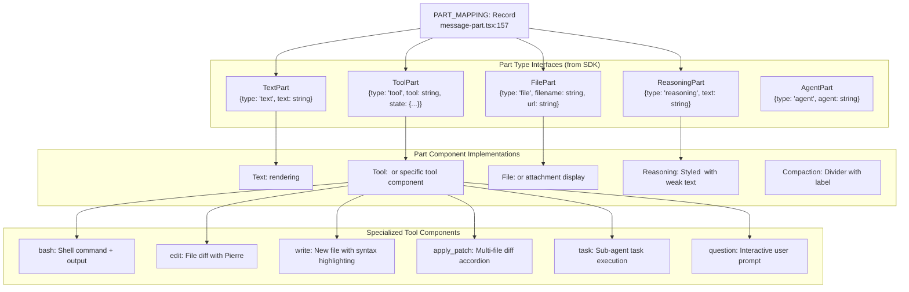

# UI Component Library

<details>
<summary>Relevant source files</summary>

The following files were used as context for generating this wiki page:

- [packages/app/src/pages/directory-layout.tsx](packages/app/src/pages/directory-layout.tsx)
- [packages/app/src/pages/session/review-tab.tsx](packages/app/src/pages/session/review-tab.tsx)
- [packages/enterprise/src/routes/share/[shareID].tsx](packages/enterprise/src/routes/share/[shareID].tsx)
- [packages/ui/package.json](packages/ui/package.json)
- [packages/ui/src/components/basic-tool.tsx](packages/ui/src/components/basic-tool.tsx)
- [packages/ui/src/components/message-part.css](packages/ui/src/components/message-part.css)
- [packages/ui/src/components/message-part.tsx](packages/ui/src/components/message-part.tsx)
- [packages/ui/src/components/session-review.css](packages/ui/src/components/session-review.css)
- [packages/ui/src/components/session-review.tsx](packages/ui/src/components/session-review.tsx)
- [packages/ui/src/components/session-turn.css](packages/ui/src/components/session-turn.css)
- [packages/ui/src/components/session-turn.tsx](packages/ui/src/components/session-turn.tsx)
- [packages/ui/src/components/sticky-accordion-header.css](packages/ui/src/components/sticky-accordion-header.css)
- [packages/ui/src/context/data.tsx](packages/ui/src/context/data.tsx)
- [packages/ui/src/hooks/create-auto-scroll.tsx](packages/ui/src/hooks/create-auto-scroll.tsx)
- [packages/ui/src/pierre/index.ts](packages/ui/src/pierre/index.ts)
- [packages/ui/src/pierre/worker.ts](packages/ui/src/pierre/worker.ts)

</details>

## Purpose and Scope

The `@opencode-ai/ui` package provides the foundational UI component library for OpenCode's frontend applications. It contains reusable SolidJS components, theming utilities, styling systems, and assets that are shared across the web application, desktop applications, and console frontend.

This page provides an overview of the package structure, dependencies, and component categories. For detailed information about specific subsystems:

- Component architecture and export patterns: see [Component Architecture & Exports](#4.1)
- Session UI and message rendering: see [Session Turn & Message Rendering](#4.2)
- Styling and theming: see [Styling System & Themes](#4.3)
- General application components (Terminal, Diffs): see the `@opencode-ai/app` package documentation

---

## Package Structure

The `@opencode-ai/ui` package is organized into several logical subsystems that can be imported independently through well-defined export paths.

### Export Map Structure

```mermaid
graph TB
    subgraph Package["@opencode-ai/ui"]
        Components["Components<br/>./src/components/*.tsx<br/>Exported via ./*"]
        I18n["Internationalization<br/>./src/i18n/*.ts<br/>Exported via ./i18n/*"]
        Pierre["Pierre Utilities<br/>./src/pierre/*.ts<br/>Exported via ./pierre/*"]
        Hooks["Hooks<br/>./src/hooks/index.ts<br/>Exported via ./hooks"]
        Context["Context Providers<br/>./src/context/*.tsx<br/>Exported via ./context/*"]
        Styles["Styles<br/>./src/styles/index.css<br/>Exported via ./styles"]
        TailwindStyles["Tailwind Styles<br/>./src/styles/tailwind/index.css<br/>Exported via ./styles/tailwind"]
        Theme["Theme System<br/>./src/theme/*.ts<br/>Exported via ./theme/*"]
        ThemeContext["Theme Context<br/>./src/theme/context.tsx<br/>Exported via ./theme/context"]
        IconTypes["Icon Types<br/>provider, file-type, app<br/>Type definitions"]
        Assets["Assets<br/>fonts/*, audio/*<br/>Static resources"]
    end

    Package --> Components
    Package --> I18n
    Package --> Pierre
    Package --> Hooks
    Package --> Context
    Package --> Styles
    Package --> TailwindStyles
    Package --> Theme
    Package --> ThemeContext
    Package --> IconTypes
    Package --> Assets
```



**Sources:** [packages/ui/package.json:6-25]()

### Key Export Patterns

| Export Path         | Source Location                            | Purpose                           |
| ------------------- | ------------------------------------------ | --------------------------------- |
| `./*`               | `./src/components/*.tsx`                   | Individual component imports      |
| `./i18n/*`          | `./src/i18n/*.ts`                          | Internationalization utilities    |
| `./pierre`          | `./src/pierre/index.ts`                    | Pierre diff rendering utilities   |
| `./hooks`           | `./src/hooks/index.ts`                     | Shared SolidJS hooks              |
| `./context`         | `./src/context/index.ts`                   | Context providers                 |
| `./styles`          | `./src/styles/index.css`                   | Base CSS styles                   |
| `./styles/tailwind` | `./src/styles/tailwind/index.css`          | Tailwind-based styles             |
| `./theme`           | `./src/theme/index.ts`                     | Theme utilities and definitions   |
| `./icons/provider`  | `./src/components/provider-icons/types.ts` | Provider icon type definitions    |
| `./icons/file-type` | `./src/components/file-icons/types.ts`     | File icon type definitions        |
| `./icons/app`       | `./src/components/app-icons/types.ts`      | Application icon type definitions |

**Sources:** [packages/ui/package.json:6-25]()

---

## Core Dependencies

The UI package builds on several foundational libraries that provide core functionality:

### Dependency Architecture

```mermaid
graph TB
    UI["@opencode-ai/ui"]

    subgraph "Internal Dependencies"
        SDK["@opencode-ai/sdk<br/>Core types, API client"]
        UTIL["@opencode-ai/util<br/>Shared utilities"]
    end

    subgraph "Framework & UI Primitives"
        Solid["solid-js<br/>Reactive UI framework"]
        Kobalte["@kobalte/core<br/>Accessible component primitives"]
        Router["@solidjs/router<br/>Routing"]
        Meta["@solidjs/meta<br/>Document head management"]
    end

    subgraph "Rendering & Syntax"
        Shiki["shiki<br/>Syntax highlighting"]
        ShikiTransform["@shikijs/transformers<br/>Code transformers"]
        MarkedShiki["marked-shiki<br/>Markdown + syntax highlighting"]
        Marked["marked<br/>Markdown parser"]
        MarkedKatex["marked-katex-extension<br/>Math rendering"]
        Katex["katex<br/>Math typesetting"]
    end

    subgraph "Diffs & Animations"
        Pierre["@pierre/diffs<br/>Diff rendering"]
        Motion["motion<br/>Animation library"]
        MotionDOM["motion-dom<br/>DOM animations"]
    end

    subgraph "Utilities & Primitives"
        Primitives["@solid-primitives/*<br/>bounds, lifecycle, media,<br/>page-visibility, resize-observer,<br/>rootless"]
        Virtua["virtua<br/>Virtual scrolling"]
        SolidList["solid-list<br/>List rendering"]
        Morphdom["morphdom<br/>DOM morphing"]
        DomPurify["dompurify<br/>HTML sanitization"]
        StripAnsi["strip-ansi<br/>ANSI code stripping"]
        Fuzzysort["fuzzysort<br/>Fuzzy search"]
        Luxon["luxon<br/>Date/time handling"]
        Remeda["remeda<br/>Utility functions"]
    end

    UI --> SDK
    UI --> UTIL
    UI --> Solid
    UI --> Kobalte
    UI --> Router
    UI --> Meta
    UI --> Shiki
    UI --> ShikiTransform
    UI --> MarkedShiki
    UI --> Marked
    UI --> MarkedKatex
    UI --> Katex
    UI --> Pierre
    UI --> Motion
    UI --> MotionDOM
    UI --> Primitives
    UI --> Virtua
    UI --> SolidList
    UI --> Morphdom
    UI --> DomPurify
    UI --> StripAnsi
    UI --> Fuzzysort
    UI --> Luxon
    UI --> Remeda
```



**Sources:** [packages/ui/package.json:44-75]()

### Primary Dependencies by Category

| Category                  | Package               | Purpose                                                                    |
| ------------------------- | --------------------- | -------------------------------------------------------------------------- |
| **Framework**             | `solid-js`            | Reactive UI framework with fine-grained reactivity                         |
| **Accessible Components** | `@kobalte/core`       | Headless, accessible UI component primitives (dialogs, dropdowns, etc.)    |
| **Syntax Highlighting**   | `shiki`               | Fast, accurate syntax highlighting using TextMate grammars                 |
| **Markdown**              | `marked`              | Markdown to HTML parser with extensibility                                 |
| **Math Rendering**        | `katex`               | Fast, typographically-correct math rendering                               |
| **Diffs**                 | `@pierre/diffs`       | Side-by-side diff rendering with syntax highlighting                       |
| **Animations**            | `motion`              | Declarative animations for SolidJS                                         |
| **Virtualization**        | `virtua`              | Virtual scrolling for large lists (message history)                        |
| **Utilities**             | `@solid-primitives/*` | Collection of SolidJS utilities for bounds, media queries, lifecycle, etc. |

**Sources:** [packages/ui/package.json:44-75]()

---

## Component Categories

The UI package contains several categories of components, organized by their functional domain:

### Core Component Architecture



**Sources:** [packages/ui/src/components/session-turn.tsx:1-542](), [packages/ui/src/components/message-part.tsx:1-1500](), [packages/ui/src/components/session-review.tsx:1-500](), [packages/ui/src/components/basic-tool.tsx:1-252]()

### Component Directory Structure

The components are organized by functionality:

| Category            | Key Components                                 | Purpose                                     |
| ------------------- | ---------------------------------------------- | ------------------------------------------- |
| **Session/Message** | `SessionTurn`, `MessagePart`, `AssistantParts` | Render conversation turns and message parts |
| **Tool Display**    | `BasicTool`, `GenericTool`, `ContextToolGroup` | Render tool calls (bash, edit, read, etc.)  |
| **Review/Diffs**    | `SessionReview`, `Diff`, `DiffChanges`         | Display file changes and review UI          |
| **Code Display**    | `Code`, `Markdown`                             | Syntax-highlighted code and markdown        |
| **Icons**           | `Icon`, `ProviderIcon`, `FileIcon`             | Icon rendering systems                      |
| **Primitives**      | `Button`, `Dialog`, `Accordion`, etc.          | Accessible base components                  |
| **Layout**          | `ScrollView`, `ResizablePanel`                 | Layout and structure components             |

**Sources:** [packages/ui/package.json:8]()

---

## Context Providers and State Management

The UI library provides several context providers that manage state and configuration across components:

### Context Provider Architecture

```mermaid
graph TB
    subgraph Contexts["Context Providers (./context/*)"]
        DataProvider["DataProvider<br/>data.tsx<br/>Session, message, part data"]
        FileComponentProvider["FileComponentProvider<br/>file.tsx<br/>Injects file viewer component"]
        I18nProvider["I18nProvider<br/>i18n.tsx<br/>Internationalization"]
        DialogProvider["DialogProvider<br/>dialog.tsx<br/>Modal dialog management"]
        WorkerPoolProvider["WorkerPoolProvider<br/>worker-pool.tsx<br/>Pierre diff workers"]
        ThemeProvider["ThemeProvider<br/>../theme/context.tsx<br/>Theme state"]
    end

    subgraph Consumers["Component Consumers"]
        SessionTurn["SessionTurn"]
        SessionReview["SessionReview"]
        MessagePart["MessagePart"]
        UserMessage["UserMessageDisplay"]
    end

    DataProvider --> SessionTurn
    DataProvider --> MessagePart
    FileComponentProvider --> SessionReview
    FileComponentProvider --> MessagePart
    I18nProvider --> SessionTurn
    I18nProvider --> MessagePart
    DialogProvider --> UserMessage
    WorkerPoolProvider --> SessionReview
    ThemeProvider --> SessionTurn

    subgraph StateStructure["DataProvider Store Structure"]
        Provider["provider: ProviderListResponse"]
        Session["session: Session[]"]
        SessionStatus["session_status: Record<sessionID, SessionStatus>"]
        SessionDiff["session_diff: Record<sessionID, FileDiff[]>"]
        Message["message: Record<sessionID, Message[]>"]
        Part["part: Record<messageID, Part[]>"]
    end

    DataProvider --> Provider
    DataProvider --> Session
    DataProvider --> SessionStatus
    DataProvider --> SessionDiff
    DataProvider --> Message
    DataProvider --> Part
```



**Sources:** [packages/ui/src/context/data.tsx:1-49](), [packages/app/src/pages/directory-layout.tsx:14-29]()

### DataProvider Store Schema

The `DataProvider` is the central state management context that provides reactive access to session data:

| Store Key        | Type                               | Purpose                                           |
| ---------------- | ---------------------------------- | ------------------------------------------------- |
| `provider`       | `ProviderListResponse`             | Available LLM providers and models                |
| `session`        | `Session[]`                        | List of conversation sessions                     |
| `session_status` | `Record<sessionID, SessionStatus>` | Real-time status per session (idle/retry/working) |
| `session_diff`   | `Record<sessionID, FileDiff[]>`    | File changes per session                          |
| `message`        | `Record<sessionID, Message[]>`     | Messages grouped by session                       |
| `part`           | `Record<messageID, Part[]>`        | Message parts (text, tool, file, reasoning)       |

The store is consumed via the `useData()` hook and provides reactive updates when the underlying data changes through SSE events.

**Sources:** [packages/ui/src/context/data.tsx:5-48]()

## Integration with Frontend Applications

The UI library serves as a foundation for multiple frontend applications in the OpenCode ecosystem:

### Consumer Relationship



**Sources:** [packages/enterprise/src/routes/share/[shareID].tsx:1-400](), [packages/app/src/pages/directory-layout.tsx:1-94]()

### Usage Patterns

Applications import from `@opencode-ai/ui` using the defined export paths:

```typescript
// Component imports
import { SessionTurn } from '@opencode-ai/ui/session-turn'
import { SessionReview } from '@opencode-ai/ui/session-review'

// Hooks
import { createAutoScroll } from '@opencode-ai/ui/hooks'

// Context providers
import { DataProvider, useData } from '@opencode-ai/ui/context'
import { FileComponentProvider } from '@opencode-ai/ui/context/file'

// Styles
import '@opencode-ai/ui/styles'
import '@opencode-ai/ui/styles/tailwind'

// Types
import type { ProviderIconId } from '@opencode-ai/ui/icons/provider'
```

The UI package provides the primitive components and contexts, while `@opencode-ai/app` builds higher-level features like `SyncProvider` and `LocalProvider` on top of these primitives.

**Sources:** [packages/ui/package.json:6-25](), [packages/enterprise/src/routes/share/[shareID].tsx:1-10]()

---

## Build and Development

### Development Scripts

| Script              | Command                      | Purpose                                         |
| ------------------- | ---------------------------- | ----------------------------------------------- |
| `typecheck`         | `tsgo --noEmit`              | Type check without emitting files               |
| `dev`               | `vite`                       | Start Vite dev server for component development |
| `generate:tailwind` | `bun run script/tailwind.ts` | Generate Tailwind CSS utilities                 |

**Sources:** [packages/ui/package.json:26-30]()

### Build Configuration

The package uses several build tools:

- **Vite**: Development server and build tool
- **TypeScript**: Type checking using the native TypeScript compiler
- **Tailwind CSS**: Utility-first CSS framework via `@tailwindcss/vite`
- **Vite Plugins**:
  - `vite-plugin-solid`: SolidJS support
  - `vite-plugin-icons-spritesheet`: Icon sprite sheet generation

**Sources:** [packages/ui/package.json:31-42]()

---

## SessionTurn Component Architecture

The `SessionTurn` component is the primary container for rendering a conversation turn (user message + assistant response):

### SessionTurn Structure



**Sources:** [packages/ui/src/components/session-turn.tsx:141-541]()

### SessionTurn Data Loading Pattern

The component uses memoized queries to load related data:

1. **Find user message**: Binary search in `store.message[sessionID]` for the given `messageID`
2. **Load message parts**: Read from `store.part[messageID]` (text, tool, file parts)
3. **Find assistant responses**: Scan messages after the user message until next user message
4. **Extract file diffs**: Read from `message.summary.diffs` for file change preview
5. **Track active state**: Check if this turn is currently streaming via `pending()` memo

**Sources:** [packages/ui/src/components/session-turn.tsx:169-281]()

### SessionTurn Rendering Logic

The component conditionally renders sections based on state:

| Section         | Condition                         | Content                                                  |
| --------------- | --------------------------------- | -------------------------------------------------------- |
| User Message    | Always                            | `<Message>` with text, attachments, agent/model metadata |
| Divider         | `compaction()` or `interrupted()` | Horizontal line with label                               |
| Assistant Parts | `assistantMessages().length > 0`  | `<AssistantParts>` with all response parts               |
| Thinking        | `showThinking()`                  | Shimmer animation while streaming, no visible parts yet  |
| Session Retry   | `status().type === 'retry'`       | Retry indicator when agent is retrying                   |
| File Diffs      | `edited() > 0 && !working()`      | Collapsible accordion with file changes                  |
| Error Card      | `error()` present                 | Red error card with unwrapped error message              |

**Sources:** [packages/ui/src/components/session-turn.tsx:389-533]()

---

## MessagePart Component and Part Type System

The `MessagePart` component implements a dynamic part rendering system based on part types:

### Part Type Registry



**Sources:** [packages/ui/src/components/message-part.tsx:157](), [packages/ui/src/components/message-part.tsx:1-30]()

### Part Rendering Flow

The `Part` component in `message-part.tsx` dynamically renders parts:

1. **Check `PART_MAPPING`**: Look up custom component for `part.type`
2. **Built-in types**: Handle `text`, `tool`, `file`, `reasoning` with specialized rendering
3. **Tool expansion**: For `tool` parts, check tool name and render appropriate tool component
4. **Context grouping**: Group consecutive `read`/`grep`/`glob`/`list` tools into `ContextToolGroup`
5. **Fallback**: Use `GenericTool` for unknown MCP tools

**Sources:** [packages/ui/src/components/message-part.tsx:690-786]()

### Tool Info System

The `getToolInfo()` function maps tool names to UI metadata:

| Tool       | Icon                    | Title                      | Subtitle Source           |
| ---------- | ----------------------- | -------------------------- | ------------------------- |
| `read`     | `glasses`               | "Read file"                | `input.filePath` filename |
| `edit`     | `code-lines`            | "Edit file"                | `input.filePath` filename |
| `write`    | `code-lines`            | "Write file"               | `input.filePath` filename |
| `bash`     | `console`               | "Shell command"            | `input.description`       |
| `task`     | `task`                  | "Build/Plan/Explore Agent" | `input.description`       |
| `glob`     | `magnifying-glass-menu` | "Find files"               | `input.pattern`           |
| `grep`     | `magnifying-glass-menu` | "Search files"             | `input.pattern`           |
| `question` | `bubble-5`              | "Question"                 | N/A                       |
| Other MCP  | `mcp`                   | Tool name                  | `input` fields            |

**Sources:** [packages/ui/src/components/message-part.tsx:226-334]()

### Context Tool Grouping

The `groupParts()` function collapses consecutive context-gathering tools:

- Groups adjacent `read`, `glob`, `grep`, `list` tools
- Creates `PartGroup` of type `"context"` with refs to all parts
- Rendered as single `ContextToolGroup` with summary: "Gathered Context • 3 reads • 2 searches"
- Expandable to show individual tool calls
- Reduces visual clutter when agent reads many files

**Sources:** [packages/ui/src/components/message-part.tsx:415-457](), [packages/ui/src/components/message-part.tsx:788-883]()

---

## Key Features

### Accessibility

Built on `@kobalte/core`, the UI library provides accessible components that follow WAI-ARIA guidelines. All interactive components include proper keyboard navigation, focus management, and screen reader support.

**Sources:** [packages/ui/package.json:45]()

### Syntax Highlighting

Uses `shiki` for fast, accurate syntax highlighting with TextMate grammars. Integrated with `marked-shiki` for markdown code blocks and supports custom transformers via `@shikijs/transformers`.

**Sources:** [packages/ui/package.json:49-51](), [packages/ui/package.json:61]()

### Math Rendering

Supports LaTeX math rendering in markdown via `katex` and `marked-katex-extension`, enabling technical documentation and mathematical expressions in messages.

**Sources:** [packages/ui/package.json:57-60]()

### Internationalization

Includes i18n utilities exported via `./i18n/*` for multi-language support across the application. The `useI18n()` hook provides translation functions used throughout components.

**Sources:** [packages/ui/package.json:9]()

### Theming

Provides a comprehensive theme system with dark/light mode support, exported via `./theme/*`. Theme context can be imported via `./theme/context`.

**Sources:** [packages/ui/package.json:17-19]()

---

## Asset Management

The package includes static assets that can be imported by consuming applications:

### Font Assets

Custom fonts exported via `./fonts/*`:

- Monospace fonts for code display (`--font-family-mono`)
- Sans-serif fonts for UI text (`--font-family-sans`)

### Audio Assets

Sound effects exported via `./audio/*`:

- Notification sounds
- UI feedback sounds

**Sources:** [packages/ui/package.json:23-24]()

---

## Pierre Diff System

The package exports utilities from `./pierre` for rendering code diffs. This is built on the `@pierre/diffs` library and provides components for displaying side-by-side file changes with syntax highlighting.

The pierre system is used throughout OpenCode for:

- Showing file modifications before applying changes
- Review panels for AI-suggested edits
- Version control diff viewing

**Sources:** [packages/ui/package.json:10-11](), [packages/ui/package.json:48]()
