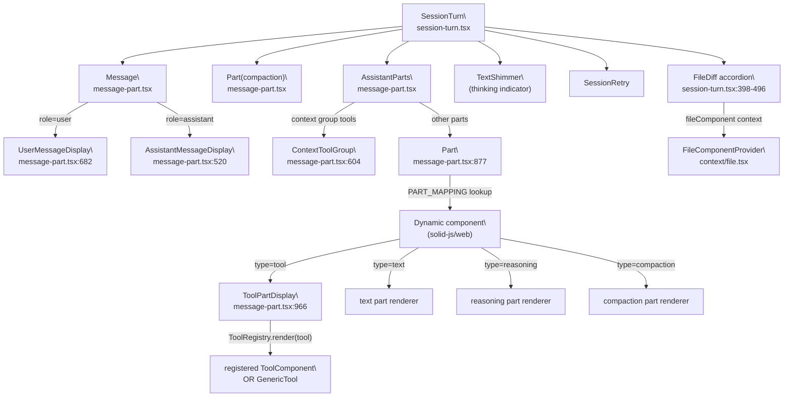
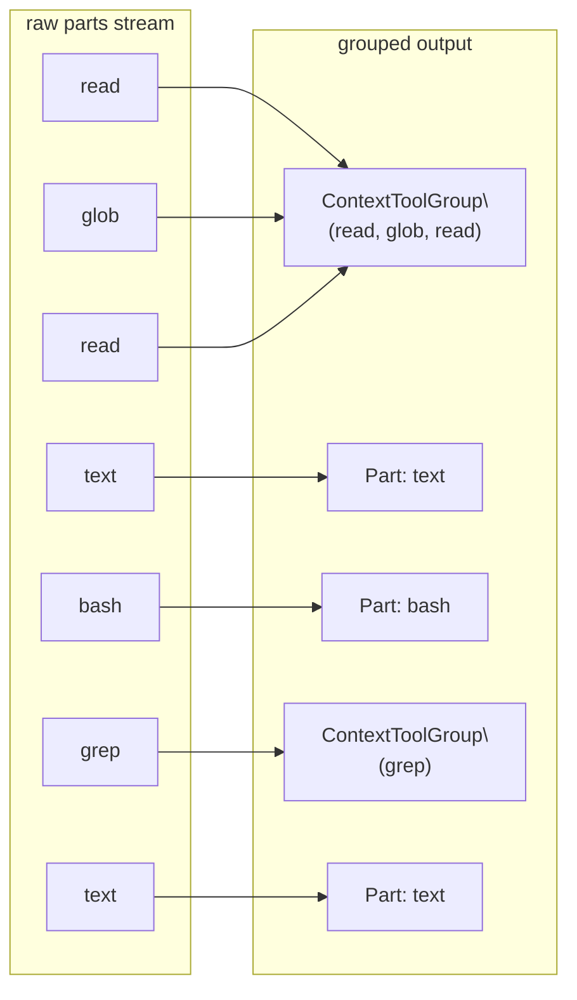
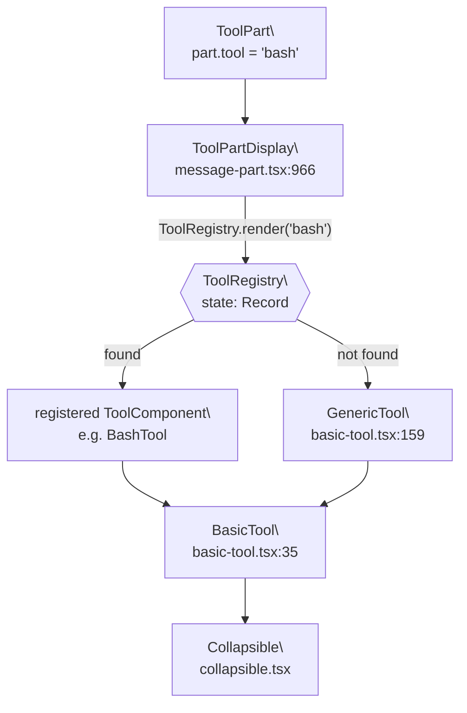
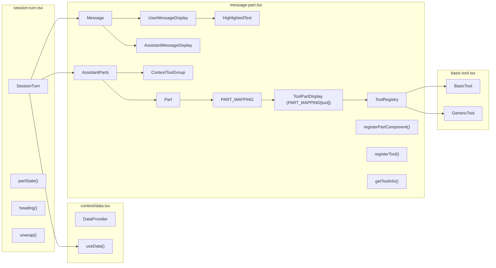

# Session Turn & Message Rendering

<details>
<summary>Relevant source files</summary>

The following files were used as context for generating this wiki page:

- [packages/app/src/pages/directory-layout.tsx](packages/app/src/pages/directory-layout.tsx)
- [packages/app/src/pages/session/review-tab.tsx](packages/app/src/pages/session/review-tab.tsx)
- [packages/enterprise/src/routes/share/[shareID].tsx](packages/enterprise/src/routes/share/[shareID].tsx)
- [packages/ui/src/components/basic-tool.tsx](packages/ui/src/components/basic-tool.tsx)
- [packages/ui/src/components/message-part.css](packages/ui/src/components/message-part.css)
- [packages/ui/src/components/message-part.tsx](packages/ui/src/components/message-part.tsx)
- [packages/ui/src/components/session-review.css](packages/ui/src/components/session-review.css)
- [packages/ui/src/components/session-review.tsx](packages/ui/src/components/session-review.tsx)
- [packages/ui/src/components/session-turn.css](packages/ui/src/components/session-turn.css)
- [packages/ui/src/components/session-turn.tsx](packages/ui/src/components/session-turn.tsx)
- [packages/ui/src/components/sticky-accordion-header.css](packages/ui/src/components/sticky-accordion-header.css)
- [packages/ui/src/context/data.tsx](packages/ui/src/context/data.tsx)
- [packages/ui/src/hooks/create-auto-scroll.tsx](packages/ui/src/hooks/create-auto-scroll.tsx)
- [packages/ui/src/pierre/index.ts](packages/ui/src/pierre/index.ts)
- [packages/ui/src/pierre/worker.ts](packages/ui/src/pierre/worker.ts)

</details>

## Purpose & Scope

This page documents how the `@opencode-ai/ui` component library renders conversational turns in a session: how user prompts and assistant responses are structured, how individual message parts are dispatched to display components, how the tool registry maps tool names to UI, and how per-turn file diffs are presented.

This covers components in `packages/ui/src/components/` and the context in `packages/ui/src/context/`. For the REST API that supplies the data these components consume, see page [2.5](#2.5). For the broader UI component library overview, see page [4](#4). For how the enterprise session sharing page uses these components, see page [7.2](#7.2).

---

## Data Model

Every rendered turn is grounded in three data types from the SDK:

| Type       | Where stored in context                                        | Description                                                                   |
| ---------- | -------------------------------------------------------------- | ----------------------------------------------------------------------------- |
| `Message`  | `store.message[sessionID][]`                                   | Either a `UserMessage` or an `AssistantMessage`                               |
| `Part`     | `store.part[messageID][]`                                      | A single typed fragment of a message (text, tool call, reasoning, file, etc.) |
| `FileDiff` | `store.session_diff[sessionID][]` or `message.summary.diffs[]` | Before/after contents for a file changed during the turn                      |

A _turn_ is one user message and all assistant messages whose `parentID` equals that user message's `id`.

### Part types

| `part.type`    | Display behavior                                                                |
| -------------- | ------------------------------------------------------------------------------- |
| `"text"`       | Rendered as Markdown via the `Markdown` component                               |
| `"tool"`       | Dispatched through `ToolRegistry`; hides `todowrite`/`todoread`                 |
| `"reasoning"`  | Shown as Markdown in a lighter style when `showReasoningSummaries` is true      |
| `"compaction"` | Shown inline as a context-compaction divider                                    |
| `"file"`       | Shown inside `UserMessageDisplay` as attachment thumbnails or inline references |
| `"agent"`      | Shown inside `UserMessageDisplay` as highlighted text                           |
| _(custom)_     | Registered via `registerPartComponent` and dispatched dynamically               |

Sources: [packages/ui/src/components/message-part.tsx:1-110]()

---

## DataProvider Context

All rendering components read session data from a single React-style context.

**Context shape** (defined in `packages/ui/src/context/data.tsx`):

```
Data {
  session: Session[]
  session_status: { [sessionID]: SessionStatus }
  session_diff:   { [sessionID]: FileDiff[] }
  message:        { [sessionID]: Message[] }
  part:           { [messageID]: Part[] }
  provider?:      ProviderListResponse
}
```

The `DataProvider` component wraps a subtree and exposes the above via the `useData()` hook. It also carries `directory` (the working directory string used for path relativization).

**Component hierarchy** in the web app:

```
DataProvider (packages/app/src/pages/directory-layout.tsx)
  └── (all session views inherit the context)
```

In the enterprise share page:

```
DataProvider (packages/enterprise/src/routes/share/[shareID].tsx:218)
  └── SessionTurn / SessionReview
```

Sources: [packages/ui/src/context/data.tsx:1-48](), [packages/app/src/pages/directory-layout.tsx:13-27](), [packages/enterprise/src/routes/share/[shareID].tsx:216-220]()

---

## Component Rendering Pipeline

**Diagram: SessionTurn rendering pipeline (code entities)**



Sources: [packages/ui/src/components/session-turn.tsx:349-511](), [packages/ui/src/components/message-part.tsx:295-402](), [packages/ui/src/components/message-part.tsx:877-892](), [packages/ui/src/components/message-part.tsx:966-1038]()

---

## `SessionTurn` Component

`SessionTurn` ([packages/ui/src/components/session-turn.tsx:138-511]()) is the top-level component for rendering a full turn. It is keyed by `sessionID` + `messageID` (the user message that starts the turn).

**Props:**

| Prop                     | Type                              | Description                                               |
| ------------------------ | --------------------------------- | --------------------------------------------------------- |
| `sessionID`              | `string`                          | The session to look up messages from                      |
| `messageID`              | `string`                          | ID of the user message that starts this turn              |
| `showReasoningSummaries` | `boolean?`                        | Whether to render reasoning parts (default: true)         |
| `shellToolDefaultOpen`   | `boolean?`                        | Whether bash tool collapsibles default to open            |
| `editToolDefaultOpen`    | `boolean?`                        | Whether edit/write tool collapsibles default to open      |
| `onUserInteracted`       | `() => void`                      | Called when user scrolls/interacts (disables auto-scroll) |
| `classes`                | `{ root?, content?, container? }` | CSS class overrides                                       |

### Internal memos computed

| Memo                  | Purpose                                                   |
| --------------------- | --------------------------------------------------------- |
| `message()`           | The user `Message` object for this turn                   |
| `assistantMessages()` | All assistant messages with `parentID === message().id`   |
| `parts()`             | Parts for the user message                                |
| `compaction()`        | A part of type `"compaction"` from the user message parts |
| `diffs()`             | Deduplicated `FileDiff[]` from `message().summary.diffs`  |
| `working()`           | Whether this is the active turn and status is not idle    |
| `showThinking()`      | Whether to show the shimmer "thinking" indicator          |
| `assistantVisible()`  | Count of visible parts across all assistant messages      |
| `error()`             | First non-abort error across all assistant messages       |

### Layout order (rendered top to bottom)

1. **`Message`** — the user message
2. **`Part(compaction)`** — if a compaction part exists
3. **`AssistantParts`** — all assistant parts grouped and rendered
4. **`TextShimmer`** (thinking indicator) — only while `showThinking()` is true
5. **`SessionRetry`** — shown while the session is in retry status
6. **FileDiff accordion** — shown when turn is done and `diffs().length > 0`
7. **Error `Card`** — shown when a non-abort error occurred

Sources: [packages/ui/src/components/session-turn.tsx:138-511]()

---

## `Message` and Role-Based Dispatch

`Message` ([packages/ui/src/components/message-part.tsx:494-518]()) is a thin dispatcher that switches on `message.role`:

- `role === "user"` → `UserMessageDisplay`
- `role === "assistant"` → `AssistantMessageDisplay`

### `UserMessageDisplay`

Rendered at [packages/ui/src/components/message-part.tsx:682-836]().

| Slot                   | Content                                                                               |
| ---------------------- | ------------------------------------------------------------------------------------- |
| Attachments            | `FilePart` entries with `image/*` or `application/pdf` MIME type, shown as thumbnails |
| Body                   | Text from the non-synthetic `TextPart`, rendered as pre-wrapped plain text            |
| Inline file highlights | `FilePart` entries with `source.text.start/end` offsets, highlighted in the text      |
| Agent highlights       | `AgentPart` entries with `source.start/end` offsets, highlighted in the text          |
| Metadata               | Agent name, model name, timestamp (12-hour format), interrupted status                |
| Copy button            | Copies raw text to clipboard; fades in on hover                                       |

The `HighlightedText` function ([packages/ui/src/components/message-part.tsx:840-875]()) segments the raw text string by the offset ranges of file and agent references and wraps each segment in a `<span data-highlight="file|agent">`.

### `AssistantMessageDisplay`

Used only when rendering an already-completed `AssistantMessage` in isolation (e.g., from `Message` directly). For live sessions, `AssistantParts` is used instead.

Both apply the same context-grouping logic: consecutive `read`/`glob`/`grep`/`list` tool parts are grouped into a single `ContextToolGroup`.

Sources: [packages/ui/src/components/message-part.tsx:494-602](), [packages/ui/src/components/message-part.tsx:682-875]()

---

## `AssistantParts` and Context Grouping

`AssistantParts` ([packages/ui/src/components/message-part.tsx:295-402]()) renders all visible parts across multiple `AssistantMessage` objects in a turn.

**Grouping logic:**

Consecutive parts where `isContextGroupTool(part)` is true (i.e., `part.type === "tool"` and `part.tool` is in `CONTEXT_GROUP_TOOLS = {"read", "glob", "grep", "list"}`) are collected into a single `ContextToolGroup`. Non-context parts flush any pending group and are rendered individually via `Part`.

**Diagram: Context grouping**



`ContextToolGroup` renders as a collapsible with a summary like "Gathered context · 2 reads, 1 search". While a group is still being processed (`pending()` is true), it shows an animated `TextShimmer` label "Gathering context".

Sources: [packages/ui/src/components/message-part.tsx:295-406](), [packages/ui/src/components/message-part.tsx:404-679]()

---

## `Part` and `PART_MAPPING`

`Part` ([packages/ui/src/components/message-part.tsx:877-892]()) is the generic dispatcher for a single `PartType`. It looks up `PART_MAPPING[part.type]` and renders the result dynamically via SolidJS's `Dynamic`.

```
PART_MAPPING: Record<string, PartComponent | undefined>
```

**Built-in entries registered inline in `message-part.tsx`:**

| Key            | Component         | Notes                                            |
| -------------- | ----------------- | ------------------------------------------------ |
| `"tool"`       | `ToolPartDisplay` | Dispatches further to `ToolRegistry`             |
| `"compaction"` | inline function   | Renders a divider with label "Context compacted" |
| `"text"`       | inline function   | Renders via `Markdown`, with copy button         |
| `"reasoning"`  | inline function   | Renders via `Markdown` in a muted style          |

**Extension point:**

External code (e.g., plugins or app-level code) can call `registerPartComponent(type, component)` ([packages/ui/src/components/message-part.tsx:490-492]()) to add support for new part types.

Sources: [packages/ui/src/components/message-part.tsx:109](), [packages/ui/src/components/message-part.tsx:490-492](), [packages/ui/src/components/message-part.tsx:877-892](), [packages/ui/src/components/message-part.tsx:966-1040]()

---

## `ToolRegistry` and Tool Rendering

### Registry API

```
ToolRegistry = {
  register: (input: { name: string; render?: ToolComponent }) => void
  render:   (name: string) => ToolComponent | undefined
}
```

Defined at [packages/ui/src/components/message-part.tsx:908-928]().

- `registerTool` stores entries by tool name.
- `getTool` returns the `render` function for a given name.
- If `render` is `undefined` for a registered tool, or the tool is not registered at all, `ToolPartDisplay` falls back to `GenericTool`.

### `ToolPartDisplay`

Rendered at [packages/ui/src/components/message-part.tsx:966-1038]().

Logic:

1. Skip if tool is `todowrite` or `todoread` (always hidden).
2. If the tool is `question` and status is `pending` or `running`, suppress rendering.
3. If `part.state.status === "error"`, render an error `Card` with the error text.
4. Otherwise, use `Dynamic` to render the component from `ToolRegistry.render(part.tool) ?? GenericTool`.

### `getToolInfo`

`getToolInfo(tool, input)` ([packages/ui/src/components/message-part.tsx:173-264]()) returns `{ icon, title, subtitle? }` for each known tool name. This is used by `ContextToolGroup` items and `BasicTool` triggers.

**Diagram: Tool name to display component resolution**



Sources: [packages/ui/src/components/message-part.tsx:908-928](), [packages/ui/src/components/message-part.tsx:966-1038](), [packages/ui/src/components/basic-tool.tsx:35-156]()

### `BasicTool` wrapper

Most tool-specific components use `BasicTool` ([packages/ui/src/components/basic-tool.tsx:35-156]()) as their outer shell. It provides:

- A `Collapsible` with a structured trigger area (icon, title, subtitle, arg badges)
- A `status` prop that drives pending animation via `TextShimmer`
- `defaultOpen`, `forceOpen`, `locked`, and `defer` props for controlling expand behavior
- Arrow indicator hidden while pending

---

## Visibility Filtering

Before rendering, parts are filtered by `partState` (in `session-turn.tsx`) and `renderable` (in `message-part.tsx`):

| Condition                                                                    | Visible |
| ---------------------------------------------------------------------------- | ------- |
| `type === "tool"`, tool in `{"todowrite","todoread"}`                        | No      |
| `type === "tool"`, tool is `"question"` and status is pending/running        | No      |
| `type === "tool"`, any other                                                 | Yes     |
| `type === "text"` with non-empty trimmed text                                | Yes     |
| `type === "reasoning"` with `showReasoningSummaries=true` and non-empty text | Yes     |
| `type` has an entry in `PART_MAPPING`                                        | Yes     |
| Otherwise                                                                    | No      |

Sources: [packages/ui/src/components/session-turn.tsx:85-100](), [packages/ui/src/components/message-part.tsx:274-283]()

---

## Thinking Indicator

While the session is `working()` (status is not idle) and this is the active turn, a "Thinking…" shimmer is shown if `showThinking()` is true:

```
showThinking() = working() && !error() && status !== "retry" && (
    showReasoningSummaries ? assistantVisible() === 0
                           : assistantTailVisible() !== "text"
)
```

When reasoning summaries are disabled, the last extracted heading from the reasoning parts is shown alongside the shimmer (see `reasoningHeading()` at [packages/ui/src/components/session-turn.tsx:327-334]()).

Sources: [packages/ui/src/components/session-turn.tsx:335-347]()

---

## File Diff Display

After a turn completes, if `message().summary.diffs` contains entries, `SessionTurn` renders a collapsible diff section.

### Deduplication

`diffs()` ([packages/ui/src/components/session-turn.tsx:210-223]()) iterates `message.summary.diffs` in reverse, keeping only the last diff per file path, then reverses back to preserve order.

### Rendering structure

```
Collapsible (ghost variant)
  Trigger:
    "Modified" label · N file(s) · DiffChanges (bar chart) · arrow
  Content:
    Accordion (multiple, sticky headers)
      For each FileDiff:
        Accordion.Item (value = diff.file)
          StickyAccordionHeader > Accordion.Trigger
            directory (weak color) + filename (strong) · DiffChanges · chevron
          Accordion.Content
            Dynamic component={fileComponent} mode="diff" before=... after=...
```

The `fileComponent` is injected via `FileComponentProvider` (from `packages/ui/src/context/file.tsx`). This allows different environments (web app, SSR, desktop) to supply different diff renderers. In the enterprise share page, `FileSSR` is used ([packages/enterprise/src/routes/share/[shareID].tsx:217]()).

**Lazy rendering:** `visible` state per accordion item is set to `true` one animation frame after the item is expanded, so the diff view only mounts when actually visible.

Sources: [packages/ui/src/components/session-turn.tsx:210-496](), [packages/enterprise/src/routes/share/[shareID].tsx:217]()

---

## Auto-Scroll Behavior

`createAutoScroll` hook ([packages/ui/src/components/session-turn.tsx:343-347]()) manages scrolling:

- While `working()` is true, the scroll container tracks new content automatically.
- Clicking or scrolling manually (detected via `handleInteraction`/`handleScroll`) calls `onUserInteracted`, which the parent can use to disable auto-scroll globally.
- `overflowAnchor: "dynamic"` mode is used.

Three refs are wired: `scrollRef` (the scrollable container), `contentRef` (the content div), and `handleScroll`/`handleInteraction` event handlers.

Sources: [packages/ui/src/components/session-turn.tsx:343-357]()

---

## Component–File Map

**Diagram: Key components and their source files**



Sources: [packages/ui/src/components/session-turn.tsx:1-20](), [packages/ui/src/components/message-part.tsx:1-50](), [packages/ui/src/components/basic-tool.tsx:1-10](), [packages/ui/src/context/data.tsx:1-48]()
