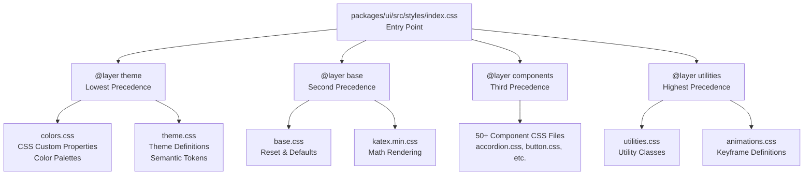
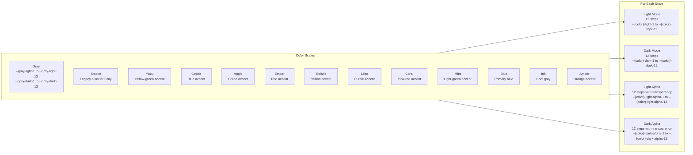
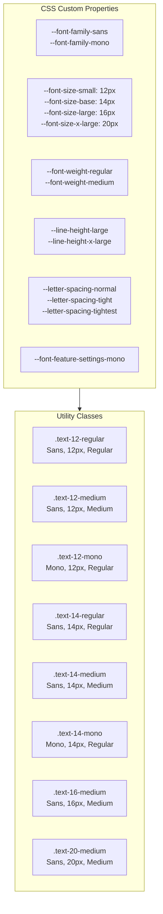
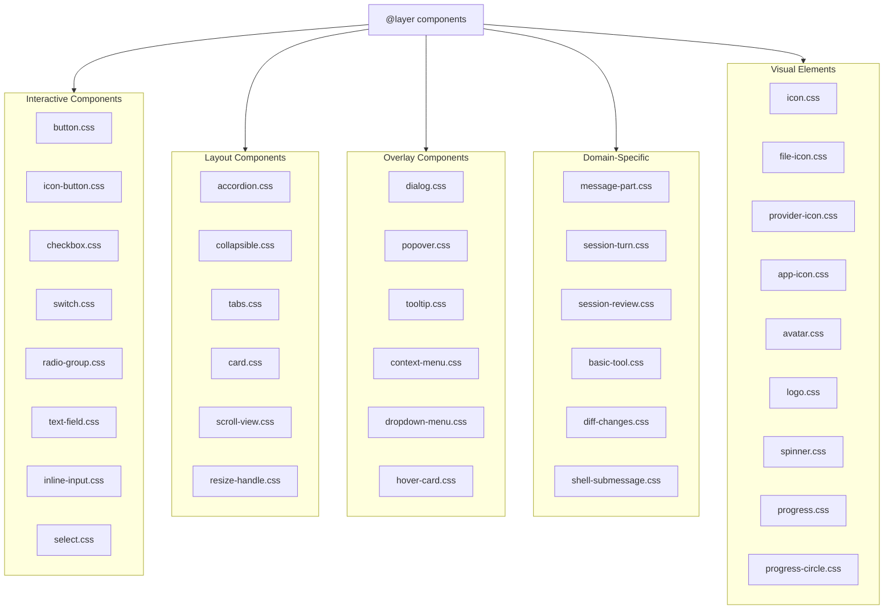
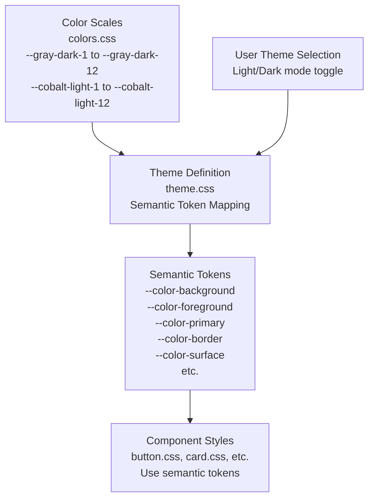
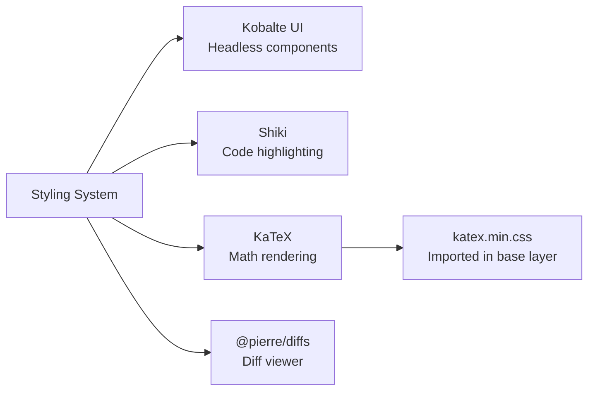

# Styling System & Themes

<details>
<summary>Relevant source files</summary>

The following files were used as context for generating this wiki page:

- [LICENSE](LICENSE)
- [STATS.md](STATS.md)
- [packages/ui/package.json](packages/ui/package.json)
- [packages/ui/src/components/button.css](packages/ui/src/components/button.css)
- [packages/ui/src/components/icon-button.css](packages/ui/src/components/icon-button.css)
- [packages/ui/src/components/icon-button.tsx](packages/ui/src/components/icon-button.tsx)
- [packages/ui/src/components/icon.tsx](packages/ui/src/components/icon.tsx)

</details>

This document describes the CSS architecture, color system, and theming mechanism used throughout OpenCode's user interfaces. It covers the layered CSS structure, color palettes, typography utilities, and how themes are configured and applied across the `@opencode-ai/ui` package.

For information about specific UI components and their usage, see [Component Architecture & Exports](#4.1). For information about session rendering and message components, see [Session Turn & Message Rendering](#4.2).

---

## CSS Layer Architecture

The styling system uses CSS Cascade Layers to establish explicit precedence rules and prevent specificity conflicts. This architecture ensures predictable styling behavior across all UI components.

**Diagram: CSS Layer Hierarchy**



**Sources:** [packages/ui/src/styles/index.css:1-66]()

The layer order declaration `@layer theme, base, components, utilities` establishes that:

1. Theme layer (lowest) - Can be overridden by all other layers
2. Base layer - Overrides theme, can be overridden by components and utilities
3. Components layer - Overrides base and theme, can be overridden by utilities
4. Utilities layer (highest) - Takes precedence over all other layers

---

## Color System

The color system defines comprehensive color palettes using CSS custom properties. Each color scale includes 12 steps for both light and dark themes, plus alpha (transparency) variants.

**Diagram: Color Scale Structure**



**Sources:** [packages/ui/src/styles/colors.css:1-805]()

### Color Scale Progression

Each 12-step scale follows a consistent pattern:

- **Steps 1-3**: Backgrounds (subtle to moderate)
- **Steps 4-6**: Interactive element backgrounds (hover, active states)
- **Steps 7-9**: Borders and separators
- **Steps 10-11**: Text and icons (low to high contrast)
- **Step 12**: High contrast text

Example from the Gray scale:

```css
--gray-dark-1: #161616; /* App background */
--gray-dark-2: #1c1c1c; /* Subtle background */
--gray-dark-3: #232323; /* UI element background */
--gray-dark-4: #282828; /* Hovered UI element */
--gray-dark-5: #2e2e2e; /* Active UI element */
--gray-dark-6: #343434; /* Subtle borders */
--gray-dark-7: #3e3e3e; /* UI element border */
--gray-dark-8: #505050; /* Hovered border */
--gray-dark-9: #707070; /* Solid backgrounds */
--gray-dark-10: #7e7e7e; /* Hovered solid backgrounds */
--gray-dark-11: #a0a0a0; /* Low contrast text */
--gray-dark-12: #ededed; /* High contrast text */
```

**Sources:** [packages/ui/src/styles/colors.css:2-13]()

### Legacy Palette Aliases

For backward compatibility, the `smoke` palette is aliased to `gray`:

```css
--smoke-light-1: var(--gray-light-1);
--smoke-dark-1: var(--gray-dark-1);
/* ... continues for all 12 steps + alpha variants */
```

**Sources:** [packages/ui/src/styles/colors.css:690-740]()

---

## Typography System

The typography system provides utility classes built on CSS custom properties for consistent text styling across the application.

**Diagram: Typography Utility Classes**



**Sources:** [packages/ui/src/styles/utilities.css:46-118]()

### Typography Classes

The system provides eight base typography classes:

| Class              | Family | Size | Weight  | Use Case                      |
| ------------------ | ------ | ---- | ------- | ----------------------------- |
| `.text-12-regular` | Sans   | 12px | Regular | Small body text, captions     |
| `.text-12-medium`  | Sans   | 12px | Medium  | Small labels, UI elements     |
| `.text-12-mono`    | Mono   | 12px | Regular | Code snippets, technical data |
| `.text-14-regular` | Sans   | 14px | Regular | Primary body text             |
| `.text-14-medium`  | Sans   | 14px | Medium  | Labels, buttons               |
| `.text-14-mono`    | Mono   | 14px | Regular | Code blocks, file paths       |
| `.text-16-medium`  | Sans   | 16px | Medium  | Section headings              |
| `.text-20-medium`  | Sans   | 20px | Medium  | Page titles                   |

Example usage:

```css
.text-14-regular {
  font-family: var(--font-family-sans);
  font-size: var(--font-size-base);
  font-style: normal;
  font-weight: var(--font-weight-regular);
  line-height: var(--line-height-x-large); /* 171.429% */
  letter-spacing: var(--letter-spacing-normal);
}
```

**Sources:** [packages/ui/src/styles/utilities.css:74-81]()

---

## Utility Classes

The system provides several utility classes for common styling patterns.

**Table: Core Utility Classes**

| Class             | Purpose                | Implementation                                |
| ----------------- | ---------------------- | --------------------------------------------- |
| `.no-scrollbar`   | Hides scrollbars       | Webkit + Firefox + IE/Edge support            |
| `.sr-only`        | Screen reader only     | Visually hidden, accessible to screen readers |
| `.truncate-start` | Text ellipsis at start | RTL direction, text-overflow: ellipsis        |

**Sources:** [packages/ui/src/styles/utilities.css:15-44]()

### Scrollbar Hiding

The `.no-scrollbar` utility hides scrollbars across all browsers:

```css
.no-scrollbar {
  &::-webkit-scrollbar {
    display: none;
  }
  & {
    -ms-overflow-style: none; /* IE and Edge */
    scrollbar-width: none; /* Firefox */
  }
}
```

**Sources:** [packages/ui/src/styles/utilities.css:15-24]()

### Screen Reader Only

The `.sr-only` class makes content accessible to screen readers while hiding it visually:

```css
.sr-only {
  position: absolute;
  width: 1px;
  height: 1px;
  padding: 0;
  margin: -1px;
  overflow: hidden;
  clip: rect(0, 0, 0, 0);
  white-space: nowrap;
  border-width: 0;
}
```

**Sources:** [packages/ui/src/styles/utilities.css:26-36]()

### Tailwind Custom Utilities

Additional utilities are defined using Tailwind's `@utility` directive for integration with Tailwind-based projects:

**Table: Tailwind Utilities**

| Utility                   | Purpose                     | Key Features                   |
| ------------------------- | --------------------------- | ------------------------------ |
| `@utility no-scrollbar`   | Hide scrollbars             | Cross-browser support          |
| `@utility badge-mask`     | Radial mask for badges      | 5px circle cutout at top-right |
| `@utility truncate-start` | Ellipsis at start           | RTL direction trick            |
| `@utility fade-up-text`   | Staggered fade-in animation | 30 child support with delays   |

**Sources:** [packages/ui/src/styles/tailwind/utilities.css:1-119]()

The `fade-up-text` utility provides staggered animations for up to 30 child elements:

```css
@utility fade-up-text {
  animation: fadeUp 0.4s ease-out forwards;
  opacity: 0;

  &:nth-child(1) {
    animation-delay: 0.1s;
  }
  &:nth-child(2) {
    animation-delay: 0.2s;
  }
  /* ... continues through :nth-child(30) with 3s delay */
}
```

**Sources:** [packages/ui/src/styles/tailwind/utilities.css:24-118]()

---

## Component Styling Structure

The component layer imports 50+ individual CSS files, each dedicated to a specific component's styles.

**Diagram: Component CSS Organization**



**Sources:** [packages/ui/src/styles/index.css:9-62]()

Each component CSS file contains:

- Component-specific class definitions
- State variants (hover, active, disabled, etc.)
- Size variants where applicable
- Responsive adjustments
- Accessibility styles

---

## Theme Configuration

Themes are defined in the `theme.css` file within the theme layer. The theme layer maps the color scale system to semantic CSS custom properties used throughout components.

**Diagram: Theme Application Flow**



**Sources:** [packages/ui/src/styles/index.css:3-4](), [packages/ui/src/styles/colors.css:1-805]()

### Theme Token Pattern

Themes follow a pattern where:

1. Color scales provide the raw palette
2. Theme definitions map scale steps to semantic meanings
3. Components reference only semantic tokens, never raw scale values

Example pattern (inferred):

```css
/* In theme.css - Light theme */
:root {
  --color-background: var(--gray-light-1);
  --color-foreground: var(--gray-light-12);
  --color-primary: var(--cobalt-light-9);
  --color-border: var(--gray-light-6);
}

/* In theme.css - Dark theme */
[data-theme='dark'] {
  --color-background: var(--gray-dark-1);
  --color-foreground: var(--gray-dark-12);
  --color-primary: var(--cobalt-dark-9);
  --color-border: var(--gray-dark-6);
}

/* In button.css - Component uses semantic tokens */
.button {
  background: var(--color-primary);
  color: var(--color-background);
  border: 1px solid var(--color-border);
}
```

This indirection allows:

- Switching themes by changing only semantic token values
- Multiple theme variants without modifying components
- Consistent semantic meaning across color modes

---

## Icon System

Icons are implemented as inline SVG paths within the `Icon` component rather than external files. This approach ensures icons are always available and reduces HTTP requests.

**Table: Icon Implementation**

| Aspect          | Implementation                   | Location                                     |
| --------------- | -------------------------------- | -------------------------------------------- |
| Icon storage    | JavaScript object with SVG paths | [packages/ui/src/components/icon.tsx:3-84]() |
| Icon rendering  | Dynamic SVG element creation     | Icon component                               |
| Icon styling    | `currentColor` for stroke/fill   | Inherits text color                          |
| Available icons | 80+ icons                        | See icon.tsx                                 |

The `icons` object maps icon names to SVG path definitions:

```typescript
const icons = {
  'align-right': `<path d="M12.292..." stroke="currentColor".../>`,
  'arrow-up': `<path fill-rule="evenodd".../>`,
  archive: `<path d="M16.8747..."/>`,
  // ... 80+ more icons
}
```

**Sources:** [packages/ui/src/components/icon.tsx:3-84]()

Using `currentColor` allows icons to inherit the text color from their parent element, making them theme-aware without additional styling:

```typescript
stroke = 'currentColor'
fill = 'currentColor'
```

---

## Browser Compatibility

The styling system maintains cross-browser compatibility through:

**Table: Compatibility Strategies**

| Feature            | Strategy                     | Browsers Covered         |
| ------------------ | ---------------------------- | ------------------------ |
| Scrollbar hiding   | Multiple vendor prefixes     | Webkit, Firefox, IE/Edge |
| CSS Layers         | Native `@layer`              | Modern browsers (2022+)  |
| Custom properties  | Native CSS variables         | All modern browsers      |
| Alpha transparency | Hex8 color format            | All modern browsers      |
| Font features      | `font-feature-settings`      | Modern browsers          |
| Mask properties    | Both `-webkit-` and standard | Webkit + standards       |

**Sources:** [packages/ui/src/styles/utilities.css:15-24](), [packages/ui/src/styles/tailwind/utilities.css:1-14]()

---

## Integration Points

The styling system integrates with several external systems:

**Diagram: External Integrations**



**Sources:** [packages/ui/src/styles/index.css:7](), [packages/ui/src/custom-elements.d.ts:1-18]()

### KaTeX Integration

KaTeX styles are imported in the base layer for mathematical notation rendering:

```css
@import 'katex/dist/katex.min.css' layer(base);
```

**Sources:** [packages/ui/src/styles/index.css:7]()

### Custom Elements

The `@pierre/diffs` web component is declared as a valid JSX element:

```typescript
declare module 'solid-js' {
  namespace JSX {
    interface IntrinsicElements {
      [DIFFS_TAG_NAME]: HTMLAttributes<HTMLElement>
    }
  }
}
```

**Sources:** [packages/ui/src/custom-elements.d.ts:1-18]()

---

## Performance Considerations

The styling architecture includes several performance optimizations:

1. **CSS Layers**: Reduce specificity wars and enable better compression
2. **Custom Properties**: Reduce duplication through variable reuse
3. **Inline Icons**: Eliminate icon loading latency
4. **Modular Component CSS**: Enable tree-shaking and code splitting
5. **No Runtime JS**: Pure CSS styling with no JavaScript overhead

The layered import structure in [packages/ui/src/styles/index.css:1-66]() ensures that:

- Theme and base styles load first (required)
- Component styles load on-demand (can be split)
- Utilities override everything (always available)

This structure supports both full bundle imports and selective component imports depending on the application's needs.
