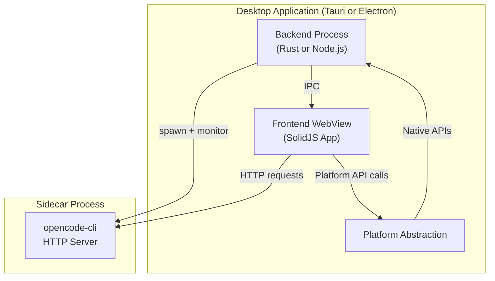
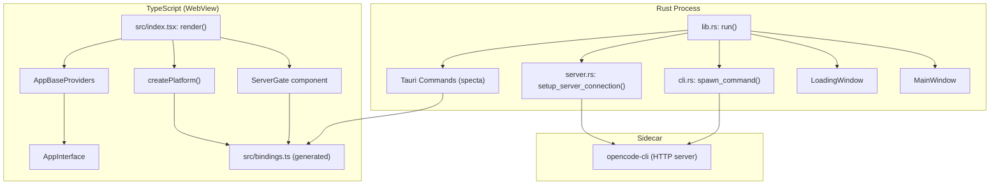
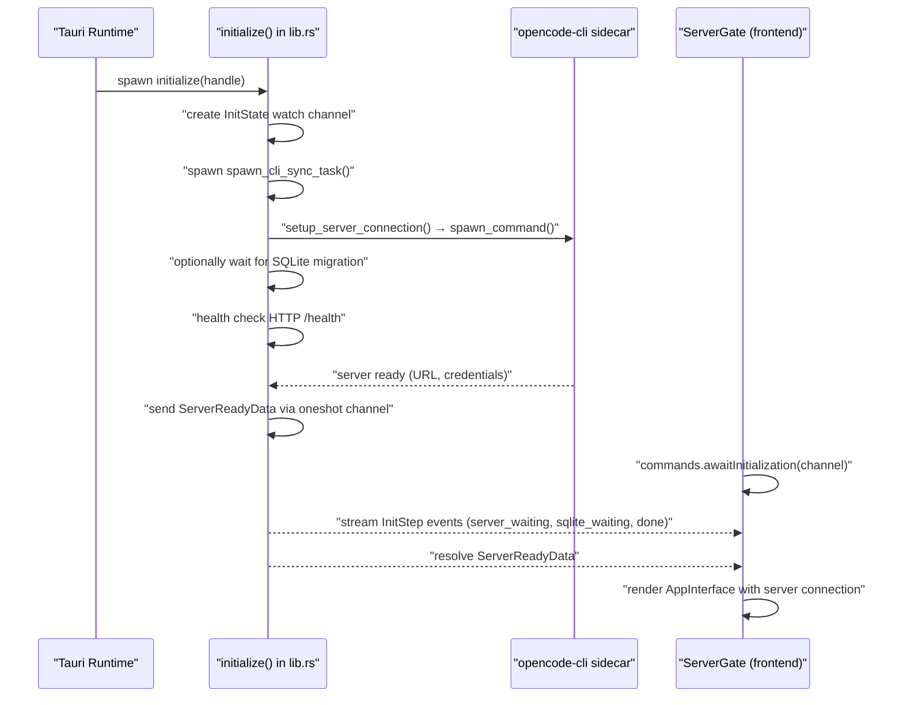
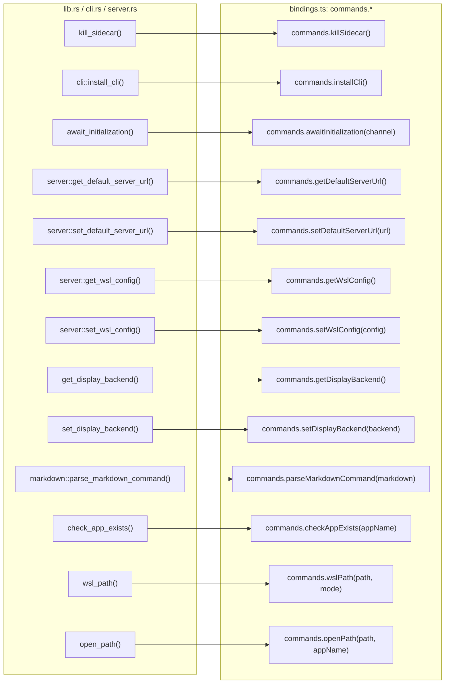

# Desktop Applications

<details>
<summary>Relevant source files</summary>

The following files were used as context for generating this wiki page:

- [bun.lock](bun.lock)
- [packages/app/src/components/dialog-edit-project.tsx](packages/app/src/components/dialog-edit-project.tsx)
- [packages/app/src/components/dialog-select-file.tsx](packages/app/src/components/dialog-select-file.tsx)
- [packages/app/src/components/prompt-input.tsx](packages/app/src/components/prompt-input.tsx)
- [packages/app/src/components/session-context-usage.tsx](packages/app/src/components/session-context-usage.tsx)
- [packages/app/src/components/session/session-header.tsx](packages/app/src/components/session/session-header.tsx)
- [packages/app/src/components/titlebar.tsx](packages/app/src/components/titlebar.tsx)
- [packages/app/src/context/global-sync.tsx](packages/app/src/context/global-sync.tsx)
- [packages/app/src/context/global-sync/session-prefetch.test.ts](packages/app/src/context/global-sync/session-prefetch.test.ts)
- [packages/app/src/context/global-sync/session-prefetch.ts](packages/app/src/context/global-sync/session-prefetch.ts)
- [packages/app/src/context/layout.tsx](packages/app/src/context/layout.tsx)
- [packages/app/src/context/sync.tsx](packages/app/src/context/sync.tsx)
- [packages/app/src/pages/layout.tsx](packages/app/src/pages/layout.tsx)
- [packages/app/src/pages/layout/sidebar-items.tsx](packages/app/src/pages/layout/sidebar-items.tsx)
- [packages/app/src/pages/layout/sidebar-project.tsx](packages/app/src/pages/layout/sidebar-project.tsx)
- [packages/app/src/pages/layout/sidebar-workspace.tsx](packages/app/src/pages/layout/sidebar-workspace.tsx)
- [packages/app/src/pages/session.tsx](packages/app/src/pages/session.tsx)
- [packages/app/src/utils/agent.ts](packages/app/src/utils/agent.ts)
- [packages/console/app/package.json](packages/console/app/package.json)
- [packages/console/core/package.json](packages/console/core/package.json)
- [packages/console/function/package.json](packages/console/function/package.json)
- [packages/console/mail/package.json](packages/console/mail/package.json)
- [packages/desktop/package.json](packages/desktop/package.json)
- [packages/function/package.json](packages/function/package.json)
- [packages/opencode/package.json](packages/opencode/package.json)
- [packages/plugin/package.json](packages/plugin/package.json)
- [packages/sdk/js/package.json](packages/sdk/js/package.json)
- [packages/ui/src/components/button.css](packages/ui/src/components/button.css)
- [packages/ui/src/components/icon-button.css](packages/ui/src/components/icon-button.css)
- [packages/ui/src/components/icon-button.tsx](packages/ui/src/components/icon-button.tsx)
- [packages/ui/src/components/icon.tsx](packages/ui/src/components/icon.tsx)
- [packages/web/package.json](packages/web/package.json)
- [sdks/vscode/package.json](sdks/vscode/package.json)

</details>

This page covers both desktop application implementations: `@opencode-ai/desktop` (Tauri) and `@opencode-ai/desktop-electron` (Electron). Both are native desktop wrappers that embed the same SolidJS web application from `@opencode-ai/app` and manage an `opencode-cli` sidecar process. The scope here is the desktop-specific layers — backend process management, platform API bridges, and build configurations. For the embedded web UI, see [Web Application](#3.2). For the CLI process that both desktops spawn, see [Core Application](#2).

---

## Overview

OpenCode provides two desktop application implementations with different technology stacks but identical user experiences:

| Package                         | Backend            | Frontend                | Platforms             |
| ------------------------------- | ------------------ | ----------------------- | --------------------- |
| `@opencode-ai/desktop`          | Rust (Tauri 2)     | SolidJS + Tauri APIs    | macOS, Linux, Windows |
| `@opencode-ai/desktop-electron` | Node.js (Electron) | SolidJS + Electron APIs | macOS, Linux, Windows |

Both implementations:

- Embed the complete `@opencode-ai/app` SolidJS application in a WebView
- Spawn `opencode-cli` as a child process ("sidecar")
- Wait for the CLI's HTTP server to become ready
- Signal the frontend with server URL and credentials
- Provide a `Platform` abstraction mapping UI operations to native APIs

**Diagram: Shared Architecture Pattern**



Sources: [packages/desktop/package.json:1-44](), [packages/desktop-electron/package.json:1-47]()

---

## Sidecar Architecture

Both desktop applications share a common sidecar pattern:

1. **Spawn**: The backend process spawns the bundled `opencode-cli` binary as a child process
2. **Monitor**: Backend monitors the CLI's stdout for a "server ready" signal
3. **Health Check**: Backend performs HTTP health checks on `/health` endpoint
4. **Signal**: Backend sends server URL and credentials to frontend via IPC
5. **Connect**: Frontend establishes HTTP connection to local CLI server

The CLI binary is bundled inside the desktop application package at build time. On macOS and Linux, the sidecar is the same architecture-specific binary used for standalone CLI distribution. On Windows, it's the compiled `.exe`.

---

## Tauri Desktop Application

The `@opencode-ai/desktop` package uses Tauri 2, a Rust-based framework that provides a lightweight WebView runtime with native OS integration.

### Architecture Layers

| Layer               | Location                      | Technology                   |
| ------------------- | ----------------------------- | ---------------------------- |
| Rust backend        | `packages/desktop/src-tauri/` | Tauri 2, Tokio, tauri-specta |
| TypeScript frontend | `packages/desktop/src/`       | SolidJS, Tauri JS APIs       |

**Diagram: Tauri Component Map**



Sources: [packages/desktop/src/index.tsx:1-496](), [packages/desktop/src-tauri/src/lib.rs:1-430](), [packages/desktop/src/bindings.ts:1-45]()

### Rust Backend

#### Initialization Sequence

The `run()` function in `lib.rs` sets up all Tauri plugins and invokes an async `initialize(handle)` task in the Tauri runtime. The initialization sequence is:

**Diagram: Initialization Flow**



Sources: [packages/desktop/src-tauri/src/lib.rs:434-600](), [packages/desktop/src-tauri/src/server.rs:1-200](), [packages/desktop/src/index.tsx:412-495]()

**Key Types:**

| Rust Type         | Purpose                                                                                           |
| ----------------- | ------------------------------------------------------------------------------------------------- |
| `ServerReadyData` | URL, optional username/password, `is_sidecar` flag sent to frontend                               |
| `InitStep`        | Enum: `ServerWaiting`, `SqliteWaiting`, `Done` — streamed to frontend via `Channel`               |
| `ServerState`     | Holds `Arc<Mutex<Option<CommandChild>>>` and a shared `oneshot::Receiver` for server ready status |
| `InitState`       | Holds `watch::Receiver<InitStep>` for streaming init progress                                     |

Sources: [packages/desktop/src-tauri/src/lib.rs:41-88]()

#### Tauri Commands

All commands are registered via `tauri-specta` and exported to `packages/desktop/src/bindings.ts`. The generated bindings are the only interface the TypeScript frontend uses to call Rust.

**Diagram: Rust Commands → TypeScript Bindings**



Sources: [packages/desktop/src-tauri/src/lib.rs:389-413](), [packages/desktop/src/bindings.ts:7-22]()

#### Sidecar Process Management

`cli.rs` handles spawning and managing the `opencode-cli` binary bundled alongside the desktop app.

- `get_sidecar_path()` — resolves the path to the bundled `opencode-cli` binary relative to the app executable. The sidecar is expected at `<app_dir>/opencode-cli`.
- `spawn_command()` — spawns the CLI with platform-appropriate process isolation:
  - **Unix**: uses `ProcessGroup` so all child processes are killed together
  - **Windows**: uses `JobObject` + `CREATE_NO_WINDOW | CREATE_SUSPENDED` flags via the `WinCreationFlags` wrapper
- `CommandChild` — a thin wrapper around a kill sender (`mpsc::Sender<()>`) used to terminate the process

The `kill_sidecar` command is invoked on `RunEvent::Exit` and before applying an update on Windows.

Sources: [packages/desktop/src-tauri/src/cli.rs:1-120](), [packages/desktop/src-tauri/src/lib.rs:92-111](), [packages/desktop/src-tauri/src/lib.rs:380-387]()

#### Server Connection

`server.rs` determines whether to use the sidecar or a previously-configured external server URL.

`setup_server_connection()` logic:

1. Checks for a saved server URL in the Tauri Store (`settings.json` file, key `default_server_url`).
2. If a custom URL is stored, connects to it directly (no sidecar).
3. Otherwise, spawns the sidecar, scans its stdout for the server ready signal, and performs health-check retries.

`get_saved_server_url()` and `set_default_server_url()` read/write from the Tauri plugin-store under the key `DEFAULT_SERVER_URL_KEY`.

Sources: [packages/desktop/src-tauri/src/server.rs:1-200](), [packages/desktop/src-tauri/src/lib.rs:434-600]()

#### Tauri Plugins

All plugins registered in `run()`:

| Plugin                           | Purpose                                        |
| -------------------------------- | ---------------------------------------------- |
| `tauri_plugin_single_instance`   | Focus existing window if app is launched twice |
| `tauri_plugin_deep_link`         | Handle `opencode://` scheme URLs               |
| `tauri_plugin_os`                | Query OS type                                  |
| `tauri_plugin_window_state`      | Persist/restore window size and position       |
| `tauri_plugin_store`             | Key-value persistent storage                   |
| `tauri_plugin_dialog`            | Native file/directory picker dialogs           |
| `tauri_plugin_shell`             | Open URLs in browser                           |
| `tauri_plugin_process`           | `relaunch()` for restart-after-update          |
| `tauri_plugin_opener`            | Open paths in external apps                    |
| `tauri_plugin_clipboard_manager` | Read clipboard images                          |
| `tauri_plugin_http`              | Fetch via Tauri (bypasses CORS restrictions)   |
| `tauri_plugin_notification`      | Desktop OS notifications                       |
| `tauri_plugin_updater`           | Auto-update (conditional on `UPDATER_ENABLED`) |
| `tauri_plugin_decorum`           | Custom window chrome on Windows                |
| `PinchZoomDisablePlugin`         | Prevents accidental pinch-zoom in webview      |

Sources: [packages/desktop/src-tauri/src/lib.rs:329-376](), [packages/desktop/src-tauri/Cargo.toml:20-55]()

---

### TypeScript Frontend

#### Entry Point

`packages/desktop/src/index.tsx` is the SolidJS application entry point. It:

1. Calls `createPlatform()` to build a `Platform` object
2. Starts `listenForDeepLinks()` asynchronously
3. Calls `createMenu()` to hook up the native OS menu
4. Renders into `#root` using `solid-js/web` `render()`

The render tree is:

```
PlatformProvider (platform)
  AppBaseProviders
    ServerGate
      AppInterface (defaultServer, servers)
        Inner (wires menuTrigger → cmd.trigger)
```

Sources: [packages/desktop/src/index.tsx:412-475]()

#### `ServerGate` Component

`ServerGate` blocks rendering of the main UI until `commands.awaitInitialization()` resolves. While waiting, it shows a splash screen (`<Splash />`). Once resolved, it passes `ServerReadyData` to its children, which build a `ServerConnection.Any` from it.

- If `data.is_sidecar` is `true`, the connection is typed `{ type: "sidecar", variant: "base", ... }`.
- Otherwise it is typed `{ type: "http", ... }`.

Sources: [packages/desktop/src/index.tsx:477-495](), [packages/desktop/src/index.tsx:440-470]()

#### Platform Abstraction

`createPlatform()` returns a `Platform` object (typed in `packages/app/src/context/platform.tsx`) that adapts Tauri APIs to the interface the shared app code expects.

**Diagram: Platform API Implementation**

```mermaid
graph TD
    subgraph "Platform interface (platform.tsx)"
        iface["Platform type"]
        open_dir["openDirectoryPickerDialog()"]
        open_file["openFilePickerDialog()"]
        save_file["saveFilePickerDialog()"]
        open_link["openLink()"]
        open_path_m["openPath()"]
        storage_m["storage(name)"]
        check_update["checkUpdate()"]
        update_m["update()"]
        restart_m["restart()"]
        notify_m["notify()"]
        fetch_m["fetch()"]
        wsl_enabled["getWslEnabled() / setWslEnabled()"]
        default_url["getDefaultServerUrl() / setDefaultServerUrl()"]
        check_app_m["checkAppExists()"]
        clipboard["readClipboardImage()"]
        parse_markdown["parseMarkdown()"]
        webview_zoom["webviewZoom"]
    end

    subgraph "Tauri APIs used"
        tauri_dialog["tauri-plugin-dialog: open(), save()"]
        tauri_shell["tauri-plugin-shell: shellOpen()"]
        tauri_open_path["commands.openPath()"]
        tauri_store["tauri-plugin-store: Store.load()"]
        tauri_updater["tauri-plugin-updater: check()"]
        tauri_process["tauri-plugin-process: relaunch()"]
        tauri_notif["Notification API + getCurrentWindow()"]
        tauri_http["tauri-plugin-http: tauriFetch()"]
        wsl_cmds["commands.getWslConfig() / setWslConfig()"]
        url_cmds["commands.getDefaultServerUrl() / setDefaultServerUrl()"]
        check_app_cmd["commands.checkAppExists()"]
        clip_mgr["tauri-plugin-clipboard-manager: readImage()"]
        md_cmd["commands.parseMarkdownCommand()"]
        zoom_mod["webview-zoom module"]
    end

    open_dir --> tauri_dialog
    open_file --> tauri_dialog
    save_file --> tauri_dialog
    open_link --> tauri_shell
    open_path_m --> tauri_open_path
    storage_m --> tauri_store
    check_update --> tauri_updater
    update_m --> tauri_updater
    restart_m --> tauri_process
    notify_m --> tauri_notif
    fetch_m --> tauri_http
    wsl_enabled --> wsl_cmds
    default_url --> url_cmds
    check_app_m --> check_app_cmd
    clipboard --> clip_mgr
    parse_markdown --> md_cmd
    webview_zoom --> zoom_mod
```



Sources: [packages/desktop/src/index.tsx:61-403](), [packages/app/src/context/platform.tsx:1-60]()

**Storage Implementation:**

The desktop storage backend uses `tauri-plugin-store` with a debounced write strategy to avoid excessive disk I/O:

- `Store.load(name)` is called lazily and cached in `storeCache`.
- Writes are batched in a `pending` map and flushed after `WRITE_DEBOUNCE_MS` (250 ms).
- A `flushAll()` is called on `pagehide` and `visibilitychange` to ensure data is not lost when the window closes.
- If `Store.load()` fails, a `createMemoryStore()` fallback is used.

The returned object matches the `AsyncStorage` interface from `@solid-primitives/storage`.

Sources: [packages/desktop/src/index.tsx:129-279]()

---

### Deep Link Handling

The desktop app handles `opencode://` deep links on all platforms.

**Flow:**

1. On startup, `listenForDeepLinks()` calls `getCurrent()` to retrieve any URLs that launched the app, and registers `onOpenUrl()` for future links.
2. `emitDeepLinks(urls)` stores URLs in `window.__OPENCODE__.deepLinks` and dispatches a `opencode:deep-link` CustomEvent.
3. The layout page (`packages/app/src/pages/layout.tsx`) listens for this event via `deepLinkEvent` / `collectOpenProjectDeepLinks` / `drainPendingDeepLinks` (imported from `./layout/deep-links`).

Sources: [packages/desktop/src/index.tsx:45-59](), [packages/app/src/pages/layout.tsx:69]()

---

### WSL Support (Windows)

On Windows, the desktop app can operate against an `opencode-cli` process running inside WSL (Windows Subsystem for Linux). The WSL configuration is a `WslConfig { enabled: bool }` stored in the Tauri Store.

When WSL is enabled (`window.__OPENCODE__?.wsl === true`):

- `openDirectoryPickerDialog()` sets the default path to the WSL home directory by calling `commands.wslPath("~", "windows")`.
- After the user selects a path, `handleWslPicker()` converts it to a Linux path via `commands.wslPath(path, "linux")`.

The `wsl_path` Rust command shells out to `wsl -e wslpath` to do the conversion.

Sources: [packages/desktop/src/index.tsx:68-79](), [packages/desktop/src-tauri/src/lib.rs:279-315](), [packages/desktop/src-tauri/src/server.rs:14-17]()

---

### Linux Display Backend

On Linux, the app can run under Wayland or fall back to X11 (auto). This is controlled by `get_display_backend` / `set_display_backend` commands, which read/write a preference via `linux_display::read_wayland()` / `linux_display::write_wayland()`.

`packages/desktop/src-tauri/src/main.rs` calls `configure_display_backend()` at startup to set the appropriate `WAYLAND_DISPLAY` / `GDK_BACKEND` environment variables before Tauri initializes.

Sources: [packages/desktop/src-tauri/src/main.rs:1-50](), [packages/desktop/src-tauri/src/linux_display.rs:1-50](), [packages/desktop/src-tauri/src/lib.rs:238-272]()

---

### CLI Installation

The `install_cli` Tauri command (exposed to the frontend as `commands.installCli()`) installs the bundled `opencode-cli` binary to the user's `~/.opencode/bin/opencode` path. It does this by:

1. Writing the embedded `install` shell script to a temp file.
2. Executing it with `--binary <sidecar_path>` as an argument.
3. Cleaning up the temp file.

This is only supported on macOS and Linux (Unix). The frontend can call `commands.installCli()` to trigger this from a settings dialog.

Sources: [packages/desktop/src-tauri/src/cli.rs:104-175]()

---

### Native Notifications

The `notify` platform method sends OS-level notifications when the app is not focused:

1. Requests notification permission via `isPermissionGranted()` / `requestPermission()`.
2. Checks if the current window is focused via `getCurrentWindow().isFocused()`. Skips if focused.
3. Creates a `Notification` with a click handler that calls `win.show()`, `win.unminimize()`, `win.setFocus()`, and `handleNotificationClick(href)` to navigate to the relevant session.

Sources: [packages/desktop/src/index.tsx:306-331]()

---

### Auto-Update

The `checkUpdate`, `update`, and `restart` platform methods implement the auto-update flow:

- `checkUpdate()` — calls `check()` from `tauri-plugin-updater`, downloads the update in the background, and returns `{ updateAvailable: true, version }`.
- `update()` — installs the downloaded update. On Windows, kills the sidecar first via `commands.killSidecar()`.
- `restart()` — kills the sidecar, then calls `relaunch()` from `tauri-plugin-process`.

Whether the updater is enabled is controlled by the `UPDATER_ENABLED` constant from `packages/desktop/src/updater.ts`.

The layout page (`packages/app/src/pages/layout.tsx`) calls `useUpdatePolling()` which polls `platform.checkUpdate()` every 10 minutes and displays an in-app toast with install/dismiss actions.

Sources: [packages/desktop/src/index.tsx:282-304](), [packages/app/src/pages/layout.tsx:282-333]()

---

## Titlebar

The `Titlebar` component (`packages/app/src/components/titlebar.tsx`) renders differently on each platform:

- **macOS**: Reserves space for traffic lights, adjusts height for zoom level.
- **Windows**: Uses `tauri-plugin-decorum` for custom window chrome (`data-tauri-decorum-tb`).
- **Linux/other**: Standard layout.

`onMouseDown` on the titlebar calls `getCurrentWindow().startDragging()`. `onDblClick` calls `getCurrentWindow().toggleMaximize()`. The active color scheme is synced to the webview window via `getCurrentWebviewWindow().setTheme()`.

Sources: [packages/app/src/components/titlebar.tsx:38-165]()
