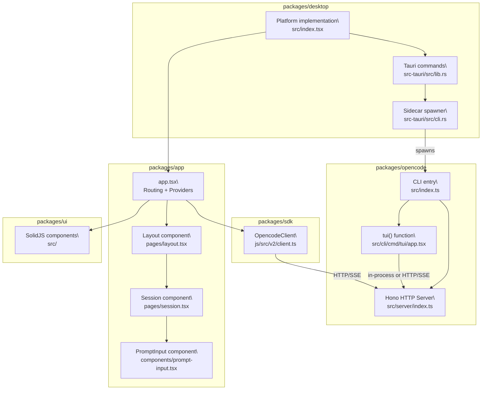
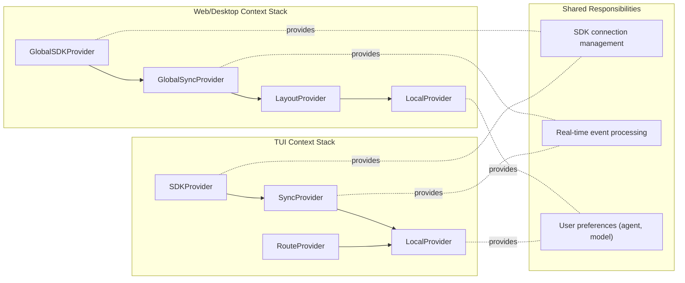
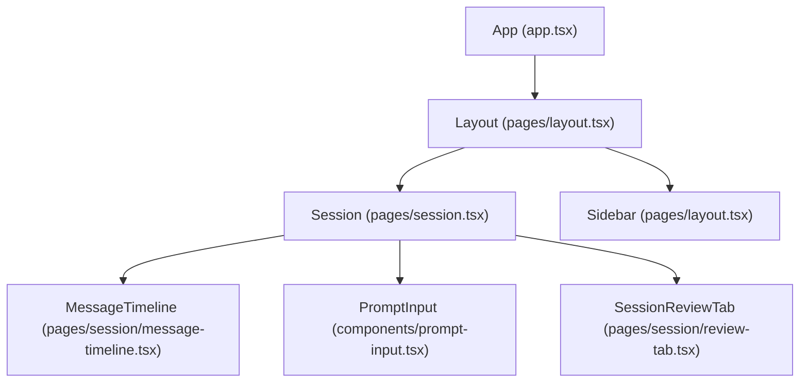
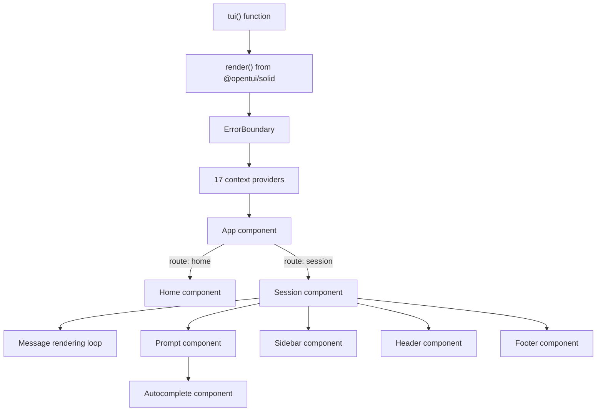
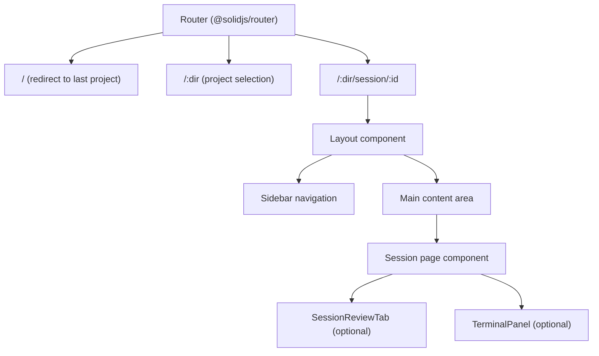
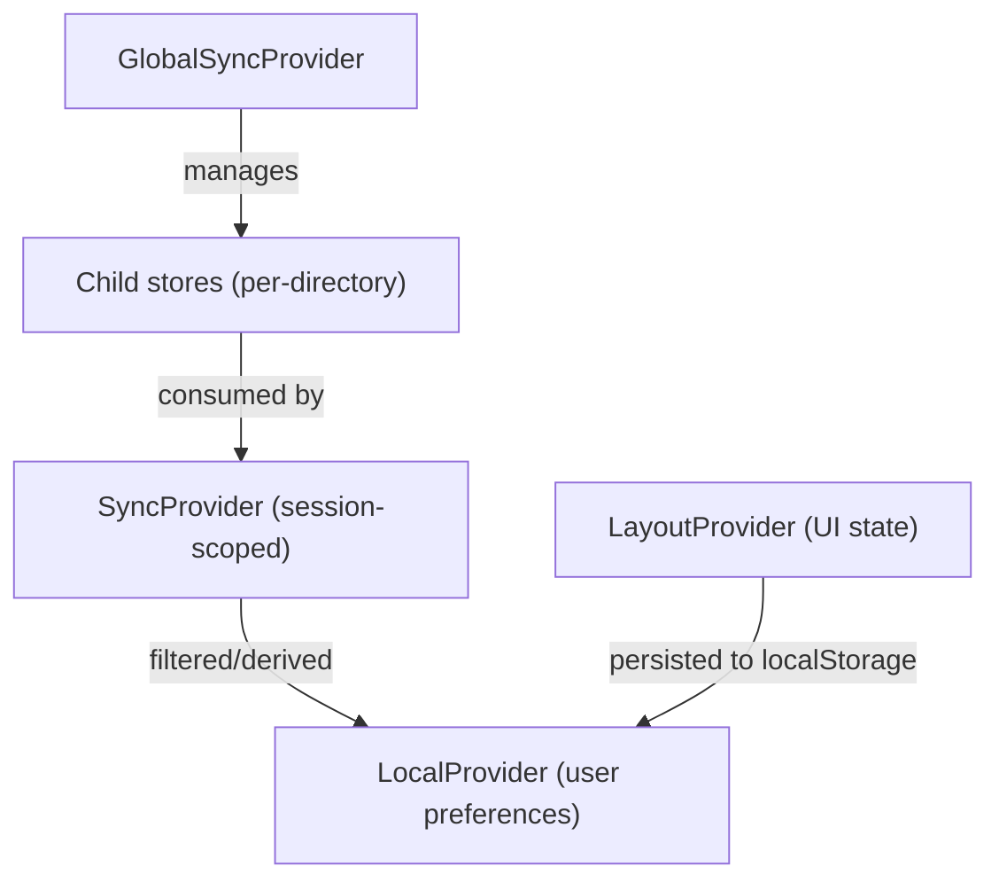
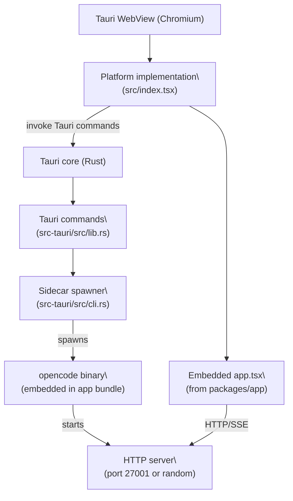
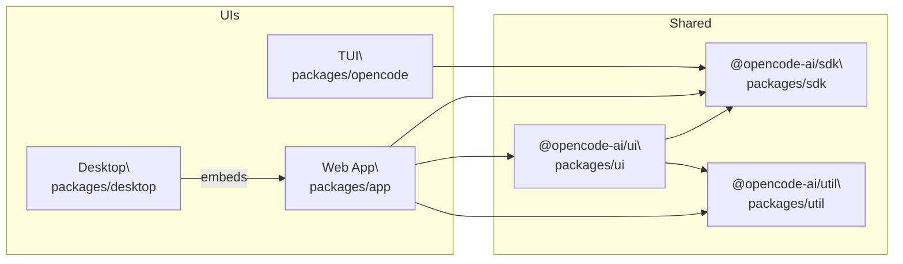

# User Interfaces

<details>
<summary>Relevant source files</summary>

The following files were used as context for generating this wiki page:

- [packages/app/src/components/dialog-edit-project.tsx](packages/app/src/components/dialog-edit-project.tsx)
- [packages/app/src/components/dialog-select-file.tsx](packages/app/src/components/dialog-select-file.tsx)
- [packages/app/src/components/prompt-input.tsx](packages/app/src/components/prompt-input.tsx)
- [packages/app/src/components/session-context-usage.tsx](packages/app/src/components/session-context-usage.tsx)
- [packages/app/src/components/session/session-header.tsx](packages/app/src/components/session/session-header.tsx)
- [packages/app/src/components/titlebar.tsx](packages/app/src/components/titlebar.tsx)
- [packages/app/src/context/global-sync.tsx](packages/app/src/context/global-sync.tsx)
- [packages/app/src/context/global-sync/session-prefetch.test.ts](packages/app/src/context/global-sync/session-prefetch.test.ts)
- [packages/app/src/context/global-sync/session-prefetch.ts](packages/app/src/context/global-sync/session-prefetch.ts)
- [packages/app/src/context/layout.tsx](packages/app/src/context/layout.tsx)
- [packages/app/src/context/sync.tsx](packages/app/src/context/sync.tsx)
- [packages/app/src/pages/layout.tsx](packages/app/src/pages/layout.tsx)
- [packages/app/src/pages/layout/sidebar-items.tsx](packages/app/src/pages/layout/sidebar-items.tsx)
- [packages/app/src/pages/layout/sidebar-project.tsx](packages/app/src/pages/layout/sidebar-project.tsx)
- [packages/app/src/pages/layout/sidebar-workspace.tsx](packages/app/src/pages/layout/sidebar-workspace.tsx)
- [packages/app/src/pages/session.tsx](packages/app/src/pages/session.tsx)
- [packages/app/src/utils/agent.ts](packages/app/src/utils/agent.ts)
- [packages/opencode/src/cli/cmd/tui/app.tsx](packages/opencode/src/cli/cmd/tui/app.tsx)
- [packages/opencode/src/cli/cmd/tui/attach.ts](packages/opencode/src/cli/cmd/tui/attach.ts)
- [packages/opencode/src/cli/cmd/tui/component/dialog-command.tsx](packages/opencode/src/cli/cmd/tui/component/dialog-command.tsx)
- [packages/opencode/src/cli/cmd/tui/component/prompt/autocomplete.tsx](packages/opencode/src/cli/cmd/tui/component/prompt/autocomplete.tsx)
- [packages/opencode/src/cli/cmd/tui/component/prompt/index.tsx](packages/opencode/src/cli/cmd/tui/component/prompt/index.tsx)
- [packages/opencode/src/cli/cmd/tui/context/args.tsx](packages/opencode/src/cli/cmd/tui/context/args.tsx)
- [packages/opencode/src/cli/cmd/tui/context/exit.tsx](packages/opencode/src/cli/cmd/tui/context/exit.tsx)
- [packages/opencode/src/cli/cmd/tui/context/local.tsx](packages/opencode/src/cli/cmd/tui/context/local.tsx)
- [packages/opencode/src/cli/cmd/tui/context/sdk.tsx](packages/opencode/src/cli/cmd/tui/context/sdk.tsx)
- [packages/opencode/src/cli/cmd/tui/routes/session/header.tsx](packages/opencode/src/cli/cmd/tui/routes/session/header.tsx)
- [packages/opencode/src/cli/cmd/tui/routes/session/index.tsx](packages/opencode/src/cli/cmd/tui/routes/session/index.tsx)
- [packages/opencode/src/cli/cmd/tui/routes/session/sidebar.tsx](packages/opencode/src/cli/cmd/tui/routes/session/sidebar.tsx)
- [packages/opencode/src/cli/cmd/tui/win32.ts](packages/opencode/src/cli/cmd/tui/win32.ts)
- [packages/opencode/src/command/index.ts](packages/opencode/src/command/index.ts)
- [packages/opencode/src/command/template/review.txt](packages/opencode/src/command/template/review.txt)
- [packages/sdk/js/src/v2/client.ts](packages/sdk/js/src/v2/client.ts)

</details>

This page provides an orientation to the three first-party user interfaces shipped with opencode: the **Terminal UI** (TUI), the **Web Application**, and the **Desktop Application**. All three communicate with the same backend HTTP server over the `@opencode-ai/sdk`. The page describes the purpose, technology, and package location of each interface and how they relate to one another.

For detailed coverage of each interface, see the dedicated sub-pages:

- TUI internals → [Terminal User Interface (TUI)](#3.1)
- Web app internals → [Web Application](#3.2)
- Desktop app internals → [Desktop Application](#3.3)
- Shared component library used by the web and desktop apps → [UI Component Library](#4)
- The SDK used by all interfaces → [JavaScript SDK](#5.1)
- The backend HTTP server all interfaces connect to → [HTTP Server & REST API](#2.5)

---

## At a Glance

| Interface           | Package path                         | Technology                                    | Connects to backend via                                            |
| ------------------- | ------------------------------------ | --------------------------------------------- | ------------------------------------------------------------------ |
| Terminal UI (TUI)   | `packages/opencode/src/cli/cmd/tui/` | `@opentui/solid` (terminal renderer, SolidJS) | In-process (same binary) or HTTP/SSE                               |
| Web Application     | `packages/app/`                      | SolidJS + `@solidjs/router`                   | HTTP/SSE via `@opencode-ai/sdk`                                    |
| Desktop Application | `packages/desktop/`                  | Tauri v2 + embedded web app                   | Sidecar spawns `opencode` process; web layer connects via HTTP/SSE |

---

## Architecture Overview

The following diagram shows how each UI package relates to the backend and to shared libraries. All three UIs use the same `@opencode-ai/sdk` client to communicate with the opencode server, though the TUI can run the server in-process when invoked as a standalone CLI.

**Diagram: UI packages and their connections**



Sources: [packages/opencode/src/cli/cmd/tui/app.tsx:115-199](), [packages/app/src/pages/layout.tsx:94-107](), [packages/app/src/pages/session.tsx:300-316](), [packages/desktop/src/index.tsx:1-50]()

---

## Shared Architecture Patterns

All three UIs share common architectural patterns for state management and real-time updates, though the TUI implements them with terminal-specific primitives while the web/desktop apps use DOM-based libraries.

### Context-Based State Management

Both the web/desktop app and the TUI organize state into nested SolidJS contexts. Each context provides reactive stores and derived signals that components consume via `use*()` hooks.

**Diagram: Core context providers shared across UIs**



Sources: [packages/app/src/context/global-sync.tsx:54-80](), [packages/opencode/src/cli/cmd/tui/context/local.tsx:17-48](), [packages/opencode/src/cli/cmd/tui/context/sdk.tsx:1-50]()

### Event-Driven Updates via SSE

All UIs subscribe to Server-Sent Events from the opencode HTTP server. The `GlobalBus` emits events for message updates, tool executions, permission requests, and file changes. Each UI processes these events to update its reactive stores.

| Event type             | Purpose                               | Handled by                                              |
| ---------------------- | ------------------------------------- | ------------------------------------------------------- |
| `message.created`      | New message added to session          | `GlobalSyncProvider`, `SyncProvider`                    |
| `message.part.updated` | Tool execution progress or completion | `SyncProvider`                                          |
| `permission.asked`     | Tool requires user approval           | `PermissionProvider` (web/desktop), inline prompt (TUI) |
| `worktree.ready`       | Project initialization complete       | `GlobalSyncProvider`                                    |

Sources: [packages/app/src/context/global-sync.tsx:428-518](), [packages/opencode/src/cli/cmd/tui/routes/session/index.tsx:217-232]()

### Component Composition Patterns

Both UIs use a similar component hierarchy: a root layout component that manages global navigation and sidebar state, and a session component that renders the message timeline and prompt input.

**Diagram: Component hierarchy (web/desktop)**



Sources: [packages/app/src/pages/layout.tsx:94-599](), [packages/app/src/pages/session.tsx:300-900]()

---

## Terminal UI (TUI)

The TUI is built directly into the `opencode` CLI binary (the `packages/opencode` package). It is launched by the `opencode` command and renders directly to the terminal using the `@opentui/solid` renderer, which maps a SolidJS reactive tree to terminal cells at up to 60 FPS.

The TUI entry point is the `tui()` function in [packages/opencode/src/cli/cmd/tui/app.tsx:115-199](). It wraps the application in a stack of SolidJS context providers and calls `render()` from `@opentui/solid`. The top-level `App` component switches between two routes: `Home` (session list) and `Session` (active session view).

**Diagram: TUI component hierarchy**



Sources: [packages/opencode/src/cli/cmd/tui/app.tsx:115-199](), [packages/opencode/src/cli/cmd/tui/routes/session/index.tsx:116-260]()

**Key modules:**

| Module         | Path                                                | Role                                                           |
| -------------- | --------------------------------------------------- | -------------------------------------------------------------- |
| `tui()`        | `src/cli/cmd/tui/app.tsx`                           | Entry point, provider tree, `render()` call with 60 FPS target |
| `App`          | `src/cli/cmd/tui/app.tsx`                           | Top-level component; route switching, terminal title updates   |
| `Home`         | `src/cli/cmd/tui/routes/home`                       | Session list screen with fuzzy search                          |
| `Session`      | `src/cli/cmd/tui/routes/session/index.tsx`          | Active session screen with scrollable message timeline         |
| `Prompt`       | `src/cli/cmd/tui/component/prompt/index.tsx`        | Multi-line `TextareaRenderable` with file/agent autocomplete   |
| `Autocomplete` | `src/cli/cmd/tui/component/prompt/autocomplete.tsx` | `@` file/agent and `/` slash-command popover with fuzzy search |
| `Sidebar`      | `src/cli/cmd/tui/routes/session/sidebar.tsx`        | Diffs, todos, MCP server status, cost/token metrics            |
| `Header`       | `src/cli/cmd/tui/routes/session/header.tsx`         | Session title, model indicator, agent color bar                |
| `Footer`       | `src/cli/cmd/tui/routes/session/footer.tsx`         | Status messages, interrupt prompt                              |

**Context providers in the TUI provider tree** (outermost → innermost):

```
ArgsProvider → ExitProvider → KVProvider → ToastProvider →
RouteProvider → TuiConfigProvider → SDKProvider → SyncProvider →
ThemeProvider → LocalProvider → KeybindProvider → PromptStashProvider →
DialogProvider → CommandProvider → FrecencyProvider →
PromptHistoryProvider → PromptRefProvider → App
```

### TUI-Specific Implementation Details

The TUI uses `@opentui/core` primitives for rendering:

- `BoxRenderable` for layout containers
- `ScrollBoxRenderable` for scrollable message timelines with custom scroll acceleration
- `TextareaRenderable` for the prompt input with extmark support (virtual text overlays for `@mentions`)
- `TextAttributes` and `RGBA` for styling (colors, bold, dim, underline)

The prompt component tracks file attachments and agent mentions as "extmarks" (virtual text ranges) that overlay the actual buffer content. When the user types `@` followed by a filename, the autocomplete creates an extmark with a styled background, and the underlying buffer stores a reference to the file URL.

Sources: [packages/opencode/src/cli/cmd/tui/routes/session/index.tsx:1-240](), [packages/opencode/src/cli/cmd/tui/component/prompt/index.tsx:61-388](), [packages/opencode/src/cli/cmd/tui/component/prompt/autocomplete.tsx:1-400](), [packages/opencode/src/cli/cmd/tui/routes/session/sidebar.tsx:15-200]()

---

## Web Application

The web app lives in `packages/app/` and is a SolidJS single-page application that connects to an opencode server via `@opencode-ai/sdk`. It is the UI embedded inside the desktop app, and it is also usable standalone in a browser when pointed at a running server.

The root component is `app.tsx`, which sets up routing and global providers. Navigation is handled by `@solidjs/router` with URL structure `/:dir/session/:id` where `:dir` is a base64-encoded project directory path and `:id` is the session ID.

**Diagram: Web/Desktop routing and page structure**



Sources: [packages/app/src/pages/layout.tsx:94-599](), [packages/app/src/pages/session.tsx:300-900]()

**Key modules:**

| Module             | Path                                                     | Role                                                                                            |
| ------------------ | -------------------------------------------------------- | ----------------------------------------------------------------------------------------------- |
| `app.tsx`          | `packages/app/src/app.tsx`                               | Root component, routing, all global providers                                                   |
| `Layout`           | `packages/app/src/pages/layout.tsx`                      | Persistent shell: sidebar, project list, workspace management, drag-and-drop reordering         |
| `Session` (page)   | `packages/app/src/pages/session.tsx`                     | Session view: message timeline, review panel, terminal, prompt input                            |
| `PromptInput`      | `packages/app/src/components/prompt-input.tsx`           | Rich text `contenteditable` with file/agent `@` mentions, `/` slash commands, image attachments |
| `SessionHeader`    | `packages/app/src/components/session/session-header.tsx` | Top bar with project name, file search, share button, open-in-editor menu                       |
| `Titlebar`         | `packages/app/src/components/titlebar.tsx`               | Platform-aware title bar with back/forward navigation, traffic lights (macOS)                   |
| `GlobalSync`       | `packages/app/src/context/global-sync.tsx`               | Global SSE event stream, multi-project state management, session prefetching                    |
| `Layout` (context) | `packages/app/src/context/layout.tsx`                    | Sidebar/panel open state, tab management, panel widths, review diff style, workspace order      |

**Global context providers in the web app:**

```
PlatformProvider → ServerProvider → GlobalSDKProvider → GlobalSyncProvider →
LanguageProvider → ThemeProvider → SettingsProvider → LayoutProvider →
NotificationProvider → PermissionProvider → CommandProvider →
HighlightsProvider → ModelsProvider → Router → Layout → Session
```

### State Management Architecture

The web app uses a hierarchical state management system:

**Diagram: State management layers**



Sources: [packages/app/src/context/global-sync.tsx:54-270](), [packages/app/src/context/sync.tsx:1-400](), [packages/app/src/context/layout.tsx:133-500]()

#### GlobalSyncProvider

`GlobalSyncProvider` manages state across all open projects simultaneously. It:

- Subscribes to the global SSE event stream from the server
- Maintains a `Map` of child stores, one per project directory
- Implements session prefetching: preloads messages for nearby sessions in the sidebar
- Enforces cache limits (max 10 sessions per directory with full message history)
- Applies event reducers that update child stores when SSE events arrive

Key functions:

- `child(directory, { bootstrap?: boolean })` — returns or creates the store for a directory
- `bootstrapInstance(directory)` — fetches initial state (config, project metadata, sessions)
- `loadSessions(directory)` — fetches recent sessions for the project

Sources: [packages/app/src/context/global-sync.tsx:54-400](), [packages/app/src/context/global-sync/bootstrap.ts:1-200](), [packages/app/src/context/global-sync/session-prefetch.ts:1-100]()

#### SyncProvider

`SyncProvider` wraps a single child store from `GlobalSyncProvider` and provides session-scoped state. It:

- Exposes `sync.data.*` accessors for messages, parts, diffs, todos, permissions
- Implements optimistic updates: adds messages/parts to the store before server confirmation
- Manages message pagination with cursors
- Provides `sync.session.sync(id)` to refresh a specific session
- Handles permission dialogs and question prompts

Sources: [packages/app/src/context/sync.tsx:1-400]()

#### LayoutProvider

`LayoutProvider` manages UI state that persists across page reloads:

- Sidebar open/closed state
- Panel widths (review panel, file tree, session panel, terminal)
- Tab state per session (open file tabs, active tab)
- Workspace order and expansion state
- Review diff style preference (unified vs. split)

All state is persisted to `localStorage` using the `persisted()` utility and keyed by directory or session ID.

Sources: [packages/app/src/context/layout.tsx:133-500](), [packages/app/src/utils/persist.ts:1-100]()

### Prompt Input System

The `PromptInput` component implements a rich text editor using a `contenteditable` div with custom handling for:

- **File mentions**: Typing `@` opens an autocomplete popover filtered by fuzzy search. Selecting a file inserts a styled span with `data-type="file"` and `data-path="..."`.
- **Agent mentions**: Typing `@agent-name` creates a span with `data-type="agent"` and `data-name="..."`.
- **Slash commands**: Typing `/` opens a command palette with builtin commands (e.g., `/share`, `/rename`) and custom skill commands.
- **Image attachments**: Drag-and-drop or paste images to attach them as base64-encoded data URLs.
- **History navigation**: Arrow up/down cycles through previous prompts stored in `localStorage`.

The component reconciles the DOM with a `Prompt` data structure (array of `ContentPart | FileAttachmentPart | AgentPart | ImageAttachmentPart`) on every input event, ensuring the internal state matches the visible DOM.

Sources: [packages/app/src/components/prompt-input.tsx:103-1000](), [packages/app/src/components/prompt-input/slash-popover.tsx:1-300](), [packages/app/src/components/prompt-input/attachments.ts:1-200]()

---

## Desktop Application

The desktop app is a Tauri v2 application in `packages/desktop/`. It embeds the web application (`packages/app/`) in a Tauri WebView and manages the lifecycle of an `opencode` sidecar process that provides the backend server.

**Diagram: Desktop app architecture and sidecar lifecycle**



Sources: [packages/desktop/src/index.tsx:1-500](), [packages/desktop/src-tauri/src/lib.rs:1-400](), [packages/desktop/src-tauri/src/cli.rs:1-150]()

The Rust backend (`src-tauri/src/lib.rs`) spawns the CLI binary via `src-tauri/src/cli.rs`, waits for the server to become ready, and then exposes Tauri commands that the TypeScript frontend calls via `invoke()`.

The TypeScript entry point (`src/index.tsx`) implements the `Platform` interface from `packages/app/src/context/platform.tsx`. This interface abstracts platform-specific capabilities (file pickers, update checking, notifications, OS-native path opening) so the shared web app can use them without knowing whether it is running in Tauri or a plain browser.

**Tauri command surface (Rust → TypeScript bridge):**

| Rust command           | Purpose                                                                    | Invoked by                           |
| ---------------------- | -------------------------------------------------------------------------- | ------------------------------------ |
| `await_initialization` | Blocks until sidecar server is ready; streams `InitStep` progress          | App bootstrap in `src/index.tsx`     |
| `kill_sidecar`         | Kills the managed opencode sidecar process                                 | Window close handler                 |
| `open_path`            | Opens a directory or file in the named application (VS Code, Finder, etc.) | `SessionHeader` "Open in..." menu    |
| `check_app_exists`     | Checks whether an app (VS Code, Zed, etc.) is installed                    | `SessionHeader` menu item visibility |
| `resolve_app_path`     | Resolves app name to executable path (Windows)                             | `open_path` pre-check                |
| `install_cli`          | Installs the opencode CLI to `~/.opencode/bin` and updates `$PATH`         | Settings dialog                      |
| `wsl_path`             | Converts Windows↔Linux paths in WSL mode                                   | File path resolution                 |
| `get_display_backend`  | Returns the Linux display backend (Wayland/auto)                           | Window decoration setup              |
| `show_in_folder`       | Opens the system file manager at the given path                            | Context menu action                  |
| `check_update`         | Checks for app updates via Tauri's updater                                 | Update polling timer                 |
| `install_update`       | Downloads and installs an app update                                       | Update notification action           |
| `restart_app`          | Restarts the desktop app                                                   | Post-update flow                     |
| `send_notification`    | Displays an OS-native notification                                         | Permission/question alerts           |

### Platform Interface Implementation

The `Platform` interface defines methods that the web app calls to access platform-specific features. The desktop implementation uses Tauri's `invoke()` API to bridge from TypeScript to Rust:

```typescript
// packages/desktop/src/index.tsx
const platform: Platform = {
  platform: 'desktop',
  os: await invoke('get_os'),
  openPath: async (path, app) => {
    await invoke('open_path', { path, openWith: app })
  },
  checkAppExists: async (app) => {
    return invoke('check_app_exists', { app })
  },
  notify: async (title, body, href) => {
    await invoke('send_notification', { title, body, href })
  },
  // ... 10+ more methods
}
```

The browser implementation provides no-op or limited fallbacks for these methods.

Sources: [packages/desktop/src/index.tsx:61-500](), [packages/desktop/src-tauri/src/lib.rs:90-400](), [packages/desktop/src-tauri/src/cli.rs:1-100](), [packages/app/src/context/platform.tsx:1-150]()

---

## How the Three UIs Share Code

The diagram below maps the shared packages to the consuming UIs.

**Diagram: Shared code dependencies across UIs**



Key shared modules and what each UI uses:

| Shared module                                       | TUI                   | Web App                     | Desktop                      |
| --------------------------------------------------- | --------------------- | --------------------------- | ---------------------------- |
| `@opencode-ai/sdk` — typed HTTP client + SSE events | ✓ (via `SDKProvider`) | ✓ (via `GlobalSDKProvider`) | ✓ (through embedded web app) |
| `@opencode-ai/ui` — SolidJS component library       | —                     | ✓                           | ✓ (through embedded web app) |
| `@opencode-ai/util` — path, encoding, binary utils  | ✓                     | ✓                           | ✓                            |

The TUI has its own component system (built on `@opentui/core` primitives) and does not use `@opencode-ai/ui`, which is designed for DOM environments.

Sources: [packages/opencode/src/cli/cmd/tui/app.tsx:1-45](), [packages/app/src/app.tsx:1-35](), [packages/desktop/src/index.tsx:1-35]()
