# Terminal User Interface (TUI)

<details>
<summary>Relevant source files</summary>

The following files were used as context for generating this wiki page:

- [packages/opencode/src/cli/cmd/tui/app.tsx](packages/opencode/src/cli/cmd/tui/app.tsx)
- [packages/opencode/src/cli/cmd/tui/attach.ts](packages/opencode/src/cli/cmd/tui/attach.ts)
- [packages/opencode/src/cli/cmd/tui/component/dialog-command.tsx](packages/opencode/src/cli/cmd/tui/component/dialog-command.tsx)
- [packages/opencode/src/cli/cmd/tui/component/prompt/autocomplete.tsx](packages/opencode/src/cli/cmd/tui/component/prompt/autocomplete.tsx)
- [packages/opencode/src/cli/cmd/tui/component/prompt/index.tsx](packages/opencode/src/cli/cmd/tui/component/prompt/index.tsx)
- [packages/opencode/src/cli/cmd/tui/context/args.tsx](packages/opencode/src/cli/cmd/tui/context/args.tsx)
- [packages/opencode/src/cli/cmd/tui/context/exit.tsx](packages/opencode/src/cli/cmd/tui/context/exit.tsx)
- [packages/opencode/src/cli/cmd/tui/context/local.tsx](packages/opencode/src/cli/cmd/tui/context/local.tsx)
- [packages/opencode/src/cli/cmd/tui/context/sdk.tsx](packages/opencode/src/cli/cmd/tui/context/sdk.tsx)
- [packages/opencode/src/cli/cmd/tui/routes/session/header.tsx](packages/opencode/src/cli/cmd/tui/routes/session/header.tsx)
- [packages/opencode/src/cli/cmd/tui/routes/session/index.tsx](packages/opencode/src/cli/cmd/tui/routes/session/index.tsx)
- [packages/opencode/src/cli/cmd/tui/routes/session/sidebar.tsx](packages/opencode/src/cli/cmd/tui/routes/session/sidebar.tsx)
- [packages/opencode/src/cli/cmd/tui/win32.ts](packages/opencode/src/cli/cmd/tui/win32.ts)
- [packages/opencode/src/command/index.ts](packages/opencode/src/command/index.ts)
- [packages/opencode/src/command/template/review.txt](packages/opencode/src/command/template/review.txt)
- [packages/sdk/js/src/v2/client.ts](packages/sdk/js/src/v2/client.ts)

</details>

The Terminal User Interface (TUI) is OpenCode's primary interactive mode, providing a full-featured terminal-based interface for conversing with AI agents, managing sessions, and executing commands. The TUI runs in a worker thread architecture where it spawns and communicates with an HTTP server process, enabling real-time synchronization and responsive UI updates.

For information about the HTTP server that the TUI communicates with, see [HTTP Server & REST API](#2.6). For the web-based UI alternative, see [Web Application](#3.2).

## Architecture Overview

The TUI follows a multi-layered architecture with a clear separation between rendering, state management, and business logic:

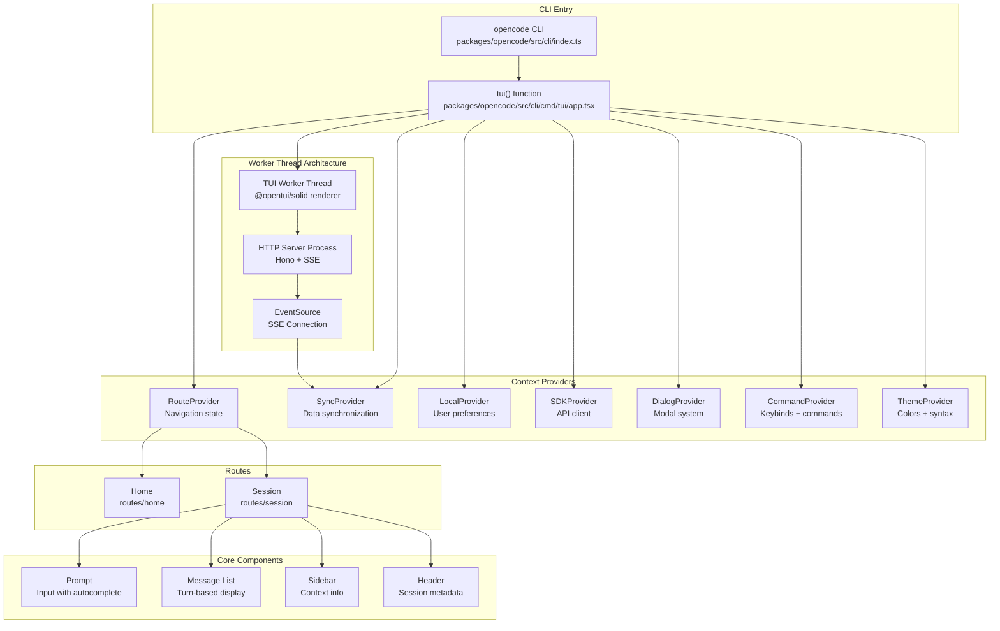

**Sources:** [packages/opencode/src/cli/cmd/tui/app.tsx:1-200](), [packages/opencode/src/cli/cmd/tui/routes/session/index.tsx:1-150]()

## Entry Point and Bootstrap

The TUI is initialized through the `tui()` function which sets up the rendering environment and all necessary providers:

| Step | Component         | Responsibility                                                           |
| ---- | ----------------- | ------------------------------------------------------------------------ |
| 1    | Terminal Setup    | Detects terminal background color, disables processed input on Windows   |
| 2    | Renderer          | Initializes `@opentui/solid` with 60 FPS target, Kitty keyboard protocol |
| 3    | Provider Stack    | Wraps app in 15+ context providers for state management                  |
| 4    | Server Connection | Establishes HTTP client and SSE connection for real-time updates         |
| 5    | Route Navigation  | Loads initial route (home or session) based on CLI args                  |

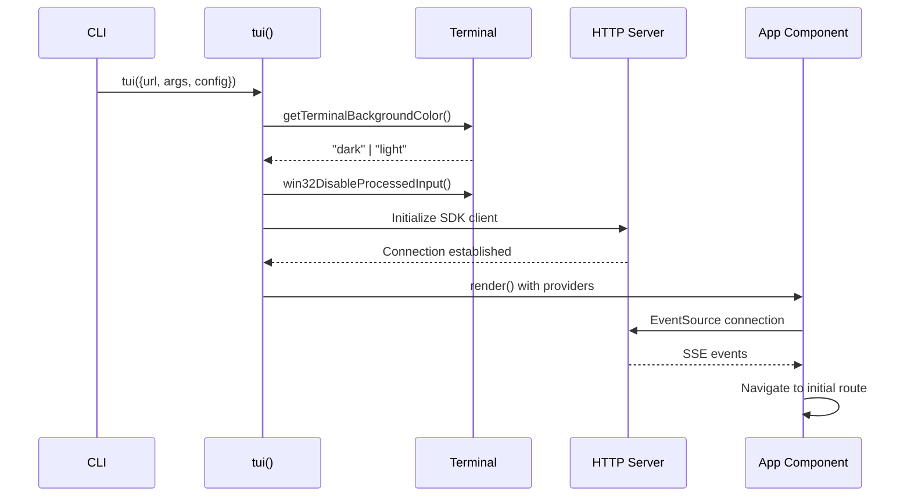

**Sources:** [packages/opencode/src/cli/cmd/tui/app.tsx:44-201]()

## Context Provider System

The TUI uses SolidJS context providers to manage state and dependencies. These are initialized in a specific order to handle dependencies correctly:

```mermaid
graph LR
    Args["ArgsProvider<br/>CLI arguments"]
    Exit["ExitProvider<br/>Cleanup handler"]
    KV["KVProvider<br/>Persistent storage"]
    Toast["ToastProvider<br/>Notifications"]
    Route["RouteProvider<br/>Navigation"]
    TuiConfig["TuiConfigProvider<br/>TUI settings"]
    SDK["SDKProvider<br/>API client"]
    Sync["SyncProvider<br/>Data sync"]
    Theme["ThemeProvider<br/>Colors + syntax"]
    Local["LocalProvider<br/>Preferences"]
    Keybind["KeybindProvider<br/>Shortcuts"]
    Stash["PromptStashProvider<br/>Saved prompts"]
    Dialog["DialogProvider<br/>Modal stack"]
    Cmd["CommandProvider<br/>Command registry"]
    Frecency["FrecencyProvider<br/>File ranking"]
    History["PromptHistoryProvider<br/>Input history"]
    PromptRef["PromptRefProvider<br/>Prompt access"]

    Args --> Exit
    Exit --> KV
    KV --> Toast
    Toast --> Route
    Route --> TuiConfig
    TuiConfig --> SDK
    SDK --> Sync
    Sync --> Theme
    Theme --> Local
    Local --> Keybind
    Keybind --> Stash
    Stash --> Dialog
    Dialog --> Cmd
    Cmd --> Frecency
    Frecency --> History
    History --> PromptRef
```

| Provider          | Purpose       | Key State                                          |
| ----------------- | ------------- | -------------------------------------------------- |
| `ArgsProvider`    | CLI arguments | `sessionID`, `agent`, `model`, `fork`, `continue`  |
| `SDKProvider`     | API client    | HTTP client, event source, directory               |
| `SyncProvider`    | Data sync     | `session`, `message`, `part`, `provider`, `config` |
| `LocalProvider`   | User prefs    | Current agent, model, variant selection            |
| `CommandProvider` | Commands      | Keybind registry, slash commands, command palette  |
| `ThemeProvider`   | Appearance    | Theme colors, syntax highlighting                  |
| `DialogProvider`  | Modal stack   | Dialog queue, navigation helpers                   |

**Sources:** [packages/opencode/src/cli/cmd/tui/app.tsx:139-178](), [packages/opencode/src/cli/cmd/tui/context/local.tsx:1-100]()

## Session View Architecture

The session view is the primary interface for AI conversations. It consists of several major components working together:

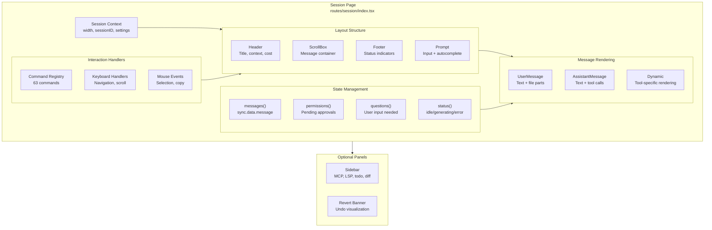

### Session State and Memos

The session page uses reactive memos to derive state from synchronized data:

| Memo            | Source                               | Purpose                     |
| --------------- | ------------------------------------ | --------------------------- |
| `session()`     | `sync.session.get(route.sessionID)`  | Current session metadata    |
| `messages()`    | `sync.data.message[route.sessionID]` | All messages in session     |
| `pending()`     | Last incomplete assistant message    | Loading indicator           |
| `permissions()` | Child sessions + current             | Pending permission requests |
| `questions()`   | Child sessions + current             | Questions awaiting answers  |
| `children()`    | Sessions with matching `parentID`    | Subagent sessions           |
| `revert()`      | `session()?.revert`                  | Undo state with diff files  |

**Sources:** [packages/opencode/src/cli/cmd/tui/routes/session/index.tsx:116-147]()

## Prompt System

The prompt system handles user input with rich features including autocomplete, history, extmarks (virtual text), and multi-modal input:

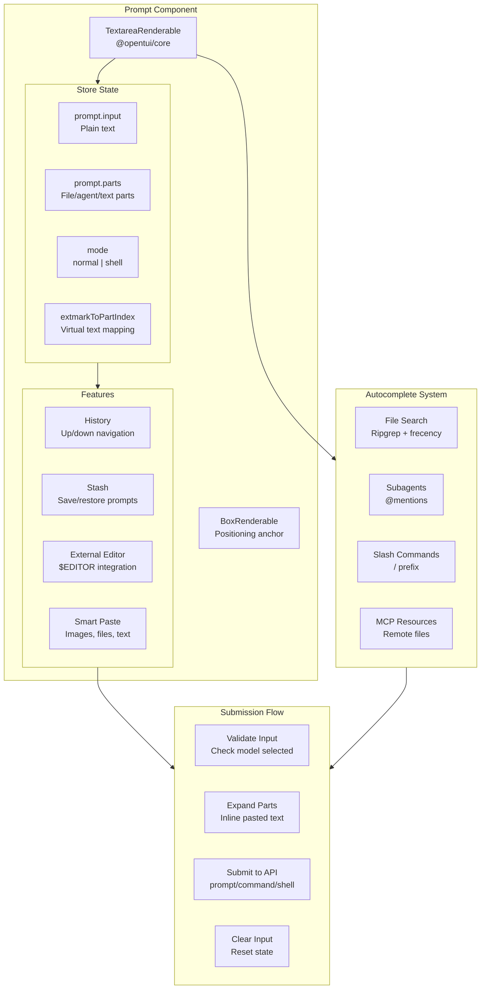

### Extmarks and Virtual Text

The prompt uses extmarks to display compact representations of complex inputs:

| Part Type       | Virtual Text              | Actual Content                 |
| --------------- | ------------------------- | ------------------------------ |
| `file`          | `@filename`               | Full file URL with line ranges |
| `agent`         | `@agent-name`             | Agent invocation metadata      |
| `text` (pasted) | `[Pasted Text: 50 words]` | Full multi-line text content   |
| `image`         | `[Image 1]`               | Base64-encoded image data      |

Extmarks are synchronized with the prompt store via `syncExtmarksWithPromptParts()`, updating positions as the user types.

**Sources:** [packages/opencode/src/cli/cmd/tui/component/prompt/index.tsx:1-200](), [packages/opencode/src/cli/cmd/tui/component/prompt/index.tsx:395-471]()

### Prompt Modes

The prompt supports two modes:

**Normal Mode** (default):

- Text input sent as user message
- `@` triggers file/agent autocomplete
- `/` triggers slash command autocomplete
- Submit sends `session.prompt` API call

**Shell Mode** (`!` prefix):

- Activated by typing `!` at start of empty prompt
- Input interpreted as bash command
- Sends `session.shell` API call
- Border color changes to `theme.primary`

**Sources:** [packages/opencode/src/cli/cmd/tui/component/prompt/index.tsx:874-886](), [packages/opencode/src/cli/cmd/tui/component/prompt/index.tsx:574-584]()

## Autocomplete System

The autocomplete provides context-aware suggestions for files, agents, commands, and MCP resources:

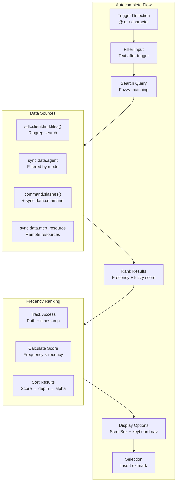

### Autocomplete Options

| Trigger | Options        | Source                                        | Line Range Support |
| ------- | -------------- | --------------------------------------------- | ------------------ |
| `@`     | Files          | `sdk.client.find.files()`                     | Yes (`#123-456`)   |
| `@`     | Subagents      | `sync.data.agent` filtered by mode            | No                 |
| `@`     | MCP Resources  | `sync.data.mcp_resource`                      | No                 |
| `/`     | Slash Commands | `command.slashes()`                           | N/A                |
| `/`     | MCP Prompts    | `sync.data.command` (source: mcp)             | N/A                |
| `/`     | Skills         | `sync.data.command` (source: skill, excluded) | N/A                |

**Line Range Syntax:**

- `@file.ts#123` - Single line 123
- `@file.ts#123-456` - Lines 123 to 456
- Encoded as URL search params: `?start=123&end=456`

**Sources:** [packages/opencode/src/cli/cmd/tui/component/prompt/autocomplete.tsx:1-100](), [packages/opencode/src/cli/cmd/tui/component/prompt/autocomplete.tsx:221-296]()

### Frecency Algorithm

The frecency system prioritizes recently and frequently used files:

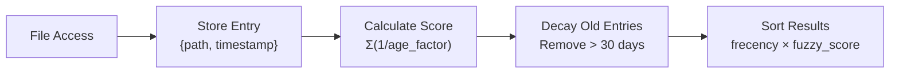

**Formula:**

```
score = Σ(1 / (1 + days_since_access))
```

Stored in: `~/.local/state/opencode/frecency.json`

**Sources:** [packages/opencode/src/cli/cmd/tui/component/prompt/frecency.tsx:1-100]()

## Command System

The command system provides a unified registry for keybinds, slash commands, and palette entries:

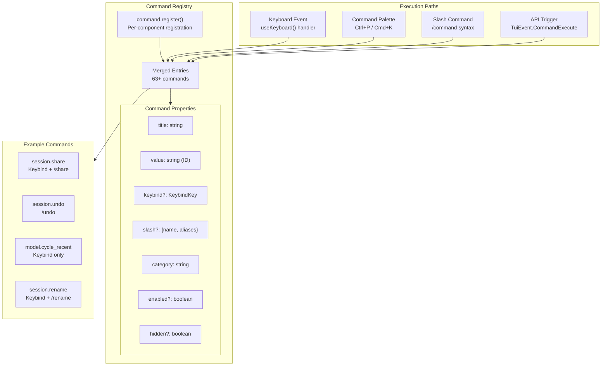

### Command Registration Pattern

Commands are registered using the `command.register()` API with automatic cleanup:

```typescript
command.register(() => [
  {
    title: 'Share session',
    value: 'session.share',
    keybind: 'session_share',
    category: 'Session',
    slash: { name: 'share' },
    onSelect: async (dialog) => {
      // Implementation
    },
  },
])
```

The registration function is called reactively, allowing commands to:

- Update `enabled` status based on state
- Show/hide based on context
- Modify descriptions dynamically

**Sources:** [packages/opencode/src/cli/cmd/tui/component/dialog-command.tsx:1-120](), [packages/opencode/src/cli/cmd/tui/routes/session/index.tsx:352-963]()

### Session Commands Reference

Major session commands (sampling of 63 total):

| Command            | Keybind            | Slash       | Purpose                   |
| ------------------ | ------------------ | ----------- | ------------------------- |
| `session.share`    | `session_share`    | `/share`    | Share session via URL     |
| `session.rename`   | `session_rename`   | `/rename`   | Rename session            |
| `session.timeline` | `session_timeline` | `/timeline` | Jump to message           |
| `session.fork`     | `session_fork`     | `/fork`     | Fork from message         |
| `session.compact`  | `session_compact`  | `/compact`  | Summarize session         |
| `session.undo`     | `messages_undo`    | `/undo`     | Revert last message       |
| `session.redo`     | `messages_redo`    | `/redo`     | Restore reverted messages |
| `session.export`   | `session_export`   | `/export`   | Export transcript         |
| `messages.copy`    | `messages_copy`    | -           | Copy last assistant msg   |
| `sidebar_toggle`   | `sidebar_toggle`   | -           | Toggle sidebar            |

**Sources:** [packages/opencode/src/cli/cmd/tui/routes/session/index.tsx:352-963]()

## Real-time Synchronization

The TUI maintains real-time synchronization with the backend through the `SyncProvider`:

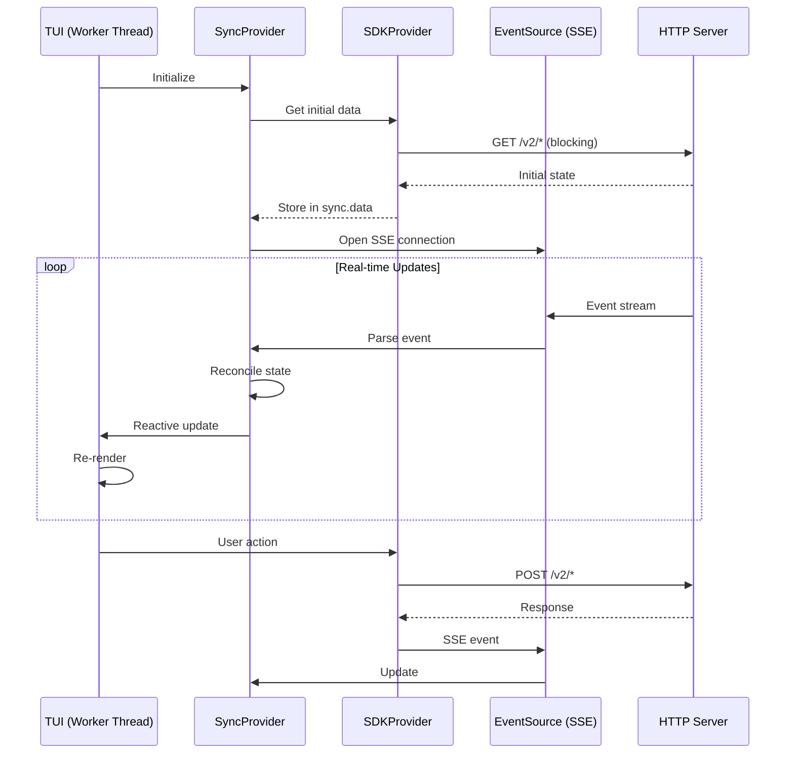

### Sync Data Structure

The `sync.data` object contains all synchronized state:

```typescript
{
  session: Session[],              // All sessions
  message: Record<sessionID, Message[]>,
  part: Record<messageID, Part[]>,
  permission: Record<sessionID, Permission[]>,
  question: Record<sessionID, Question[]>,
  session_status: Record<sessionID, Status>,
  session_diff: Record<sessionID, DiffFile[]>,
  todo: Record<sessionID, Todo[]>,

  provider: Provider[],            // Available providers
  provider_default: Record<providerID, modelID>,
  agent: Agent[],                  // Available agents
  command: Command[],              // Server commands

  mcp: Record<name, MCPStatus>,    // MCP server status
  mcp_resource: Record<uri, Resource>,
  lsp: LSPServer[],                // Active LSP servers

  path: { directory: string, worktree: string },
  config: Config.Info,             // Full configuration
}
```

### Reconciliation Strategy

The sync provider uses a reconciliation strategy to handle concurrent updates:

| Update Type  | Strategy            | Reason                    |
| ------------ | ------------------- | ------------------------- |
| Session list | Replace             | Small, infrequent changes |
| Messages     | Merge by ID         | New messages append       |
| Parts        | Replace per message | Parts are immutable       |
| Permissions  | Replace per session | Low volume                |
| Providers    | Replace             | Configuration changes     |
| MCP status   | Replace             | Status changes            |

**Sources:** [packages/opencode/src/cli/cmd/tui/context/sync.tsx:1-200]()

## Rendering and Performance

The TUI uses `@opentui/solid` for efficient terminal rendering:

### Rendering Pipeline

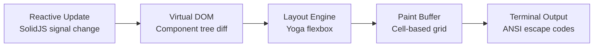

### Performance Optimizations

| Technique           | Implementation               | Benefit                         |
| ------------------- | ---------------------------- | ------------------------------- |
| Virtual Scrolling   | `ScrollBoxRenderable`        | Render only visible messages    |
| Memoization         | `createMemo()` everywhere    | Avoid unnecessary recalculation |
| Debounced Updates   | Scroll position tracking     | Reduce render frequency         |
| Lazy Loading        | `createResource()` for files | Non-blocking autocomplete       |
| Sticky Scroll       | `stickyScroll="bottom"`      | Auto-scroll to new messages     |
| Custom Scroll Accel | `MacOSScrollAccel`           | Smooth scrolling                |

**Configuration:**

- Target FPS: 60
- Gather stats: false (production)
- Auto-focus: false (manual control)
- Kitty keyboard: enabled

**Sources:** [packages/opencode/src/cli/cmd/tui/app.tsx:183-199]()

### Scroll Behavior

The session view implements intelligent scrolling:

**Auto-scroll to bottom:**

- New messages arrive
- Session changes
- User submits prompt

**Manual scroll:**

- Page up/down: `scroll.height / 2`
- Half page: `scroll.height / 4`
- Next/prev message: Jump to nearest message boundary
- First/last: `scrollTo(0)` / `scrollTo(scrollHeight)`

**Message boundary detection:**

- Filter for messages with non-synthetic, non-ignored text parts
- Sort by Y position
- Find nearest above/below current scroll position

**Sources:** [packages/opencode/src/cli/cmd/tui/routes/session/index.tsx:263-307]()

## Component Lifecycle

Key lifecycle management patterns used throughout the TUI:

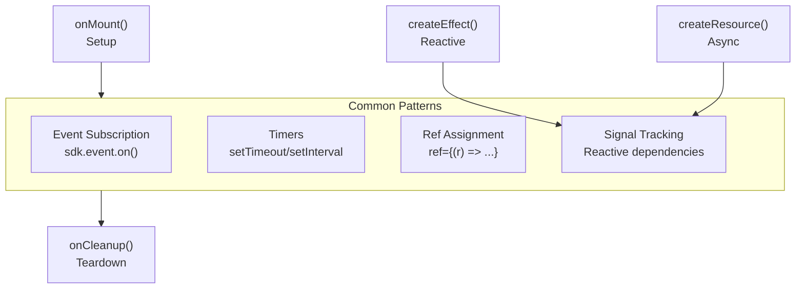

**Example pattern:**

```typescript
onMount(() => {
  const unsubscribe = sdk.event.on('message.created', handler)
  const timer = setInterval(tick, 1000)

  onCleanup(() => {
    unsubscribe()
    clearInterval(timer)
  })
})
```

**Sources:** [packages/opencode/src/cli/cmd/tui/app.tsx:287-308]()

## Error Handling

The TUI includes comprehensive error handling:

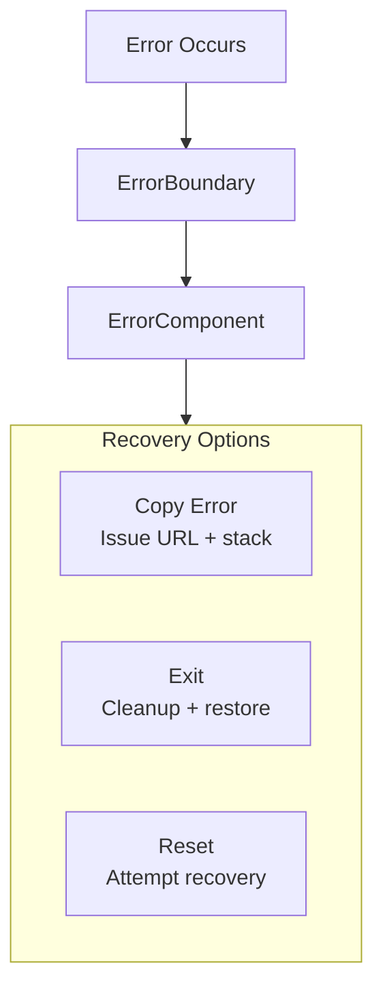

**Error component features:**

- Pre-filled GitHub issue URL with stack trace
- Safe fallback colors (no theme context)
- Terminal title reset
- Input buffer flush (Windows)
- Clipboard integration for error reporting

**Sources:** [packages/opencode/src/cli/cmd/tui/app.tsx:764-826]()
