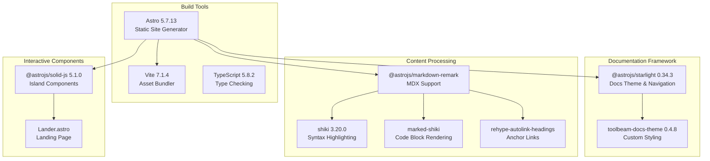
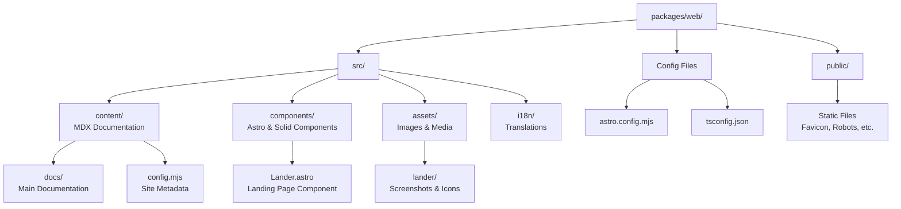
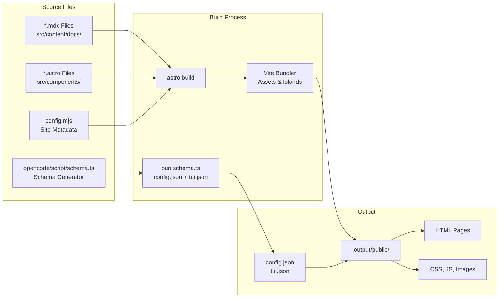
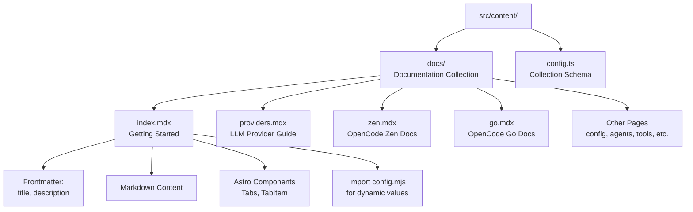
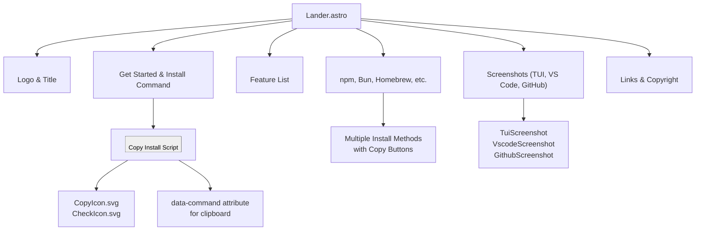
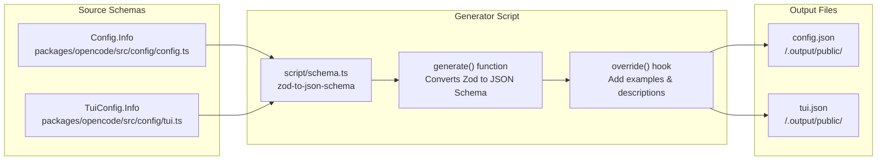

# Web Application

<details>
<summary>Relevant source files</summary>

The following files were used as context for generating this wiki page:

- [README.md](README.md)
- [bun.lock](bun.lock)
- [packages/console/app/package.json](packages/console/app/package.json)
- [packages/console/core/package.json](packages/console/core/package.json)
- [packages/console/function/package.json](packages/console/function/package.json)
- [packages/console/mail/package.json](packages/console/mail/package.json)
- [packages/desktop/package.json](packages/desktop/package.json)
- [packages/function/package.json](packages/function/package.json)
- [packages/opencode/package.json](packages/opencode/package.json)
- [packages/opencode/script/schema.ts](packages/opencode/script/schema.ts)
- [packages/opencode/src/auth/index.ts](packages/opencode/src/auth/index.ts)
- [packages/opencode/src/auth/service.ts](packages/opencode/src/auth/service.ts)
- [packages/opencode/src/cli/ui.ts](packages/opencode/src/cli/ui.ts)
- [packages/opencode/test/provider/amazon-bedrock.test.ts](packages/opencode/test/provider/amazon-bedrock.test.ts)
- [packages/opencode/test/provider/gitlab-duo.test.ts](packages/opencode/test/provider/gitlab-duo.test.ts)
- [packages/plugin/package.json](packages/plugin/package.json)
- [packages/sdk/js/package.json](packages/sdk/js/package.json)
- [packages/web/package.json](packages/web/package.json)
- [packages/web/src/components/Lander.astro](packages/web/src/components/Lander.astro)
- [packages/web/src/content/docs/go.mdx](packages/web/src/content/docs/go.mdx)
- [packages/web/src/content/docs/index.mdx](packages/web/src/content/docs/index.mdx)
- [packages/web/src/content/docs/providers.mdx](packages/web/src/content/docs/providers.mdx)
- [packages/web/src/content/docs/zen.mdx](packages/web/src/content/docs/zen.mdx)
- [sdks/vscode/package.json](sdks/vscode/package.json)

</details>

The `packages/web` package is an **Astro-based static documentation and marketing site** for OpenCode. It serves as the public-facing website at https://opencode.ai, providing installation instructions, feature descriptions, configuration documentation, and provider guides. This is not an interactive client for running OpenCode sessions—for interactive interfaces, see [Terminal User Interface (TUI)](#3.1) and [Desktop Applications](#3.3).

The site is built entirely at compile time and deployed as static HTML/CSS/JavaScript, making it fast, SEO-friendly, and easy to host on CDN platforms like Cloudflare.

---

## Purpose and Scope

The web application fulfills three primary roles:

1. **Marketing and Onboarding** — Landing page with installation commands, feature highlights, and screenshots
2. **Documentation** — Comprehensive guides for configuration, providers, agents, tools, and advanced features
3. **Schema Distribution** — Serves JSON schemas for `opencode.json` and `tui.json` used by LSPs for autocomplete

**Out of Scope:**

- Interactive OpenCode sessions (handled by TUI, Desktop apps, or IDE extensions)
- Server-side rendering or dynamic content generation
- User authentication or session management

**Sources:** [packages/web/package.json:1-43](), [README.md:1-142]()

---

## Technology Stack



**Core Technologies:**

| Technology    | Purpose                                                                 |
| ------------- | ----------------------------------------------------------------------- |
| **Astro**     | Static site generation with file-based routing and content collections  |
| **Starlight** | Documentation framework providing sidebar navigation, search, and i18n  |
| **MDX**       | Markdown with JSX for rich documentation pages                          |
| **Shiki**     | Syntax highlighting for code blocks matching OpenCode's TUI theme       |
| **SolidJS**   | Client-side interactivity for components like copy-to-clipboard buttons |

**Sources:** [packages/web/package.json:14-35]()

---

## Site Structure

#### Directory Layout



**Key Directories:**

- **`src/content/docs/`** — MDX files for documentation pages (providers, config, agents, etc.)
- **`src/components/`** — Reusable Astro and SolidJS components
- **`src/assets/`** — Images, logos, and screenshots bundled by Vite
- **`public/`** — Static files served as-is (fonts, schemas after build)

**Sources:** [packages/web/package.json:1-43](), [packages/web/src/components/Lander.astro:1-700]()

---

## Build Pipeline

The build process transforms MDX content and Astro components into static HTML, CSS, and JavaScript.

#### Build Flow Diagram



**Build Steps:**

1. **Schema Generation** — Generates `config.json` and `tui.json` schemas from Zod schemas in `packages/opencode`

   ```bash
   bun ../../opencode/script/schema.ts ./.output/public/config.json ./.output/public/tui.json
   ```

2. **Astro Build** — Processes MDX content, renders components, bundles assets

   ```bash
   astro build
   ```

3. **Output** — Produces static files in `.output/public/` ready for deployment

**Sources:** [packages/web/package.json:10](), [packages/opencode/script/schema.ts:1-64]()

---

## Content Management

Documentation is authored in **MDX** (Markdown + JSX) with frontmatter for metadata.

#### Content Structure



**Example MDX File Structure:**

```markdown
---
title: Providers
description: Using any LLM provider in OpenCode.
---

import config from "../../../config.mjs"
export const console = config.console

OpenCode uses the [AI SDK](https://ai-sdk.dev/) to support **75+ LLM providers**...

### Anthropic

1. Run the `/connect` command...
```

**Frontmatter Fields:**

- `title` — Page heading and browser tab title
- `description` — Meta description for SEO and page subtitle

**Dynamic Content:**

- Import `config.mjs` for shared values (console URL, email)
- Use Astro components for tabs, callouts, code blocks
- Embed SolidJS components for interactivity (rare)

**Sources:** [packages/web/src/content/docs/providers.mdx:1-50](), [packages/web/src/content/docs/index.mdx:1-50]()

---

## Landing Page Component

The landing page (`Lander.astro`) serves as the marketing homepage with installation commands, feature highlights, and screenshots.

#### Lander Component Architecture



**Key Features:**

| Feature                      | Implementation                                                                         |
| ---------------------------- | -------------------------------------------------------------------------------------- |
| **Copy-to-Clipboard**        | Client-side JavaScript reads `data-command` attribute, writes to clipboard, swaps icon |
| **Responsive Layout**        | CSS Grid with mobile breakpoints at 30rem, 40rem, 50rem                                |
| **Multiple Install Methods** | Separate sections for curl, npm, Bun, Homebrew, Paru, Mise                             |
| **Screenshot Grid**          | Left column (full height TUI), right column (stacked VS Code + GitHub)                 |

**Copy Button Implementation:**

The copy functionality uses a `data-command` attribute and inline JavaScript to:

1. Read the command text from the button's attribute
2. Write to `navigator.clipboard`
3. Toggle `.success` class to swap icons (Copy → Check)

**Sources:** [packages/web/src/components/Lander.astro:1-700]()

---

## Schema Distribution

The web application serves JSON schemas for OpenCode configuration files at:

- `https://opencode.ai/config.json` — Schema for `opencode.json`
- `https://opencode.ai/tui.json` — Schema for TUI-specific config

These schemas are generated during the build process from Zod schemas defined in `packages/opencode`.

#### Schema Generation Flow



**Schema Generation Features:**

- **`allowComments: true`** — Enables JSONC support for LSPs
- **`allowTrailingCommas: true`** — Supports trailing commas in JSON
- **`additionalProperties: false`** — Strict validation, no extra fields
- **Example Values** — Default values added to `examples` field for IDE autocomplete

**Usage:**

LSPs and IDEs fetch these schemas to provide:

- Autocomplete for config keys
- Validation of config structure
- Inline documentation from descriptions

**Sources:** [packages/opencode/script/schema.ts:1-64](), [packages/web/package.json:10]()

---

## Internationalization (i18n)

The site supports multiple languages through Starlight's i18n system. Translation files are located in `src/i18n/` and define UI strings for each locale.

#### Supported Languages

The README and landing page reference translations for:

- English (en)
- 简体中文 (zh)
- 繁體中文 (zht)
- 한국어 (ko)
- Deutsch (de)
- Español (es)
- Français (fr)
- Italiano (it)
- And 13+ others

**Translation Keys:**

The `Lander.astro` component uses `Astro.locals.t` function to fetch localized strings:

```astro
<h1>{t('app.lander.hero.title')}</h1>
<li><b>{t('app.lander.features.native_tui.title')}</b>: {t('app.lander.features.native_tui.description')}</li>
```

**Sources:** [README.md:17-40](), [packages/web/src/components/Lander.astro:62-91]()

---

## Development Workflow

#### Local Development

```bash
cd packages/web
bun dev                    # Start dev server at http://localhost:4321
bun dev:remote             # Dev server with VITE_API_URL=https://api.opencode.ai
```

The dev server provides:

- Hot module replacement (HMR) for instant updates
- Error overlays for build failures
- Content collection type generation

#### Build and Preview

```bash
bun build                  # Generate static site in .output/public/
bun preview                # Serve built site locally
```

**Sources:** [packages/web/package.json:7-12]()

---

## Deployment

The site is configured for deployment to **Cloudflare Pages** via the `@astrojs/cloudflare` adapter.

#### Cloudflare Adapter Configuration

```javascript
// astro.config.mjs (inferred structure)
export default {
  adapter: cloudflare(),
  output: 'static', // or 'hybrid' for edge functions
}
```

**Deployment Process:**

1. GitHub Actions workflow triggers on push to `main`/`dev` branch
2. Build process runs (`bun build` → generates `.output/public/`)
3. Cloudflare Pages deploys static files to CDN
4. Edge locations serve content globally

**Sources:** [packages/web/package.json:15]()

---

## Summary

The web application is a **static documentation and marketing site** built with Astro and Starlight. It does not provide interactive OpenCode functionality—users interact with OpenCode via the TUI, desktop apps, or IDE extensions. The site's primary purposes are:

1. **Onboarding** — Install instructions and feature highlights
2. **Documentation** — Comprehensive guides for all OpenCode features
3. **Schema Hosting** — JSON schemas for IDE autocomplete

The build pipeline generates static HTML from MDX content, bundles assets with Vite, and produces JSON schemas from Zod definitions. The resulting static files are deployed to Cloudflare Pages for global CDN distribution.

**Sources:** [packages/web/package.json:1-43](), [packages/web/src/components/Lander.astro:1-700](), [packages/opencode/script/schema.ts:1-64]()
