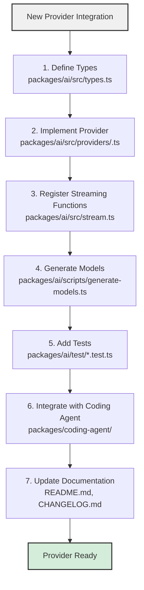
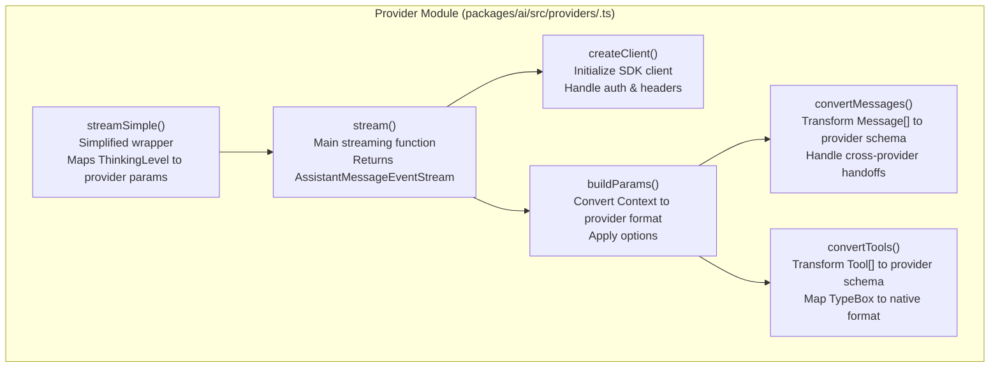
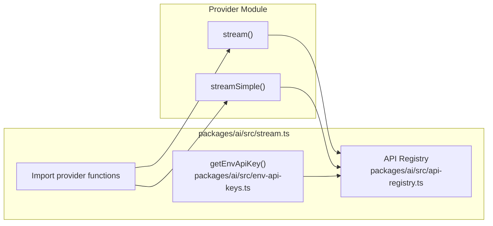
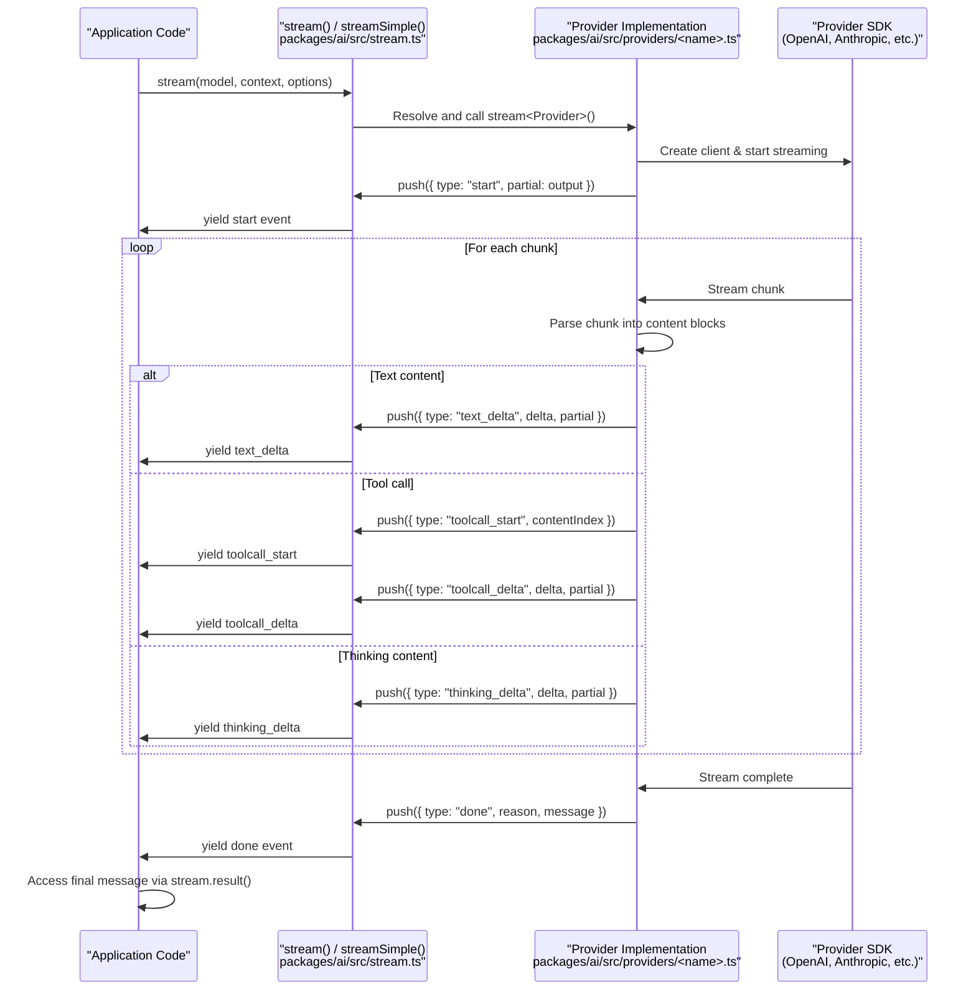

# Adding LLM Providers

<details>
<summary>Relevant source files</summary>

The following files were used as context for generating this wiki page:

- [packages/ai/README.md](packages/ai/README.md)
- [packages/ai/scripts/generate-models.ts](packages/ai/scripts/generate-models.ts)
- [packages/ai/src/index.ts](packages/ai/src/index.ts)
- [packages/ai/src/models.generated.ts](packages/ai/src/models.generated.ts)
- [packages/ai/src/models.ts](packages/ai/src/models.ts)
- [packages/ai/src/providers/anthropic.ts](packages/ai/src/providers/anthropic.ts)
- [packages/ai/src/providers/google.ts](packages/ai/src/providers/google.ts)
- [packages/ai/src/providers/openai-codex-responses.ts](packages/ai/src/providers/openai-codex-responses.ts)
- [packages/ai/src/providers/openai-completions.ts](packages/ai/src/providers/openai-completions.ts)
- [packages/ai/src/providers/openai-responses.ts](packages/ai/src/providers/openai-responses.ts)
- [packages/ai/src/stream.ts](packages/ai/src/stream.ts)
- [packages/ai/src/types.ts](packages/ai/src/types.ts)
- [packages/ai/test/openai-codex-stream.test.ts](packages/ai/test/openai-codex-stream.test.ts)
- [packages/ai/test/supports-xhigh.test.ts](packages/ai/test/supports-xhigh.test.ts)
- [packages/coding-agent/src/core/model-resolver.ts](packages/coding-agent/src/core/model-resolver.ts)
- [packages/coding-agent/test/model-resolver.test.ts](packages/coding-agent/test/model-resolver.test.ts)

</details>

This document provides a step-by-step guide for integrating new LLM providers into the `pi-ai` package. Adding a provider involves implementing a streaming interface, defining type-safe options, registering the provider in the unified API, and ensuring comprehensive test coverage.

For general information about the `pi-ai` architecture and supported providers, see [pi-ai: LLM API Library](#2). For details on using the unified API from application code, see [Streaming API & Provider Implementations](#2.2).

---

## Integration Overview

Adding a new provider requires changes across seven distinct areas of the codebase. Each step builds on the previous one to create a fully-integrated provider that works seamlessly with the unified streaming API.



**Sources:** [AGENTS.md:118-159](), [packages/ai/README.md:1-50]()

---

## Step 1: Core Type Definitions

All provider integrations begin by extending the type system in `packages/ai/src/types.ts`. This ensures type safety across the entire API surface.

### Add API Identifier

Add your API identifier to the `KnownApi` union type. This identifier represents the specific API protocol (e.g., REST vs WebSocket, or different API versions from the same provider).

```typescript
export type KnownApi =
  | "openai-completions"
  | "anthropic-messages"
  | "your-new-api"  // Add here
  | ...;
```

### Add Provider Name

Add your provider name to the `KnownProvider` union type. Multiple providers can use the same API (e.g., `groq` and `cerebras` both use `openai-completions`).

```typescript
export type KnownProvider =
  | "openai"
  | "anthropic"
  | "your-provider"  // Add here
  | ...;
```

### Define Provider Options

Create a typed options interface extending `StreamOptions`. This interface defines provider-specific parameters while inheriting common options like `temperature`, `maxTokens`, and `signal`.

```typescript
export interface YourProviderOptions extends StreamOptions {
  // Provider-specific options
  reasoningMode?: 'fast' | 'deep'
  customParameter?: string
}
```

**Example:** [packages/ai/src/types.ts:52-58]() shows `OpenAIResponsesOptions` with provider-specific `reasoningEffort` and `reasoningSummary` fields.

**Sources:** [packages/ai/src/types.ts:5-16](), [packages/ai/src/types.ts:19-43](), [packages/ai/src/types.ts:52-58]()

---

## Step 2: Provider Implementation

Provider implementations live in `packages/ai/src/providers/`. Each provider exports two core streaming functions and message/tool conversion utilities.

### Implementation Structure



### Core Streaming Function

The primary streaming function signature follows this pattern:

```typescript
export const streamYourProvider: StreamFunction<
  'your-api',
  YourProviderOptions
> = (
  model: Model<'your-api'>,
  context: Context,
  options?: YourProviderOptions
): AssistantMessageEventStream => {
  const stream = new AssistantMessageEventStream()

  ;(async () => {
    // Initialize output message
    const output: AssistantMessage = {
      role: 'assistant',
      content: [],
      api: model.api,
      provider: model.provider,
      model: model.id,
      usage: {
        /* ... */
      },
      stopReason: 'stop',
      timestamp: Date.now(),
    }

    try {
      // Create client, build params, start streaming
      const client = createClient(model, apiKey, options?.headers)
      let params = buildParams(model, context, options)

      // Allow payload inspection/modification
      const nextParams = await options?.onPayload?.(params, model)
      if (nextParams !== undefined) params = nextParams

      const providerStream = await client.stream(params, {
        signal: options?.signal,
      })
      stream.push({ type: 'start', partial: output })

      // Process stream chunks, emit events
      for await (const chunk of providerStream) {
        // Parse chunk, emit text_delta, toolcall_delta, etc.
      }

      stream.push({ type: 'done', reason: output.stopReason, message: output })
      stream.end()
    } catch (error) {
      output.stopReason = options?.signal?.aborted ? 'aborted' : 'error'
      output.errorMessage =
        error instanceof Error ? error.message : JSON.stringify(error)
      stream.push({ type: 'error', reason: output.stopReason, error: output })
      stream.end()
    }
  })()

  return stream
}
```

**Example:** [packages/ai/src/providers/openai-responses.ts:61-128]() demonstrates a complete streaming implementation.

### Simplified Wrapper

The simplified wrapper maps the unified `SimpleStreamOptions` interface to provider-specific options:

```typescript
export const streamSimpleYourProvider: StreamFunction<
  'your-api',
  SimpleStreamOptions
> = (
  model: Model<'your-api'>,
  context: Context,
  options?: SimpleStreamOptions
): AssistantMessageEventStream => {
  const apiKey = options?.apiKey || getEnvApiKey(model.provider)
  if (!apiKey) {
    throw new Error(`No API key for provider: ${model.provider}`)
  }

  const base = buildBaseOptions(model, options, apiKey)
  const reasoningMode = mapThinkingLevel(options?.reasoning)

  return streamYourProvider(model, context, {
    ...base,
    reasoningMode,
  } satisfies YourProviderOptions)
}
```

Helper functions like `buildBaseOptions()`, `clampReasoning()`, and `adjustMaxTokensForThinking()` are available in [packages/ai/src/providers/simple-options.ts]().

**Example:** [packages/ai/src/providers/anthropic.ts:460-499]() shows Anthropic's simplified wrapper with adaptive vs budget-based thinking logic.

### Message Transformation

Message conversion must handle cross-provider handoffs by using the `transformMessages()` utility:

```typescript
import { transformMessages } from './transform-messages.js'

function convertMessages(
  messages: Message[],
  model: Model<'your-api'>
): ProviderMessageFormat[] {
  // Transform messages for cross-provider compatibility
  const transformedMessages = transformMessages(
    messages,
    model,
    normalizeToolCallId
  )

  const params: ProviderMessageFormat[] = []

  for (const msg of transformedMessages) {
    if (msg.role === 'user') {
      // Convert user messages
    } else if (msg.role === 'assistant') {
      // Convert assistant messages, handle thinking blocks
    } else if (msg.role === 'toolResult') {
      // Convert tool results
    }
  }

  return params
}
```

The `transformMessages()` function automatically converts thinking blocks to tagged text when switching between providers, normalizes tool call IDs, and preserves conversation continuity.

**Example:** [packages/ai/src/providers/openai-completions.ts:477-705]() shows comprehensive message conversion including thinking block handling, tool call normalization, and image content.

**Sources:** [packages/ai/src/providers/anthropic.ts:193-424](), [packages/ai/src/providers/openai-completions.ts:60-307](), [packages/ai/src/providers/openai-responses.ts:61-128](), [packages/ai/src/providers/simple-options.ts]()

---

## Step 3: Stream Integration

After implementing the provider, register it in `packages/ai/src/stream.ts` to make it available through the unified API.

### Registration Points



### Environment Variable Detection

Add credential detection to `packages/ai/src/env-api-keys.ts`:

```typescript
export function getEnvApiKey(provider: Provider): string | undefined {
  switch (provider) {
    case 'your-provider':
      return process.env.YOUR_PROVIDER_API_KEY
    // ... other providers
  }
}
```

### API Registration

The provider's streaming functions are registered via the provider module's side effects. Create `packages/ai/src/providers/register-your-provider.ts`:

```typescript
import { registerApiProvider } from '../api-registry.js'
import {
  streamYourProvider,
  streamSimpleYourProvider,
} from './your-provider.js'

registerApiProvider({
  api: 'your-api',
  stream: streamYourProvider,
  streamSimple: streamSimpleYourProvider,
})
```

Then import this file in `packages/ai/src/providers/register-builtins.ts`:

```typescript
import './register-your-provider.js'
```

**Sources:** [packages/ai/src/stream.ts:1-60](), [packages/ai/src/env-api-keys.ts]()

---

## Step 4: Model Generation

The model registry is auto-generated from provider APIs to ensure accuracy and completeness. Add logic to `packages/ai/scripts/generate-models.ts` to fetch and parse your provider's model list.

### Model Fetching Pattern

```typescript
async function fetchYourProviderModels(): Promise<Model<'your-api'>[]> {
  const apiKey = process.env.YOUR_PROVIDER_API_KEY
  if (!apiKey) {
    console.warn('YOUR_PROVIDER_API_KEY not set, skipping provider models')
    return []
  }

  const response = await fetch('https://api.your-provider.com/v1/models', {
    headers: { Authorization: `Bearer ${apiKey}` },
  })
  const data = await response.json()

  return data.models.map((m) => ({
    id: m.id,
    name: m.display_name,
    api: 'your-api',
    provider: 'your-provider',
    baseUrl: 'https://api.your-provider.com/v1',
    reasoning: m.supports_reasoning,
    input: m.supports_vision ? ['text', 'image'] : ['text'],
    cost: {
      input: m.pricing.input_per_million,
      output: m.pricing.output_per_million,
      cacheRead: m.pricing.cache_read_per_million ?? 0,
      cacheWrite: m.pricing.cache_write_per_million ?? 0,
    },
    contextWindow: m.context_window,
    maxTokens: m.max_output_tokens,
  }))
}
```

Add your fetcher to the main generation function and include it in the combined models array.

**Note:** Model generation can also be done manually for providers without programmatic model listings. Simply define the models array directly.

**Sources:** [packages/ai/scripts/generate-models.ts]()

---

## Step 5: Test Coverage

Comprehensive test coverage is required for all providers. Add your provider to each relevant test suite.

### Required Tests

| Test File                          | Purpose                       | Required Coverage                            |
| ---------------------------------- | ----------------------------- | -------------------------------------------- |
| `stream.test.ts`                   | Basic streaming functionality | Text generation, tool calls, thinking blocks |
| `tokens.test.ts`                   | Token counting accuracy       | Input/output token tracking                  |
| `abort.test.ts`                    | Abort signal handling         | Mid-stream cancellation                      |
| `empty.test.ts`                    | Edge case handling            | Empty responses, missing content             |
| `context-overflow.test.ts`         | Context window limits         | Graceful overflow handling                   |
| `image-limits.test.ts`             | Vision capabilities           | Image input support (if applicable)          |
| `unicode-surrogate.test.ts`        | Unicode handling              | Surrogate pair sanitization                  |
| `tool-call-without-result.test.ts` | Tool call behavior            | Continuing without tool results              |
| `image-tool-result.test.ts`        | Tool result images            | Image content in tool results                |
| `total-tokens.test.ts`             | Usage metadata                | Accurate total token counts                  |
| `cross-provider-handoff.test.ts`   | Provider switching            | Mid-conversation handoffs                    |

### Cross-Provider Handoff Tests

For `cross-provider-handoff.test.ts`, add at least one provider/model pair. If your provider exposes multiple model families (e.g., different base models or API versions), add one pair per family to ensure thinking block conversion works correctly across variations.

```typescript
describe('cross-provider handoff', () => {
  it('should handoff from anthropic to your-provider', async () => {
    // Start conversation with Anthropic
    const anthropicModel = getModel('anthropic', 'claude-sonnet-4-20250514')
    // ... continue with your provider
  })
})
```

### Authentication Utilities

For non-standard authentication (OAuth, AWS SDK, etc.), create a utility file:

**Example:** `packages/ai/test/bedrock-utils.ts` provides AWS credential detection and client initialization for Bedrock tests.

**Sources:** [AGENTS.md:145-148](), [packages/ai/test/bedrock-utils.ts]()

---

## Step 6: Coding Agent Integration

The coding agent needs three updates to expose your provider to users:

### Default Model Configuration

Add a default model ID to `packages/coding-agent/src/core/model-resolver.ts`:

```typescript
const DEFAULT_MODELS: Record<Provider, string> = {
  'your-provider': 'your-default-model-id',
  // ... other providers
}
```

This enables users to specify just the provider name (e.g., `--model your-provider`) without requiring the full model ID.

### CLI Documentation

Add environment variable documentation to `packages/coding-agent/src/cli/args.ts` in the help text:

```typescript
Environment variables:
  YOUR_PROVIDER_API_KEY    Your Provider API key
```

### README Updates

Add setup instructions to `packages/coding-agent/README.md`:

````markdown
#### Your Provider

1. Get API key from https://your-provider.com/api-keys
2. Set environment variable:
   ```bash
   export YOUR_PROVIDER_API_KEY=your-key-here
   ```
````

3. Use provider:
   ```bash
   pi --model your-provider
   ```

````

**Sources:** [packages/coding-agent/src/core/model-resolver.ts](), [packages/coding-agent/src/cli/args.ts](), [packages/coding-agent/README.md]()

---

## Step 7: Documentation

Complete the integration by documenting the provider in both the pi-ai package documentation and the changelog.

### Package README

Add your provider to the supported providers list in `packages/ai/README.md`:

```markdown
## Supported Providers

- **Your Provider** - Description of provider
````

Add authentication setup in the relevant section:

````markdown
### Your Provider

```bash
export YOUR_PROVIDER_API_KEY=your-key-here
```
````

Special features:

- Supports reasoning with `reasoning: "high"`
- Vision-capable models accept image input

````

### Provider-Specific Options

Document your provider's options interface:

```markdown
### Provider-Specific Options (stream/complete)

```typescript
import { getModel, complete } from '@mariozechner/pi-ai';

const model = getModel('your-provider', 'your-model');
await complete(model, context, {
  reasoningMode: 'deep',
  customParameter: 'value'
});
````

````

### Changelog Entry

Add an entry to `packages/ai/CHANGELOG.md` under the `## [Unreleased]` section:

```markdown
## [Unreleased]

### Added

- Added support for Your Provider with reasoning capabilities
````

**Sources:** [packages/ai/README.md:48-71](), [packages/ai/CHANGELOG.md](), [AGENTS.md:107-116]()

---

## Implementation Checklist

Use this checklist to track integration progress:

- [ ] **Types**
  - [ ] Added API identifier to `KnownApi`
  - [ ] Added provider to `KnownProvider`
  - [ ] Defined provider options interface extending `StreamOptions`

- [ ] **Provider Implementation**
  - [ ] Created `packages/ai/src/providers/<name>.ts`
  - [ ] Implemented `stream<Provider>()` function
  - [ ] Implemented `streamSimple<Provider>()` wrapper
  - [ ] Created message conversion with `transformMessages()`
  - [ ] Created tool conversion with TypeBox schema mapping
  - [ ] Implemented thinking block handling (if applicable)

- [ ] **Stream Integration**
  - [ ] Added API key detection to `env-api-keys.ts`
  - [ ] Created registration module in `providers/register-<name>.ts`
  - [ ] Imported registration in `providers/register-builtins.ts`

- [ ] **Model Generation**
  - [ ] Added model fetching logic to `scripts/generate-models.ts`
  - [ ] Verified model metadata (pricing, context window, capabilities)

- [ ] **Tests**
  - [ ] Added to all required test files
  - [ ] Verified cross-provider handoffs
  - [ ] Tested edge cases (empty, abort, overflow)
  - [ ] Created auth utility if needed

- [ ] **Coding Agent**
  - [ ] Added default model to `model-resolver.ts`
  - [ ] Added env var to CLI help in `args.ts`
  - [ ] Added setup guide to `README.md`

- [ ] **Documentation**
  - [ ] Added to supported providers list in `packages/ai/README.md`
  - [ ] Documented authentication setup
  - [ ] Documented provider-specific options
  - [ ] Added changelog entry

**Sources:** [AGENTS.md:118-159]()

---

## Example: Provider Event Flow

This diagram shows how streaming events flow from the provider SDK through the unified API to application code:



**Sources:** [packages/ai/src/providers/openai-completions.ts:129-292](), [packages/ai/src/providers/anthropic.ts:249-402](), [packages/ai/src/stream.ts:25-59]()
