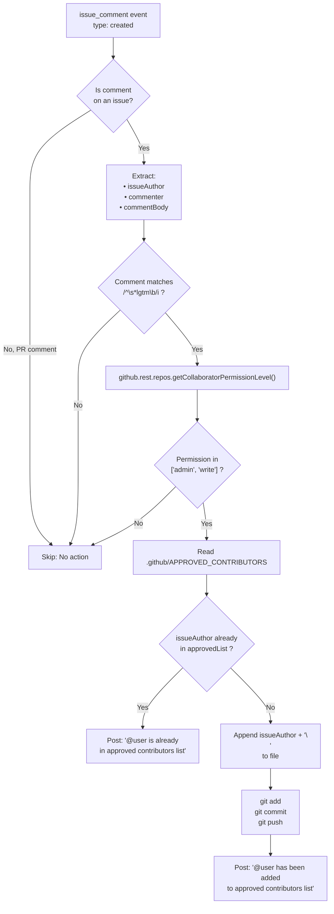
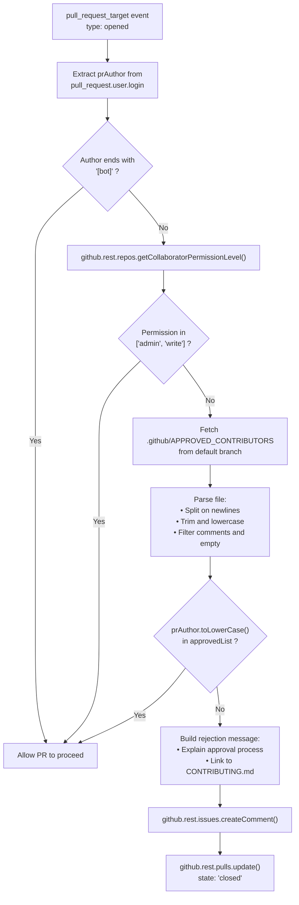
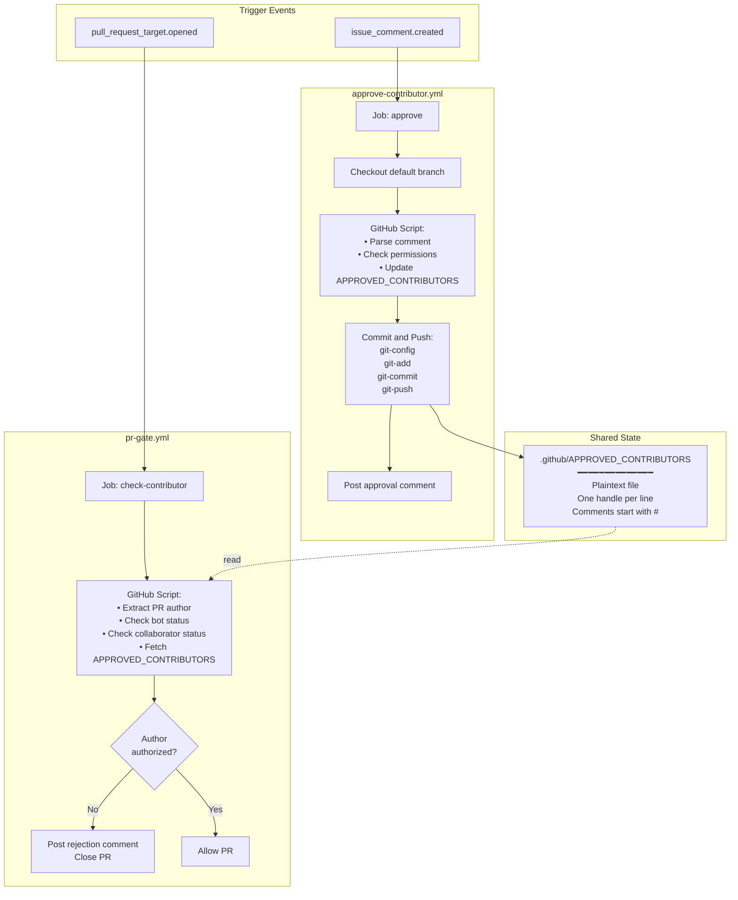
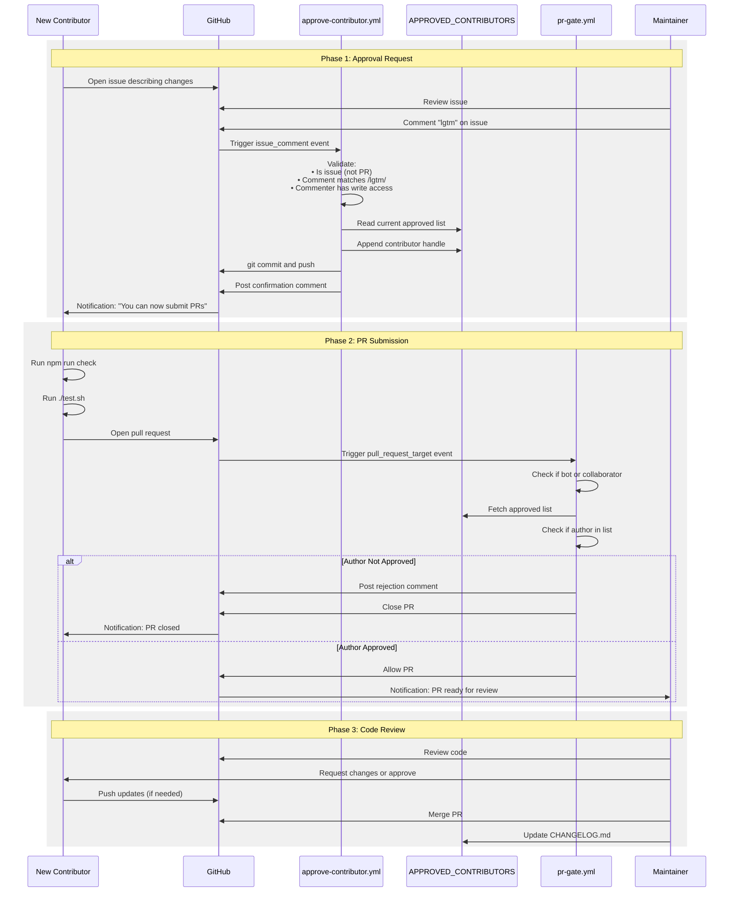

# Contribution Workflow

<details>
<summary>Relevant source files</summary>

The following files were used as context for generating this wiki page:

- [.github/APPROVED_CONTRIBUTORS](.github/APPROVED_CONTRIBUTORS)
- [.github/APPROVED_CONTRIBUTORS.vacation](.github/APPROVED_CONTRIBUTORS.vacation)
- [.github/workflows/approve-contributor.yml](.github/workflows/approve-contributor.yml)
- [.github/workflows/oss-weekend-issues.yml](.github/workflows/oss-weekend-issues.yml)
- [.github/workflows/pr-gate.yml](.github/workflows/pr-gate.yml)
- [CONTRIBUTING.md](CONTRIBUTING.md)
- [scripts/oss-weekend.mjs](scripts/oss-weekend.mjs)

</details>

This document describes the automated contribution approval process, PR validation gate, and review workflow for the pi-mono repository. The system uses GitHub Actions to manage contributor access, ensuring only approved users can submit pull requests while maintaining an open contribution model.

For code quality standards and Git operation rules, see [Development Guidelines & Git Rules](#9.1). For changelog management and versioning, see [Release Process](#9.4). For provider-specific contributions, see [Adding LLM Providers](#9.3).

---

## Overview: The Gated Contribution Model

The repository implements a two-stage approval system designed to prevent low-quality automated contributions while remaining open to genuine contributors:

| Stage                       | Action                                                           | Automation                                           |
| --------------------------- | ---------------------------------------------------------------- | ---------------------------------------------------- |
| **1. Issue-Based Approval** | New contributor opens an issue describing their intended changes | Manual review by maintainer                          |
| **2. LGTM Approval**        | Maintainer comments `lgtm` on the issue                          | `approve-contributor.yml` adds user to approved list |
| **3. PR Submission**        | Contributor opens a pull request                                 | `pr-gate.yml` validates author is approved           |
| **4. Code Review**          | Maintainer reviews code quality and tests                        | Manual review process                                |

This workflow ensures that every contributor has been vetted before investing time in a pull request, reducing wasted effort on both sides.

**Sources:** [CONTRIBUTING.md:1-43](), [.github/workflows/approve-contributor.yml:1-101](), [.github/workflows/pr-gate.yml:1-91]()

---

## New Contributor Approval Process

### Opening an Approval Request

New contributors must open an issue before submitting any pull request. The issue must:

- **Describe what you want to change and why** - Be specific about the problem or feature
- **Keep it concise** - If it doesn't fit on one screen, it's too long
- **Write in your own voice** - At least the introduction must be human-written, not AI-generated
- **Demonstrate understanding** - Show you grasp how your changes interact with the codebase

The one critical rule from [CONTRIBUTING.md:7]() states: _"You must understand your code. If you can't explain what your changes do and how they interact with the rest of the system, your PR will be closed."_

Using AI tools to write code is acceptable if you gain genuine understanding by interrogating the agent with codebase access. Submitting AI-generated code without understanding will result in rejection.

**Sources:** [CONTRIBUTING.md:13-24]()

---

### Maintainer Approval Trigger

When a maintainer reviews the issue and determines the contribution is appropriate, they trigger the approval process by commenting `lgtm` (looks good to me) on the issue. This comment must:

- Be posted by a user with `admin` or `write` repository permissions
- Match the regex pattern `^\s*lgtm\b` (case-insensitive)
- Be on an issue (not a pull request comment)

**Sources:** [.github/workflows/approve-contributor.yml:32-36]()

---

### Automatic Approval Workflow

#### Workflow: approve-contributor.yml



**Workflow Triggers and Validation**

The workflow activates on `issue_comment.created` events [.github/workflows/approve-contributor.yml:3-5]() and performs these validation steps:

1. **Event Type Check**: Confirms the comment is on an issue, not a pull request [.github/workflows/approve-contributor.yml:9]()

2. **Pattern Matching**: Tests if the comment body matches `/^\s*lgtm\b/i` [.github/workflows/approve-contributor.yml:32-36]()

3. **Permission Verification**: Calls `github.rest.repos.getCollaboratorPermissionLevel()` to verify the commenter has `admin` or `write` access [.github/workflows/approve-contributor.yml:39-54]()

4. **Duplicate Check**: Parses `.github/APPROVED_CONTRIBUTORS`, splits on newlines, filters comments and empty lines, and checks if the issue author is already present [.github/workflows/approve-contributor.yml:56-72]()

**File Modification**

If all checks pass and the contributor is not already approved, the workflow:

1. Appends the issue author's GitHub handle to `.github/APPROVED_CONTRIBUTORS` [.github/workflows/approve-contributor.yml:74-75]()
2. Commits the change with message: `"chore: approve contributor {username}"` [.github/workflows/approve-contributor.yml:80-87]()
3. Posts a confirmation comment on the issue [.github/workflows/approve-contributor.yml:89-100]()

The approved contributors file format is simple:

- One GitHub handle per line (without `@` prefix)
- Lines starting with `#` are comments
- Empty lines are ignored

**Sources:** [.github/workflows/approve-contributor.yml:1-101]()

---

## PR Gate Mechanism

### Automatic PR Validation

When a pull request is opened, the `pr-gate.yml` workflow immediately validates whether the author is authorized to contribute. This prevents unauthorized PRs from entering the review queue.

#### Workflow: pr-gate.yml



**Authorization Hierarchy**

The workflow checks three authorization levels in order [.github/workflows/pr-gate.yml:16-60]():

| Priority | Check                    | Method                                                        |
| -------- | ------------------------ | ------------------------------------------------------------- |
| 1        | **Bot Account**          | Username ends with `[bot]` or equals `dependabot[bot]`        |
| 2        | **Collaborator**         | `getCollaboratorPermissionLevel()` returns `admin` or `write` |
| 3        | **Approved Contributor** | Username present in `.github/APPROVED_CONTRIBUTORS`           |

If none of these conditions are met, the PR is rejected.

**Rejection Process**

When a PR from an unapproved contributor is detected [.github/workflows/pr-gate.yml:62-90]():

1. **Post Comment**: A detailed explanation is posted to the PR, including:
   - Request to open an issue first
   - Link to `CONTRIBUTING.md`
   - Note that the PR will be closed automatically

2. **Close PR**: The workflow calls `github.rest.pulls.update()` with `state: 'closed'`

The rejection message [.github/workflows/pr-gate.yml:65-76]() reads:

```
Hi @{author}, thanks for your interest in contributing!

We ask new contributors to open an issue first before submitting a PR.
This helps us discuss the approach and avoid wasted effort.

Next steps:
1. Open an issue describing what you want to change and why
2. Once a maintainer approves with `lgtm`, you'll be added to the approved contributors list
3. Then you can submit your PR
```

**Sources:** [.github/workflows/pr-gate.yml:1-91]()

---

## Code Review Requirements

### Pre-Submission Checks

Before submitting a pull request, contributors must run the following commands from the repository root and ensure they pass:

```bash
npm run check  # Runs lint, format, and typecheck
./test.sh      # Runs test suite
```

The `npm run check` command [CONTRIBUTING.md:28]() executes three validation steps that must all pass with zero errors:

| Check         | Tool       | Purpose                      |
| ------------- | ---------- | ---------------------------- |
| **Lint**      | ESLint     | Code quality and consistency |
| **Format**    | Prettier   | Code formatting standards    |
| **Typecheck** | TypeScript | Type safety verification     |

The `./test.sh` script runs the test suite, which must pass completely.

**Sources:** [CONTRIBUTING.md:26-30]()

---

### Contribution Guidelines

**The One Rule**

All contributions must satisfy the fundamental requirement stated in [CONTRIBUTING.md:7]():

> You must understand your code. If you can't explain what your changes do and how they interact with the rest of the system, your PR will be closed.

This means:

- Being able to explain the purpose of each change
- Understanding how changes interact with existing code
- Knowing the edge cases and potential effects
- Being able to answer questions about implementation details

**Changelog Policy**

Contributors must **not** edit `CHANGELOG.md` [CONTRIBUTING.md:32](). Changelog entries are added by maintainers during the release process. See [Release Process](#9.4) for details on how changes are documented.

**Philosophy and Scope**

The repository follows a minimal core philosophy [CONTRIBUTING.md:37-38]():

> pi's core is minimal. If your feature doesn't belong in the core, it should be an extension. PRs that bloat the core will likely be rejected.

Features should be implemented as extensions using the extension system (see [Extension System](#4.4)) rather than expanding the core codebase, unless they are fundamental capabilities needed by the core runtime.

**Sources:** [CONTRIBUTING.md:1-43]()

---

### Provider-Specific Requirements

When adding a new LLM provider to `packages/ai`, additional tests are required. See [Adding LLM Providers](#9.3) for the complete testing requirements and integration process. The `AGENTS.md` file contains specific guidelines for agent-driven development that must be followed.

**Sources:** [CONTRIBUTING.md:34]()

---

## GitHub Actions Architecture

### Workflow Overview

The contribution system is implemented through two complementary GitHub Actions workflows that operate independently but share a common data source:



**Workflow Permissions**

Both workflows use `pull_request_target` event type or explicit permissions to access repository contents and write to issues/PRs:

**approve-contributor.yml permissions** [.github/workflows/approve-contributor.yml:11-13]():

```yaml
permissions:
  contents: write # To commit to APPROVED_CONTRIBUTORS
  issues: write # To post comments
```

**pr-gate.yml permissions** [.github/workflows/pr-gate.yml:10-13]():

```yaml
permissions:
  contents: read # To read APPROVED_CONTRIBUTORS
  issues: write # To comment on PRs
  pull-requests: write # To close PRs
```

**Shared Data Format**

The `.github/APPROVED_CONTRIBUTORS` file serves as the single source of truth for authorization state. Its format:

- Plain text file with one GitHub handle per line
- Handles are stored without the `@` prefix
- Lines starting with `#` are treated as comments
- Empty lines are ignored during parsing
- Case-insensitive comparison (all handles converted to lowercase)

The file currently contains 124+ approved contributors [.github/APPROVED_CONTRIBUTORS:1-125]().

**Sources:** [.github/workflows/approve-contributor.yml:1-101](), [.github/workflows/pr-gate.yml:1-91](), [.github/APPROVED_CONTRIBUTORS:1-125]()

---

## Complete Contribution Flow

### End-to-End Process



### Step-by-Step Checklist

**For New Contributors:**

1. ☐ Read `CONTRIBUTING.md` and `AGENTS.md` (if using AI tools)
2. ☐ Open an issue describing your proposed changes
   - Keep it concise (one screen or less)
   - Write the introduction in your own voice
   - Explain what and why
3. ☐ Wait for maintainer to comment `lgtm`
4. ☐ Receive notification that you're approved
5. ☐ Fork the repository and clone your fork
6. ☐ Make your changes following Git rules from [Development Guidelines](#9.1)
7. ☐ Run `npm run check` and fix any errors
8. ☐ Run `./test.sh` and ensure all tests pass
9. ☐ Commit changes (do not edit `CHANGELOG.md`)
10. ☐ Open pull request with clear description
11. ☐ Respond to review feedback
12. ☐ Wait for merge

**For Maintainers:**

1. ☐ Review issue for quality and fit
2. ☐ Comment `lgtm` on issue (triggers approval workflow)
3. ☐ Verify contributor added to `.github/APPROVED_CONTRIBUTORS`
4. ☐ Review PR when submitted (gate allows it through)
5. ☐ Check that tests pass and code quality is maintained
6. ☐ Request changes or approve
7. ☐ Merge PR
8. ☐ Add changelog entry under `[Unreleased]` (see [Release Process](#9.4))

**Sources:** [CONTRIBUTING.md:1-43](), [.github/workflows/approve-contributor.yml:1-101](), [.github/workflows/pr-gate.yml:1-91]()
