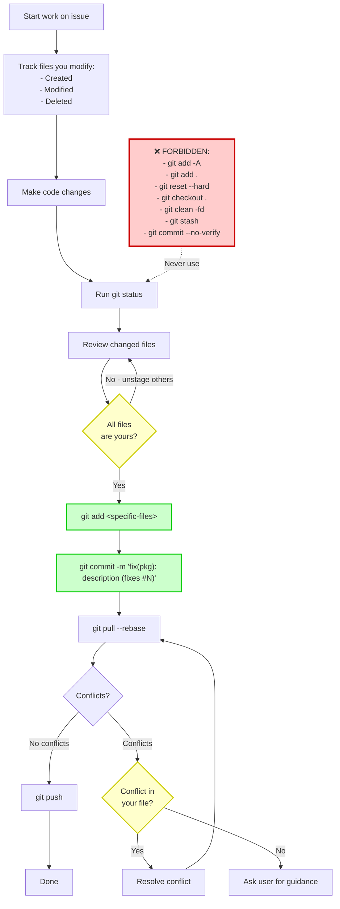
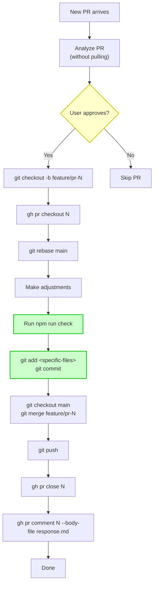
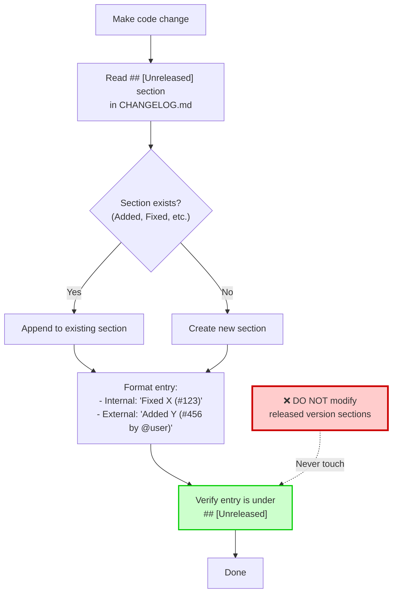

# Development Guidelines & Git Rules

<details>
<summary>Relevant source files</summary>

The following files were used as context for generating this wiki page:

- [AGENTS.md](AGENTS.md)
- [README.md](README.md)
- [packages/coding-agent/README.md](packages/coding-agent/README.md)
- [packages/coding-agent/src/cli/args.ts](packages/coding-agent/src/cli/args.ts)
- [packages/coding-agent/src/main.ts](packages/coding-agent/src/main.ts)

</details>

This document defines critical development standards and Git safety rules for the pi-mono repository. These guidelines ensure code quality, prevent conflicts between parallel development workflows, and maintain project consistency. For general contribution procedures and approval gates, see [Contribution Workflow](#9.2). For package release procedures, see [Release Process](#9.4).

---

## Code Quality Standards

All code contributions must meet the following quality requirements before committing:

### Type Safety

- **No `any` types** unless absolutely necessary
- Check `node_modules` for external API type definitions instead of guessing types
- Upgrade dependencies if type errors occur; never downgrade code to fix type mismatches
- Always ask before removing functionality that appears to be intentional

**Sources:** [AGENTS.md:15-19]()

### Import Rules

**CRITICAL:** Never use inline imports in any form:

- ❌ `await import("./foo.js")` - No dynamic imports
- ❌ `import("pkg").Type` - No inline type imports
- ❌ Dynamic imports for types
- ✅ Standard top-level imports only

```typescript
// ❌ FORBIDDEN
type Foo = import('./types').Foo
const module = await import('./dynamic.js')

// ✅ CORRECT
import type { Foo } from './types.js'
import { module } from './dynamic.js'
```

**Sources:** [AGENTS.md:17]()

### Keybinding Configuration

Never hardcode key checks with literal strings like `matchesKey(keyData, "ctrl+x")`. All keybindings must be configurable through keybinding objects:

- Add defaults to `DEFAULT_EDITOR_KEYBINDINGS` or `DEFAULT_APP_KEYBINDINGS`
- Reference keybindings by name, not literal key combinations
- Users customize bindings via `~/.pi/agent/keybindings.json`

**Sources:** [AGENTS.md:20]()

---

## Build and Validation Workflow

### Required Check Before Committing

**After any code change (not documentation):**

```bash
npm run check
```

This command runs linting, formatting, and type checking across all packages. **Get the full output** - do not use `tail` or limit output. Fix all errors, warnings, and infos before committing.

**Important:** `npm run check` does **not** run tests. It requires `npm run build` to be run first, as some packages (like `web-ui`) use `tsc` which needs compiled `.d.ts` files from dependencies.

**Sources:** [AGENTS.md:23](), [README.md:58]()

### Forbidden Commands

**NEVER run these commands** during normal development:

- `npm run dev`
- `npm run build` (unless setting up for the first time or explicitly needed)
- `npm test` (use specific test files only)

**Sources:** [AGENTS.md:25]()

### Testing Rules

#### Running Tests

Only run specific test files when instructed:

```bash
# Run from package root, NOT repo root
npx tsx ../../node_modules/vitest/dist/cli.js --run test/specific.test.ts
```

#### Test Creation/Modification Requirements

**If you create or modify a test file, you MUST:**

1. Run that specific test file
2. Identify issues in either the test or implementation
3. Iterate until all tests pass
4. Never commit failing tests

**Sources:** [AGENTS.md:26-29]()

---

## CRITICAL: Git Safety Rules for Parallel Agents

Multiple agents may work on different files in the same worktree simultaneously. **Violating these rules can destroy other agents' work.**

### Committing Rules

#### ✅ Safe Commit Workflow

```bash
# 1. Check what's changed
git status

# 2. Add ONLY your specific files (NEVER use git add -A or git add .)
git add packages/ai/src/providers/transform-messages.ts
git add packages/ai/CHANGELOG.md

# 3. Commit with issue reference
git commit -m "fix(ai): transform messages correctly (fixes #123)"

# 4. Push (pull --rebase if needed)
git pull --rebase && git push
```

**Critical requirements:**

- **ONLY commit files YOU changed in THIS session**
- **ALWAYS include `fixes #<number>` or `closes #<number>` in commit messages** when there is a related issue or PR
- **NEVER use `git add -A` or `git add .`** - these stage changes from other agents
- **ALWAYS use `git add <specific-file-paths>`** listing only files you modified
- Before committing, run `git status` and verify you are staging ONLY your files
- Track which files you created/modified/deleted during the session

**Sources:** [AGENTS.md:196-202]()

### Forbidden Git Operations

These commands can **destroy other agents' uncommitted work:**

| Command                    | Danger       | Why Forbidden                                    |
| -------------------------- | ------------ | ------------------------------------------------ |
| `git reset --hard`         | ⛔ DESTROYS  | Destroys uncommitted changes                     |
| `git checkout .`           | ⛔ DESTROYS  | Destroys uncommitted changes                     |
| `git clean -fd`            | ⛔ DESTROYS  | Deletes untracked files                          |
| `git stash`                | ⛔ DANGEROUS | Stashes ALL changes including other agents' work |
| `git add -A` / `git add .` | ⛔ DANGEROUS | Stages other agents' uncommitted work            |
| `git commit --no-verify`   | ⛔ FORBIDDEN | Bypasses required checks, never allowed          |

**Sources:** [AGENTS.md:204-212]()

### Handling Rebase Conflicts

If `git pull --rebase` creates conflicts:

- ✅ Resolve conflicts in YOUR files only
- ❌ If conflict is in a file you didn't modify, **abort and ask the user**
- ❌ NEVER force push

**Sources:** [AGENTS.md:229-232]()

---

## Git Safety Workflow Diagram



**Sources:** [AGENTS.md:192-232]()

---

## Tool Usage Rules

### File Reading

**CRITICAL:** Never use `sed` or `cat` to read files or file ranges. Always use the `read` tool:

```bash
# ❌ FORBIDDEN
sed -n '10,20p' file.ts
cat file.ts

# ✅ CORRECT
# Use read tool with offset + limit for ranged reads
```

**CRITICAL:** You MUST read every file you modify in full before editing.

**Sources:** [AGENTS.md:189-190]()

---

## GitHub Workflow

### Reading Issues

Always read **all comments** on an issue. Use this command to get everything in one call:

```bash
gh issue view <number> --json title,body,comments,labels,state
```

**Sources:** [AGENTS.md:33-38]()

### Issue Labels

Add `pkg:*` labels to indicate which package(s) the issue affects:

- `pkg:agent` - pi-agent-core
- `pkg:ai` - pi-ai
- `pkg:coding-agent` - pi-coding-agent
- `pkg:mom` - pi-mom
- `pkg:pods` - pi-pods
- `pkg:tui` - pi-tui
- `pkg:web-ui` - pi-web-ui

If an issue spans multiple packages, add all relevant labels.

**Sources:** [AGENTS.md:47-50]()

### Posting Comments

**Critical rules for posting issue/PR comments:**

1. Write the full comment to a temp file first
2. Use `gh issue comment --body-file` or `gh pr comment --body-file`
3. **Never pass multi-line markdown directly via `--body`** in shell commands
4. Preview the exact comment text before posting
5. Post exactly **one final comment** unless the user explicitly asks for multiple
6. If a comment is malformed, **delete it immediately**, then post one corrected comment
7. Keep comments concise, technical, and in the user's tone

**Sources:** [AGENTS.md:52-58]()

### Closing Issues via Commits

Include `fixes #<number>` or `closes #<number>` in the commit message. This automatically closes the issue when the commit is merged.

**Sources:** [AGENTS.md:60-62]()

### PR Workflow

Standard workflow for handling pull requests:

1. **Analyze PRs without pulling locally first**
2. If the user approves:
   - Create a feature branch
   - Pull PR
   - Rebase on main
   - Apply adjustments
   - Commit
   - Merge into main
   - Push
   - Close PR
   - Leave a comment in the user's tone

**Important:** You never open PRs yourself. Work in feature branches until everything meets requirements, then merge into main and push.

**Sources:** [AGENTS.md:64-67]()

---

## PR and Git Workflow Diagram



**Sources:** [AGENTS.md:64-67]()

---

## OSS Weekend Mode

OSS Weekend is a temporary mode that auto-closes new issues from non-maintainers during specified dates. For support during this time, users are directed to Discord.

### Enabling OSS Weekend

```bash
# Enable with end date
node scripts/oss-weekend.mjs --mode=close --end-date=YYYY-MM-DD --git

# The script:
# 1. Updates README.md
# 2. Updates packages/coding-agent/README.md
# 3. Updates .github/oss-weekend.json
# 4. Stages ONLY those files (with --git flag)
# 5. Commits them
# 6. Pushes
```

### Disabling OSS Weekend

```bash
node scripts/oss-weekend.mjs --mode=open --git
```

### How It Works

During OSS weekend:

- `.github/workflows/oss-weekend-issues.yml` auto-closes new issues from non-maintainers
- `.github/workflows/pr-gate.yml` auto-closes PRs from approved non-maintainers with the weekend message

**Sources:** [AGENTS.md:40-45](), [packages/coding-agent/README.md:1-7](), [README.md:1-7]()

---

## Testing Interactive Mode with tmux

To test the pi TUI in a controlled terminal environment:

```bash
# Create tmux session with specific dimensions
tmux new-session -d -s pi-test -x 80 -y 24

# Start pi from source
tmux send-keys -t pi-test "cd /path/to/pi-mono && ./pi-test.sh" Enter

# Wait for startup, then capture output
sleep 3 && tmux capture-pane -t pi-test -p

# Send input
tmux send-keys -t pi-test "your prompt here" Enter

# Send special keys
tmux send-keys -t pi-test Escape
tmux send-keys -t pi-test C-o  # ctrl+o

# Cleanup
tmux kill-session -t pi-test
```

This allows testing TUI behavior without interfering with your current terminal session.

**Sources:** [AGENTS.md:73-96]()

---

## Style Guidelines

### Writing Style

- Keep answers short and concise
- No emojis in commits, issues, PR comments, or code
- No fluff or cheerful filler text
- Technical prose only
- Be kind but direct (e.g., "Thanks @user" not "Thanks so much @user!")

**Sources:** [AGENTS.md:98-102]()

### Commit Messages

Standard conventional commit format:

```
fix(pkg): description (fixes #123)
feat(pkg): description
docs(pkg): description
chore(pkg): description
```

Where `pkg` is one of: `ai`, `agent`, `coding-agent`, `mom`, `pods`, `tui`, `web-ui`

**Sources:** [AGENTS.md:223]()

---

## Changelog Management

Location: `packages/*/CHANGELOG.md` (each package has its own)

### Changelog Sections

Use these sections under `## [Unreleased]`:

| Section                | Purpose                           |
| ---------------------- | --------------------------------- |
| `### Breaking Changes` | API changes requiring migration   |
| `### Added`            | New features                      |
| `### Changed`          | Changes to existing functionality |
| `### Fixed`            | Bug fixes                         |
| `### Removed`          | Removed features                  |

### Critical Rules

1. **Before adding entries**, read the full `[Unreleased]` section to see which subsections already exist
2. New entries **ALWAYS** go under `## [Unreleased]` section
3. Append to existing subsections (e.g., `### Fixed`), **do not create duplicates**
4. **NEVER modify already-released version sections** (e.g., `## [0.12.2]`)
5. Each version section is **immutable** once released

### Attribution Format

**Internal changes (from issues):**

```markdown
Fixed foo bar ([#123](https://github.com/badlogic/pi-mono/issues/123))
```

**External contributions:**

```markdown
Added feature X ([#456](https://github.com/badlogic/pi-mono/pull/456) by [@username](https://github.com/username))
```

**Sources:** [AGENTS.md:104-124]()

---

## Changelog Update Workflow



**Sources:** [AGENTS.md:104-124]()

---

## Command Reference Table

| Command                                                                 | Purpose                  | When to Use                                | Restrictions                                   |
| ----------------------------------------------------------------------- | ------------------------ | ------------------------------------------ | ---------------------------------------------- |
| `npm run check`                                                         | Lint, format, type check | After any code change                      | Get full output, fix all errors/warnings/infos |
| `npm run build`                                                         | Build all packages       | First-time setup or when explicitly needed | Not for routine development                    |
| `npx tsx ../../node_modules/vitest/dist/cli.js --run test/file.test.ts` | Run specific test        | When creating/modifying tests              | Must run from package root                     |
| `gh issue view N --json title,body,comments,labels,state`               | Read issue completely    | Before working on an issue                 | Always read all comments                       |
| `gh issue comment N --body-file file.md`                                | Post issue comment       | After preparing comment                    | Preview before posting                         |
| `node scripts/oss-weekend.mjs --mode=close --end-date=YYYY-MM-DD --git` | Enable OSS weekend       | When user requests                         | Updates READMEs and config                     |
| `git add <specific-files>`                                              | Stage changes            | Before commit                              | ONLY files you modified                        |
| `git add -A` / `git add .`                                              | ⛔ FORBIDDEN             | Never                                      | Stages other agents' work                      |
| `git commit --no-verify`                                                | ⛔ FORBIDDEN             | Never                                      | Bypasses required checks                       |

**Sources:** [AGENTS.md:23-96](), [AGENTS.md:192-232]()

---

## File Tracking Implementation Pattern

When working on a task, maintain a mental or explicit list of files touched during the session:

```typescript
// Pattern: Track modifications during session
interface SessionFiles {
  created: string[] // Files you created
  modified: string[] // Files you modified
  deleted: string[] // Files you deleted
}

// Before commit:
// 1. git status
// 2. Compare output with SessionFiles
// 3. Only stage files in SessionFiles
// 4. Verify with git status again
```

This pattern prevents accidentally staging other agents' work.

**Sources:** [AGENTS.md:202]()

---

## Summary of Critical Rules

### ⛔ NEVER Do This

1. Use `any` types without justification
2. Use inline imports (`await import()`, `import("pkg").Type`)
3. Hardcode keybindings (use keybinding objects)
4. Run `npm run dev`, `npm run build`, or `npm test` during normal development
5. Commit without running `npm run check`
6. Use `git add -A` or `git add .`
7. Use `git reset --hard`, `git checkout .`, `git clean -fd`, `git stash`
8. Use `git commit --no-verify`
9. Use `sed` or `cat` to read files (use `read` tool)
10. Modify released version sections in CHANGELOG.md
11. Pass multi-line markdown via `--body` in shell commands
12. Force push during rebase conflicts

### ✅ ALWAYS Do This

1. Check `node_modules` for type definitions
2. Use standard top-level imports
3. Run `npm run check` after code changes (get full output)
4. Run tests when creating/modifying test files
5. Read files completely before editing
6. Use `git add <specific-files>` with only files you modified
7. Include `fixes #N` or `closes #N` in commit messages
8. Read all comments on issues before working
9. Preview comments before posting
10. Update CHANGELOG.md under `[Unreleased]`
11. Track which files you modify during the session
12. Verify `git status` before committing

**Sources:** [AGENTS.md:14-232]()
