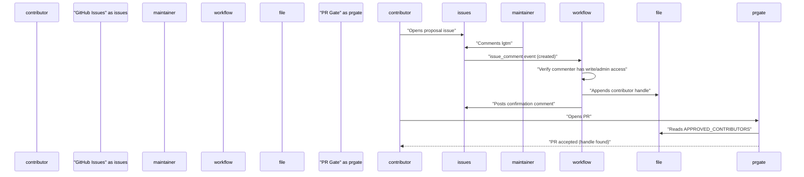
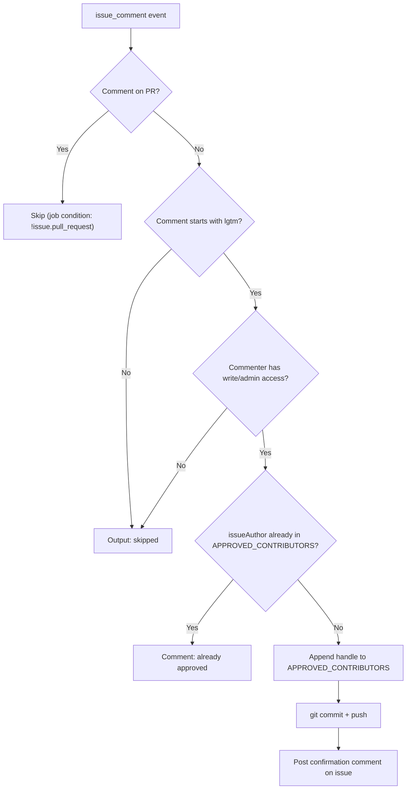
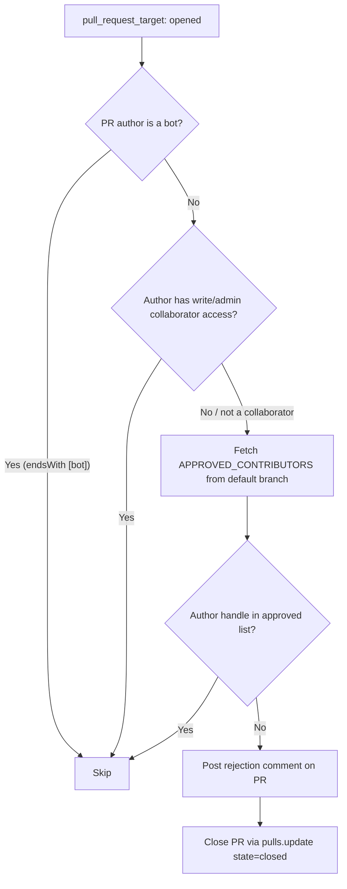

# Contributing

<details>
<summary>Relevant source files</summary>

The following files were used as context for generating this wiki page:

- [.github/APPROVED_CONTRIBUTORS](.github/APPROVED_CONTRIBUTORS)
- [.github/APPROVED_CONTRIBUTORS.vacation](.github/APPROVED_CONTRIBUTORS.vacation)
- [.github/workflows/approve-contributor.yml](.github/workflows/approve-contributor.yml)
- [.github/workflows/oss-weekend-issues.yml](.github/workflows/oss-weekend-issues.yml)
- [.github/workflows/pr-gate.yml](.github/workflows/pr-gate.yml)
- [AGENTS.md](AGENTS.md)
- [CONTRIBUTING.md](CONTRIBUTING.md)
- [README.md](README.md)
- [packages/coding-agent/README.md](packages/coding-agent/README.md)
- [packages/coding-agent/src/cli/args.ts](packages/coding-agent/src/cli/args.ts)
- [packages/coding-agent/src/main.ts](packages/coding-agent/src/main.ts)
- [scripts/oss-weekend.mjs](scripts/oss-weekend.mjs)

</details>

This page documents the contributor approval process for pi-mono, the automated workflows that enforce it, and the requirements that must be met before submitting a pull request. It covers the issue-first workflow, the `APPROVED_CONTRIBUTORS` file, and the two GitHub Actions workflows that manage access control.

---

## Overview

pi-mono uses a gated contribution model. Direct pull requests from unknown contributors are automatically closed. Access is granted only after a maintainer explicitly approves a contributor via an issue comment.

The process is enforced by two GitHub Actions workflows:

| Workflow              | File                                        | Trigger               |
| --------------------- | ------------------------------------------- | --------------------- |
| `Approve Contributor` | `.github/workflows/approve-contributor.yml` | Issue comment created |
| `PR Gate`             | `.github/workflows/pr-gate.yml`             | Pull request opened   |

---

## Contributor Approval Process

**First-time contributor flow:**

1. Open a GitHub issue describing the proposed change and its rationale.
2. Keep the issue concise — one screen or less.
3. Write the introduction in your own words. AI-generated openers are a signal for rejection.
4. A maintainer with `write` or `admin` repository access comments `lgtm` on the issue.
5. The `approve-contributor.yml` workflow detects the comment, adds the issue author's GitHub handle to `.github/APPROVED_CONTRIBUTORS`, and posts a confirmation comment.
6. Once approved, pull requests from that handle will pass the PR gate.



Sources: [CONTRIBUTING.md:14-23](), [.github/workflows/approve-contributor.yml:1-101](), [.github/workflows/pr-gate.yml:1-91]()

---

## `APPROVED_CONTRIBUTORS` File

The single source of truth for contributor access is [.github/APPROVED_CONTRIBUTORS]().

- One GitHub handle per line, without the `@` prefix.
- Lines starting with `#` are comments and are ignored by both workflows.
- Comparisons are case-insensitive (handles are lowercased before matching).

The file is modified only by the `approve-contributor.yml` workflow via an automated commit from `github-actions[bot]`.

Sources: [.github/APPROVED_CONTRIBUTORS:1-5](), [.github/workflows/approve-contributor.yml:56-78]()

---

## Workflow: `approve-contributor.yml`

**File:** [.github/workflows/approve-contributor.yml]()

**Trigger:** `issue_comment` → `created` (issues only, not pull request comments)

**Logic flow:**



**Key implementation details:**

- The `lgtm` check uses a case-insensitive regex: `/^\s*lgtm\b/i` [.github/workflows/approve-contributor.yml:32]()
- Permission is verified via `github.rest.repos.getCollaboratorPermissionLevel`. Only `admin` or `write` levels pass [.github/workflows/approve-contributor.yml:39-54]()
- The approved list is read directly from the filesystem after checkout of the default branch [.github/workflows/approve-contributor.yml:56-61]()
- The new handle is appended with a trailing newline [.github/workflows/approve-contributor.yml:74]()
- The automated commit message is: `chore: approve contributor <handle>` [.github/workflows/approve-contributor.yml:86]()

Sources: [.github/workflows/approve-contributor.yml:1-101]()

---

## Workflow: `pr-gate.yml`

**File:** [.github/workflows/pr-gate.yml]()

**Trigger:** `pull_request_target` → `opened`

> **Note:** `pull_request_target` runs with write permissions even for forks, which is why it can close PRs and post comments.

**Logic flow:**



**Access check priority:**

| Check               | Method                                 | Passes if                        |
| ------------------- | -------------------------------------- | -------------------------------- |
| Bot check           | `prAuthor.endsWith('[bot]')`           | Author is a GitHub bot           |
| Collaborator check  | `repos.getCollaboratorPermissionLevel` | Permission is `admin` or `write` |
| Approved list check | `.github/APPROVED_CONTRIBUTORS`        | Handle found (case-insensitive)  |

The rejection comment directs the contributor to `CONTRIBUTING.md` and explains the issue-first requirement [.github/workflows/pr-gate.yml:65-76]().

Sources: [.github/workflows/pr-gate.yml:1-91]()

---

## Pre-Submission Requirements

Before opening a pull request, the following checks must pass locally:

```bash
npm run check   # TypeScript and lint checks — must produce no errors
./test.sh       # Integration test suite — must pass
```

Additional constraints from [CONTRIBUTING.md]():

- Do not edit `CHANGELOG.md`. Maintainers manage changelog entries.
- New providers added to `packages/ai` must include tests. Refer to `AGENTS.md` for the required test format.
- Features that do not belong in the core should be implemented as extensions rather than modifying core packages. See [Extension System](#4.4) for the extension API.

---

## Philosophy

From [CONTRIBUTING.md:38-39]():

> pi's core is minimal. If your feature doesn't belong in the core, it should be an extension. PRs that bloat the core will likely be rejected.

AI-assisted code is permitted, but the submitter must be able to explain what the code does and how it interacts with the rest of the system. The `AGENTS.md` file at the repository root contains rules that agents used for code generation must follow. Run agents from the `pi-mono` root so that file is picked up automatically.

Sources: [CONTRIBUTING.md:1-43]()

---

## Questions

Open a GitHub issue or ask on the project Discord linked in [CONTRIBUTING.md:43]().
