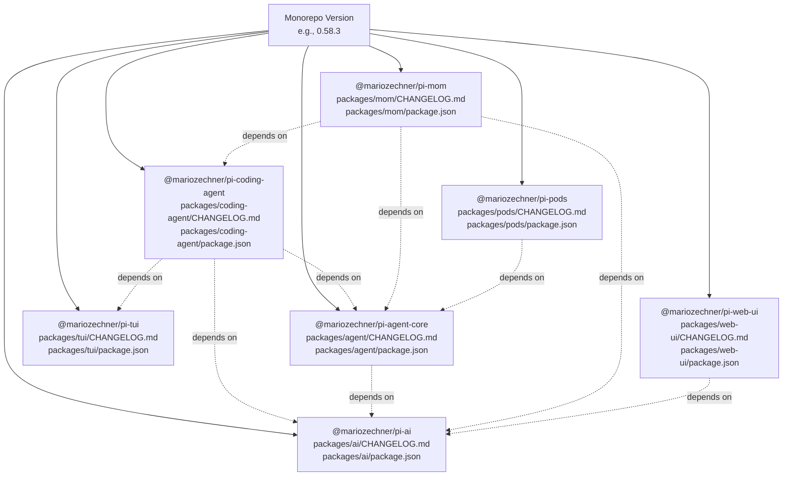
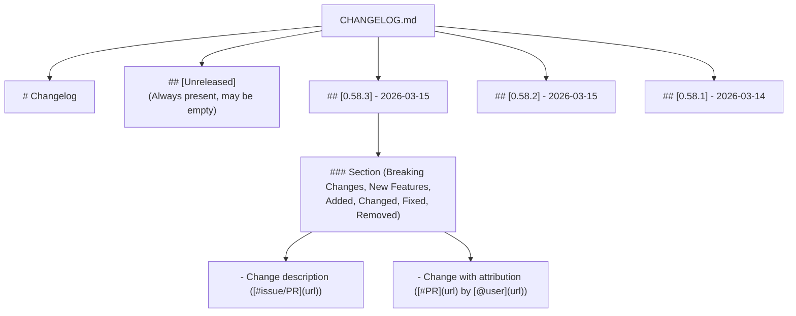
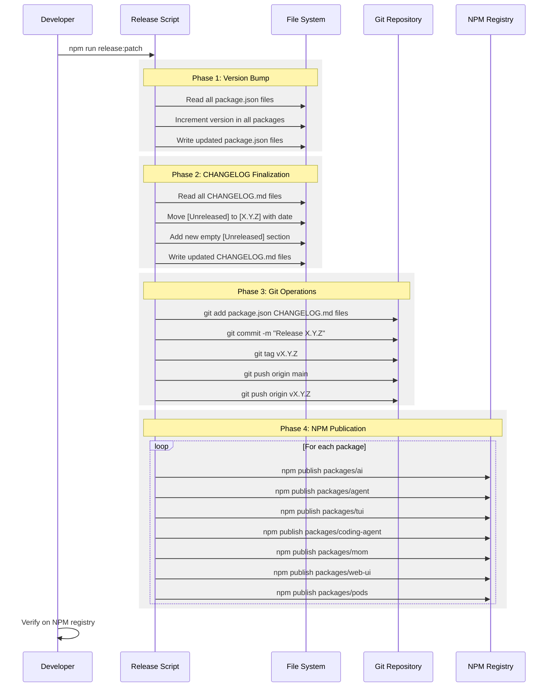
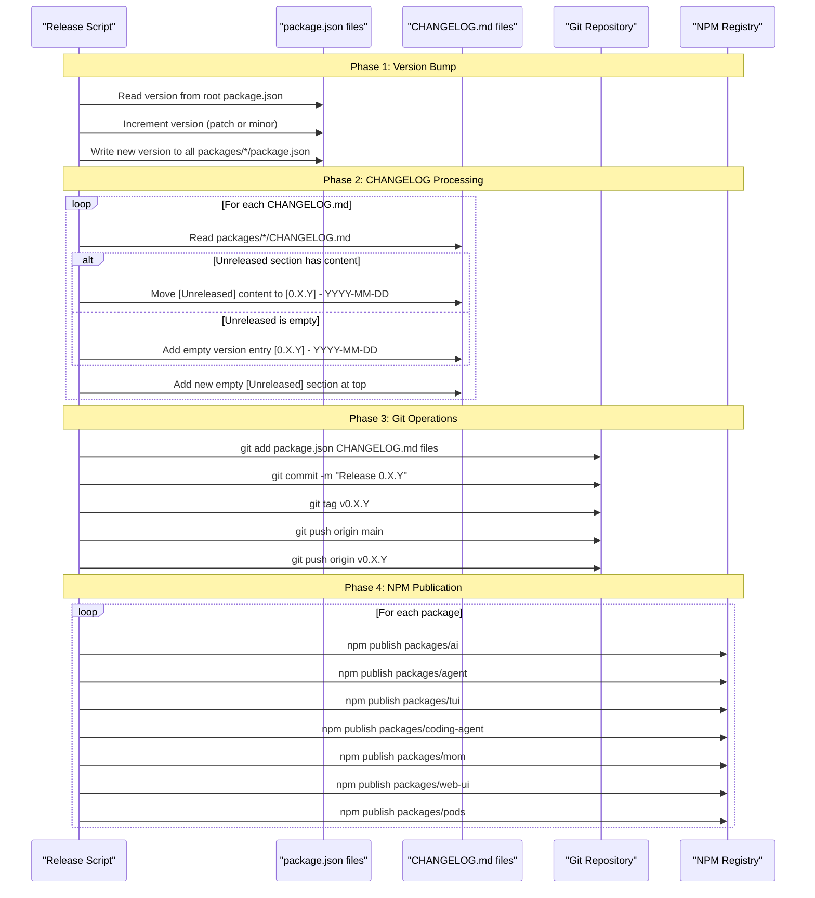
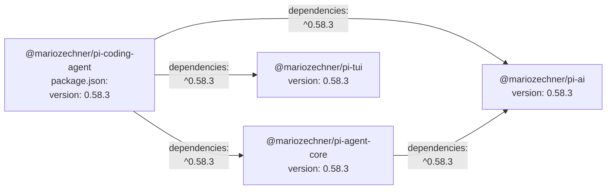

# Release Process

<details>
<summary>Relevant source files</summary>

The following files were used as context for generating this wiki page:

- [packages/agent/CHANGELOG.md](packages/agent/CHANGELOG.md)
- [packages/ai/CHANGELOG.md](packages/ai/CHANGELOG.md)
- [packages/coding-agent/CHANGELOG.md](packages/coding-agent/CHANGELOG.md)
- [packages/mom/CHANGELOG.md](packages/mom/CHANGELOG.md)
- [packages/tui/CHANGELOG.md](packages/tui/CHANGELOG.md)
- [packages/web-ui/CHANGELOG.md](packages/web-ui/CHANGELOG.md)

</details>

This document describes the versioning strategy, changelog management, and automated release workflow for the pi-mono repository. For information about contributing code changes, see [Contribution Workflow](#9.2). For details on development practices, see [Development Guidelines & Git Rules](#9.1).

## Lockstep Versioning Strategy

All packages in the monorepo share a single version number in the format `0.X.Y`. Every release increments the version for all packages simultaneously, regardless of whether individual packages have changes. This simplifies dependency management and ensures consistent version numbers across the ecosystem.

**Empty Version Entries**: Packages with no changes in a release still receive a version entry in their `CHANGELOG.md` file with just the version header and date, but no changelog sections. This maintains version synchronization across all packages.



**Lockstep Versioning Architecture**: All seven packages share the same version number. When any package is released, all packages are published with the new version. Each package maintains its own CHANGELOG.md and package.json with synchronized version numbers.

Sources: [packages/coding-agent/CHANGELOG.md:1-8](), [packages/ai/CHANGELOG.md:1-8](), [packages/tui/CHANGELOG.md:1-8](), [packages/mom/CHANGELOG.md:1-8](), [packages/agent/CHANGELOG.md:1-8](), [packages/web-ui/CHANGELOG.md:1-8]()

## Version Semantics

The repository uses a `0.X.Y` versioning scheme that differs from traditional semantic versioning:

| Version Component | Use Case                                      | Examples            |
| ----------------- | --------------------------------------------- | ------------------- |
| `0.X.*` (minor)   | New features, breaking changes, major updates | `0.57.0` → `0.58.0` |
| `0.*.Y` (patch)   | Bug fixes, small features, documentation      | `0.58.1` → `0.58.2` |

**Pre-1.0 Status**: The repository remains in `0.x` versioning, indicating the API is still evolving. Breaking changes are introduced in minor version bumps (e.g., `0.56.0` → `0.57.0`), not major versions. When breaking changes occur, they are documented in a `### Breaking Changes` section in the CHANGELOG.

**Release Frequency**: The project releases frequently, sometimes multiple times per day during active development periods. Sequential patch releases (e.g., `0.58.1`, `0.58.2`, `0.58.3`) often occur within hours of each other.

Sources: [packages/coding-agent/CHANGELOG.md:5-47](), [packages/ai/CHANGELOG.md:5-24](), [AGENTS.md:164-166]()

## Changelog Management

### File Locations

Each package maintains its own changelog in a dedicated file:

| Package                         | CHANGELOG Path                       |
| ------------------------------- | ------------------------------------ |
| `@mariozechner/pi-ai`           | `packages/ai/CHANGELOG.md`           |
| `@mariozechner/pi-agent-core`   | `packages/agent/CHANGELOG.md`        |
| `@mariozechner/pi-tui`          | `packages/tui/CHANGELOG.md`          |
| `@mariozechner/pi-coding-agent` | `packages/coding-agent/CHANGELOG.md` |
| `@mariozechner/pi-mom`          | `packages/mom/CHANGELOG.md`          |
| `@mariozechner/pi-web-ui`       | `packages/web-ui/CHANGELOG.md`       |
| `@mariozechner/pi-pods`         | `packages/pods/CHANGELOG.md`         |

These files follow a consistent format across all packages but contain package-specific changes.

### Changelog Format

Each `CHANGELOG.md` follows this structure:

```markdown
# Changelog

## [Unreleased]

## [0.58.3] - 2026-03-15

### Added

- New feature description

### Fixed

- Bug fix description ([#2044](https://github.com/badlogic/pi-mono/issues/2044))
- External contribution ([#2154](https://github.com/badlogic/pi-mono/pull/2154) by [@contributor](https://github.com/contributor))

## [0.58.2] - 2026-03-15

### Fixed

- Previous release fixes

## [0.58.1] - 2026-03-14

### Added

- Feature added in this version

### Fixed

- Bug fixes from this version
```

**Changelog Entry Structure**:



**CHANGELOG.md File Structure**: The file contains a header, an `[Unreleased]` section (which may be empty), followed by version sections in reverse chronological order. Each version section may contain subsections for different change types.

**Empty Version Entries**: Many releases have version headers with no content beneath them. This occurs when a package has no changes in that release but receives a version bump for lockstep versioning. For example:

```markdown
## [0.58.3] - 2026-03-15

## [0.58.2] - 2026-03-15

### Fixed

- Actual changes here
```

Sources: [packages/coding-agent/CHANGELOG.md:1-50](), [packages/ai/CHANGELOG.md:1-30](), [packages/tui/CHANGELOG.md:1-30]()

### Changelog Rules

1. **All changes go under `[Unreleased]`**: New entries are always added to the `[Unreleased]` section at the top of the file.

2. **Read before adding**: Check which subsections already exist under `[Unreleased]` to avoid creating duplicates.

3. **Append to existing subsections**: If `### Fixed` already exists, add new fixes there instead of creating a second `### Fixed` section.

4. **Never modify released sections**: Once a version section like `## [0.58.2] - 2026-03-15` is published, it becomes immutable.

5. **Use standard subsections** (in order of appearance):
   - `### Breaking Changes` - API changes requiring migration
   - `### New Features` - Major feature additions (sometimes used instead of/in addition to Added)
   - `### Added` - New features and capabilities
   - `### Changed` - Changes to existing functionality
   - `### Fixed` - Bug fixes
   - `### Removed` - Removed features

6. **Subsection order flexibility**: The exact subsection order can vary. Common patterns include starting with breaking changes, then new features/added, followed by changed, fixed, and removed.

### Attribution Patterns

| Change Source                   | Format                                                        | Example                                                                                                                                            |
| ------------------------------- | ------------------------------------------------------------- | -------------------------------------------------------------------------------------------------------------------------------------------------- |
| Internal (from issues)          | `Description ([#issue](url))`                                 | `Fixed fuzzy edit matching ([#2044](https://github.com/badlogic/pi-mono/issues/2044))`                                                             |
| External (from PRs)             | `Description ([#pr](url) by [@user](url))`                    | `Improved selector layouts ([#2154](https://github.com/badlogic/pi-mono/pull/2154) by [@markusylisiurunen](https://github.com/markusylisiurunen))` |
| Mixed (PR with issue reference) | `Description ([#issue](...)) or ([#pr](...) by [@user](...))` | Can reference both issue and PR                                                                                                                    |

**Issue vs PR Links**: Issues use `/issues/` in the URL path, PRs use `/pull/` in the URL path.

Sources: [AGENTS.md:96-117](), [packages/coding-agent/CHANGELOG.md:9-20](), [packages/ai/CHANGELOG.md:9-23]()

## Release Workflow

### Pre-Release Checklist

Before running the release script:

1. **Review all package CHANGELOGs**: Verify that `packages/*/CHANGELOG.md` files have all changes documented in their `[Unreleased]` sections. Packages with no changes will receive empty version entries.

2. **Ensure changes are committed**: All code changes must be committed. The release script does not handle uncommitted files.

3. **Verify tests pass**: Run the test suite to confirm all tests pass.

4. **Check build succeeds**: Run the build process to verify compilation succeeds for all packages.

5. **Verify lockstep dependencies**: Check that internal dependencies in `package.json` files use appropriate version ranges (typically caret `^` ranges for pre-1.0 packages).

### Release Commands

```bash
# Patch release (bug fixes, small features)
npm run release:patch

# Minor release (new features, breaking changes)
npm run release:minor
```

These commands invoke automated release scripts that handle version bumping, changelog finalization, Git operations, and NPM publication.

**Note**: The actual release script implementation may vary. Check the root `package.json` file for the exact commands and their definitions.

Sources: [AGENTS.md:169-178](), [packages/coding-agent/CHANGELOG.md:1-50]()

### Automated Release Steps

The release script automates the following sequence:



**Automated Release Workflow**: The release script performs version bumping, changelog finalization, Git operations, and NPM publication in a single atomic operation.

### What the Script Handles

The `npm run release:*` scripts automate the following steps:



**Automated Release Sequence**: The release script performs version bumping, CHANGELOG finalization (including empty version entries for packages with no changes), Git operations, and NPM publication.

**Key Automation Features**:

1. **Version bumping**: Updates `version` field in all `packages/*/package.json` files to maintain lockstep versioning.

2. **CHANGELOG finalization**:
   - For packages with changes: Converts `## [Unreleased]` to `## [0.X.Y] - YYYY-MM-DD` with content
   - For packages without changes: Adds empty version entry `## [0.X.Y] - YYYY-MM-DD` (no content)
   - Adds a new empty `## [Unreleased]` section at the top of all CHANGELOGs
   - Preserves all content from the original `[Unreleased]` section

3. **Git commit and tagging**:
   - Creates a single commit with message like `Release 0.58.3`
   - Tags the commit as `v0.58.3`
   - Pushes both commit and tag to the remote repository

4. **NPM publication**: Publishes all seven packages to the NPM registry with the new version, even those with no changes.

Sources: [AGENTS.md:169-178](), [packages/coding-agent/CHANGELOG.md:1-10](), [packages/ai/CHANGELOG.md:1-10]()

## Package Manifest Structure

Each package's `package.json` includes versioning and dependency information:

```json
{
  "name": "@mariozechner/pi-coding-agent",
  "version": "0.58.3",
  "dependencies": {
    "@mariozechner/pi-ai": "^0.58.3",
    "@mariozechner/pi-agent-core": "^0.58.3",
    "@mariozechner/pi-tui": "^0.58.3"
  }
}
```

**Lockstep Version Synchronization**: All packages maintain the same version number. When version `0.58.3` is released, all seven packages receive this version in their `package.json` files simultaneously.

**Internal Dependency Version Ranges**: Internal dependencies use caret ranges (`^0.X.Y`) to allow patch updates within the same minor version. This is safe in the 0.x versioning scheme because:

- Patch releases (`0.58.1` → `0.58.2`) contain only bug fixes and minor features
- Breaking changes require minor version bumps (`0.58.x` → `0.59.0`)
- All packages are released together, so dependencies are always available

**Example Dependency Graph**:



**Package Dependency Version Synchronization**: Dependencies reference the same version number using caret ranges.

Sources: [AGENTS.md:162-178]()

## Error Recovery

If the release script fails mid-process:

1. **Before Git push**: Simply re-run the command. The script will overwrite the uncommitted changes.

2. **After Git push but before NPM publish**: Manually increment the version and run the script again. The Git tag will fail (already exists), but NPM publication will succeed.

3. **After partial NPM publish**: Complete the remaining package publications manually:

   ```bash
   cd packages/<package-name>
   npm publish
   ```

4. **To abort a release before pushing**: Reset the version changes:
   ```bash
   git checkout -- packages/*/package.json packages/*/CHANGELOG.md
   ```

Sources: [AGENTS.md:162-178]()

## Post-Release Verification

After running the release script:

1. **Verify Git tags**: Check that the tag exists on GitHub: `https://github.com/badlogic/pi-mono/releases`

2. **Verify NPM publication**: Check each package on NPM:
   - `https://www.npmjs.com/package/@mariozechner/pi-ai`
   - `https://www.npmjs.com/package/@mariozechner/pi-agent-core`
   - `https://www.npmjs.com/package/@mariozechner/pi-tui`
   - `https://www.npmjs.com/package/@mariozechner/pi-coding-agent`
   - `https://www.npmjs.com/package/@mariozechner/pi-mom`
   - `https://www.npmjs.com/package/@mariozechner/pi-web-ui`
   - `https://www.npmjs.com/package/@mariozechner/pi-pods`

3. **Test installation**: Install the new version in a test project to verify it works.

Sources: [AGENTS.md:162-178]()
