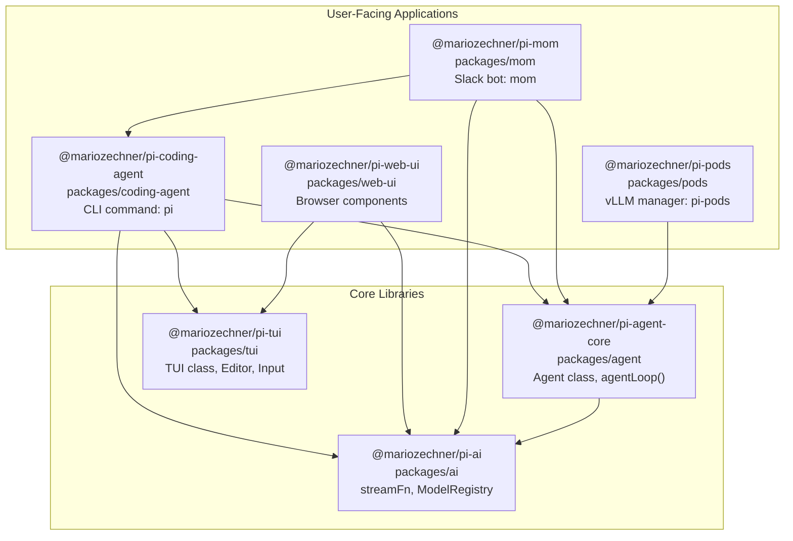
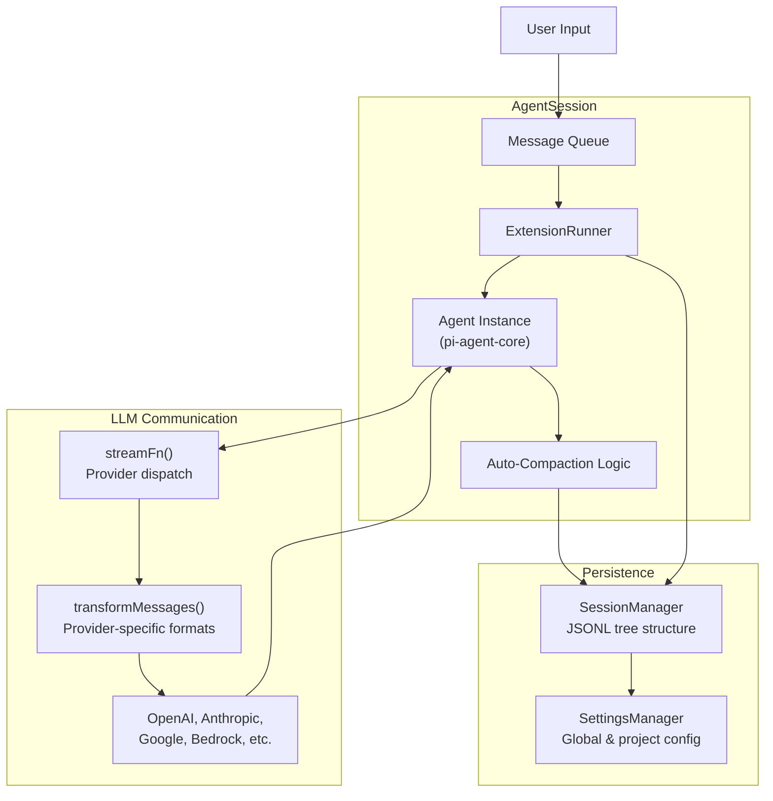
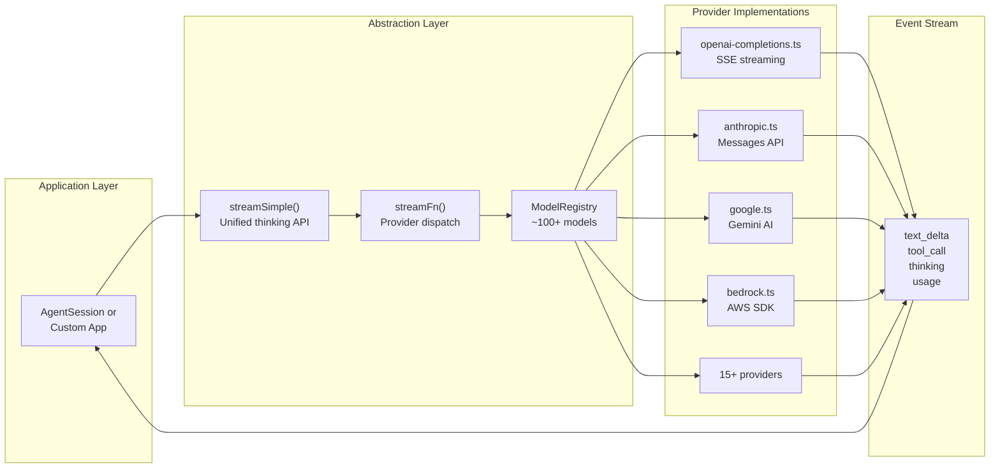
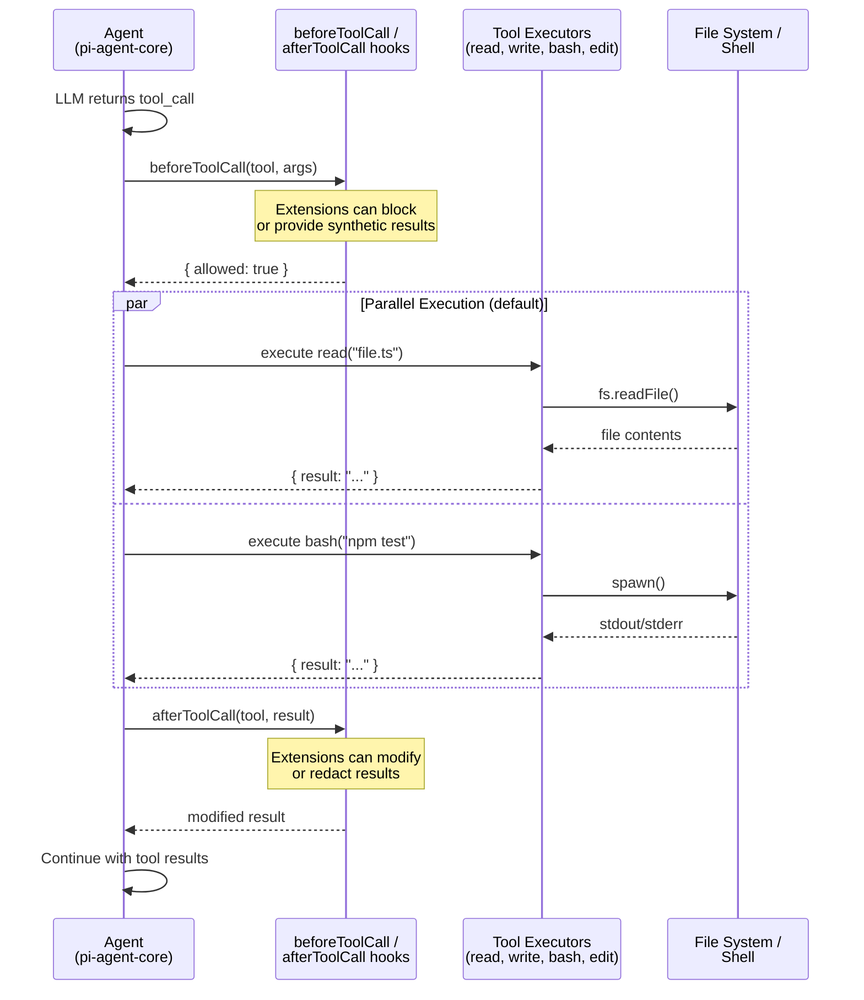
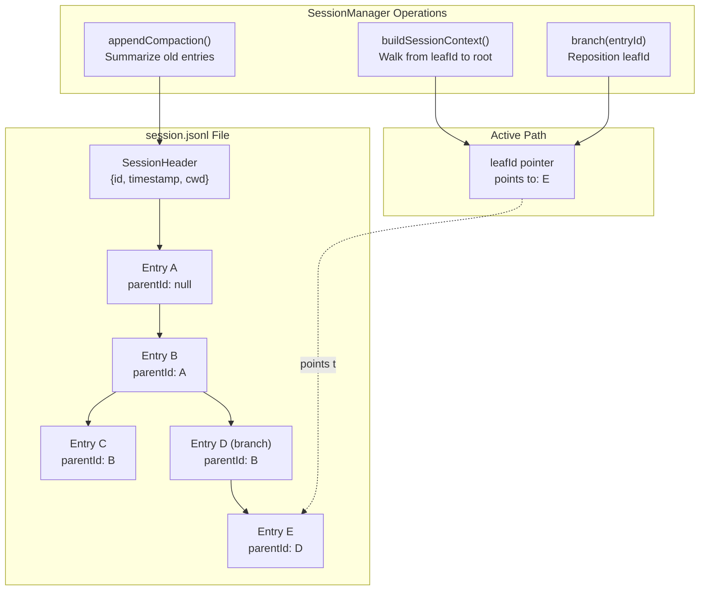
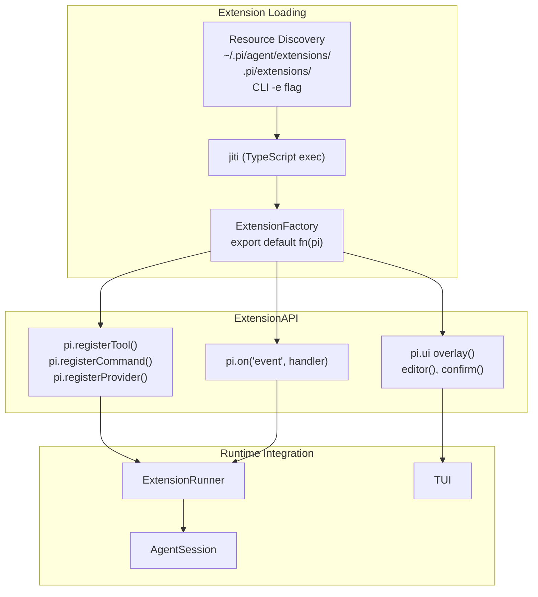
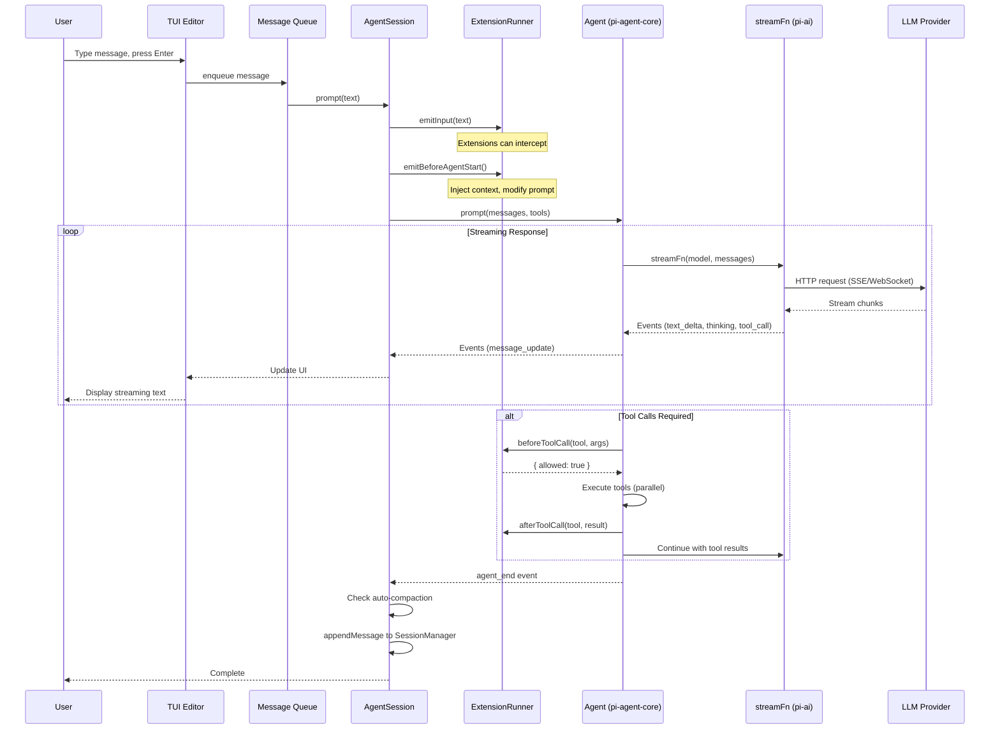

# Overview

<details>
<summary>Relevant source files</summary>

The following files were used as context for generating this wiki page:

- [package-lock.json](package-lock.json)
- [packages/agent/CHANGELOG.md](packages/agent/CHANGELOG.md)
- [packages/agent/package.json](packages/agent/package.json)
- [packages/ai/CHANGELOG.md](packages/ai/CHANGELOG.md)
- [packages/ai/package.json](packages/ai/package.json)
- [packages/coding-agent/CHANGELOG.md](packages/coding-agent/CHANGELOG.md)
- [packages/coding-agent/package.json](packages/coding-agent/package.json)
- [packages/mom/CHANGELOG.md](packages/mom/CHANGELOG.md)
- [packages/mom/package.json](packages/mom/package.json)
- [packages/pods/package.json](packages/pods/package.json)
- [packages/tui/CHANGELOG.md](packages/tui/CHANGELOG.md)
- [packages/tui/package.json](packages/tui/package.json)
- [packages/web-ui/CHANGELOG.md](packages/web-ui/CHANGELOG.md)
- [packages/web-ui/example/package.json](packages/web-ui/example/package.json)
- [packages/web-ui/package.json](packages/web-ui/package.json)

</details>

Pi-mono is a monorepo containing a complete coding agent system. The primary artifact is `pi`, a command-line tool that orchestrates LLM-powered conversations with access to filesystem operations, shell execution, and code editing capabilities. The system provides multiple interfaces (CLI, web, Slack) built on shared abstractions for LLM communication, terminal rendering, and agent lifecycle management.

This page provides a high-level introduction to the repository's architecture, package structure, and core concepts. For detailed information about specific subsystems:

- For the CLI and its features, see [pi-coding-agent: Coding Agent CLI](#4)
- For LLM provider abstraction, see [pi-ai: LLM API Library](#2)
- For terminal rendering, see [pi-tui: Terminal UI Library](#5)
- For the agent framework, see [pi-agent-core: Agent Framework](#3)

## What is a Coding Agent?

A coding agent is an LLM-powered assistant with access to tools that manipulate files and execute commands. The `pi` agent provides:

- **File Operations**: Read, write, and edit files with syntax-aware transformations
- **Shell Execution**: Run bash commands and capture output
- **Session Management**: Persistent conversation trees with branching and compaction
- **Extension System**: Custom tools, commands, and UI components
- **Multi-Provider Support**: Unified API for 15+ LLM providers (OpenAI, Anthropic, Google, etc.)

The agent maintains conversational context, automatically manages token limits through compaction, and supports complex workflows through tool chaining.

## Monorepo Package Structure



**Sources:** [packages/coding-agent/package.json:1-100](), [packages/ai/package.json:1-81](), [packages/tui/package.json:1-53](), [packages/agent/package.json:1-45](), [packages/web-ui/package.json:1-52](), [packages/mom/package.json:1-55](), [packages/pods/package.json:1-41]()

## Package Roles

| Package          | Purpose                                                             | Key Exports                                                         | Entry Point           |
| ---------------- | ------------------------------------------------------------------- | ------------------------------------------------------------------- | --------------------- |
| **coding-agent** | Main CLI application with session management, tools, and extensions | `AgentSession`, `SessionManager`, `SettingsManager`, `ExtensionAPI` | `pi` CLI command      |
| **ai**           | Unified LLM API abstraction for 15+ providers                       | `streamFn`, `streamSimple`, `ModelRegistry`, `AuthStorage`          | Library only          |
| **agent-core**   | General-purpose agent framework with tool execution                 | `Agent`, `agentLoop`, `AgentMessage`, `AgentTool`                   | Library only          |
| **tui**          | Terminal UI library with differential rendering                     | `TUI`, `Editor`, `Input`, `SelectList`, `Component`                 | Library only          |
| **web-ui**       | Browser-based chat interface components                             | `AgentInterface`, `ChatPanel`, `ModelSelector`, Web Components      | Library only          |
| **mom**          | Slack bot with per-channel workspaces                               | `SlackBot`, `MomWorkspace`                                          | `mom` CLI command     |
| **pods**         | GPU pod management for vLLM deployments                             | Pod lifecycle management                                            | `pi-pods` CLI command |

**Sources:** [packages/coding-agent/package.json:1-100](), [packages/ai/package.json:1-81](), [packages/agent/package.json:1-45](), [packages/tui/package.json:1-53](), [packages/web-ui/package.json:1-52](), [packages/mom/package.json:1-55](), [packages/pods/package.json:1-41]()

## Primary Entry Points

### Command-Line Interface (CLI)

The `pi` command provides full-featured terminal interaction:

```bash
# Interactive mode with TUI
pi "implement feature X"

# Single-shot execution
pi --print "summarize README.md"

# RPC mode for automation
pi --rpc < commands.jsonl > responses.jsonl
```

The CLI is implemented in [packages/coding-agent/src/cli.ts]() and uses `AgentSession` ([packages/coding-agent/src/modes/interactive/agent-session.ts]()) to orchestrate the agent lifecycle.

### Web Interface

Web components for browser-based chat interfaces:

```typescript
import { AgentInterface, ChatPanel } from '@mariozechner/pi-web-ui'

const agent = new AgentInterface({
  model: 'anthropic/claude-sonnet-4',
  getApiKey: (provider) => apiKeys[provider],
})

const chatPanel = new ChatPanel()
chatPanel.setAgent(agent)
```

**Sources:** [packages/web-ui/src/agent-interface.ts](), [packages/web-ui/src/components/chat-panel.ts]()

### Slack Bot

Per-channel workspaces with skills and events:

```bash
# Start mom with environment variables
export SLACK_APP_TOKEN=xapp-...
export SLACK_BOT_TOKEN=xoxb-...
mom --workspace ./data
```

Mom delegates to `AgentSession` for each channel conversation, persisting to `log.jsonl` and `context.jsonl` files.

**Sources:** [packages/mom/src/main.ts](), [packages/mom/src/slack-bot.ts]()

### Programmatic SDK

Use agent-core for custom applications:

```typescript
import { Agent } from '@mariozechner/pi-agent-core'
import { streamSimple } from '@mariozechner/pi-ai'

const agent = new Agent({
  streamFn: streamSimple,
  model: 'openai/gpt-4o',
  getApiKey: () => process.env.OPENAI_API_KEY,
  tools: [myCustomTool],
})

for await (const event of agent.prompt('Hello')) {
  if (event.type === 'text_delta') {
    process.stdout.write(event.delta)
  }
}
```

**Sources:** [packages/agent/src/agent.ts](), [packages/ai/src/stream.ts]()

## Core Architectural Concepts

### AgentSession: Orchestration Layer



`AgentSession` ([packages/coding-agent/src/modes/interactive/agent-session.ts]()) is the primary orchestrator in the coding-agent package. It:

- Manages the message queue and execution lifecycle
- Integrates extensions through `ExtensionRunner` ([packages/coding-agent/src/core/extensions/extension-runner.ts]())
- Handles automatic compaction when context limits are approached
- Persists conversation state through `SessionManager` ([packages/coding-agent/src/core/sessions/session-manager.ts]())
- Coordinates tool execution with before/after hooks

**Sources:** [packages/coding-agent/src/modes/interactive/agent-session.ts](), [packages/coding-agent/src/core/sessions/session-manager.ts](), [packages/coding-agent/src/core/extensions/extension-runner.ts]()

### LLM Abstraction: Provider-Agnostic Streaming



The `pi-ai` package provides a unified streaming interface:

- `streamFn()` ([packages/ai/src/stream.ts]()) dispatches to provider-specific implementations
- `streamSimple()` ([packages/ai/src/stream.ts]()) adds a unified `reasoning` parameter that maps to provider-specific thinking controls
- `ModelRegistry` ([packages/ai/src/models.ts]()) maintains metadata for ~100+ models with auto-discovery
- All providers return `AssistantMessageEventStream` ([packages/ai/src/types.ts]()) with uniform event types

**Sources:** [packages/ai/src/stream.ts](), [packages/ai/src/models.ts](), [packages/ai/src/types.ts](), [packages/ai/src/providers/openai-completions.ts](), [packages/ai/src/providers/anthropic.ts]()

### Tool Execution Pipeline



Tool execution in `Agent` ([packages/agent/src/agent.ts]()) supports:

- **Parallel execution** by default (configurable via `toolExecution` option)
- **Hook interception** through `beforeToolCall` and `afterToolCall` ([packages/agent/src/agent.ts]())
- **Built-in tools** in coding-agent: `read` ([packages/coding-agent/src/core/tools/read.ts]()), `write` ([packages/coding-agent/src/core/tools/write.ts]()), `edit` ([packages/coding-agent/src/core/tools/edit.ts]()), `bash` ([packages/coding-agent/src/core/tools/bash.ts]())
- **Custom tools** via extensions using `pi.registerTool()` ([packages/coding-agent/src/core/extensions/extension-api.ts]())

**Sources:** [packages/agent/src/agent.ts](), [packages/coding-agent/src/core/tools/read.ts](), [packages/coding-agent/src/core/tools/write.ts](), [packages/coding-agent/src/core/tools/edit.ts](), [packages/coding-agent/src/core/tools/bash.ts]()

### Session Persistence: JSONL Tree Structure

Sessions are stored as append-only JSONL files with a tree structure:



`SessionManager` ([packages/coding-agent/src/core/sessions/session-manager.ts]()) implements:

- **Tree structure**: Each entry has `id` and `parentId`, enabling multiple conversation branches in one file
- **Active path**: `leafId` points to the current conversation endpoint
- **Context building**: `buildSessionContext()` walks from `leafId` to root
- **Branching**: `branch(entryId)` repositions `leafId` to explore alternative paths
- **Compaction**: `appendCompaction()` summarizes old messages to manage context window

**Sources:** [packages/coding-agent/src/core/sessions/session-manager.ts](), [packages/coding-agent/src/core/sessions/types.ts]()

### Extension System: Pluggable Capabilities



Extensions ([packages/coding-agent/docs/extensions.md]()) provide:

- **Custom tools**: Register new capabilities via `pi.registerTool()` ([packages/coding-agent/src/core/extensions/extension-api.ts]())
- **Slash commands**: Add user-invoked commands via `pi.registerCommand()`
- **Event handlers**: Subscribe to lifecycle events via `pi.on()`
- **UI integration**: Create overlays, dialogs, and custom editors
- **Custom providers**: Add new LLM providers via `pi.registerProvider()`

Extensions are loaded by `ExtensionRunner` ([packages/coding-agent/src/core/extensions/extension-runner.ts]()) and execute with isolated contexts (`ExtensionContext` for read-only, `ExtensionCommandContext` for session control).

**Sources:** [packages/coding-agent/src/core/extensions/extension-api.ts](), [packages/coding-agent/src/core/extensions/extension-runner.ts](), [packages/coding-agent/src/core/extensions/types.ts]()

## Request Flow: User Input to LLM Response



The complete request flow:

1. **User input**: Captured by `Editor` component ([packages/tui/src/components/editor.ts]())
2. **Queue processing**: Managed by `AgentSession._messageQueue` ([packages/coding-agent/src/modes/interactive/agent-session.ts]())
3. **Extension hooks**: `emitInput()` and `emitBeforeAgentStart()` allow modification
4. **Agent execution**: `Agent.prompt()` ([packages/agent/src/agent.ts]()) orchestrates the LLM loop
5. **Streaming**: `streamFn()` ([packages/ai/src/stream.ts]()) dispatches to provider
6. **Tool execution**: Parallel by default, with extension hooks
7. **Persistence**: `SessionManager.appendMessage()` ([packages/coding-agent/src/core/sessions/session-manager.ts]()) writes to JSONL
8. **Compaction**: Automatic when context usage exceeds threshold

**Sources:** [packages/tui/src/components/editor.ts](), [packages/coding-agent/src/modes/interactive/agent-session.ts](), [packages/agent/src/agent.ts](), [packages/ai/src/stream.ts](), [packages/coding-agent/src/core/sessions/session-manager.ts]()

## Operational Modes

The coding-agent supports three distinct operational modes:

| Mode            | Entry Point    | Use Case                       | UI                                  | Session Management                      |
| --------------- | -------------- | ------------------------------ | ----------------------------------- | --------------------------------------- |
| **Interactive** | `pi` (default) | Full-featured development      | TUI with editor, overlays, commands | Full persistence, branching, compaction |
| **Print**       | `pi --print`   | Shell pipelines, scripts       | Minimal stdout                      | Read-only or ephemeral                  |
| **RPC**         | `pi --rpc`     | Headless automation, embedding | JSON-RPC protocol (stdio)           | Full persistence, programmatic control  |

**Interactive Mode** ([packages/coding-agent/src/modes/interactive/interactive.ts]()) provides:

- Multi-line editor with autocomplete
- Slash commands (e.g., `/tree`, `/settings`, `/model`)
- Session selector and navigation
- Extension UI integration (overlays, dialogs)

**Print Mode** ([packages/coding-agent/src/modes/print/print.ts]()) provides:

- Single-shot execution
- Pipe-friendly output
- No interactive prompts
- Suitable for scripts: `pi --print "summarize *.md" > summary.txt`

**RPC Mode** ([packages/coding-agent/src/modes/rpc/rpc.ts]()) provides:

- LF-delimited JSONL protocol over stdio
- Commands: `prompt`, `continue`, `abort`, `list_sessions`, etc.
- Responses: Events stream from agent execution
- Enables embedding in non-Node.js environments

**Sources:** [packages/coding-agent/src/modes/interactive/interactive.ts](), [packages/coding-agent/src/modes/print/print.ts](), [packages/coding-agent/src/modes/rpc/rpc.ts]()

## Development Workflow

The monorepo uses npm workspaces:

```bash
# Install dependencies
npm install

# Build all packages
npm run build

# Watch mode (rebuilds on change)
npm run dev

# Run CLI from source
npx --workspace=@mariozechner/pi-coding-agent pi "your prompt"

# Run tests
npm test
```

Package build order matters due to dependencies. The typical order:

1. `pi-tui` (no dependencies on other workspace packages)
2. `pi-ai` (no dependencies on other workspace packages)
3. `pi-agent-core` (depends on `pi-ai`)
4. `pi-coding-agent` (depends on all three above)
5. `pi-web-ui`, `pi-mom`, `pi-pods` (depend on various combinations)

**Sources:** [package.json:1-36](), [packages/coding-agent/package.json:31-40](), [packages/ai/package.json:31-39]()

## Configuration and Settings

Settings are managed by `SettingsManager` ([packages/coding-agent/src/core/settings/settings-manager.ts]()) with two scopes:

- **Global**: `~/.pi/agent/settings.json` (user defaults)
- **Project**: `.pi/settings.json` in current directory (project-specific overrides)

Key settings:

- `model`: Default LLM model reference (e.g., `"anthropic/claude-sonnet-4"`)
- `thinkingLevel`: Default reasoning effort (`"off"`, `"low"`, `"medium"`, `"high"`, `"xhigh"`)
- `packages`: Extension, skill, prompt, and theme package sources
- `autoCompaction`: Threshold and behavior for automatic context compression

Settings can be modified via:

- `/settings` command in interactive mode
- `pi config` command
- Direct JSON editing

**Sources:** [packages/coding-agent/src/core/settings/settings-manager.ts](), [packages/coding-agent/src/core/settings/types.ts]()
