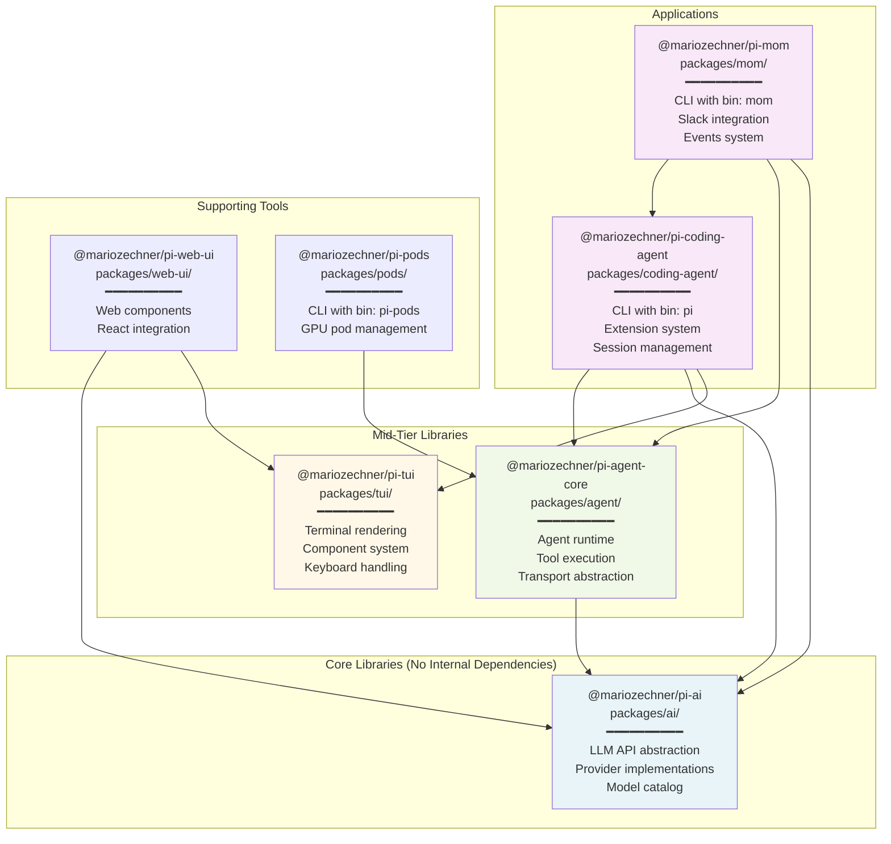
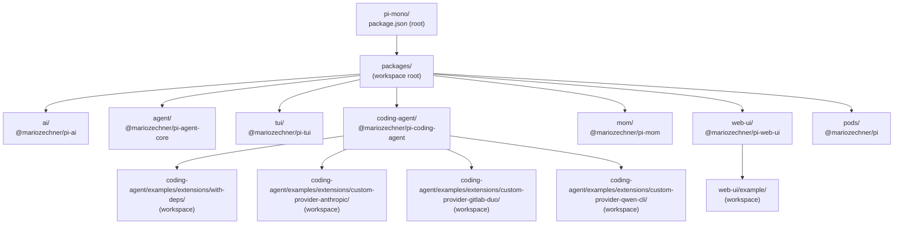
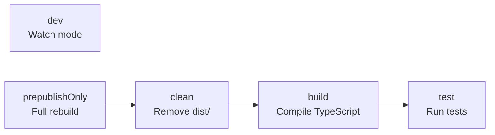

# Monorepo Structure

<details>
<summary>Relevant source files</summary>

The following files were used as context for generating this wiki page:

- [package-lock.json](package-lock.json)
- [packages/agent/CHANGELOG.md](packages/agent/CHANGELOG.md)
- [packages/agent/package.json](packages/agent/package.json)
- [packages/ai/CHANGELOG.md](packages/ai/CHANGELOG.md)
- [packages/ai/package.json](packages/ai/package.json)
- [packages/coding-agent/CHANGELOG.md](packages/coding-agent/CHANGELOG.md)
- [packages/coding-agent/package.json](packages/coding-agent/package.json)
- [packages/mom/CHANGELOG.md](packages/mom/CHANGELOG.md)
- [packages/mom/package.json](packages/mom/package.json)
- [packages/pods/package.json](packages/pods/package.json)
- [packages/tui/CHANGELOG.md](packages/tui/CHANGELOG.md)
- [packages/tui/package.json](packages/tui/package.json)
- [packages/web-ui/CHANGELOG.md](packages/web-ui/CHANGELOG.md)
- [packages/web-ui/example/package.json](packages/web-ui/example/package.json)
- [packages/web-ui/package.json](packages/web-ui/package.json)

</details>

The pi-mono repository uses a monorepo architecture to manage seven interrelated packages that share common tooling, versioning, and development workflow. This document describes the package organization, dependency relationships, and workspace configuration. For information about the development workflow and contribution process, see [Development & Contributing](#9).

## Package Overview

The monorepo contains seven published packages organized into three tiers:

| Package                  | NPM Name                        | Version | Purpose                                                                                    | Entry Point                                |
| ------------------------ | ------------------------------- | ------- | ------------------------------------------------------------------------------------------ | ------------------------------------------ |
| **Core Libraries**       |
| pi-ai                    | `@mariozechner/pi-ai`           | 0.57.0  | Unified multi-provider LLM API with streaming, tool calling, and cross-provider handoffs   | [packages/ai/package.json:2-3]()           |
| pi-agent-core            | `@mariozechner/pi-agent-core`   | 0.57.0  | General-purpose agent runtime with transport abstraction and state management              | [packages/agent/package.json:2-3]()        |
| pi-tui                   | `@mariozechner/pi-tui`          | 0.57.0  | Terminal UI library with differential rendering and component architecture                 | [packages/tui/package.json:2-3]()          |
| **Primary Applications** |
| pi-coding-agent          | `@mariozechner/pi-coding-agent` | 0.57.0  | Interactive coding agent CLI with extension system, session management, and built-in tools | [packages/coding-agent/package.json:2-3]() |
| pi-mom                   | `@mariozechner/pi-mom`          | 0.57.0  | Self-managing Slack bot that delegates to coding-agent infrastructure                      | [packages/mom/package.json:2-3]()          |
| **Supporting Tools**     |
| pi-web-ui                | `@mariozechner/pi-web-ui`       | 0.57.0  | Reusable web components for browser-based AI chat interfaces                               | [packages/web-ui/package.json:2-3]()       |
| pi-pods                  | `@mariozechner/pi`              | 0.57.0  | CLI tool for managing vLLM deployments on GPU pods                                         | [packages/pods/package.json:2-3]()         |

**Sources:** [packages/coding-agent/package.json:1-99](), [packages/ai/package.json:1-80](), [packages/tui/package.json:1-52](), [packages/agent/package.json:1-44](), [packages/mom/package.json:1-54](), [packages/web-ui/package.json:1-51](), [packages/pods/package.json:1-40]()

## Package Dependency Architecture



**Dependency Analysis:**

The architecture follows a clean three-tier hierarchy:

1. **Foundation Tier (`pi-ai`)**: Zero internal dependencies. All other packages depend on this directly or transitively for LLM integration.

2. **Infrastructure Tier (`pi-agent-core`, `pi-tui`)**: Single dependency on `pi-ai` (agent-core) or standalone (tui). These provide reusable infrastructure for building applications.

3. **Application Tier (`pi-coding-agent`, `pi-mom`, `pi-web-ui`, `pi-pods`)**: Integrate multiple lower-tier packages to deliver end-user functionality.

The `pi-coding-agent` package is the most complex, depending on all three core libraries:

- [packages/coding-agent/package.json:43-45]() shows dependencies on `pi-agent-core`, `pi-ai`, and `pi-tui`

The `pi-mom` package achieves feature parity by reusing `pi-coding-agent` as a dependency:

- [packages/mom/package.json:22-25]() imports `pi-coding-agent`, `pi-agent-core`, and `pi-ai`

**Sources:** [packages/coding-agent/package.json:41-61](), [packages/agent/package.json:19-21](), [packages/mom/package.json:21-32](), [packages/web-ui/package.json:19-29](), [packages/pods/package.json:35-38]()

## Directory Structure and Workspace Configuration



**Workspace Configuration:**

The root `package.json` defines npm workspaces that enable shared dependency resolution and hoisted installation:

```
workspaces:
  - packages/*                                              (primary packages)
  - packages/web-ui/example                                 (web-ui demo)
  - packages/coding-agent/examples/extensions/with-deps     (extension example)
  - packages/coding-agent/examples/extensions/custom-provider-anthropic
  - packages/coding-agent/examples/extensions/custom-provider-gitlab-duo
  - packages/coding-agent/examples/extensions/custom-provider-qwen-cli
```

This configuration is defined at [package-lock.json:10-16]() and enables:

- Shared `node_modules` at the repository root
- Cross-package symbolic linking for local development
- Unified dependency resolution across all workspaces
- Single `package-lock.json` for the entire repository

**Binary Entry Points:**

Each application package provides a CLI binary:

| Package         | Binary Name | Script Path                                                  |
| --------------- | ----------- | ------------------------------------------------------------ |
| pi-ai           | `pi-ai`     | `dist/cli.js` ([packages/ai/package.json:22-24]())           |
| pi-coding-agent | `pi`        | `dist/cli.js` ([packages/coding-agent/package.json:10-12]()) |
| pi-mom          | `mom`       | `dist/main.js` ([packages/mom/package.json:6-8]())           |
| pi-pods         | `pi-pods`   | `dist/cli.js` ([packages/pods/package.json:6-8]())           |

**Sources:** [package-lock.json:1-36](), [packages/coding-agent/package.json:10-12](), [packages/ai/package.json:22-24](), [packages/mom/package.json:6-8](), [packages/pods/package.json:6-8]()

## Module Export Patterns

Packages expose multiple entry points for different use cases:

### pi-coding-agent Export Map

```json
exports: {
  ".": {
    types: "./dist/index.d.ts",
    import: "./dist/index.js"
  },
  "./hooks": {
    types: "./dist/core/hooks/index.d.ts",
    import: "./dist/core/hooks/index.js"
  }
}
```

This allows consumers to import the extension hooks API separately:

```typescript
import { SessionManager } from '@mariozechner/pi-coding-agent'
import type { BeforeAgentStartHook } from '@mariozechner/pi-coding-agent/hooks'
```

**Source:** [packages/coding-agent/package.json:15-24]()

### pi-ai Export Map

```json
exports: {
  ".": { ... },
  "./oauth": {
    types: "./dist/oauth.d.ts",
    import: "./dist/oauth.js"
  },
  "./bedrock-provider": {
    types: "./bedrock-provider.d.ts",
    import: "./bedrock-provider.js"
  }
}
```

The OAuth module is separated because it imports large libraries (Express, Anthropic SDK) that shouldn't be bundled in lightweight API calls. The Bedrock provider is optional to avoid forcing AWS SDK dependencies on users who don't need it.

**Source:** [packages/ai/package.json:8-21]()

## Versioning Strategy

All packages use **lockstep versioning** with synchronized version numbers:

```
Current version: 0.57.0 across all packages
```

This strategy simplifies:

- **Cross-package compatibility**: Any two packages with the same version are guaranteed to work together
- **Release coordination**: All packages are published together, maintaining consistency
- **Dependency management**: No need to track compatibility matrices between package versions
- **Changelog tracking**: Single version number corresponds to a unified set of changes

The version is updated atomically across all packages during the release process (see [Release Process](#9.4) for details).

**Version Evidence:**

- [packages/coding-agent/package.json:3]() - `"version": "0.57.0"`
- [packages/ai/package.json:3]() - `"version": "0.57.0"`
- [packages/tui/package.json:3]() - `"version": "0.57.0"`
- [packages/agent/package.json:3]() - `"version": "0.57.0"`
- [packages/mom/package.json:3]() - `"version": "0.57.0"`
- [packages/web-ui/package.json:3]() - `"version": "0.57.0"`
- [packages/pods/package.json:3]() - `"version": "0.57.0"`

**Sources:** [packages/coding-agent/package.json:1-99](), [packages/ai/package.json:1-80](), [packages/tui/package.json:1-52](), [packages/agent/package.json:1-44](), [packages/mom/package.json:1-54](), [packages/web-ui/package.json:1-51](), [packages/pods/package.json:1-40]()

## Build System and Development Workflow

### Shared Tooling

The monorepo uses shared development dependencies at the root level:

| Tool             | Purpose                       | Configuration            |
| ---------------- | ----------------------------- | ------------------------ |
| `@biomejs/biome` | Linting and formatting        | [package-lock.json:24]() |
| `typescript`     | Type checking and compilation | [package-lock.json:31]() |
| `concurrently`   | Parallel script execution     | [package-lock.json:27]() |
| `tsx`            | TypeScript execution          | [package-lock.json:30]() |
| `husky`          | Git hooks                     | [package-lock.json:28]() |

### Build Commands by Package

Each package defines standard npm scripts:



**Common Script Patterns:**

1. **Core libraries** (ai, agent-core, tui):

   ```
   clean:  shx rm -rf dist
   build:  tsgo -p tsconfig.build.json
   dev:    tsgo -p tsconfig.build.json --watch --preserveWatchOutput
   ```

2. **Applications with assets** (coding-agent):

   ```
   build: tsgo -p tsconfig.build.json &&
          shx chmod +x dist/cli.js &&
          npm run copy-assets
   ```

   [packages/coding-agent/package.json:34]() shows asset copying for themes and export templates

3. **Web UI** (web-ui):
   ```
   build: tsgo -p tsconfig.build.json &&
          tailwindcss -i ./src/app.css -o ./dist/app.css --minify
   dev:   concurrently (TypeScript + Tailwind + example dev server)
   ```
   [packages/web-ui/package.json:13-15]() demonstrates multi-process development

**Sources:** [packages/coding-agent/package.json:31-39](), [packages/ai/package.json:32-38](), [packages/tui/package.json:7-12](), [packages/agent/package.json:13-17](), [packages/web-ui/package.json:12-17]()

## Node Engine Requirements

All packages enforce a minimum Node.js version:

```
Node.js >= 20.0.0
```

Specific requirements:

- Most packages: `"node": ">=20.0.0"` ([packages/ai/package.json:72-74]())
- pi-coding-agent: `"node": ">=20.6.0"` ([packages/coding-agent/package.json:96-98]()) - requires newer version for enhanced features

This ensures access to modern Node.js features including:

- Native `fetch` API
- Top-level `await`
- Enhanced error stack traces
- Native test runner (`node --test`)

**Sources:** [packages/coding-agent/package.json:96-98](), [packages/ai/package.json:72-74](), [packages/tui/package.json:34-36](), [packages/agent/package.json:36-38](), [packages/mom/package.json:51-53](), [packages/pods/package.json:32-34]()
