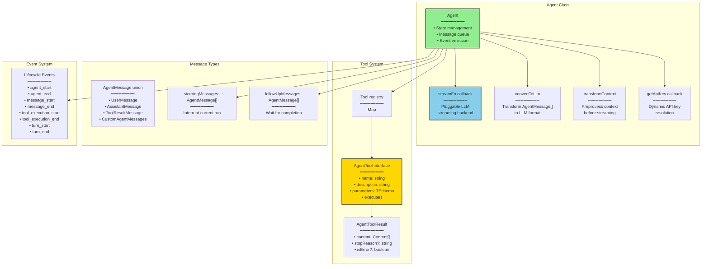
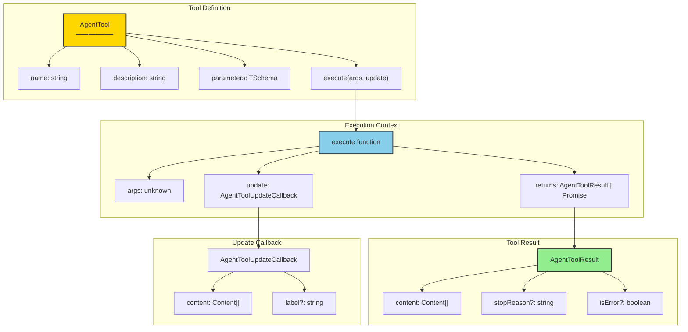
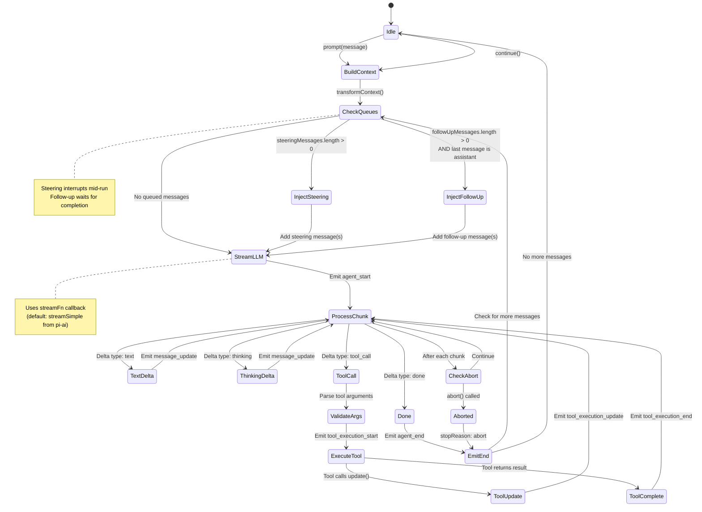
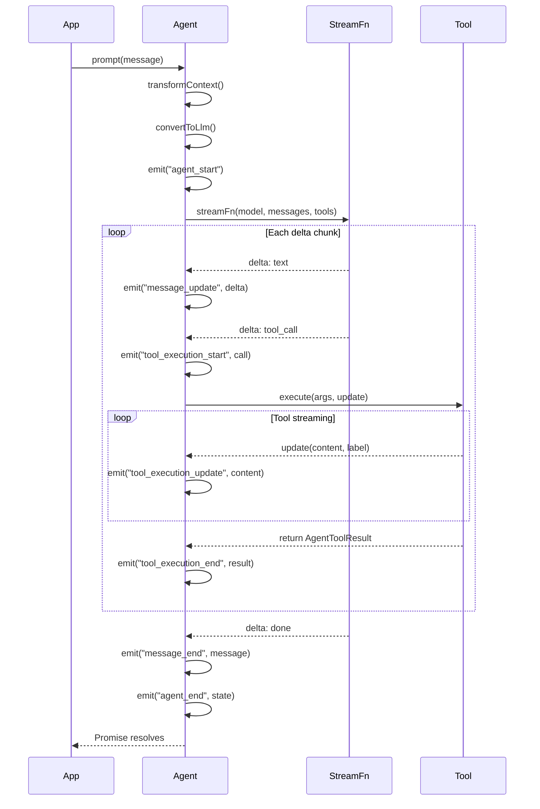

# pi-agent-core: Agent Framework

<details>
<summary>Relevant source files</summary>

The following files were used as context for generating this wiki page:

- [package-lock.json](package-lock.json)
- [packages/agent/CHANGELOG.md](packages/agent/CHANGELOG.md)
- [packages/agent/package.json](packages/agent/package.json)
- [packages/ai/CHANGELOG.md](packages/ai/CHANGELOG.md)
- [packages/ai/package.json](packages/ai/package.json)
- [packages/coding-agent/CHANGELOG.md](packages/coding-agent/CHANGELOG.md)
- [packages/coding-agent/package.json](packages/coding-agent/package.json)
- [packages/mom/CHANGELOG.md](packages/mom/CHANGELOG.md)
- [packages/mom/package.json](packages/mom/package.json)
- [packages/pods/package.json](packages/pods/package.json)
- [packages/tui/CHANGELOG.md](packages/tui/CHANGELOG.md)
- [packages/tui/package.json](packages/tui/package.json)
- [packages/web-ui/CHANGELOG.md](packages/web-ui/CHANGELOG.md)
- [packages/web-ui/example/package.json](packages/web-ui/example/package.json)
- [packages/web-ui/package.json](packages/web-ui/package.json)

</details>

The `@mariozechner/pi-agent-core` package provides a general-purpose agent runtime framework for building LLM-powered applications. It sits between the LLM API layer ([pi-ai](#2)) and application-specific implementations (like [pi-coding-agent](#4) and [pi-mom](#8)), providing a reusable foundation for tool execution, state management, and message handling.

This page documents the core agent runtime, its architecture, and low-level APIs. For information about how the coding agent extends this framework with sessions, extensions, and interactive features, see [pi-coding-agent: Coding Agent CLI](#4).

## Package Overview

**Package name**: `@mariozechner/pi-agent-core`

**Key responsibilities**:

- Execute tools requested by the LLM during conversation turns
- Manage conversation state and message history
- Handle streaming responses from LLM providers via [pi-ai](#2)
- Provide abort control for canceling ongoing operations
- Queue and deliver steering/follow-up messages during agent runs
- Abstract the streaming implementation via `streamFn` callback
- Emit lifecycle events for monitoring and extension integration

**Dependencies**: `@mariozechner/pi-ai` (for LLM streaming and model definitions)

**Primary consumers**: [pi-coding-agent](#4), [pi-mom](#8), [pi-pods](#7), and custom agent implementations

Sources: [packages/agent/package.json:1-44]()

## Core Architecture



The `Agent` class is the central runtime that orchestrates LLM interactions. It does not depend on any specific LLM provider implementation—instead, it accepts a `streamFn` callback that handles the actual streaming request. By default, this uses `streamSimple` from `@mariozechner/pi-ai`, but applications can provide custom implementations for proxying, testing, or custom protocols.

Sources: [packages/agent/CHANGELOG.md:231-265](), [packages/web-ui/CHANGELOG.md:206-288]()

## Agent Class and Configuration

### Agent Constructor

```typescript
class Agent<TState = any> {
  constructor(options?: AgentOptions<TState>)
}
```

The `Agent` class is parameterized by a state type `TState` that applications can use to attach custom metadata. All constructor options are optional with sensible defaults.

### AgentOptions Interface

| Option             | Type                                          | Default                   | Purpose                              |
| ------------------ | --------------------------------------------- | ------------------------- | ------------------------------------ |
| `streamFn`         | `StreamFn`                                    | `streamSimple` from pi-ai | Function to call LLM provider        |
| `getApiKey`        | `(provider: string) => string \| undefined`   | `undefined`               | Dynamic API key resolution           |
| `convertToLlm`     | `(messages: AgentMessage[]) => Message[]`     | Identity transform        | Convert app messages to LLM format   |
| `transformContext` | `(context: AgentMessage[]) => AgentMessage[]` | Identity transform        | Preprocess context before streaming  |
| `steeringMode`     | `"one-at-a-time" \| "all-at-once"`            | `"one-at-a-time"`         | Steering message delivery mode       |
| `followUpMode`     | `"one-at-a-time" \| "all-at-once"`            | `"one-at-a-time"`         | Follow-up message delivery mode      |
| `thinkingBudgets`  | `Partial<Record<ThinkingLevel, number>>`      | Provider defaults         | Token budgets per thinking level     |
| `sessionId`        | `string`                                      | `undefined`               | Session ID for provider caching      |
| `maxRetryDelayMs`  | `number`                                      | `60000`                   | Cap on server-requested retry delays |
| `transport`        | `"sse" \| "websocket" \| "auto"`              | `"auto"`                  | Stream transport preference          |

Sources: [packages/agent/CHANGELOG.md:231-265](), [packages/agent/CHANGELOG.md:38-40](), [packages/agent/CHANGELOG.md:87-89](), [packages/agent/CHANGELOG.md:163-165](), [packages/agent/CHANGELOG.md:179-181]()

### Core Agent Methods

```typescript
class Agent<TState = any> {
  // Primary interaction methods
  prompt(message: string | AgentMessage, options?: PromptOptions): Promise<void>
  continue(): Promise<void>
  abort(): void

  // Message queueing
  steer(message: AgentMessage): void
  followUp(message: AgentMessage): void
  clearSteeringQueue(): void
  clearFollowUpQueue(): void
  clearAllQueues(): void

  // Tool management
  registerTool(tool: AgentTool): void
  unregisterTool(name: string): void

  // State access
  getState(): TState
  setState(state: TState): void
  getContext(): AgentMessage[]

  // Event subscription
  on(event: string, handler: Function): void
  off(event: string, handler: Function): void
}
```

**Key behavioral constraints**:

- `prompt()` and `continue()` throw if the agent is already streaming (prevents race conditions)
- `steer()` and `followUp()` are synchronous and safe to call during streaming
- `abort()` cancels the current streaming request immediately

Sources: [packages/agent/CHANGELOG.md:214-228](), [packages/agent/CHANGELOG.md:227-228]()

## Tool Execution System



### AgentTool Interface

Tools are registered with the agent and made available to the LLM. When the LLM requests a tool execution, the agent validates the arguments against the tool's schema and calls the `execute` function.

```typescript
interface AgentTool {
  name: string // Tool identifier (used in tool calls)
  description: string // Shown to LLM to explain purpose
  parameters: TSchema // TypeBox schema for argument validation
  execute: (
    args: unknown, // Parsed and validated arguments
    update: AgentToolUpdateCallback // Streaming update callback
  ) => AgentToolResult | Promise<AgentToolResult>
}
```

### AgentToolUpdateCallback

Tools can stream incremental updates during execution by calling the `update` callback. This enables real-time progress indication in UIs.

```typescript
type AgentToolUpdateCallback = (
  content: Content[], // Incremental content blocks
  label?: string // Optional status label
) => void
```

### AgentToolResult

The return value from tool execution. The `content` array contains the result to send back to the LLM.

```typescript
interface AgentToolResult {
  content: Content[] // Result content (text, images, etc.)
  stopReason?: 'abort' | 'max_turns' // Terminate agent loop
  isError?: boolean // Mark as error (for logging/UI)
}
```

**Content types** (from `@mariozechner/pi-ai`):

- `TextContent`: `{ type: "text", text: string }`
- `ImageContent`: `{ type: "image", data: string, mimeType?: string }`
- `ThinkingContent`: `{ type: "thinking", thinking: string }`

Sources: [packages/agent/CHANGELOG.md:260-261]()

## Message Flow and Agent Loop



### Agent Loop States

The agent loop progresses through these states during each interaction:

1. **Idle**: Waiting for `prompt()` or `continue()` call
2. **BuildContext**: Apply `transformContext()` to current message history
3. **CheckQueues**: Inject steering or follow-up messages if queued
4. **StreamLLM**: Call `streamFn` with converted messages
5. **ProcessChunk**: Handle streaming deltas (text, thinking, tool calls)
6. **ExecuteTool**: Validate and execute tool when requested by LLM
7. **Done**: LLM finished, emit `agent_end`, check for more queued messages

### Steering vs Follow-Up Messages

The agent supports two types of message queueing with different delivery semantics:

| Method              | Delivery Timing                                                         | Use Case                            |
| ------------------- | ----------------------------------------------------------------------- | ----------------------------------- |
| `steer(message)`    | Delivered after current tool execution completes, skips remaining tools | Interrupt agent to change direction |
| `followUp(message)` | Delivered only when agent finishes (no more tool calls)                 | Queue messages without interrupting |

**Delivery modes**:

- `"one-at-a-time"`: Deliver one message, wait for agent to finish, repeat
- `"all-at-once"`: Deliver all queued messages in a single batch

Sources: [packages/agent/CHANGELOG.md:214-228](), [packages/agent/CHANGELOG.md:51-53]()

## Lifecycle Events



### Event Types

| Event                   | Payload                                  | When Emitted                           |
| ----------------------- | ---------------------------------------- | -------------------------------------- |
| `agent_start`           | `{ model: Model }`                       | Before streaming begins                |
| `agent_end`             | `{ stopReason?: string, usage?: Usage }` | After streaming completes or aborts    |
| `message_start`         | `{ role: "assistant" }`                  | LLM starts generating response         |
| `message_update`        | `{ delta: ContentDelta }`                | Each text/thinking chunk received      |
| `message_end`           | `{ message: AssistantMessage }`          | LLM finishes generating response       |
| `tool_execution_start`  | `{ toolName: string, args: unknown }`    | Before tool execute() is called        |
| `tool_execution_update` | `{ content: Content[], label?: string }` | Tool calls update() callback           |
| `tool_execution_end`    | `{ result: AgentToolResult }`            | After tool execute() completes         |
| `turn_start`            | `{}`                                     | Start of LLM turn (before agent_start) |
| `turn_end`              | `{}`                                     | End of LLM turn (after agent_end)      |

**Event subscription**:

```typescript
agent.on('tool_execution_start', ({ toolName, args }) => {
  console.log(`Executing ${toolName} with args:`, args)
})
```

Sources: [packages/web-ui/CHANGELOG.md:219-220]()

## Low-Level Agent Loop API

For advanced use cases that need fine-grained control without the `Agent` class wrapper, `pi-agent-core` exports low-level functions that implement the core loop logic.

### agentLoop Function

```typescript
async function agentLoop<TState = any>(
  config: AgentLoopConfig<TState>
): Promise<void>
```

Runs a single agent loop iteration: streams from LLM, executes tools, handles queued messages.

### AgentLoopConfig Interface

```typescript
interface AgentLoopConfig<TState = any> {
  // LLM streaming
  model: Model
  streamFn: StreamFn
  getApiKey?: (provider: string) => string | undefined

  // Message context
  getContext: () => AgentMessage[]
  appendMessage: (message: AgentMessage) => void

  // Message transformation
  convertToLlm?: (messages: AgentMessage[]) => Message[]
  transformContext?: (messages: AgentMessage[]) => AgentMessage[]

  // Message queues
  getSteeringMessages: () => AgentMessage[]
  getFollowUpMessages: () => AgentMessage[]
  clearSteeringQueue: () => void
  clearFollowUpQueue: () => void
  steeringMode: 'one-at-a-time' | 'all-at-once'
  followUpMode: 'one-at-a-time' | 'all-at-once'

  // Tool execution
  tools: Map<string, AgentTool>
  onToolExecutionUpdate?: (content: Content[], label?: string) => void

  // Lifecycle callbacks
  onAgentStart?: (model: Model) => void
  onAgentEnd?: (stopReason?: string, usage?: Usage) => void
  onMessageStart?: (role: 'assistant') => void
  onMessageUpdate?: (delta: ContentDelta) => void
  onMessageEnd?: (message: AssistantMessage) => void
  onToolExecutionStart?: (toolName: string, args: unknown) => void
  onToolExecutionEnd?: (result: AgentToolResult) => void
  onTurnStart?: () => void
  onTurnEnd?: () => void

  // Abort control
  abortSignal?: AbortSignal

  // State
  state?: TState

  // Options forwarded to streamFn
  thinkingBudgets?: Partial<Record<ThinkingLevel, number>>
  sessionId?: string
  maxRetryDelayMs?: number
  transport?: 'sse' | 'websocket' | 'auto'
}
```

### agentLoopContinue Function

```typescript
async function agentLoopContinue<TState = any>(
  config: AgentLoopConfig<TState>
): Promise<void>
```

Continues the agent loop when the last message is from the assistant and there are queued messages to deliver. Used internally by `Agent.continue()`.

**Use case**: Custom agent implementations that need direct control over the loop logic without the `Agent` class abstraction.

Sources: [packages/agent/CHANGELOG.md:249-265]()

## Integration with pi-ai

The agent core package depends on `@mariozechner/pi-ai` for LLM streaming and model definitions. The default `streamFn` is `streamSimple` from pi-ai, which provides a unified interface across multiple providers.

### Default StreamFn Behavior

```typescript
// Default streamFn implementation (simplified)
const defaultStreamFn: StreamFn = async (model, messages, tools, options) => {
  return streamSimple({
    model,
    messages,
    tools,
    thinkingLevel: options.thinkingLevel,
    systemPrompt: options.systemPrompt,
    signal: options.signal,
    thinkingBudgets: options.thinkingBudgets,
    sessionId: options.sessionId,
    maxRetryDelayMs: options.maxRetryDelayMs,
    transport: options.transport,
  })
}
```

### Custom StreamFn Example

Applications can provide custom `streamFn` implementations for:

- **Proxying**: Route requests through a backend server (e.g., for API key security)
- **Testing**: Mock LLM responses without hitting real APIs
- **Logging**: Intercept and log all requests/responses
- **Custom protocols**: Implement non-standard streaming protocols

```typescript
// Example: Proxy through backend
const proxyStreamFn: StreamFn = async (model, messages, tools, options) => {
  const response = await fetch('/api/llm/stream', {
    method: 'POST',
    body: JSON.stringify({ model, messages, tools, options }),
  })

  return response.body // Return streaming response
}

const agent = new Agent({
  streamFn: proxyStreamFn,
})
```

Sources: [packages/agent/CHANGELOG.md:231-265](), [packages/web-ui/CHANGELOG.md:225-235]()

## State Management

The `Agent` class is parameterized by a state type `TState` that applications can use to attach custom metadata. This state is accessible via `getState()` and `setState()` and is passed to lifecycle callbacks in `AgentLoopConfig`.

### State Usage Example

```typescript
interface MyAgentState {
  sessionId: string
  userId: string
  metadata: Record<string, unknown>
}

const agent = new Agent<MyAgentState>({
  // ... other options
})

agent.setState({
  sessionId: 'abc123',
  userId: 'user456',
  metadata: { workspace: '/tmp/session' },
})

agent.on('agent_end', () => {
  const state = agent.getState()
  console.log('Session ended:', state.sessionId)
})
```

**Context access**:

- `getContext()`: Returns the current message history as `AgentMessage[]`
- The context is maintained internally and updated after each tool execution

Sources: [packages/agent/CHANGELOG.md:231-265]()

## Message Types and Custom Messages

The core message types are:

```typescript
type AgentMessage =
  | UserMessage
  | AssistantMessage
  | ToolResultMessage
  | CustomAgentMessages[keyof CustomAgentMessages]
```

Applications can extend the message union by declaring custom message types:

```typescript
// In application code
declare module '@mariozechner/pi-agent-core' {
  interface CustomAgentMessages {
    system: SystemMessage
    artifact: ArtifactMessage
  }
}

interface SystemMessage {
  role: 'system'
  content: string
}
```

The `convertToLlm` callback is responsible for transforming these custom messages into the standard LLM format before streaming.

Sources: [packages/agent/CHANGELOG.md:241-246](), [packages/web-ui/CHANGELOG.md:211-214]()

## Summary

`pi-agent-core` provides the foundational runtime for LLM-powered agents in the pi-mono ecosystem. It abstracts tool execution, message queuing, state management, and streaming into a reusable framework that multiple applications build upon.

**Key abstractions**:

- `Agent` class for high-level agent interactions
- `AgentTool` interface for defining executable tools
- `streamFn` callback for pluggable LLM backends
- `steer()` and `followUp()` for message queueing
- Lifecycle events for monitoring and extensions
- Low-level `agentLoop()` functions for custom implementations

**Consumers**: [pi-coding-agent](#4), [pi-mom](#8), [pi-pods](#7), [pi-web-ui](#6)

**Dependencies**: [pi-ai](#2) for LLM streaming and model definitions

Sources: [packages/agent/package.json:1-44](), [packages/agent/CHANGELOG.md:1-267]()
