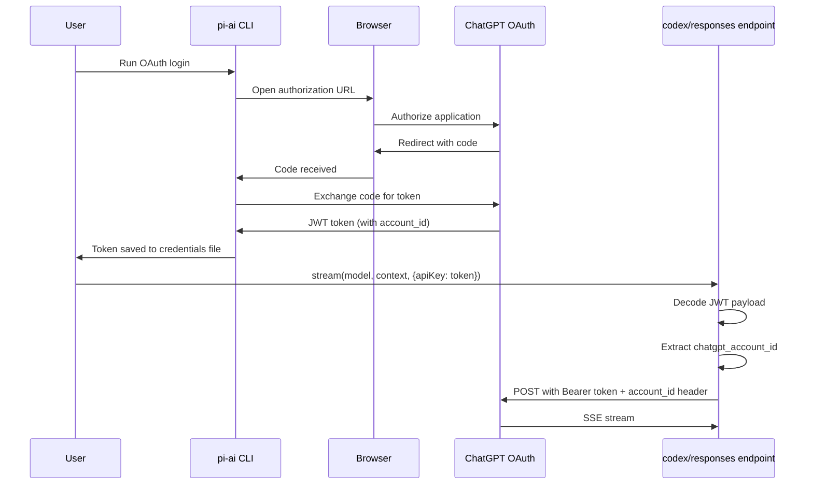
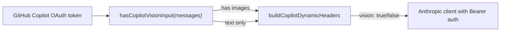
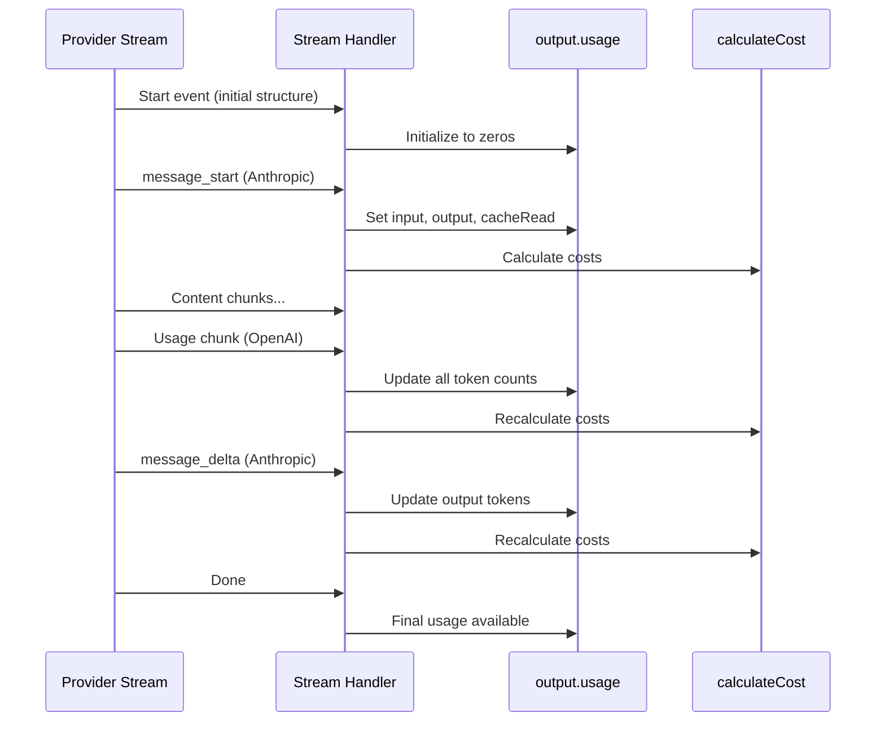
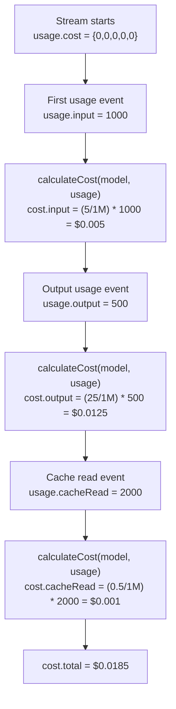

# Authentication & Cost Tracking

<details>
<summary>Relevant source files</summary>

The following files were used as context for generating this wiki page:

- [packages/ai/README.md](packages/ai/README.md)
- [packages/ai/scripts/generate-models.ts](packages/ai/scripts/generate-models.ts)
- [packages/ai/src/index.ts](packages/ai/src/index.ts)
- [packages/ai/src/models.generated.ts](packages/ai/src/models.generated.ts)
- [packages/ai/src/models.ts](packages/ai/src/models.ts)
- [packages/ai/src/providers/anthropic.ts](packages/ai/src/providers/anthropic.ts)
- [packages/ai/src/providers/google.ts](packages/ai/src/providers/google.ts)
- [packages/ai/src/providers/openai-codex-responses.ts](packages/ai/src/providers/openai-codex-responses.ts)
- [packages/ai/src/providers/openai-completions.ts](packages/ai/src/providers/openai-completions.ts)
- [packages/ai/src/providers/openai-responses.ts](packages/ai/src/providers/openai-responses.ts)
- [packages/ai/src/stream.ts](packages/ai/src/stream.ts)
- [packages/ai/src/types.ts](packages/ai/src/types.ts)
- [packages/ai/test/openai-codex-stream.test.ts](packages/ai/test/openai-codex-stream.test.ts)
- [packages/ai/test/supports-xhigh.test.ts](packages/ai/test/supports-xhigh.test.ts)
- [packages/coding-agent/src/core/model-resolver.ts](packages/coding-agent/src/core/model-resolver.ts)
- [packages/coding-agent/test/model-resolver.test.ts](packages/coding-agent/test/model-resolver.test.ts)

</details>

This page covers API authentication methods across providers and the token/cost tracking system in pi-ai. For provider-specific API details, see [Streaming API & Provider Implementations](#2.2). For model selection and resolution, see [Model Catalog & Resolution](#2.1).

## Overview

pi-ai provides a unified interface for authenticating with LLM providers and tracking usage costs. Authentication supports environment variables, runtime API keys, and OAuth flows. Cost tracking operates in real-time during streaming, calculating expenses based on token usage and model-specific pricing.

**Sources**: [packages/ai/README.md:1-46](), [packages/ai/src/types.ts:56-106]()

## API Key Management

### Environment Variables

Each provider expects a specific environment variable pattern. The `getEnvApiKey` function resolves these automatically:

| Provider         | Environment Variable   | Format       |
| ---------------- | ---------------------- | ------------ |
| `openai`         | `OPENAI_API_KEY`       | `sk-...`     |
| `anthropic`      | `ANTHROPIC_API_KEY`    | `sk-ant-...` |
| `google`         | `GOOGLE_API_KEY`       | String       |
| `groq`           | `GROQ_API_KEY`         | String       |
| `xai`            | `XAI_API_KEY`          | String       |
| `mistral`        | `MISTRAL_API_KEY`      | String       |
| `cerebras`       | `CEREBRAS_API_KEY`     | String       |
| `github-copilot` | `GITHUB_COPILOT_TOKEN` | OAuth token  |
| `openrouter`     | `OPENROUTER_API_KEY`   | String       |
| `huggingface`    | `HUGGINGFACE_API_KEY`  | String       |

**Sources**: [packages/ai/src/env-api-keys.ts:1-50]() (inferred from usage patterns)

### Runtime API Keys

All streaming functions accept an optional `apiKey` parameter that overrides environment variables:

```typescript
const model = getModel('openai', 'gpt-4o-mini')
const response = await complete(model, context, {
  apiKey: 'sk-...',
})
```

Runtime keys take precedence over environment variables and enable per-request authentication.

**Sources**: [packages/ai/src/types.ts:60-65](), [packages/ai/README.md:336-343]()

### Custom Headers

The `headers` option allows custom HTTP headers for authentication or provider-specific metadata:

```typescript
const response = await stream(model, context, {
  headers: {
    'X-Custom-Auth': 'token',
    'User-Agent': 'my-app/1.0',
  },
})
```

Custom headers merge with provider defaults and can override built-in headers.

**Sources**: [packages/ai/src/types.ts:87-92](), [packages/ai/src/providers/openai-completions.ts:354-358]()

## Authentication Flow by Provider Type

```mermaid
graph TB
    subgraph "Standard API Key Providers"
        StandardFlow["stream(model, context, options)"]
        CheckEnv["options.apiKey || getEnvApiKey(provider)"]
        CreateClient["Create provider client<br/>(OpenAI, Anthropic, etc.)"]
        StandardFlow --> CheckEnv
        CheckEnv --> CreateClient
    end

    subgraph "OAuth Providers"
        OAuthFlow["stream(model, context, options)"]
        OAuthCheck["Detect OAuth token format<br/>(sk-ant-oat, JWT, etc.)"]
        OAuthHeaders["Build OAuth-specific headers<br/>(Bearer auth, account IDs)"]
        OAuthClient["Create client with authToken"]
        OAuthFlow --> OAuthCheck
        OAuthCheck --> OAuthHeaders
        OAuthHeaders --> OAuthClient
    end

    subgraph "AWS Bedrock"
        BedrockFlow["stream(model, context, options)"]
        BedrockCreds["AWS credentials from SDK<br/>(AWS_ACCESS_KEY_ID, etc.)"]
        BedrockClient["BedrockRuntime client"]
        BedrockFlow --> BedrockCreds
        BedrockCreds --> BedrockClient
    end

    subgraph "Vertex AI"
        VertexFlow["stream(model, context, options)"]
        ADC["Application Default Credentials<br/>(gcloud auth)"]
        VertexClient["Vertex AI client"]
        VertexFlow --> ADC
        ADC --> VertexClient
    end
```



**Sources**: [packages/ai/src/providers/openai-completions.ts:330-366](), [packages/ai/src/providers/anthropic.ts:505-580](), [packages/ai/README.md:672-736]()

## OAuth Authentication

### OpenAI Codex (ChatGPT Plus/Pro)

OpenAI Codex requires a ChatGPT Plus/Pro subscription and uses OAuth tokens. The authentication flow extracts account IDs from JWT payloads:

1. Obtain OAuth token via `@mariozechner/pi-ai` CLI login
2. Token format: `base64(header).base64(payload).signature`
3. Payload contains `chatgpt_account_id` for account-based routing
4. Client uses Bearer authentication with account ID header



The token is decoded at runtime to extract account metadata:

```typescript
// JWT payload structure
{
  "https://api.openai.com/auth": {
    "chatgpt_account_id": "acc_..."
  }
}
```

**Sources**: [packages/ai/test/openai-codex-stream.test.ts:26-30](), [packages/ai/test/openai-codex-stream.test.ts:82-84](), [packages/ai/README.md:677-736]()

### GitHub Copilot

GitHub Copilot uses OAuth tokens with dynamic headers based on request content. Vision requests require additional capability flags:



The `buildCopilotDynamicHeaders` function inspects message content to set appropriate capability headers.

**Sources**: [packages/ai/src/providers/anthropic.ts:222-229](), [packages/ai/src/providers/openai-completions.ts:346-353]()

### Anthropic OAuth (Claude Code)

Anthropic OAuth tokens are detected by the `sk-ant-oat` prefix. The provider uses Bearer authentication and mimics Claude Code tool naming for compatibility:

```typescript
function isOAuthToken(apiKey: string): boolean {
  return apiKey.includes('sk-ant-oat')
}
```

When an OAuth token is detected, tools are renamed to match Claude Code's canonical casing (e.g., `read` → `Read`).

**Sources**: [packages/ai/src/providers/anthropic.ts:501-503](), [packages/ai/src/providers/anthropic.ts:64-101]()

### Vertex AI (Application Default Credentials)

Vertex AI uses Google Cloud's Application Default Credentials (ADC) system. The client automatically discovers credentials from:

1. `GOOGLE_APPLICATION_CREDENTIALS` environment variable (service account JSON)
2. `gcloud auth application-default login` session
3. GCE/GKE metadata server

No explicit API key is required when ADC is configured.

**Sources**: [packages/ai/README.md:672-676]()

## Usage Tracking Structure

### Usage Interface

The `Usage` interface tracks token consumption and associated costs:

```typescript
interface Usage {
  input: number // Non-cached input tokens
  output: number // Output tokens (including reasoning)
  cacheRead: number // Tokens read from cache
  cacheWrite: number // Tokens written to cache
  totalTokens: number // Sum of all tokens
  cost: {
    input: number // $ for input tokens
    output: number // $ for output tokens
    cacheRead: number // $ for cache read tokens
    cacheWrite: number // $ for cache write tokens
    total: number // Total cost in $
  }
}
```

**Sources**: [packages/ai/src/types.ts:160-173]()

### Token Accounting by Provider

Different providers report tokens in different ways. The streaming implementations normalize these into the unified `Usage` structure:

| Provider  | Input Field                       | Output Field                                  | Cache Read                | Cache Write                   |
| --------- | --------------------------------- | --------------------------------------------- | ------------------------- | ----------------------------- |
| Anthropic | `input_tokens`                    | `output_tokens`                               | `cache_read_input_tokens` | `cache_creation_input_tokens` |
| OpenAI    | `prompt_tokens` - `cached_tokens` | `completion_tokens` + `reasoning_tokens`      | `cached_tokens`           | Not reported                  |
| Google    | `promptTokenCount`                | `candidatesTokenCount` + `thoughtsTokenCount` | `cachedContentTokenCount` | Not reported                  |
| Bedrock   | `inputTokens`                     | `outputTokens`                                | Not reported              | Not reported                  |

**Sources**: [packages/ai/src/providers/anthropic.ts:253-260](), [packages/ai/src/providers/openai-completions.ts:131-153](), [packages/ai/src/providers/google.ts:209-226]()

### Real-Time Usage Updates

Usage is updated progressively during streaming. Providers emit usage metadata at different points:



**Sources**: [packages/ai/src/providers/anthropic.ts:251-261](), [packages/ai/src/providers/anthropic.ts:379-401](), [packages/ai/src/providers/openai-completions.ts:130-153]()

## Cost Calculation

### Model Pricing Structure

Each model in the registry includes cost information stored as dollars per million tokens:

```typescript
interface Model {
  cost: {
    input: number // $/million tokens
    output: number // $/million tokens
    cacheRead: number // $/million tokens
    cacheWrite: number // $/million tokens
  }
}
```

Example from generated models:

```typescript
"claude-opus-4-6": {
  id: "claude-opus-4-6",
  name: "Claude Opus 4.6",
  cost: {
    input: 5,          // $5/million tokens
    output: 25,        // $25/million tokens
    cacheRead: 0.5,    // $0.50/million tokens
    cacheWrite: 6.25   // $6.25/million tokens
  },
  // ...
}
```

**Sources**: [packages/ai/src/models.generated.ts:728-745](), [packages/ai/src/types.ts:305-311]()

### Model Cost Generation

Pricing data is fetched from three sources during model generation:

1. **models.dev API**: Anthropic, Google, OpenAI, Groq, Cerebras, xAI, Bedrock, Mistral
2. **OpenRouter API**: Models with routing through OpenRouter
3. **Vercel AI Gateway**: OpenAI-compatible model catalog

The `generate-models.ts` script fetches and normalizes costs:

```typescript
// From models.dev
const inputCost = m.cost?.input || 0 // Already in $/million tokens
const outputCost = m.cost?.output || 0

// From OpenRouter (convert from $/token to $/million)
const inputCost = parseFloat(model.pricing?.prompt || '0') * 1_000_000
const outputCost = parseFloat(model.pricing?.completion || '0') * 1_000_000
```

**Sources**: [packages/ai/scripts/generate-models.ts:175-219](), [packages/ai/scripts/generate-models.ts:59-114]()

### calculateCost Function

The `calculateCost` function converts token counts to dollars using the model's pricing:

```typescript
function calculateCost(model: Model, usage: Usage): Usage['cost'] {
  usage.cost.input = (model.cost.input / 1000000) * usage.input
  usage.cost.output = (model.cost.output / 1000000) * usage.output
  usage.cost.cacheRead = (model.cost.cacheRead / 1000000) * usage.cacheRead
  usage.cost.cacheWrite = (model.cost.cacheWrite / 1000000) * usage.cacheWrite
  usage.cost.total =
    usage.cost.input +
    usage.cost.output +
    usage.cost.cacheRead +
    usage.cost.cacheWrite
  return usage.cost
}
```

This function is called whenever usage updates during streaming.

**Sources**: [packages/ai/src/models.ts:39-46]()

### Service Tier Pricing Multipliers

OpenAI Responses API supports service tiers with different pricing multipliers:

| Service Tier | Multiplier | Use Case                     |
| ------------ | ---------- | ---------------------------- |
| `default`    | 1.0x       | Standard pricing             |
| `flex`       | 0.5x       | Lower priority, 50% discount |
| `priority`   | 2.0x       | Higher priority, 2x cost     |

The multiplier is applied after base cost calculation:

```typescript
function applyServiceTierPricing(
  usage: Usage,
  serviceTier: 'default' | 'flex' | 'priority'
) {
  const multiplier =
    serviceTier === 'flex' ? 0.5 : serviceTier === 'priority' ? 2 : 1

  if (multiplier !== 1) {
    usage.cost.input *= multiplier
    usage.cost.output *= multiplier
    usage.cost.cacheRead *= multiplier
    usage.cost.cacheWrite *= multiplier
    usage.cost.total =
      usage.cost.input +
      usage.cost.output +
      usage.cost.cacheRead +
      usage.cost.cacheWrite
  }
}
```

**Sources**: [packages/ai/src/providers/openai-responses.ts:242-262]()

## Cost Tracking in Action

### Streaming Cost Updates

During streaming, costs are recalculated as usage updates arrive:



**Sources**: [packages/ai/src/models.ts:39-46](), [packages/ai/src/providers/anthropic.ts:398-400]()

### Complete Example

A full streaming request shows cost accumulation:

```typescript
const model = getModel('anthropic', 'claude-opus-4-6')
const stream = streamSimple(model, context)

for await (const event of stream) {
  if (event.type === 'start') {
    // Initial structure, usage all zeros
    console.log('Initial cost:', event.partial.usage.cost.total) // $0
  }

  if (event.type === 'text_delta') {
    // Usage may update mid-stream
    const current = event.partial.usage.cost.total
    console.log('Current cost:', current.toFixed(4))
  }

  if (event.type === 'done') {
    const final = event.message.usage
    console.log('Final usage:', final)
    // {
    //   input: 1024,
    //   output: 512,
    //   cacheRead: 2048,
    //   cacheWrite: 256,
    //   totalTokens: 3840,
    //   cost: {
    //     input: 0.00512,    // (5/1M) * 1024
    //     output: 0.0128,    // (25/1M) * 512
    //     cacheRead: 0.001024, // (0.5/1M) * 2048
    //     cacheWrite: 0.0016,  // (6.25/1M) * 256
    //     total: 0.020544
    //   }
    // }
  }
}
```

**Sources**: [packages/ai/README.md:106-189](), [packages/ai/src/providers/anthropic.ts:251-261]()

## Prompt Caching and Cost Optimization

### Cache Retention Preferences

Providers support different cache retention strategies controlled via `cacheRetention` option:

| Retention | Anthropic           | OpenAI        | Description                |
| --------- | ------------------- | ------------- | -------------------------- |
| `"none"`  | No cache            | No cache      | Disable caching entirely   |
| `"short"` | Ephemeral (5min)    | In-memory     | Default, short-lived cache |
| `"long"`  | Ephemeral w/ 1h TTL | 24h retention | Extended cache lifetime    |

```typescript
const response = await stream(model, context, {
  cacheRetention: 'long', // Use extended cache
  sessionId: 'session-123', // Cache key for OpenAI
})
```

Long retention reduces costs for repeated context at the expense of longer cache TTLs.

**Sources**: [packages/ai/src/types.ts:56-80](), [packages/ai/src/providers/anthropic.ts:39-62](), [packages/ai/src/providers/openai-responses.ts:27-49]()

### Cache Cost Tracking

Cache reads are significantly cheaper than regular input tokens. The cost difference is reflected in model pricing:

```typescript
// Claude Opus 4.6 pricing
{
  input: 5,        // $5/M tokens for fresh input
  cacheRead: 0.5,  // $0.50/M tokens (90% cheaper)
  cacheWrite: 6.25 // $6.25/M tokens for cache creation
}
```

The `usage.cacheRead` and `usage.cacheWrite` fields track cached token usage separately, allowing precise cost attribution.

**Sources**: [packages/ai/src/models.generated.ts:736-743](), [packages/ai/src/types.ts:160-173]()
