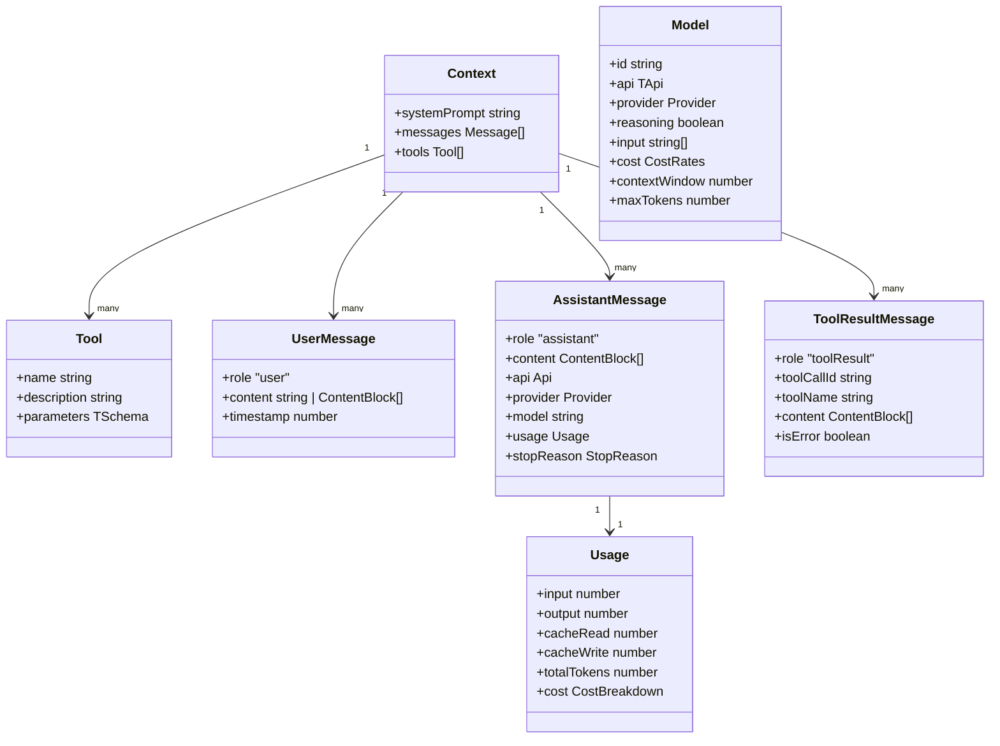
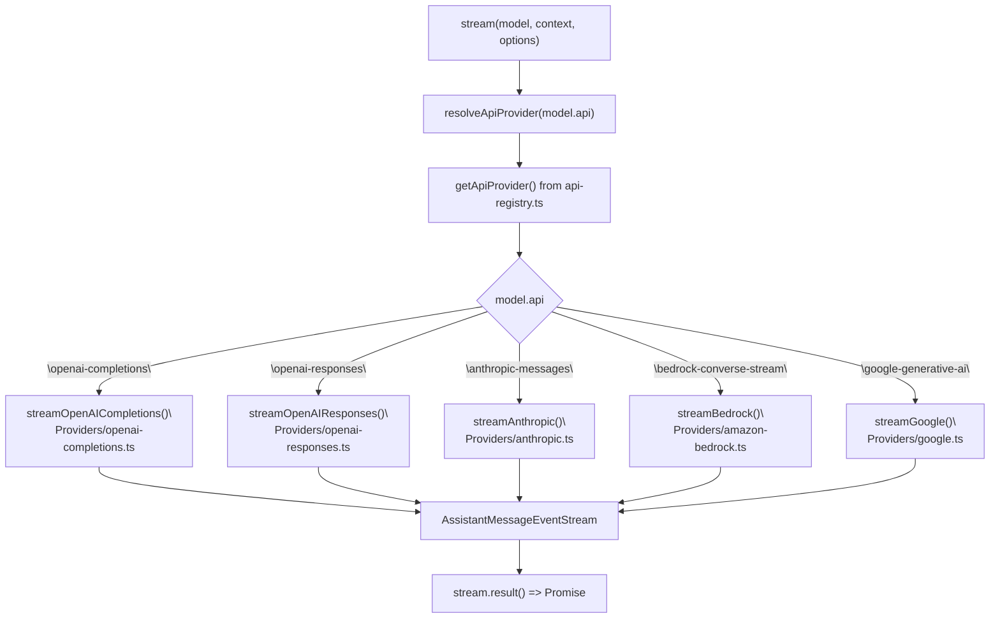

# pi-ai: LLM API Library

<details>
<summary>Relevant source files</summary>

The following files were used as context for generating this wiki page:

- [packages/ai/README.md](packages/ai/README.md)
- [packages/ai/scripts/generate-models.ts](packages/ai/scripts/generate-models.ts)
- [packages/ai/src/index.ts](packages/ai/src/index.ts)
- [packages/ai/src/models.generated.ts](packages/ai/src/models.generated.ts)
- [packages/ai/src/models.ts](packages/ai/src/models.ts)
- [packages/ai/src/providers/anthropic.ts](packages/ai/src/providers/anthropic.ts)
- [packages/ai/src/providers/google.ts](packages/ai/src/providers/google.ts)
- [packages/ai/src/providers/openai-codex-responses.ts](packages/ai/src/providers/openai-codex-responses.ts)
- [packages/ai/src/providers/openai-completions.ts](packages/ai/src/providers/openai-completions.ts)
- [packages/ai/src/providers/openai-responses.ts](packages/ai/src/providers/openai-responses.ts)
- [packages/ai/src/stream.ts](packages/ai/src/stream.ts)
- [packages/ai/src/types.ts](packages/ai/src/types.ts)
- [packages/ai/test/openai-codex-stream.test.ts](packages/ai/test/openai-codex-stream.test.ts)
- [packages/ai/test/supports-xhigh.test.ts](packages/ai/test/supports-xhigh.test.ts)
- [packages/coding-agent/src/core/model-resolver.ts](packages/coding-agent/src/core/model-resolver.ts)
- [packages/coding-agent/test/model-resolver.test.ts](packages/coding-agent/test/model-resolver.test.ts)

</details>

`@mariozechner/pi-ai` is the foundational LLM abstraction layer in the pi-mono repository. It provides a unified streaming API over multiple LLM providers, a model catalog, token/cost tracking, and OAuth credential management. All other packages in the repo that make LLM calls depend on this package.

This page covers the public API surface, core types, and the streaming entry points. For the auto-generated model catalog and how models are discovered, see [Model Catalog](#2.1). For provider-specific streaming behavior and options, see [Streaming API & Providers](#2.2). For OAuth and API key resolution, see [Authentication & OAuth](#2.3). For how higher-level agent loops use this library, see [pi-agent-core: Agent Framework](#3).

---

## Package Overview

The package is located at `packages/ai/` and published as `@mariozechner/pi-ai`. It exports its entire public surface from `packages/ai/src/index.ts`.

Only models that support **tool calling** (function calling) are included in the model catalog, since this is required for agentic workflows.

**Key source files:**

| File                                  | Role                                                                             |
| ------------------------------------- | -------------------------------------------------------------------------------- |
| `packages/ai/src/types.ts`            | All core TypeScript interfaces and type aliases                                  |
| `packages/ai/src/stream.ts`           | Top-level `stream`, `complete`, `streamSimple`, `completeSimple` entry points    |
| `packages/ai/src/models.ts`           | Runtime model registry; `getModel`, `getModels`, `getProviders`, `calculateCost` |
| `packages/ai/src/models.generated.ts` | Auto-generated `MODELS` constant with every known model                          |
| `packages/ai/src/api-registry.ts`     | Maps API identifiers to provider implementations                                 |
| `packages/ai/src/providers/`          | Per-API streaming implementations                                                |
| `packages/ai/src/utils/oauth/`        | OAuth login and token refresh helpers                                            |
| `packages/ai/src/env-api-keys.ts`     | Environment variable → provider API key mapping                                  |

Sources: [packages/ai/src/index.ts](), [packages/ai/src/stream.ts](), [packages/ai/src/types.ts](), [packages/ai/src/models.ts]()

---

## Core Types

All types are defined in `packages/ai/src/types.ts` and re-exported from `index.ts`.

### `Model<TApi>`

Represents a single LLM model. The generic parameter `TApi` is constrained to `Api` and determines which provider implementation handles requests.

```
Model<TApi> {
  id:            string          // e.g. "claude-opus-4-6"
  name:          string          // Human-readable name
  api:           TApi            // e.g. "anthropic-messages"
  provider:      Provider        // e.g. "anthropic"
  baseUrl:       string          // API endpoint
  reasoning:     boolean         // Supports extended thinking
  input:         ("text" | "image")[]
  cost:          { input, output, cacheRead, cacheWrite }  // $/million tokens
  contextWindow: number
  maxTokens:     number
  headers?:      Record<string, string>
  compat?:       OpenAICompletionsCompat | OpenAIResponsesCompat
}
```

Sources: [packages/ai/src/types.ts:289-314]()

### `Context`

The complete input to a single LLM call. It is intentionally serializable so sessions can be stored and transferred between models.

```
Context {
  systemPrompt?: string
  messages:      Message[]
  tools?:        Tool[]
}
```

Sources: [packages/ai/src/types.ts:206-210]()

### `Message`

A discriminated union of the three message roles:

| Type                | Role           | Content                                                                                              |
| ------------------- | -------------- | ---------------------------------------------------------------------------------------------------- |
| `UserMessage`       | `"user"`       | `string` or `(TextContent \| ImageContent)[]`                                                        |
| `AssistantMessage`  | `"assistant"`  | `(TextContent \| ThinkingContent \| ToolCall)[]` + `usage`, `stopReason`, `model`, `api`, `provider` |
| `ToolResultMessage` | `"toolResult"` | `toolCallId`, `toolName`, `content: (TextContent \| ImageContent)[]`, `isError`                      |

`AssistantMessage` carries usage statistics and cost breakdowns via the `Usage` interface.

Sources: [packages/ai/src/types.ts:168-196]()

### `Tool`

Uses [TypeBox](https://github.com/sinclairzx81/typebox) schemas for parameter definitions. TypeBox `Type`, `Static`, and `TSchema` are re-exported directly from `@mariozechner/pi-ai`.

```
Tool<TParameters extends TSchema> {
  name:        string
  description: string
  parameters:  TParameters    // TypeBox schema
}
```

Sources: [packages/ai/src/types.ts:200-204]()

### Content Block Types

| Interface         | `type` discriminant | Key fields                                            |
| ----------------- | ------------------- | ----------------------------------------------------- |
| `TextContent`     | `"text"`            | `text: string`                                        |
| `ThinkingContent` | `"thinking"`        | `thinking: string`, `thinkingSignature?`, `redacted?` |
| `ImageContent`    | `"image"`           | `data: string` (base64), `mimeType: string`           |
| `ToolCall`        | `"toolCall"`        | `id`, `name`, `arguments: Record<string, any>`        |

Sources: [packages/ai/src/types.ts:121-149]()

### Type Relationship Diagram

**Core type relationships in `packages/ai/src/types.ts`**



Sources: [packages/ai/src/types.ts]()

---

## API and Provider Identifiers

`Api` (`KnownApi`) and `Provider` (`KnownProvider`) are string union types that identify which wire protocol and endpoint to use.

**Known API identifiers:**

| `Api` value                 | Wire protocol                       | Implemented in                        |
| --------------------------- | ----------------------------------- | ------------------------------------- |
| `"openai-completions"`      | OpenAI Chat Completions (streaming) | `providers/openai-completions.ts`     |
| `"openai-responses"`        | OpenAI Responses API                | `providers/openai-responses.ts`       |
| `"azure-openai-responses"`  | Azure OpenAI Responses              | `providers/azure-openai-responses.ts` |
| `"openai-codex-responses"`  | ChatGPT OAuth / Codex endpoint      | `providers/openai-codex-responses.ts` |
| `"anthropic-messages"`      | Anthropic Messages API              | `providers/anthropic.ts`              |
| `"bedrock-converse-stream"` | AWS Bedrock Converse Stream         | `providers/amazon-bedrock.ts`         |
| `"google-generative-ai"`    | Google Generative AI SDK            | `providers/google.ts`                 |
| `"google-gemini-cli"`       | Gemini CLI OAuth endpoint           | `providers/google-gemini-cli.ts`      |
| `"google-vertex"`           | Vertex AI                           | `providers/google-vertex.ts`          |

A `Model<TApi>` with `api: "anthropic-messages"` will always be handled by the Anthropic provider, regardless of which `provider` field it carries. This is how proxies like `opencode`, `vercel-ai-gateway`, and `minimax` work — their models use an existing API type but point to a different `baseUrl`.

**Known provider identifiers (selected):**

`amazon-bedrock`, `anthropic`, `google`, `google-gemini-cli`, `google-antigravity`, `google-vertex`, `openai`, `azure-openai-responses`, `openai-codex`, `github-copilot`, `xai`, `groq`, `cerebras`, `openrouter`, `vercel-ai-gateway`, `zai`, `mistral`, `minimax`, `minimax-cn`, `huggingface`, `opencode`, `kimi-coding`

Sources: [packages/ai/src/types.ts:5-41]()

---

## Entry Points

All four public entry points are in `packages/ai/src/stream.ts` and re-exported from `index.ts`.

### `stream` and `complete`

These are the **provider-native** entry points. They accept provider-specific options via `ProviderStreamOptions` (a `StreamOptions` + `Record<string, unknown>` passthrough).

```typescript
// packages/ai/src/stream.ts
function stream<TApi extends Api>(
  model: Model<TApi>,
  context: Context,
  options?: ProviderStreamOptions
): AssistantMessageEventStream

async function complete<TApi extends Api>(
  model: Model<TApi>,
  context: Context,
  options?: ProviderStreamOptions
): Promise<AssistantMessage>
```

`complete` is implemented as `stream(...).result()` — it consumes the event stream and resolves when complete.

### `streamSimple` and `completeSimple`

These are the **provider-agnostic** entry points. They accept `SimpleStreamOptions`, which adds a unified `reasoning?: ThinkingLevel` field. Each provider's `streamSimple` implementation translates this to its native format (e.g., `thinkingBudgetTokens` for Anthropic, `reasoningEffort` for OpenAI).

```typescript
function streamSimple<TApi extends Api>(
  model: Model<TApi>,
  context: Context,
  options?: SimpleStreamOptions
): AssistantMessageEventStream

async function completeSimple<TApi extends Api>(
  model: Model<TApi>,
  context: Context,
  options?: SimpleStreamOptions
): Promise<AssistantMessage>
```

`ThinkingLevel` values: `"minimal"`, `"low"`, `"medium"`, `"high"`, `"xhigh"`.

Sources: [packages/ai/src/stream.ts](), [packages/ai/src/types.ts:43-112]()

### `StreamOptions` fields

All options types extend `StreamOptions`:

| Field             | Type                             | Description                                                |
| ----------------- | -------------------------------- | ---------------------------------------------------------- |
| `temperature`     | `number`                         | Sampling temperature                                       |
| `maxTokens`       | `number`                         | Max output tokens                                          |
| `signal`          | `AbortSignal`                    | Cancellation                                               |
| `apiKey`          | `string`                         | Runtime API key override                                   |
| `cacheRetention`  | `"none" \| "short" \| "long"`    | Prompt cache TTL preference                                |
| `sessionId`       | `string`                         | Session key for cache routing                              |
| `headers`         | `Record<string, string>`         | Additional HTTP headers                                    |
| `onPayload`       | `(payload: unknown) => void`     | Inspect the raw API payload before sending                 |
| `maxRetryDelayMs` | `number`                         | Max delay to accept from server retry hints                |
| `metadata`        | `Record<string, unknown>`        | Provider-specific metadata (e.g., `user_id` for Anthropic) |
| `transport`       | `"sse" \| "websocket" \| "auto"` | Transport preference                                       |

Sources: [packages/ai/src/types.ts:58-103]()

---

## Dispatch Flow

When `stream()` is called, it looks up the API identifier in a registry (`api-registry.ts`) and delegates to the provider's `stream` function. `streamSimple` delegates to the provider's `streamSimple` function.

**Stream dispatch: `stream()` → provider → `AssistantMessageEventStream`**



Sources: [packages/ai/src/stream.ts](), [packages/ai/src/providers/openai-completions.ts:78-82](), [packages/ai/src/providers/anthropic.ts:193-197](), [packages/ai/src/providers/openai-responses.ts:61-65](), [packages/ai/src/providers/amazon-bedrock.ts:62-66](), [packages/ai/src/providers/google.ts:48-52]()

---

## `AssistantMessageEventStream` and Events

`AssistantMessageEventStream` is an async-iterable event stream. Callers iterate it with `for await` to receive `AssistantMessageEvent` objects.

**All event types (`AssistantMessageEvent` union):**

| Event `type`       | When emitted                 | Key properties                                                             |
| ------------------ | ---------------------------- | -------------------------------------------------------------------------- |
| `"start"`          | Stream begins                | `partial: AssistantMessage`                                                |
| `"text_start"`     | New text block begins        | `contentIndex: number`                                                     |
| `"text_delta"`     | Text chunk arrives           | `delta: string`, `contentIndex`                                            |
| `"text_end"`       | Text block complete          | `content: string`, `contentIndex`                                          |
| `"thinking_start"` | Thinking block begins        | `contentIndex`                                                             |
| `"thinking_delta"` | Thinking chunk arrives       | `delta: string`, `contentIndex`                                            |
| `"thinking_end"`   | Thinking block complete      | `content: string`, `contentIndex`                                          |
| `"toolcall_start"` | Tool call begins             | `contentIndex`                                                             |
| `"toolcall_delta"` | Tool argument JSON streaming | `delta: string`, `partial.content[contentIndex].arguments` (partial parse) |
| `"toolcall_end"`   | Tool call complete           | `toolCall: ToolCall`, `contentIndex`                                       |
| `"done"`           | Stream finished normally     | `reason: "stop" \| "length" \| "toolUse"`, `message: AssistantMessage`     |
| `"error"`          | Stream failed or aborted     | `reason: "error" \| "aborted"`, `error: AssistantMessage`                  |

During `toolcall_delta`, `arguments` is a best-effort partial parse of the streaming JSON. The value is always at minimum `{}`. Full arguments are only guaranteed at `toolcall_end`.

`StopReason` values: `"stop"`, `"length"`, `"toolUse"`, `"error"`, `"aborted"`.

Sources: [packages/ai/src/types.ts:212-224](), [packages/ai/README.md:362-379]()

---

## Model Registry

The model registry is initialized from the auto-generated `MODELS` constant at module load time and managed in `packages/ai/src/models.ts`.

**Registry API:**

| Function         | Signature                            | Description                                     |
| ---------------- | ------------------------------------ | ----------------------------------------------- |
| `getModel`       | `(provider, modelId) => Model<TApi>` | Type-safe lookup by provider + model ID         |
| `getModels`      | `(provider) => Model<TApi>[]`        | All models for a provider                       |
| `getProviders`   | `() => KnownProvider[]`              | All registered providers                        |
| `calculateCost`  | `(model, usage) => Usage["cost"]`    | Computes dollar costs from token counts         |
| `modelsAreEqual` | `(a, b) => boolean`                  | Compares by `id` and `provider`                 |
| `supportsXhigh`  | `(model) => boolean`                 | Whether model supports `"xhigh"` thinking level |

`getModel` is fully typed: the return type's `TApi` is inferred from the `MODELS` constant structure, giving autocomplete for both provider names and model IDs.

Sources: [packages/ai/src/models.ts]()

---

## Tool Validation

`validateToolCall` (exported from `index.ts` via `utils/validation.ts`) validates a completed `ToolCall`'s `arguments` against the tool's TypeBox schema using AJV. It throws on failure, allowing callers to return the error message as a tool result so the model can retry.

The `agentLoop` in `@mariozechner/pi-agent-core` calls this automatically. When using `stream()` or `complete()` directly, callers must invoke it manually.

Sources: [packages/ai/README.md:326-358](), [packages/ai/src/index.ts:22]()

---

## OAuth Providers

For providers that use OAuth rather than API keys (Claude Pro/Max, GitHub Copilot, Google Gemini CLI, Antigravity, OpenAI Codex), the `utils/oauth/` module provides login and token refresh helpers.

**Exported OAuth utilities (`packages/ai/src/utils/oauth/index.ts`):**

| Function/Constant                                                               | Provider           |
| ------------------------------------------------------------------------------- | ------------------ |
| `loginAnthropic`, `refreshAnthropicToken`, `anthropicOAuthProvider`             | Anthropic          |
| `loginGitHubCopilot`, `refreshGitHubCopilotToken`, `githubCopilotOAuthProvider` | GitHub Copilot     |
| `loginGeminiCli`, `refreshGoogleCloudToken`, `geminiCliOAuthProvider`           | Google Gemini CLI  |
| `loginAntigravity`, `refreshAntigravityToken`, `antigravityOAuthProvider`       | Google Antigravity |
| `loginOpenAICodex`, `refreshOpenAICodexToken`, `openaiCodexOAuthProvider`       | OpenAI Codex       |

OAuth providers implement `OAuthProviderInterface` and can be registered at runtime via `registerOAuthProvider`. The higher-level credential management (loading from `auth.json`, file locking, automatic refresh) lives in `packages/coding-agent/src/core/auth-storage.ts` — see [Authentication & OAuth](#2.3) for details.

Sources: [packages/ai/src/utils/oauth/index.ts]()

---

## Package Exports Summary

The following module groups are exported from `packages/ai/src/index.ts`:

```mermaid
graph LR
    subgraph "packages/ai/src/index.ts"
        A["types.ts\
(all interfaces + unions)"]
        B["stream.ts\
stream, complete\
streamSimple, completeSimple"]
        C["models.ts\
getModel, getModels\
getProviders, calculateCost"]
        D["api-registry.ts\
registerApiProvider\
getApiProvider"]
        E["providers/anthropic.ts\
streamAnthropic\
AnthropicOptions"]
        F["providers/openai-completions.ts\
streamOpenAICompletions"]
        G["providers/openai-responses.ts\
streamOpenAIResponses"]
        H["providers/google.ts\
streamGoogle"]
        I["providers/amazon-bedrock.ts\
(via register-builtins)"]
        J["utils/oauth/index.ts\
loginXxx, refreshXxx"]
        K["utils/validation.ts\
validateToolCall\
validateToolArguments"]
        L["utils/typebox-helpers.ts\
StringEnum"]
        M["@sinclair/typebox\
Type, Static, TSchema"]
    end
```



Sources: [packages/ai/src/index.ts]()

---

## Usage in the Broader System

`@mariozechner/pi-ai` is used as a direct dependency by:

- **`@mariozechner/pi-agent-core`** — calls `streamSimple` inside `agentLoop`
- **`@mariozechner/pi-coding-agent`** — uses `MODELS`, `getModel`, `AuthStorage` (which wraps OAuth utilities), and registers custom providers via `registerApiProvider`
- **`@mariozechner/pi-mom`** — uses `streamSimple` for Slack bot agent loops
- **`@mariozechner/pi-web-ui`** — calls `streamSimple` directly from the browser (with optional CORS proxy)

Sources: [packages/agent/src/agent-loop.ts:1-13](), [packages/coding-agent/src/core/auth-storage.ts:9-17](), [packages/web-ui/src/utils/proxy-utils.ts:1-3]()
