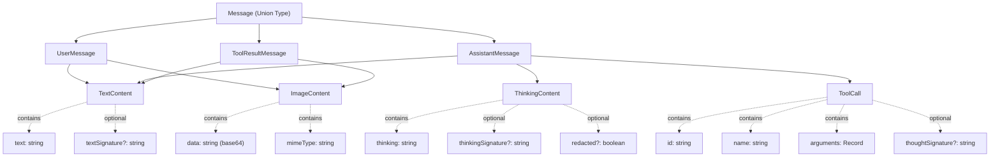
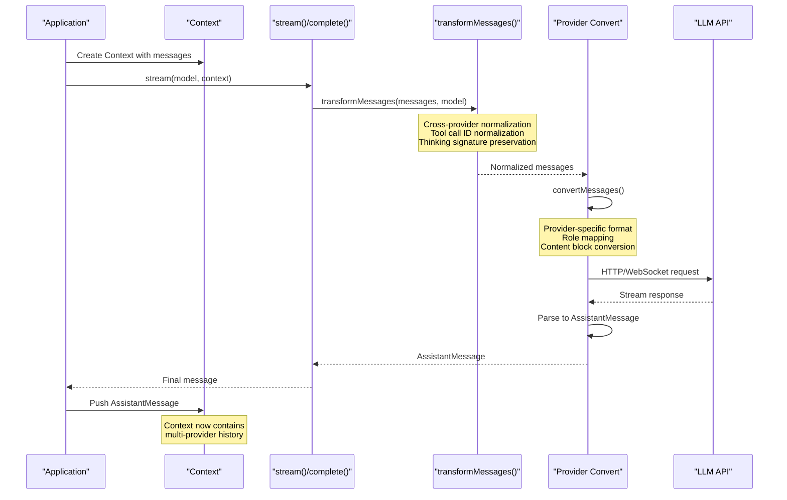
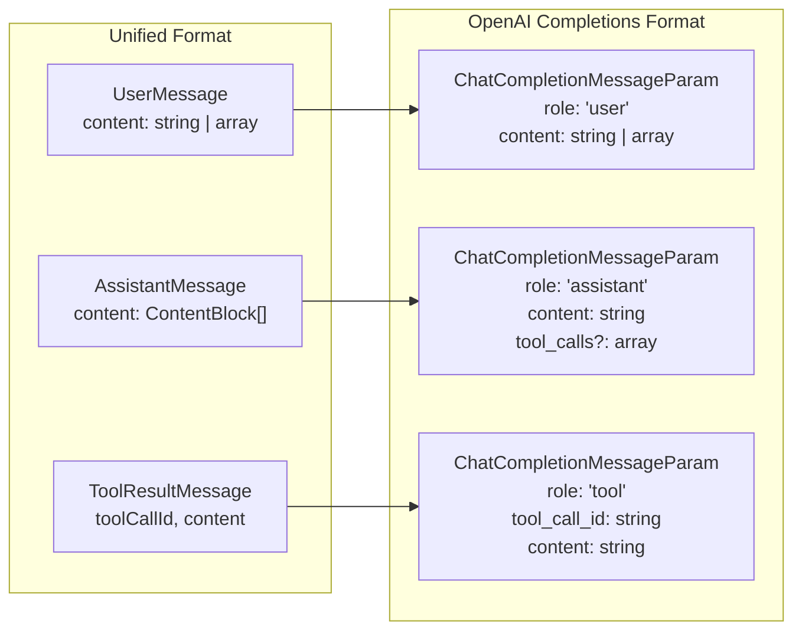
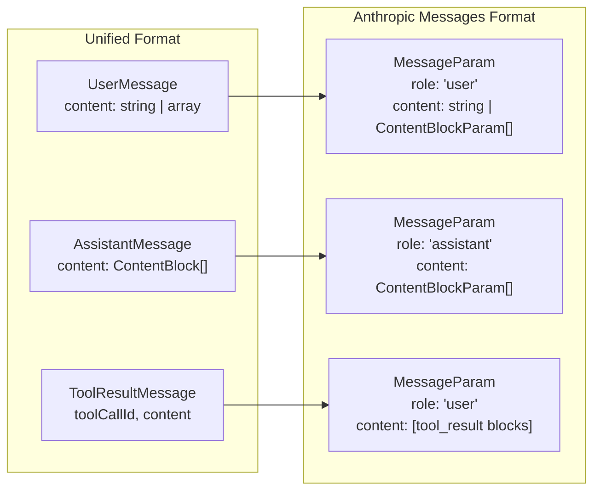
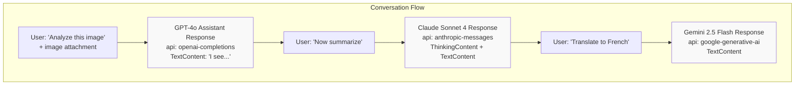
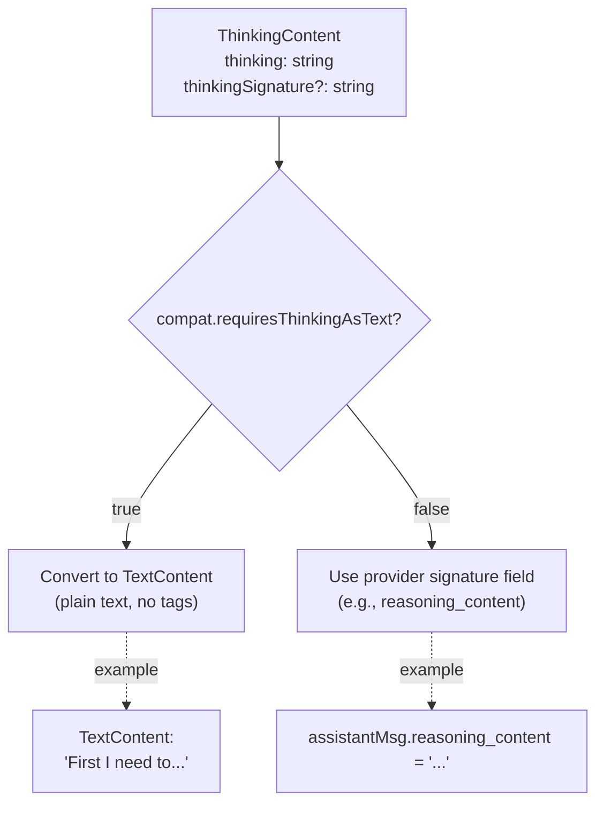
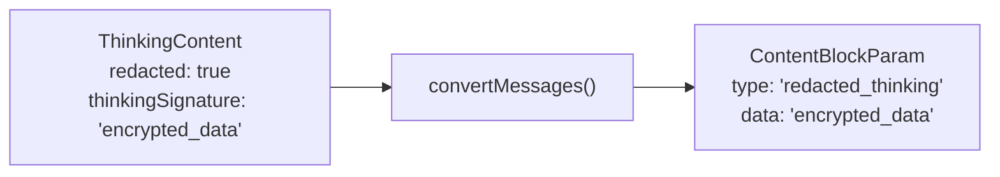
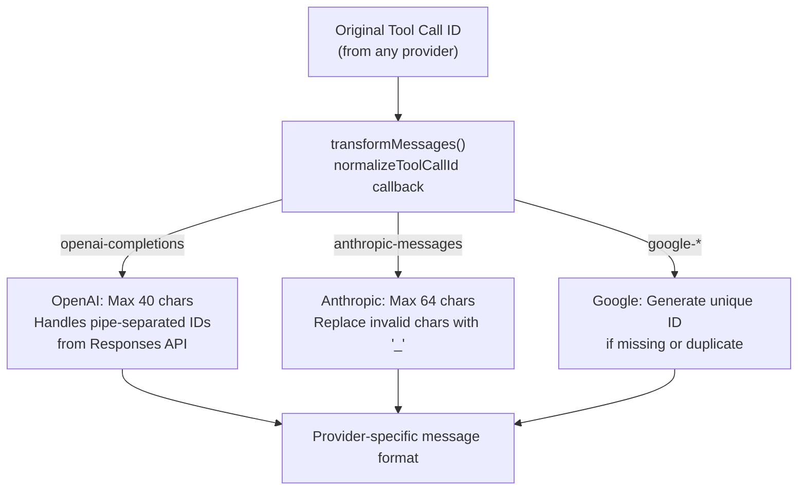
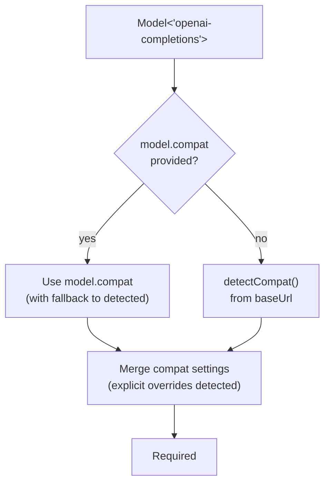
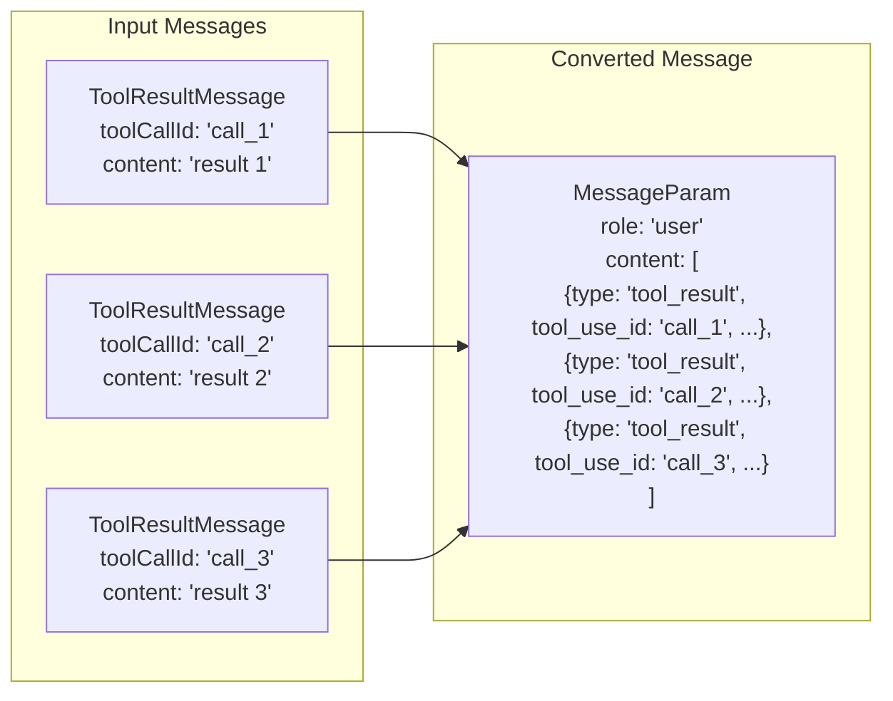

# Message Transformation & Cross-Provider Handoffs

<details>
<summary>Relevant source files</summary>

The following files were used as context for generating this wiki page:

- [packages/ai/README.md](packages/ai/README.md)
- [packages/ai/src/providers/anthropic.ts](packages/ai/src/providers/anthropic.ts)
- [packages/ai/src/providers/google.ts](packages/ai/src/providers/google.ts)
- [packages/ai/src/providers/openai-completions.ts](packages/ai/src/providers/openai-completions.ts)
- [packages/ai/src/providers/openai-responses.ts](packages/ai/src/providers/openai-responses.ts)
- [packages/ai/src/stream.ts](packages/ai/src/stream.ts)
- [packages/ai/src/types.ts](packages/ai/src/types.ts)

</details>

This page documents the message transformation system that enables seamless handoffs between different LLM providers in the pi-ai library. The transformation layer converts between a unified internal message format and provider-specific API formats, allowing conversations to switch between models from different providers (e.g., OpenAI → Anthropic → Google) without loss of context.

For information about the streaming API and event protocols, see [Streaming API & Provider Implementations](#2.2). For model catalog and resolution, see [Model Catalog & Resolution](#2.1).

## Unified Message Format

The pi-ai library uses a canonical message format that abstracts over provider differences. All provider implementations convert to and from this format.

### Message Type Hierarchy



Sources: [packages/ai/src/types.ts:137-212]()

### Core Message Types

| Message Type        | Role           | Content Types                                | Purpose                                                 |
| ------------------- | -------------- | -------------------------------------------- | ------------------------------------------------------- |
| `UserMessage`       | `"user"`       | `TextContent`, `ImageContent`                | User input with optional images                         |
| `AssistantMessage`  | `"assistant"`  | `TextContent`, `ThinkingContent`, `ToolCall` | Model output with text, reasoning, and tool invocations |
| `ToolResultMessage` | `"toolResult"` | `TextContent`, `ImageContent`                | Tool execution results with optional images             |

All messages include a `timestamp` field (Unix milliseconds). `AssistantMessage` additionally includes `api`, `provider`, `model`, `usage`, and `stopReason` fields for provenance tracking.

Sources: [packages/ai/src/types.ts:184-212]()

## Message Transformation Pipeline

### High-Level Flow



Sources: [packages/ai/src/stream.ts:25-41](), [packages/ai/src/providers/openai-completions.ts:487](), [packages/ai/src/providers/anthropic.ts:689]()

### Transformation Stages

The transformation pipeline has two distinct stages:

1. **Shared Normalization** (`transformMessages`): Cross-provider message normalization that runs before provider-specific conversion. Handles tool call ID normalization, thinking signature preservation, and provider-agnostic transformations.

2. **Provider Conversion** (`convertMessages`): Provider-specific format conversion. Maps the normalized message format to the target provider's API schema.

Sources: [packages/ai/src/providers/openai-completions.ts:34](), [packages/ai/src/providers/anthropic.ts:33]()

## Provider-Specific Message Conversion

Each provider implements a `convertMessages` function that transforms the unified format into its API's expected schema.

### OpenAI Completions API



The OpenAI Completions conversion:

- Concatenates multiple `TextContent` blocks into a single string (avoids recursive nesting issues with some providers like DeepSeek V3.2)
- Converts `ThinkingContent` to text or uses provider-specific fields (`reasoning_content`, `reasoning`)
- Maps `ToolCall` blocks to `tool_calls` array
- Converts `ToolResultMessage` to `role: "tool"` with `tool_call_id`
- Handles image blocks as `image_url` content parts

Sources: [packages/ai/src/providers/openai-completions.ts:465-690]()

### Anthropic Messages API



The Anthropic Messages conversion:

- Preserves content block array structure
- Converts `ThinkingContent` to `thinking` blocks with signature preservation
- Handles redacted thinking by passing through the opaque `thinkingSignature` as `redacted_thinking`
- Maps `ToolCall` blocks to `tool_use` blocks
- **Aggregates consecutive `ToolResultMessage`s** into a single user message with multiple `tool_result` blocks (required by some proxies)
- If tool results include images, adds them as a separate user message with image content

Sources: [packages/ai/src/providers/anthropic.ts:680-843]()

### Google Generative AI

The Google API uses a different structure with `Content` objects and `Part` arrays:

- User/assistant messages map to `Content` with `parts` arrays
- Text and thinking both use `text` parts (distinguished by `thoughtSignature` presence)
- Tool calls use `functionCall` parts
- Tool results use `functionResponse` parts

Sources: [packages/ai/src/providers/google.ts:48-272]()

## Cross-Provider Handoffs

The unified message format enables seamless model switching mid-conversation.

### Context Preservation



Each `AssistantMessage` preserves its original `api`, `provider`, and `model` fields. When calling a new provider, the transformation pipeline:

1. Extracts messages from `Context.messages`
2. Normalizes tool call IDs and signatures via `transformMessages`
3. Converts to target provider's format via provider-specific `convertMessages`
4. Sends to new provider's API

Sources: [packages/ai/src/types.ts:190-200](), [packages/ai/README.md:33-34]()

### Example Handoff Code

The following pattern works across all providers:

```typescript
const context: Context = {
  systemPrompt: 'You are a helpful assistant.',
  messages: [],
}

// Start with GPT-4o
const gpt4o = getModel('openai', 'gpt-4o')
const response1 = await complete(gpt4o, context)
context.messages.push(response1)

// Continue with Claude
context.messages.push({ role: 'user', content: 'Continue this conversation' })
const claude = getModel('anthropic', 'claude-sonnet-4-20250514')
const response2 = await complete(claude, context)
context.messages.push(response2)

// Finish with Gemini
context.messages.push({ role: 'user', content: 'Summarize our discussion' })
const gemini = getModel('google', 'gemini-2.0-flash-exp')
const response3 = await complete(gemini, context)
```

All messages from previous models are automatically transformed to the new provider's format.

Sources: [packages/ai/README.md:586-607]()

## Thinking Content Transformation

Thinking/reasoning content has provider-specific representations that must be preserved or transformed during handoffs.

### Provider Thinking Formats

| Provider           | Input Format                            | Output Format                        | Signature Field                         |
| ------------------ | --------------------------------------- | ------------------------------------ | --------------------------------------- |
| OpenAI Completions | `reasoning_content`, `reasoning` fields | Text with `reasoning_*` delta events | `thinkingSignature` (field name)        |
| OpenAI Responses   | Encrypted `reasoning.encrypted_content` | `id` reference in response           | `thinkingSignature` (reasoning item ID) |
| Anthropic          | `thinking` content blocks               | `thinking` blocks with signature     | `thinkingSignature` (block signature)   |
| Google             | Text parts with `thoughtSignature`      | Text parts with `thoughtSignature`   | `thoughtSignature` (opaque token)       |

### Thinking Block Handling in OpenAI Completions

When converting thinking blocks for OpenAI-compatible APIs:



This prevents models from mimicking `<thinking>` tags in their output when thinking is sent as plain text.

Sources: [packages/ai/src/providers/openai-completions.ts:559-579]()

### Anthropic Redacted Thinking

Anthropic's safety filters may redact thinking content. The system preserves the opaque payload:



This allows the encrypted thinking to be passed back to Anthropic in subsequent turns, maintaining continuity even when content is filtered.

Sources: [packages/ai/src/providers/anthropic.ts:745-750]()

## Tool Call ID Normalization

Different providers have different constraints on tool call IDs. The `transformMessages` utility normalizes IDs before provider-specific conversion.

### Normalization Pipeline



Sources: [packages/ai/src/providers/openai-completions.ts:472-485](), [packages/ai/src/providers/anthropic.ts:676-678](), [packages/ai/src/providers/google.ts:173-179]()

### OpenAI Responses API Special Case

The OpenAI Responses API (used by Copilot, OpenAI Codex, OpenCode) returns tool call IDs in the format `{call_id}|{encrypted_signature}`, where the signature can exceed 400 characters. These must be truncated and sanitized:

```typescript
// From openai-completions.ts normalizeToolCallId
if (id.includes('|')) {
  const [callId] = id.split('|')
  return callId.replace(/[^a-zA-Z0-9_-]/g, '_').slice(0, 40)
}
```

Sources: [packages/ai/src/providers/openai-completions.ts:474-481]()

## Compatibility Mechanisms

### OpenAI Completions Compatibility Settings

The `OpenAICompletionsCompat` interface allows fine-tuning provider-specific behavior:

| Field                              | Purpose                                               | Example                                                            |
| ---------------------------------- | ----------------------------------------------------- | ------------------------------------------------------------------ |
| `requiresAssistantAfterToolResult` | Insert synthetic assistant message after tool results | Some proxies don't allow user messages directly after tool results |
| `requiresToolResultName`           | Include `name` field in tool results                  | Some providers require this field                                  |
| `requiresThinkingAsText`           | Convert thinking blocks to plain text                 | Prevents models from mimicking tags                                |
| `thinkingFormat`                   | Thinking parameter format                             | `"openai"`, `"zai"`, `"qwen"`, `"qwen-chat-template"`              |
| `supportsDeveloperRole`            | Use `developer` vs `system` role                      | Reasoning models use developer role                                |
| `maxTokensField`                   | Token limit field name                                | `"max_completion_tokens"` vs `"max_tokens"`                        |

Sources: [packages/ai/src/types.ts:253-281]()

### Auto-Detection and Overrides

The `getCompat` function in openai-completions.ts auto-detects settings from `baseUrl` for known providers, but allows explicit overrides via `model.compat`:



Sources: [packages/ai/src/providers/openai-completions.ts:761-834]()

### Image Content Filtering

Vision-capable models are identified by `model.input.includes('image')`. During conversion, if a model doesn't support images, image content blocks are silently filtered:

```typescript
// From openai-completions.ts
const filteredContent = !model.input.includes('image')
  ? content.filter((c) => c.type !== 'image_url')
  : content
```

This allows the same context to be used with both vision and non-vision models without errors.

Sources: [packages/ai/src/providers/openai-completions.ts:530-533](), [packages/ai/src/providers/anthropic.ts:720]()

## Assistant Message Content Formatting

Different providers have specific requirements for assistant message content structure.

### OpenAI Completions: String Concatenation

To avoid recursive content block mirroring (observed with DeepSeek V3.2 via NVIDIA NIM), OpenAI Completions always sends assistant content as a plain string:

```typescript
// Always send as plain string, never as content block array
assistantMsg.content = nonEmptyTextBlocks
  .map((b) => sanitizeSurrogates(b.text))
  .join('')
```

Sources: [packages/ai/src/providers/openai-completions.ts:546-556]()

### Anthropic: Content Block Array Preservation

Anthropic preserves the content block structure, with separate `text`, `thinking`, and `tool_use` blocks:

```typescript
const blocks: ContentBlockParam[] = []
for (const block of msg.content) {
  if (block.type === 'text') {
    blocks.push({ type: 'text', text: sanitizeSurrogates(block.text) })
  } else if (block.type === 'thinking') {
    blocks.push({
      type: 'thinking',
      thinking: sanitizeSurrogates(block.thinking),
      signature: block.thinkingSignature,
    })
  } else if (block.type === 'toolCall') {
    blocks.push({
      type: 'tool_use',
      id: block.id,
      name: block.name,
      input: block.arguments,
    })
  }
}
```

Sources: [packages/ai/src/providers/anthropic.ts:736-776]()

### Empty Content Handling

Providers have different requirements for empty assistant messages:

- **OpenAI Completions**: Requires either content or tool_calls. Empty messages are skipped entirely.
- **Anthropic**: Can accept empty content if tool_use blocks are present.
- **OpenAI Responses**: No special handling needed.

The conversion functions filter empty text/thinking blocks and skip messages with no content and no tool calls.

Sources: [packages/ai/src/providers/openai-completions.ts:605-617](), [packages/ai/src/providers/anthropic.ts:738-739](), [packages/ai/src/providers/anthropic.ts:752-756]()

## Tool Result Aggregation

### Anthropic Consecutive Tool Results

Anthropic's Messages API (and some proxies like z.ai) require multiple tool results to be aggregated into a single user message:



The conversion function walks forward through messages, collecting consecutive tool results into a single array.

Sources: [packages/ai/src/providers/anthropic.ts:782-815]()

### Image Handling in Tool Results

When tool results include images, the Anthropic converter:

1. Sends text results as `tool_result` blocks in a user message
2. If images exist and the model supports vision, adds a separate user message with image content blocks
3. For OpenAI-compatible APIs, may insert a synthetic assistant message between tool results and user messages (if `requiresAssistantAfterToolResult`)

Sources: [packages/ai/src/providers/anthropic.ts:645-679](), [packages/ai/src/providers/openai-completions.ts:661-679]()

## Unicode Sanitization

All text content is sanitized to remove unpaired surrogate characters before sending to providers:

```typescript
import { sanitizeSurrogates } from '../utils/sanitize-unicode.js'

// Used throughout conversions
content: sanitizeSurrogates(msg.content)
```

This prevents API validation errors caused by invalid UTF-16 sequences.

Sources: [packages/ai/src/providers/openai-completions.ts:31](), [packages/ai/src/providers/anthropic.ts:29]()
