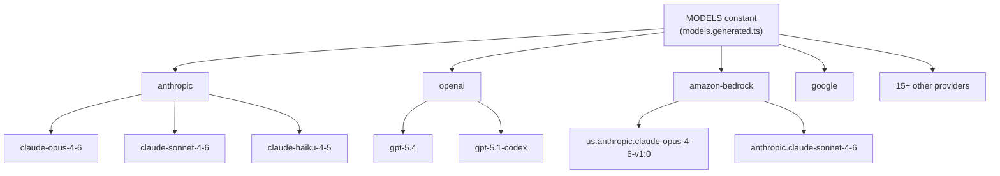
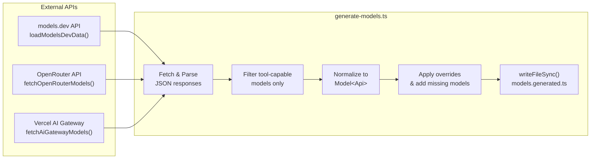
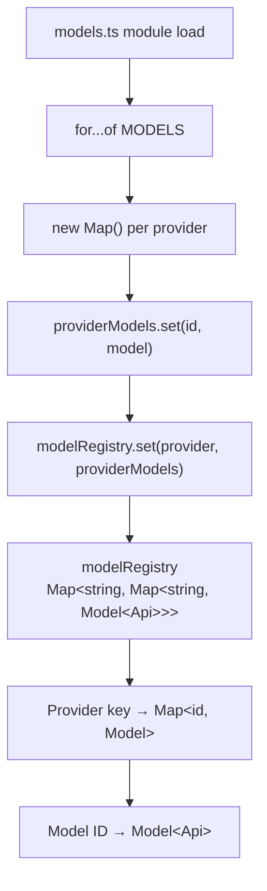
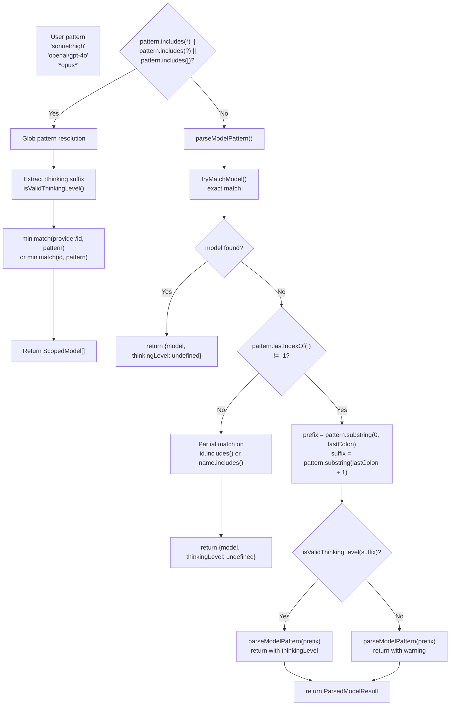
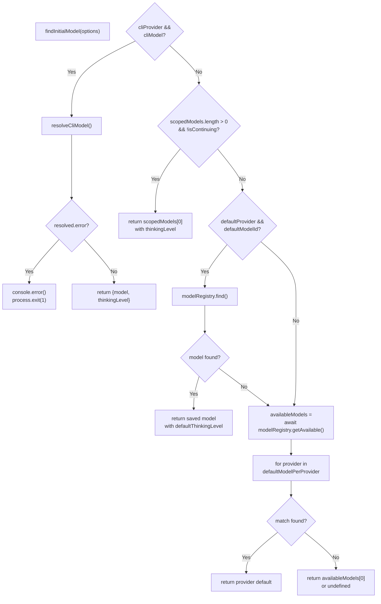
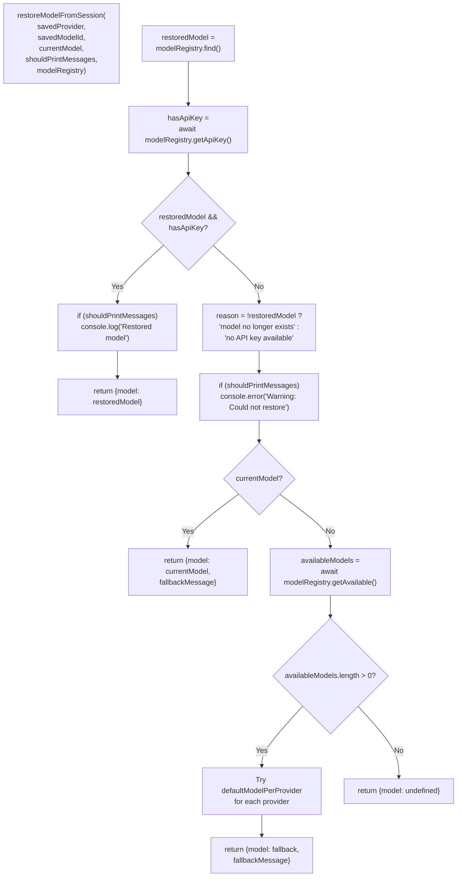

# Model Catalog & Resolution

<details>
<summary>Relevant source files</summary>

The following files were used as context for generating this wiki page:

- [packages/ai/scripts/generate-models.ts](packages/ai/scripts/generate-models.ts)
- [packages/ai/src/index.ts](packages/ai/src/index.ts)
- [packages/ai/src/models.generated.ts](packages/ai/src/models.generated.ts)
- [packages/ai/src/models.ts](packages/ai/src/models.ts)
- [packages/ai/src/providers/openai-codex-responses.ts](packages/ai/src/providers/openai-codex-responses.ts)
- [packages/ai/test/openai-codex-stream.test.ts](packages/ai/test/openai-codex-stream.test.ts)
- [packages/ai/test/supports-xhigh.test.ts](packages/ai/test/supports-xhigh.test.ts)
- [packages/coding-agent/src/core/model-resolver.ts](packages/coding-agent/src/core/model-resolver.ts)
- [packages/coding-agent/test/model-resolver.test.ts](packages/coding-agent/test/model-resolver.test.ts)

</details>

This document covers the model catalog system in the `pi-ai` package: how the catalog is generated, how models are stored in the registry, and how model patterns are resolved at runtime. For information about using models with the streaming API, see [Streaming API & Provider Implementations](#2.2). For details on thinking levels and provider-specific configuration, see [Message Transformation & Cross-Provider Handoffs](#2.3).

## Purpose and Scope

The model catalog provides a centralized, auto-generated registry of LLM models from multiple providers. It contains metadata for 100+ models including pricing, context windows, reasoning capabilities, and API requirements. The resolution system enables flexible model selection through pattern matching, fuzzy search, and provider-qualified lookups.

## Model Catalog Structure

### Generated Catalog

The catalog is defined in [packages/ai/src/models.generated.ts:1-1656]() as an auto-generated TypeScript file exported as the `MODELS` constant. Each model entry contains:

| Field           | Type                                     | Description                                                             |
| --------------- | ---------------------------------------- | ----------------------------------------------------------------------- |
| `id`            | `string`                                 | Unique model identifier within provider                                 |
| `name`          | `string`                                 | Human-readable display name                                             |
| `api`           | `Api`                                    | API interface type (e.g., `"anthropic-messages"`, `"openai-responses"`) |
| `provider`      | `KnownProvider`                          | Provider identifier (e.g., `"anthropic"`, `"openai"`)                   |
| `baseUrl`       | `string`                                 | API endpoint base URL                                                   |
| `reasoning`     | `boolean`                                | Whether model supports extended reasoning                               |
| `input`         | `("text" \| "image")[]`                  | Supported input modalities                                              |
| `cost`          | `{input, output, cacheRead, cacheWrite}` | Cost per million tokens (USD)                                           |
| `contextWindow` | `number`                                 | Maximum context length in tokens                                        |
| `maxTokens`     | `number`                                 | Maximum output tokens                                                   |
| `headers?`      | `Record<string, string>`                 | Static headers for requests                                             |
| `compat?`       | `{...}`                                  | Provider-specific compatibility flags                                   |

**Example model definition:**

```typescript
"claude-opus-4-6": {
  id: "claude-opus-4-6",
  name: "Claude Opus 4.6",
  api: "anthropic-messages",
  provider: "anthropic",
  baseUrl: "https://api.anthropic.com",
  reasoning: true,
  input: ["text", "image"],
  cost: { input: 5, output: 25, cacheRead: 0.5, cacheWrite: 6.25 },
  contextWindow: 1000000,
  maxTokens: 128000,
} satisfies Model<"anthropic-messages">
```

Sources: [packages/ai/src/models.generated.ts:733-748]()

### Catalog Organization

Models are organized by provider in a nested structure defined in `MODELS`:



Sources: [packages/ai/src/models.generated.ts:6-1656]()

## Catalog Generation Pipeline

### Data Sources

The catalog is generated by the `generateModels()` function in [packages/ai/scripts/generate-models.ts:640-934]() from three sources:

**Catalog Generation Pipeline**



Sources: [packages/ai/scripts/generate-models.ts:59-173](), [packages/ai/scripts/generate-models.ts:175-638](), [packages/ai/scripts/generate-models.ts:640-934]()

### Filtering Criteria

The generation script only includes models that meet specific requirements:

- **Tool support required**: `tool_call: true` (models.dev) or `tools` in `supported_parameters` (OpenRouter) or `"tool-use"` tag (AI Gateway)
- **Streaming support**: Must support streaming mode (excludes some Bedrock models like `ai21.jamba*`)
- **System message support**: Excludes models that don't support system messages (e.g., `mistral.mistral-7b-instruct-v0*`)
- **Non-deprecated**: Excludes models marked with `status: "deprecated"` in OpenCode variants

Sources: [packages/ai/scripts/generate-models.ts:68-69](), [packages/ai/scripts/generate-models.ts:136](), [packages/ai/scripts/generate-models.ts:188](), [packages/ai/scripts/generate-models.ts:191-199](), [packages/ai/scripts/generate-models.ts:479-480]()

### Cost Normalization

Costs from different sources are normalized to dollars per million tokens:

```typescript
// OpenRouter provides costs per token
const inputCost = parseFloat(model.pricing?.prompt || "0") * 1_000_000;

// models.dev provides costs per million tokens directly
cost: {
  input: m.cost?.input || 0,
  output: m.cost?.output || 0,
  cacheRead: m.cost?.cache_read || 0,
  cacheWrite: m.cost?.cache_write || 0,
}
```

Sources: [packages/ai/scripts/generate-models.ts:84-87](), [packages/ai/scripts/generate-models.ts:209-214]()

### Provider-Specific Handling

Different providers map to different API implementations:

| Provider                 | API Type                         | Base URL Handling                                           |
| ------------------------ | -------------------------------- | ----------------------------------------------------------- |
| `anthropic`              | `anthropic-messages`             | Direct: `https://api.anthropic.com`                         |
| `openai`                 | `openai-responses`               | Direct: `https://api.openai.com/v1`                         |
| `amazon-bedrock`         | `bedrock-converse-stream`        | Regional: `https://bedrock-runtime.us-east-1.amazonaws.com` |
| `google`                 | `google-generative-ai`           | Direct: `https://generativelanguage.googleapis.com/v1beta`  |
| `github-copilot`         | Multiple (based on model)        | `https://api.individual.githubcopilot.com`                  |
| `openrouter`             | `openai-completions`             | `https://openrouter.ai/api/v1`                              |
| `opencode`/`opencode-go` | Multiple (based on provider.npm) | `https://opencode.ai/zen`                                   |

Sources: [packages/ai/scripts/generate-models.ts:221-244](), [packages/ai/scripts/generate-models.ts:274-297](), [packages/ai/scripts/generate-models.ts:469-520](), [packages/ai/scripts/generate-models.ts:524-568]()

### Temporary Overrides

The script applies temporary overrides for metadata corrections not yet available upstream:

```typescript
// Fix incorrect cache pricing for Claude Opus 4.5
const opus45 = allModels.find(
  (m) => m.provider === 'anthropic' && m.id === 'claude-opus-4-5'
)
if (opus45) {
  opus45.cost.cacheRead = 0.5
  opus45.cost.cacheWrite = 6.25
}

// Correct Opus 4.6 context window
if (candidate.id.includes('opus-4-6')) {
  candidate.contextWindow = 200000
}
```

Sources: [packages/ai/scripts/generate-models.ts:656-703]()

## Model Registry

### In-Memory Registry

Models are loaded into a two-level map structure on module initialization:

**modelRegistry Initialization**



Sources: [packages/ai/src/models.ts:4-13]()

### Access Functions

The registry exposes type-safe access functions:

**`getModel<TProvider, TModelId>(provider, modelId)`** - Type-safe model lookup:

```typescript
const model = getModel('anthropic', 'claude-opus-4-6')
// Type inferred: Model<"anthropic-messages">
```

This function provides compile-time type inference for the model's API type based on provider and model ID.

**`getModels<TProvider>(provider)`** - Get all models for a provider:

```typescript
const anthropicModels = getModels('anthropic')
// Returns: Model<"anthropic-messages">[]
```

**`getProviders()`** - Get all available providers:

```typescript
const providers = getProviders()
// Returns: KnownProvider[] = ["anthropic", "openai", ...]
```

Sources: [packages/ai/src/models.ts:20-37]()

### Cost Calculation

The `calculateCost` function computes actual costs from token usage:

```typescript
calculateCost<TApi>(model: Model<TApi>, usage: Usage): Usage["cost"]
```

Formula per cost component:

```
cost = (model.cost.X / 1,000,000) × usage.X
```

Where X ∈ {input, output, cacheRead, cacheWrite}. Total cost is the sum of all components.

Sources: [packages/ai/src/models.ts:39-46]()

### Special Model Checks

**`supportsXhigh(model)` - Check for extended high reasoning support:**

Returns `true` for:

- GPT-5.2, GPT-5.3, GPT-5.4 model families
- Anthropic Opus 4.6 models on `anthropic-messages` API

This determines whether the model can use the `xhigh` thinking level, which maps to adaptive effort "max" on Anthropic or extended reasoning budgets on OpenAI.

Sources: [packages/ai/src/models.ts:48-65]()

**`modelsAreEqual(a, b)` - Deep equality check:**

Compares both `id` and `provider` fields. Returns `false` if either model is null/undefined.

Sources: [packages/ai/src/models.ts:67-77]()

## Model Resolution

### Resolution Flow

**resolveModelScope() Resolution Process**



Sources: [packages/coding-agent/src/core/model-resolver.ts:180-233](), [packages/coding-agent/src/core/model-resolver.ts:246-304]()

### Pattern Matching Algorithm

The `parseModelPattern` function handles complex patterns including OpenRouter-style models with colons in their IDs (e.g., `qwen/qwen3-coder:exacto`):

**Algorithm:**

1. Call `tryMatchModel(pattern, availableModels)` for exact match → return with `thinkingLevel: undefined`
2. If no match and `pattern.lastIndexOf(':')` != -1:
   - Split on last colon into `prefix` and `suffix`
   - If `isValidThinkingLevel(suffix)`: recurse on prefix, use this level
   - If suffix invalid and `allowInvalidThinkingLevelFallback`: recurse on prefix, return warning
   - If suffix invalid and strict mode: return undefined (fail to match)
3. If no colons, return undefined (no match found)

**`tryMatchModel()` fuzzy matching:**

- First try `findExactModelReferenceMatch()` (exact id or provider/id)
- Then filter by `id.toLowerCase().includes(pattern)` or `name.toLowerCase().includes(pattern)`
- **Preference order:**
  - Aliases (e.g., `claude-sonnet-4-5`) via `isAlias()` check
  - Latest dated version (e.g., `claude-sonnet-4-5-20250929`) by sorting descending

**`isAlias()` detection:**

- Returns `true` if id ends with `-latest`
- Returns `true` if id does NOT match pattern `/-\d{8}$/` (no YYYYMMDD date suffix)

Sources: [packages/coding-agent/src/core/model-resolver.ts:50-57](), [packages/coding-agent/src/core/model-resolver.ts:112-142](), [packages/coding-agent/src/core/model-resolver.ts:180-233]()

### Provider/Model Format

Patterns can include provider prefix to disambiguate:

| Pattern Format              | Example                             | Resolution                                    |
| --------------------------- | ----------------------------------- | --------------------------------------------- |
| `modelId`                   | `sonnet`                            | Fuzzy match across all providers              |
| `provider/modelId`          | `anthropic/sonnet`                  | Fuzzy match within provider                   |
| `provider/exact:id`         | `openrouter/openai/gpt-4o:extended` | Exact match for OpenRouter models with colons |
| `pattern:thinking`          | `sonnet:high`                       | Fuzzy match with thinking level               |
| `provider/pattern:thinking` | `anthropic/opus:medium`             | Provider-scoped with thinking level           |

Sources: [packages/coding-agent/src/core/model-resolver.ts:64-77](), [packages/coding-agent/src/core/model-resolver.ts:217-249]()

### Glob Patterns

Model scoping supports glob patterns for bulk selection:

```typescript
// Match all Sonnet models across providers
resolveModelScope(['*sonnet*'], modelRegistry)

// Match all models from a provider
resolveModelScope(['anthropic/*'], modelRegistry)

// Match with thinking level
resolveModelScope(['*opus*:high'], modelRegistry)
```

Patterns are matched against both `provider/modelId` and `modelId` formats using `minimatch` with `nocase: true`.

Sources: [packages/coding-agent/src/core/model-resolver.ts:218-249]()

### CLI Model Resolution

The `resolveCliModel` function handles `--provider` and `--model` flags with special handling for provider inference:

**Resolution priority:**

1. Check for explicit `--provider` flag
2. If `--model` contains `/`, try to infer provider from prefix
3. Try exact match (handles OpenRouter-style IDs with slashes)
4. Try fuzzy matching within provider (if specified) or across all providers
5. If still no match but provider was inferred, fall back to treating full input as model ID
6. If provider is known but model not found, build fallback custom model using provider defaults

**Key behavior:**

- `--model zai/glm-5` prefers provider=zai, model=glm-5 over gateway model with id="zai/glm-5"
- `--model openai/gpt-4o:extended` on OpenRouter resolves to the OpenRouter model with that full ID
- `--model provider/pattern` strips provider prefix if `--provider` is also specified
- Invalid thinking level suffixes are **rejected** in CLI mode (no fallback)

Sources: [packages/coding-agent/src/core/model-resolver.ts:294-424]()

### Thinking Level Suffixes

Valid thinking levels: `off`, `minimal`, `low`, `medium`, `high`, `xhigh`

**Behavior by context:**

| Context       | Invalid suffix   | Result                                      |
| ------------- | ---------------- | ------------------------------------------- |
| Model scoping | `sonnet:invalid` | Warning emitted, use default thinking level |
| CLI `--model` | `sonnet:invalid` | Error, model not found                      |

The distinction prevents CLI users from accidentally resolving to unintended models when they mistype thinking levels.

Sources: [packages/coding-agent/src/core/model-resolver.ts:167-177](), [packages/coding-agent/src/core/model-resolver.ts:374](), [packages/coding-agent/test/model-resolver.test.ts:273-285]()

## Default Model Selection

### Provider Defaults

The `defaultModelPerProvider` map specifies the preferred model for each provider:

```typescript
export const defaultModelPerProvider: Record<KnownProvider, string> = {
  'amazon-bedrock': 'us.anthropic.claude-opus-4-6-v1',
  anthropic: 'claude-opus-4-6',
  openai: 'gpt-5.4',
  'openai-codex': 'gpt-5.4',
  google: 'gemini-2.5-pro',
  'github-copilot': 'gpt-4o',
  openrouter: 'openai/gpt-5.1-codex',
  'vercel-ai-gateway': 'anthropic/claude-opus-4-6',
  // ... other providers
}
```

These defaults are used when:

- No specific model is provided
- A saved default model is unavailable
- Restoring from session and model is missing

Sources: [packages/coding-agent/src/core/model-resolver.ts:14-38]()

### Initial Model Selection

The `findInitialModel` function determines which model to use when starting a session:

**findInitialModel() Priority Flow**



**Priority order:**

1. CLI args (`--provider` + `--model`) via `resolveCliModel()` - exits on error
2. First scoped model (`scopedModels[0]`) if not continuing/resuming
3. Saved default from settings (`defaultProvider` + `defaultModelId` + `defaultThinkingLevel`)
4. First available model matching `defaultModelPerProvider` for any known provider
5. First available model (any provider)
6. `undefined` (requires user to configure API keys)

Sources: [packages/coding-agent/src/core/model-resolver.ts:474-554]()

### Session Restoration

When continuing or resuming a session, `restoreModelFromSession` attempts to restore the previous model:

**`restoreModelFromSession()` Logic**



**Restoration priority:**

1. Look up `savedProvider`/`savedModelId` via `modelRegistry.find()`
2. Check if API key is available via `modelRegistry.getApiKey()`
3. If successful: return restored model
4. If failed (model doesn't exist or no API key):
   - Log warning with reason if `shouldPrintMessages`
   - Fall back to `currentModel` (if set)
   - Otherwise, try to find any available model using `defaultModelPerProvider`
   - Return `undefined` if no models available

The function generates a `fallbackMessage` to inform the user about model substitution.

Sources: [packages/coding-agent/src/core/model-resolver.ts:559-628]()

## Integration with Coding Agent

The model resolver is used in [pi-coding-agent](#4) through the `ModelRegistry` class, which combines the catalog with runtime API key management. The resolver integrates with:

- **Settings system**: Default model stored in `.pi/settings.json`
- **Session persistence**: Active model saved in `context.jsonl`
- **Model cycling**: Switch between scoped models during session
- **Extension system**: Extensions can register custom models

For details on how models are used with the Agent runtime, see [AgentSession Lifecycle & Architecture](#4.2).

Sources: [packages/coding-agent/src/core/model-resolver.ts:1-4]()
