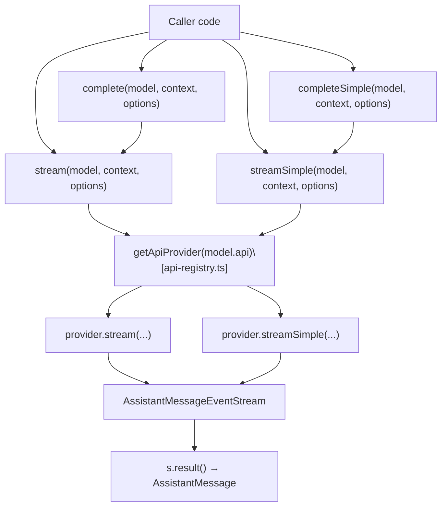
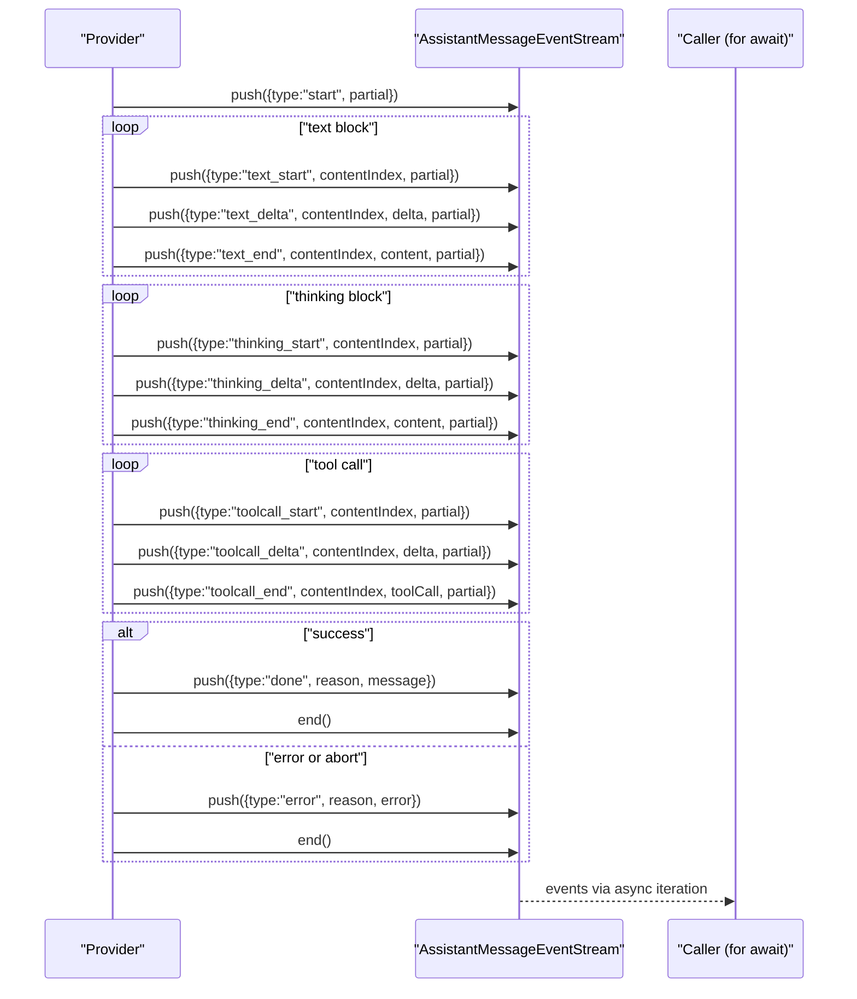
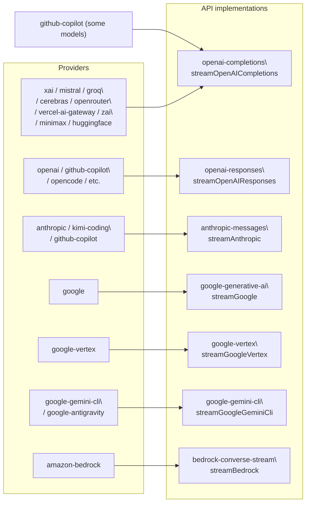
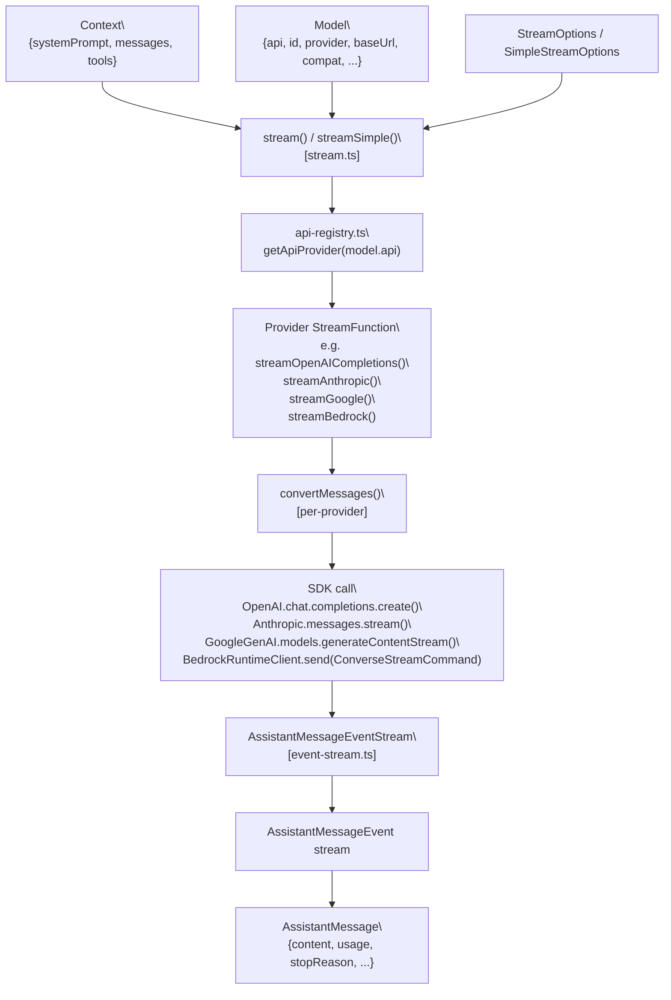

# Streaming API & Providers

Relevant source files

The following files were used as context for generating this wiki page:

- [packages/ai/README.md](packages/ai/README.md)
- [packages/ai/src/providers/anthropic.ts](packages/ai/src/providers/anthropic.ts)
- [packages/ai/src/providers/google.ts](packages/ai/src/providers/google.ts)
- [packages/ai/src/providers/openai-completions.ts](packages/ai/src/providers/openai-completions.ts)
- [packages/ai/src/providers/openai-responses.ts](packages/ai/src/providers/openai-responses.ts)
- [packages/ai/src/stream.ts](packages/ai/src/stream.ts)
- [packages/ai/src/types.ts](packages/ai/src/types.ts)

This page covers the dispatch mechanism in `@mariozechner/pi-ai` that routes calls from the top-level `stream` / `complete` / `streamSimple` / `completeSimple` functions to individual provider implementations. It documents the `StreamOptions` fields, the `AssistantMessageEventStream` event protocol, and the per-provider streaming functions for OpenAI Completions, OpenAI Responses, Anthropic, Google, and Amazon Bedrock.

For the model catalog and how `Model` objects are structured, see [2.1](). For authentication and OAuth credential resolution, see [2.3]().

---

## Dispatch Mechanism

The entry point is [`packages/ai/src/stream.ts`](). It imports all provider registrations, then delegates every call through the API registry.

**Dispatch flow diagram**

Sources: [packages/ai/src/stream.ts:1-60]()

Each provider is registered at startup by `packages/ai/src/providers/register-builtins.ts`. The registry maps an `Api` string (e.g. `"openai-completions"`) to an object with `stream` and `streamSimple` methods, both typed as `StreamFunction`.

| Export           | Function                                             | Description                           |
| ---------------- | ---------------------------------------------------- | ------------------------------------- |
| `stream`         | Low-level; passes options directly to the provider   | Returns `AssistantMessageEventStream` |
| `complete`       | Wraps `stream`, awaits `s.result()`                  | Returns `Promise<AssistantMessage>`   |
| `streamSimple`   | Translates `SimpleStreamOptions` to provider options | Returns `AssistantMessageEventStream` |
| `completeSimple` | Wraps `streamSimple`, awaits `s.result()`            | Returns `Promise<AssistantMessage>`   |

Sources: [packages/ai/src/stream.ts:26-60]()

---

## StreamOptions

`StreamOptions` is the base option bag shared by all providers. Provider-specific option interfaces extend it.

| Field             | Type                             | Description                                             |
| ----------------- | -------------------------------- | ------------------------------------------------------- |
| `temperature`     | `number?`                        | Sampling temperature                                    |
| `maxTokens`       | `number?`                        | Maximum output tokens                                   |
| `signal`          | `AbortSignal?`                   | Cancellation signal                                     |
| `apiKey`          | `string?`                        | Override API key for this request                       |
| `headers`         | `Record<string, string>?`        | Extra HTTP headers merged with provider defaults        |
| `cacheRetention`  | `"none" \| "short" \| "long"`    | Prompt cache preference (default `"short"`)             |
| `sessionId`       | `string?`                        | Provider-level session/cache key                        |
| `onPayload`       | `(payload: unknown) => void`     | Debug callback to inspect the raw provider payload      |
| `metadata`        | `Record<string, unknown>?`       | Provider-specific extras (e.g. Anthropic `user_id`)     |
| `maxRetryDelayMs` | `number?`                        | Cap on server-requested retry delays (default 60000 ms) |
| `transport`       | `"sse" \| "websocket" \| "auto"` | Preferred transport (provider-dependent)                |

`SimpleStreamOptions` extends `StreamOptions` with a unified reasoning field:

| Field             | Type               | Description                                           |
| ----------------- | ------------------ | ----------------------------------------------------- |
| `reasoning`       | `ThinkingLevel?`   | `"minimal" \| "low" \| "medium" \| "high" \| "xhigh"` |
| `thinkingBudgets` | `ThinkingBudgets?` | Per-level token budgets for token-based providers     |

Sources: [packages/ai/src/types.ts:53-112]()

---

## AssistantMessageEventStream & Events

Every provider function returns an `AssistantMessageEventStream`, an async-iterable that emits `AssistantMessageEvent` values and resolves to a final `AssistantMessage` via `.result()`.

**Event sequence diagram**

Sources: [packages/ai/src/types.ts:212-224]()

### Complete event reference

| Event type       | Key fields                            | Notes                                                                               |
| ---------------- | ------------------------------------- | ----------------------------------------------------------------------------------- |
| `start`          | `partial: AssistantMessage`           | Emitted once before any content                                                     |
| `text_start`     | `contentIndex`                        | New text block started                                                              |
| `text_delta`     | `contentIndex`, `delta: string`       | Incremental text chunk                                                              |
| `text_end`       | `contentIndex`, `content: string`     | Full text for the block                                                             |
| `thinking_start` | `contentIndex`                        | New thinking block started                                                          |
| `thinking_delta` | `contentIndex`, `delta: string`       | Incremental thinking chunk                                                          |
| `thinking_end`   | `contentIndex`, `content: string`     | Full thinking for the block                                                         |
| `toolcall_start` | `contentIndex`                        | New tool call started                                                               |
| `toolcall_delta` | `contentIndex`, `delta: string`       | Partial JSON chunk; `partial.content[contentIndex].arguments` is best-effort parsed |
| `toolcall_end`   | `contentIndex`, `toolCall: ToolCall`  | Fully parsed tool call                                                              |
| `done`           | `reason`, `message: AssistantMessage` | Normal termination; `reason` is `"stop" \| "length" \| "toolUse"`                   |
| `error`          | `reason`, `error: AssistantMessage`   | Error or abort; `reason` is `"error" \| "aborted"`                                  |

Sources: [packages/ai/src/types.ts:212-224](), [packages/ai/README.md:362-378]()

### StopReason values

| Value       | Meaning                             |
| ----------- | ----------------------------------- |
| `"stop"`    | Model finished normally             |
| `"length"`  | Hit `maxTokens` limit               |
| `"toolUse"` | Model is requesting tool execution  |
| `"error"`   | Provider error                      |
| `"aborted"` | Request cancelled via `AbortSignal` |

Sources: [packages/ai/src/types.ts:166]()

---

## Provider Implementations

**Provider-to-API mapping**

Sources: [packages/ai/README.md:621-631](), [packages/ai/src/types.ts:5-14]()

---

### OpenAI Completions (`openai-completions`)

File: [packages/ai/src/providers/openai-completions.ts]()

**Function:** `streamOpenAICompletions` / `streamSimpleOpenAICompletions`

Used by a large set of OpenAI-compatible providers: Mistral, xAI, Groq, Cerebras, OpenRouter, Vercel AI Gateway, MiniMax, Hugging Face, and custom endpoints.

`OpenAICompletionsOptions` extends `StreamOptions`:

| Field             | Values                                                     | Description                                                 |
| ----------------- | ---------------------------------------------------------- | ----------------------------------------------------------- |
| `toolChoice`      | `"auto" \| "none" \| "required" \| {type:"function", ...}` | Force or suppress tool use                                  |
| `reasoningEffort` | `"minimal" \| "low" \| "medium" \| "high" \| "xhigh"`      | Reasoning effort for models that support `reasoning_effort` |

The `compat` field on the `Model` object controls provider-specific wire-format differences. Compatibility is auto-detected from `provider` and `baseUrl`, or can be overridden explicitly.

| Compat flag                        | Default                   | Effect when true/set                                                          |
| ---------------------------------- | ------------------------- | ----------------------------------------------------------------------------- |
| `supportsStore`                    | `true`                    | Send `store: false` in params                                                 |
| `supportsDeveloperRole`            | `true`                    | Use `developer` role for system on reasoning models                           |
| `supportsReasoningEffort`          | `true`                    | Include `reasoning_effort` in params                                          |
| `supportsUsageInStreaming`         | `true`                    | Include `stream_options: { include_usage: true }`                             |
| `supportsStrictMode`               | `true`                    | Include `strict: false` in tool definitions                                   |
| `maxTokensField`                   | `"max_completion_tokens"` | Use `max_tokens` for Mistral/Chutes                                           |
| `requiresToolResultName`           | `false`                   | Send `name` field on tool results (Mistral)                                   |
| `requiresAssistantAfterToolResult` | `false`                   | Insert synthetic assistant message between tool result and user message       |
| `requiresThinkingAsText`           | `false`                   | Serialize thinking blocks as plain text                                       |
| `requiresMistralToolIds`           | `false`                   | Normalize tool IDs to exactly 9 alphanumeric chars                            |
| `thinkingFormat`                   | `"openai"`                | `"openai"` → `reasoning_effort`; `"zai"` / `"qwen"` → `enable_thinking: bool` |

Sources: [packages/ai/src/providers/openai-completions.ts:73-76](), [packages/ai/src/providers/openai-completions.ts:758-824](), [packages/ai/src/types.ts:230-256]()

**Message conversion** is handled by `convertMessages` which:

- Prepends `system` / `developer` role for the system prompt
- Maps `user`, `assistant`, `toolResult` message roles
- Batches consecutive `toolResult` messages (images are re-attached as a user message)
- Strips empty assistant messages (which can occur after aborts)

Sources: [packages/ai/src/providers/openai-completions.ts:486-716]()

**OpenRouter-specific:** When `model.baseUrl` contains `openrouter.ai` and `model.compat.openRouterRouting` is set, an additional `provider` field is sent in the request body.

**Vercel AI Gateway:** When `model.baseUrl` contains `ai-gateway.vercel.sh` and `model.compat.vercelGatewayRouting` has `only` or `order`, a `providerOptions.gateway` object is added.

Sources: [packages/ai/src/providers/openai-completions.ts:434-450]()

---

### OpenAI Responses (`openai-responses`)

File: [packages/ai/src/providers/openai-responses.ts]()

**Function:** `streamOpenAIResponses` / `streamSimpleOpenAIResponses`

Used by OpenAI models (gpt-5, o-series), GitHub Copilot (Responses-mode), opencode, and Azure OpenAI (via a separate `azure-openai-responses` API).

`OpenAIResponsesOptions` extends `StreamOptions`:

| Field              | Values                                                | Description                                         |
| ------------------ | ----------------------------------------------------- | --------------------------------------------------- |
| `reasoningEffort`  | `"minimal" \| "low" \| "medium" \| "high" \| "xhigh"` | Reasoning effort                                    |
| `reasoningSummary` | `"auto" \| "detailed" \| "concise" \| null`           | Reasoning summary visibility                        |
| `serviceTier`      | `"flex" \| "priority" \| ...`                         | Service tier (flex = 0.5× cost, priority = 2× cost) |

The Responses API uses `prompt_cache_key` + `prompt_cache_retention` for caching. For direct `api.openai.com` calls with `cacheRetention: "long"`, `prompt_cache_retention: "24h"` is sent.

When `reasoningEffort` is set and the model supports reasoning, the `reasoning` object and `include: ["reasoning.encrypted_content"]` are added so reasoning signatures are retained for multi-turn continuity.

Sources: [packages/ai/src/providers/openai-responses.ts:52-57](), [packages/ai/src/providers/openai-responses.ts:184-237]()

---

### Anthropic (`anthropic-messages`)

File: [packages/ai/src/providers/anthropic.ts]()

**Functions:** `streamAnthropic` / `streamSimpleAnthropic`

`AnthropicOptions` extends `StreamOptions`:

| Field                  | Type                                                      | Description                                              |
| ---------------------- | --------------------------------------------------------- | -------------------------------------------------------- |
| `thinkingEnabled`      | `boolean?`                                                | Activate extended thinking                               |
| `thinkingBudgetTokens` | `number?`                                                 | Token budget for thinking (older models only)            |
| `effort`               | `"low" \| "medium" \| "high" \| "max"`                    | Effort level for adaptive thinking (Opus 4.6/Sonnet 4.6) |
| `interleavedThinking`  | `boolean?`                                                | Request interleaved thinking beta header                 |
| `toolChoice`           | `"auto" \| "any" \| "none" \| {type:"tool", name:string}` | Tool use control                                         |

**Thinking modes:**

| Model family         | Mode                  | API field                                                     |
| -------------------- | --------------------- | ------------------------------------------------------------- |
| Opus 4.6, Sonnet 4.6 | Adaptive thinking     | `thinking: { type: "adaptive" }`, `output_config: { effort }` |
| Older Claude models  | Budget-based thinking | `thinking: { type: "enabled", budget_tokens: N }`             |

**OAuth stealth mode:** When the API key is an OAuth token (`sk-ant-oat` prefix), the client sets `user-agent: claude-cli/<version>`, `x-app: cli`, and the `claude-code-20250219` beta header. Tool names are canonicalized to Claude Code casing (e.g., `read` → `Read`) via `toClaudeCodeName`.

**Caching:** The `cacheRetention` option maps to Anthropic's `cache_control: { type: "ephemeral" }`. For direct `api.anthropic.com` calls with `cacheRetention: "long"`, `ttl: "1h"` is added. Cache control is applied to the system prompt block and the last user message.

Sources: [packages/ai/src/providers/anthropic.ts:155-181](), [packages/ai/src/providers/anthropic.ts:426-496](), [packages/ai/src/providers/anthropic.ts:498-585]()

---

### Google Generative AI (`google-generative-ai`)

File: [packages/ai/src/providers/google.ts]()

**Functions:** `streamGoogle` / `streamSimpleGoogle`

`GoogleOptions` extends `StreamOptions`:

| Field                   | Type                        | Description                                                     |
| ----------------------- | --------------------------- | --------------------------------------------------------------- |
| `toolChoice`            | `"auto" \| "none" \| "any"` | Tool use mode                                                   |
| `thinking.enabled`      | `boolean`                   | Enable thinking                                                 |
| `thinking.budgetTokens` | `number?`                   | Token budget (`-1` = dynamic, `0` = disable)                    |
| `thinking.level`        | `GoogleThinkingLevel?`      | For Gemini 3 models: `"MINIMAL" \| "LOW" \| "MEDIUM" \| "HIGH"` |

`streamSimpleGoogle` maps `ThinkingLevel` to Google-specific parameters:

- Gemini 3 Pro and 3 Flash: use `level`-based thinking
- Gemini 2.5 Pro/Flash: use `budgetTokens` with level-specific defaults
- No reasoning → `thinking: { enabled: false }`

**Note:** Google does not support streaming tool call arguments. Each tool call is emitted as a single `toolcall_start → toolcall_delta → toolcall_end` burst with complete arguments.

Sources: [packages/ai/src/providers/google.ts:36-43](), [packages/ai/src/providers/google.ts:271-306]()

---

### Amazon Bedrock (`bedrock-converse-stream`)

File: [packages/ai/src/providers/amazon-bedrock.ts]()

**Functions:** `streamBedrock` / `streamSimpleBedrock`

`BedrockOptions` extends `StreamOptions`:

| Field                 | Type                                                     | Description                                               |
| --------------------- | -------------------------------------------------------- | --------------------------------------------------------- |
| `region`              | `string?`                                                | AWS region (falls back to `AWS_REGION`, then `us-east-1`) |
| `profile`             | `string?`                                                | AWS named profile                                         |
| `toolChoice`          | `"auto" \| "any" \| "none" \| {type:"tool",name:string}` | Tool use control                                          |
| `reasoning`           | `ThinkingLevel?`                                         | Thinking level for Claude on Bedrock                      |
| `thinkingBudgets`     | `ThinkingBudgets?`                                       | Custom per-level token budgets                            |
| `interleavedThinking` | `boolean?`                                               | Interleaved thinking for Claude 4.x                       |

Bedrock uses the AWS SDK `ConverseStreamCommand`. Authentication is handled entirely by the AWS SDK credential chain (IAM keys, profiles, ECS task roles, IRSA). Custom proxy support is provided via `HTTP_PROXY` / `HTTPS_PROXY` environment variables using `proxy-agent` + `NodeHttpHandler`.

Special environment variables for Bedrock:

| Variable                           | Effect                                        |
| ---------------------------------- | --------------------------------------------- |
| `AWS_BEDROCK_SKIP_AUTH=1`          | Use dummy credentials (for auth-free proxies) |
| `AWS_BEDROCK_FORCE_HTTP1=1`        | Use HTTP/1.1 instead of HTTP/2                |
| `AWS_ENDPOINT_URL_BEDROCK_RUNTIME` | Override Bedrock endpoint URL                 |

Sources: [packages/ai/src/providers/amazon-bedrock.ts:48-58](), [packages/ai/src/providers/amazon-bedrock.ts:90-134]()

---

## Error Handling

### General pattern

Every provider wraps its async loop in `try/catch`. On any exception:

1. `output.stopReason` is set to `"aborted"` if `signal.aborted`, otherwise `"error"`.
2. `output.errorMessage` is populated from the exception message.
3. An `{ type: "error", reason, error: output }` event is pushed.
4. The stream is ended.

Callers can inspect partial content and usage from `error.content` and `error.usage` even after an error.

Sources: [packages/ai/src/providers/openai-completions.ts:310-319](), [packages/ai/src/providers/anthropic.ts:411-417](), [packages/ai/src/providers/amazon-bedrock.ts:191-201]()

### Context overflow

When the input tokens exceed the model's context window, the provider returns a regular error with `stopReason: "error"`. The utility function `isContextOverflow` (in `packages/ai/src/utils/overflow.ts`) inspects the `errorMessage` string to detect this condition across all providers. The `agentLoop` in `pi-agent-core` uses this to surface a distinct user-facing error rather than retrying.

### Rate limits

Rate limit errors from providers propagate as `stopReason: "error"` with the provider's rate-limit message in `errorMessage`. For OpenRouter errors, the `error.metadata.raw` field is appended to `errorMessage` to provide additional context.

Sources: [packages/ai/src/providers/openai-completions.ts:314-316](), [packages/ai/test/context-overflow.test.ts:1-95]()

---

## Abort Handling

Pass an `AbortSignal` via `options.signal`. The signal is forwarded to the underlying SDK call. After the streaming loop ends:

1. If `signal.aborted`, the provider throws `"Request was aborted"`.
2. The catch block sets `stopReason = "aborted"`.
3. Any partial content already accumulated is preserved.

An aborted `AssistantMessage` can be added to `context.messages` and the conversation can be continued in the next request. Providers handle empty or aborted messages in their `convertMessages` functions by skipping blocks with no content.

Sources: [packages/ai/src/providers/openai-completions.ts:300-307](), [packages/ai/src/providers/anthropic.ts:401-407](), [packages/ai/test/abort.test.ts:18-60]()

---

## Data-flow through a provider call

**End-to-end data flow**

Sources: [packages/ai/src/stream.ts](), [packages/ai/src/providers/openai-completions.ts](), [packages/ai/src/providers/anthropic.ts](), [packages/ai/src/providers/google.ts](), [packages/ai/src/providers/amazon-bedrock.ts]()
