# AgentSession Lifecycle & Architecture

<details>
<summary>Relevant source files</summary>

The following files were used as context for generating this wiki page:

- [packages/coding-agent/src/core/agent-session.ts](packages/coding-agent/src/core/agent-session.ts)
- [packages/coding-agent/src/core/sdk.ts](packages/coding-agent/src/core/sdk.ts)
- [packages/coding-agent/src/modes/interactive/interactive-mode.ts](packages/coding-agent/src/modes/interactive/interactive-mode.ts)
- [packages/coding-agent/src/modes/print-mode.ts](packages/coding-agent/src/modes/print-mode.ts)
- [packages/coding-agent/src/modes/rpc/rpc-mode.ts](packages/coding-agent/src/modes/rpc/rpc-mode.ts)

</details>

## Purpose and Scope

This page documents the `AgentSession` class, which serves as the central orchestrator for the coding agent's runtime. It coordinates between the core agent loop ([pi-agent-core](#3)), session persistence ([SessionManager](#4.3)), configuration ([SettingsManager](#4.6)), and the extension system ([Extension System](#4.4)).

For information about session persistence and history management, see [Session Management & History Tree](#4.3). For tool execution details, see [Tool Execution & Built-in Tools](#4.5). For extension lifecycle and hooks, see [Extension System](#4.4).

## Overview

`AgentSession` wraps an `Agent` instance from `@mariozechner/pi-agent-core` and adds session-specific functionality:

- **Event emission**: Extends `AgentEvent` with session-specific events (`auto_compaction_start`, `auto_retry_start`, etc.)
- **State management**: Coordinates session persistence, model changes, thinking level changes
- **Tool registry**: Manages active tools, extension tools, and tool metadata
- **System prompt building**: Aggregates skills, context files, and extension modifications
- **Auto-compaction**: Monitors context usage and triggers compaction when thresholds are exceeded
- **Auto-retry**: Retries failed requests with exponential backoff
- **Extension integration**: Binds `ExtensionRunner` and emits events to extensions

The class is mode-agnostic and used by all run modes: interactive, print, and RPC.

**Sources:** [packages/coding-agent/src/core/agent-session.ts:1-82]()

## Class Structure

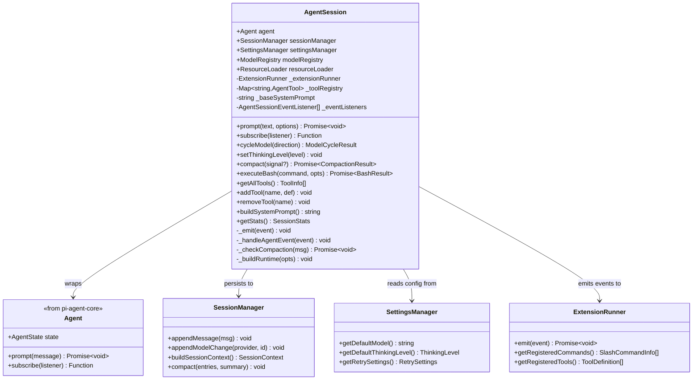

**AgentSession Core Properties**

| Property            | Type                          | Purpose                                      |
| ------------------- | ----------------------------- | -------------------------------------------- |
| `agent`             | `Agent`                       | Core agent instance from pi-agent-core       |
| `sessionManager`    | `SessionManager`              | Session persistence and history tree         |
| `settingsManager`   | `SettingsManager`             | Configuration (global and project)           |
| `modelRegistry`     | `ModelRegistry`               | API key resolution and model discovery       |
| `resourceLoader`    | `ResourceLoader`              | Skills, prompts, themes, extensions          |
| `_extensionRunner`  | `ExtensionRunner?`            | Extension lifecycle and event dispatch       |
| `_toolRegistry`     | `Map<string, AgentTool>`      | Active tools available to the LLM            |
| `_baseSystemPrompt` | `string`                      | System prompt before extension modifications |
| `_eventListeners`   | `AgentSessionEventListener[]` | Subscribers to session events                |

**Sources:** [packages/coding-agent/src/core/agent-session.ts:213-276]()

## Creation and Initialization

### Factory Function: `createAgentSession()`

The recommended way to create an `AgentSession` is via the `createAgentSession()` factory function, which handles default initialization and model resolution.

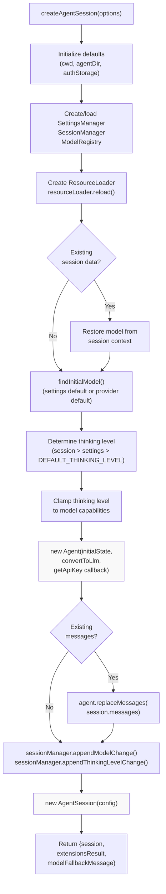

**Key Initialization Steps:**

1. **Default resolution**: If not provided, creates `AuthStorage`, `ModelRegistry`, `SettingsManager`, `SessionManager`, and `ResourceLoader` with default paths
2. **Model restoration**: If session has existing messages, attempts to restore the previous model
3. **Model fallback**: Falls back to `findInitialModel()` which checks settings defaults, then provider defaults
4. **Thinking level**: Restores from session if available, else uses settings default or `DEFAULT_THINKING_LEVEL`
5. **Capability clamping**: Sets thinking level to `"off"` if model doesn't support reasoning
6. **Agent creation**: Creates `Agent` with initial state and `getApiKey` callback that uses `ModelRegistry`
7. **Message replay**: If continuing a session, replays messages into the agent's state
8. **AgentSession creation**: Wraps the agent with session-specific functionality

**Sources:** [packages/coding-agent/src/core/sdk.ts:165-373]()

### Constructor Configuration

The `AgentSession` constructor accepts a configuration object:

```typescript
interface AgentSessionConfig {
  agent: Agent
  sessionManager: SessionManager
  settingsManager: SettingsManager
  cwd: string
  scopedModels?: Array<{ model: Model<any>; thinkingLevel?: ThinkingLevel }>
  resourceLoader: ResourceLoader
  customTools?: ToolDefinition[]
  modelRegistry: ModelRegistry
  initialActiveToolNames?: string[]
  baseToolsOverride?: Record<string, AgentTool>
  extensionRunnerRef?: { current?: ExtensionRunner }
}
```

The constructor immediately:

1. Subscribes to agent events via `this.agent.subscribe(this._handleAgentEvent)`
2. Calls `this._buildRuntime()` to initialize tools and system prompt

**Sources:** [packages/coding-agent/src/core/agent-session.ts:132-151](), [packages/coding-agent/src/core/agent-session.ts:278-299]()

## Lifecycle Phases

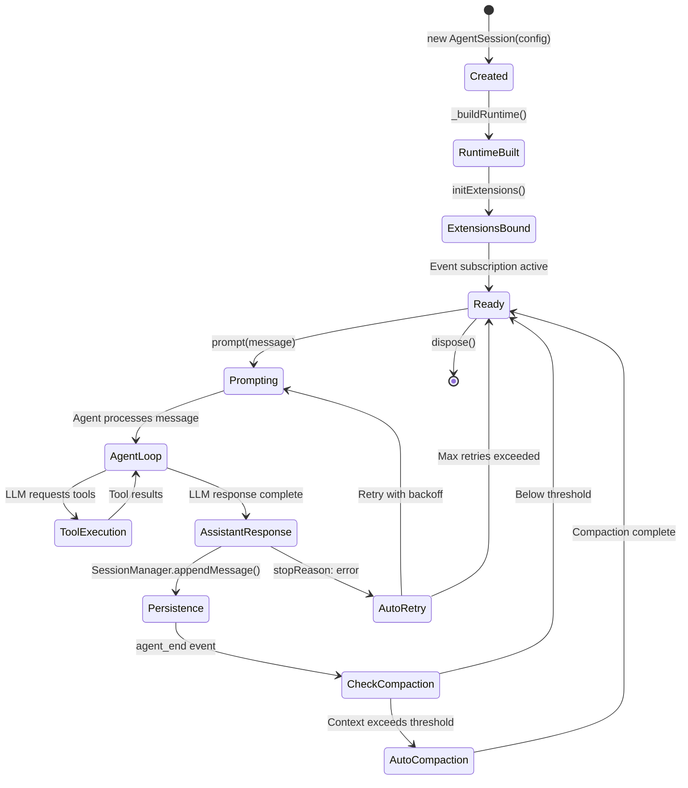

**Phase Descriptions:**

| Phase               | Trigger                             | Actions                                                               |
| ------------------- | ----------------------------------- | --------------------------------------------------------------------- |
| **Created**         | `new AgentSession()`                | Agent event subscription, store config                                |
| **RuntimeBuilt**    | Constructor calls `_buildRuntime()` | Build tool registry, system prompt, wrap tools                        |
| **ExtensionsBound** | `initExtensions()` called by mode   | Load extensions, bind UI/command context, register tools              |
| **Ready**           | After binding complete              | Waiting for `prompt()` calls                                          |
| **Prompting**       | `prompt(message)` called            | Pre-process message, emit `before_agent_start`, call `agent.prompt()` |
| **AgentLoop**       | Agent streaming begins              | Emit `message_start`, `message_update`, `tool_execution_*` events     |
| **Persistence**     | `message_end` event                 | Write message to session file via `SessionManager`                    |
| **CheckCompaction** | `agent_end` event                   | Check context usage vs thresholds                                     |
| **AutoRetry**       | `stopReason: "error"`               | Exponential backoff retry for retryable errors                        |

**Sources:** [packages/coding-agent/src/core/agent-session.ts:291-299](), [packages/coding-agent/src/core/agent-session.ts:914-955](), [packages/coding-agent/src/core/agent-session.ts:320-452]()

## Event System

### Event Types

`AgentSession` extends `AgentEvent` from pi-agent-core with session-specific events:

```typescript
type AgentSessionEvent =
  | AgentEvent // Core events from pi-agent-core
  | { type: 'auto_compaction_start'; reason: 'threshold' | 'overflow' }
  | {
      type: 'auto_compaction_end'
      result?: CompactionResult
      aborted: boolean
      willRetry: boolean
      errorMessage?: string
    }
  | {
      type: 'auto_retry_start'
      attempt: number
      maxAttempts: number
      delayMs: number
      errorMessage: string
    }
  | {
      type: 'auto_retry_end'
      success: boolean
      attempt: number
      finalError?: string
    }
```

**Core Agent Events** (forwarded from `Agent`):

| Event Type              | When Emitted                 | Payload                                           |
| ----------------------- | ---------------------------- | ------------------------------------------------- |
| `agent_start`           | Agent begins processing      | `{ messages: AgentMessage[] }`                    |
| `agent_end`             | Agent completes processing   | `{ messages: AgentMessage[] }`                    |
| `message_start`         | New message begins streaming | `{ message: AgentMessage }`                       |
| `message_update`        | Message content updates      | `{ message: AgentMessage; delta: string }`        |
| `message_end`           | Message complete             | `{ message: AgentMessage }`                       |
| `tool_execution_start`  | Tool execution begins        | `{ toolCall: ToolCall; tool: AgentTool }`         |
| `tool_execution_update` | Tool emits progress update   | `{ toolCall: ToolCall; update: string }`          |
| `tool_execution_end`    | Tool execution completes     | `{ toolCall: ToolCall; result: AgentToolResult }` |
| `turn_start`            | New conversation turn begins | `{ turnIndex: number }`                           |
| `turn_end`              | Conversation turn completes  | `{ turnIndex: number }`                           |

**Sources:** [packages/coding-agent/src/core/agent-session.ts:112-126]()

### Event Flow

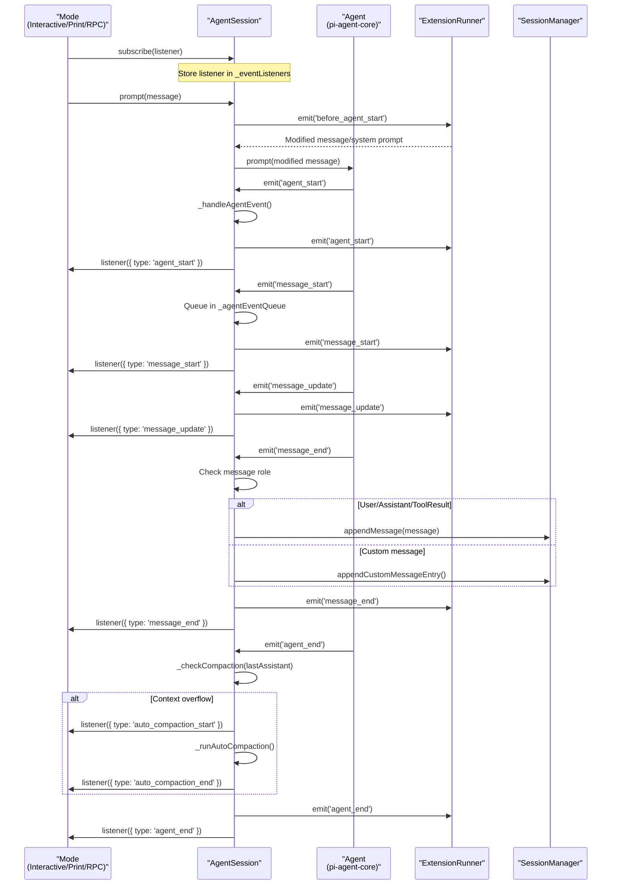

**Event Processing Details:**

1. **Serialized queue**: All agent events are processed through `_agentEventQueue` to ensure sequential handling and avoid race conditions
2. **Extension priority**: Extensions receive events before mode listeners
3. **Automatic persistence**: `message_end` events trigger automatic session persistence via `SessionManager`
4. **Queue tracking**: User message starts remove corresponding messages from `_steeringMessages` or `_followUpMessages` queues before emission
5. **Auto-compaction trigger**: `agent_end` events check last assistant message usage and trigger compaction if needed

**Sources:** [packages/coding-agent/src/core/agent-session.ts:320-452](), [packages/coding-agent/src/core/agent-session.ts:310-336]()

## Component Orchestration

```mermaid
graph TB
    subgraph "AgentSession Orchestration Layer"
        Session["AgentSession"]
    end

    subgraph "Core Agent Runtime"
        Agent["Agent<br/>(pi-agent-core)"]
        AgentState["AgentState<br/>{messages, model,<br/>thinkingLevel, tools}"]
        Agent --> AgentState
    end

    subgraph "Persistence Layer"
        SessionMgr["SessionManager"]
        SessionFile["context.jsonl<br/>(session file)"]
        SessionMgr --> SessionFile
    end

    subgraph "Configuration Layer"
        SettingsMgr["SettingsManager"]
        GlobalSettings["~/.pi/agent/settings.json"]
        ProjectSettings[".pi/settings.json"]
        SettingsMgr --> GlobalSettings
        SettingsMgr --> ProjectSettings
    end

    subgraph "Resource Layer"
        ResourceLoader["ResourceLoader"]
        Skills["Skills<br/>(SKILL.md files)"]
        Prompts["Prompt Templates"]
        Extensions["Extensions"]
        ContextFiles["Context Files<br/>(CONTEXT.md)"]
        ResourceLoader --> Skills
        ResourceLoader --> Prompts
        ResourceLoader --> Extensions
        ResourceLoader --> ContextFiles
    end

    subgraph "Extension Layer"
        ExtRunner["ExtensionRunner"]
        ExtTools["Extension Tools"]
        ExtCommands["Extension Commands"]
        ExtHooks["Extension Hooks"]
        ExtRunner --> ExtTools
        ExtRunner --> ExtCommands
        ExtRunner --> ExtHooks
    end

    subgraph "Model Layer"
        ModelReg["ModelRegistry"]
        AuthStorage["AuthStorage"]
        ModelsJson["models.json<br/>(custom models)"]
        ModelReg --> AuthStorage
        ModelReg --> ModelsJson
    end

    Session --> Agent
    Session --> SessionMgr
    Session --> SettingsMgr
    Session --> ResourceLoader
    Session --> ExtRunner
    Session --> ModelReg

    Session -.reads model/thinking level.-> SettingsMgr
    Session -.loads skills/prompts.-> ResourceLoader
    Session -.emits events to.-> ExtRunner
    Session -.persists messages to.-> SessionMgr
    Session -.resolves API keys via.-> ModelReg
    Session -.builds system prompt from.-> Skills
    Session -.builds system prompt from.-> ContextFiles
    Session -.wraps tools from.-> ExtRunner
    Agent -.streams to.-> Session
```

**Orchestration Responsibilities:**

| Component           | AgentSession's Role                                                          |
| ------------------- | ---------------------------------------------------------------------------- |
| **Agent**           | Wraps instance, subscribes to events, delegates prompt calls                 |
| **SessionManager**  | Persists messages, model changes, thinking level changes, compaction entries |
| **SettingsManager** | Reads defaults, retry settings, tool toggles, compaction thresholds          |
| **ResourceLoader**  | Loads skills, prompts, extensions, context files for system prompt           |
| **ExtensionRunner** | Binds after initialization, emits events, collects registered tools/commands |
| **ModelRegistry**   | Resolves API keys dynamically via `getApiKey` callback to Agent              |

**Sources:** [packages/coding-agent/src/core/agent-session.ts:213-276](), [packages/coding-agent/src/core/agent-session.ts:1092-1202]()

## Runtime Building

### Tool Registry Management

The tool registry is built in `_buildRuntime()` and can be modified at runtime:

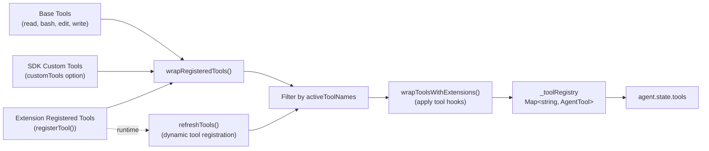

**Tool Registration Flow:**

1. **Initial tools** (constructor): Loads base tools from `createAllTools()`, SDK custom tools, and extension tools
2. **Wrapping**: `wrapRegisteredTools()` adds metadata (name, description, parameters, `promptSnippet`, `promptGuidelines`)
3. **Filtering**: Only tools in `activeToolNames` are included
4. **Extension wrapping**: `wrapToolsWithExtensions()` applies `tool_execution_start`/`end` hooks
5. **Registry update**: Updates `_toolRegistry` and `agent.state.tools`

**Dynamic Tool Methods:**

- `addTool(name, definition)`: Activates a previously registered tool or adds a new one
- `removeTool(name)`: Deactivates a tool (removes from active list)
- `getAllTools()`: Returns `ToolInfo[]` with name, description, parameters for all active tools
- `refreshTools()`: Called by extensions to apply runtime tool registrations

**Sources:** [packages/coding-agent/src/core/agent-session.ts:1092-1202](), [packages/coding-agent/src/core/agent-session.ts:1204-1257]()

### System Prompt Building

System prompt is built from multiple sources and cached as `_baseSystemPrompt`:

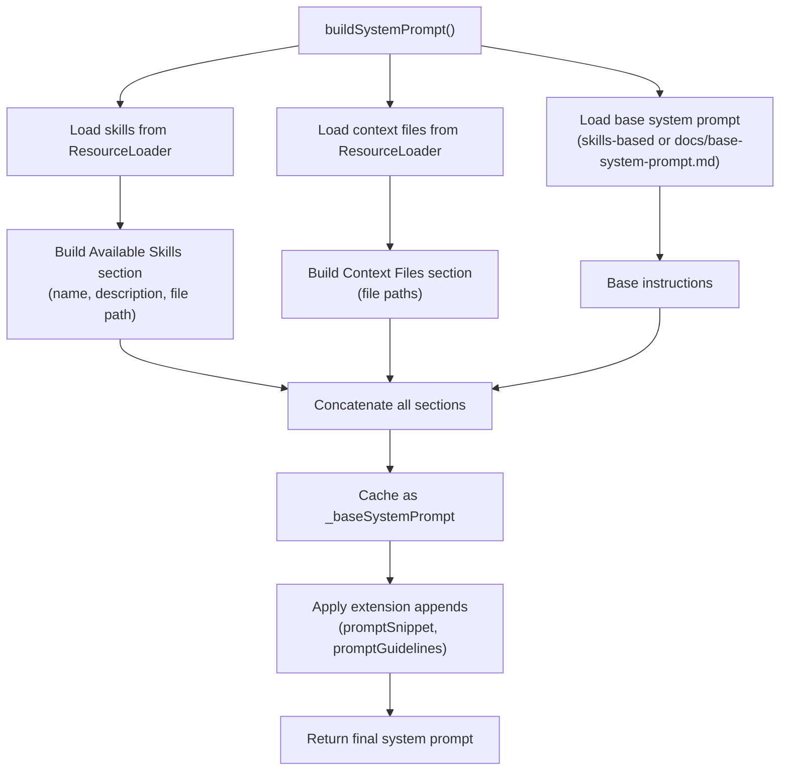

**System Prompt Sections:**

1. **Base system prompt**: From `docs/base-system-prompt.md` or skills-based if enabled
2. **Available Skills**: Lists all discovered skills with name, description, and file path
3. **Context Files**: Lists paths to `CONTEXT.md`, `README.md`, etc. for current directory
4. **Extension Tool Snippets**: `promptSnippet` from active tools (one-line descriptions)
5. **Extension Guidelines**: `promptGuidelines` from active tools (bullet points appended to Guidelines section)

**Extension modifications** are applied on every turn by prepending tool snippets to "Available tools" and appending guidelines to "Guidelines".

**Sources:** [packages/coding-agent/src/core/agent-session.ts:1259-1355]()

## Message Flow

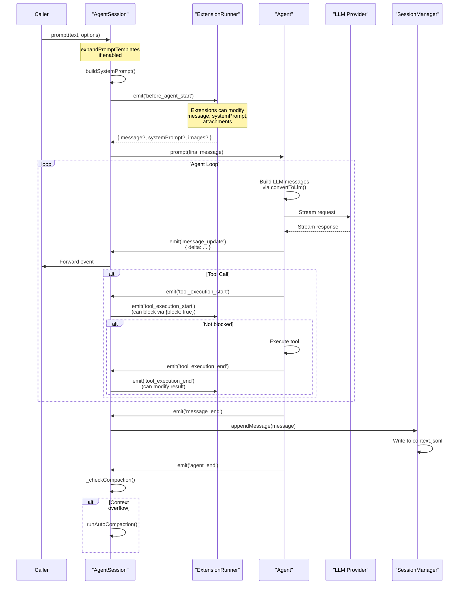

**Prompt Processing Steps:**

1. **Template expansion**: If `expandPromptTemplates` is enabled, replaces prompt template syntax with content from loaded templates
2. **System prompt building**: Calls `buildSystemPrompt()` to aggregate skills, context files, and extension modifications
3. **Extension preprocessing**: Emits `before_agent_start` to allow extensions to modify message, system prompt, or add attachments
4. **Agent delegation**: Calls `agent.prompt()` with final message and updated state
5. **Event forwarding**: Subscribes to agent events and forwards to session listeners
6. **Persistence**: On `message_end`, writes message to session file via `SessionManager`
7. **Post-processing**: On `agent_end`, checks for auto-compaction triggers

**Sources:** [packages/coding-agent/src/core/agent-session.ts:957-1090]()

## Auto-Compaction

Auto-compaction is triggered after an assistant message completes if context usage exceeds configured thresholds.

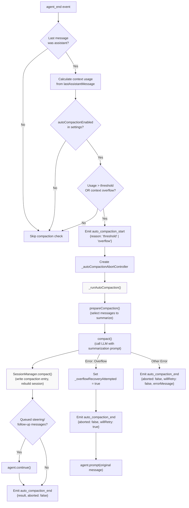

**Threshold Calculation:**

Auto-compaction triggers when:

- `(usageTokens / maxContextTokens) >= autoCompactThreshold` (default 0.80)
- OR context overflow error from LLM provider

**Compaction Process:**

1. **Entry selection**: `prepareCompaction()` selects messages between the last compaction entry and current position
2. **Summarization**: `compact()` calls the LLM with a special summarization prompt
3. **Session rebuild**: `SessionManager.compact()` writes a compaction entry and rebuilds the session from the tree
4. **Resume**: If messages were queued during compaction, calls `agent.continue()` to resume processing

**Overflow Recovery:**

If compaction itself fails with an overflow error, sets `_overflowRecoveryAttempted` flag and retries the original prompt. This prevents infinite compaction loops.

**Sources:** [packages/coding-agent/src/core/agent-session.ts:1357-1497](), [packages/coding-agent/src/core/compaction/index.ts]()

## Auto-Retry

Auto-retry handles transient errors (rate limits, server overload) with exponential backoff.

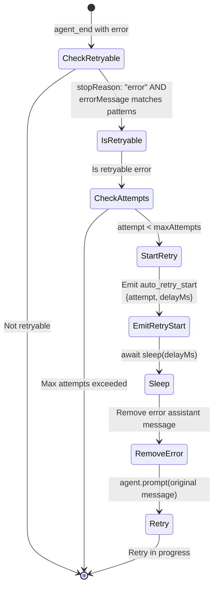

**Retryable Error Patterns:**

- `"overloaded"`, `"529"` (server overloaded)
- `"rate_limit_error"`, `"429"` (rate limit)
- `"500"`, `"502"`, `"503"`, `"504"` (server errors)
- `"ECONNRESET"`, `"ETIMEDOUT"` (network errors)

**Retry Configuration** (from `SettingsManager.getRetrySettings()`):

| Setting             | Default | Purpose                            |
| ------------------- | ------- | ---------------------------------- |
| `enabled`           | `true`  | Enable/disable auto-retry          |
| `maxAttempts`       | `3`     | Maximum retry attempts             |
| `initialDelayMs`    | `1000`  | Base delay for exponential backoff |
| `maxDelayMs`        | `60000` | Cap on retry delay                 |
| `backoffMultiplier` | `2`     | Multiplier for each retry          |

**Retry Flow:**

1. **Error detection**: `agent_end` event checks if last assistant message has `stopReason: "error"` and matches retry patterns
2. **Retry promise**: Creates `_retryPromise` that resolves when retry completes (for `waitForRetry()`)
3. **Backoff calculation**: `delayMs = min(initialDelayMs * (backoffMultiplier ** attempt), maxDelayMs)`
4. **Cleanup**: Removes error assistant message from agent state
5. **Retry**: Calls `agent.prompt()` with original message
6. **Success tracking**: On successful assistant response, emits `auto_retry_end` and resets counter

**Sources:** [packages/coding-agent/src/core/agent-session.ts:1499-1606]()

## Extension Integration

Extensions integrate via `ExtensionRunner`, which is bound after AgentSession creation:

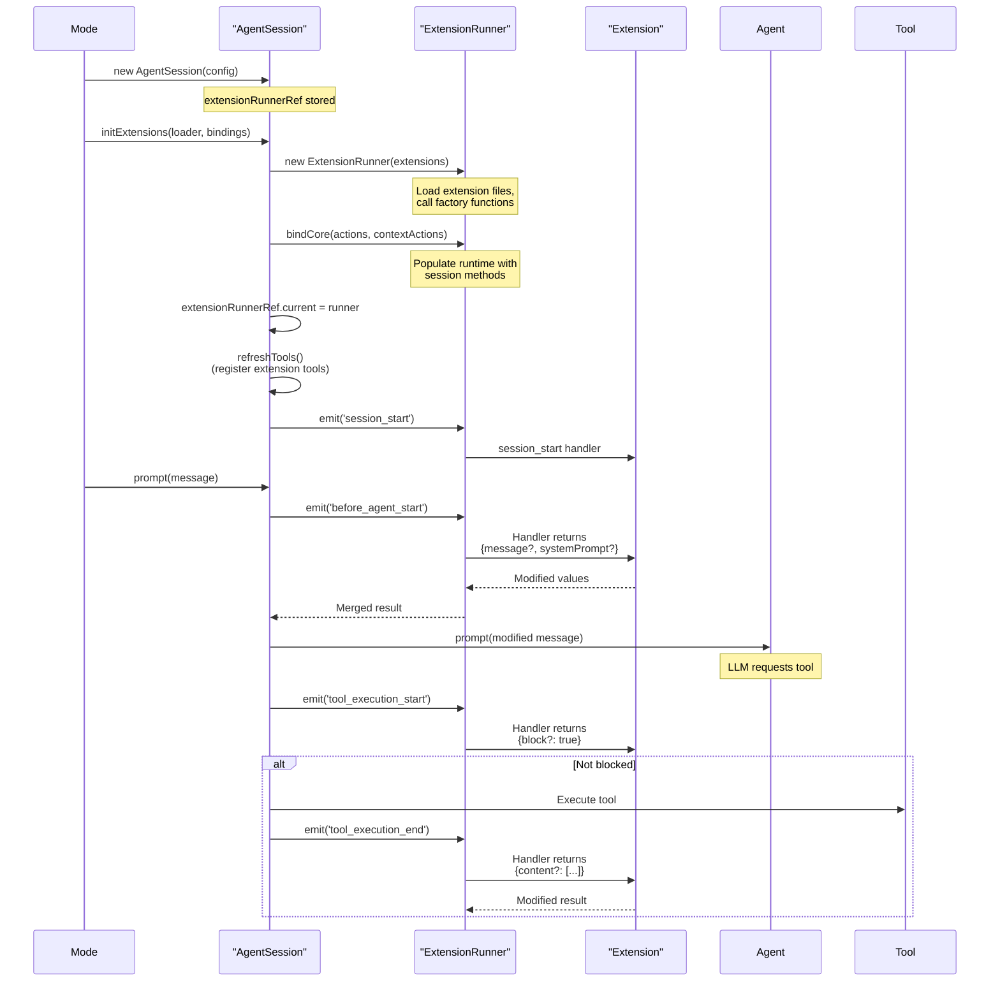

**Extension Binding Flow:**

1. **ExtensionRunner creation**: Mode calls `initExtensions()` with loaded extension paths
2. **Core binding**: Calls `bindCore()` with session methods (sendMessage, newSession, etc.)
3. **Tool registration**: Calls `refreshTools()` to register extension tools in the tool registry
4. **Session start**: Emits `session_start` event to notify extensions
5. **Runtime interaction**: Extensions receive events on every message, tool execution, etc.

**Extension Runtime Access:**

Extensions access session functionality via the `ExtensionAPI` passed to their factory function:

```typescript
pi.sendMessage(text) // Queue a custom message for next turn
pi.sendUserMessage(text) // Send user message immediately
pi.newSession() // Create a new session
pi.getAllTools() // Get active tool list
pi.registerTool(definition) // Register a custom tool
pi.registerCommand(definition) // Register a slash command
```

**Sources:** [packages/coding-agent/src/core/agent-session.ts:860-912](), [packages/coding-agent/src/core/extensions/extension-runner.ts]()
