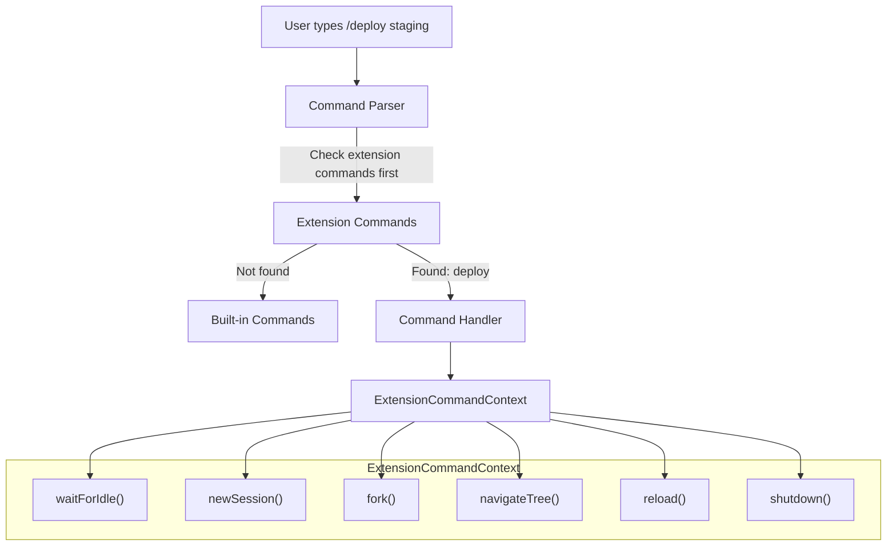
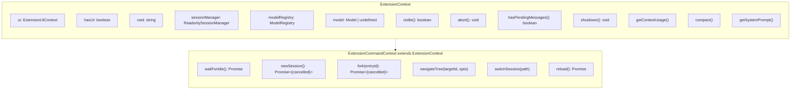
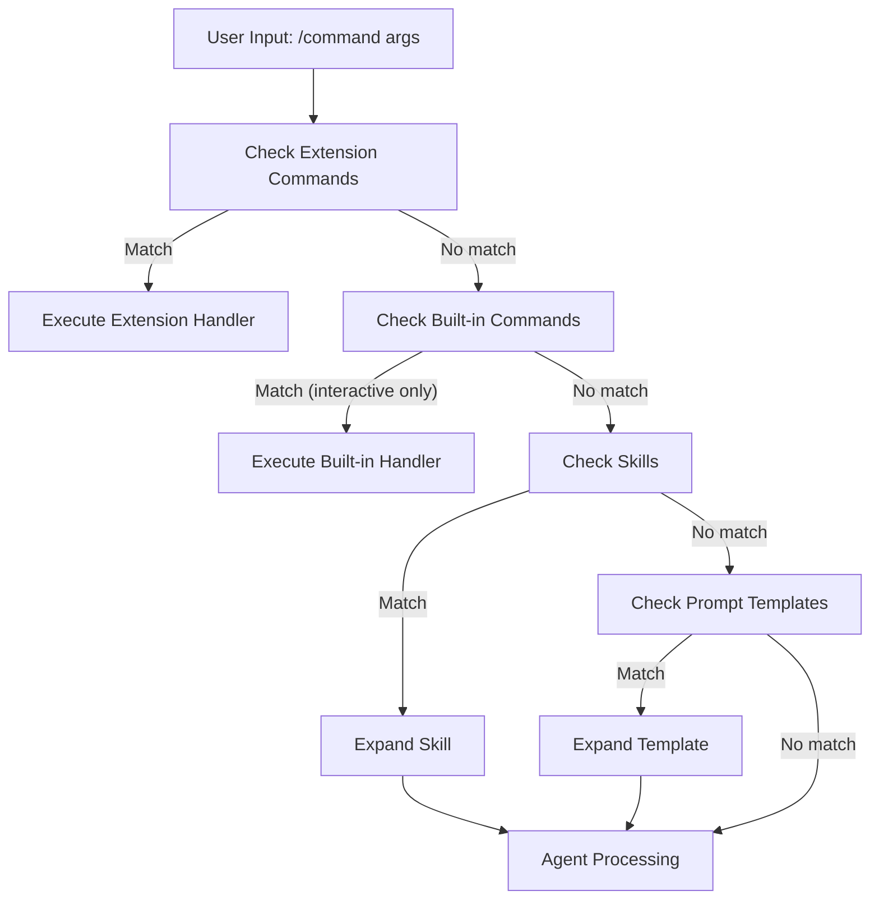
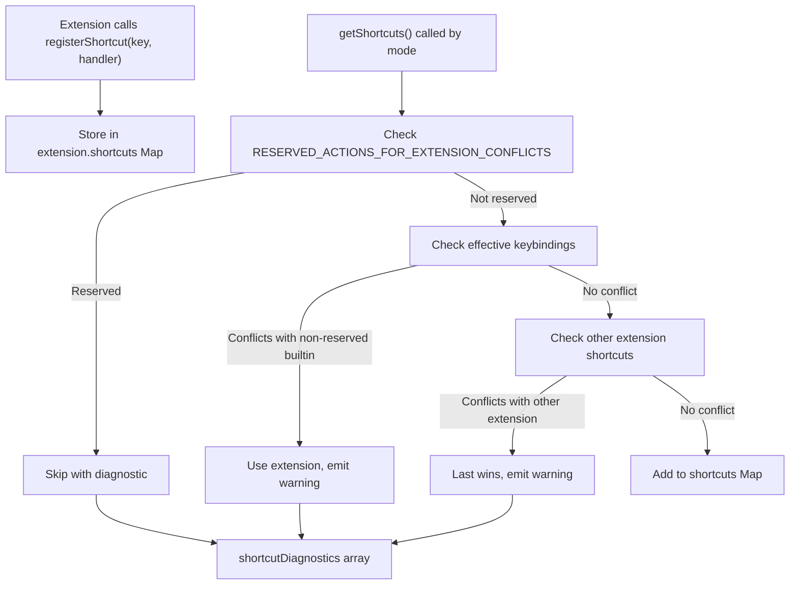
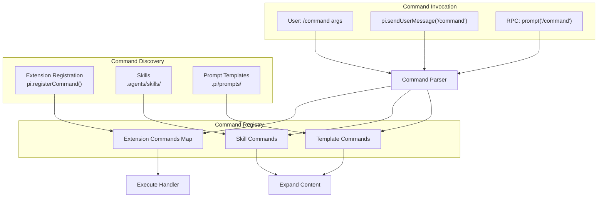

# Custom Commands & Shortcuts

<details>
<summary>Relevant source files</summary>

The following files were used as context for generating this wiki page:

- [packages/coding-agent/docs/extensions.md](packages/coding-agent/docs/extensions.md)
- [packages/coding-agent/src/core/extensions/index.ts](packages/coding-agent/src/core/extensions/index.ts)
- [packages/coding-agent/src/core/extensions/loader.ts](packages/coding-agent/src/core/extensions/loader.ts)
- [packages/coding-agent/src/core/extensions/runner.ts](packages/coding-agent/src/core/extensions/runner.ts)
- [packages/coding-agent/src/core/extensions/types.ts](packages/coding-agent/src/core/extensions/types.ts)
- [packages/coding-agent/src/index.ts](packages/coding-agent/src/index.ts)
- [packages/coding-agent/test/compaction-extensions.test.ts](packages/coding-agent/test/compaction-extensions.test.ts)

</details>

This page documents how extensions register custom slash commands (e.g., `/deploy`, `/stats`) and keyboard shortcuts in pi. Extensions can add interactive commands that users invoke via `/command` syntax or key bindings, with full session control capabilities.

For registering custom tools callable by the LLM, see [Custom Tools](#4.4.2). For event-based interception and lifecycle hooks, see [Extension Hooks & Events](#4.4.1). For UI integration patterns, see [Extension UI Context](#4.4.4).

## Command Registration and Execution Flow

Commands are slash-prefixed invocations (`/mycommand args`) that extensions register via `pi.registerCommand()`. Unlike tools (which the LLM invokes), commands are user-initiated and receive `ExtensionCommandContext` with session control methods.



**Diagram: Command Execution Pipeline**

Commands bypass skill and template expansion. When the user types input, the system checks extension commands first. If matched, the handler executes with `ExtensionCommandContext`. Otherwise, input proceeds through skill/template expansion and agent processing.

Sources: [packages/coding-agent/src/core/extensions/runner.ts:436-491](), [packages/coding-agent/src/core/extensions/types.ts:930-937]()

## Registering Commands

Extensions register commands during initialization by calling `pi.registerCommand(name, options)`. The command name is used without the leading slash.

```typescript
// Extension registration
pi.registerCommand('deploy', {
  description: 'Deploy to an environment',
  handler: async (args, ctx) => {
    await ctx.waitForIdle()
    ctx.ui.notify(`Deploying to ${args}`, 'info')
  },
})
```

**Command Registration Interface:**

| Field                    | Type                                                            | Description                         |
| ------------------------ | --------------------------------------------------------------- | ----------------------------------- |
| `name`                   | `string`                                                        | Command name (without leading `/`)  |
| `description`            | `string?`                                                       | Human-readable description for help |
| `getArgumentCompletions` | `(prefix: string) => AutocompleteItem[] \| null`                | Optional autocomplete provider      |
| `handler`                | `(args: string, ctx: ExtensionCommandContext) => Promise<void>` | Command implementation              |

The handler receives:

- `args`: The raw string after the command name
- `ctx`: `ExtensionCommandContext` with session control methods

Sources: [packages/coding-agent/src/core/extensions/types.ts:930-937](), [packages/coding-agent/docs/extensions.md:1079-1107]()

## ExtensionCommandContext vs ExtensionContext

Command handlers receive `ExtensionCommandContext`, which extends `ExtensionContext` with session control methods. These methods can deadlock if called from event handlers, so they're only available in commands.



**Diagram: Context Hierarchy**

Event handlers receive `ExtensionContext` (read-only session access). Command handlers receive `ExtensionCommandContext` with session control methods that can block on agent idle state or navigate the session tree.

**ExtensionCommandContext-only methods:**

| Method                             | Description                                |
| ---------------------------------- | ------------------------------------------ |
| `waitForIdle()`                    | Wait for agent to finish streaming         |
| `newSession(options?)`             | Create a new session with optional setup   |
| `fork(entryId)`                    | Fork from a specific entry                 |
| `navigateTree(targetId, options?)` | Navigate to a different tree point         |
| `switchSession(sessionPath)`       | Switch to a different session file         |
| `reload()`                         | Reload extensions, skills, prompts, themes |

Sources: [packages/coding-agent/src/core/extensions/types.ts:294-318](), [packages/coding-agent/src/core/extensions/runner.ts:526-536]()

## Command Arguments and Autocompletion

Commands receive arguments as a single string. Extensions can optionally provide argument autocompletion via `getArgumentCompletions`.

```typescript
pi.registerCommand('deploy', {
  description: 'Deploy to an environment',
  getArgumentCompletions: (prefix: string): AutocompleteItem[] | null => {
    const envs = ['dev', 'staging', 'prod']
    const items = envs.map((e) => ({ value: e, label: e }))
    const filtered = items.filter((i) => i.value.startsWith(prefix))
    return filtered.length > 0 ? filtered : null
  },
  handler: async (args, ctx) => {
    // args is the raw string after "/deploy "
    const env = args.trim()
    if (!['dev', 'staging', 'prod'].includes(env)) {
      ctx.ui.notify('Invalid environment', 'error')
      return
    }
    ctx.ui.notify(`Deploying to ${env}...`, 'info')
  },
})
```

**AutocompleteItem Interface:**

```typescript
interface AutocompleteItem {
  value: string // The completion value
  label: string // Display label (can include formatting)
}
```

The `getArgumentCompletions` function:

- Receives the current prefix (text after command name)
- Returns `AutocompleteItem[]` if completions available
- Returns `null` if no completions match
- Used in interactive mode for tab completion

Sources: [packages/coding-agent/docs/extensions.md:1090-1107](), [packages/coding-agent/src/core/extensions/types.ts:930-937]()

## Built-in vs Extension Commands

The system distinguishes between built-in commands (handled in interactive mode only) and extension commands (available in all modes).



**Diagram: Command Resolution Order**

Extension commands are checked first, then built-in commands (interactive mode only), then skills, then prompt templates. Extension commands bypass skill/template expansion entirely.

**Built-in Commands (Interactive Mode Only):**

- `/model` - Model selection
- `/settings` - Settings configuration
- `/new` - New session
- `/resume` - Session switching
- `/tree` - Tree navigation
- `/fork` - Branch from history
- `/compact` - Manual compaction

**Extension Commands (All Modes):**

- Registered via `pi.registerCommand()`
- Available in RPC mode via `prompt` command
- Listed in `pi.getCommands()` output
- Can be invoked programmatically via `pi.sendUserMessage("/mycommand")`

The `getRegisteredCommands()` method accepts a `reserved` set to prevent extensions from shadowing built-in commands:

Sources: [packages/coding-agent/src/core/extensions/runner.ts:436-467](), [packages/coding-agent/docs/extensions.md:1110-1132]()

## Keyboard Shortcuts

Extensions register keyboard shortcuts via `pi.registerShortcut()`. Shortcuts are key bindings that invoke a handler function when pressed.

```typescript
pi.registerShortcut('ctrl+shift+p', {
  description: 'Toggle plan mode',
  handler: async (ctx) => {
    // ctx is ExtensionContext (not ExtensionCommandContext)
    ctx.ui.notify('Plan mode toggled', 'info')
  },
})
```

**Shortcut Registration Interface:**

| Field         | Type                                               | Description                                          |
| ------------- | -------------------------------------------------- | ---------------------------------------------------- |
| `shortcut`    | `KeyId`                                            | Key combination (e.g., `"ctrl+x"`, `"ctrl+shift+p"`) |
| `description` | `string?`                                          | Human-readable description                           |
| `handler`     | `(ctx: ExtensionContext) => Promise<void> \| void` | Shortcut implementation                              |

**Key Format:**

- Modifiers: `ctrl`, `shift`, `alt`, `meta`
- Separators: `+` (e.g., `"ctrl+shift+x"`)
- Keys: lowercase letter, number, or special key name
- Normalized to lowercase by the system

**Important:** Shortcut handlers receive `ExtensionContext`, not `ExtensionCommandContext`. They cannot call `waitForIdle()` or other session control methods. To trigger session operations from a shortcut, queue a command as a follow-up message:

```typescript
pi.registerShortcut('ctrl+r', {
  description: 'Reload extensions',
  handler: async (ctx) => {
    // Queue the command that has access to ctx.reload()
    pi.sendUserMessage('/reload-runtime', { deliverAs: 'followUp' })
  },
})

pi.registerCommand('reload-runtime', {
  handler: async (args, ctx) => {
    await ctx.reload()
  },
})
```

Sources: [packages/coding-agent/docs/extensions.md:1138-1149](), [packages/coding-agent/src/core/extensions/types.ts:1060-1074]()

## Shortcut Conflicts and Reserved Actions

The system detects shortcut conflicts with built-in keybindings and other extensions. Some actions are reserved and cannot be overridden by extensions.



**Diagram: Shortcut Conflict Resolution**

When resolving shortcuts, the system checks reserved actions first, then built-in keybindings, then other extensions. Conflicts generate diagnostics but don't prevent loading.

**Reserved Actions (Cannot Be Overridden):**

The following actions have reserved keybindings that extensions cannot override:

```typescript
const RESERVED_ACTIONS_FOR_EXTENSION_CONFLICTS = [
  'interrupt', // Ctrl+C - abort current operation
  'clear', // Ctrl+L - clear screen
  'exit', // Ctrl+D - exit
  'suspend', // Ctrl+Z - suspend process
  'cycleThinkingLevel', // Cycle reasoning level
  'cycleModelForward', // Cycle to next model
  'cycleModelBackward', // Cycle to previous model
  'selectModel', // Open model selector
  'expandTools', // Toggle tool output expansion
  'toggleThinking', // Toggle thinking display
  'externalEditor', // Open external editor
  'followUp', // Queue follow-up message
  'submit', // Submit input
  'selectConfirm', // Confirm selection
  'selectCancel', // Cancel selection
  'copy', // Copy to clipboard
  'deleteToLineEnd', // Kill to end of line
]
```

**Conflict Resolution Rules:**

1. **Reserved conflict**: Extension shortcut is skipped, diagnostic emitted
2. **Non-reserved builtin conflict**: Extension wins, warning emitted
3. **Extension-to-extension conflict**: Last registered wins, warning emitted

**Diagnostics Access:**

```typescript
// In ExtensionRunner
const shortcuts = runner.getShortcuts(effectiveKeybindings)
const diagnostics = runner.getShortcutDiagnostics()
// diagnostics: { type: "warning", message: string, path: string }[]
```

Sources: [packages/coding-agent/src/core/extensions/runner.ts:53-72](), [packages/coding-agent/src/core/extensions/runner.ts:356-403]()

## CLI Flags

Extensions can register custom CLI flags that appear in `pi --help` and are accessible via `pi.getFlag(name)`.

```typescript
pi.registerFlag('plan', {
  description: 'Start in plan mode',
  type: 'boolean',
  default: false,
})

// Access flag value
const planMode = pi.getFlag('plan')
if (planMode) {
  // Enable plan mode
}
```

**Flag Registration Interface:**

| Field         | Type                    | Description                  |
| ------------- | ----------------------- | ---------------------------- |
| `name`        | `string`                | Flag name (used as `--name`) |
| `description` | `string?`               | Description for `--help`     |
| `type`        | `"boolean" \| "string"` | Flag value type              |
| `default`     | `boolean \| string?`    | Default value                |

**Flag Storage and Access:**

- Flags are stored in `ExtensionRuntime.flagValues` Map
- Set via `ExtensionRunner.setFlagValue(name, value)` during CLI parsing
- Accessed via `pi.getFlag(name)` in extension code
- Only flags registered by the extension are accessible

**Example: Conditional Tool Registration:**

```typescript
pi.registerFlag('enable-deploy', {
  description: 'Enable deployment tools',
  type: 'boolean',
  default: false,
})

if (pi.getFlag('enable-deploy')) {
  pi.registerTool({
    name: 'deploy',
    // ... tool definition
  })
}
```

Sources: [packages/coding-agent/docs/extensions.md:1151-1164](), [packages/coding-agent/src/core/extensions/types.ts:1076-1087](), [packages/coding-agent/src/core/extensions/runner.ts:336-355]()

## Command Discovery and Invocation

Commands are discovered from multiple sources and can be invoked programmatically or via user input.



**Diagram: Command Discovery and Invocation**

Commands come from three sources: extension registrations, skills, and prompt templates. They can be invoked interactively, programmatically via `sendUserMessage`, or through the RPC protocol.

**Getting Available Commands:**

```typescript
const commands = pi.getCommands()
// Returns: SlashCommandInfo[]
```

**SlashCommandInfo Interface:**

```typescript
interface SlashCommandInfo {
  name: string // Command name without /
  description?: string // Description if provided
  source: 'extension' | 'prompt' | 'skill'
  location?: 'user' | 'project' | 'path' // For templates/skills
  path?: string // File backing the command
}
```

Commands are returned in order:

1. Extension commands
2. Prompt templates
3. Skills

Built-in interactive commands (`/model`, `/settings`, etc.) are not included in this list as they don't execute via the `prompt` mechanism.

**Programmatic Invocation:**

```typescript
// Queue a command for execution
pi.sendUserMessage('/deploy staging', { deliverAs: 'followUp' })

// During streaming - must specify delivery mode
pi.sendUserMessage('/stats', { deliverAs: 'steer' })
```

Sources: [packages/coding-agent/docs/extensions.md:1110-1132](), [packages/coding-agent/src/core/extensions/types.ts:1028-1042]()

## Session Control Patterns

Commands have access to session control methods that event handlers cannot use. These patterns show safe usage.

**Pattern 1: Wait for Idle Before Modification**

```typescript
pi.registerCommand('snapshot', {
  handler: async (args, ctx) => {
    // Wait for agent to finish
    await ctx.waitForIdle()

    // Safe to modify session
    const entries = ctx.sessionManager.getEntries()
    pi.appendEntry('snapshot', {
      timestamp: Date.now(),
      entryCount: entries.length,
    })

    ctx.ui.notify('Snapshot saved', 'success')
  },
})
```

**Pattern 2: Fork with Setup**

```typescript
pi.registerCommand('experiment', {
  handler: async (args, ctx) => {
    await ctx.waitForIdle()

    const result = await ctx.newSession({
      parentSession: ctx.sessionManager.getSessionFile(),
      setup: async (sm) => {
        sm.appendMessage({
          role: 'user',
          content: [
            {
              type: 'text',
              text: "Let's experiment with: " + args,
            },
          ],
          timestamp: Date.now(),
        })
      },
    })

    if (!result.cancelled) {
      ctx.ui.notify('Experiment started', 'info')
    }
  },
})
```

**Pattern 3: Reload from Command, Trigger from Tool**

```typescript
// Command with ctx.reload()
pi.registerCommand('reload-runtime', {
  handler: async (args, ctx) => {
    await ctx.reload()
    return // Don't continue after reload
  },
})

// Tool that queues the command
pi.registerTool({
  name: 'reload_runtime',
  description: 'Reload extensions and skills',
  parameters: Type.Object({}),
  async execute() {
    pi.sendUserMessage('/reload-runtime', {
      deliverAs: 'followUp',
    })
    return {
      content: [
        {
          type: 'text',
          text: 'Queued reload command',
        },
      ],
    }
  },
})
```

**Important:** `ctx.reload()` emits `session_shutdown` for the current runtime, reloads resources, then emits `session_start` for the new runtime. Code after `await ctx.reload()` executes in the old runtime and should not assume extension state is valid.

Sources: [packages/coding-agent/docs/extensions.md:807-890](), [packages/coding-agent/docs/extensions.md:893-921]()

## Complete Example: Multi-Command Extension

This example shows a complete extension registering multiple commands, shortcuts, and flags with proper context handling.

```typescript
import type { ExtensionAPI } from '@mariozechner/pi-coding-agent'
import { Type } from '@sinclair/typebox'

export default function (pi: ExtensionAPI) {
  // Register flag
  pi.registerFlag('auto-checkpoint', {
    description: 'Automatically checkpoint after each turn',
    type: 'boolean',
    default: false,
  })

  // Register commands
  pi.registerCommand('checkpoint', {
    description: 'Save current state',
    handler: async (args, ctx) => {
      await ctx.waitForIdle()

      const label = args.trim() || `checkpoint-${Date.now()}`
      const leafId = ctx.sessionManager.getLeafId()

      if (leafId) {
        pi.setLabel(leafId, label)
        ctx.ui.notify(`Checkpoint saved: ${label}`, 'success')
      }
    },
  })

  pi.registerCommand('list-checkpoints', {
    description: 'List all checkpoints',
    handler: async (args, ctx) => {
      const entries = ctx.sessionManager.getEntries()
      const checkpoints = entries
        .filter((e) =>
          ctx.sessionManager.getLabel(e.id)?.startsWith('checkpoint-')
        )
        .map((e) => ({
          id: e.id,
          label: ctx.sessionManager.getLabel(e.id)!,
          timestamp: e.timestamp,
        }))

      if (checkpoints.length === 0) {
        ctx.ui.notify('No checkpoints found', 'info')
        return
      }

      const items = checkpoints.map(
        (c) => `${c.label} (${new Date(c.timestamp).toISOString()})`
      )

      const selected = await ctx.ui.select('Checkpoints', items)

      if (selected) {
        const idx = items.indexOf(selected)
        ctx.ui.notify(`Selected: ${checkpoints[idx].id}`, 'info')
      }
    },
  })

  // Register shortcut
  pi.registerShortcut('ctrl+shift+s', {
    description: 'Quick checkpoint',
    handler: async (ctx) => {
      // Queue command (shortcuts have ExtensionContext, not ExtensionCommandContext)
      pi.sendUserMessage('/checkpoint quick', { deliverAs: 'followUp' })
    },
  })

  // Auto-checkpoint if flag enabled
  if (pi.getFlag('auto-checkpoint')) {
    pi.on('turn_end', async (event, ctx) => {
      const leafId = ctx.sessionManager.getLeafId()
      if (leafId) {
        pi.setLabel(leafId, `auto-${Date.now()}`)
      }
    })
  }
}
```

This extension demonstrates:

- Flag-based conditional behavior
- Multiple commands with different UI patterns
- Keyboard shortcut that queues a command
- Event-based automation triggered by flag
- Proper use of `ExtensionCommandContext` in commands
- Safe session modification after `waitForIdle()`

Sources: [packages/coding-agent/docs/extensions.md:55-97](), [packages/coding-agent/docs/extensions.md:1079-1149]()
