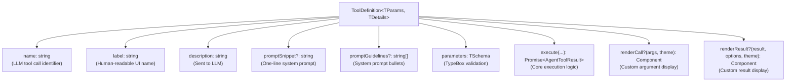
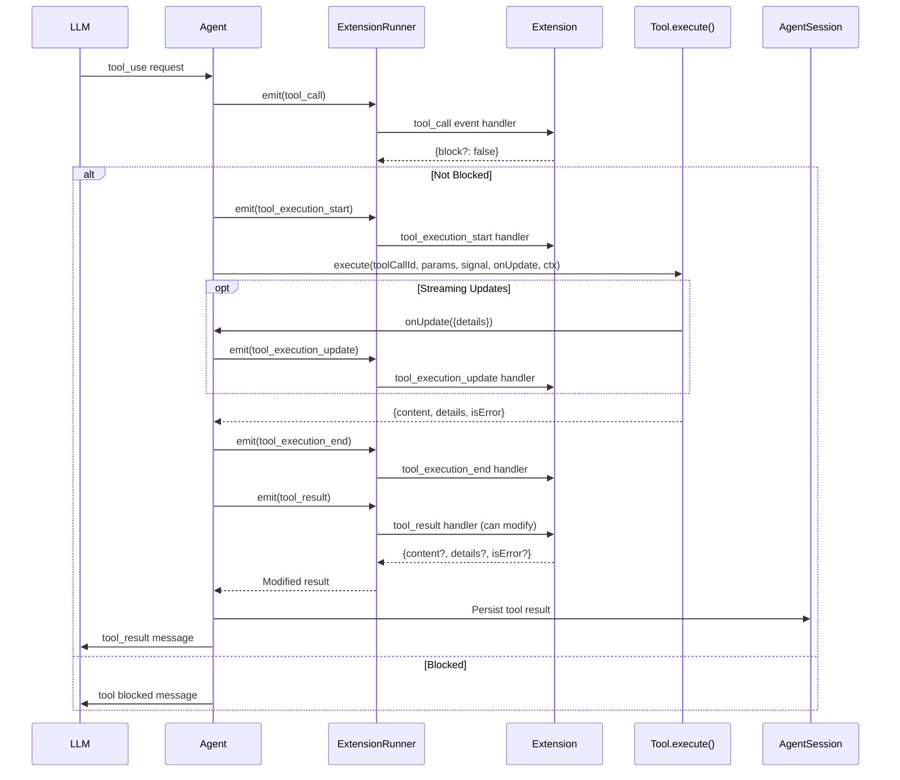
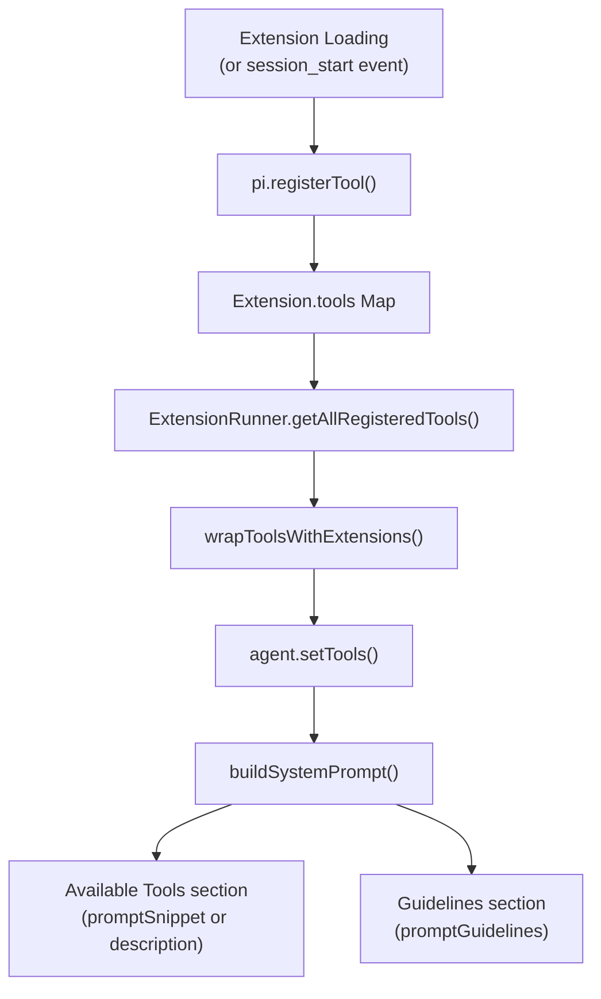

# Custom Tools

<details>
<summary>Relevant source files</summary>

The following files were used as context for generating this wiki page:

- [packages/coding-agent/docs/extensions.md](packages/coding-agent/docs/extensions.md)
- [packages/coding-agent/src/core/extensions/index.ts](packages/coding-agent/src/core/extensions/index.ts)
- [packages/coding-agent/src/core/extensions/loader.ts](packages/coding-agent/src/core/extensions/loader.ts)
- [packages/coding-agent/src/core/extensions/runner.ts](packages/coding-agent/src/core/extensions/runner.ts)
- [packages/coding-agent/src/core/extensions/types.ts](packages/coding-agent/src/core/extensions/types.ts)
- [packages/coding-agent/src/index.ts](packages/coding-agent/src/index.ts)
- [packages/coding-agent/test/compaction-extensions.test.ts](packages/coding-agent/test/compaction-extensions.test.ts)

</details>

This page covers how to register custom tools that the LLM can invoke, including tool definition, execution flow, event interception, custom rendering, and integration with the tool registry. For information about built-in tools (read, bash, edit, write), see the Tool Execution documentation. For general extension system concepts and lifecycle events, see [Extension System](#4.4).

## Tool Registration

Extensions register tools via `pi.registerTool()`. Tools can be registered during extension initialization or dynamically at runtime (e.g., inside `session_start` handlers or command handlers). Each tool must provide a unique name, parameter schema, and execution function.

```typescript
import type { ExtensionAPI } from '@mariozechner/pi-coding-agent'
import { Type } from '@sinclair/typebox'

export default function (pi: ExtensionAPI) {
  pi.registerTool({
    name: 'greet',
    label: 'Greet User',
    description: 'Greet a user by name with a friendly message',
    promptSnippet: 'greet(name) - greet someone',
    promptGuidelines: [
      'Use greet for friendly messages',
      "Include user's name",
    ],
    parameters: Type.Object({
      name: Type.String({ description: 'Name of person to greet' }),
      enthusiastic: Type.Optional(
        Type.Boolean({ description: 'Add enthusiasm' })
      ),
    }),
    async execute(toolCallId, params, signal, onUpdate, ctx) {
      const greeting = params.enthusiastic
        ? `Hello, ${params.name}!!!`
        : `Hello, ${params.name}.`

      return {
        content: [{ type: 'text', text: greeting }],
        details: { enthusiastic: params.enthusiastic },
      }
    },
  })
}
```

### Dynamic Tool Registration

Tools can be registered after extension load completes. New tools are immediately available in `pi.getAllTools()` and can be activated via `pi.setActiveTools()` without requiring `/reload`.

```typescript
pi.on('session_start', async (_event, ctx) => {
  // Register tool based on session context
  pi.registerTool({
    name: 'session_tool',
    // ...
  })
})
```

Tools are registered into a shared runtime registry accessible via `ExtensionRunner`. The `refreshTools()` method in the runtime rebuilds the active tool set when tools are added or removed.

**Sources:** [packages/coding-agent/docs/extensions.md:927-940](), [packages/coding-agent/src/core/extensions/types.ts:333-367](), [packages/coding-agent/src/core/extensions/loader.ts:173-180]()

## Tool Definition Structure

### ToolDefinition Interface



**Sources:** [packages/coding-agent/src/core/extensions/types.ts:333-367]()

### Field Descriptions

| Field              | Type        | Purpose                                                                                                        |
| ------------------ | ----------- | -------------------------------------------------------------------------------------------------------------- |
| `name`             | `string`    | Tool identifier used in LLM tool calls. Must be unique across all registered tools.                            |
| `label`            | `string`    | Human-readable name displayed in the UI (tool selectors, help text).                                           |
| `description`      | `string`    | Description sent to the LLM explaining what the tool does.                                                     |
| `promptSnippet`    | `string?`   | One-line summary for the "Available tools" section in the system prompt. Falls back to description if omitted. |
| `promptGuidelines` | `string[]?` | Bullet points appended to the "Guidelines" section in the system prompt when this tool is active.              |
| `parameters`       | `TSchema`   | TypeBox schema defining tool parameters. The LLM's tool call arguments are validated against this schema.      |
| `execute`          | `function`  | Async function that runs when the LLM calls the tool. Returns result content and optional details.             |
| `renderCall`       | `function?` | Custom TUI component for displaying the tool call arguments in the chat.                                       |
| `renderResult`     | `function?` | Custom TUI component for displaying the tool result in the chat.                                               |

**Sources:** [packages/coding-agent/src/core/extensions/types.ts:333-367]()

### Execute Function Signature

The `execute` function receives five parameters:

```typescript
async execute(
  toolCallId: string,              // Unique ID for this tool invocation
  params: Static<TParams>,         // Validated parameters from LLM
  signal: AbortSignal | undefined, // Abort signal for cancellation (Ctrl+C)
  onUpdate: AgentToolUpdateCallback<TDetails> | undefined, // Streaming updates callback
  ctx: ExtensionContext            // Extension context (ui, cwd, sessionManager, etc.)
): Promise<AgentToolResult<TDetails>>
```

**Parameters:**

| Parameter    | Type                                             | Purpose                                                                            |
| ------------ | ------------------------------------------------ | ---------------------------------------------------------------------------------- |
| `toolCallId` | `string`                                         | Unique identifier for this tool invocation, used for tracking and updates          |
| `params`     | `Static<TParams>`                                | Tool parameters validated against the TypeBox schema                               |
| `signal`     | `AbortSignal \| undefined`                       | Signal that fires when user interrupts (Ctrl+C). Tool should handle cleanup.       |
| `onUpdate`   | `AgentToolUpdateCallback<TDetails> \| undefined` | Optional callback for streaming progress updates. Call with partial results.       |
| `ctx`        | `ExtensionContext`                               | Extension context providing access to UI, session manager, working directory, etc. |

**Return Value (`AgentToolResult`):**

```typescript
{
  content: (TextContent | ImageContent)[],  // Content blocks returned to LLM
  details?: TDetails,                       // Structured data for custom rendering
  isError?: boolean                        // Whether this represents an error
}
```

**Streaming Updates:**

Call `onUpdate()` during execution to provide incremental results:

```typescript
async execute(toolCallId, params, signal, onUpdate, ctx) {
  onUpdate?.({ content: [{ type: "text", text: "Processing..." }] });

  // ... do work ...

  onUpdate?.({
    content: [{ type: "text", text: "Halfway done..." }],
    details: { progress: 50 }
  });

  return {
    content: [{ type: "text", text: "Complete!" }],
    details: { progress: 100 }
  };
}
```

**Sources:** [packages/coding-agent/src/core/extensions/types.ts:349-356](), [packages/coding-agent/docs/extensions.md:942-970]()

## Tool Execution Flow



**Tool Execution Steps:**

1. **LLM Request**: LLM sends a tool_use block in its response
2. **tool_call Event**: Extensions can inspect arguments and block execution
3. **tool_execution_start**: Signals tool is about to run
4. **Tool Execution**: The registered `execute()` function runs
5. **tool_execution_update** (optional): Streaming progress updates via `onUpdate()`
6. **tool_execution_end**: Tool execution completes
7. **tool_result Event**: Extensions can modify the result via middleware chaining
8. **Persistence**: Result is saved to session history
9. **LLM Response**: Result is sent back to the LLM for the next turn

**Sources:** [packages/coding-agent/src/core/agent-session.ts:485-555](), [packages/coding-agent/src/core/extensions/runner.ts:451-518]()

## Tool Events

### tool_call Event

The `tool_call` event fires **before** a tool executes, allowing extensions to inspect arguments and optionally block execution. Extensions can use this to implement permission gates, argument validation, or conditional tool availability.

**Synchronization Guarantee:** Before `tool_call` handlers run, pi waits for all previously emitted Agent events to finish draining through `AgentSession`. This means `ctx.sessionManager` is up to date through the current assistant tool-calling message.

**Parallel Tool Execution:** In parallel tool mode (default), sibling tool calls from the same assistant message are preflighted sequentially via `tool_call` events, then executed concurrently. The `tool_call` handler is **not** guaranteed to see sibling tool results from the same assistant message in `ctx.sessionManager`.

```typescript
pi.on('tool_call', async (event, ctx) => {
  // event.toolName - "bash", "read", "my_custom_tool"
  // event.toolCallId - unique ID for this invocation
  // event.input - typed parameters

  if (event.toolName === 'bash' && event.input.command?.includes('rm -rf')) {
    const ok = await ctx.ui.confirm('Dangerous Command', 'Allow rm -rf?')
    if (!ok) {
      return { block: true, reason: 'User declined rm -rf' }
    }
  }
})
```

**Type Narrowing**: Use `isToolCallEventType` to get typed access to tool-specific input:

```typescript
import { isToolCallEventType } from '@mariozechner/pi-coding-agent'

pi.on('tool_call', (event, ctx) => {
  // Built-in tools (no type params needed)
  if (isToolCallEventType('bash', event)) {
    event.input.command // string
    event.input.timeout // number | undefined
  }

  if (isToolCallEventType('read', event)) {
    event.input.path // string
    event.input.limit // number | undefined
  }

  // Custom tools (explicit type params)
  if (isToolCallEventType<'my_tool', MyToolInput>('my_tool', event)) {
    event.input.customField // typed via MyToolInput
  }
})
```

**Typing Custom Tool Input:**

Custom tools should export their input type for use in other extensions:

```typescript
// my-extension.ts
import { Type } from '@sinclair/typebox'
import type { Static } from '@sinclair/typebox'

const MyToolSchema = Type.Object({
  action: Type.String(),
  target: Type.Optional(Type.String()),
})

export type MyToolInput = Static<typeof MyToolSchema>

pi.registerTool({
  name: 'my_tool',
  parameters: MyToolSchema,
  // ...
})
```

Then in another extension:

```typescript
import { isToolCallEventType } from '@mariozechner/pi-coding-agent'
import type { MyToolInput } from './my-extension'

pi.on('tool_call', (event) => {
  if (isToolCallEventType<'my_tool', MyToolInput>('my_tool', event)) {
    event.input.action // typed
  }
})
```

**Return Values:**

- `{ block: true, reason?: string }` - Block execution and send reason to LLM
- `undefined` or no return - Allow execution to proceed

**Sources:** [packages/coding-agent/docs/extensions.md:559-610](), [packages/coding-agent/src/core/extensions/runner.ts:631-652]()

### tool_result Event

The `tool_result` event fires **after** a tool executes and **before** the final `tool_execution_end` event and tool result message events are emitted. Extensions can modify the result content or details before it's sent to the LLM.

```typescript
pi.on('tool_result', async (event, ctx) => {
  // event.toolName - tool that was called
  // event.toolCallId - unique invocation ID
  // event.input - parameters passed to tool
  // event.content - result text/image content
  // event.details - structured result data
  // event.isError - whether tool errored

  if (event.toolName === 'bash' && !event.isError) {
    // Filter sensitive environment variables from bash output
    const filtered = event.content.map((block) => {
      if (block.type === 'text') {
        return {
          ...block,
          text: block.text.replace(/AWS_SECRET_ACCESS_KEY=\S+/g, '[REDACTED]'),
        }
      }
      return block
    })

    return { content: filtered }
  }
})
```

**Type Narrowing for Built-in Tools:**

Use type guards to get typed access to built-in tool details:

```typescript
import { isBashToolResult } from '@mariozechner/pi-coding-agent'

pi.on('tool_result', async (event, ctx) => {
  if (isBashToolResult(event)) {
    // event.details is typed as BashToolDetails
    if (event.details?.exitCode !== 0) {
      return { isError: true }
    }
  }
})
```

Available type guards: `isBashToolResult`, `isReadToolResult`, `isEditToolResult`, `isWriteToolResult`, `isGrepToolResult`, `isFindToolResult`, `isLsToolResult`.

**Middleware Chaining**: Handlers run in extension load order. Each handler sees the result as modified by previous handlers. Return values are merged:

```typescript
// Extension 1
return { content: [...newContent] } // Replaces content

// Extension 2 (sees Extension 1's content)
return { details: { ...newDetails } } // Replaces details, keeps content

// Extension 3 (sees both modifications)
return { isError: true } // Marks as error, keeps content+details
```

**Return Value**: Partial `{ content?, details?, isError? }` - omitted fields keep their current values.

**Sources:** [packages/coding-agent/docs/extensions.md:613-634](), [packages/coding-agent/src/core/extensions/runner.ts:581-629]()

## Custom Rendering

Extensions can provide custom TUI components to render tool calls and results in the interactive chat interface.

### renderCall

Custom component for displaying tool arguments when the LLM invokes a tool:

```typescript
pi.registerTool({
  name: 'search',
  // ...
  renderCall: (args, theme) => {
    const query = theme.fg('accent', args.query)
    return new Text(`Searching for: ${query}`, 0, 0)
  },
})
```

### renderResult

Custom component for displaying tool results. Receives `options` for expansion state and streaming:

```typescript
import { Text, Container } from '@mariozechner/pi-tui'

pi.registerTool({
  name: 'search',
  // ...
  renderResult: (result, options, theme) => {
    // options.expanded - whether user expanded the result
    // options.isPartial - whether this is a streaming update

    const container = new Container()

    if (result.details?.resultCount) {
      container.addChild(
        new Text(
          theme.fg('success', `Found ${result.details.resultCount} results`),
          0,
          0
        )
      )
    }

    if (options.expanded && result.details?.results) {
      for (const item of result.details.results) {
        container.addChild(new Text(`  - ${item.title}`, 0, 0))
      }
    }

    return container
  },
})
```

**Component Requirements:**

- Must implement the `Component` interface from `@mariozechner/pi-tui`
- Should use the provided `theme` for consistent styling
- Can be stateful (store state in component instance)
- Should handle both expanded and collapsed states gracefully

**Available in:**

- Interactive mode: Full rendering support
- RPC mode: Not used (host handles rendering)
- Print mode: Not used (text-only output)

**Sources:** [packages/coding-agent/src/core/extensions/types.ts:359-366](), [packages/coding-agent/src/modes/interactive/interactive-mode.ts:89-90]()

## Tool Registry and Activation

### Registration Flow

**Registration and Activation Pipeline**



**Sources:** [packages/coding-agent/src/core/extensions/loader.ts:173-180](), [packages/coding-agent/src/core/extensions/runner.ts:312-334](), [packages/coding-agent/src/core/agent-session.ts:294-299]()

### Tool Registry

All registered tools are stored in individual `Extension` objects within `ExtensionRunner`. The runner provides methods to query and manipulate the tool registry:

**Querying Tools:**

```typescript
// Get all registered tools (from all extensions)
const allTools = session.getAllTools() // ToolInfo[]

// Get active tool names
const activeNames = session.getActiveToolNames() // string[]

// Get a specific tool definition
const toolDef = extensionRunner.getToolDefinition('my_tool')
```

**Activating/Deactivating Tools:**

```typescript
// Set active tools by name (replaces current active set)
session.setActiveToolsByName(["read", "bash", "my_custom_tool\
```
