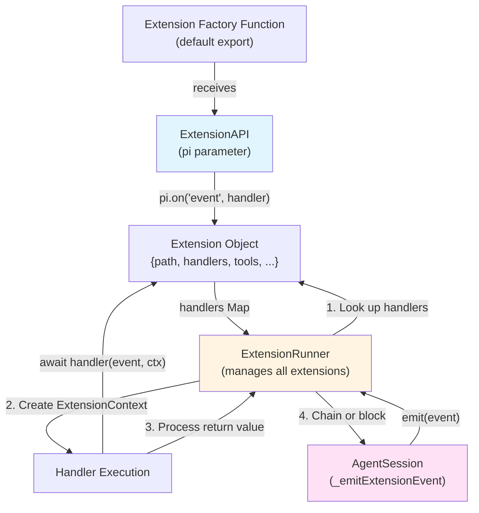
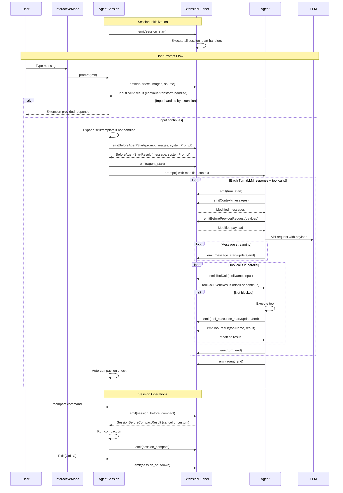
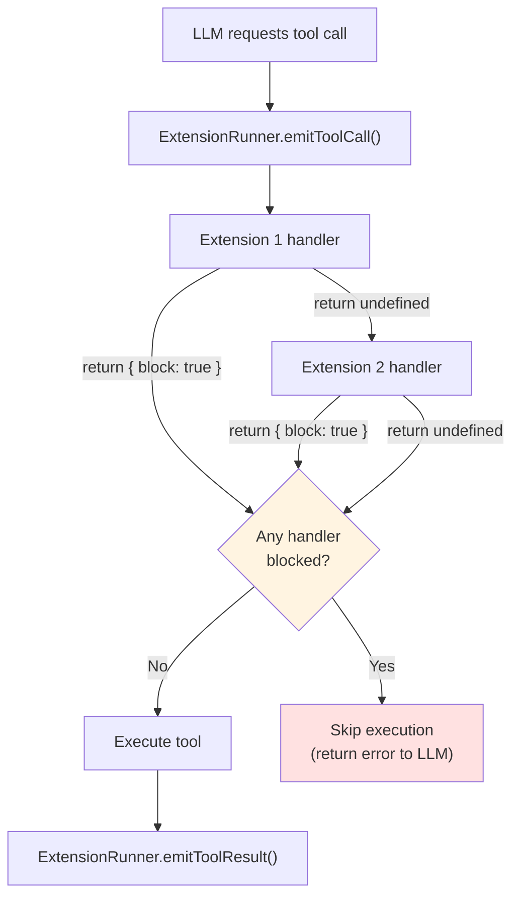
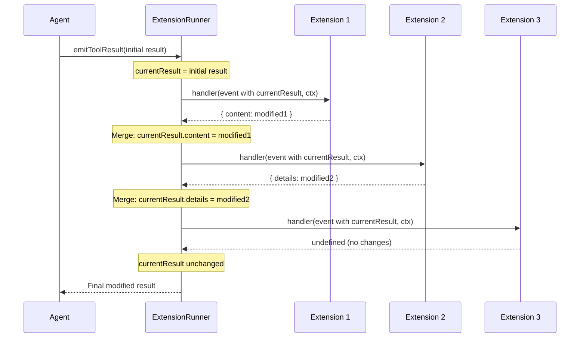
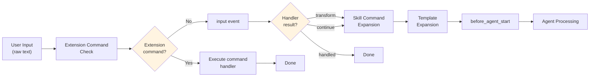
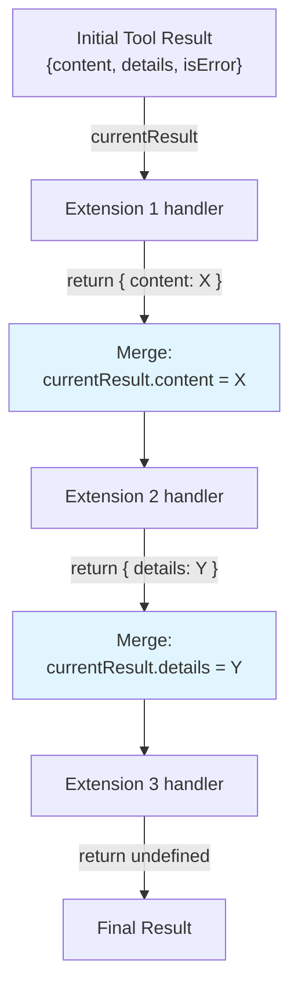
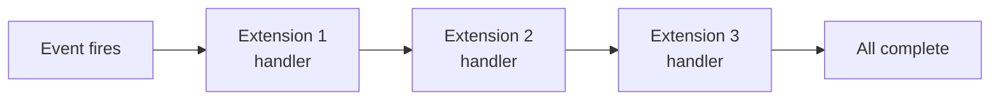
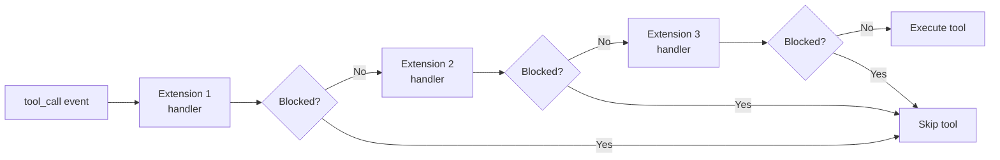

# Extension Hooks & Events

<details>
<summary>Relevant source files</summary>

The following files were used as context for generating this wiki page:

- [packages/coding-agent/docs/extensions.md](packages/coding-agent/docs/extensions.md)
- [packages/coding-agent/src/core/extensions/index.ts](packages/coding-agent/src/core/extensions/index.ts)
- [packages/coding-agent/src/core/extensions/loader.ts](packages/coding-agent/src/core/extensions/loader.ts)
- [packages/coding-agent/src/core/extensions/runner.ts](packages/coding-agent/src/core/extensions/runner.ts)
- [packages/coding-agent/src/core/extensions/types.ts](packages/coding-agent/src/core/extensions/types.ts)
- [packages/coding-agent/src/index.ts](packages/coding-agent/src/index.ts)
- [packages/coding-agent/test/compaction-extensions.test.ts](packages/coding-agent/test/compaction-extensions.test.ts)

</details>

This page documents the event system that allows extensions to intercept, modify, and react to lifecycle events throughout the coding agent. Extensions subscribe to events via `pi.on(eventName, handler)` and receive callbacks at key points during session initialization, agent execution, tool calls, and user interactions.

For information about registering custom tools, see [Custom Tools](#4.4.2). For custom commands and shortcuts, see [Custom Commands & Shortcuts](#4.4.3). For the extension UI context available to handlers, see [Extension UI Context](#4.4.4).

## Event Subscription Mechanism

Extensions subscribe to events during initialization by calling `pi.on(eventName, handler)` where `pi` is the `ExtensionAPI` instance passed to the extension factory function.

**Event Handler Signature**

All event handlers receive two parameters:

- `event` - The event object containing event-specific data
- `ctx` - The `ExtensionContext` providing access to session state, UI methods, and runtime actions

```typescript
pi.on('tool_call', async (event, ctx) => {
  // event: ToolCallEvent with toolName, toolCallId, input
  // ctx: ExtensionContext with ui, sessionManager, model, etc.

  if (event.toolName === 'bash' && event.input.command.includes('rm -rf')) {
    const confirmed = await ctx.ui.confirm('Dangerous!', 'Allow rm -rf?')
    if (!confirmed) return { block: true, reason: 'Blocked by user' }
  }
})
```

**Multiple Handlers**

Multiple extensions can subscribe to the same event. Handlers execute in extension load order (the order extensions appear in the auto-discovery scan or command-line arguments).

Sources: [packages/coding-agent/src/core/extensions/types.ts:1-74](), [packages/coding-agent/src/core/extensions/loader.ts:160-173](), [packages/coding-agent/docs/extensions.md:56-97]()

## Event Registration and Dispatch Flow



**Extension Loading Phase** (startup, before events fire):

1. Extension factory function receives `ExtensionAPI` instance
2. Extension calls `pi.on(eventName, handler)` to register handlers
3. Handlers are stored in the `Extension.handlers` Map
4. `ExtensionRunner` collects handlers from all loaded extensions

**Event Dispatch Phase** (runtime):

1. `AgentSession` or other components call `runner.emit(event)`
2. `ExtensionRunner` looks up handlers registered for that event type
3. For each handler, creates fresh `ExtensionContext` with current state
4. Executes handlers sequentially, awaiting each
5. Processes return values (blocking, chaining, transforms)

Sources: [packages/coding-agent/src/core/extensions/loader.ts:160-285](), [packages/coding-agent/src/core/extensions/runner.ts:431-535](), [packages/coding-agent/src/core/agent-session.ts:484-554]()

## Event Lifecycle Overview



This diagram shows the complete event flow from session start to shutdown. Key points:

- **Input events** fire before skill/template expansion, allowing early interception
- **before_agent_start** fires after expansion, before the LLM call
- **context** and **before_provider_request** fire per turn, allowing message/payload modification
- **tool_call** fires before execution and can block
- **tool_result** fires after execution and can modify the result
- **Session before events** can cancel operations

Sources: [packages/coding-agent/docs/extensions.md:224-283](), [packages/coding-agent/src/core/agent-session.ts:368-452](), [packages/coding-agent/src/core/agent-session.ts:806-888]()

## Event Categories

### Session Events

Session events fire during session lifecycle operations: initialization, switching, forking, compaction, tree navigation.

| Event                    | When                              | Can Cancel | Return Type                  |
| ------------------------ | --------------------------------- | ---------- | ---------------------------- |
| `session_start`          | On initial session load           | No         | `undefined`                  |
| `session_before_switch`  | Before `/new` or `/resume`        | Yes        | `SessionBeforeSwitchResult`  |
| `session_switch`         | After session switch              | No         | `undefined`                  |
| `session_before_fork`    | Before `/fork`                    | Yes        | `SessionBeforeForkResult`    |
| `session_fork`           | After fork                        | No         | `undefined`                  |
| `session_before_compact` | Before compaction starts          | Yes        | `SessionBeforeCompactResult` |
| `session_compact`        | After compaction completes        | No         | `undefined`                  |
| `session_before_tree`    | Before `/tree` navigation         | Yes        | `SessionBeforeTreeResult`    |
| `session_tree`           | After tree navigation             | No         | `undefined`                  |
| `session_shutdown`       | On exit (Ctrl+C, Ctrl+D, SIGTERM) | No         | `undefined`                  |

**Before Events Blocking Pattern**

All `session_before_*` events can be cancelled by returning `{ cancel: true }`:

```typescript
pi.on('session_before_switch', async (event, ctx) => {
  if (event.reason === 'new') {
    const ok = await ctx.ui.confirm('Clear?', 'Delete all messages?')
    if (!ok) return { cancel: true }
  }
})
```

**Compaction Customization**

`session_before_compact` can provide a custom summary instead of using the LLM:

```typescript
pi.on('session_before_compact', async (event, ctx) => {
  const { preparation } = event

  // Custom logic to summarize conversation
  const summary = buildCustomSummary(preparation.messagesToSummarize)

  return {
    compaction: {
      summary,
      firstKeptEntryId: preparation.firstKeptEntryId,
      tokensBefore: preparation.tokensBefore,
    },
  }
})
```

Sources: [packages/coding-agent/src/core/extensions/types.ts:391-446](), [packages/coding-agent/docs/extensions.md:284-388](), [packages/coding-agent/src/core/extensions/runner.ts:431-471]()

### Agent Events

Agent events track the LLM interaction lifecycle: prompt submission, turn execution, message streaming.

| Event                | When                                         | Purpose                               |
| -------------------- | -------------------------------------------- | ------------------------------------- |
| `before_agent_start` | After user prompt, before LLM call           | Inject messages, modify system prompt |
| `agent_start`        | Agent begins processing user prompt          | Track prompt start                    |
| `turn_start`         | Each LLM request begins                      | Track turn boundaries                 |
| `turn_end`           | Each LLM response completes                  | Track turn completion                 |
| `message_start`      | Message begins (user, assistant, toolResult) | Track message creation                |
| `message_update`     | Assistant message streams                    | Track streaming progress              |
| `message_end`        | Message completes                            | Track message finalization            |
| `agent_end`          | Agent finishes processing                    | Track prompt completion               |

**Message Injection with before_agent_start**

```typescript
pi.on('before_agent_start', async (event, ctx) => {
  // Inject a persistent message stored in session
  return {
    message: {
      customType: 'my-context',
      content: 'Additional context for this turn',
      display: true, // Show in UI
    },
  }
})
```

**System Prompt Modification**

```typescript
pi.on('before_agent_start', async (event, ctx) => {
  // Append to system prompt for this turn only
  return {
    systemPrompt:
      event.systemPrompt +
      '\
\
Extra instructions...',
  }
})
```

Multiple handlers can chain system prompt modifications - each sees the result from previous handlers.

Sources: [packages/coding-agent/src/core/extensions/types.ts:448-483](), [packages/coding-agent/docs/extensions.md:390-440](), [packages/coding-agent/src/core/extensions/runner.ts:537-566]()

### Tool Events

Tool events fire during tool call validation and execution, allowing extensions to block dangerous operations or modify results.

| Event                   | When                        | Can Block/Modify | Return Type             |
| ----------------------- | --------------------------- | ---------------- | ----------------------- |
| `tool_call`             | Before tool executes        | Yes (block)      | `ToolCallEventResult`   |
| `tool_execution_start`  | Tool execution begins       | No               | `undefined`             |
| `tool_execution_update` | Tool streams partial result | No               | `undefined`             |
| `tool_execution_end`    | Tool execution completes    | No               | `undefined`             |
| `tool_result`           | After tool execution        | Yes (modify)     | `ToolResultEventResult` |

**Tool Call Blocking Flow**



**Blocking Example**

```typescript
pi.on('tool_call', async (event, ctx) => {
  if (event.toolName === 'write') {
    const filePath = event.input.path
    if (filePath.includes('node_modules/')) {
      return {
        block: true,
        reason: 'Cannot write to node_modules',
      }
    }
  }
})
```

**Result Modification with Chaining**



Handlers chain like middleware - each sees the latest result after previous handlers. Return partial patches to modify specific fields:

```typescript
pi.on('tool_result', async (event, ctx) => {
  if (event.toolName === 'bash') {
    // Only modify content, keep details/isError unchanged
    return {
      content: [
        {
          type: 'text',
          text: `Filtered output:\
${event.content[0].text}`,
        },
      ],
    }
  }
})
```

Sources: [packages/coding-agent/src/core/extensions/types.ts:524-619](), [packages/coding-agent/docs/extensions.md:532-606](), [packages/coding-agent/src/core/extensions/runner.ts:568-646]()

### Context Events

Context events allow non-destructive modification of messages sent to the LLM and inspection of provider-specific payloads.

| Event                     | When                             | Purpose                         |
| ------------------------- | -------------------------------- | ------------------------------- |
| `context`                 | Before each LLM request          | Filter/modify messages          |
| `before_provider_request` | After payload built, before send | Inspect/modify provider payload |

**Context Event Message Filtering**

```typescript
pi.on('context', async (event, ctx) => {
  // event.messages is a deep copy - safe to modify
  const filtered = event.messages.filter((msg) => {
    // Remove old tool results to save tokens
    if (msg.role === 'toolResult' && isOld(msg)) return false
    return true
  })

  return { messages: filtered }
})
```

Context handlers chain - each receives messages modified by previous handlers.

**Provider Payload Inspection**

```typescript
pi.on('before_provider_request', (event, ctx) => {
  // event.payload is provider-specific structure
  console.log(JSON.stringify(event.payload, null, 2))

  // Optional: modify payload
  // return { ...event.payload, temperature: 0 };
})
```

Handlers run in extension load order. Returning `undefined` keeps the payload unchanged. Returning a modified payload replaces it for subsequent handlers and the actual request.

Sources: [packages/coding-agent/src/core/extensions/types.ts:485-522](), [packages/coding-agent/docs/extensions.md:482-507](), [packages/coding-agent/src/core/extensions/runner.ts:648-683]()

### Input Events

Input events intercept user input before skill/template expansion, allowing extensions to transform or handle messages directly.

**Processing Order**



**Input Event Results**

| Action      | Effect                                                      |
| ----------- | ----------------------------------------------------------- |
| `continue`  | Pass through unchanged (default if handler returns nothing) |
| `transform` | Modify text/images, then continue to expansion              |
| `handled`   | Skip agent entirely (extension provides feedback)           |

**Transform Example**

```typescript
pi.on('input', async (event, ctx) => {
  // Rewrite shorthand commands
  if (event.text.startsWith('?quick ')) {
    return {
      action: 'transform',
      text: `Respond briefly: ${event.text.slice(7)}`,
    }
  }

  return { action: 'continue' }
})
```

**Handle Example**

```typescript
pi.on('input', async (event, ctx) => {
  if (event.text === 'ping') {
    ctx.ui.notify('pong', 'info')
    return { action: 'handled' }
  }
})
```

Transforms chain across handlers. The first handler to return `handled` wins - subsequent handlers don't run.

Sources: [packages/coding-agent/src/core/extensions/types.ts:621-670](), [packages/coding-agent/docs/extensions.md:628-674](), [packages/coding-agent/src/core/extensions/runner.ts:685-733]()

### User Bash Events

`user_bash` fires when the user executes `!` or `!!` commands in interactive mode.

```typescript
pi.on('user_bash', (event, ctx) => {
  // event.command - the bash command
  // event.excludeFromContext - true if !! prefix (no context)
  // event.cwd - working directory

  // Option 1: Provide custom operations (e.g., remote execution)
  return { operations: sshBashOperations }

  // Option 2: Full replacement - return result directly
  return {
    result: {
      output: '...',
      exitCode: 0,
      cancelled: false,
      truncated: false,
    },
  }
})
```

Sources: [packages/coding-agent/src/core/extensions/types.ts:672-701](), [packages/coding-agent/docs/extensions.md:608-626](), [packages/coding-agent/src/core/extensions/runner.ts:735-771]()

### Model Events

`model_select` fires when the active model changes via `/model` command, model cycling, or session restore.

```typescript
pi.on('model_select', async (event, ctx) => {
  // event.model - newly selected model
  // event.previousModel - previous model (undefined if first selection)
  // event.source - "set" | "cycle" | "restore"

  const prev = event.previousModel
    ? `${event.previousModel.provider}/${event.previousModel.id}`
    : 'none'
  const next = `${event.model.provider}/${event.model.id}`

  ctx.ui.notify(`Model changed (${event.source}): ${prev} -> ${next}`, 'info')
})
```

Sources: [packages/coding-agent/src/core/extensions/types.ts:738-754](), [packages/coding-agent/docs/extensions.md:509-530]()

## Event Chaining and Return Values

### Chaining Mechanics

Different events support different chaining patterns:

| Event Type                        | Chaining Behavior                                                     |
| --------------------------------- | --------------------------------------------------------------------- |
| `tool_result`                     | Middleware - each handler sees latest result, returns partial patches |
| `context`                         | Middleware - each handler sees latest messages array                  |
| `before_agent_start.systemPrompt` | Middleware - each handler sees latest prompt                          |
| `input` (transform)               | Middleware - each handler sees latest text/images                     |
| `before_provider_request`         | Middleware - each handler sees latest payload                         |
| `tool_call`                       | First-wins blocking - first `{ block: true }` stops execution         |
| `session_before_*`                | First-wins cancellation - first `{ cancel: true }` aborts             |

**Tool Result Chaining Implementation**



Code implementation in [packages/coding-agent/src/core/extensions/runner.ts:598-646]():

```typescript
// Simplified from actual code
for (const handler of handlers) {
  const result = await handler(event, ctx)
  if (result) {
    if (result.content !== undefined) currentResult.content = result.content
    if (result.details !== undefined) currentResult.details = result.details
    if (result.isError !== undefined) currentResult.isError = result.isError
  }
}
```

### Return Value Specifications

**Session Before Events**

```typescript
// Cancel operation
return { cancel: true }

// Allow operation
return undefined

// Custom compaction (session_before_compact only)
return {
  compaction: {
    summary: string,
    firstKeptEntryId: string,
    tokensBefore: number,
  },
}
```

**Tool Call Event**

```typescript
// Block execution
return {
  block: true,
  reason?: string  // Shown to user and LLM
};

// Allow execution
return undefined;
```

**Tool Result Event**

```typescript
// Modify result (partial patches)
return {
  content?: ToolResultMessage["content"],
  details?: TDetails,
  isError?: boolean
};

// No changes
return undefined;
```

**Context Event**

```typescript
// Replace messages
return { messages: AgentMessage[] };

// No changes
return undefined;
```

**Input Event**

```typescript
// Transform
return {
  action: "transform",
  text: string,
  images?: ImageContent[]
};

// Handle (skip agent)
return { action: "handled" };

// Continue (default)
return { action: "continue" };
```

**Before Agent Start Event**

```typescript
return {
  // Inject persistent message
  message?: {
    customType: string,
    content: string | Record<string, unknown>,
    display: boolean
  },
  // Modify system prompt
  systemPrompt?: string
};
```

Sources: [packages/coding-agent/src/core/extensions/types.ts:421-522](), [packages/coding-agent/src/core/extensions/runner.ts:431-771]()

## Handler Execution Order

Handlers execute in a deterministic order based on extension load order and event dispatch implementation.

**Extension Load Order**

Extensions are loaded in this sequence:

1. Command-line `-e` / `--extension` arguments (left to right)
2. Paths from `settings.json` `extensions` array (top to bottom)
3. Auto-discovered files from `.pi/extensions/*.ts` (alphabetical)
4. Auto-discovered directories from `.pi/extensions/*/index.ts` (alphabetical)
5. Global `~/.pi/agent/extensions/*.ts` (alphabetical)
6. Global `~/.pi/agent/extensions/*/index.ts` (alphabetical)

**Handler Execution Within Events**

For most events, all handlers execute sequentially in load order:



**Early Termination for Blocking Events**

For `tool_call` and `session_before_*` events, the first handler to return a blocking/cancellation result stops execution:



**Input Event Special Case**

For `input` events, the first handler to return `{ action: "handled" }` stops execution:

```typescript
// In ExtensionRunner.emitInput()
for (const handler of handlers) {
  const result = await handler(event, ctx)
  if (result.action === 'handled') {
    return result // Stop processing
  }
  if (result.action === 'transform') {
    currentText = result.text
    currentImages = result.images
    // Continue to next handler
  }
}
```

Sources: [packages/coding-agent/src/core/extensions/loader.ts:361-467](), [packages/coding-agent/src/core/extensions/runner.ts:431-771](), [packages/coding-agent/src/core/resource-loader.ts:262-341]()

## Error Handling

Extension errors are caught and reported without crashing the agent. The behavior depends on the event type and runtime mode.

**Error Isolation**

When a handler throws an error:

1. The error is caught by `ExtensionRunner`
2. An `ExtensionError` object is created with context
3. Error listeners are notified (if registered)
4. Execution continues with remaining handlers (for most events)

**Error Object Structure**

```typescript
interface ExtensionError {
  extensionPath: string // Which extension threw
  event: string // Which event was being handled
  error: string // Error message
}
```

**Error Reporting by Mode**

| Mode        | Error Handling                                         |
| ----------- | ------------------------------------------------------ |
| Interactive | Error displayed via `showError()`, logged to debug log |
| RPC         | `extension_error` JSON event emitted to stdout         |
| Print       | Error written to stderr                                |

**Critical Event Failures**

For critical events (`before_agent_start`, `context`, `tool_call`), if all handlers fail, the system continues with default behavior:

- `before_agent_start` - Proceeds without message injection/prompt modification
- `context` - Uses original unmodified messages
- `tool_call` - Allows tool execution to proceed

**Blocking Event Failures**

If a handler throws during a blocking check (`tool_call`, `session_before_*`), the error is logged but execution continues - the error counts as "not blocked":

```typescript
// In ExtensionRunner.emitToolCall()
try {
  const result = await handler(event, ctx)
  if (result?.block) {
    return { block: true, reason: result.reason }
  }
} catch (error) {
  this.notifyError(ext.path, 'tool_call', error)
  // Continue - don't treat error as block
}
```

**Compaction Event Special Case**

If `session_before_compact` handlers all fail or return `{ cancel: true }`, compaction proceeds with default LLM-based summarization. If an extension provides a custom summary and then throws during `session_compact` (after event), the compaction entry is already saved - the error is logged but doesn't rollback.

Sources: [packages/coding-agent/src/core/extensions/runner.ts:773-800](), [packages/coding-agent/src/modes/interactive/interactive-mode.ts:1384-1401](), [packages/coding-agent/src/modes/rpc/rpc-mode.ts:309-313](), [test/compaction-extensions.test.ts:227-272]()

## Event Types Reference

All event type definitions: [packages/coding-agent/src/core/extensions/types.ts:375-754]()

**Session Events**

- `SessionStartEvent` - [types.ts:391-393]()
- `SessionBeforeSwitchEvent` - [types.ts:395-399]()
- `SessionSwitchEvent` - [types.ts:401-405]()
- `SessionBeforeForkEvent` - [types.ts:407-410]()
- `SessionForkEvent` - [types.ts:412-415]()
- `SessionBeforeCompactEvent` - [types.ts:417-424]()
- `SessionCompactEvent` - [types.ts:426-430]()
- `SessionBeforeTreeEvent` - [types.ts:432-436]()
- `SessionTreeEvent` - [types.ts:438-443]()
- `SessionShutdownEvent` - [types.ts:445-447]()

**Agent Events**

- `BeforeAgentStartEvent` - [types.ts:449-454]()
- `AgentStartEvent` - [types.ts:456-458]()
- `AgentEndEvent` - [types.ts:460-463]()
- `TurnStartEvent` - [types.ts:465-469]()
- `TurnEndEvent` - [types.ts:471-476]()
- `MessageStartEvent` - [types.ts:478-481]()
- `MessageUpdateEvent` - [types.ts:483-487]()
- `MessageEndEvent` - [types.ts:489-492]()
- `ToolExecutionStartEvent` - [types.ts:494-499]()
- `ToolExecutionUpdateEvent` - [types.ts:501-507]()
- `ToolExecutionEndEvent` - [types.ts:509-515]()

**Context Events**

- `ContextEvent` - [types.ts:517-520]()
- `BeforeProviderRequestEvent` - [types.ts:522-525]()

**Tool Events**

- `ToolCallEvent` - [types.ts:527-612]()
- `ToolResultEvent` - [types.ts:614-619]()

**User Events**

- `UserBashEvent` - [types.ts:672-682]()
- `InputEvent` - [types.ts:621-630]()

**Model Events**

- `ModelSelectEvent` - [types.ts:738-743]()

**Resource Events**

- `ResourcesDiscoverEvent` - [types.ts:371-374]()

Sources: [packages/coding-agent/src/core/extensions/types.ts:375-754]()
