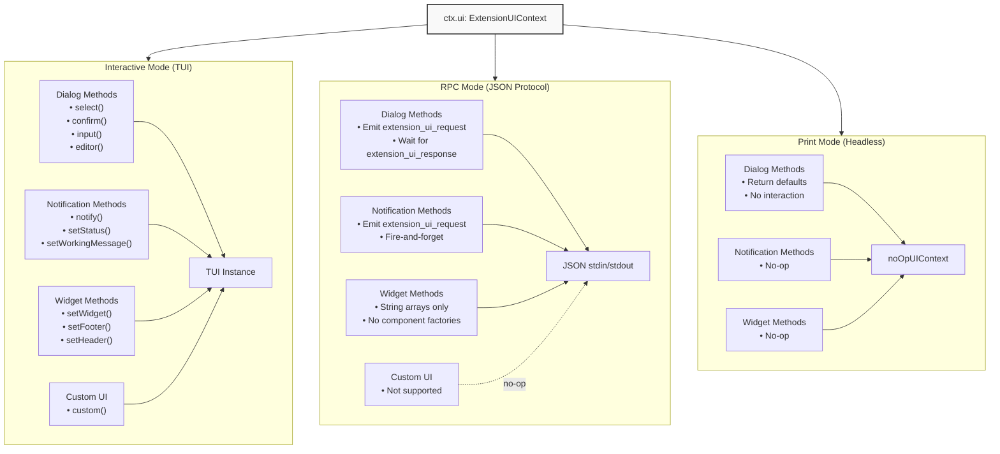
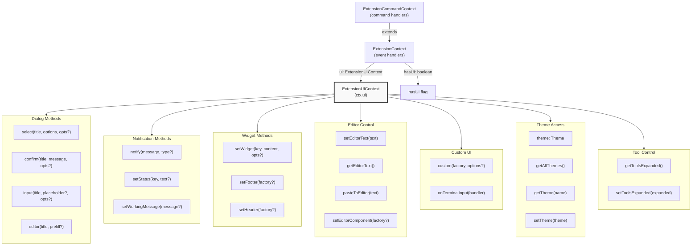
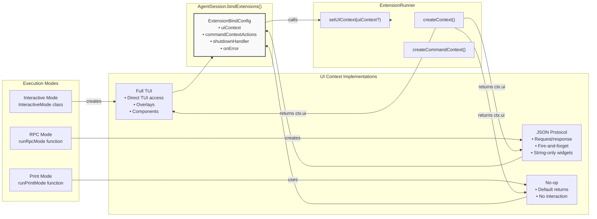

# Extension UI Context

<details>
<summary>Relevant source files</summary>

The following files were used as context for generating this wiki page:

- [packages/coding-agent/docs/extensions.md](packages/coding-agent/docs/extensions.md)
- [packages/coding-agent/src/core/extensions/index.ts](packages/coding-agent/src/core/extensions/index.ts)
- [packages/coding-agent/src/core/extensions/loader.ts](packages/coding-agent/src/core/extensions/loader.ts)
- [packages/coding-agent/src/core/extensions/runner.ts](packages/coding-agent/src/core/extensions/runner.ts)
- [packages/coding-agent/src/core/extensions/types.ts](packages/coding-agent/src/core/extensions/types.ts)
- [packages/coding-agent/src/index.ts](packages/coding-agent/src/index.ts)
- [packages/coding-agent/test/compaction-extensions.test.ts](packages/coding-agent/test/compaction-extensions.test.ts)

</details>

## Purpose and Scope

This page documents the **Extension UI Context** (`ExtensionUIContext`), which provides extensions with methods to interact with users through dialogs, notifications, widgets, and custom UI components. The UI context is available to all extension event handlers and tool execution functions via the `ctx.ui` property.

For information about registering custom tools that use the UI context, see [Custom Tools](#4.4.2). For information about command handlers that have access to the UI context, see [Custom Commands & Shortcuts](#4.4.3).

Sources: [packages/coding-agent/docs/extensions.md:680-686](), [packages/coding-agent/src/core/extensions/types.ts:103-238]()

## Accessing the UI Context

Extensions receive an `ExtensionContext` object in all event handlers, tool execution functions, and command handlers. The UI context is accessible via the `ctx.ui` property:

```typescript
pi.on('session_start', async (_event, ctx) => {
  ctx.ui.notify('Extension loaded!', 'info')
})

pi.registerTool({
  name: 'greet',
  async execute(toolCallId, params, signal, onUpdate, ctx) {
    const name = await ctx.ui.input('Enter name', 'John')
    return { content: [{ type: 'text', text: `Hello, ${name}!` }] }
  },
})
```

The `ctx.hasUI` boolean indicates whether interactive UI is available. This is `false` in print mode (`-p`) and `true` in interactive and RPC modes.

Sources: [packages/coding-agent/docs/extensions.md:680-686](), [packages/coding-agent/src/core/extensions/types.ts:261-265]()

## Mode-Specific Behavior

The `ExtensionUIContext` implementation varies by execution mode:

**Interactive Mode**: Full TUI support with immediate visual feedback. All methods work as documented.

**RPC Mode**: Dialog methods work via JSON protocol (client responds with `extension_ui_response` messages). Fire-and-forget methods emit `extension_ui_request` messages to the client. Some TUI-specific methods (custom components, footer/header factories) are no-ops.

**Print Mode**: All UI methods are no-ops. Dialog methods return default values (undefined/false). Check `ctx.hasUI` before calling interactive methods.



**Mode Behavior Implementation**

Sources: [packages/coding-agent/src/modes/rpc/rpc-mode.ts:120-274](), [packages/coding-agent/src/core/extensions/runner.ts:170-196]()

## Dialog Methods

Dialog methods present UI to the user and wait for a response. All dialog methods support optional `ExtensionUIDialogOptions` for signal-based cancellation and timeout:

| Method                              | Purpose                  | Returns                        |
| ----------------------------------- | ------------------------ | ------------------------------ |
| `select(title, options, opts?)`     | Show a selector list     | `Promise<string \| undefined>` |
| `confirm(title, message, opts?)`    | Show yes/no confirmation | `Promise<boolean>`             |
| `input(title, placeholder?, opts?)` | Show text input          | `Promise<string \| undefined>` |
| `editor(title, prefill?)`           | Show multi-line editor   | `Promise<string \| undefined>` |

**ExtensionUIDialogOptions**:

- `signal?: AbortSignal` - Programmatically dismiss the dialog
- `timeout?: number` - Auto-dismiss after milliseconds with countdown display

```typescript
// Confirmation with timeout
const ok = await ctx.ui.confirm(
  'Dangerous Operation',
  'Delete all files?',
  { timeout: 10000 } // 10 second countdown
)

// Selection with abort signal
const controller = new AbortController()
setTimeout(() => controller.abort(), 5000)

const choice = await ctx.ui.select('Choose action', ['option1', 'option2'], {
  signal: controller.signal,
})
```

**Interactive Mode**: Uses TUI overlays with keyboard navigation.

**RPC Mode**: Emits `extension_ui_request` with method `"select"`, `"confirm"`, `"input"`, or `"editor"`. Waits for client to send `extension_ui_response` with matching `id`. Handles `cancelled` field in response.

**Print Mode**: Returns default values (undefined for select/input/editor, false for confirm).

Sources: [packages/coding-agent/src/core/extensions/types.ts:109-116](), [packages/coding-agent/src/core/extensions/types.ts:84-89](), [packages/coding-agent/src/modes/rpc/rpc-mode.ts:121-144]()

## Notification Methods

Notification methods provide feedback without waiting for user response:

| Method                        | Purpose                | Behavior                                                         |
| ----------------------------- | ---------------------- | ---------------------------------------------------------------- |
| `notify(message, type?)`      | Show notification      | Fire-and-forget message (type: `"info"`, `"warning"`, `"error"`) |
| `setStatus(key, text?)`       | Set footer status text | Pass `undefined` to clear status                                 |
| `setWorkingMessage(message?)` | Set loading message    | Call with no argument to restore default                         |

```typescript
pi.on('tool_call', async (event, ctx) => {
  ctx.ui.setStatus('my-ext', 'Processing...')
  ctx.ui.setWorkingMessage('Custom loading message')

  // ... do work ...

  ctx.ui.setStatus('my-ext', undefined) // Clear status
  ctx.ui.notify('Operation complete', 'success')
})
```

**Interactive Mode**: Updates TUI footer and displays notifications.

**RPC Mode**: Emits `extension_ui_request` with method `"notify"`, `"setStatus"`. Client receives messages but extension does not wait for response.

**Print Mode**: No-ops.

Sources: [packages/coding-agent/src/core/extensions/types.ts:118-127](), [packages/coding-agent/src/modes/rpc/rpc-mode.ts:136-165]()

## Widget System

Widgets display custom content above or below the editor. Extensions can register multiple widgets with unique keys:

```typescript
// String array widget
ctx.ui.setWidget('my-widget', ['Line 1', 'Line 2'], {
  placement: 'aboveEditor',
})

// Component factory widget (interactive mode only)
ctx.ui.setWidget(
  'my-component',
  (tui, theme) => {
    const component = new MyCustomComponent(tui, theme)
    return component
  },
  { placement: 'belowEditor' }
)

// Clear widget
ctx.ui.setWidget('my-widget', undefined)
```

**WidgetPlacement**: `"aboveEditor"` (default) or `"belowEditor"`

**Interactive Mode**: Both string arrays and component factories supported. Components can implement `dispose()` for cleanup.

**RPC Mode**: Only string arrays supported. Component factories are ignored. Emits `extension_ui_request` with method `"setWidget"`, fields `widgetKey`, `widgetLines`, `widgetPlacement`.

**Print Mode**: No-op.

Sources: [packages/coding-agent/src/core/extensions/types.ts:129-135](), [packages/coding-agent/src/core/extensions/types.ts:92-98](), [packages/coding-agent/src/modes/rpc/rpc-mode.ts:167-180]()

## Editor Control Methods

Extensions can programmatically control the input editor:

| Method                         | Purpose                      | Mode Support                                    |
| ------------------------------ | ---------------------------- | ----------------------------------------------- |
| `setEditorText(text)`          | Replace editor content       | Interactive, RPC (emits request)                |
| `getEditorText()`              | Read editor content          | Interactive only (RPC returns `""`)             |
| `pasteToEditor(text)`          | Paste with collapse handling | Interactive (RPC falls back to `setEditorText`) |
| `setEditorComponent(factory?)` | Replace editor component     | Interactive only                                |

```typescript
// Set text
ctx.ui.setEditorText('/skill:refactor')

// Read text
const current = ctx.ui.getEditorText()

// Custom editor component (interactive mode only)
ctx.ui.setEditorComponent((tui, theme, keybindings) => {
  return new CustomEditor(tui, theme, keybindings)
})

// Restore default editor
ctx.ui.setEditorComponent(undefined)
```

**Custom Editor Components**: Must implement `EditorComponent` interface. Can extend `CustomEditor` base class from `@mariozechner/pi-coding-agent` to inherit app-level keybinding support.

**Interactive Mode**: Full access to editor state and customization.

**RPC Mode**: `setEditorText` emits `extension_ui_request` with method `"set_editor_text"`. `getEditorText` returns empty string (client should track state locally).

**Print Mode**: All methods no-op.

Sources: [packages/coding-agent/src/core/extensions/types.ts:173-219](), [packages/coding-agent/src/modes/rpc/rpc-mode.ts:205-225]()

## Custom UI Components

The `custom()` method allows extensions to show arbitrary TUI components with keyboard focus:

```typescript
const result = await ctx.ui.custom<string>(
  (tui, theme, keybindings, done) => {
    // Factory receives:
    // - tui: TUI instance
    // - theme: Current theme
    // - keybindings: KeybindingsManager for app actions
    // - done: Callback to complete with result

    const component = new MyInteractiveComponent(tui, theme)
    component.onComplete = (value) => done(value)

    return component
  },
  {
    overlay: true, // Show as overlay
    overlayOptions: { align: 'center', valign: 'middle' },
    onHandle: (handle) => {
      // Control overlay visibility
      handle.show()
      handle.hide()
    },
  }
)
```

**Options**:

- `overlay?: boolean` - Show as overlay (default: full screen)
- `overlayOptions?: OverlayOptions | (() => OverlayOptions)` - Positioning/sizing (static or dynamic)
- `onHandle?: (handle: OverlayHandle) => void` - Receive overlay control handle

The factory can return a `Component` or `Promise<Component>`. Components can implement `dispose()` for cleanup.

**Interactive Mode**: Full TUI component support with focus management.

**RPC Mode**: Not supported (returns `undefined as never`).

**Print Mode**: Not supported (returns `undefined as never`).

Sources: [packages/coding-agent/src/core/extensions/types.ts:155-170](), [packages/coding-agent/src/modes/rpc/rpc-mode.ts:200-203]()

## UI Customization Methods

Extensions can customize global UI elements:

```typescript
// Custom footer
ctx.ui.setFooter((tui, theme, footerData) => {
  // footerData provides git branch and extension statuses
  const branch = footerData.getGitBranch()
  const statuses = footerData.getExtensionStatuses()

  return new MyFooterComponent(tui, theme, branch, statuses)
})

// Custom header (shown at startup)
ctx.ui.setHeader((tui, theme) => {
  return new MyHeaderComponent(tui, theme)
})

// Terminal title
ctx.ui.setTitle('My Custom Title')

// Restore defaults
ctx.ui.setFooter(undefined)
ctx.ui.setHeader(undefined)
```

**Footer Data Provider**: The footer factory receives a `ReadonlyFooterDataProvider` with methods:

- `getGitBranch(): string | undefined` - Current git branch
- `getExtensionStatuses(): Record<string, string>` - Statuses set by `setStatus()`

Other data (model info, token stats, session info) is available via `ctx.sessionManager` and `ctx.model`.

**Interactive Mode**: Full support.

**RPC Mode**: `setTitle` emits `extension_ui_request` with method `"setTitle"`. Footer/header factories are no-ops.

**Print Mode**: All methods no-op.

Sources: [packages/coding-agent/src/core/extensions/types.ts:137-153](), [packages/coding-agent/src/modes/rpc/rpc-mode.ts:190-198]()

## Terminal Input Capture

Extensions can capture raw terminal input before it reaches the editor:

```typescript
const unsubscribe = ctx.ui.onTerminalInput((data: string) => {
  // data: raw terminal input string

  if (data === '\x1b') {
    // Escape key
    // Handle custom escape behavior
    return { consume: true } // Prevent default handling
  }

  if (data === '!') {
    // Transform input
    return { consume: true, data: '?' }
  }

  // Pass through
  return undefined
})

// Later: unsubscribe
unsubscribe()
```

**Return Values**:

- `undefined` - Pass through to default handling
- `{ consume: true }` - Consume input, prevent default handling
- `{ consume: true, data: string }` - Transform input

**Interactive Mode**: Full support with keyboard event interception.

**RPC Mode**: Not supported (returns no-op unsubscribe function).

**Print Mode**: Not supported (returns no-op unsubscribe function).

Sources: [packages/coding-agent/src/core/extensions/types.ts:120-121](), [packages/coding-agent/src/core/extensions/types.ts:101](), [packages/coding-agent/src/modes/rpc/rpc-mode.ts:146-150]()

## Theme Access

Extensions can read and switch themes:

```typescript
// Get current theme
const theme = ctx.ui.theme
console.log(theme.colors.primary)

// List all themes
const themes = ctx.ui.getAllThemes()
// Returns: [{ name: "default", path: "/path/to/theme.json" }, ...]

// Load theme by name (without switching)
const darkTheme = ctx.ui.getTheme('dark')

// Switch theme
const result = ctx.ui.setTheme('dark')
if (!result.success) {
  console.error(result.error)
}

// Switch theme by object
ctx.ui.setTheme(customThemeObject)
```

The `theme` property provides the current `Theme` object with color definitions, markdown theme, and styling information. Extensions can use this for custom rendering.

**Interactive Mode**: Full theme support with hot-reloading.

**RPC Mode**: `theme` property returns default theme. `getAllThemes`, `getTheme`, `setTheme` return empty/error (theme switching not supported).

**Print Mode**: `theme` property returns default theme. Other methods return empty/error.

Sources: [packages/coding-agent/src/core/extensions/types.ts:222-232](), [packages/coding-agent/src/modes/rpc/rpc-mode.ts:249-264]()

## Tool Output Control

Extensions can control whether tool execution output is expanded or collapsed:

```typescript
// Check current state
const expanded = ctx.ui.getToolsExpanded()

// Set expansion state
ctx.ui.setToolsExpanded(true) // Expand all tool outputs
ctx.ui.setToolsExpanded(false) // Collapse all tool outputs
```

This affects the display of tool execution results in the chat history.

**Interactive Mode**: Controls TUI rendering of tool outputs.

**RPC Mode**: No-op (client controls rendering).

**Print Mode**: No-op.

Sources: [packages/coding-agent/src/core/extensions/types.ts:234-237](), [packages/coding-agent/src/modes/rpc/rpc-mode.ts:266-273]()

## Type Definitions Reference



**Type Definition Hierarchy**

The complete `ExtensionUIContext` interface is defined in [packages/coding-agent/src/core/extensions/types.ts:103-238](). Implementations:

- Interactive: Inline within [packages/coding-agent/src/modes/interactive/mode.ts]()
- RPC: [packages/coding-agent/src/modes/rpc/rpc-mode.ts:120-274]()
- Print: [packages/coding-agent/src/core/extensions/runner.ts:170-196]() (`noOpUIContext`)

Sources: [packages/coding-agent/src/core/extensions/types.ts:103-238](), [packages/coding-agent/src/core/extensions/types.ts:260-288]()

## Implementation Details by Mode



**Mode Implementation Flow**

Each mode creates its own `ExtensionUIContext` implementation and passes it to `AgentSession.bindExtensions()`. The session stores this in `ExtensionRunner` via `setUIContext()`. When extensions receive their context objects (`ExtensionContext` or `ExtensionCommandContext`), the `ui` property references this mode-specific implementation.

Sources: [packages/coding-agent/src/modes/rpc/rpc-mode.ts:276-313](), [packages/coding-agent/src/modes/print-mode.ts:39-73](), [packages/coding-agent/src/core/extensions/runner.ts:296-306]()
