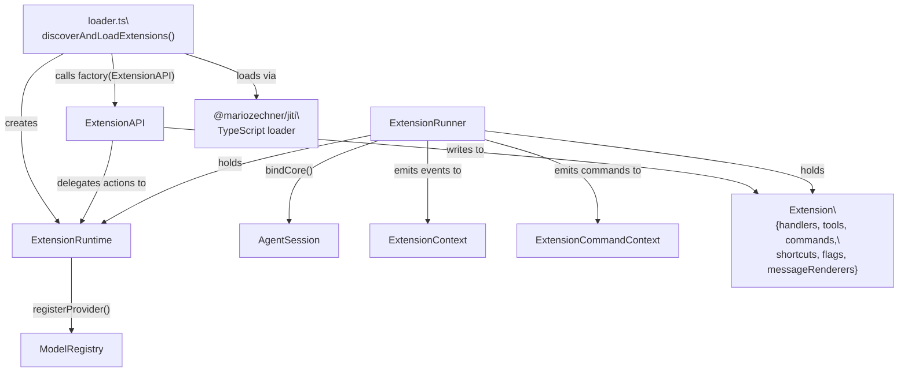
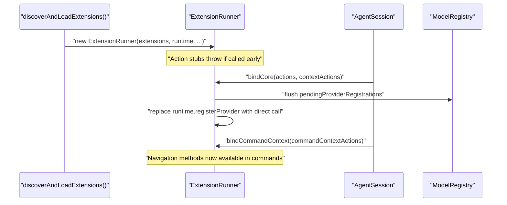
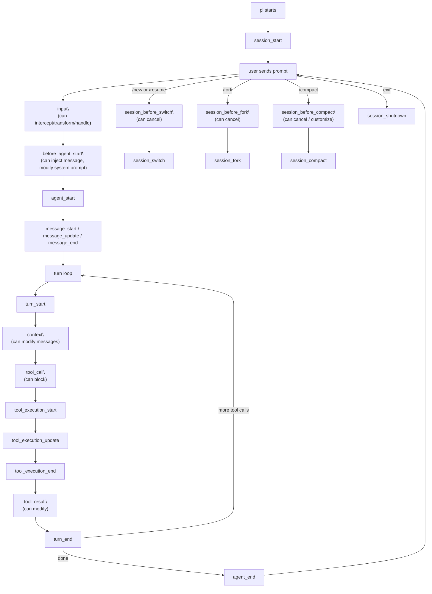
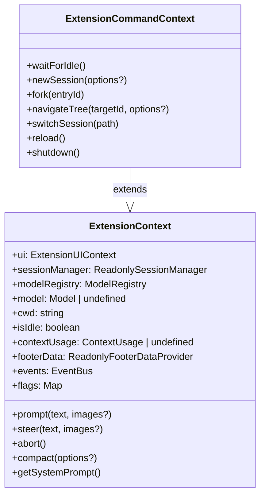
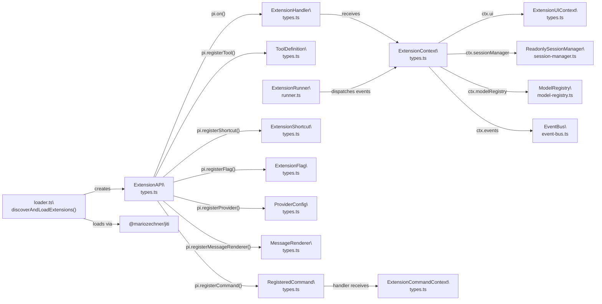

# Extension System

<details>
<summary>Relevant source files</summary>

The following files were used as context for generating this wiki page:

- [packages/coding-agent/docs/extensions.md](packages/coding-agent/docs/extensions.md)
- [packages/coding-agent/src/core/extensions/index.ts](packages/coding-agent/src/core/extensions/index.ts)
- [packages/coding-agent/src/core/extensions/loader.ts](packages/coding-agent/src/core/extensions/loader.ts)
- [packages/coding-agent/src/core/extensions/runner.ts](packages/coding-agent/src/core/extensions/runner.ts)
- [packages/coding-agent/src/core/extensions/types.ts](packages/coding-agent/src/core/extensions/types.ts)
- [packages/coding-agent/src/index.ts](packages/coding-agent/src/index.ts)
- [packages/coding-agent/test/compaction-extensions.test.ts](packages/coding-agent/test/compaction-extensions.test.ts)

</details>

This page documents the extension system in the `pi-coding-agent` package (`@mariozechner/pi-coding-agent`). It covers the full `ExtensionAPI` surface, all `pi.on` event types, registration methods, the `ExtensionContext` / `ExtensionCommandContext` distinction, the `ExtensionRunner` lifecycle, and how extensions are loaded via jiti.

For the package and resource management that discovers and installs extension files, see [4.5](#4.5). For how the agent session (`AgentSession`) wires extensions into the agent loop, see [4.2](#4.2). For model provider registration, see [4.7](#4.7).

---

## Overview

Extensions are TypeScript modules that receive an `ExtensionAPI` object and register behavior against it. They can intercept events, register LLM-callable tools, add slash commands, keyboard shortcuts, CLI flags, custom message renderers, and custom LLM providers.

**Extension module signature:**

```typescript
import type { ExtensionAPI } from "@mariozechner/pi-coding-agent";

export default function (pi: ExtensionAPI) {
  pi.on("session_start", async (_event, ctx) => { ... });
  pi.registerTool({ ... });
  pi.registerCommand("name", { ... });
}
```

Extensions are loaded using [jiti](https://github.com/unjs/jiti), so TypeScript works without a separate compilation step.

Sources: [packages/coding-agent/docs/extensions.md:1-174](), [packages/coding-agent/src/core/extensions/loader.ts:1-50]()

---

## Architecture

**Extension System Component Diagram**



Sources: [packages/coding-agent/src/core/extensions/loader.ts:100-200](), [packages/coding-agent/src/core/extensions/runner.ts:196-272](), [packages/coding-agent/src/core/extensions/types.ts:1-100]()

---

## Extension Loading

The `discoverAndLoadExtensions()` function in `loader.ts` resolves extension files, instantiates a `jiti` transpiler, and calls each extension factory.

**Auto-discovered locations:**

| Location                                  | Scope                        |
| ----------------------------------------- | ---------------------------- |
| `~/.pi/agent/extensions/*.ts`             | Global                       |
| `~/.pi/agent/extensions/*/index.ts`       | Global (subdirectory)        |
| `.pi/extensions/*.ts`                     | Project-local                |
| `.pi/extensions/*/index.ts`               | Project-local (subdirectory) |
| Paths in `settings.json` → `extensions`   | Explicit                     |
| Paths in `package.json` → `pi.extensions` | Package manifest             |

The loader creates a `jiti` instance with a set of **virtual modules** — packages pre-bundled into the binary that extensions can import without installing them:

| Import                          | Source                  |
| ------------------------------- | ----------------------- |
| `@sinclair/typebox`             | `_bundledTypebox`       |
| `@mariozechner/pi-ai`           | `_bundledPiAi`          |
| `@mariozechner/pi-tui`          | `_bundledPiTui`         |
| `@mariozechner/pi-agent-core`   | `_bundledPiAgentCore`   |
| `@mariozechner/pi-coding-agent` | `_bundledPiCodingAgent` |

Extensions with external npm dependencies place a `package.json` in their directory and run `npm install`; `node_modules` is then resolved via normal Node.js resolution.

Sources: [packages/coding-agent/src/core/extensions/loader.ts:40-100](), [packages/coding-agent/docs/extensions.md:110-222]()

---

## ExtensionRuntime and ExtensionRunner

`createExtensionRuntime()` in `loader.ts` creates the shared `ExtensionRuntime` object. This is a single object shared across all loaded extensions. It holds:

- Action method stubs that throw until `runner.bindCore()` replaces them with real implementations.
- `pendingProviderRegistrations` — a queue of `registerProvider()` calls made during load time.
- `flagValues` — resolved values for registered CLI flags.

`ExtensionRunner` in `runner.ts` is the central dispatcher:

- Constructed with `extensions[]`, `runtime`, `cwd`, `sessionManager`, `modelRegistry`.
- **`bindCore(actions, contextActions)`** — called by `AgentSession` after initialization. Flushes pending provider registrations and wires real action methods into the runtime.
- **`bindCommandContext(actions)`** — wires navigation actions (`newSession`, `fork`, `navigateTree`, `switchSession`, `reload`). Called only when a UI mode is present.
- **`emit(event)`** — dispatches to all handlers registered for that event type across all loaded extensions. Returns a combined result for `session_before_*` events.
- **`emitToolCall(event)`** — dedicated emitter with blocking support; returns `{ block, reason }` if any handler blocks.
- **`emitToolResult(event)`** — chains result patches across handlers (not last-wins).
- **`emitBeforeAgentStart(event)`** — collects `message` injections and system prompt modifications from all handlers.

**ExtensionRunner binding lifecycle:**



Sources: [packages/coding-agent/src/core/extensions/runner.ts:196-272](), [packages/coding-agent/src/core/extensions/loader.ts:100-140]()

---

## Events Reference

All events are subscribed via `pi.on(eventType, async (event, ctx) => { ... })`.

### Lifecycle Flow

**Full Extension Event Lifecycle**



Sources: [packages/coding-agent/docs/extensions.md:224-282]()

### Session Events

| Event type               | When fired                        | Can return                                              |
| ------------------------ | --------------------------------- | ------------------------------------------------------- |
| `session_start`          | On initial session load           | —                                                       |
| `session_before_switch`  | Before `/new` or `/resume`        | `{ cancel: true }`                                      |
| `session_switch`         | After session switch completes    | —                                                       |
| `session_before_fork`    | Before `/fork`                    | `{ cancel: true }`, `{ skipConversationRestore: true }` |
| `session_fork`           | After fork completes              | —                                                       |
| `session_before_compact` | Before compaction                 | `{ cancel: true }`, `{ compaction: {...} }`             |
| `session_compact`        | After compaction saved            | —                                                       |
| `session_before_tree`    | Before `/tree` navigation         | `{ cancel: true }`, `{ summary: {...} }`                |
| `session_tree`           | After tree navigation             | —                                                       |
| `session_shutdown`       | On exit (Ctrl+C, Ctrl+D, SIGTERM) | —                                                       |

Event payloads:

- `session_before_compact` includes `preparation: CompactionPreparation`, `branchEntries`, `signal`.
- `session_compact` includes `compactionEntry: CompactionEntry`, `fromExtension: boolean`.
- `session_before_fork` includes `entryId`.
- `session_before_switch` includes `reason: "new" | "resume"`, `targetSessionFile`.

Sources: [packages/coding-agent/docs/extensions.md:284-387](), [packages/coding-agent/src/core/extensions/types.ts:300-500]()

### Agent Events

| Event type           | When fired                                | Payload                               |
| -------------------- | ----------------------------------------- | ------------------------------------- |
| `before_agent_start` | After prompt submitted, before agent loop | `prompt`, `images`, `systemPrompt`    |
| `agent_start`        | Once per user prompt, start               | —                                     |
| `agent_end`          | Once per user prompt, end                 | `messages`                            |
| `turn_start`         | Start of each LLM turn                    | `turnIndex`, `timestamp`              |
| `turn_end`           | End of each LLM turn                      | `turnIndex`, `message`, `toolResults` |
| `message_start`      | New message begins streaming              | message type info                     |
| `message_update`     | Streaming update (assistant only)         | partial content                       |
| `message_end`        | Message stream completed                  | final message                         |
| `context`            | Before LLM call, can modify messages      | `messages`                            |

`before_agent_start` handlers can return:

```typescript
{
  message?: { customType, content, display },
  systemPrompt?: string   // replaces systemPrompt for this turn; chained across extensions
}
```

Sources: [packages/coding-agent/docs/extensions.md:390-440](), [packages/coding-agent/src/core/extensions/types.ts:500-650]()

### Tool Events

| Event type              | When fired                | Can return                                      |
| ----------------------- | ------------------------- | ----------------------------------------------- |
| `tool_call`             | Before tool execution     | `{ block: true, reason: string }`               |
| `tool_execution_start`  | Tool execution begins     | —                                               |
| `tool_execution_update` | Tool sends partial update | —                                               |
| `tool_execution_end`    | Tool execution completes  | —                                               |
| `tool_result`           | After tool returns result | `{ result: AgentToolResult }` (patches chained) |

**Tool call event types** are discriminated by `toolName`:

| Type                  | `toolName`                      |
| --------------------- | ------------------------------- |
| `BashToolCallEvent`   | `"bash"`                        |
| `ReadToolCallEvent`   | `"read"`                        |
| `WriteToolCallEvent`  | `"write"`                       |
| `EditToolCallEvent`   | `"edit"`                        |
| `FindToolCallEvent`   | `"find"`                        |
| `GrepToolCallEvent`   | `"grep"`                        |
| `LsToolCallEvent`     | `"ls"`                          |
| `CustomToolCallEvent` | any registered custom tool name |

Use `isToolCallEventType(event, "bash")` from the package for type-safe narrowing.

Sources: [packages/coding-agent/src/core/extensions/types.ts:600-750](), [packages/coding-agent/docs/extensions.md:460-600]()

### Other Events

| Event type           | When fired                          | Notes                                                     |
| -------------------- | ----------------------------------- | --------------------------------------------------------- |
| `input`              | User submits a prompt               | Can intercept, transform text, mark as handled            |
| `terminal_input`     | Raw terminal keypress               | Can consume or transform input before TUI handling        |
| `user_bash`          | Extension requests interactive bash | Used by `interactive-shell` example                       |
| `model_select`       | Model or thinking level changes     | `source: "command" \| "cycling" \| "flag" \| "api"`       |
| `resources_discover` | Resource loader discovers resources | Can return additional extensions, skills, prompts, themes |

Sources: [packages/coding-agent/docs/extensions.md:600-750](), [packages/coding-agent/src/core/extensions/types.ts:750-900]()

---

## ExtensionAPI Registration Methods

All registration methods are called during the initial extension factory function invocation.

### `pi.on(eventType, handler)`

Registers an async handler for a named event. Multiple handlers per event are allowed; all are called in registration order.

### `pi.registerTool(definition: ToolDefinition)`

Registers an LLM-callable tool. The `ToolDefinition` shape:

```typescript
{
  name: string;
  label: string;
  description: string;
  parameters: TSchema;          // TypeBox schema
  execute(
    toolCallId: string,
    params: Static<TSchema>,
    signal: AbortSignal,
    onUpdate: AgentToolUpdateCallback,
    ctx: ExtensionContext
  ): Promise<AgentToolResult>;
}
```

Tools registered here appear alongside built-in tools (`bash`, `read`, `write`, `edit`, `find`, `grep`, `ls`) in the LLM's tool list.

### `pi.registerCommand(name, options)`

Registers a `/name` slash command. Handler receives `(args: string, ctx: ExtensionCommandContext)`.

```typescript
pi.registerCommand('hello', {
  description: 'Say hello',
  handler: async (args, ctx) => {
    ctx.ui.notify(`Hello ${args}!`, 'info')
  },
})
```

Commands registered by extensions that conflict with built-in commands are skipped. Conflicts between extensions are resolved first-registration-wins.

### `pi.registerShortcut(keyId, options)`

Registers a keyboard shortcut. `keyId` is a string like `"ctrl+shift+x"`. Handler receives `(ctx: ExtensionContext)`.

Shortcuts conflicting with **reserved actions** are blocked entirely. Reserved actions include: `interrupt`, `clear`, `exit`, `suspend`, `cycleThinkingLevel`, `cycleModelForward`, `cycleModelBackward`, `selectModel`, `expandTools`, `toggleThinking`, `externalEditor`, `followUp`, `submit`, `selectConfirm`, `selectCancel`, `copy`, `deleteToLineEnd`.

Shortcuts conflicting with non-reserved built-ins generate a warning but are allowed.

Sources: [packages/coding-agent/src/core/extensions/runner.ts:53-90]()

### `pi.registerFlag(name, options)`

Registers a CLI flag available as `--name` or `--no-name`. Flags are readable via `ctx.flags.get(name)` or `runtime.flagValues`.

```typescript
pi.registerFlag('my-flag', {
  description: 'Enable my feature',
  type: 'boolean',
  default: false,
})
```

### `pi.registerMessageRenderer(type, renderer: MessageRenderer)`

Registers a custom renderer for a message `customType`. Controls how that message type appears in the TUI. The `MessageRenderer` interface:

```typescript
interface MessageRenderer {
  render(message: CustomMessage, options: MessageRenderOptions): string[]
  getExpandState?(message: CustomMessage): boolean
}
```

### `pi.registerProvider(name, config: ProviderConfig)`

Registers a custom LLM provider and its models. During the initial load phase, calls are queued in `runtime.pendingProviderRegistrations` and flushed when `runner.bindCore()` is called. After binding, calls take effect immediately against `ModelRegistry`.

```typescript
pi.registerProvider('my-provider', {
  baseUrl: 'https://api.example.com/v1',
  apiKey: 'MY_API_KEY',
  api: 'openai-completions',
  models: [
    {
      id: 'my-model',
      name: 'My Model',
      contextWindow: 128000,
      maxTokens: 4096,
    },
  ],
})
```

### `pi.unregisterProvider(name)`

Removes a previously registered provider and its models from `ModelRegistry`. Built-in models that were overridden by the provider are restored. Takes effect immediately when called after `bindCore()`.

Sources: [packages/coding-agent/src/core/extensions/loader.ts:140-210](), [packages/coding-agent/src/core/extensions/runner.ts:260-272](), [packages/coding-agent/src/core/extensions/types.ts:900-1000]()

---

## ExtensionContext vs ExtensionCommandContext

**Context Object Comparison**



`ExtensionContext` is available in all event handlers. `ExtensionCommandContext` is available only in command handlers (`registerCommand`) and provides navigation and session management operations that require the full interactive mode to be wired up.

Sources: [packages/coding-agent/src/core/extensions/types.ts:230-370](), [packages/coding-agent/src/core/extensions/runner.ts:274-340]()

---

## ExtensionUIContext

The `ui` field on `ExtensionContext` provides mode-aware user interaction. Each mode (interactive, RPC, print) supplies its own implementation. The `noOpUIContext` in `runner.ts` is the fallback used until a real UI is bound.

| Method                              | Purpose                                                     |
| ----------------------------------- | ----------------------------------------------------------- |
| `select(title, options, opts?)`     | Show a selector; returns chosen string or `undefined`       |
| `confirm(title, message, opts?)`    | Show yes/no dialog; returns boolean                         |
| `input(title, placeholder?, opts?)` | Show text input; returns string or `undefined`              |
| `notify(message, type?)`            | Show notification (`"info"`, `"warning"`, `"error"`)        |
| `onTerminalInput(handler)`          | Listen to raw terminal keystrokes; returns unsubscribe fn   |
| `setStatus(key, text)`              | Set footer status text for a named key                      |
| `setWorkingMessage(message?)`       | Override the "working" spinner message                      |
| `setWidget(key, content, options?)` | Set widget above/below editor                               |
| `setFooter(factory)`                | Replace the entire footer component                         |
| `setHeader(factory)`                | Replace the header component                                |
| `setTitle(title)`                   | Set terminal window/tab title                               |
| `custom(factory, options?)`         | Show a full custom TUI component with keyboard focus        |
| `pasteToEditor(text)`               | Programmatically paste text into the editor                 |
| `setEditorText(text)`               | Set editor content                                          |
| `getEditorText()`                   | Get editor content                                          |
| `editor(title, prefill?)`           | Show multi-line editor overlay; returns text or `undefined` |
| `setEditorComponent(factory)`       | Replace the core editor with a custom implementation        |
| `getAllThemes()`                    | List available themes                                       |
| `getTheme(name)`                    | Load a theme by name                                        |
| `setTheme(name \| Theme)`           | Switch the active theme                                     |
| `getToolsExpanded()`                | Get whether tool output is expanded                         |
| `setToolsExpanded(expanded)`        | Set tool output expansion state                             |

All dialog methods (`select`, `confirm`, `input`, `custom`) accept an `ExtensionUIDialogOptions` with an optional `signal: AbortSignal` and `timeout: number`.

Sources: [packages/coding-agent/src/core/extensions/types.ts:83-230](), [packages/coding-agent/src/core/extensions/runner.ts:168-194]()

---

## Action Methods on ExtensionRuntime

These are also available on `ExtensionContext` (via the `pi.` namespace in some cases). They route through `ExtensionRuntime` to the underlying session:

| Method                              | Purpose                                        |
| ----------------------------------- | ---------------------------------------------- |
| `pi.sendMessage(text)`              | Send a steering message to the agent           |
| `pi.sendUserMessage(text, images?)` | Send a visible user message                    |
| `pi.appendEntry(entry)`             | Append a custom entry to the session JSONL     |
| `pi.setSessionName(name)`           | Name the current session                       |
| `pi.getSessionName()`               | Get the current session name                   |
| `pi.setLabel(entryId, label)`       | Add a label to an entry for `/tree` navigation |
| `pi.getActiveTools()`               | Get list of active tool names                  |
| `pi.getAllTools()`                  | Get all registered tools with parameters       |
| `pi.setActiveTools(names)`          | Set the active tool list                       |
| `pi.getCommands()`                  | List all available slash commands              |
| `pi.setModel(model)`                | Switch the active LLM model                    |
| `pi.getThinkingLevel()`             | Get current thinking level                     |
| `pi.setThinkingLevel(level)`        | Set thinking level                             |
| `pi.events`                         | `EventBus` for inter-extension communication   |
| `pi.setBashSpawnHook(hook)`         | Intercept bash commands before execution       |

Sources: [packages/coding-agent/src/core/extensions/types.ts:1000-1100](), [packages/coding-agent/src/core/extensions/runner.ts:236-272]()

---

## Conflict Resolution

**Shortcuts:** The `RESERVED_ACTIONS_FOR_EXTENSION_CONFLICTS` array defines actions whose bound keys cannot be overridden by any extension. The effective bound keys are computed at `runner.getShortcuts(effectiveKeybindings)` call time. Non-reserved built-in conflicts generate a console warning but allow the extension shortcut.

**Commands:** Built-in commands always win. Extension vs extension conflicts are resolved first-registered-wins (load order = discovery order, project-local before global since v0.55.0).

**Tools:** Extension tool names that conflict with built-in tool names do not silently override them; both are tracked. First registration wins in case of extension vs extension conflicts.

**Providers/models:** `registerProvider()` may override built-in model entries by `id`. `unregisterProvider()` restores overridden built-ins.

Sources: [packages/coding-agent/src/core/extensions/runner.ts:53-90](), [packages/coding-agent/CHANGELOG.md:49-55]()

---

## Extension File Structure

Three supported layouts:

**Single file:**

```
~/.pi/agent/extensions/my-extension.ts
```

**Directory:**

```
~/.pi/agent/extensions/my-extension/
    index.ts       ← entry point
    tools.ts
```

**Package with dependencies:**

```
~/.pi/agent/extensions/my-extension/
    package.json   ← declares { "pi": { "extensions": ["./index.ts"] } }
    node_modules/
    index.ts
```

The `pi.extensions` field in `package.json` lists entry points for the pi manifest. See [packages/coding-agent/examples/extensions/with-deps/package.json:1-22]() for a working example.

Sources: [packages/coding-agent/docs/extensions.md:176-220](), [packages/coding-agent/examples/extensions/with-deps/package.json:1-22]()

---

## Key Type Map

**Extension System Types to Source Locations**



Sources: [packages/coding-agent/src/core/extensions/types.ts:1-100](), [packages/coding-agent/src/core/extensions/index.ts:1-167](), [packages/coding-agent/src/index.ts:50-140]()
