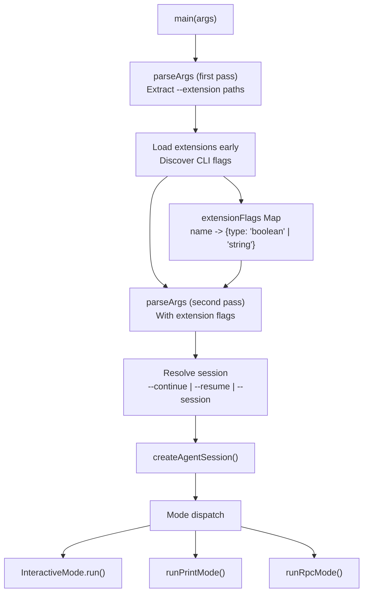
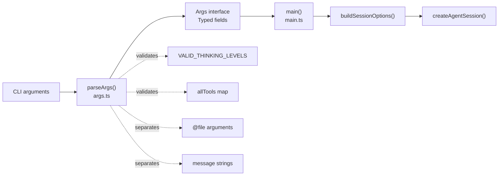
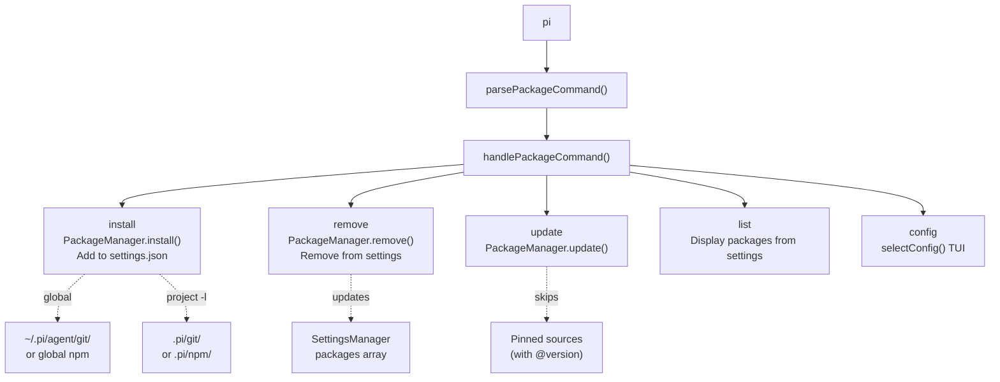
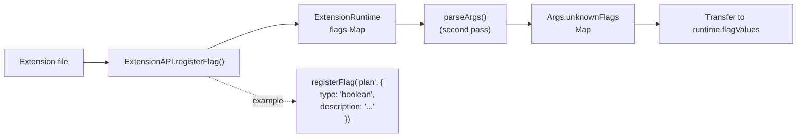

# Getting Started & CLI Reference

<details>
<summary>Relevant source files</summary>

The following files were used as context for generating this wiki page:

- [AGENTS.md](AGENTS.md)
- [README.md](README.md)
- [packages/coding-agent/README.md](packages/coding-agent/README.md)
- [packages/coding-agent/src/cli/args.ts](packages/coding-agent/src/cli/args.ts)
- [packages/coding-agent/src/main.ts](packages/coding-agent/src/main.ts)

</details>

This document covers installation, basic usage, and the complete command-line interface reference for the `pi` coding agent CLI. For information about interactive mode features, see [Interactive Mode & TUI Integration](#4.10). For session management, see [Session Management & History Tree](#4.3). For customization through extensions, skills, and themes, see [Extension System](#4.4), [Skills & Prompt Templates](#4.8), and [Theme System](#4.9).

---

## Installation

Install globally via npm:

```bash
npm install -g @mariozechner/pi-coding-agent
```

The `pi` command becomes available system-wide. Configuration and session data are stored in `~/.pi/agent/` by default (customizable via `PI_CODING_AGENT_DIR` environment variable).

**Platform Requirements:**

- Node.js 18+
- Terminal with ANSI support for interactive mode
- Optional: Kitty keyboard protocol support for enhanced keyboard shortcuts

**Platform-specific setup:**

- [Windows](https://github.com/badlogic/pi-mono/blob/main/packages/coding-agent/docs/windows.md)
- [Termux (Android)](https://github.com/badlogic/pi-mono/blob/main/packages/coding-agent/docs/termux.md)
- [tmux configuration](https://github.com/badlogic/pi-mono/blob/main/packages/coding-agent/docs/tmux.md)
- [Terminal setup guide](https://github.com/badlogic/pi-mono/blob/main/packages/coding-agent/docs/terminal-setup.md)

Sources: [packages/coding-agent/README.md:59-81]()

---

## Basic Usage Patterns

### Authentication

Authenticate using an API key:

```bash
export ANTHROPIC_API_KEY=sk-ant-...
pi
```

Or authenticate via OAuth subscription (interactive):

```bash
pi
/login  # Select provider from menu
```

OAuth tokens are stored in `~/.pi/agent/auth.json`. For details on authentication mechanisms, see [Authentication & Cost Tracking](#2.4).

### Invocation Modes

**Interactive mode** (default):

```bash
pi                                    # Start new session
pi "List all .ts files in src/"      # Start with initial prompt
pi --continue                         # Continue most recent session
pi --resume                           # Browse and select session
```

**Print mode** (single-shot, no TUI):

```bash
pi -p "Summarize this codebase"
pi --print "List files"
```

**JSON mode** (events as JSON lines):

```bash
pi --mode json "Review code"
```

**RPC mode** (headless process integration):

```bash
pi --mode rpc
```

For details on print and RPC modes, see [Print Mode & RPC Mode](#4.11).

### File Arguments

Prefix files with `@` to include them in the initial message:

```bash
pi @prompt.md "Answer this"
pi -p @screenshot.png "What's in this image?"
pi @code.ts @test.ts "Review these files"
```

File argument processing supports text files, images (via base64 encoding), and auto-resizing. Implementation in [packages/coding-agent/src/cli/file-processor.ts]().

Sources: [packages/coding-agent/README.md:59-82](), [packages/coding-agent/src/main.ts:311-336]()

---

## CLI Architecture and Execution Flow

The CLI entry point orchestrates argument parsing, resource loading, session creation, and mode dispatch.

### Main Execution Pipeline



**Key implementation details:**

- Two-pass argument parsing: first pass extracts `--extension` paths, second pass includes extension-registered flags
- Extensions can register CLI flags via `ExtensionAPI.registerFlag()`, which are collected in [packages/coding-agent/src/main.ts:646-651]()
- Session resolution logic in `resolveSessionPath` [packages/coding-agent/src/main.ts:349-374]() handles partial UUID matching and cross-project session lookup

Sources: [packages/coding-agent/src/main.ts:587-829](), [packages/coding-agent/src/cli/args.ts:55-177]()

### Argument Processing Components



The `parseArgs` function in [packages/coding-agent/src/cli/args.ts:55-177]() returns an `Args` interface with strongly-typed fields. File arguments (starting with `@`) are separated into `fileArgs`, non-flag arguments become `messages`, and unrecognized `--flags` are captured in `unknownFlags` for extension processing.

Sources: [packages/coding-agent/src/cli/args.ts:12-47](), [packages/coding-agent/src/cli/args.ts:55-177]()

---

## Package Management Commands

Pi supports installing, removing, and updating packages that bundle extensions, skills, prompts, and themes. Packages can be sourced from npm, git repositories, or local paths.

### Command Dispatch



### Package Command Reference

| Command                      | Usage              | Description                                             |
| ---------------------------- | ------------------ | ------------------------------------------------------- |
| `pi install <source> [-l]`   | Install package    | Installs package and adds source to settings            |
| `pi remove <source> [-l]`    | Remove package     | Removes package and source from settings                |
| `pi uninstall <source> [-l]` | Alias for remove   | Same as `remove`                                        |
| `pi update [source]`         | Update packages    | Updates all packages or specific source (skips pinned)  |
| `pi list`                    | List packages      | Shows installed packages from user and project settings |
| `pi config`                  | Configure packages | TUI to enable/disable individual resources              |

**Package source formats:**

```bash
# npm
pi install npm:@foo/pi-tools
pi install npm:@foo/pi-tools@1.2.3      # Pinned version

# git (HTTPS)
pi install git:github.com/user/repo
pi install https://github.com/user/repo@v1

# git (SSH)
pi install git:git@github.com:user/repo
pi install ssh://git@github.com/user/repo@v1

# Local path
pi install ./local/path
pi install /absolute/path
```

**Scope flags:**

- Default: Global install (`~/.pi/agent/`)
- `-l`, `--local`: Project-local install (`.pi/`)

For comprehensive package management documentation, see [Package Management](#4.12).

Sources: [packages/coding-agent/src/main.ts:72-309](), [packages/coding-agent/README.md:344-382]()

---

## CLI Options Reference

### Model and Provider Options

| Option                   | Argument            | Description                                              |
| ------------------------ | ------------------- | -------------------------------------------------------- |
| `--provider <name>`      | Provider name       | Select provider (anthropic, openai, google, etc.)        |
| `--model <pattern>`      | Model pattern or ID | Supports `provider/id` and optional `:<thinking>` suffix |
| `--api-key <key>`        | API key string      | Runtime API key override (not persisted)                 |
| `--thinking <level>`     | Thinking level      | `off`, `minimal`, `low`, `medium`, `high`, `xhigh`       |
| `--models <patterns>`    | Comma-separated     | Model patterns for Ctrl+P cycling                        |
| `--list-models [search]` | Optional search     | List available models with fuzzy search                  |

**Model pattern syntax:**

- Simple: `sonnet`, `gpt-4o`, `claude-3-5-sonnet-20241022`
- With provider: `anthropic/sonnet`, `openai/gpt-4o`
- With thinking level: `sonnet:high`, `openai/gpt-4o:medium`
- Globs for cycling: `anthropic/*`, `*sonnet*`, `claude-*`

Model resolution is handled by `resolveCliModel` in [packages/coding-agent/src/core/model-resolver.ts](). For detailed model resolution logic, see [Model Resolution & Thinking Levels](#4.7).

Sources: [packages/coding-agent/src/cli/args.ts:78-82](), [packages/coding-agent/src/cli/args.ts:94-121](), [packages/coding-agent/src/main.ts:484-533]()

### Session Options

| Option                | Argument                 | Description                                       |
| --------------------- | ------------------------ | ------------------------------------------------- |
| `-c`, `--continue`    | None                     | Continue most recent session in current directory |
| `-r`, `--resume`      | None                     | Browse and select from past sessions (TUI picker) |
| `--session <path>`    | File path or UUID prefix | Use specific session file or match by ID          |
| `--session-dir <dir>` | Directory path           | Custom session storage directory                  |
| `--no-session`        | None                     | Ephemeral mode (don't persist session)            |

**Session resolution logic:**

1. If `--session` contains `/` or ends with `.jsonl`: treat as file path
2. Otherwise: match as session ID prefix, first in current project, then globally
3. If found in different project: prompt to fork into current directory

Implementation in `resolveSessionPath` [packages/coding-agent/src/main.ts:349-374]() and `createSessionManager` [packages/coding-agent/src/main.ts:416-465]().

Sources: [packages/coding-agent/src/cli/args.ts:74-93](), [packages/coding-agent/src/main.ts:416-465]()

### Tool Options

| Option           | Argument        | Description                                             |
| ---------------- | --------------- | ------------------------------------------------------- |
| `--tools <list>` | Comma-separated | Enable specific built-in tools                          |
| `--no-tools`     | None            | Disable all built-in tools (extension tools still work) |

**Available built-in tools:** `read`, `bash`, `edit`, `write`, `grep`, `find`, `ls`

Default tools: `read`, `bash`, `edit`, `write`

Tool names are validated against the `allTools` map in [packages/coding-agent/src/core/tools/index.ts](). For tool execution details, see [Tool Execution & Built-in Tools](#4.5).

Sources: [packages/coding-agent/src/cli/args.ts:96-110](), [packages/coding-agent/src/main.ts:549-559]()

### Resource Options

| Option                       | Argument          | Description                       |
| ---------------------------- | ----------------- | --------------------------------- |
| `-e`, `--extension <source>` | Path, npm, or git | Load extension (repeatable)       |
| `--no-extensions`            | None              | Disable extension discovery       |
| `--skill <path>`             | Path              | Load skill (repeatable)           |
| `--no-skills`                | None              | Disable skill discovery           |
| `--prompt-template <path>`   | Path              | Load prompt template (repeatable) |
| `--no-prompt-templates`      | None              | Disable prompt template discovery |
| `--theme <path>`             | Path              | Load theme (repeatable)           |
| `--no-themes`                | None              | Disable theme discovery           |

**Discovery behavior:**

- Without `--no-*` flags: Auto-discover from standard directories
- With `--no-*`: Discovery disabled, only explicitly loaded resources available
- Combination: `--no-extensions -e ./my-ext.ts` loads only specified extension

Resource loading is handled by `DefaultResourceLoader` in [packages/coding-agent/src/core/resource-loader.ts](). See [Extension System](#4.4), [Skills & Prompt Templates](#4.8), and [Theme System](#4.9) for details.

Sources: [packages/coding-agent/src/cli/args.ts:126-146](), [packages/coding-agent/src/main.ts:616-631]()

### Mode Options

| Option            | Argument        | Description                                   |
| ----------------- | --------------- | --------------------------------------------- |
| (default)         | None            | Interactive mode with full TUI                |
| `-p`, `--print`   | None            | Print mode: single-shot execution, no TUI     |
| `--mode json`     | None            | JSON mode: output all events as JSON lines    |
| `--mode rpc`      | None            | RPC mode: JSON-RPC protocol over stdin/stdout |
| `--export <file>` | Input file path | Export session to HTML and exit               |

**Mode determination logic in [packages/coding-agent/src/main.ts:708-710]():**

```typescript
const isInteractive = !parsed.print && parsed.mode === undefined
const mode = parsed.mode || 'text'
```

Mode dispatch in [packages/coding-agent/src/main.ts:793-828]():

- RPC mode: `runRpcMode(session)`
- Interactive: `InteractiveMode.run()`
- Print/JSON: `runPrintMode(session, { mode, ... })`

Sources: [packages/coding-agent/src/cli/args.ts:69-73](), [packages/coding-agent/src/cli/args.ts:122-125](), [packages/coding-agent/src/main.ts:793-828]()

### Other Options

| Option                          | Argument          | Description                                              |
| ------------------------------- | ----------------- | -------------------------------------------------------- |
| `--system-prompt <text>`        | Text or file path | Replace default system prompt                            |
| `--append-system-prompt <text>` | Text or file path | Append to system prompt                                  |
| `--verbose`                     | None              | Force verbose startup (overrides `quietStartup` setting) |
| `--offline`                     | None              | Disable network operations (same as `PI_OFFLINE=1`)      |
| `-h`, `--help`                  | None              | Show help message                                        |
| `-v`, `--version`               | None              | Show version number                                      |

Sources: [packages/coding-agent/src/cli/args.ts:84-87](), [packages/coding-agent/src/cli/args.ts:153-157]()

---

## Environment Variables

Pi recognizes environment variables for API authentication, behavior customization, and path overrides.

### Provider API Keys

| Variable                           | Provider          | Notes                                                            |
| ---------------------------------- | ----------------- | ---------------------------------------------------------------- |
| `ANTHROPIC_API_KEY`                | Anthropic         | API key authentication                                           |
| `ANTHROPIC_OAUTH_TOKEN`            | Anthropic         | OAuth token (alternative to API key)                             |
| `OPENAI_API_KEY`                   | OpenAI            | GPT models                                                       |
| `AZURE_OPENAI_API_KEY`             | Azure OpenAI      | Requires `AZURE_OPENAI_BASE_URL` or `AZURE_OPENAI_RESOURCE_NAME` |
| `AZURE_OPENAI_BASE_URL`            | Azure OpenAI      | Format: `https://{resource}.openai.azure.com/openai/v1`          |
| `AZURE_OPENAI_RESOURCE_NAME`       | Azure OpenAI      | Alternative to base URL                                          |
| `AZURE_OPENAI_API_VERSION`         | Azure OpenAI      | Default: `v1`                                                    |
| `AZURE_OPENAI_DEPLOYMENT_NAME_MAP` | Azure OpenAI      | Comma-separated `model=deployment` pairs                         |
| `GEMINI_API_KEY`                   | Google Gemini     | Gemini models via API                                            |
| `GROQ_API_KEY`                     | Groq              | Groq models                                                      |
| `CEREBRAS_API_KEY`                 | Cerebras          | Cerebras models                                                  |
| `XAI_API_KEY`                      | xAI               | Grok models                                                      |
| `OPENROUTER_API_KEY`               | OpenRouter        | OpenRouter proxy                                                 |
| `AI_GATEWAY_API_KEY`               | Vercel AI Gateway | Vercel gateway                                                   |
| `ZAI_API_KEY`                      | ZAI               | ZAI models                                                       |
| `MISTRAL_API_KEY`                  | Mistral           | Mistral models                                                   |
| `MINIMAX_API_KEY`                  | MiniMax           | MiniMax models                                                   |
| `OPENCODE_API_KEY`                 | OpenCode          | Zen and Go models                                                |
| `KIMI_API_KEY`                     | Kimi              | Kimi For Coding                                                  |
| `AWS_PROFILE`                      | Amazon Bedrock    | AWS profile                                                      |
| `AWS_ACCESS_KEY_ID`                | Amazon Bedrock    | AWS credentials                                                  |
| `AWS_SECRET_ACCESS_KEY`            | Amazon Bedrock    | AWS credentials                                                  |
| `AWS_BEARER_TOKEN_BEDROCK`         | Amazon Bedrock    | Bearer token alternative                                         |
| `AWS_REGION`                       | Amazon Bedrock    | AWS region (e.g., `us-east-1`)                                   |

API key resolution is implemented in `getEnvApiKey` in [packages/ai/src/stream.ts](). For authentication details, see [Authentication & Cost Tracking](#2.4).

Sources: [packages/coding-agent/src/cli/args.ts:277-306]()

### Pi-Specific Variables

| Variable                    | Purpose                                 | Default                                        |
| --------------------------- | --------------------------------------- | ---------------------------------------------- |
| `PI_CODING_AGENT_DIR`       | Configuration and session directory     | `~/.pi/agent`                                  |
| `PI_PACKAGE_DIR`            | Package installation directory override | (for Nix/Guix store paths)                     |
| `PI_SKIP_VERSION_CHECK`     | Disable startup version check           | `false`                                        |
| `PI_CACHE_RETENTION`        | Prompt cache retention mode             | `long` = extended (Anthropic: 1h, OpenAI: 24h) |
| `PI_OFFLINE`                | Disable startup network operations      | `false`                                        |
| `PI_SHARE_VIEWER_URL`       | Base URL for `/share` command           | `https://pi.dev/session/`                      |
| `PI_AI_ANTIGRAVITY_VERSION` | Override Antigravity User-Agent version | (auto-detected)                                |
| `VISUAL`                    | External editor for Ctrl+G              | (fallback to `EDITOR`)                         |
| `EDITOR`                    | External editor for Ctrl+G              | (fallback to `nano`)                           |

Offline mode is checked in [packages/coding-agent/src/main.ts:588-592]():

```typescript
const offlineMode =
  args.includes('--offline') || isTruthyEnvFlag(process.env.PI_OFFLINE)
if (offlineMode) {
  process.env.PI_OFFLINE = '1'
  process.env.PI_SKIP_VERSION_CHECK = '1'
}
```

Sources: [packages/coding-agent/src/main.ts:588-592](), [packages/coding-agent/src/cli/args.ts:302-306]()

---

## Common Usage Examples

### Basic Invocations

```bash
# Start interactive session with default model
pi

# Start with initial prompt
pi "List all TypeScript files in src/"

# Continue most recent session
pi -c "What were we working on?"

# Resume with session picker
pi -r

# Single-shot query (print mode)
pi -p "What is the project structure?"
```

### Model Selection

```bash
# Use specific model
pi --model sonnet "Complex reasoning task"

# Model with provider prefix
pi --model openai/gpt-4o "Help me debug"

# Model with thinking level
pi --model sonnet:high "Solve this problem"

# Set scoped models for cycling
pi --models "anthropic/*,openai/gpt-4o"

# Start with specific thinking level
pi --thinking high "Complex analysis"

# List available models
pi --list-models
pi --list-models claude
```

### File Inclusion

```bash
# Include files in initial message
pi @README.md "Summarize this"

# Multiple files
pi @src/main.ts @src/utils.ts "Review these"

# Image analysis
pi @screenshot.png "What's in this image?"

# Combine with prompt
pi @data.json "Parse this and extract key fields"
```

### Tool Configuration

```bash
# Read-only mode
pi --tools read,grep,find,ls -p "Review code"

# No bash execution
pi --tools read,edit,write "Safe refactoring mode"

# No built-in tools (extension tools only)
pi --no-tools
```

### Resource Loading

```bash
# Load specific extension
pi -e ./my-extension.ts

# Disable all extensions except one
pi --no-extensions -e ./my-ext.ts

# Load specific skill
pi --skill ./my-skill/SKILL.md

# Disable discovery, load explicit resources
pi --no-extensions --no-skills -e ./ext.ts --skill ./skill/
```

### Session Management

```bash
# Use specific session file
pi --session ~/.pi/agent/sessions/project/abc123.jsonl

# Match by session ID prefix
pi --session abc123

# Custom session directory
pi --session-dir /tmp/sessions

# Ephemeral session (no persistence)
pi --no-session
```

### Export and Sharing

```bash
# Export session to HTML
pi --export session.jsonl output.html

# Export with auto-generated filename
pi --export session.jsonl

# Share to GitHub gist (interactive mode)
pi
/share
```

Sources: [packages/coding-agent/README.md:530-556](), [packages/coding-agent/src/cli/args.ts:230-275]()

---

## Extension CLI Flags

Extensions can register custom CLI flags via `ExtensionAPI.registerFlag()`. These flags are processed in two passes:

1. **First pass**: Extensions loaded, flags discovered [packages/coding-agent/src/main.ts:634-651]()
2. **Second pass**: Arguments re-parsed with extension flags [packages/coding-agent/src/main.ts:654]()



**Flag types:**

- `boolean`: Flag without argument (e.g., `--plan`)
- `string`: Flag with string argument (e.g., `--output-dir /tmp`)

Extension flag values are available via `ExtensionContext.getFlag()` during event handlers and command execution. See [Extension System](#4.4) for details.

Sources: [packages/coding-agent/src/main.ts:646-659]()
