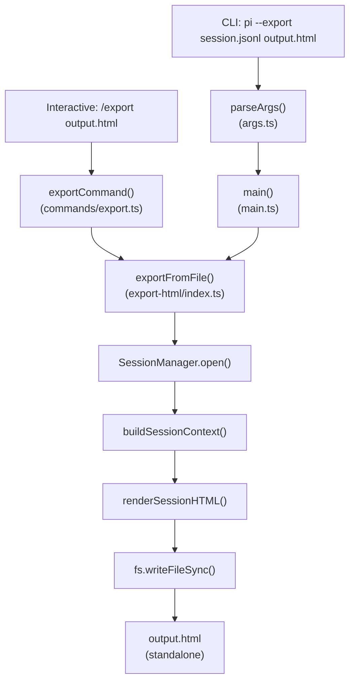
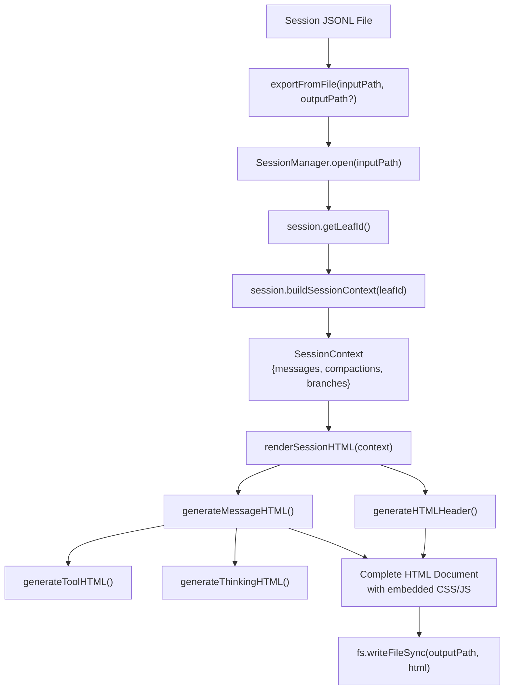
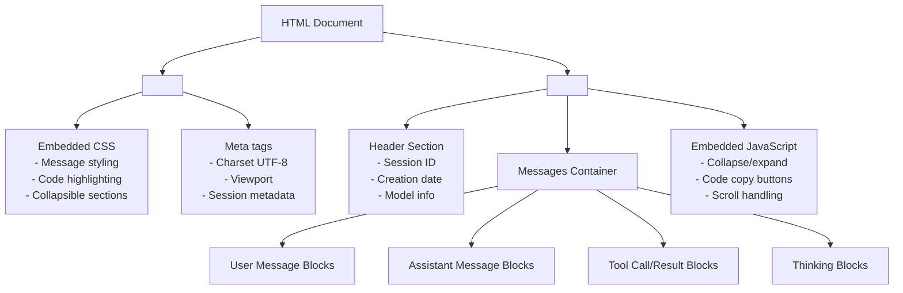
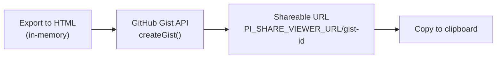

# HTML Export

<details>
<summary>Relevant source files</summary>

The following files were used as context for generating this wiki page:

- [AGENTS.md](AGENTS.md)
- [README.md](README.md)
- [packages/agent/CHANGELOG.md](packages/agent/CHANGELOG.md)
- [packages/ai/CHANGELOG.md](packages/ai/CHANGELOG.md)
- [packages/coding-agent/CHANGELOG.md](packages/coding-agent/CHANGELOG.md)
- [packages/coding-agent/README.md](packages/coding-agent/README.md)
- [packages/coding-agent/src/cli/args.ts](packages/coding-agent/src/cli/args.ts)
- [packages/coding-agent/src/main.ts](packages/coding-agent/src/main.ts)
- [packages/mom/CHANGELOG.md](packages/mom/CHANGELOG.md)
- [packages/tui/CHANGELOG.md](packages/tui/CHANGELOG.md)
- [packages/web-ui/CHANGELOG.md](packages/web-ui/CHANGELOG.md)

</details>

HTML Export is a feature that converts session JSONL files into standalone HTML documents suitable for sharing or archival. The exported HTML files are self-contained with embedded styling and interactive elements, preserving the full conversation history including tool calls, thinking blocks, and user messages.

For information about session persistence and the JSONL format, see [Session Management & History Tree](#4.3). For sharing exported sessions via GitHub gist, see the `/share` command in [Commands](#4.10).

---

## Overview

The HTML export system provides two access methods:

1. **CLI flag**: `pi --export <session.jsonl> [output.html]` exports a session file and exits
2. **Interactive command**: `/export [filename]` exports the current session or writes to a specified file

Exported HTML files are fully self-contained with no external dependencies, making them portable for viewing in any modern web browser.

**Sources:** [packages/coding-agent/README.md:165-166](), [packages/coding-agent/README.md:462](), [packages/coding-agent/src/cli/args.ts:124-125]()

---

## Export Workflow

### Export Execution Flow



**CLI Export Path**: When `--export` is provided, `main.ts` calls `exportFromFile()` directly and exits without starting an interactive session.

**Interactive Export Path**: The `/export` command handler opens the current session manager, builds the full context from the active leaf, and renders it to HTML.

**Sources:** [packages/coding-agent/src/main.ts:18](), [packages/coding-agent/src/cli/args.ts:124-125]()

---

## Export Function Architecture

### Core Export Pipeline



The `exportFromFile()` function orchestrates the entire export process:

1. Opens the session JSONL file via `SessionManager.open()`
2. Retrieves the current leaf ID (active conversation branch)
3. Builds the full session context by walking the tree from leaf to root
4. Passes the context to HTML rendering functions
5. Writes the resulting HTML to the output file

**Sources:** [packages/coding-agent/src/main.ts:18]()

---

## Session Context to HTML Mapping

### Message Type Rendering

The HTML export renders each message type from the session context with appropriate styling and structure:

| Session Message Type | HTML Rendering                                                 | Interactive Features     |
| -------------------- | -------------------------------------------------------------- | ------------------------ |
| User messages        | Light background, user icon, content with preserved formatting | None                     |
| Assistant text       | Assistant icon, markdown rendering, syntax highlighting        | None                     |
| Tool calls           | Collapsed by default, expandable sections                      | Click to expand/collapse |
| Tool results         | Nested under tool calls, formatted output                      | Scroll for long results  |
| Thinking blocks      | Collapsed by default, dimmed styling                           | Click to expand/collapse |
| Compaction entries   | Special marker with summary text                               | None                     |
| Branch summaries     | Branch point indicator                                         | None                     |

**Custom Tool Rendering**: Extensions that define custom tool renderers have their collapsed and expanded states preserved in the HTML export. If a tool provides different content for collapsed vs. expanded views, the HTML includes both with JavaScript toggle functionality.

**Sources:** [packages/coding-agent/CHANGELOG.md:97-98]()

---

## HTML Document Structure

### Generated HTML Components



The exported HTML is a self-contained document:

- **No external dependencies**: All CSS and JavaScript is embedded inline
- **Responsive layout**: Adapts to different screen sizes
- **Dark/light mode**: Respects browser/OS theme preferences
- **Syntax highlighting**: Code blocks use embedded highlighting styles
- **Markdown rendering**: Assistant messages are rendered as formatted markdown

**Sources:** [packages/coding-agent/README.md:165-166]()

---

## Export Invocation Patterns

### CLI Export

```bash
# Export specific session file to default output
pi --export ~/.pi/agent/sessions/--path--/session.jsonl

# Export with custom output filename
pi --export session.jsonl output.html

# Export using session ID prefix (resolved to file)
pi --export abc123
```

When invoked via CLI with `--export`, the main entry point:

1. Parses the input path (session file or ID prefix)
2. Resolves to an actual JSONL file via `resolveSessionPath()`
3. Calls `exportFromFile()` with input and optional output path
4. Exits after successful export

**Sources:** [packages/coding-agent/README.md:273-275](), [packages/coding-agent/src/cli/args.ts:124-125]()

### Interactive Command

```
/export                    # Export to default filename in current directory
/export my-session.html    # Export with custom filename
```

The `/export` command in interactive mode:

1. Uses the current `SessionManager` instance
2. Exports the active conversation branch (current `leafId`)
3. Allows specifying output filename as command argument
4. Continues session after successful export

**Sources:** [packages/coding-agent/README.md:165]()

---

## Integration with Share Command

### Share Workflow



The `/share` command builds on the export functionality:

1. Generates HTML export in-memory (same rendering as file export)
2. Uploads HTML content as a private GitHub gist
3. Constructs shareable viewer URL (default: `https://pi.dev/session/{gist-id}`)
4. Copies URL to clipboard for easy sharing

The viewer URL points to a web application that fetches and renders the gist content.

**Environment Variable**: `PI_SHARE_VIEWER_URL` can override the default viewer base URL.

**Sources:** [packages/coding-agent/README.md:166](), [packages/coding-agent/src/cli/args.ts:306]()

---

## Tool Rendering in Exports

### Custom Tool Export Behavior

Extensions can define custom tool renderers with distinct collapsed and expanded representations. The HTML export system preserves both states:

**Collapsed State**: The default view shown when the HTML loads, typically a summary or compact representation.

**Expanded State**: The full tool output, visible when the user clicks to expand.

If a custom tool renderer provides:

- **Only expanded content**: Rendered directly without collapse functionality
- **Both collapsed and expanded content**: Creates an expandable section with toggle button
- **Neither**: Falls back to default JSON tool call/result rendering

This ensures that custom extension tools maintain their intended UX in exported HTML files.

**Sources:** [packages/coding-agent/CHANGELOG.md:97-98]()

---

## Code Entities

### Key Functions and Modules

| Entity                  | Location                                   | Purpose                                     |
| ----------------------- | ------------------------------------------ | ------------------------------------------- |
| `exportFromFile()`      | `src/core/export-html/index.ts`            | Main export orchestration function          |
| `SessionManager.open()` | `src/core/session-manager.ts`              | Opens session JSONL file for reading        |
| `buildSessionContext()` | `src/core/session-manager.ts`              | Walks session tree to build message context |
| `renderSessionHTML()`   | `src/core/export-html/`                    | Converts session context to HTML string     |
| `/export` command       | `src/modes/interactive/commands/export.ts` | Interactive export command handler          |
| `--export` flag         | `src/cli/args.ts`                          | CLI argument parsing for export mode        |

**Sources:** [packages/coding-agent/src/main.ts:18](), [packages/coding-agent/src/cli/args.ts:124-125]()

---

## Output Format Characteristics

The generated HTML files have the following properties:

- **Standalone**: No external resources (CSS, JS, fonts) required
- **Portable**: Can be opened directly from filesystem or served via HTTP
- **Searchable**: Full text search works in browser find (Ctrl+F)
- **Archival**: Preserves exact conversation state at export time
- **Lightweight**: Typical exports are 50-500KB depending on conversation length
- **Browser Compatible**: Works in Chrome, Firefox, Safari, Edge (modern versions)

The HTML uses semantic markup for accessibility and includes ARIA attributes where appropriate for screen reader compatibility.

**Sources:** [packages/coding-agent/README.md:165-166]()
