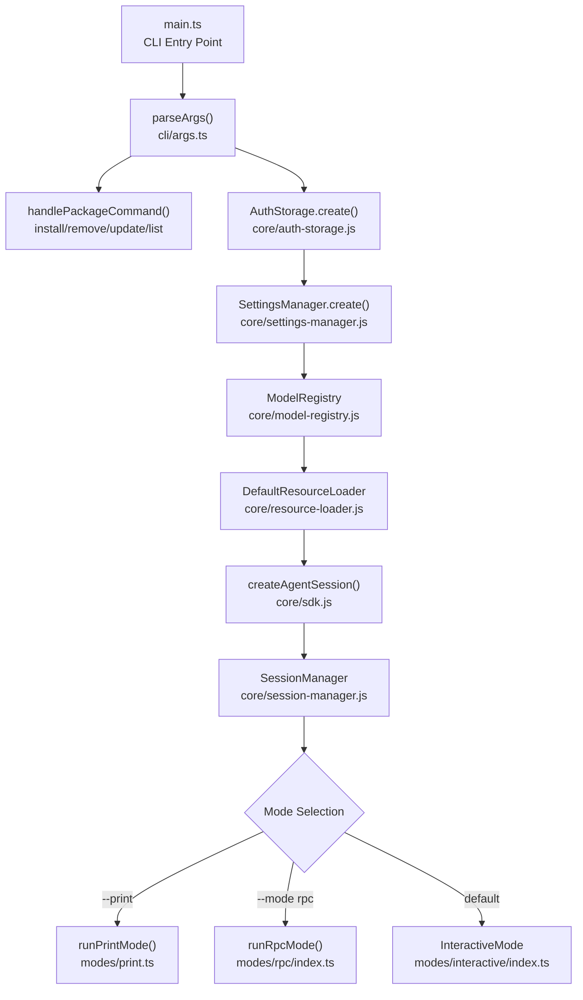
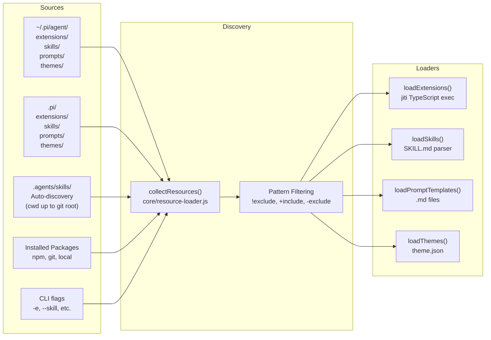
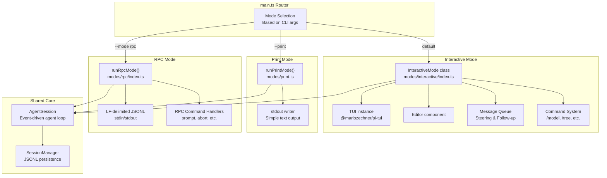
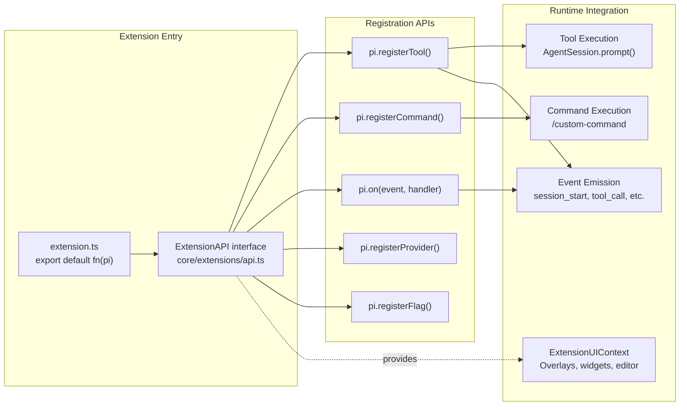
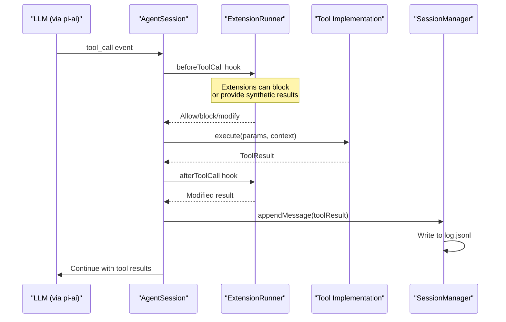
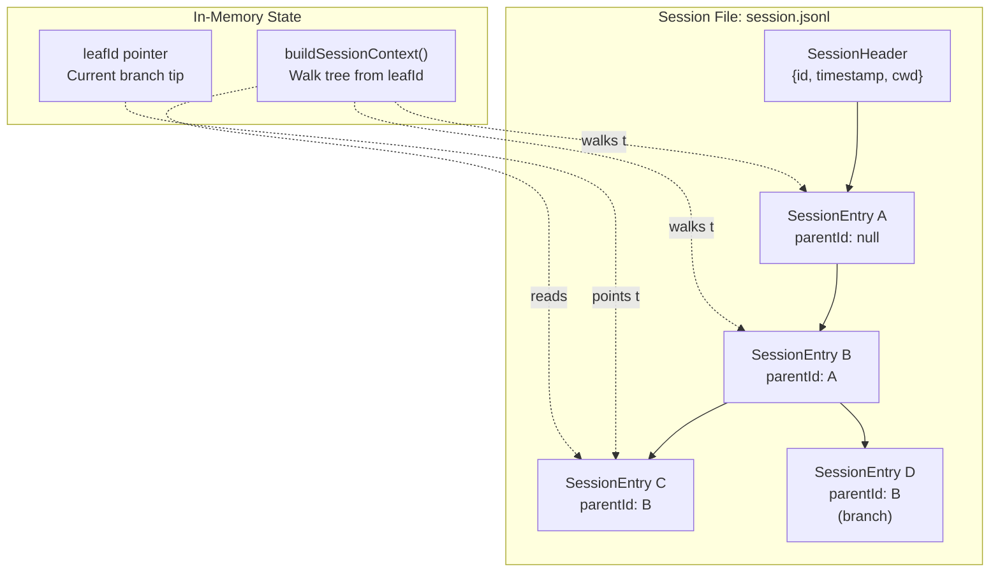
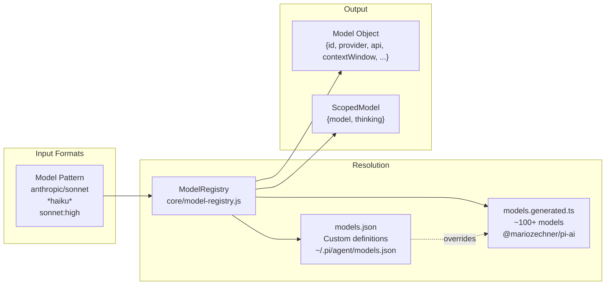
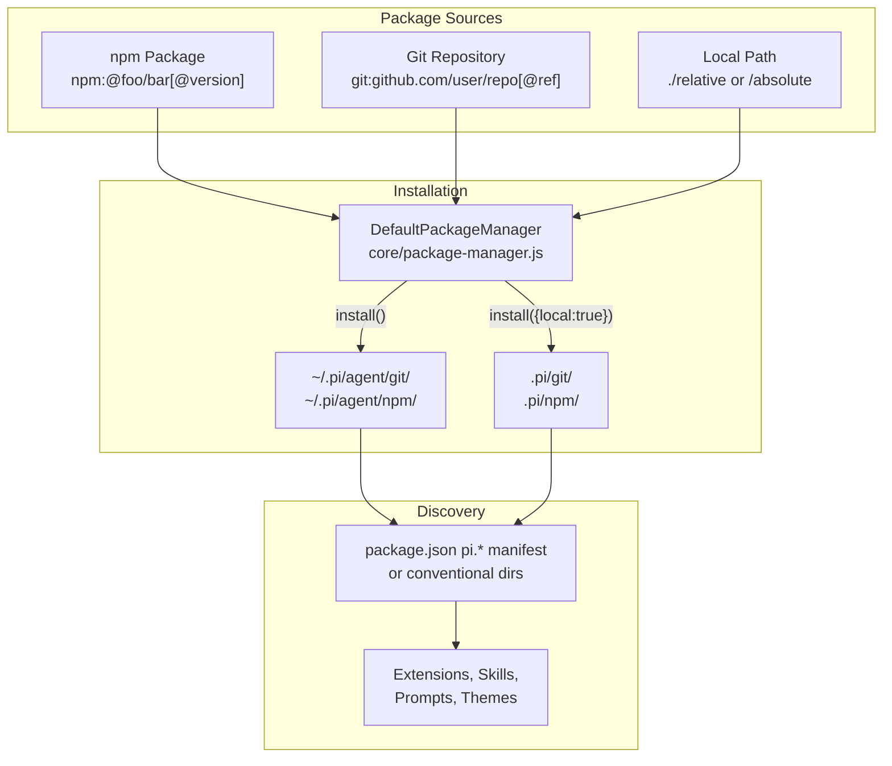

# pi-coding-agent: Coding Agent CLI

<details>
<summary>Relevant source files</summary>

The following files were used as context for generating this wiki page:

- [AGENTS.md](AGENTS.md)
- [README.md](README.md)
- [packages/agent/CHANGELOG.md](packages/agent/CHANGELOG.md)
- [packages/ai/CHANGELOG.md](packages/ai/CHANGELOG.md)
- [packages/coding-agent/CHANGELOG.md](packages/coding-agent/CHANGELOG.md)
- [packages/coding-agent/README.md](packages/coding-agent/README.md)
- [packages/coding-agent/src/cli/args.ts](packages/coding-agent/src/cli/args.ts)
- [packages/coding-agent/src/main.ts](packages/coding-agent/src/main.ts)
- [packages/mom/CHANGELOG.md](packages/mom/CHANGELOG.md)
- [packages/tui/CHANGELOG.md](packages/tui/CHANGELOG.md)
- [packages/web-ui/CHANGELOG.md](packages/web-ui/CHANGELOG.md)

</details>

The `@mariozechner/pi-coding-agent` package provides an interactive terminal-based coding assistant with tool execution, session persistence, and extensibility. This page documents the overall architecture, core abstractions, and how the system components interact. It serves as the architectural overview for the coding-agent package.

For detailed information about specific subsystems, see:

- Getting started and CLI usage: [4.1](#4.1)
- Agent lifecycle and event system: [4.2](#4.2)
- Session persistence and branching: [4.3](#4.3)
- Extension development: [4.4](#4.4)
- Tool execution: [4.5](#4.5)
- Configuration management: [4.6](#4.6)
- Model selection and thinking levels: [4.7](#4.7)
- Skills and prompt templates: [4.8](#4.8)
- Theme customization: [4.9](#4.9)
- Interactive TUI mode: [4.10](#4.10)
- Print and RPC modes: [4.11](#4.11)
- Package installation: [4.12](#4.12)

---

## Architecture Overview

The coding agent is built around `AgentSession`, which orchestrates the agent lifecycle, and supports three operational modes: interactive (full TUI), print (single-shot CLI), and RPC (JSON protocol over stdio). All modes share the same core agent logic from `@mariozechner/pi-agent-core` and LLM abstraction from `@mariozechner/pi-ai`.

### Main Entry Flow



**Sources:** [packages/coding-agent/src/main.ts:1-750]()

---

## Core Abstractions

### AgentSession and Supporting Systems

The `AgentSession` class (from `@mariozechner/pi-agent-core`) is the central orchestrator. The coding-agent package wraps it with supporting infrastructure:

```mermaid
graph TB
    subgraph "Entry Point"
        CreateSession["createAgentSession()<br/>Factory function<br/>core/sdk.js"]
    end

    subgraph "Core Session State"
        AgentSession["AgentSession<br/>Agent lifecycle manager<br/>@mariozechner/pi-agent-core"]
        SessionManager["SessionManager<br/>JSONL persistence<br/>core/session-manager.js"]
        SettingsManager["SettingsManager<br/>Global & project config<br/>core/settings-manager.js"]
    end

    subgraph "Model & Auth"
        ModelRegistry["ModelRegistry<br/>Model resolution<br/>core/model-registry.js"]
        AuthStorage["AuthStorage<br/>Credential management<br/>core/auth-storage.js"]
    end

    subgraph "Extensions & Resources"
        ResourceLoader["DefaultResourceLoader<br/>Resource discovery<br/>core/resource-loader.js"]
        PackageManager["DefaultPackageManager<br/>npm/git packages<br/>core/package-manager.js"]
        ExtensionRunner["ExtensionRunner<br/>Extension execution<br/>core/extensions/runner.ts"]
        ToolRegistry["ToolRegistry<br/>Tool collection<br/>core/tools/registry.ts"]
    end

    subgraph "LLM Integration"
        AILayer["@mariozechner/pi-ai<br/>LLM providers"]
    end

    CreateSession --> AgentSession
    CreateSession --> SessionManager
    CreateSession --> SettingsManager
    CreateSession --> ModelRegistry

    AgentSession --> ExtensionRunner
    AgentSession --> ToolRegistry
    AgentSession --> AILayer

    ModelRegistry --> AuthStorage
    ModelRegistry --> AILayer

    ResourceLoader --> PackageManager
    ResourceLoader --> ExtensionRunner
    ResourceLoader --> ToolRegistry

    SessionManager -.persists to.-> "~/.pi/agent/sessions/<br/>JSONL files"
    SettingsManager -.reads/writes.-> "settings.json<br/>(global & project)"
    AuthStorage -.reads/writes.-> "auth.json"
```

**Sources:** [packages/coding-agent/src/core/sdk.js:1-300](), [packages/coding-agent/src/main.ts:500-600]()

---

### Resource Discovery Pipeline

The `DefaultResourceLoader` discovers extensions, skills, prompt templates, and themes from multiple sources:



**Project-first precedence:** When resources have conflicting names, project-local (`.pi/`) resources override global (`~/.pi/agent/`) resources.

**Sources:** [packages/coding-agent/src/core/resource-loader.js:1-500](), [packages/coding-agent/src/core/package-manager.js:1-800]()

---

## Operational Modes

The coding-agent supports three modes, all using the same `AgentSession` core but with different user interfaces:

### Mode Architecture



| Mode            | Interface                                | Session Persistence         | Use Case                          |
| --------------- | ---------------------------------------- | --------------------------- | --------------------------------- |
| **Interactive** | Full TUI with editor, commands, overlays | Yes (auto-save)             | Primary terminal workflow         |
| **Print**       | Single-shot stdout                       | Yes (unless `--no-session`) | Shell scripts, pipelines          |
| **RPC**         | JSON events over stdio                   | Yes                         | Integration with non-Node.js apps |

**Sources:** [packages/coding-agent/src/modes/interactive/index.ts:1-1500](), [packages/coding-agent/src/modes/print.ts:1-200](), [packages/coding-agent/src/modes/rpc/index.ts:1-400]()

---

## Extension Integration Points

Extensions can hook into the system at multiple levels:



**Extension contexts:** Extensions receive different contexts based on the operational mode:

- **Interactive:** `ExtensionUIContext` with full TUI capabilities (overlays, custom editors, widgets)
- **RPC:** `ExtensionUIContext` with JSON request/response protocol
- **Print:** `ExtensionUIContext` with no-op methods (extensions cannot show UI)

**Sources:** [packages/coding-agent/src/core/extensions/api.ts:1-300](), [packages/coding-agent/src/core/extensions/runner.ts:1-500]()

---

## Tool Execution Flow

Tools are executed by the agent via the `AgentSession` event loop. Built-in tools are registered in `core/tools/index.ts`, and extensions can register custom tools via `pi.registerTool()`.



**Built-in tools:** Defined in [packages/coding-agent/src/core/tools/index.ts:1-50]()

- `read` - Read file contents
- `write` - Write/overwrite files
- `edit` - Find/replace edits
- `bash` - Execute shell commands
- `grep`, `find`, `ls` - Read-only search tools (off by default)

**Tool registry:** `ToolRegistry` class in [packages/coding-agent/src/core/tools/registry.ts:1-200]() maintains the collection of available tools and handles tool resolution.

**Sources:** [packages/coding-agent/src/core/tools/index.ts:1-100](), [packages/coding-agent/src/core/sdk.js:200-400]()

---

## Session Persistence

Sessions are stored as JSONL files with a tree structure. Each entry has an `id` and `parentId`, enabling in-place branching without creating new files.

### Session File Structure



**Operations:**

- `SessionManager.appendMessage()` - Adds new entries and advances `leafId`
- `SessionManager.branch(entryId)` - Repositions `leafId` to an earlier entry
- `SessionManager.buildSessionContext()` - Walks from `leafId` to root to extract active conversation path

**Compaction:** When context windows are exceeded, `SessionManager.appendCompaction()` records a summary entry. The full history remains in the file.

**Sources:** [packages/coding-agent/src/core/session-manager.js:1-1000]()

---

## Settings and Configuration

Settings are managed by `SettingsManager` with two scopes:

| Scope       | Path                        | Purpose               |
| ----------- | --------------------------- | --------------------- |
| **Global**  | `~/.pi/agent/settings.json` | User-wide defaults    |
| **Project** | `.pi/settings.json`         | Per-project overrides |

**Merge semantics:** Project settings override global settings. `SettingsManager.getSettings()` returns the merged view.

**Persistence:** Settings are written asynchronously with file locking to prevent corruption from concurrent processes. Use `SettingsManager.flush()` to wait for pending writes.

**Common settings:**

- `defaultModel` - Model reference (e.g., `"anthropic/claude-sonnet-4"`)
- `thinkingLevel` - Default thinking level (`"off"` | `"minimal"` | `"low"` | `"medium"` | `"high"` | `"xhigh"`)
- `packages` - Array of package sources for resource discovery
- `autoCompactionEnabled` - Enable/disable automatic compaction
- `steeringMode`, `followUpMode` - Message queue delivery modes

**Sources:** [packages/coding-agent/src/core/settings-manager.js:1-800]()

---

## Model Resolution

The `ModelRegistry` class resolves model references to concrete model definitions:



**Model resolution logic:** Implemented in [packages/coding-agent/src/core/model-resolver.ts:1-400]()

- Pattern matching: `resolveModelPattern()` supports fuzzy matching, glob patterns, and provider prefixes
- Thinking suffixes: `sonnet:high` resolves to model with thinking level `"high"`
- Scoped models: Used for Ctrl+P cycling with fixed thinking levels per model

**Sources:** [packages/coding-agent/src/core/model-registry.js:1-300](), [packages/coding-agent/src/core/model-resolver.ts:1-400]()

---

## Package Management

The `DefaultPackageManager` handles installation and discovery of npm packages, git repositories, and local paths:



**Commands:**

- `pi install npm:@foo/bar` - Install globally
- `pi install npm:@foo/bar -l` - Install project-locally
- `pi remove npm:@foo/bar` - Remove and update settings
- `pi update` - Update all unpinned packages
- `pi list` - List installed packages

**Manifest format:** Packages declare resources in `package.json`:

```json
{
  "pi": {
    "extensions": ["./extensions"],
    "skills": ["./skills"],
    "prompts": ["./prompts"],
    "themes": ["./themes"]
  }
}
```

**Sources:** [packages/coding-agent/src/core/package-manager.js:1-800](), [packages/coding-agent/src/main.ts:150-310]()

---

## CLI Entry Points

The main entry point handles three distinct flows:

| Flow                 | Trigger                          | Handler                                         |
| -------------------- | -------------------------------- | ----------------------------------------------- |
| **Package commands** | `pi install/remove/update/list`  | `handlePackageCommand()` in [main.ts:196-309]() |
| **Config command**   | `pi config`                      | `selectConfig()` in [cli/config-selector.ts]()  |
| **Agent modes**      | Default, `--print`, `--mode rpc` | Mode router in [main.ts:440-750]()              |

**Argument parsing:** `parseArgs()` in [packages/coding-agent/src/cli/args.ts:55-177]() handles CLI flags. Extensions can register custom flags via `ExtensionAPI.registerFlag()`, which are parsed during a second pass after extensions load.

**Sources:** [packages/coding-agent/src/main.ts:1-750](), [packages/coding-agent/src/cli/args.ts:1-318]()
