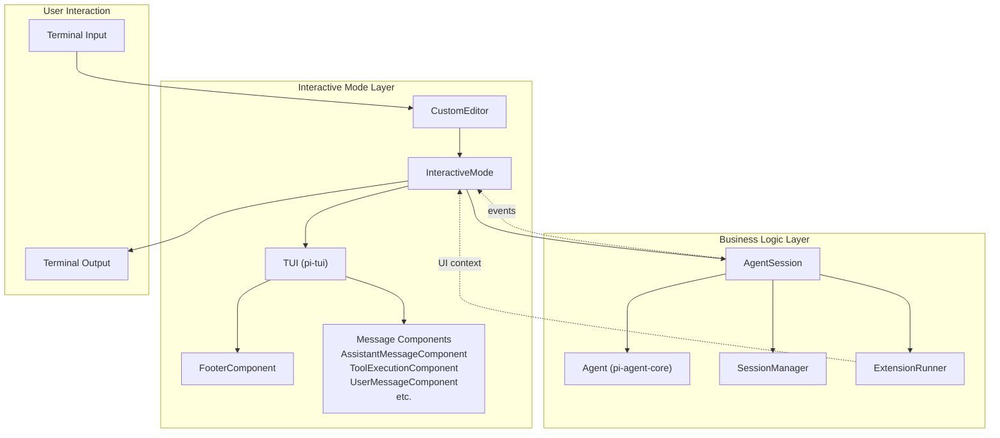
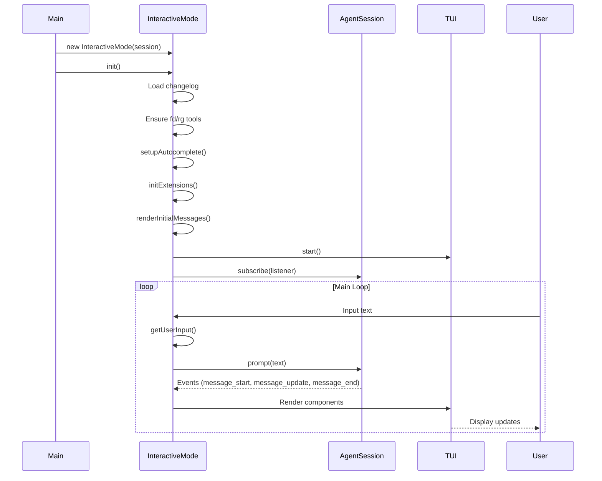
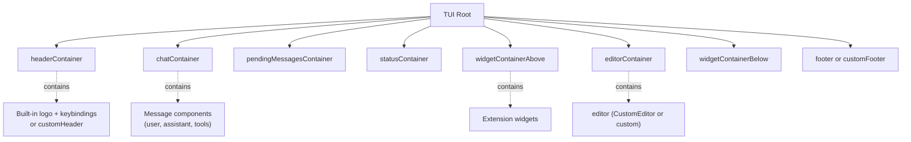
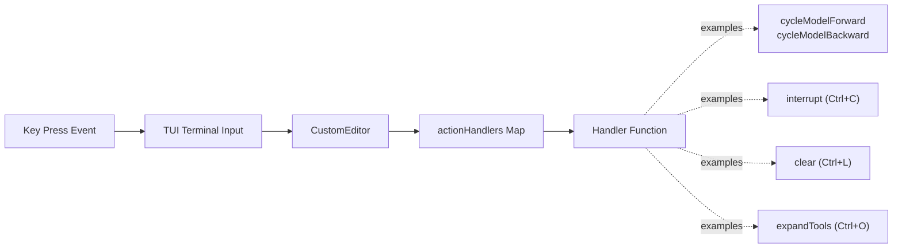
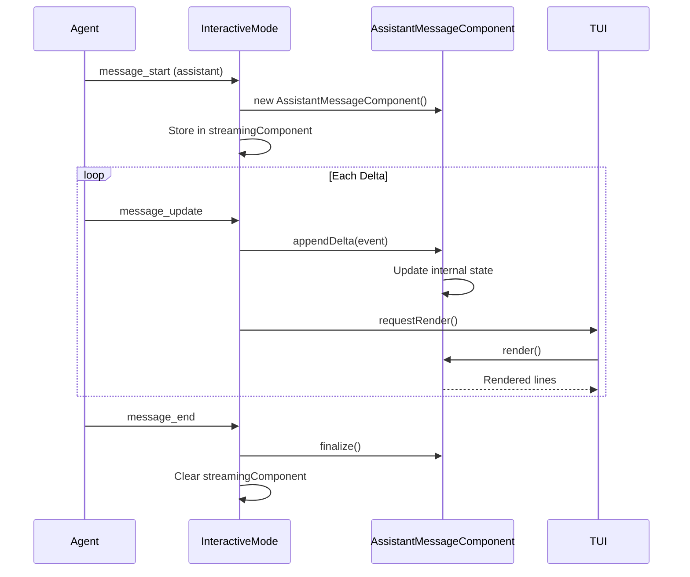
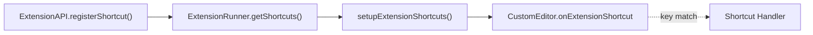
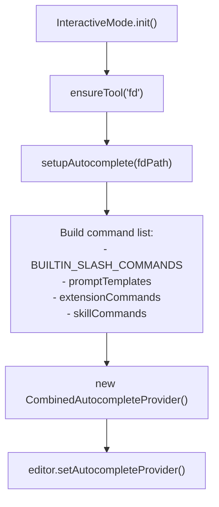
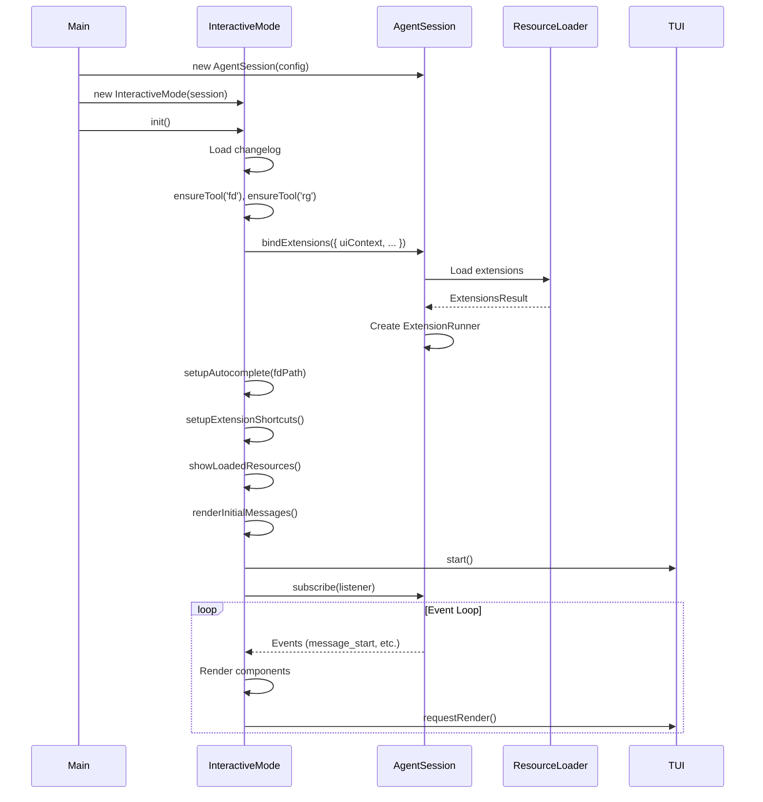

# Interactive Mode & TUI Integration

<details>
<summary>Relevant source files</summary>

The following files were used as context for generating this wiki page:

- [packages/coding-agent/docs/terminal-setup.md](packages/coding-agent/docs/terminal-setup.md)
- [packages/coding-agent/docs/tmux.md](packages/coding-agent/docs/tmux.md)
- [packages/coding-agent/src/core/agent-session.ts](packages/coding-agent/src/core/agent-session.ts)
- [packages/coding-agent/src/core/sdk.ts](packages/coding-agent/src/core/sdk.ts)
- [packages/coding-agent/src/modes/interactive/components/custom-editor.ts](packages/coding-agent/src/modes/interactive/components/custom-editor.ts)
- [packages/coding-agent/src/modes/interactive/interactive-mode.ts](packages/coding-agent/src/modes/interactive/interactive-mode.ts)
- [packages/coding-agent/src/modes/print-mode.ts](packages/coding-agent/src/modes/print-mode.ts)
- [packages/coding-agent/src/modes/rpc/rpc-mode.ts](packages/coding-agent/src/modes/rpc/rpc-mode.ts)
- [packages/tui/src/components/editor.ts](packages/tui/src/components/editor.ts)
- [packages/tui/src/components/input.ts](packages/tui/src/components/input.ts)
- [packages/tui/src/index.ts](packages/tui/src/index.ts)
- [packages/tui/src/keys.ts](packages/tui/src/keys.ts)
- [packages/tui/src/kill-ring.ts](packages/tui/src/kill-ring.ts)
- [packages/tui/src/undo-stack.ts](packages/tui/src/undo-stack.ts)
- [packages/tui/test/editor.test.ts](packages/tui/test/editor.test.ts)
- [packages/tui/test/input.test.ts](packages/tui/test/input.test.ts)
- [packages/tui/test/keys.test.ts](packages/tui/test/keys.test.ts)

</details>

## Purpose and Scope

This page documents the interactive terminal mode (`InteractiveMode` class) and its integration with the pi-tui library. Interactive mode provides a full-featured TUI for the coding agent with real-time message streaming, keyboard shortcuts, autocomplete, and extension UI capabilities.

For the underlying pi-tui component architecture and rendering system, see [TUI Library](#5). For the business logic and event handling that InteractiveMode delegates to, see [AgentSession](#4.2).

---

## Architecture Overview

Interactive mode is a UI layer that orchestrates TUI rendering while delegating agent operations to `AgentSession`. It translates user input into agent actions and renders agent events as UI components.



**Sources:** [packages/coding-agent/src/modes/interactive/interactive-mode.ts:1-2367]()

---

## InteractiveMode Class Structure

The `InteractiveMode` class maintains UI state and subscribes to `AgentSession` events to update the display. It does not handle business logic directly.

### Key Properties

| Property                   | Type              | Purpose                                 |
| -------------------------- | ----------------- | --------------------------------------- |
| `session`                  | `AgentSession`    | Business logic delegate                 |
| `ui`                       | `TUI`             | Main TUI instance from pi-tui           |
| `chatContainer`            | `Container`       | Holds message history                   |
| `pendingMessagesContainer` | `Container`       | Shows queued messages during streaming  |
| `statusContainer`          | `Container`       | Temporary status messages               |
| `editor`                   | `EditorComponent` | Active input editor (default or custom) |
| `defaultEditor`            | `CustomEditor`    | Built-in editor with autocomplete       |
| `footer`                   | `FooterComponent` | Status bar at bottom                    |
| `extensionRunner`          | `ExtensionRunner` | For extension UI integration            |

**Sources:** [packages/coding-agent/src/modes/interactive/interactive-mode.ts:142-261]()

### Lifecycle



**Sources:** [packages/coding-agent/src/modes/interactive/interactive-mode.ts:361-562]()

---

## TUI Container Hierarchy

InteractiveMode builds a nested container structure that the TUI renders top-to-bottom:



**Layout behavior:**

- Containers stack vertically with height calculated by their children
- Editor container uses remaining viewport space
- Footer is pinned to bottom via TUI focus system
- Overlays render on top with z-ordering

**Sources:** [packages/coding-agent/src/modes/interactive/interactive-mode.ts:372-450]()

---

## User Input Handling

### Editor Submission

The editor's `onSubmit` callback is the primary input handler:

1. User presses Enter (or Ctrl+G for multi-line)
2. Editor calls `onSubmit(text)`
3. InteractiveMode checks for special modes (bash, skill commands)
4. Delegates to `session.prompt(text)`

**Sources:** [packages/coding-agent/src/modes/interactive/interactive-mode.ts:2023-2148]()

### Keyboard Shortcuts

The `KeybindingsManager` provides app-level actions. The `CustomEditor` has action handlers registered in its constructor:



Key actions:

- `interrupt`: Abort agent, restore queued messages to editor
- `clear`: Clear screen (Ctrl+L twice to exit)
- `cycleModelForward/Backward`: Cycle through available models
- `selectModel`: Show model selector overlay
- `cycleThinkingLevel`: Rotate thinking levels
- `expandTools`: Expand/collapse all tool outputs
- `toggleThinking`: Show/hide thinking blocks
- `externalEditor`: Open $EDITOR for multi-line input
- `followUp`: Queue message for after agent finishes
- `dequeue`: Edit all queued messages
- `pasteImage`: Paste clipboard image as attachment

**Sources:** [packages/coding-agent/src/modes/interactive/interactive-mode.ts:1784-2022](), [packages/coding-agent/src/modes/interactive/components/custom-editor.ts]()

### Bash Mode

When the editor text starts with `!`, interactive mode enters bash mode:

1. Editor border turns yellow (theme-dependent)
2. On submit, creates `BashExecutionComponent`
3. `BashExecutionComponent` shows live output via `ProcessTerminal`
4. User can abort with Ctrl+C

**Bash mode variants:**

- `!command` - Runs with full context (skills, attachments)
- `!!command` - Runs without context (bare execution)

**Sources:** [packages/coding-agent/src/modes/interactive/interactive-mode.ts:2072-2148](), [packages/coding-agent/src/modes/interactive/components/bash-execution.ts]()

---

## Message Rendering

InteractiveMode subscribes to `AgentSession` events and renders different message types with specialized components.

### Event-to-Component Mapping

| Event Type                  | Component                           | Purpose                                   |
| --------------------------- | ----------------------------------- | ----------------------------------------- |
| `message_start` (user)      | `UserMessageComponent`              | Shows user prompt with images/attachments |
| `message_start` (assistant) | `AssistantMessageComponent`         | Streams assistant response                |
| `message_update`            | Updates streaming component         | Delta rendering of text/thinking          |
| `message_end` (assistant)   | Finalizes component                 | Adds usage stats, stop reason             |
| `tool_execution_start`      | `ToolExecutionComponent`            | Shows tool call with args                 |
| `tool_execution_update`     | Updates tool component              | Live output from bash/grep                |
| `tool_execution_end`        | Finalizes tool component            | Shows result, exit code                   |
| Custom message              | `CustomMessageComponent`            | Extension-defined rendering               |
| Bash execution              | `BashExecutionComponent`            | Interactive bash with terminal            |
| Compaction                  | `CompactionSummaryMessageComponent` | Shows compaction summary                  |
| Branch summary              | `BranchSummaryMessageComponent`     | Shows navigation summary                  |

**Sources:** [packages/coding-agent/src/modes/interactive/interactive-mode.ts:2157-2367]()

### Streaming Updates

Streaming messages use the delta rendering pattern:



**Sources:** [packages/coding-agent/src/modes/interactive/interactive-mode.ts:2261-2345]()

### Tool Execution Rendering

Tools have two rendering modes:

1. **Built-in rendering** - Default for read/bash/edit/write tools
2. **Custom rendering** - Extensions can register `render` function for their tools

Example custom tool rendering:

```typescript
// Extension registers tool with custom render
api.registerTool({
  definition: {
    /* ... */
  },
  execute: async (args) => {
    /* ... */
  },
  render: (tui, args, result, theme) => {
    // Return custom TUI component
    return new CustomToolVisualization(args, result)
  },
})
```

**Sources:** [packages/coding-agent/src/modes/interactive/interactive-mode.ts:2346-2367](), [packages/coding-agent/src/modes/interactive/components/tool-execution.ts]()

---

## Extension UI Integration

Extensions receive an `ExtensionUIContext` that exposes TUI capabilities. This context is created in `createExtensionUIContext()` and provides:

### UI Methods

| Method                            | Purpose                                             |
| --------------------------------- | --------------------------------------------------- |
| `select(title, options, opts)`    | Show option selector, returns selected item         |
| `confirm(title, message, opts)`   | Yes/No dialog                                       |
| `input(title, placeholder, opts)` | Text input dialog                                   |
| `editor(title, prefill)`          | Multi-line editor (Ctrl+G to submit)                |
| `notify(message, type)`           | Show status/warning/error                           |
| `custom(factory, options)`        | Render custom component (overlay or replace editor) |
| `pasteToEditor(text)`             | Insert text at cursor                               |
| `setEditorText(text)`             | Replace editor content                              |
| `getEditorText()`                 | Read current editor content                         |
| `setEditorComponent(factory)`     | Replace default editor with custom one              |

**Sources:** [packages/coding-agent/src/modes/interactive/interactive-mode.ts:1380-1435]()

### Widget System

Extensions can render widgets above or below the editor:

```typescript
// Text widget (string array)
ui.setWidget('myKey', ['Line 1', 'Line 2'], { placement: 'aboveEditor' })

// Component widget (factory function)
ui.setWidget(
  'myKey',
  (tui, theme) => {
    const container = new Container()
    container.addChild(new Text('Custom component', 1, 0))
    return container
  },
  { placement: 'belowEditor' }
)

// Clear widget
ui.setWidget('myKey', undefined)
```

**Maximum widget lines:** 10 total to prevent viewport overflow.

**Sources:** [packages/coding-agent/src/modes/interactive/interactive-mode.ts:1171-1286]()

### Custom Header and Footer

Extensions can replace the built-in header/footer:

```typescript
// Custom footer (receives FooterDataProvider for status data)
ui.setFooter((tui, theme, footerData) => {
  return new CustomFooter(tui, theme, footerData)
})

// Custom header
ui.setHeader((tui, theme) => {
  return new CustomHeader(tui, theme)
})

// Restore defaults
ui.setFooter(undefined)
ui.setHeader(undefined)
```

**Sources:** [packages/coding-agent/src/modes/interactive/interactive-mode.ts:1289-1357]()

### Terminal Input Listeners

Extensions can intercept raw terminal input before the editor sees it:

```typescript
const unsubscribe = ui.onTerminalInput((data) => {
  // data is the raw key sequence
  if (data === '\x1b[A') {
    // Up arrow
    // Custom handling
    return { consume: true } // Don't pass to editor
  }
  return { consume: false, data } // Pass through
})
```

**Sources:** [packages/coding-agent/src/modes/interactive/interactive-mode.ts:1359-1375]()

### Extension Shortcuts

Extensions can register keyboard shortcuts via `ExtensionAPI.registerShortcut()`. These are set up in `setupExtensionShortcuts()` and checked in the editor's `onExtensionShortcut` handler:



**Sources:** [packages/coding-agent/src/modes/interactive/interactive-mode.ts:1109-1158]()

---

## Theme System Integration

Interactive mode integrates with the theme hot-reload system from `theme.ts`:

1. `setRegisteredThemes()` - Loads themes from resource loader
2. `initTheme()` - Applies initial theme from settings
3. `onThemeChange()` - Watches theme file for changes
4. On change: `ui.invalidate()` + `ui.requestRender()` to redraw all components

**Theme application:**

- Editor uses `getEditorTheme()` for syntax highlighting
- Markdown uses `getMarkdownTheme()` for rendering
- Components use `theme.fg()`, `theme.bold()`, etc. for styling

**Sources:** [packages/coding-agent/src/modes/interactive/interactive-mode.ts:280-282](), [packages/coding-agent/src/modes/interactive/interactive-mode.ts:473-477]()

---

## Footer and Status Display

### FooterComponent

The footer shows dynamic information via the `FooterDataProvider`:

| Section            | Content                                   |
| ------------------ | ----------------------------------------- |
| Session            | Session name, auto-compact indicator      |
| Git                | Current branch (updated via file watcher) |
| Model              | Current model and thinking level          |
| Usage              | Tokens (input/output/cache) and cost      |
| Extension Statuses | Custom key-value pairs from extensions    |

**FooterDataProvider** is passed to extensions via `ExtensionUIContext.setFooter()` so custom footers can access the same data.

**Sources:** [packages/coding-agent/src/modes/interactive/interactive-mode.ts:272-274](), [packages/coding-agent/src/core/footer-data-provider.ts]()

### Status Messages

Temporary status messages are shown in `statusContainer`:

```typescript
// Status text (auto-clears)
showStatus(text: string)

// Warning text (yellow, persists)
showWarning(text: string)

// Error text (red, persists)
showError(text: string)
```

**Mutation optimization:** Sequential status messages reuse the same `Text` component to avoid scroll jitter.

**Sources:** [packages/coding-agent/src/modes/interactive/interactive-mode.ts:2490-2552]()

---

## Autocomplete System

Interactive mode uses `CombinedAutocompleteProvider` to provide context-aware autocomplete:

### Autocomplete Sources

1. **Slash commands** - Built-in commands (`/model`, `/session`, etc.)
2. **Prompt templates** - File-based templates from resource loader
3. **Extension commands** - Commands registered via `registerCommand()`
4. **Skill commands** - `/skill:name` for each loaded skill
5. **File paths** - Via `fd` tool for file discovery
6. **Model IDs** - For `/model` command arguments

**Argument completion:** Commands like `/model` provide dynamic argument completion via `getArgumentCompletions()` callback.

**Sources:** [packages/coding-agent/src/modes/interactive/interactive-mode.ts:284-359]()

### Setup Process



**Sources:** [packages/coding-agent/src/modes/interactive/interactive-mode.ts:284-359]()

---

## Resource Display

On startup, `showLoadedResources()` displays loaded skills, prompts, themes, and extensions with source metadata:

**Display structure:**

- Groups by scope: `project`, `user`, `path` (temp)
- Within each scope: local files first, then packages (npm/git)
- Shows diagnostics (collisions, parse errors) even in quiet mode

Example output:

```
[Skills]
  project
    npm:@badlogic/agent-skills
      code-review.md
      refactor.md
    ./skills/custom.md
  user
    ~/.pi/agent/skills/global.md
```

**Sources:** [packages/coding-agent/src/modes/interactive/interactive-mode.ts:862-994]()

---

## Initialization Sequence

The full initialization flow showing how all systems connect:



**Sources:** [packages/coding-agent/src/modes/interactive/interactive-mode.ts:361-486](), [packages/coding-agent/src/modes/interactive/interactive-mode.ts:999-1095]()
