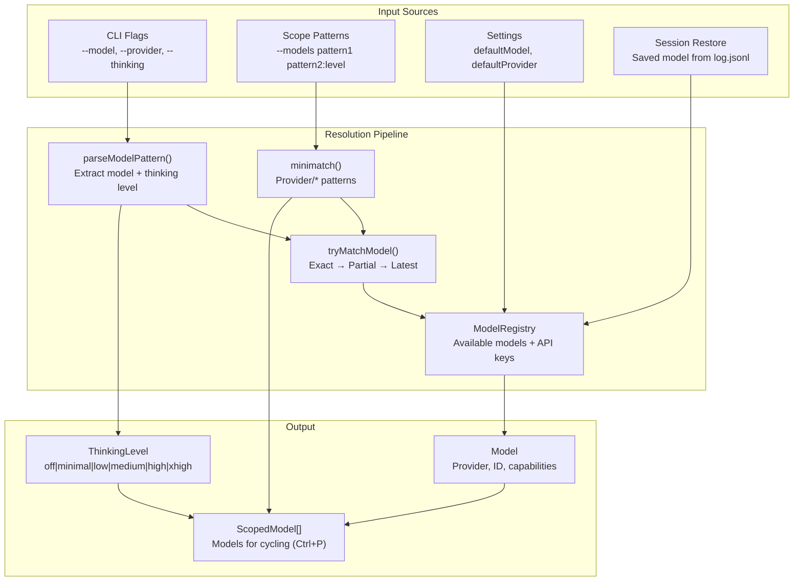
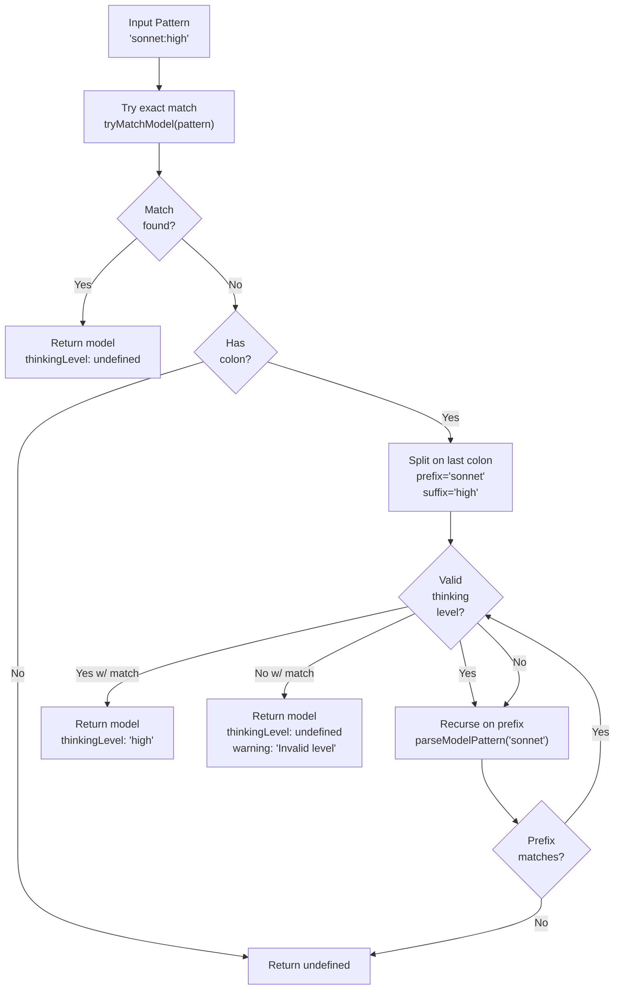
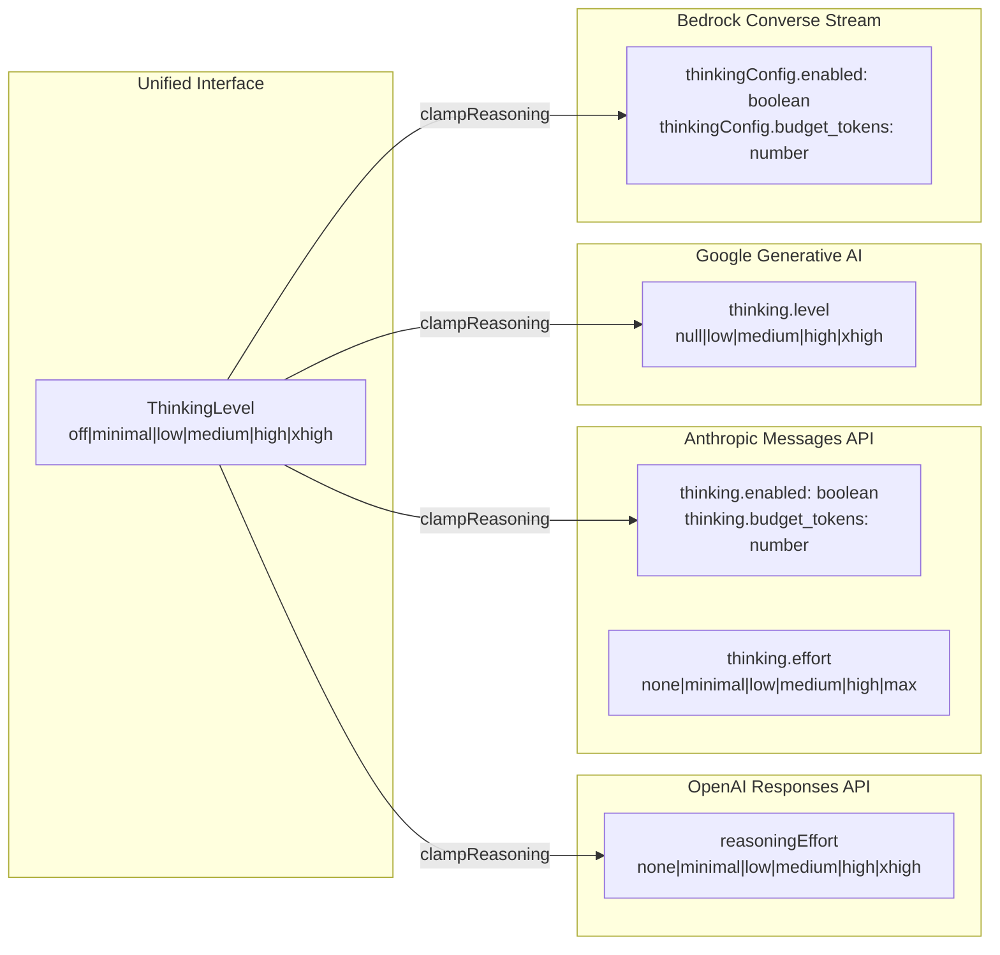
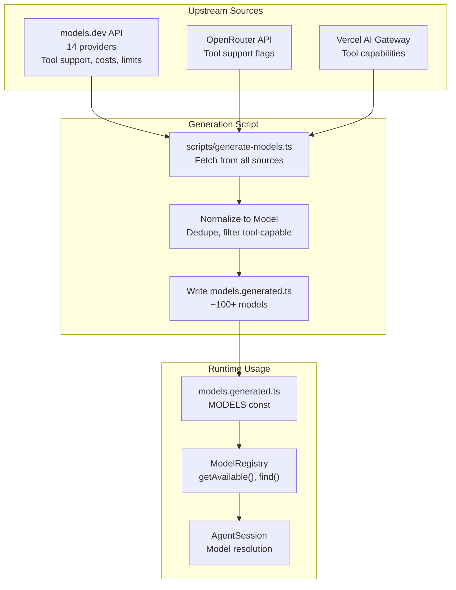
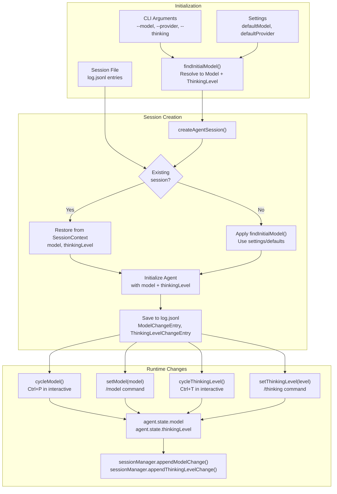
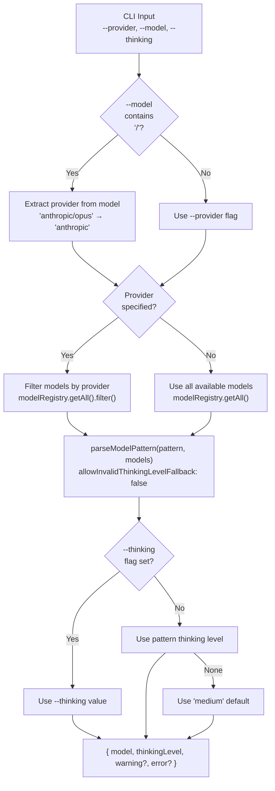

# Model Resolution & Thinking Levels

<details>
<summary>Relevant source files</summary>

The following files were used as context for generating this wiki page:

- [packages/ai/scripts/generate-models.ts](packages/ai/scripts/generate-models.ts)
- [packages/ai/src/index.ts](packages/ai/src/index.ts)
- [packages/ai/src/models.generated.ts](packages/ai/src/models.generated.ts)
- [packages/ai/src/models.ts](packages/ai/src/models.ts)
- [packages/ai/src/providers/openai-codex-responses.ts](packages/ai/src/providers/openai-codex-responses.ts)
- [packages/ai/test/openai-codex-stream.test.ts](packages/ai/test/openai-codex-stream.test.ts)
- [packages/ai/test/supports-xhigh.test.ts](packages/ai/test/supports-xhigh.test.ts)
- [packages/coding-agent/src/core/agent-session.ts](packages/coding-agent/src/core/agent-session.ts)
- [packages/coding-agent/src/core/model-resolver.ts](packages/coding-agent/src/core/model-resolver.ts)
- [packages/coding-agent/src/core/sdk.ts](packages/coding-agent/src/core/sdk.ts)
- [packages/coding-agent/src/modes/interactive/interactive-mode.ts](packages/coding-agent/src/modes/interactive/interactive-mode.ts)
- [packages/coding-agent/src/modes/print-mode.ts](packages/coding-agent/src/modes/print-mode.ts)
- [packages/coding-agent/src/modes/rpc/rpc-mode.ts](packages/coding-agent/src/modes/rpc/rpc-mode.ts)
- [packages/coding-agent/test/model-resolver.test.ts](packages/coding-agent/test/model-resolver.test.ts)

</details>

This page documents the model resolution system and thinking level configuration in the coding agent. Model resolution determines which LLM model to use based on user input (CLI flags, patterns, settings), while thinking levels control the depth of reasoning models use when generating responses.

For information about the model catalog and provider implementations, see [pi-ai: LLM API Library](#2). For settings management including default model/thinking configuration, see [Settings Management](#4.6).

## Overview

The model resolution system supports multiple input formats and resolution strategies:



**Sources:** [packages/coding-agent/src/core/model-resolver.ts:1-400](), [packages/coding-agent/src/core/sdk.ts:165-373]()

## Pattern Matching Algorithm

Model patterns support multiple formats with optional thinking level suffixes:

| Pattern Format       | Example                     | Resolution                           |
| -------------------- | --------------------------- | ------------------------------------ |
| Exact model ID       | `claude-opus-4-6`           | Direct match by ID                   |
| Provider/ID          | `anthropic/claude-opus-4-6` | Provider + ID match                  |
| Fuzzy partial        | `sonnet`                    | Match ID or name containing "sonnet" |
| With thinking level  | `opus:high`                 | Model + thinking level               |
| Glob pattern         | `anthropic/*opus*`          | All matching models                  |
| OpenRouter-style     | `qwen/qwen3-coder:exacto`   | Handles colons in IDs                |
| Multi-level thinking | `model:exacto:high`         | Strips levels right-to-left          |

### Pattern Parsing Process



**Sources:** [packages/coding-agent/src/core/model-resolver.ts:168-233]()

The `parseModelPattern()` function handles patterns with colons in model IDs (e.g., OpenRouter's `:exacto` suffix) by recursively stripping colon-suffixes from right to left until it finds a match. If the stripped suffix is a valid thinking level, it's used; otherwise, a warning is generated.

```typescript
// Examples from model-resolver.ts
parseModelPattern('claude-sonnet-4-5', models)
// → { model: Model, thinkingLevel: undefined }

parseModelPattern('sonnet:high', models)
// → { model: Model, thinkingLevel: "high" }

parseModelPattern('qwen/qwen3-coder:exacto:high', models)
// → { model: Model (id="qwen/qwen3-coder:exacto"), thinkingLevel: "high" }

parseModelPattern('sonnet:invalid', models)
// → { model: Model, thinkingLevel: undefined, warning: "Invalid thinking level..." }
```

**Sources:** [packages/coding-agent/src/core/model-resolver.ts:180-233](), [packages/coding-agent/test/model-resolver.test.ts:68-207]()

## Thinking Levels

Thinking levels control how much reasoning effort the LLM expends before responding. The system supports six levels:

| Level     | Description                        | Provider Mapping        |
| --------- | ---------------------------------- | ----------------------- |
| `off`     | No reasoning, direct response      | Various disables        |
| `minimal` | Very light reasoning               | Low effort/budget       |
| `low`     | Light reasoning                    | Low effort/budget       |
| `medium`  | Balanced reasoning (default)       | Medium effort/budget    |
| `high`    | Deep reasoning                     | High effort/budget      |
| `xhigh`   | Maximum reasoning (limited models) | Max effort/xhigh budget |

### Provider-Specific Mappings

Different LLM providers implement thinking levels differently:



**Sources:** [packages/ai/src/providers/simple-options.ts:1-200](), [packages/ai/src/providers/openai-codex-responses.ts:233-280]()

#### OpenAI Responses API

```typescript
// From openai-responses-shared.ts
const reasoningEffortMap: Record<ThinkingLevel, string | undefined> = {
  off: 'none',
  minimal: 'minimal',
  low: 'low',
  medium: 'medium',
  high: 'high',
  xhigh: 'xhigh', // GPT-5.2, GPT-5.3, GPT-5.4 only
}
```

**Sources:** [packages/ai/src/providers/openai-responses-shared.ts:1-300]()

#### Anthropic Messages API

Anthropic uses two mechanisms:

- Extended thinking (Claude 4.x): `thinking.enabled` + `thinking.budget_tokens`
- Adaptive effort (Claude Opus 4.6): `thinking.effort` for `xhigh` level

```typescript
// From simple-options.ts
if (thinkingLevel === 'xhigh' && supportsXhigh(model)) {
  // Opus 4.6: use adaptive effort "max"
  thinking = { effort: 'max' }
} else {
  // Claude 4.x: use budget tokens
  const budgetMap = {
    off: 0,
    minimal: 1000,
    low: 5000,
    medium: 10000,
    high: 20000,
  }
  thinking = {
    enabled: thinkingLevel !== 'off',
    budget_tokens: budgetMap[thinkingLevel],
  }
}
```

**Sources:** [packages/ai/src/providers/simple-options.ts:50-150]()

#### Google Generative AI

```typescript
// From simple-options.ts
const thinkingLevelMap: Record<ThinkingLevel, string | null> = {
  off: null,
  minimal: 'low',
  low: 'low',
  medium: 'medium',
  high: 'high',
  xhigh: 'xhigh', // Gemini 2.5+
}
```

**Sources:** [packages/ai/src/providers/simple-options.ts:50-150]()

### xhigh Support Detection

The `supportsXhigh()` function determines if a model supports the `xhigh` thinking level:

```typescript
// From models.ts
export function supportsXhigh<TApi extends Api>(model: Model<TApi>): boolean {
  // GPT-5.2, GPT-5.3, GPT-5.4 families
  if (
    model.id.includes('gpt-5.2') ||
    model.id.includes('gpt-5.3') ||
    model.id.includes('gpt-5.4')
  ) {
    return true
  }

  // Claude Opus 4.6 (maps to adaptive effort "max")
  if (model.id.includes('opus-4-6') || model.id.includes('opus-4.6')) {
    return true
  }

  return false
}
```

**Sources:** [packages/ai/src/models.ts:48-65]()

When a model doesn't support `xhigh`, the level is clamped to `high`:

```typescript
// From agent-session.ts
const levels = supportsXhigh(this.agent.state.model)
  ? THINKING_LEVELS_WITH_XHIGH // includes xhigh
  : THINKING_LEVELS // max is high
```

**Sources:** [packages/coding-agent/src/core/agent-session.ts:202-206]()

## Scoped Models

The `--models` CLI flag restricts available models to a specific set, enabling quick cycling with keyboard shortcuts:

```bash
# Single model with thinking level
pi --models "opus:high"

# Multiple models with different levels
pi --models "sonnet:medium" "haiku:low" "gpt-4o:high"

# Glob patterns
pi --models "anthropic/*opus*" "openai/gpt-5*:high"

# Mix exact and patterns
pi --models "claude-opus-4-6:xhigh" "google/*gemini*:medium"
```

### Scope Resolution Process

```mermaid
graph TB
    Patterns["Input Patterns<br/>['anthropic/*:high', 'gpt-4o']"]
    Registry["ModelRegistry.getAvailable()"]

    Loop["For each pattern"]
    IsGlob{Contains<br/>glob chars<br/>*?[]?}

    ExtractThinking["Extract thinking suffix<br/>pattern='anthropic/*'<br/>level='high'"]
    GlobMatch["minimatch() on<br/>provider/id and id"]
    ParsePattern["parseModelPattern()"]

    AddToScope["Add to scopedModels[]<br/>{ model, thinkingLevel }"]
    DedupCheck{Already<br/>in scope?}

    Output["ScopedModel[]"]

    Patterns --> Registry
    Registry --> Loop
    Loop --> IsGlob
    IsGlob -->|Yes| ExtractThinking
    IsGlob -->|No| ParsePattern
    ExtractThinking --> GlobMatch
    GlobMatch --> DedupCheck
    ParsePattern --> DedupCheck
    DedupCheck -->|No| AddToScope
    DedupCheck -->|Yes| Loop
    AddToScope --> Loop
    Loop --> Output
```

**Sources:** [packages/coding-agent/src/core/model-resolver.ts:236-304]()

The `resolveModelScope()` function processes each pattern:

1. **Glob patterns** (contain `*`, `?`, or `[`):
   - Extract optional thinking level suffix (e.g., `pattern:high` → `pattern` + `high`)
   - Match against both `provider/modelId` and bare `modelId` formats
   - Apply thinking level to all matched models
2. **Regular patterns**:
   - Use `parseModelPattern()` for exact/fuzzy matching
   - Extract thinking level if present in pattern
   - Add single matched model to scope

3. **Deduplication**:
   - Check if model already in scope using `modelsAreEqual()`
   - Skip duplicate matches from overlapping patterns

**Sources:** [packages/coding-agent/src/core/model-resolver.ts:246-304]()

### Cycling Through Scoped Models

When scoped models are configured, `AgentSession.cycleModel()` restricts cycling to that set:

```typescript
// From agent-session.ts
cycleModel(direction: "forward" | "backward" = "forward"): ModelCycleResult | undefined {
  const models = this._scopedModels.length > 0
    ? this._scopedModels.map(s => s.model)
    : await this.modelRegistry.getAvailable();

  // Find current model index
  const currentIndex = models.findIndex(m => modelsAreEqual(m, this.model));

  // Cycle forward or backward
  const nextIndex = direction === "forward"
    ? (currentIndex + 1) % models.length
    : (currentIndex - 1 + models.length) % models.length;

  const nextModel = models[nextIndex];
  const scopedEntry = this._scopedModels.find(s => modelsAreEqual(s.model, nextModel));
  const thinkingLevel = scopedEntry?.thinkingLevel || this.thinkingLevel;

  await this.setModel(nextModel);
  this.setThinkingLevel(thinkingLevel);

  return {
    model: nextModel,
    thinkingLevel,
    isScoped: this._scopedModels.length > 0
  };
}
```

**Sources:** [packages/coding-agent/src/core/agent-session.ts:800-850]()

## Model Catalog Generation

The model catalog is auto-generated from multiple upstream sources to provide comprehensive coverage:



**Sources:** [packages/ai/scripts/generate-models.ts:1-700](), [packages/ai/src/models.generated.ts:1-100]()

### Generated Model Structure

Each model in the catalog includes:

```typescript
// From models.generated.ts
export const MODELS = {
  anthropic: {
    'claude-opus-4-6': {
      id: 'claude-opus-4-6',
      name: 'Claude Opus 4.6',
      api: 'anthropic-messages',
      provider: 'anthropic',
      baseUrl: 'https://api.anthropic.com',
      reasoning: true,
      input: ['text', 'image'],
      cost: {
        input: 15, // $ per 1M tokens
        output: 75,
        cacheRead: 1.5,
        cacheWrite: 18.75,
      },
      contextWindow: 200000,
      maxTokens: 32000,
    },
  },
  // ... more providers
}
```

**Sources:** [packages/ai/src/models.generated.ts:6-100]()

The generation script filters for tool-capable models only:

```typescript
// From generate-models.ts
for (const [modelId, model] of Object.entries(data.anthropic.models)) {
  const m = model as ModelsDevModel
  if (m.tool_call !== true) continue // Skip non-tool models

  models.push({
    id: modelId,
    name: m.name || modelId,
    api: 'anthropic-messages',
    provider: 'anthropic',
    reasoning: m.reasoning === true,
    // ... rest of model config
  })
}
```

**Sources:** [packages/ai/scripts/generate-models.ts:221-244]()

## Runtime Model Selection

The complete model selection flow from initialization to runtime changes:



**Sources:** [packages/coding-agent/src/core/sdk.ts:165-373](), [packages/coding-agent/src/core/agent-session.ts:750-900]()

### Initial Model Resolution

The `findInitialModel()` function handles startup model selection:

```typescript
// From model-resolver.ts
export async function findInitialModel(options: {
  scopedModels: ScopedModel[]
  isContinuing: boolean
  defaultProvider?: string
  defaultModelId?: string
  defaultThinkingLevel?: ThinkingLevel
  modelRegistry: ModelRegistry
}): Promise<{ model: Model<Api> | undefined; thinkingLevel: ThinkingLevel }> {
  // 1. Use first scoped model if available
  if (options.scopedModels.length > 0) {
    const first = options.scopedModels[0]
    return {
      model: first.model,
      thinkingLevel:
        first.thinkingLevel ??
        options.defaultThinkingLevel ??
        DEFAULT_THINKING_LEVEL,
    }
  }

  // 2. Try settings default model
  if (options.defaultProvider && options.defaultModelId) {
    const model = await modelRegistry.find(
      options.defaultProvider,
      options.defaultModelId
    )
    if (model && (await modelRegistry.getApiKey(model))) {
      return {
        model,
        thinkingLevel: options.defaultThinkingLevel ?? DEFAULT_THINKING_LEVEL,
      }
    }
  }

  // 3. Try provider defaults in order
  const providers = ['anthropic', 'openai', 'google' /* ... */]
  for (const provider of providers) {
    const defaultId = defaultModelPerProvider[provider]
    const model = await modelRegistry.find(provider, defaultId)
    if (model && (await modelRegistry.getApiKey(model))) {
      return {
        model,
        thinkingLevel: options.defaultThinkingLevel ?? DEFAULT_THINKING_LEVEL,
      }
    }
  }

  // 4. No model available
  return {
    model: undefined,
    thinkingLevel: options.defaultThinkingLevel ?? DEFAULT_THINKING_LEVEL,
  }
}
```

**Sources:** [packages/coding-agent/src/core/model-resolver.ts:355-450]()

### Session Restoration

When continuing a session, the model and thinking level are restored from the session history:

```typescript
// From sdk.ts createAgentSession()
const existingSession = sessionManager.buildSessionContext()
const hasExistingSession = existingSession.messages.length > 0

let model = options.model
if (!model && hasExistingSession && existingSession.model) {
  // Try to restore saved model
  const restoredModel = modelRegistry.find(
    existingSession.model.provider,
    existingSession.model.modelId
  )
  if (restoredModel && (await modelRegistry.getApiKey(restoredModel))) {
    model = restoredModel
  } else {
    // Model not available, will fall back
    modelFallbackMessage = `Could not restore model ${existingSession.model.provider}/${existingSession.model.modelId}`
  }
}

// Restore thinking level from session entries
const hasThinkingEntry = sessionManager
  .getBranch()
  .some((entry) => entry.type === 'thinking_level_change')
if (hasExistingSession) {
  thinkingLevel = hasThinkingEntry
    ? existingSession.thinkingLevel
    : (settingsManager.getDefaultThinkingLevel() ?? DEFAULT_THINKING_LEVEL)
}
```

**Sources:** [packages/coding-agent/src/core/sdk.ts:186-235]()

## CLI Model Resolution

The `resolveCliModel()` function handles `--model` and `--provider` CLI flags:

```bash
# Different ways to specify a model
pi --model "claude-opus-4-6"                    # Exact ID
pi --model "anthropic/claude-opus-4-6"          # Provider/ID
pi --model "opus"                               # Fuzzy match
pi --model "sonnet:high"                        # With thinking level
pi --provider anthropic --model "opus"          # Provider + pattern
pi --provider anthropic --model "opus:xhigh"    # Provider + pattern + level
```

### Resolution Priority



**Sources:** [packages/coding-agent/src/core/model-resolver.ts:317-450]()

### Strict vs Fallback Mode

CLI resolution uses strict mode (`allowInvalidThinkingLevelFallback: false`) to prevent accidental model mismatches:

```typescript
// Scope mode (--models): Fallback enabled
// "sonnet:random" → warns, uses "sonnet" with default thinking
parseModelPattern('sonnet:random', models, {
  allowInvalidThinkingLevelFallback: true,
})

// CLI mode (--model): Strict matching
// "sonnet:random" → fails to match (treats "random" as part of ID)
parseModelPattern('sonnet:random', models, {
  allowInvalidThinkingLevelFallback: false,
})
```

This prevents `--model "claude-opus:typo"` from silently resolving to a different model. The user must fix the typo or omit the suffix.

**Sources:** [packages/coding-agent/src/core/model-resolver.ts:213-232](), [packages/coding-agent/test/model-resolver.test.ts:209-273]()

## Default Models Per Provider

The system maintains default model preferences for each provider:

```typescript
// From model-resolver.ts
export const defaultModelPerProvider: Record<KnownProvider, string> = {
  'amazon-bedrock': 'us.anthropic.claude-opus-4-6-v1',
  anthropic: 'claude-opus-4-6',
  openai: 'gpt-5.4',
  google: 'gemini-2.5-pro',
  'github-copilot': 'gpt-4o',
  openrouter: 'openai/gpt-5.1-codex',
  xai: 'grok-4-fast-non-reasoning',
  mistral: 'devstral-medium-latest',
  // ... more providers
}
```

These defaults are used when:

1. No explicit model specified in CLI or settings
2. Provider is available (has API key)
3. Session is being created fresh (not restored)

**Sources:** [packages/coding-agent/src/core/model-resolver.ts:14-38]()

## Integration with AgentSession

The `AgentSession` class provides the runtime interface for model and thinking level management:

| Method                    | Purpose                               | Persistence                        |
| ------------------------- | ------------------------------------- | ---------------------------------- |
| `setModel(model)`         | Switch to a different model           | Appends `ModelChangeEntry`         |
| `cycleModel(direction?)`  | Cycle through available/scoped models | Appends `ModelChangeEntry`         |
| `setThinkingLevel(level)` | Change thinking level                 | Appends `ThinkingLevelChangeEntry` |
| `cycleThinkingLevel()`    | Cycle through thinking levels         | Appends `ThinkingLevelChangeEntry` |

### Model Change Workflow

```typescript
// From agent-session.ts
async setModel(model: Model<Api>): Promise<void> {
  // 1. Check if model is available in scoped models (if any)
  if (this._scopedModels.length > 0) {
    const inScope = this._scopedModels.some(s => modelsAreEqual(s.model, model));
    if (!inScope) {
      throw new Error(`Model ${model.provider}/${model.id} not in scoped models`);
    }
  }

  // 2. Verify API key is available
  const hasKey = await this.modelRegistry.getApiKey(model);
  if (!hasKey) {
    throw new Error(`No API key for ${model.provider}`);
  }

  // 3. Update agent state
  this.agent.state.model = model;

  // 4. Persist change to session
  this.sessionManager.appendModelChange(model.provider, model.id);

  // 5. Emit event to extensions
  await this._extensionRunner?.emit({
    type: "model_change",
    model: model
  });
}
```

**Sources:** [packages/coding-agent/src/core/agent-session.ts:750-800]()

### Thinking Level Cycling

```typescript
// From agent-session.ts
cycleThinkingLevel(): ThinkingLevel | undefined {
  const currentModel = this.agent.state.model;
  if (!currentModel?.reasoning) {
    return undefined; // Non-reasoning models stay at "off"
  }

  const levels = supportsXhigh(currentModel)
    ? THINKING_LEVELS_WITH_XHIGH // off → minimal → low → medium → high → xhigh
    : THINKING_LEVELS;           // off → minimal → low → medium → high

  const currentIndex = levels.indexOf(this.agent.state.thinkingLevel);
  const nextIndex = (currentIndex + 1) % levels.length;
  const nextLevel = levels[nextIndex];

  this.setThinkingLevel(nextLevel);
  return nextLevel;
}
```

**Sources:** [packages/coding-agent/src/core/agent-session.ts:850-900]()

## Key Data Types

```typescript
// From @mariozechner/pi-agent-core
export type ThinkingLevel =
  | 'off'
  | 'minimal'
  | 'low'
  | 'medium'
  | 'high'
  | 'xhigh'

// From model-resolver.ts
export interface ScopedModel {
  model: Model<Api>
  thinkingLevel?: ThinkingLevel // Explicitly specified, or undefined
}

// From model-resolver.ts
export interface ParsedModelResult {
  model: Model<Api> | undefined
  thinkingLevel?: ThinkingLevel
  warning: string | undefined
}

// From agent-session.ts
export interface ModelCycleResult {
  model: Model<Api>
  thinkingLevel: ThinkingLevel
  isScoped: boolean // Whether cycling through scoped models or all available
}
```

**Sources:** [packages/coding-agent/src/core/model-resolver.ts:40-178](), [packages/coding-agent/src/core/agent-session.ts:171-177]()
