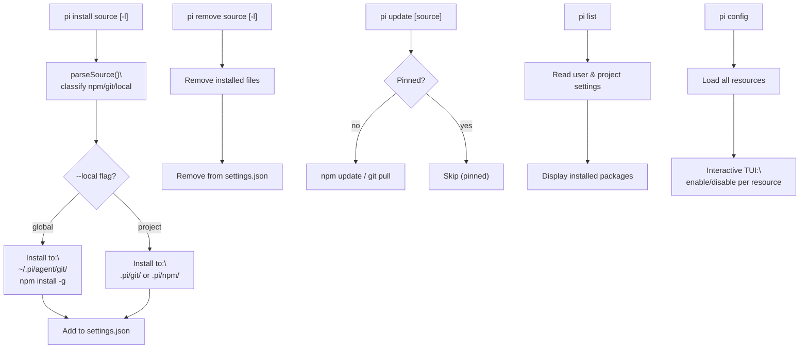
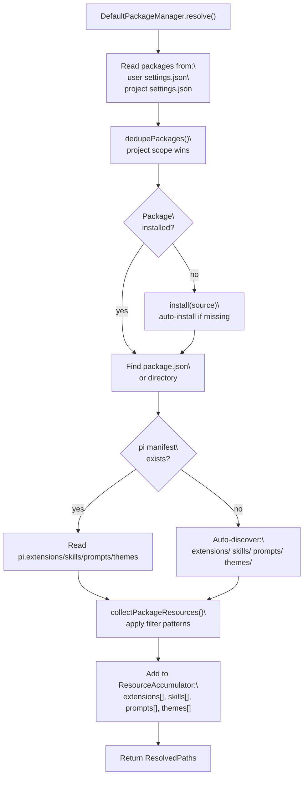
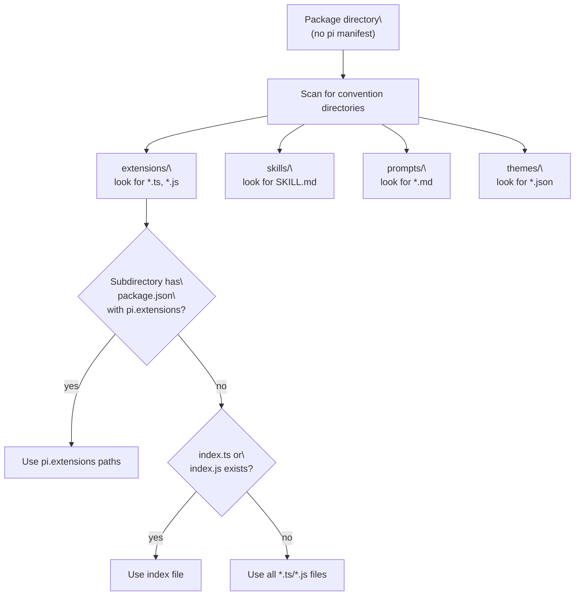

# Package Management

<details>
<summary>Relevant source files</summary>

The following files were used as context for generating this wiki page:

- [packages/coding-agent/docs/packages.md](packages/coding-agent/docs/packages.md)
- [packages/coding-agent/docs/settings.md](packages/coding-agent/docs/settings.md)
- [packages/coding-agent/src/core/package-manager.ts](packages/coding-agent/src/core/package-manager.ts)
- [packages/coding-agent/src/core/resource-loader.ts](packages/coding-agent/src/core/resource-loader.ts)
- [packages/coding-agent/src/core/settings-manager.ts](packages/coding-agent/src/core/settings-manager.ts)
- [packages/coding-agent/src/modes/interactive/components/settings-selector.ts](packages/coding-agent/src/modes/interactive/components/settings-selector.ts)
- [packages/coding-agent/src/utils/git.ts](packages/coding-agent/src/utils/git.ts)
- [packages/coding-agent/test/git-ssh-url.test.ts](packages/coding-agent/test/git-ssh-url.test.ts)
- [packages/coding-agent/test/git-update.test.ts](packages/coding-agent/test/git-update.test.ts)
- [packages/coding-agent/test/package-manager-ssh.test.ts](packages/coding-agent/test/package-manager-ssh.test.ts)
- [packages/coding-agent/test/package-manager.test.ts](packages/coding-agent/test/package-manager.test.ts)
- [packages/coding-agent/test/resource-loader.test.ts](packages/coding-agent/test/resource-loader.test.ts)

</details>

This page documents the Pi Package system: how to install, remove, and update packages containing extensions, skills, prompt templates, and themes. It covers package sources (npm, git, local), the `pi` manifest in `package.json`, and the `DefaultPackageManager` that handles package lifecycle operations.

For extension loading and execution, see page [4.4](). For settings configuration, see page [4.6](). For how resources are loaded after packages are resolved, see the relevant resource-specific pages ([4.4]() for extensions, [4.8]() for skills/prompts, [4.9]() for themes).

---

## Overview

A **Pi Package** is a directory, npm package, or git repository that bundles extensions, skills, prompt templates, and/or themes for distribution. Users install packages globally or per-project, and pi automatically discovers and loads their contents.

**Finding packages**: Search [npmjs.com](https://www.npmjs.com/search?q=keywords%3Api-package) for packages tagged with `"keywords": ["pi-package"]`, or browse the [Discord showcase channel](https://discord.com/channels/1456806362351669492/1457744485428629628).

Sources: [packages/coding-agent/README.md:327-329](), [packages/coding-agent/docs/packages.md:1-20]()

---

## Package Sources

Packages can be installed from three source types. Each source type has different installation behavior and pinning semantics.

| Type      | Syntax Examples                                                                                                                      | Install Location                                                                                                                             | Pinning                     |
| --------- | ------------------------------------------------------------------------------------------------------------------------------------ | -------------------------------------------------------------------------------------------------------------------------------------------- | --------------------------- |
| **npm**   | `npm:@scope/pkg`<br/>`npm:@scope/pkg@1.2.3`                                                                                          | Global: `npm install -g`<br/>Project: `.pi/npm/`                                                                                             | Pinned if version specified |
| **git**   | `git:github.com/user/repo`<br/>`git:github.com/user/repo@v1`<br/>`https://github.com/user/repo`<br/>`ssh://git@github.com/user/repo` | Global: `~/.pi/agent/git/<host>/<path>`<br/>Project: `.pi/git/<host>/<path>`<br/>Temporary: `$TMPDIR/pi-extensions/git-<host>/<hash>/<path>` | Pinned if ref specified     |
| **local** | `/abs/path`<br/>`./rel/path`                                                                                                         | Referenced in place (not copied)                                                                                                             | Never pinned                |

**Pinning**: Sources with a version (`@1.2.3`) or ref (`@v1`, `@main`, `@abc123`) are considered **pinned** and are skipped by `pi update`. Unpinned sources always pull the latest version.

Sources: [packages/coding-agent/src/core/package-manager.ts:74-86](), [packages/coding-agent/docs/packages.md:44-96](), [packages/coding-agent/README.md:332-347]()

---

## CLI Commands

**Diagram: Package command flow**



Sources: [packages/coding-agent/src/main.ts:72-301](), [packages/coding-agent/README.md:332-347](), [packages/coding-agent/src/cli/args.ts:186-191]()

### install

```bash
pi install <source> [-l]
```

Installs a package from npm, git, or local path. The `-l`/`--local` flag installs to the current project (`.pi/`) instead of globally (`~/.pi/agent/`).

**Examples**:

```bash
pi install npm:@foo/pi-tools
pi install npm:@foo/pi-tools@1.2.3      # pinned version
pi install git:github.com/user/repo
pi install git:github.com/user/repo@v1  # pinned tag
pi install https://github.com/user/repo
pi install ssh://git@github.com/user/repo
pi install ./local/path
pi install -l npm:@foo/tools            # project-local
```

After installation, the source is added to `settings.json` (global or project scope).

Sources: [packages/coding-agent/src/core/package-manager.ts:793-814](), [packages/coding-agent/README.md:332-343]()

### remove

```bash
pi remove <source> [-l]
```

Removes an installed package and deletes its entry from settings. For npm packages, runs `npm uninstall`. For git packages, deletes the cloned directory. Local packages are not copied, so removal only affects settings.

Sources: [packages/coding-agent/src/core/package-manager.ts:816-833](), [packages/coding-agent/README.md:343]()

### update

```bash
pi update [source]
```

Updates unpinned packages to their latest versions. If `source` is provided, only that package is updated. Pinned packages (those with `@version` or `@ref`) are always skipped.

- **npm packages**: Checks the npm registry for newer versions and reinstalls if available.
- **git packages**: Runs `git fetch --prune origin` and `git reset --hard origin/<branch>` to pull the latest commit on the default branch.

Sources: [packages/coding-agent/src/core/package-manager.ts:835-871](), [packages/coding-agent/README.md:345]()

### list

```bash
pi list
```

Lists all installed packages from both user and project settings, showing their source specifiers and installation paths.

Sources: [packages/coding-agent/src/main.ts:246-283](), [packages/coding-agent/README.md:344]()

### config

```bash
pi config
```

Opens an interactive TUI to enable/disable individual extensions, skills, prompts, and themes from installed packages. Changes are saved to `settings.json`.

Sources: [packages/coding-agent/src/main.ts:519-540](), [packages/coding-agent/README.md:346](), [packages/coding-agent/src/cli/config-selector.ts:1-310]()

---

## The `pi` Manifest

Packages declare their contents in `package.json` under the `"pi"` key. The `PiManifest` interface defines four optional arrays.

```json
{
  "name": "my-pi-package",
  "keywords": ["pi-package"],
  "pi": {
    "extensions": ["./extensions"],
    "skills": ["./skills"],
    "prompts": ["./prompts"],
    "themes": ["./themes"]
  }
}
```

Each array contains paths relative to the package root. Paths can be files, directories, or glob patterns. If the `pi` key is missing, `DefaultPackageManager` falls back to auto-discovery of convention directories.

Sources: [packages/coding-agent/src/core/package-manager.ts:88-93](), [packages/coding-agent/examples/extensions/with-deps/package.json:1-22](), [packages/coding-agent/docs/packages.md:97-114](), [packages/coding-agent/README.md:351-367]()

---

## Package Resolution

**Diagram: DefaultPackageManager resolution flow**



Sources: [packages/coding-agent/src/core/package-manager.ts:728-780](), [packages/coding-agent/src/core/package-manager.ts:293-404]()

The `resolve()` method is the main entry point for loading packages. It:

1. **Reads settings**: Merges package lists from `~/.pi/agent/settings.json` and `.pi/settings.json`.
2. **Deduplicates**: If the same package appears in both user and project settings, keeps only the project entry.
3. **Installs missing packages**: Calls the `onMissing` callback (if provided) before auto-installing.
4. **Reads package contents**: Either from the `pi` manifest in `package.json` or via auto-discovery.
5. **Applies filter patterns**: Include/exclude patterns from settings narrow the resource list.
6. **Returns `ResolvedPaths`**: An object containing arrays of `ResolvedResource` for each resource type.

Sources: [packages/coding-agent/src/core/package-manager.ts:728-780](), [packages/coding-agent/src/core/package-manager.ts:293-404]()

---

## Scope and Deduplication

Packages can be installed in three scopes, each with a distinct settings file and installation directory.

| Scope         | Settings File               | Install Directory                       |
| ------------- | --------------------------- | --------------------------------------- |
| **user**      | `~/.pi/agent/settings.json` | `~/.pi/agent/git/`<br/>`npm install -g` |
| **project**   | `<cwd>/.pi/settings.json`   | `<cwd>/.pi/git/`<br/>`<cwd>/.pi/npm/`   |
| **temporary** | (in-memory, CLI flags)      | `$TMPDIR/pi-extensions/`                |

When the same package appears in both user and project settings, `dedupePackages()` keeps only the project entry. **Package identity** is computed by `getPackageIdentity()`:

- **npm**: Package name (e.g., `@foo/bar`), ignoring version
- **git**: `host/path` (e.g., `github.com/user/repo`), ignoring ref; SSH and HTTPS URLs are normalized to the same identity
- **local**: Resolved absolute path

This ensures project-specific packages override global packages, allowing per-project customization without conflicts.

Sources: [packages/coding-agent/src/core/package-manager.ts:1106-1147](), [packages/coding-agent/src/core/package-manager.ts:72]()

---

## Auto-Discovery

When a package has no `pi` manifest in `package.json`, `DefaultPackageManager` falls back to convention-based discovery. It scans for standard directory names and file patterns.

**Diagram: Auto-discovery convention directories**



Sources: [packages/coding-agent/src/core/package-manager.ts:293-404](), [packages/coding-agent/src/core/package-manager.ts:311-330]()

### Discovery Rules by Resource Type

| Resource Type  | File Patterns                                                | Notes                                                                                                                                              |
| -------------- | ------------------------------------------------------------ | -------------------------------------------------------------------------------------------------------------------------------------------------- |
| **extensions** | `*.ts`, `*.js` in `extensions/`                              | Subdirectories with `package.json` can define `pi.extensions`; otherwise looks for `index.ts`/`index.js`; otherwise collects all `.ts`/`.js` files |
| **skills**     | `SKILL.md` in subdirectories of `skills/`, or `*.md` in root | Skills require a `SKILL.md` file in their own subdirectory                                                                                         |
| **prompts**    | `*.md` in `prompts/`                                         | Markdown files become `/command` templates                                                                                                         |
| **themes**     | `*.json` in `themes/`                                        | JSON theme definitions                                                                                                                             |

Ignore files (`.gitignore`, `.ignore`, `.fdignore`) are respected during recursive collection. The `.pi/` directory itself is never excluded, even if a parent `.gitignore` contains `.pi`.

Sources: [packages/coding-agent/src/core/package-manager.ts:120-169](), [packages/coding-agent/src/core/package-manager.ts:446-498](), [packages/coding-agent/test/package-manager.test.ts:239-249]()

### Ancestor Skill Discovery

Skills also search upward from `cwd` to the git repository root (stopping at `.git`), collecting from `.agents/skills/` directories at each level. This allows workspace-level skill sharing across projects.

Sources: [packages/coding-agent/src/core/package-manager.ts:446-498]()

---

## Pattern Filtering

Packages in `settings.json` can be specified as strings (the source) or as objects that include filter patterns. Patterns control which resources from a package are enabled.

### Pattern Syntax

| Prefix     | Meaning                                             | Example                    |
| ---------- | --------------------------------------------------- | -------------------------- |
| _(none)_   | Include matching paths (glob)                       | `"extensions/*.ts"`        |
| `!pattern` | Exclude matching paths (glob)                       | `"!extensions/legacy.ts"`  |
| `+path`    | Force-include exact path (overrides exclusions)     | `"+extensions/special.ts"` |
| `-path`    | Force-exclude exact path (overrides force-includes) | `"-extensions/broken.ts"`  |

**Evaluation order** in `applyPatterns()`:

1. Apply include patterns (or start with all discovered paths if no includes specified).
2. Apply `!` exclude patterns.
3. Apply `+` force-include patterns (override excludes).
4. Apply `-` force-exclude patterns (override force-includes).

### Settings Example

```json
{
  "packages": [
    "npm:@foo/basic-package",
    {
      "source": "npm:@bar/filtered-package",
      "extensions": ["extensions/*.ts", "!extensions/legacy.ts"],
      "skills": [],
      "prompts": ["prompts/review.md"],
      "themes": ["+themes/legacy.json"]
    }
  ]
}
```

- **String source**: Loads all resources from the package.
- **Object source**: Applies filters to narrow the resource list.
  - `"extensions": ["extensions/*.ts", "!extensions/legacy.ts"]` — include all `.ts` files except `legacy.ts`.
  - `"skills": []` — load no skills from this package.
  - `"prompts": ["prompts/review.md"]` — load only `review.md`.
  - `"themes": ["+themes/legacy.json"]` — force-include `legacy.json` even if it would be excluded.

When a package specifies filters in its `pi` manifest, settings filters are applied **on top** — they narrow the manifest selection, never replace it.

Sources: [packages/coding-agent/src/core/package-manager.ts:587-633](), [packages/coding-agent/src/core/package-manager.ts:560-577](), [packages/coding-agent/docs/packages.md:172-198]()

---

## Settings Integration

Packages are tracked in `settings.json` under the `"packages"` key. The `SettingsManager` reads and merges global and project settings.

**Settings schema**:

```json
{
  "packages": [
    "npm:@foo/bar",
    "git:github.com/user/repo@v1.0",
    "./local/path",
    {
      "source": "npm:@baz/pkg",
      "extensions": ["extensions/*.ts"],
      "skills": [],
      "prompts": ["prompts/*.md"],
      "themes": ["themes/dark.json"]
    }
  ]
}
```

Each entry can be:

- A **string** (the source) — loads all resources from the package.
- An **object** with `source` and optional filter arrays — applies patterns to narrow resources.

Settings precedence:

- Project settings (`.pi/settings.json`) override user settings (`~/.pi/agent/settings.json`) for the same package.
- CLI flags (`--extension`, `--skill`, etc.) are temporary and not persisted to settings.

Sources: [packages/coding-agent/src/core/settings-manager.ts:1-500](), [packages/coding-agent/docs/packages.md:115-140]()

---

## Offline Mode

Setting the environment variable `PI_OFFLINE=1` (or `true` / `yes`) disables all network operations. `DefaultPackageManager` will skip npm registry checks, git fetches, and any automatic installs of missing packages. Already-installed packages are still resolved and loaded normally.

Sources: [packages/coding-agent/src/core/package-manager.ts:14-18](), [packages/coding-agent/src/core/package-manager.ts:852-854]()

---

## Progress Reporting

`DefaultPackageManager` exposes `setProgressCallback(callback)` to receive `ProgressEvent` notifications during install, remove, update, clone, and pull operations.

```typescript
interface ProgressEvent {
  type: 'start' | 'progress' | 'complete' | 'error'
  action: 'install' | 'remove' | 'update' | 'clone' | 'pull'
  source: string
  message?: string
}
```

The CLI wires this callback to display progress output during long-running network operations.

Sources: [packages/coding-agent/src/core/package-manager.ts:42-49](), [packages/coding-agent/src/core/package-manager.ts:707-726]()
