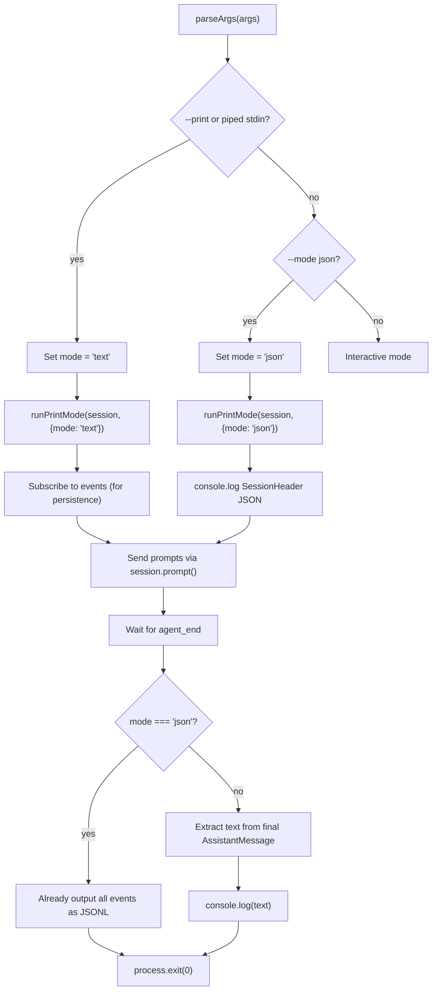
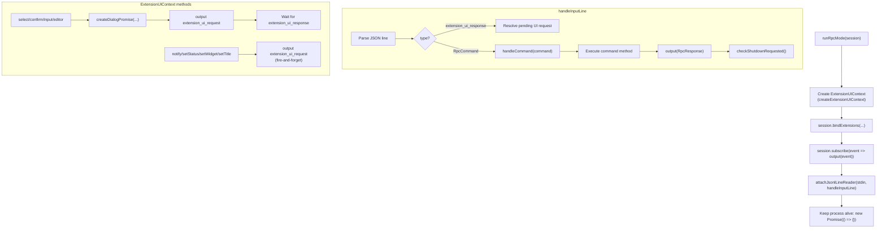
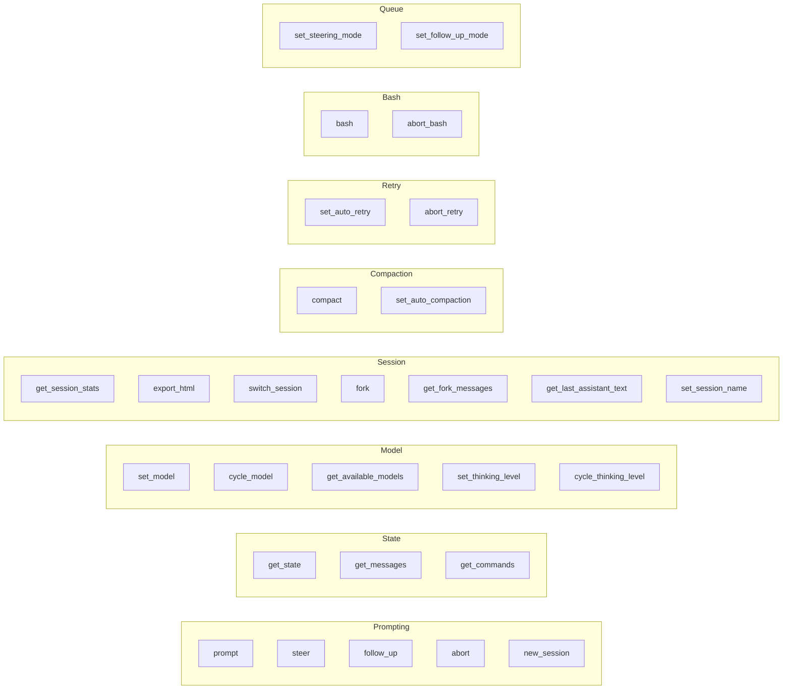
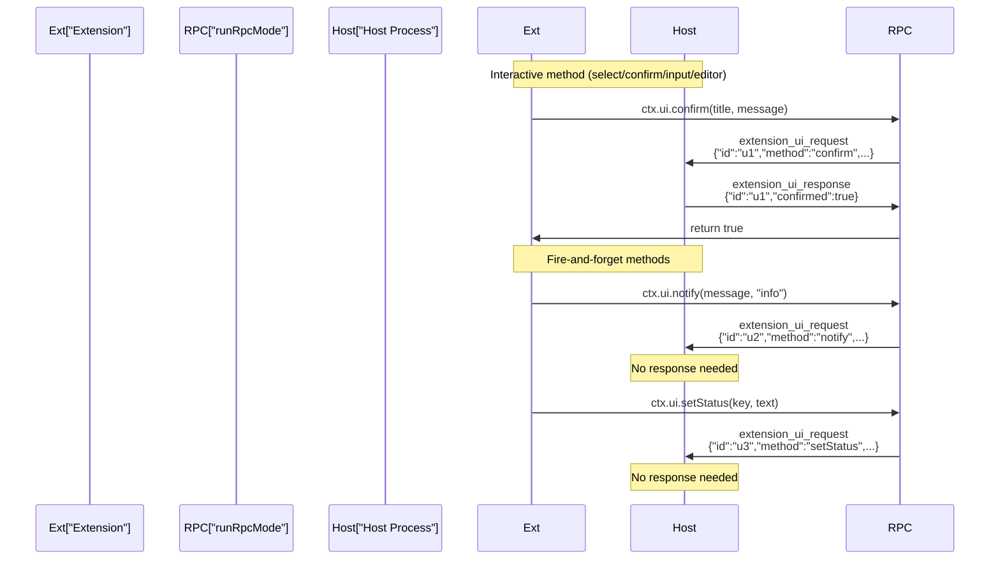
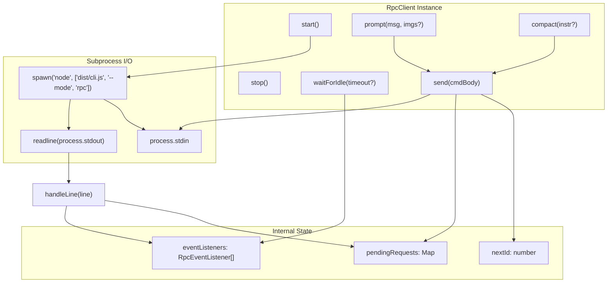

# Print Mode & RPC Mode

<details>
<summary>Relevant source files</summary>

The following files were used as context for generating this wiki page:

- [AGENTS.md](AGENTS.md)
- [README.md](README.md)
- [packages/coding-agent/README.md](packages/coding-agent/README.md)
- [packages/coding-agent/src/cli/args.ts](packages/coding-agent/src/cli/args.ts)
- [packages/coding-agent/src/core/agent-session.ts](packages/coding-agent/src/core/agent-session.ts)
- [packages/coding-agent/src/core/sdk.ts](packages/coding-agent/src/core/sdk.ts)
- [packages/coding-agent/src/main.ts](packages/coding-agent/src/main.ts)
- [packages/coding-agent/src/modes/interactive/interactive-mode.ts](packages/coding-agent/src/modes/interactive/interactive-mode.ts)
- [packages/coding-agent/src/modes/print-mode.ts](packages/coding-agent/src/modes/print-mode.ts)
- [packages/coding-agent/src/modes/rpc/rpc-mode.ts](packages/coding-agent/src/modes/rpc/rpc-mode.ts)

</details>

This page documents the two non-interactive execution modes in `pi-coding-agent`:

1. **Print Mode** — Single-shot execution with text or JSON output. Processes prompts and exits immediately after completion.
2. **RPC Mode** — Subprocess-based integration via JSON-over-stdin/stdout protocol for process isolation and cross-language integration.

Both modes use the same `AgentSession` core as interactive mode but skip the TUI layer. For interactive mode, see page 4.10. For programmatic SDK usage, see the exports from [packages/coding-agent/src/core/sdk.ts]().

---

## Print Mode

Print mode executes one or more prompts and exits. It is invoked via `pi -p` or `pi --mode json`. The implementation in [packages/coding-agent/src/modes/print-mode.ts:30-124]() configures `AgentSession` without UI bindings and subscribes to events for output.

### CLI Invocation

```bash
# Text output (default): prints final assistant response
pi -p "List files in src/"

# JSON output: streams all AgentSessionEvent objects as JSONL
pi --mode json "Summarize this codebase"

# Multiple prompts (processed sequentially)
pi -p "Read package.json" "What dependencies do we have?"

# With file attachments
pi -p @screenshot.png "What's in this image?"

# Piped input (forces print mode automatically)
cat prompt.txt | pi
```

Sources: [packages/coding-agent/README.md:442-447](), [packages/coding-agent/src/main.ts:632-641]()

### Text vs JSON Output

**Print mode output formats**



Sources: [packages/coding-agent/src/main.ts:663-779](), [packages/coding-agent/src/modes/print-mode.ts:30-124]()

**Text mode** (`-p` or default when stdin piped):

- Subscribes to events for session persistence only.
- After all prompts complete, extracts text content from the final `AssistantMessage` and writes it to stdout.
- Exits with code 1 if `stopReason === "error" || "aborted"`.

**JSON mode** (`--mode json`):

- First line: `SessionHeader` JSON (session metadata).
- Subsequent lines: each `AgentSessionEvent` as a JSON object.
- Events include `agent_start`, `message_update` (streaming deltas), `tool_execution_start`, `tool_execution_end`, `agent_end`, etc.
- Extensions still run; their events are included.

Sources: [packages/coding-agent/src/modes/print-mode.ts:30-124]()

### `runPrintMode` Implementation

The `runPrintMode` function in [packages/coding-agent/src/modes/print-mode.ts:30-124]() performs these steps:

1. If `mode === "json"`, output `SessionHeader` from `session.sessionManager.getHeader()`.
2. Call `session.bindExtensions()` with no-op `uiContext` and command context actions.
3. Subscribe to `session` events. If JSON mode, `console.log(JSON.stringify(event))` for each event.
4. Send `initialMessage` (with images) via `session.prompt()`.
5. Send remaining messages from `options.messages` array.
6. If text mode, extract text content from final assistant message and print to stdout.
7. Flush stdout buffer before returning.

Sources: [packages/coding-agent/src/modes/print-mode.ts:30-124]()

### Print Mode Options

```typescript
interface PrintModeOptions {
  mode: 'text' | 'json'
  messages?: string[] // Additional prompts after initialMessage
  initialMessage?: string // First prompt (may contain @file content)
  initialImages?: ImageContent[]
}
```

The `messages` array is populated from positional CLI arguments. The `initialMessage` is built from `@file` arguments in [packages/coding-agent/src/cli/file-processor.ts]().

Sources: [packages/coding-agent/src/modes/print-mode.ts:12-24]()

---

## RPC Mode

RPC mode runs the agent as a headless subprocess with a JSON-over-stdio protocol. Commands are sent as JSON lines on `stdin`; responses and agent events are emitted as JSON lines on `stdout`. This enables process isolation and cross-language integration.

### CLI Invocation

```bash
pi --mode rpc [options]

# With model selection
pi --mode rpc --provider anthropic --model claude-sonnet-4-5

# Ephemeral (no session persistence)
pi --mode rpc --no-session

# With specific tools
pi --mode rpc --tools read,bash
```

The subprocess runs indefinitely, processing commands until the parent closes stdin or sends a shutdown signal.

Sources: [packages/coding-agent/README.md:390-400](), [packages/coding-agent/src/main.ts:745-746]()

### Protocol Architecture

**RPC protocol message flow with extension UI**

```mermaid
sequenceDiagram
    participant Host["Host Process"]
    participant RPC["pi subprocess<br/>(runRpcMode)"]
    participant Session["AgentSession"]
    participant LLM["LLM API"]

    Note over Host,RPC: Command/Response
    Host->>RPC: '{"id":"r1","type":"prompt","message":"Hello"}\
'
    RPC->>Session: session.prompt(...)
    RPC-->>Host: '{"id":"r1","type":"response","command":"prompt","success":true}\
'

    Note over Session,LLM: Streaming events
    Session->>LLM: stream request
    LLM-->>Session: text delta
    Session-->>RPC: AgentSessionEvent (message_update)
    RPC-->>Host: '{"type":"message_update",...}\
'
    LLM-->>Session: tool_call
    Session-->>RPC: AgentSessionEvent (tool_execution_start)
    RPC-->>Host: '{"type":"tool_execution_start",...}\
'
    Session-->>RPC: AgentSessionEvent (tool_execution_end)
    RPC-->>Host: '{"type":"tool_execution_end",...}\
'
    LLM-->>Session: done
    Session-->>RPC: AgentSessionEvent (agent_end)
    RPC-->>Host: '{"type":"agent_end","messages":[...]}\
'

    Note over Host,RPC: Extension UI (bidirectional)
    RPC-->>Host: '{"type":"extension_ui_request","id":"u1","method":"confirm",...}\
'
    Host->>RPC: '{"type":"extension_ui_response","id":"u1","confirmed":true}\
'
```

Sources: [packages/coding-agent/src/modes/rpc/rpc-mode.ts:1-12](), [packages/coding-agent/src/modes/rpc/rpc-mode.ts:45-638]()

### JSONL Framing

RPC mode uses strict LF-delimited JSONL framing. Each message (command, response, event) is a single JSON object terminated by `\
`. Clients must split records on `\
` only, not on Unicode line separators inside JSON payloads. Do not use generic line readers like Node's `readline` module, which also split on Unicode separators.

The `attachJsonlLineReader` utility in [packages/coding-agent/src/modes/rpc/jsonl.ts:6-35]() implements compliant framing with a buffer-based approach.

Sources: [packages/coding-agent/README.md:398-399](), [packages/coding-agent/src/modes/rpc/jsonl.ts:1-52]()

### `runRpcMode` Implementation

The `runRpcMode` function in [packages/coding-agent/src/modes/rpc/rpc-mode.ts:45-638]() establishes the RPC protocol:

**RPC mode initialization and message dispatch**



Sources: [packages/coding-agent/src/modes/rpc/rpc-mode.ts:45-638]()

**Key implementation details:**

1. **Extension UI Context**: Dialog methods (`select`, `confirm`, `input`, `editor`) emit `extension_ui_request` and block until `extension_ui_response` arrives. Fire-and-forget methods (`notify`, `setStatus`, `setWidget`, `setTitle`, `setEditorText`) emit requests without waiting. Requests include a UUID `id` for correlation.

2. **Pending Requests Map**: `Map<string, {resolve, reject}>` tracks active extension UI requests. When `extension_ui_response` arrives with matching `id`, the promise is resolved. Timeouts and `AbortSignal` are handled via `createDialogPromise` at [packages/coding-agent/src/modes/rpc/rpc-mode.ts:74-115]().

3. **Command Dispatch**: `handleCommand` at [packages/coding-agent/src/modes/rpc/rpc-mode.ts:321-584]() switches on `command.type` and calls corresponding `session` methods (`prompt`, `setModel`, `compact`, etc.).

4. **Event Streaming**: All `AgentSessionEvent` objects from `session.subscribe()` are serialized and written to stdout via `output()`.

5. **Shutdown Handling**: Extensions can call `ctx.shutdown()`, which sets `shutdownRequested = true`. After handling each command, `checkShutdownRequested()` emits `session_shutdown` to extensions and calls `process.exit(0)`.

Sources: [packages/coding-agent/src/modes/rpc/rpc-mode.ts:45-115](), [packages/coding-agent/src/modes/rpc/rpc-mode.ts:119-275](), [packages/coding-agent/src/modes/rpc/rpc-mode.ts:321-638]()

### RPC Commands

All commands are defined in the `RpcCommand` union type at [packages/coding-agent/src/modes/rpc/rpc-types.ts:18-67](). Each command is a JSON object with:

- `type`: Command name
- `id`: Optional string for correlating responses
- Additional fields specific to the command

Responses have type `"response"`, include the same `id`, and contain `success`, `command`, and optional `data` or `error` fields.

**RPC command categories**



Sources: [packages/coding-agent/src/modes/rpc/rpc-types.ts:18-67]()

#### Command Reference Table

| Command                   | Key Fields                                 | Response Data                                | Notes                                |
| ------------------------- | ------------------------------------------ | -------------------------------------------- | ------------------------------------ |
| **Prompting**             |
| `prompt`                  | `message`, `images?`, `streamingBehavior?` | None                                         | Fire-and-forget; events stream async |
| `steer`                   | `message`, `images?`                       | None                                         | Interrupt after current tool         |
| `follow_up`               | `message`, `images?`                       | None                                         | Queue until agent idle               |
| `abort`                   | —                                          | None                                         | Cancel current operation             |
| `new_session`             | `parentSession?`                           | `{cancelled}`                                | Start fresh session                  |
| **State**                 |
| `get_state`               | —                                          | `RpcSessionState`                            | Current session state                |
| `get_messages`            | —                                          | `{messages}`                                 | All messages in session              |
| `get_commands`            | —                                          | `{commands: RpcSlashCommand[]}`              | Available slash commands             |
| **Model**                 |
| `set_model`               | `provider`, `modelId`                      | `Model`                                      | Switch to specified model            |
| `cycle_model`             | —                                          | `{model, thinkingLevel, isScoped}` or `null` | Next scoped model                    |
| `get_available_models`    | —                                          | `{models}`                                   | Models with API keys                 |
| `set_thinking_level`      | `level`                                    | None                                         | Set thinking level                   |
| `cycle_thinking_level`    | —                                          | `{level}` or `null`                          | Next thinking level                  |
| **Session**               |
| `get_session_stats`       | —                                          | `SessionStats`                               | Token/cost/entry counts              |
| `export_html`             | `outputPath?`                              | `{path}`                                     | Export to HTML file                  |
| `switch_session`          | `sessionPath`                              | `{cancelled}`                                | Load different session               |
| `fork`                    | `entryId`                                  | `{text, cancelled}`                          | Create new session from entry        |
| `get_fork_messages`       | —                                          | `{messages}`                                 | User messages for forking            |
| `get_last_assistant_text` | —                                          | `{text}`                                     | Last assistant text                  |
| `set_session_name`        | `name`                                     | None                                         | Set display name                     |
| **Compaction**            |
| `compact`                 | `customInstructions?`                      | `CompactionResult`                           | Manually compact context             |
| `set_auto_compaction`     | `enabled`                                  | None                                         | Toggle auto-compaction               |
| **Retry**                 |
| `set_auto_retry`          | `enabled`                                  | None                                         | Toggle auto-retry                    |
| `abort_retry`             | —                                          | None                                         | Cancel pending retry                 |
| **Bash**                  |
| `bash`                    | `command`                                  | `BashResult`                                 | Execute shell command                |
| `abort_bash`              | —                                          | None                                         | Cancel running command               |
| **Queue**                 |
| `set_steering_mode`       | `mode: "all" \| "one-at-a-time"`           | None                                         | Set steering delivery mode           |
| `set_follow_up_mode`      | `mode: "all" \| "one-at-a-time"`           | None                                         | Set follow-up delivery mode          |

Sources: [packages/coding-agent/src/modes/rpc/rpc-types.ts:18-67](), [packages/coding-agent/src/modes/rpc/rpc-mode.ts:321-583]()

### RPC Types

**`RpcSessionState`** — Response data for `get_state` command:

```typescript
{
  model?: Model<any>              // Current model (undefined if none available)
  thinkingLevel: ThinkingLevel    // Current thinking level
  isStreaming: boolean            // Whether agent is actively streaming
  isCompacting: boolean           // Whether compaction is in progress
  steeringMode: "all" | "one-at-a-time"
  followUpMode: "all" | "one-at-a-time"
  sessionFile?: string            // Path to session file (undefined if ephemeral)
  sessionId: string               // Session UUID
  sessionName?: string            // User-set display name
  autoCompactionEnabled: boolean
  messageCount: number
  pendingMessageCount: number     // Queued steering/follow-up messages
}
```

**`RpcSlashCommand`** — Elements in `get_commands` response:

```typescript
{
  name: string                    // Command name (e.g., "reload", "skill:websearch")
  description?: string
  source: "extension" | "prompt" | "skill"
  location?: "user" | "project" | "path"  // For prompt/skill sources
  path?: string                   // File path
}
```

Sources: [packages/coding-agent/src/modes/rpc/rpc-types.ts:91-104](), [packages/coding-agent/src/modes/rpc/rpc-types.ts:142-150]()

### Extension UI Protocol

Extensions can call `ctx.ui` methods in RPC mode. Interactive methods become bidirectional request/response pairs; fire-and-forget methods emit notifications.

**Extension UI request/response flow**



Sources: [packages/coding-agent/src/modes/rpc/rpc-mode.ts:119-275]()

**`RpcExtensionUIRequest`** types (stdout):

| Method            | Fields                                          | Wait for Response?                   |
| ----------------- | ----------------------------------------------- | ------------------------------------ |
| `select`          | `title`, `options: string[]`, `timeout?`        | Yes → `{value}` or `{cancelled}`     |
| `confirm`         | `title`, `message`, `timeout?`                  | Yes → `{confirmed}` or `{cancelled}` |
| `input`           | `title`, `placeholder?`, `timeout?`             | Yes → `{value}` or `{cancelled}`     |
| `editor`          | `title`, `prefill?`                             | Yes → `{value}` or `{cancelled}`     |
| `notify`          | `message`, `notifyType?`                        | No                                   |
| `setStatus`       | `statusKey`, `statusText`                       | No                                   |
| `setWidget`       | `widgetKey`, `widgetLines?`, `widgetPlacement?` | No                                   |
| `setTitle`        | `title`                                         | No                                   |
| `set_editor_text` | `text`                                          | No                                   |

**`RpcExtensionUIResponse`** (stdin):

```typescript
{
  type: "extension_ui_response",
  id: string,  // Must match request id
  // One of:
  value?: string,
  confirmed?: boolean,
  cancelled?: true
}
```

**Timeout and cancellation:** The `createDialogPromise` helper at [packages/coding-agent/src/modes/rpc/rpc-mode.ts:74-115]() tracks pending requests and handles `timeout` and `signal?.aborted`. If timeout expires or signal fires, the default value is returned and the request is removed from the pending map.

Sources: [packages/coding-agent/src/modes/rpc/rpc-types.ts:212-257](), [packages/coding-agent/src/modes/rpc/rpc-mode.ts:74-275]()

### `RpcClient` — TypeScript Wrapper

`RpcClient` in [packages/coding-agent/src/modes/rpc/rpc-client.ts:54-510]() is a typed Promise-based wrapper around a `pi --mode rpc` subprocess. It is used in the test suite and suitable for any Node.js host requiring process isolation.

**RpcClient architecture**



Sources: [packages/coding-agent/src/modes/rpc/rpc-client.ts:54-510]()

**Key methods:**

| Method                                | Return Type                 | Description                              |
| ------------------------------------- | --------------------------- | ---------------------------------------- |
| `start()`                             | `Promise<void>`             | Spawn subprocess, wire stdin/stdout      |
| `stop()`                              | `Promise<void>`             | Send SIGTERM, wait for exit              |
| `prompt(message, images?)`            | `Promise<void>`             | Send prompt command                      |
| `steer(message, images?)`             | `Promise<void>`             | Send steer command                       |
| `followUp(message, images?)`          | `Promise<void>`             | Send follow_up command                   |
| `abort()`                             | `Promise<void>`             | Send abort command                       |
| `getState()`                          | `Promise<RpcSessionState>`  | Get session state                        |
| `setModel(provider, modelId)`         | `Promise<Model>`            | Switch model                             |
| `compact(instructions?)`              | `Promise<CompactionResult>` | Compact context                          |
| `bash(command)`                       | `Promise<BashResult>`       | Execute shell command                    |
| `waitForIdle(timeout?)`               | `Promise<void>`             | Wait for `agent_end` event               |
| `promptAndWait(msg, imgs?, timeout?)` | `Promise<AgentEvent[]>`     | Send and collect events until done       |
| `onEvent(listener)`                   | `() => void`                | Subscribe to events; returns unsubscribe |

**Internal flow:**

1. `send(commandBody)` auto-increments `nextId`, creates a pending promise, writes `{"id":"...","type":"...",..."}\
` to stdin.
2. `handleLine(line)` parses JSON, dispatches to `pendingRequests.get(id)` for responses, or calls all `eventListeners` for events.
3. 30-second timeout per command; rejects on timeout.

Sources: [packages/coding-agent/src/modes/rpc/rpc-client.ts:163-510]()

**Usage example:**

```typescript
import { RpcClient } from '@mariozechner/pi-coding-agent'

const client = new RpcClient({
  cliPath: './dist/cli.js',
  provider: 'anthropic',
  model: 'claude-sonnet-4-5',
})

await client.start()

// Subscribe to events
client.onEvent((event) => {
  if (event.type === 'message_update') {
    const delta = event.assistantMessageEvent
    if (delta.type === 'text_delta') {
      process.stdout.write(delta.delta)
    }
  }
})

// Send prompt and wait for completion
const events = await client.promptAndWait('List files in src/')

await client.stop()
```

Sources: [packages/coding-agent/src/modes/rpc/rpc-client.ts:54-510](), [packages/coding-agent/test/rpc.test.ts:14-45]()

---

## SDK vs RPC Mode Comparison

|                     | SDK (direct)                    | RPC Mode (subprocess)                                     |
| ------------------- | ------------------------------- | --------------------------------------------------------- |
| Language            | TypeScript/Node.js only         | Any language                                              |
| Access              | `createAgentSession()`          | `pi --mode rpc`                                           |
| Events              | `session.subscribe()`           | JSON lines on stdout                                      |
| Commands            | Method calls on `AgentSession`  | JSON lines to stdin                                       |
| Extension UI        | `ExtensionUIContext` callbacks  | `extension_ui_request` / `extension_ui_response` messages |
| Process isolation   | None                            | Full subprocess isolation                                 |
| Typed client        | `AgentSession` directly         | `RpcClient` (Node.js wrapper)                             |
| Session persistence | Controlled via `SessionManager` | Same; `--no-session` disables                             |

Sources: [packages/coding-agent/src/core/sdk.ts:41-72](), [packages/coding-agent/src/modes/rpc/rpc-mode.ts:1-12](), [packages/coding-agent/docs/rpc.md:1-10]()
