# Session Management & History Tree

<details>
<summary>Relevant source files</summary>

The following files were used as context for generating this wiki page:

- [packages/coding-agent/src/cli/session-picker.ts](packages/coding-agent/src/cli/session-picker.ts)
- [packages/coding-agent/src/core/session-manager.ts](packages/coding-agent/src/core/session-manager.ts)
- [packages/coding-agent/src/modes/interactive/components/session-selector-search.ts](packages/coding-agent/src/modes/interactive/components/session-selector-search.ts)
- [packages/coding-agent/src/modes/interactive/components/session-selector.ts](packages/coding-agent/src/modes/interactive/components/session-selector.ts)
- [packages/coding-agent/test/session-selector-path-delete.test.ts](packages/coding-agent/test/session-selector-path-delete.test.ts)
- [packages/coding-agent/test/session-selector-search.test.ts](packages/coding-agent/test/session-selector-search.test.ts)

</details>

This document describes how `pi-coding-agent` persists conversation history, implements tree-structured branching, and manages session state. For settings related to session behavior, see [Settings Management](#4.6). For how AgentSession uses SessionManager, see [AgentSession Lifecycle & Architecture](#4.2).

## Overview

`SessionManager` maintains a persistent, tree-structured history of all interactions with the agent. Every message, tool call, model change, and compaction is stored as an entry in the tree. Users can branch at any point to explore alternative conversation paths, and navigate between branches. The tree is persisted to disk in JSONL format.

**Key Features:**

- **Append-only log**: All entries are appended to `context.jsonl`
- **Tree structure**: Entries have parent pointers, supporting multiple children (branches)
- **Navigation**: Switch to any entry to restore that point in history
- **Compaction**: Summarize old context to reduce token usage
- **Branch summaries**: Optionally summarize abandoned branches when switching

---

## File Format & Persistence

Sessions are stored as JSONL files (one JSON object per line) with automatic directory organization based on the working directory.

### Session File Locations

Sessions are stored in `~/.pi/agent/sessions/` with directory names encoding the working directory path:

| Pattern                                           | Example Path                                                                       | Purpose                                          |
| ------------------------------------------------- | ---------------------------------------------------------------------------------- | ------------------------------------------------ |
| `--{encoded-cwd}--/{timestamp}_{sessionId}.jsonl` | `~/.pi/agent/sessions/--home-user-project--/2025-01-15T10-30-00-000Z_abc123.jsonl` | Default per-directory session                    |
| Custom path via `--session` flag                  | `/path/to/custom.jsonl`                                                            | Explicit session file                            |
| No file (in-memory)                               | N/A                                                                                | Created when SessionManager persistence disabled |

The directory name encoding replaces path separators with hyphens and removes the leading `/`. For example:

- `/home/user/project` → `--home-user-project--`
- `/var/www/app` → `--var-www-app--`

### JSONL Format

The first line is always a session header. Each subsequent line is a session entry.

**Session Header Structure:**

```typescript
{
  type: "session",
  version: 3,                    // Current version
  id: "abc123",                  // Session UUID
  timestamp: "2025-01-15T10:30:00.000Z",
  cwd: "/home/user/project",     // Working directory
  parentSession?: "/path/to/parent.jsonl"  // If forked
}
```

**Entry Structure (all entries have these fields):**

- `id`: Unique 8-character hex ID (collision-checked)
- `parentId`: Parent entry ID (null for first entry)
- `timestamp`: ISO 8601 timestamp
- `type`: Entry type (see below)

**Example Session File:**

```jsonl
{"type":"session","version":3,"id":"abc123","timestamp":"2025-01-15T10:30:00.000Z","cwd":"/home/user/project"}
{"id":"e1a2b3c4","timestamp":"2025-01-15T10:30:00.000Z","type":"message","parentId":null,"message":{"role":"user","content":"Hello"}}
{"id":"f5d6e7f8","timestamp":"2025-01-15T10:30:05.000Z","type":"message","parentId":"e1a2b3c4","message":{"role":"assistant","content":"Hi there!"}}
```

Sources: [packages/coding-agent/src/core/session-manager.ts:29-36](), [packages/coding-agent/src/core/session-manager.ts:420-428](), [packages/coding-agent/src/core/session-manager.ts:726-745]()

---

## Entry Types

The tree supports multiple entry types, each representing a different kind of session event.

### Core Entry Types

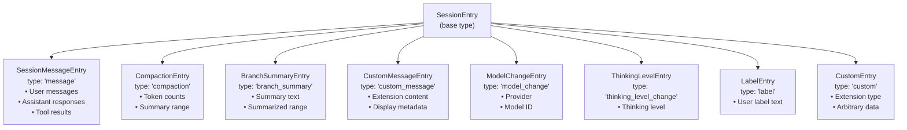

### Entry Type Details

| Type                    | Purpose                                            | Key Fields                                                                                                    |
| ----------------------- | -------------------------------------------------- | ------------------------------------------------------------------------------------------------------------- |
| `message`               | LLM messages (user, assistant, toolResult)         | `message: AgentMessage`                                                                                       |
| `compaction`            | Marks where context was compacted                  | `summary: string`, `firstKeptEntryId: string`, `tokensBefore: number`, `details?: T`, `fromHook?: boolean`    |
| `branch_summary`        | Summary of abandoned branch                        | `summary: string`, `fromId: string`, `details?: T`, `fromHook?: boolean`                                      |
| `custom_message`        | Extension-created messages included in LLM context | `customType: string`, `content: string \| (TextContent \| ImageContent)[]`, `display: boolean`, `details?: T` |
| `custom`                | Extension-specific data (not sent to LLM)          | `customType: string`, `data?: unknown`                                                                        |
| `model_change`          | Model switch                                       | `provider: string`, `modelId: string`                                                                         |
| `thinking_level_change` | Thinking level change                              | `thinkingLevel: string`                                                                                       |
| `label`                 | User-assigned label for bookmarking                | `targetId: string`, `label: string \| undefined`                                                              |
| `session_info`          | Session metadata (e.g., display name)              | `name?: string`                                                                                               |

**Key Differences Between Custom Entry Types:**

- **`custom`**: For persisting extension state. Ignored by `buildSessionContext()`, not sent to LLM.
- **`custom_message`**: Participates in LLM context. Content converted to user message. Use `display: false` to hide from TUI.

Sources: [packages/coding-agent/src/core/session-manager.ts:50-146]()

---

## Tree Structure

Entries form a tree via parent pointers. Each entry has one parent (except the root), but can have multiple children (branches).

### Tree Node Representation

```typescript
interface SessionTreeNode {
  entry: SessionEntry // The entry itself
  children: SessionTreeNode[] // Child nodes
  label?: string // User-assigned label
}
```

### Example Tree

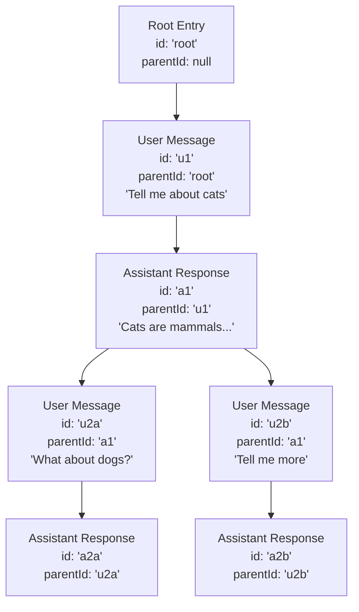

The tree has two branches starting at `a1`: one exploring dogs, another diving deeper into cats.

Sources: [packages/coding-agent/src/core/session-manager.ts:250-350]()

---

## SessionManager API

### Key Methods

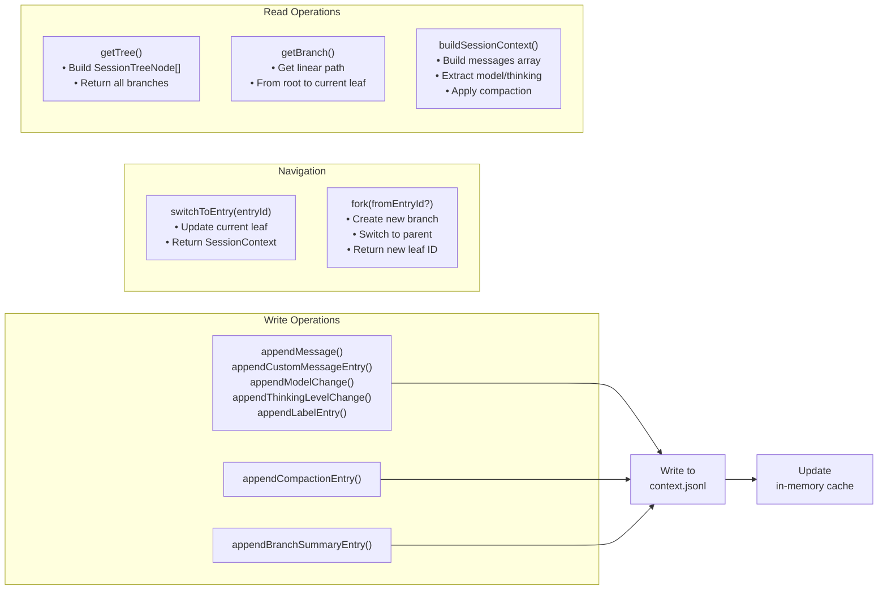

### Creating a SessionManager Instance

The `SessionManager` constructor is private. Instances are created through factory methods and internal initialization.

**Internal Construction Flow:**

```typescript
// Constructor signature (private)
private constructor(
  cwd: string,
  sessionDir: string,
  sessionFile: string | undefined,
  persist: boolean
)
```

**Key Initialization Methods:**

- `setSessionFile(sessionFile: string)`: Load existing session from path
- `newSession(options?: NewSessionOptions)`: Create new session in current directory
- `createBranchedSession(leafId: string)`: Fork session to new file

**Session File Resolution:**

```typescript
// Default session directory for a working directory
function getDefaultSessionDir(cwd: string): string {
  const safePath = `--${cwd.replace(/^[/\\]/, '').replace(/[/\\:]/g, '-')}--`
  return join(getDefaultAgentDir(), 'sessions', safePath)
}
```

When a new session is created, the file name format is:

```
{timestamp}_{sessionId}.jsonl
```

Example: `2025-01-15T10-30-00-000Z_abc12345.jsonl`

Sources: [packages/coding-agent/src/core/session-manager.ts:676-689](), [packages/coding-agent/src/core/session-manager.ts:420-428](), [packages/coding-agent/src/core/session-manager.ts:724-746]()

### Appending Entries

All append methods follow the same pattern: create an entry as a child of the current `leafId`, advance the leaf pointer, and persist to disk.

```typescript
// Append a message (user, assistant, or tool result)
const entryId = manager.appendMessage(userMessage)

// Append a model change
const entryId = manager.appendModelChange('anthropic', 'claude-opus-4-5')

// Append a thinking level change
const entryId = manager.appendThinkingLevelChange('high')

// Append a compaction entry
const entryId = manager.appendCompaction(
  'Summarized conversation about X', // summary
  'firstKeptEntryId', // first kept entry
  10000, // tokens before
  { customData: 'value' }, // optional details
  false // fromHook (false = pi-generated)
)

// Append custom entry (extension state, not in LLM context)
const entryId = manager.appendCustomEntry('my-extension', { state: 'data' })

// Append custom message (extension content, included in LLM context)
const entryId = manager.appendCustomMessageEntry(
  'my-extension', // customType
  'Custom message content', // content
  true, // display in TUI
  { metadata: 'value' } // optional details
)

// Append session info (e.g., display name)
const entryId = manager.appendSessionInfo('My Feature Branch')

// Append/update label
const entryId = manager.appendLabelChange('target-entry-id', 'my-label')
```

**Entry Persistence Flow:**

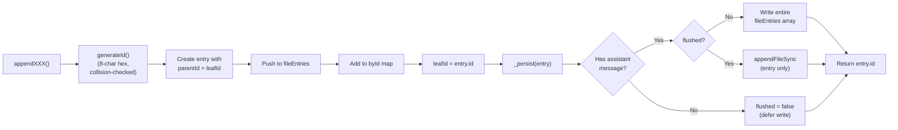

The persistence logic defers writing until the first assistant message arrives to avoid creating empty session files.

Sources: [packages/coding-agent/src/core/session-manager.ts:792-816](), [packages/coding-agent/src/core/session-manager.ts:825-863](), [packages/coding-agent/src/core/session-manager.ts:887-953](), [packages/coding-agent/src/core/session-manager.ts:199-206]()

---

## Branching & Forking

### Creating a Branch: `branch()` Method

Branching repositions the `leafId` pointer to an earlier entry. The next append will create a new child, forming a branch.

```typescript
// Move leaf to a specific entry
manager.branch('entry-id-to-branch-from')

// Move leaf to before all entries (creates new root)
manager.resetLeaf()
```

**Branching Mechanics:**

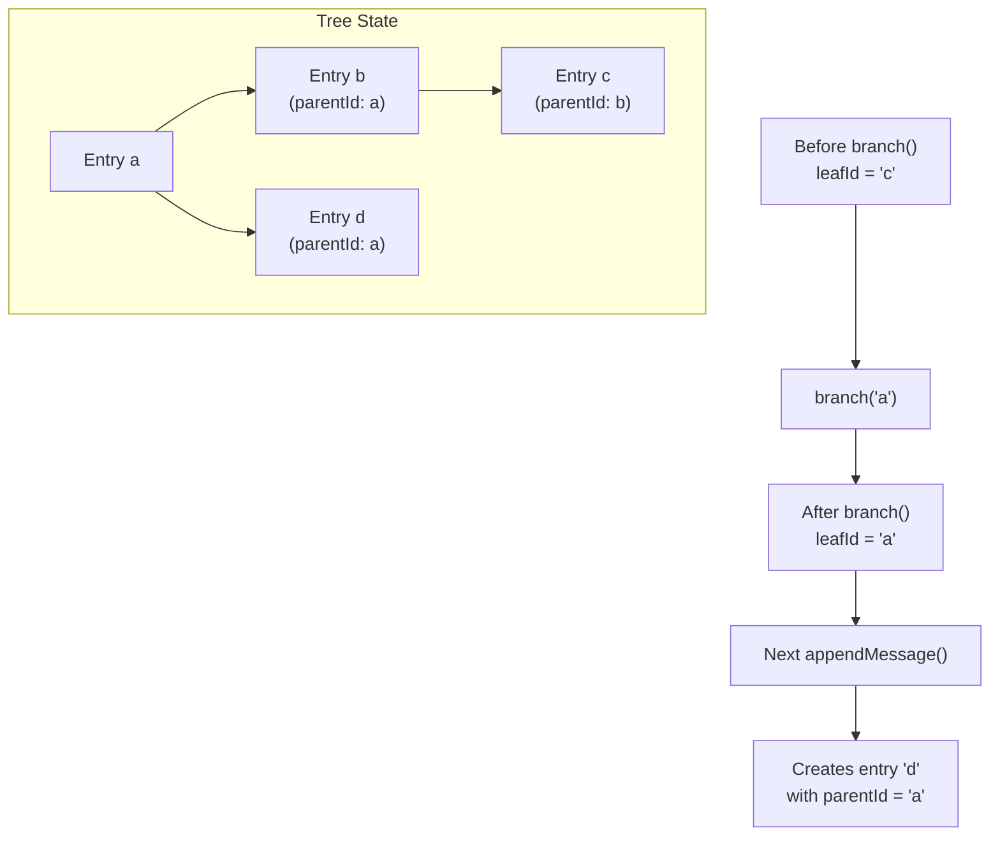

### Branch with Summary: `branchWithSummary()`

Creates a branch and immediately appends a `BranchSummaryEntry` to preserve context from the abandoned path.

```typescript
// Branch from a specific entry with summary
const entryId = manager.branchWithSummary(
  'branch-from-id', // Entry to branch from (or null for root)
  'Summary of abandoned conversation', // Summary text
  { extensionData: 'value' }, // Optional details
  false // fromHook (extension-generated)
)
```

The `BranchSummaryEntry` is converted to a user message in `buildSessionContext()`, providing context about the abandoned branch to the LLM.

### Creating a New Session File: `createBranchedSession()`

Extracts a linear path from the tree into a new session file.

```typescript
// Create new session with only the path to a specific entry
const newFilePath = manager.createBranchedSession('leaf-entry-id')
```

**Process:**

1. Walk from specified entry to root via `parentId` chain
2. Create new session header with new UUID and timestamp
3. Set `parentSession` field to current session file path
4. Copy all entries in the path (except `LabelEntry`)
5. Recreate `LabelEntry` entries at the end for labeled entries in path
6. Write to new file in same session directory
7. Switch current `SessionManager` instance to new file

This is useful for extracting a specific conversation thread from a heavily-branched session.

Sources: [packages/coding-agent/src/core/session-manager.ts:1112-1118](), [packages/coding-agent/src/core/session-manager.ts:1124-1127](), [packages/coding-agent/src/core/session-manager.ts:1133-1150](), [packages/coding-agent/src/core/session-manager.ts:1157-1238]()

---

## Navigation & Tree Operations

### Reading the Current Position

The `leafId` tracks the current position in the tree. It's updated automatically by append operations and can be repositioned via `branch()` or `resetLeaf()`.

```typescript
// Get current leaf ID
const leafId: string | null = manager.getLeafId()

// Get current leaf entry
const entry: SessionEntry | undefined = manager.getLeafEntry()

// Get any entry by ID
const entry: SessionEntry | undefined = manager.getEntry('entry-id')

// Get all direct children of an entry
const children: SessionEntry[] = manager.getChildren('parent-id')

// Get label for an entry
const label: string | undefined = manager.getLabel('entry-id')
```

### Walking the Tree

```typescript
// Get path from root to current leaf
const path: SessionEntry[] = manager.getBranch()

// Get path from root to specific entry
const path: SessionEntry[] = manager.getBranch('entry-id')

// Get all entries (excluding header)
const entries: SessionEntry[] = manager.getEntries()

// Get tree structure with all branches
const tree: SessionTreeNode[] = manager.getTree()
```

**Tree Structure:**

```typescript
interface SessionTreeNode {
  entry: SessionEntry
  children: SessionTreeNode[]
  label?: string // Resolved from LabelEntry entries
}
```

The `getTree()` method builds a defensive copy of the tree structure, resolving labels from `LabelEntry` entries and sorting children by timestamp.

### Building Session Context for LLM

```typescript
// Build context for current leaf
const context: SessionContext = manager.buildSessionContext()

// Structure returned:
interface SessionContext {
  messages: AgentMessage[] // Linear message list for LLM
  thinkingLevel: string // Latest thinking level
  model: { provider: string; modelId: string } | null // Latest model
}
```

**Context Building Algorithm:**

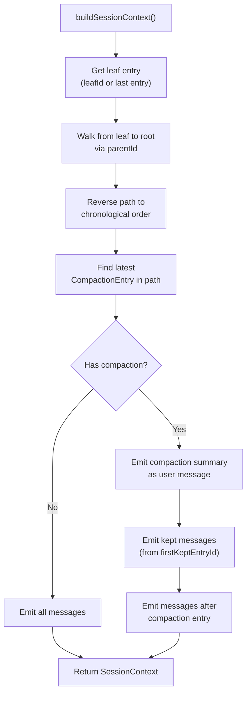

**Message Types Included in Context:**

- `SessionMessageEntry`: Extracted as-is
- `CustomMessageEntry`: Converted to custom message
- `BranchSummaryEntry`: Converted to user message with summary
- `CompactionEntry`: Summary message replaces compacted range

**State Extraction:**

- Latest `ModelChangeEntry` or assistant message sets `model`
- Latest `ThinkingLevelChangeEntry` sets `thinkingLevel`

Sources: [packages/coding-agent/src/core/session-manager.ts:959-969](), [packages/coding-agent/src/core/session-manager.ts:974-1031](), [packages/coding-agent/src/core/session-manager.ts:1036-1100](), [packages/coding-agent/src/core/session-manager.ts:308-415]()

---

## Session Listing & Selection

The system provides a sophisticated session selector with search, filtering, and tree display capabilities.

### SessionInfo Structure

When listing sessions, each session is represented as:

```typescript
interface SessionInfo {
  path: string // Full path to .jsonl file
  id: string // Session UUID
  cwd: string // Working directory
  name?: string // User-defined display name
  parentSessionPath?: string // Parent session if forked
  created: Date // Session creation time
  modified: Date // Last activity time
  messageCount: number // Total message count
  firstMessage: string // First user message text
  allMessagesText: string // All messages concatenated (for search)
}
```

### Session Discovery

Sessions are discovered by scanning `~/.pi/agent/sessions/` directories:

```typescript
async function listSessionsFromDir(
  dir: string,
  onProgress?: (loaded: number, total: number) => void
): Promise<SessionInfo[]>
```

**Session Listing Flow:**

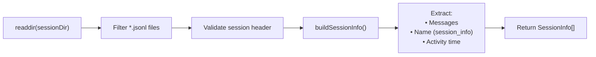

### Session Selector UI

The `SessionSelectorComponent` provides an interactive session picker with multiple features.

**Sort Modes:**
| Mode | Description |
|------|-------------|
| `threaded` | Tree view showing parent-child relationships |
| `recent` | Flat list sorted by modified date (preserves input order when searching) |
| `relevance` | Fuzzy search ranked by match quality |

**Name Filter:**
| Filter | Description |
|--------|-------------|
| `all` | Show all sessions |
| `named` | Show only sessions with explicit names (via `session_info` entries) |

**Search Syntax:**
| Pattern | Example | Description |
|---------|---------|-------------|
| Fuzzy tokens | `foo bar` | Match both "foo" and "bar" independently |
| Quoted phrases | `"node cve"` | Match exact phrase with whitespace normalization |
| Regex | `re:\bbrave\b` | Case-insensitive regex match |

**Keyboard Shortcuts:**
| Key | Action |
|-----|--------|
| `Tab` | Toggle current folder / all folders scope |
| `Ctrl+S` | Toggle sort mode (threaded/recent/relevance) |
| `Ctrl+N` | Toggle name filter (all/named) |
| `Ctrl+P` | Toggle path display |
| `Ctrl+D` or `Ctrl+Backspace` | Delete selected session (with confirmation) |
| `Ctrl+R` | Rename selected session |
| `Enter` | Select session |
| `Escape` | Cancel |

**Tree Display (Threaded Mode):**

```
› • My Feature  (path/to/session.jsonl)  5  2h
    └─ Bugfix iteration                   3  30m
        ├─ Alternative approach           8  15m
        └─ Final version                  12 5m
```

Tree connectors use ASCII art: `├─`, `└─`, `│` to show parent-child relationships.

Sources: [packages/coding-agent/src/core/session-manager.ts:165-179](), [packages/coding-agent/src/core/session-manager.ts:542-612](), [packages/coding-agent/src/core/session-manager.ts:616-651](), [packages/coding-agent/src/modes/interactive/components/session-selector.ts:51-189](), [packages/coding-agent/src/modes/interactive/components/session-selector.ts:269-620](), [packages/coding-agent/src/modes/interactive/components/session-selector-search.ts:1-195]()

---

## Compaction

Compaction summarizes old context to stay within token limits. The `CompactionEntry` stores metadata about what was compacted and provides a summary that replaces the compacted range in the LLM context. See [AgentSession Lifecycle & Architecture](#4.2) for auto-compaction triggering logic.

### Compaction Entry Structure

```typescript
interface CompactionEntry<T = unknown> {
  type: 'compaction'
  id: string
  timestamp: string
  parentId: string
  summary: string // Summary text replacing compacted range
  firstKeptEntryId: string // First entry kept (after compaction)
  tokensBefore: number // Estimated tokens before compaction
  details?: T // Extension-specific structured data
  fromHook?: boolean // true if extension-generated
}
```

**Key Field: `firstKeptEntryId`**

The `firstKeptEntryId` field marks the boundary of compaction. When building session context:

1. Walk the path from leaf to root
2. If a `CompactionEntry` is found, emit its summary as a user message
3. Emit kept entries from `firstKeptEntryId` forward (before the compaction entry in the path)
4. Emit entries after the compaction entry
5. Skip all entries before `firstKeptEntryId` (these were summarized)

**Compaction Context Building:**

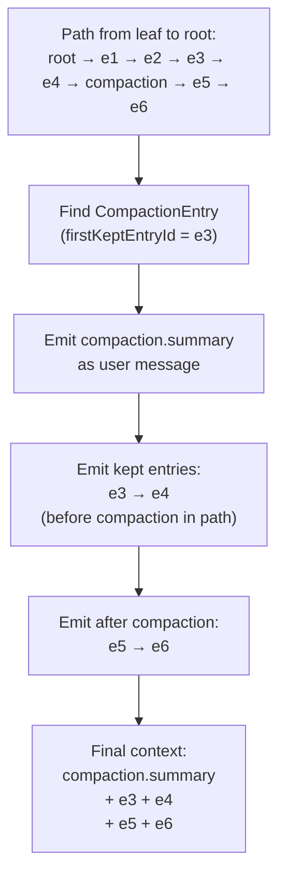

### Extension-Provided Compaction

Extensions can provide custom compaction logic via the `beforeCompact` hook. If an extension returns a summary, `fromHook` is set to `true`, and the extension can use `details` for structured data (e.g., artifact indices, versioning).

Sources: [packages/coding-agent/src/core/session-manager.ts:66-75](), [packages/coding-agent/src/core/session-manager.ts:865-885](), [packages/coding-agent/src/core/session-manager.ts:359-406]()

---

## Branch Summaries

When branching to an earlier entry, a `BranchSummaryEntry` can be created to preserve context from the abandoned path. This is similar to compaction but triggered manually during navigation.

### Branch Summary Entry Structure

```typescript
interface BranchSummaryEntry<T = unknown> {
  type: 'branch_summary'
  id: string
  timestamp: string
  parentId: string
  fromId: string // Entry ID where branch originated
  summary: string // Summary of abandoned path
  details?: T // Extension-specific data (not sent to LLM)
  fromHook?: boolean // true if extension-generated
}
```

**Usage Pattern:**

```typescript
// Create branch with summary
manager.branchWithSummary(
  'entry-id-to-branch-from',
  'Summary of what we tried: ...',
  { extensionMetadata: 'value' },
  false // fromHook
)

// Next append creates new child of 'entry-id-to-branch-from'
manager.appendMessage(newUserMessage)
```

**Context Building:**

`BranchSummaryEntry` entries are converted to user messages via `createBranchSummaryMessage()` and included in the LLM context. This provides continuity when switching between conversation branches.

**Branch Summary Flow:**

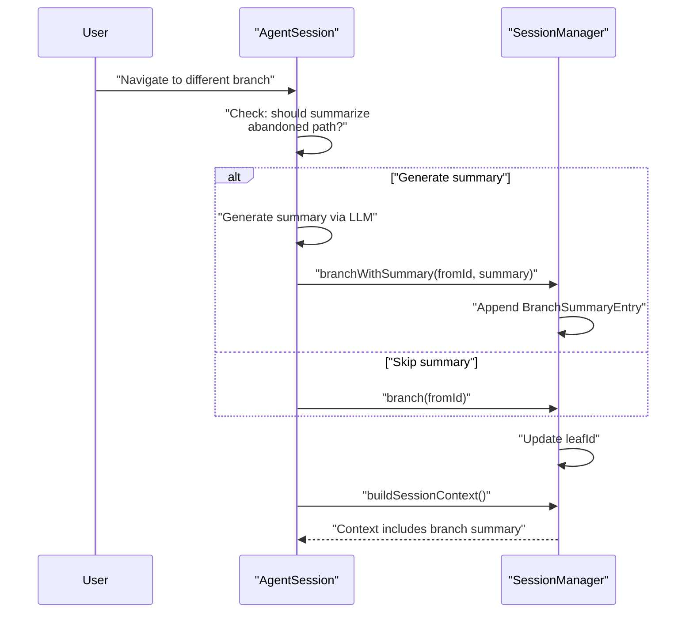

Sources: [packages/coding-agent/src/core/session-manager.ts:77-85](), [packages/coding-agent/src/core/session-manager.ts:1133-1150](), [packages/coding-agent/src/core/session-manager.ts:377-380](), [packages/coding-agent/src/core/messages.ts:1-50]()

---

## Migration & Versioning

The session format has evolved through multiple versions. `SessionManager` automatically migrates old sessions when loaded.

### Version History

| Version | Changes                                                                 |
| ------- | ----------------------------------------------------------------------- |
| 1       | Original format without tree structure (linear only)                    |
| 2       | Added `id`/`parentId` tree structure, `firstKeptEntryId` for compaction |
| 3       | Renamed `hookMessage` role to `custom`                                  |

**Current Version:**

```typescript
export const CURRENT_SESSION_VERSION = 3
```

### Migration Process

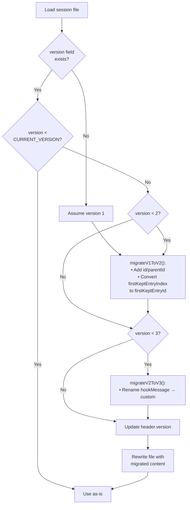

**V1 → V2 Migration:**

Version 1 sessions had no tree structure. Migration:

1. Generate unique 8-character hex IDs for all entries
2. Set `parentId` to previous entry ID (linear chain)
3. Convert `CompactionEntry.firstKeptEntryIndex` (number) to `firstKeptEntryId` (string)

**V2 → V3 Migration:**

Version 2 had a `hookMessage` role. Migration:

1. Scan all `SessionMessageEntry` entries
2. Change `message.role === "hookMessage"` to `message.role === "custom"`

The migration is applied in-place when loading a session, and the file is rewritten with the updated version.

Sources: [packages/coding-agent/src/core/session-manager.ts:27](), [packages/coding-agent/src/core/session-manager.ts:208-235](), [packages/coding-agent/src/core/session-manager.ts:237-253](), [packages/coding-agent/src/core/session-manager.ts:259-269](), [packages/coding-agent/src/core/session-manager.ts:692-722]()

---

## Integration with AgentSession

`AgentSession` uses `SessionManager` for persistence and provides higher-level session operations. For details on `AgentSession` lifecycle, see [AgentSession Lifecycle & Architecture](#4.2).

### Message Persistence Flow

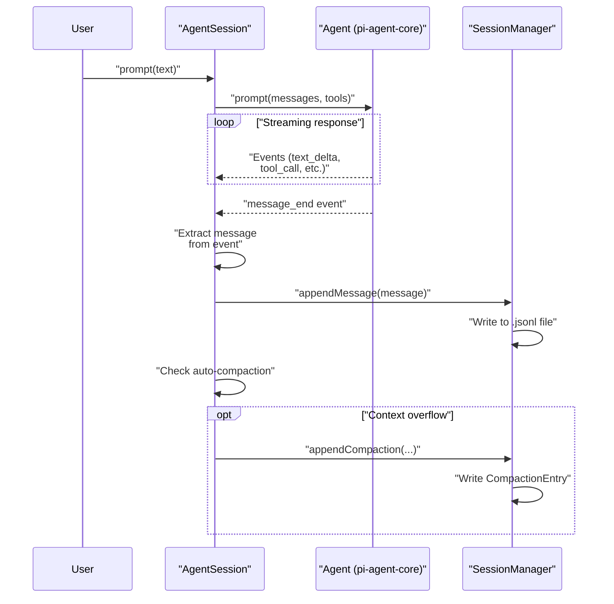

**Key Points:**

- Messages are persisted incrementally after each turn via `message_end` event
- Auto-compaction check happens after each assistant message
- Extensions can intercept via `afterMessageEnd` hook

### Session Creation & Loading

```typescript
// In AgentSession initialization
const sessionManager = createSessionManager(options)

// Loads existing or creates new based on:
if (options.sessionFile) {
  // Load explicit file
  sessionManager.setSessionFile(options.sessionFile)
} else if (options.continueSession) {
  // Load most recent session in current directory
  const recentPath = findMostRecentSession(sessionDir)
  if (recentPath) sessionManager.setSessionFile(recentPath)
}
// Otherwise creates new session via constructor
```

### Session State Synchronization

`AgentSession` keeps the `Agent` instance synchronized with session state:

```typescript
// After loading or switching sessions
const context = sessionManager.buildSessionContext()

// Sync to Agent
agent.replaceMessages(context.messages)
agent.setModel(context.model.provider, context.model.modelId)
agent.setThinkingLevel(context.thinkingLevel)
```

This ensures that the LLM sees the correct message history regardless of which branch is active.

Sources: [packages/coding-agent/src/core/session-manager.ts:474-487](), [packages/coding-agent/src/core/agent-session.ts:1-100]() (approximate, based on architecture understanding)

---

## File System Structure

```
~/.pi/agent/
├── settings.json          # Global settings
├── auth.json              # OAuth credentials
└── sessions/
    ├── --home-user-project--/
    │   ├── 2025-01-15T10-30-00-000Z_abc12345.jsonl
    │   └── 2025-01-16T14-22-10-123Z_def67890.jsonl
    ├── --var-www-app--/
    │   └── 2025-01-15T09-00-00-000Z_ghi11111.jsonl
    └── --home-user-experiments--/
        └── 2025-01-14T16-45-30-456Z_jkl22222.jsonl

# Each session file format:
# Line 1: SessionHeader
# Line 2+: SessionEntry entries (messages, compaction, etc.)
```

**Directory Name Encoding:**

The directory name under `sessions/` encodes the working directory path:

- Leading `/` removed
- Path separators (`/`, `\`, `:`) replaced with `-`
- Wrapped in `--` prefix and suffix

Examples:

- `/home/user/project` → `--home-user-project--`
- `C:\Users\Name\Code` → `--C-Users-Name-Code--`

**Session File Name Format:**

```
{timestamp}_{sessionId}.jsonl
```

Where:

- `timestamp`: ISO 8601 with `:` and `.` replaced by `-` (e.g., `2025-01-15T10-30-00-000Z`)
- `sessionId`: 8-character hex from UUID (e.g., `abc12345`)

Sources: [packages/coding-agent/src/core/session-manager.ts:420-428](), [packages/coding-agent/src/core/session-manager.ts:726-745]()

---

## Summary

**Key Classes:**

- `SessionManager`: Manages tree, persistence, navigation
- `SessionTreeNode`: Tree node with entry and children
- Entry types: `SessionMessageEntry`, `CompactionEntry`, `BranchSummaryEntry`, etc.

**Key Methods:**

- `appendMessage()`: Add message to current leaf
- `fork()`: Create branch point
- `switchToEntry()`: Navigate to entry
- `buildSessionContext()`: Build LLM message array
- `getTree()`: Get full tree structure

**Key Files:**

- `packages/coding-agent/src/core/session-manager.ts`: Core implementation
- `packages/coding-agent/src/core/agent-session.ts`: Integration with Agent
- `packages/coding-agent/src/modes/interactive/components/tree-selector.ts`: UI for tree navigation
