# Settings Management

<details>
<summary>Relevant source files</summary>

The following files were used as context for generating this wiki page:

- [packages/coding-agent/docs/packages.md](packages/coding-agent/docs/packages.md)
- [packages/coding-agent/docs/settings.md](packages/coding-agent/docs/settings.md)
- [packages/coding-agent/src/core/package-manager.ts](packages/coding-agent/src/core/package-manager.ts)
- [packages/coding-agent/src/core/resource-loader.ts](packages/coding-agent/src/core/resource-loader.ts)
- [packages/coding-agent/src/core/settings-manager.ts](packages/coding-agent/src/core/settings-manager.ts)
- [packages/coding-agent/src/modes/interactive/components/settings-selector.ts](packages/coding-agent/src/modes/interactive/components/settings-selector.ts)
- [packages/coding-agent/src/utils/git.ts](packages/coding-agent/src/utils/git.ts)
- [packages/coding-agent/test/git-ssh-url.test.ts](packages/coding-agent/test/git-ssh-url.test.ts)
- [packages/coding-agent/test/git-update.test.ts](packages/coding-agent/test/git-update.test.ts)
- [packages/coding-agent/test/package-manager-ssh.test.ts](packages/coding-agent/test/package-manager-ssh.test.ts)
- [packages/coding-agent/test/package-manager.test.ts](packages/coding-agent/test/package-manager.test.ts)
- [packages/coding-agent/test/resource-loader.test.ts](packages/coding-agent/test/resource-loader.test.ts)

</details>

This document describes the settings system in pi-coding-agent, covering the `SettingsManager` class, scoped settings (global vs project), file locking, hot reload, and the settings schema. For session-specific persistence, see [Session Management & History Tree](#4.3). For package management that uses settings to track installed packages, see [Package Management](#4.12).

---

## Purpose and Scope

The settings system provides persistent configuration storage with two-level scoping (global and project), automatic merging, file locking for concurrent access, and hot reload capabilities. Settings control model defaults, UI behavior, compaction parameters, and resource loading paths.

---

## Architecture Overview

### SettingsManager Class

The `SettingsManager` is the central class for reading and writing settings. It maintains three in-memory settings objects: global, project, and merged.

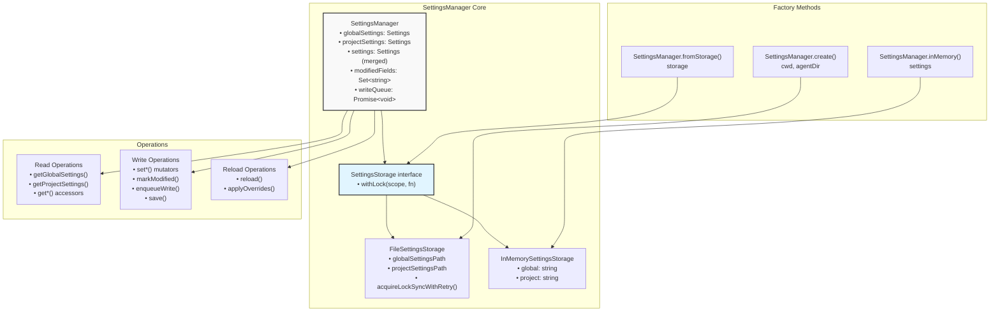

**Storage Abstraction Hierarchy**

Sources: [packages/coding-agent/src/core/settings-manager.ts:132-222]()

---

### File Locations and Initialization

Settings are stored as JSON files in two locations:

| Scope       | Path                        | Description                |
| ----------- | --------------------------- | -------------------------- |
| **Global**  | `~/.pi/agent/settings.json` | User-wide defaults         |
| **Project** | `.pi/settings.json`         | Project-specific overrides |

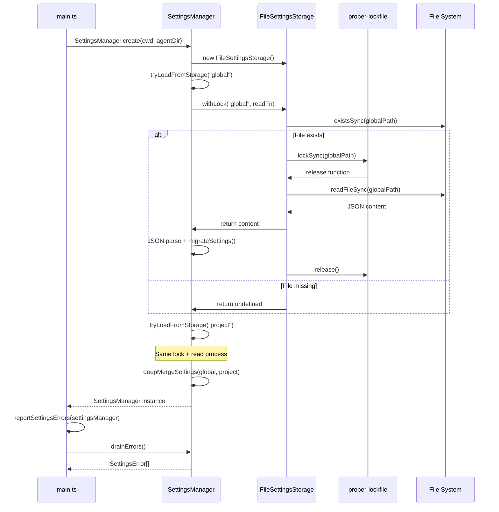

**Settings Initialization Flow**

Sources: [packages/coding-agent/src/main.ts:566-567](), [packages/coding-agent/src/core/settings-manager.ts:256-281]()

---

## Settings Schema

The `Settings` interface defines all configuration options. Settings are organized into categories:

```mermaid
graph LR
    subgraph "Settings Interface"
        Root["Settings"]

        Model["Model & Thinking<br/>• defaultProvider<br/>• defaultModel<br/>• defaultThinkingLevel<br/>• thinkingBudgets<br/>• hideThinkingBlock"]

        UI["UI & Display<br/>• theme<br/>• quietStartup<br/>• collapseChangelog<br/>• doubleEscapeAction<br/>• treeFilterMode<br/>• editorPaddingX<br/>• autocompleteMaxVisible<br/>• showHardwareCursor"]

        Compaction["Compaction Settings<br/>• compaction.enabled<br/>• compaction.reserveTokens<br/>• compaction.keepRecentTokens"]

        Branch["Branch Summary<br/>• branchSummary.reserveTokens<br/>• branchSummary.skipPrompt"]

        Retry["Retry Settings<br/>• retry.enabled<br/>• retry.maxRetries<br/>• retry.baseDelayMs<br/>• retry.maxDelayMs"]

        Messages["Message Delivery<br/>• steeringMode<br/>• followUpMode<br/>• transport"]

        Terminal["Terminal & Images<br/>• terminal.showImages<br/>• terminal.clearOnShrink<br/>• images.autoResize<br/>• images.blockImages"]

        Shell["Shell<br/>• shellPath<br/>• shellCommandPrefix"]

        Resources["Resources<br/>• packages<br/>• extensions<br/>• skills<br/>• prompts<br/>• themes<br/>• enableSkillCommands"]

        Models["Model Cycling<br/>• enabledModels"]

        Markdown["Markdown<br/>• markdown.codeBlockIndent"]
    end

    Root --> Model
    Root --> UI
    Root --> Compaction
    Root --> Branch
    Root --> Retry
    Root --> Messages
    Root --> Terminal
    Root --> Shell
    Root --> Resources
    Root --> Models
    Root --> Markdown
```

**Settings Categories**

### Core Settings Types

| Type                      | Description                   | Example                                       |
| ------------------------- | ----------------------------- | --------------------------------------------- |
| `CompactionSettings`      | Auto-compaction thresholds    | `{ enabled: true, reserveTokens: 16384 }`     |
| `BranchSummarySettings`   | Branch summarization config   | `{ reserveTokens: 16384, skipPrompt: false }` |
| `RetrySettings`           | Retry behavior on errors      | `{ enabled: true, maxRetries: 3 }`            |
| `TerminalSettings`        | Terminal display options      | `{ showImages: true, clearOnShrink: false }`  |
| `ImageSettings`           | Image processing options      | `{ autoResize: true, blockImages: false }`    |
| `ThinkingBudgetsSettings` | Custom thinking token budgets | `{ minimal: 1024, low: 2048 }`                |
| `MarkdownSettings`        | Markdown rendering options    | `{ codeBlockIndent: "  " }`                   |
| `PackageSource`           | Package loading config        | String or object with filters                 |
| `TransportSetting`        | Provider transport preference | `"sse"`, `"websocket"`, or `"auto"`           |

Sources: [packages/coding-agent/src/core/settings-manager.ts:7-96](), [packages/coding-agent/docs/settings.md:12-152]()

---

## Scoped Merging

The settings system uses a two-level hierarchy where project settings override global settings. Nested objects merge recursively rather than replacing entirely.

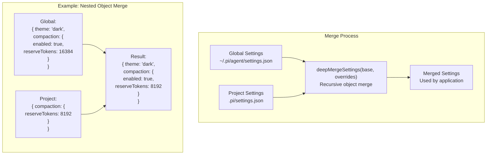

**Settings Merge Strategy**

### Merge Rules

1. **Primitives and Arrays**: Project value completely replaces global value
2. **Objects**: Merge recursively, combining keys from both
3. **Undefined**: Project `undefined` does not clear global values

```typescript
// Implementation logic
for (const key of Object.keys(overrides)) {
  const overrideValue = overrides[key]
  const baseValue = base[key]

  if (overrideValue === undefined) continue

  // Nested object - merge recursively
  if (isObject(overrideValue) && isObject(baseValue)) {
    result[key] = { ...baseValue, ...overrideValue }
  } else {
    // Primitive or array - override wins
    result[key] = overrideValue
  }
}
```

Sources: [packages/coding-agent/src/core/settings-manager.ts:98-127]()

---

## File Locking

`FileSettingsStorage` uses `proper-lockfile` to prevent concurrent modification. Lock acquisition is synchronous with retry logic.

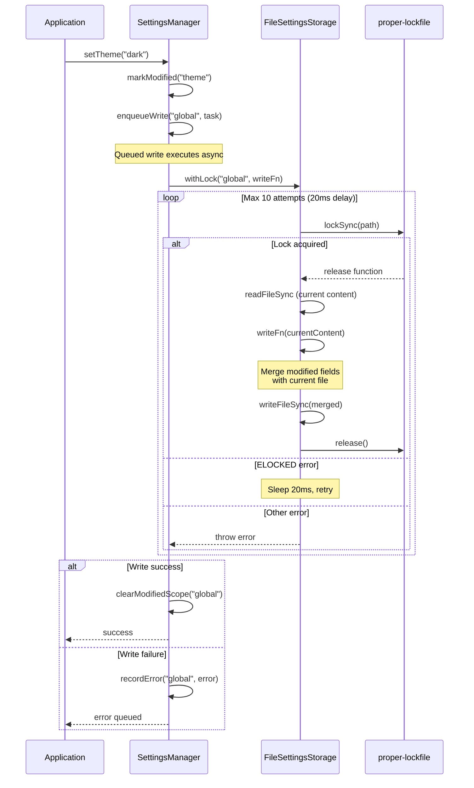

**File Locking and Write Flow**

### Lock Acquisition Strategy

| Parameter             | Value                 | Purpose                           |
| --------------------- | --------------------- | --------------------------------- |
| **Max attempts**      | 10                    | Retry limit for lock acquisition  |
| **Delay per attempt** | 20ms                  | Synchronous sleep between retries |
| **Lock option**       | `{ realpath: false }` | Don't resolve symlinks            |

### Write Queue

All write operations are serialized through a promise chain to prevent concurrent file access within the same process:

```typescript
private writeQueue: Promise<void> = Promise.resolve();

private enqueueWrite(scope: SettingsScope, task: () => void): void {
    this.writeQueue = this.writeQueue
        .then(() => {
            task();
            this.clearModifiedScope(scope);
        })
        .catch((error) => {
            this.recordError(scope, error);
        });
}
```

Sources: [packages/coding-agent/src/core/settings-manager.ts:149-204](), [packages/coding-agent/src/core/settings-manager.ts:430-439]()

---

## Modified Field Tracking

`SettingsManager` tracks which fields have been modified during the session to enable partial updates. This prevents overwriting concurrent external changes to unmodified fields.

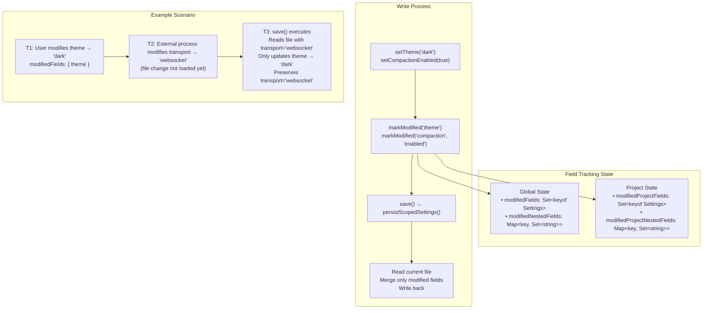

**Modified Field Tracking and Partial Updates**

### Tracking Logic

```typescript
// Mark field modified
private markModified(field: keyof Settings, nestedKey?: string): void {
    this.modifiedFields.add(field);
    if (nestedKey) {
        if (!this.modifiedNestedFields.has(field)) {
            this.modifiedNestedFields.set(field, new Set());
        }
        this.modifiedNestedFields.get(field)!.add(nestedKey);
    }
}

// Write only modified fields
private persistScopedSettings(...): void {
    storage.withLock(scope, (current) => {
        const currentFileSettings = current ? JSON.parse(current) : {};
        const mergedSettings = { ...currentFileSettings };

        for (const field of modifiedFields) {
            if (modifiedNestedFields.has(field)) {
                // Merge only modified nested keys
                const base = currentFileSettings[field] ?? {};
                const modified = snapshotSettings[field];
                mergedSettings[field] = { ...base };
                for (const nestedKey of modifiedNestedFields.get(field)!) {
                    mergedSettings[field][nestedKey] = modified[nestedKey];
                }
            } else {
                // Replace entire field
                mergedSettings[field] = snapshotSettings[field];
            }
        }

        return JSON.stringify(mergedSettings, null, 2);
    });
}
```

Sources: [packages/coding-agent/src/core/settings-manager.ts:393-413](), [packages/coding-agent/src/core/settings-manager.ts:449-478]()

---

## Hot Reload

`SettingsManager` supports reloading settings from disk without restarting the application. The `/reload` command triggers this, and themes automatically hot-reload when files change.

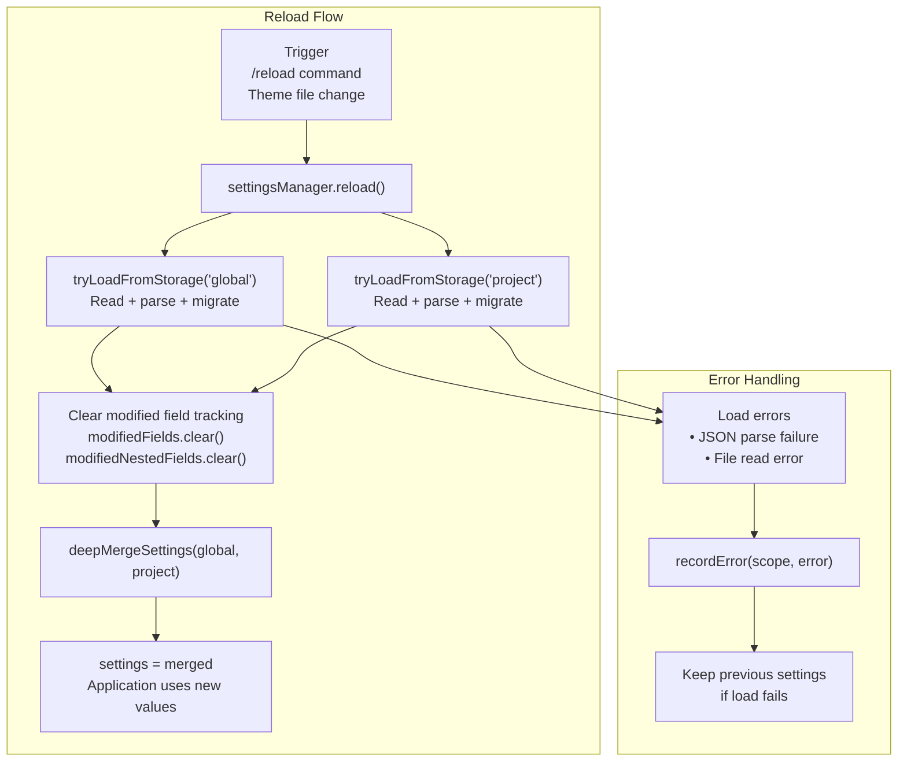

**Hot Reload Process**

### Reload Implementation

```typescript
reload(): void {
    const globalLoad = SettingsManager.tryLoadFromStorage(this.storage, "global");
    if (!globalLoad.error) {
        this.globalSettings = globalLoad.settings;
        this.globalSettingsLoadError = null;
    } else {
        this.globalSettingsLoadError = globalLoad.error;
        this.recordError("global", globalLoad.error);
    }

    // Clear tracking - no longer reflects on-disk state
    this.modifiedFields.clear();
    this.modifiedNestedFields.clear();
    this.modifiedProjectFields.clear();
    this.modifiedProjectNestedFields.clear();

    const projectLoad = SettingsManager.tryLoadFromStorage(this.storage, "project");
    if (!projectLoad.error) {
        this.projectSettings = projectLoad.settings;
        this.projectSettingsLoadError = null;
    } else {
        this.projectSettingsLoadError = projectLoad.error;
        this.recordError("project", projectLoad.error);
    }

    this.settings = deepMergeSettings(this.globalSettings, this.projectSettings);
}
```

Sources: [packages/coding-agent/src/core/settings-manager.ts:360-385]()

---

## Settings Migration

`SettingsManager` automatically migrates deprecated settings formats when loading from storage.

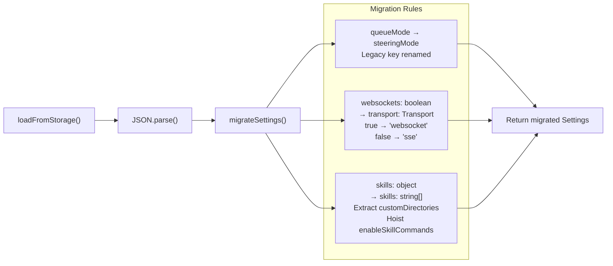

**Settings Migration Rules**

### Migration Examples

| Old Format                                     | New Format                   | Logic          |
| ---------------------------------------------- | ---------------------------- | -------------- |
| `{ queueMode: "all" }`                         | `{ steeringMode: "all" }`    | Direct rename  |
| `{ websockets: true }`                         | `{ transport: "websocket" }` | Boolean → enum |
| `{ websockets: false }`                        | `{ transport: "sse" }`       | Boolean → enum |
| `{ skills: { customDirectories: ["./foo"] } }` | `{ skills: ["./foo"] }`      | Flatten object |

Sources: [packages/coding-agent/src/core/settings-manager.ts:314-350]()

---

## Usage Throughout Application

`SettingsManager` is created at startup and used throughout the application for configuration.

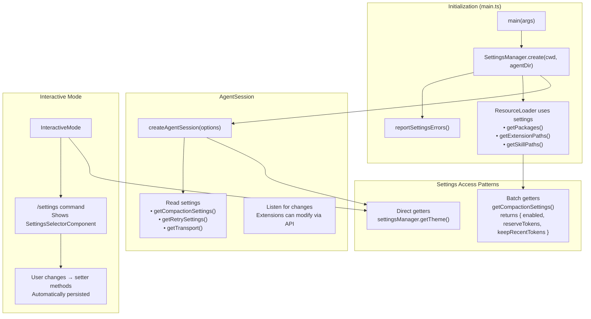

**Settings Usage Across Application**

### Common Access Patterns

| Component               | Usage                               | Methods Called                                                    |
| ----------------------- | ----------------------------------- | ----------------------------------------------------------------- |
| `main.ts`               | Package loading, resource discovery | `getPackages()`, `getExtensionPaths()`, `getSkillPaths()`         |
| `AgentSession`          | Compaction, retry, transport        | `getCompactionSettings()`, `getRetrySettings()`, `getTransport()` |
| `InteractiveMode`       | Theme, thinking levels, UI options  | `getTheme()`, `getDefaultThinkingLevel()`, `getShowImages()`      |
| `SessionManager`        | Branch summary config               | `getBranchSummarySettings()`                                      |
| `DefaultResourceLoader` | Skill command registration          | `getEnableSkillCommands()`                                        |

Sources: [packages/coding-agent/src/main.ts:566-567](), [packages/coding-agent/src/core/session-manager.ts:1-50]() (conceptual reference)

---

## Settings UI Component

Interactive mode provides a TUI for modifying common settings via the `/settings` command.

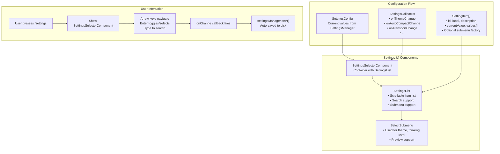

**Settings UI Architecture**

### Settings Items Configuration

The UI dynamically builds a list of `SettingItem` objects representing each configurable option:

```typescript
const items: SettingItem[] = [
  {
    id: 'autocompact',
    label: 'Auto-compact',
    description: 'Automatically compact context when it gets too large',
    currentValue: config.autoCompact ? 'true' : 'false',
    values: ['true', 'false'],
  },
  {
    id: 'thinking',
    label: 'Thinking level',
    description: 'Reasoning depth for thinking-capable models',
    currentValue: config.thinkingLevel,
    submenu: (currentValue, done) =>
      new SelectSubmenu(
        'Thinking Level',
        'Select reasoning depth',
        config.availableThinkingLevels.map((level) => ({
          value: level,
          label: level,
          description: THINKING_DESCRIPTIONS[level],
        })),
        currentValue,
        (value) => {
          callbacks.onThinkingLevelChange(value)
          done(value)
        },
        () => done()
      ),
  },
  // ... more items
]
```

### Callback Mapping

Each setting change triggers a specific callback that updates `SettingsManager`:

| Setting ID      | Callback                | SettingsManager Method           |
| --------------- | ----------------------- | -------------------------------- |
| `autocompact`   | `onAutoCompactChange`   | `setCompactionEnabled(enabled)`  |
| `steering-mode` | `onSteeringModeChange`  | `setSteeringMode(mode)`          |
| `transport`     | `onTransportChange`     | `setTransport(transport)`        |
| `thinking`      | `onThinkingLevelChange` | `setDefaultThinkingLevel(level)` |
| `theme`         | `onThemeChange`         | `setTheme(theme)`                |

Sources: [packages/coding-agent/src/modes/interactive/components/settings-selector.ts:48-421]()

---

## Error Handling

`SettingsManager` accumulates errors during load and write operations. Errors are drained and reported at startup.

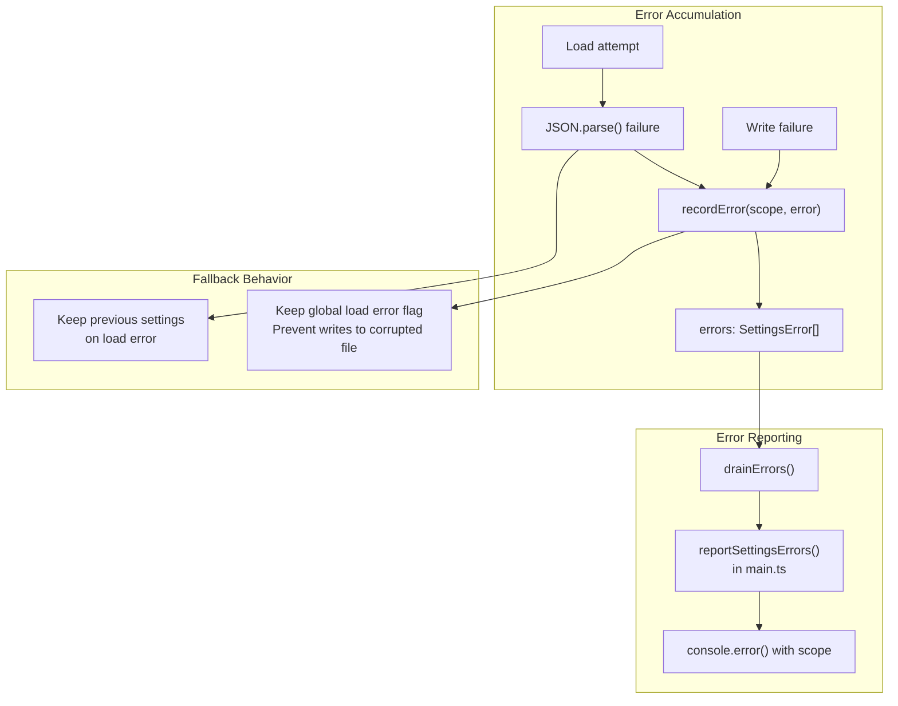

**Error Handling Flow**

### Error Structure

```typescript
export interface SettingsError {
  scope: SettingsScope // "global" | "project"
  error: Error
}

// Usage in main.ts
function reportSettingsErrors(
  settingsManager: SettingsManager,
  context: string
): void {
  const errors = settingsManager.drainErrors()
  for (const { scope, error } of errors) {
    console.error(
      chalk.yellow(`Warning (${context}, ${scope} settings): ${error.message}`)
    )
    if (error.stack) {
      console.error(chalk.dim(error.stack))
    }
  }
}
```

### Load Error Protection

If a settings file fails to parse, `SettingsManager` sets a load error flag and prevents writes to that scope:

```typescript
private save(): void {
    this.settings = deepMergeSettings(this.globalSettings, this.projectSettings);

    // Don't write if file was corrupted on load
    if (this.globalSettingsLoadError) {
        return;
    }

    // ... proceed with write
}
```

Sources: [packages/coding-agent/src/core/settings-manager.ts:414-417](), [packages/coding-agent/src/core/settings-manager.ts:480-494](), [packages/coding-agent/src/main.ts:57-65]()
