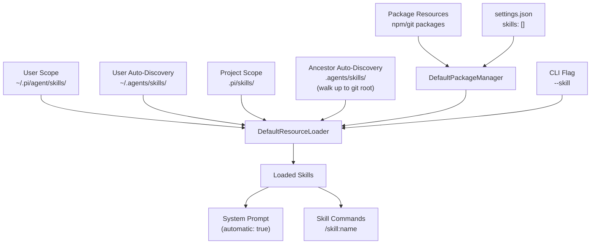
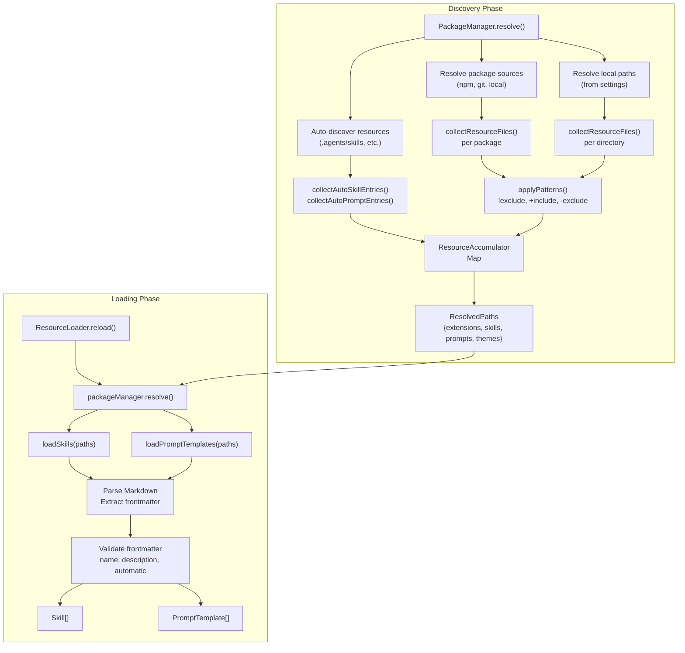
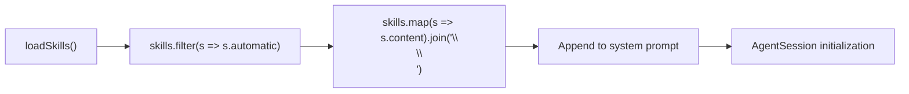
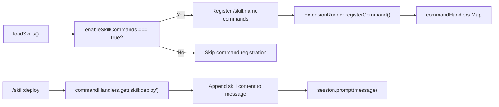
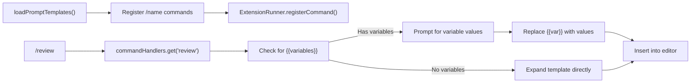
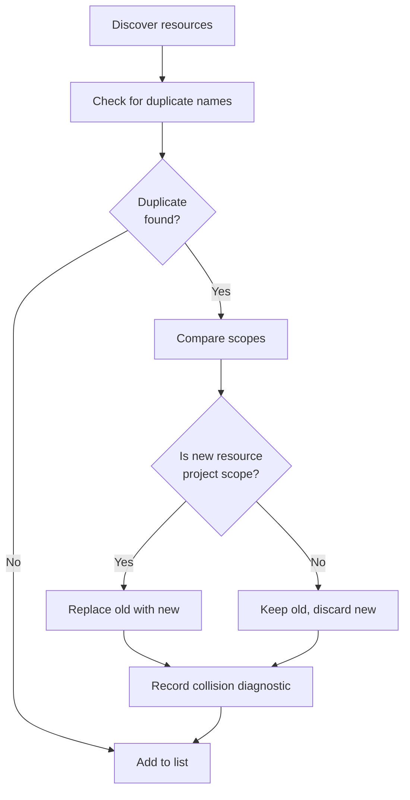

# Skills & Prompt Templates

<details>
<summary>Relevant source files</summary>

The following files were used as context for generating this wiki page:

- [AGENTS.md](AGENTS.md)
- [README.md](README.md)
- [packages/coding-agent/README.md](packages/coding-agent/README.md)
- [packages/coding-agent/docs/packages.md](packages/coding-agent/docs/packages.md)
- [packages/coding-agent/docs/settings.md](packages/coding-agent/docs/settings.md)
- [packages/coding-agent/src/cli/args.ts](packages/coding-agent/src/cli/args.ts)
- [packages/coding-agent/src/core/package-manager.ts](packages/coding-agent/src/core/package-manager.ts)
- [packages/coding-agent/src/core/resource-loader.ts](packages/coding-agent/src/core/resource-loader.ts)
- [packages/coding-agent/src/core/settings-manager.ts](packages/coding-agent/src/core/settings-manager.ts)
- [packages/coding-agent/src/main.ts](packages/coding-agent/src/main.ts)
- [packages/coding-agent/src/modes/interactive/components/settings-selector.ts](packages/coding-agent/src/modes/interactive/components/settings-selector.ts)
- [packages/coding-agent/src/utils/git.ts](packages/coding-agent/src/utils/git.ts)
- [packages/coding-agent/test/git-ssh-url.test.ts](packages/coding-agent/test/git-ssh-url.test.ts)
- [packages/coding-agent/test/git-update.test.ts](packages/coding-agent/test/git-update.test.ts)
- [packages/coding-agent/test/package-manager-ssh.test.ts](packages/coding-agent/test/package-manager-ssh.test.ts)
- [packages/coding-agent/test/package-manager.test.ts](packages/coding-agent/test/package-manager.test.ts)
- [packages/coding-agent/test/resource-loader.test.ts](packages/coding-agent/test/resource-loader.test.ts)

</details>

This page documents the Skills and Prompt Templates systems in pi-coding-agent. Skills are on-demand capability packages following the Agent Skills standard, enabling the agent to perform specialized tasks. Prompt Templates are reusable Markdown prompts with variable substitution.

For information about Extensions (code-based customization), see [4.4](#4.4). For package management, see [4.12](#4.12).

---

## Skills

Skills are Markdown files describing specialized capabilities the agent can use. They follow the [Agent Skills standard](https://agentskills.io), providing structured instructions for specific tasks like web search, transcription, or deployment workflows.

### Agent Skills Standard Format

Skills use Markdown with YAML frontmatter:

```markdown
---
name: my-skill
description: Brief description of what this skill does
automatic: true
---

# Skill Name

Use this skill when the user asks about X or Y.

## Steps

1. First, do this
2. Then, do that
3. Finally, verify the result

## Notes

- Important consideration A
- Important consideration B
```

**Frontmatter fields:**

- `name` (required): Unique identifier for the skill
- `description` (required): Short description shown in skill listings
- `automatic` (optional): If `true`, skill content is automatically included in system prompt. If `false` or omitted, skill is only loaded on-demand via `/skill:name` command.

**Sources:** [packages/coding-agent/src/core/skills.ts:1-200]()

### Discovery Locations



**Discovery order** (later sources win name collisions):

1. User skills: `~/.pi/agent/skills/`
2. User auto-discovery: `~/.agents/skills/` (in home directory)
3. Ancestor auto-discovery: `.agents/skills/` (from cwd up to git root)
4. Project skills: `.pi/skills/`
5. Package skills
6. CLI flags: `--skill <path>`

**Auto-discovery rules:**

- In `~/.pi/agent/skills/` and `.pi/skills/`: All `.md` files in the root are skills, plus recursive `SKILL.md` files
- In `.agents/skills/`: Only `SKILL.md` files (recursive), no root `.md` files
- Git repo boundary: Stops at `.git` directory when walking up ancestors
- Home directory skills are scoped to "user" even when found during ancestor walk

**Sources:** [packages/coding-agent/src/core/package-manager.ts:243-334](), [packages/coding-agent/src/core/resource-loader.ts:240-310]()

### Skill Commands

When `enableSkillCommands` is enabled (default: `true`), each skill is registered as a command:

```
/skill:my-skill
```

This includes the skill's content in the next message to the agent. For automatic skills (`automatic: true`), the content is already in the system prompt, so the command is redundant but harmless.

**Disabling skill commands:**

```json
{
  "enableSkillCommands": false
}
```

**Sources:** [packages/coding-agent/src/core/resource-loader.ts:475-490](), [packages/coding-agent/README.md:286-300]()

### File Structure Examples

**Root-level skill** (in `~/.pi/agent/skills/` or `.pi/skills/`):

```
skills/
  transcribe.md          # Loaded as "transcribe" skill
  deploy.md              # Loaded as "deploy" skill
```

**Directory-based skill** (anywhere):

```
skills/
  browser-tools/
    SKILL.md             # Loaded as "browser-tools" skill
    README.md            # Ignored (not SKILL.md)
    helpers.py           # Ignored
```

**Auto-discovery in `.agents/skills/`** (only `SKILL.md` files):

```
.agents/
  skills/
    deployment/
      SKILL.md           # Loaded as "deployment" skill
      deploy.sh          # Ignored
    README.md            # Ignored (not in a SKILL.md folder)
```

**Sources:** [packages/coding-agent/src/core/package-manager.ts:243-295](), [packages/coding-agent/test/package-manager.test.ts:180-269]()

---

## Prompt Templates

Prompt Templates are reusable Markdown files with optional variable substitution, expanded inline when you type `/templatename`.

### File Format

**Basic template:**

```markdown
---
description: Review code for common issues
---

Review this code for bugs, security issues, and performance problems.
Focus on error handling and edge cases.
```

**Template with variables:**

```markdown
---
description: Review code with custom focus
---

Review this code for bugs, security issues, and performance problems.
Focus on: {{focus}}
```

**Frontmatter fields:**

- `description` (optional): Shown in prompt template listings

When you type `/review`, the content is expanded into the editor. If variables are present (e.g., `{{focus}}`), pi prompts for values before expansion.

**Sources:** [packages/coding-agent/src/core/prompt-templates.ts:1-120](), [packages/coding-agent/README.md:275-284]()

### Discovery Locations

Prompt templates are discovered from:

1. User prompts: `~/.pi/agent/prompts/`
2. Project prompts: `.pi/prompts/`
3. Package prompts
4. CLI flags: `--prompt-template <path>`

All `.md` files in these directories are loaded as templates. The filename (without `.md`) becomes the template name.

**Name collision resolution:** Project scope wins over user scope. Later packages win over earlier packages.

**Sources:** [packages/coding-agent/src/core/resource-loader.ts:320-340]()

### Variable Substitution

Variables use `{{variable}}` syntax. When expanding a template with variables, pi collects values interactively before inserting the content.

**Example interaction:**

```
You: /review
Pi: Value for {{focus}}: memory management
Editor: Review this code for bugs, security issues, and performance problems.
Focus on: memory management
```

**Sources:** [packages/coding-agent/README.md:278-283]()

---

## Resource Discovery Pipeline



**Discovery phase** ([packages/coding-agent/src/core/package-manager.ts:744-796]()):

1. `PackageManager.resolve()` collects paths from:
   - Package sources (after installation)
   - Local settings paths
   - Auto-discovery locations
2. Paths are filtered through pattern matching
3. Results are accumulated with metadata (source, scope, enabled status)

**Loading phase** ([packages/coding-agent/src/core/resource-loader.ts:240-340]()):

1. `ResourceLoader.reload()` calls `packageManager.resolve()`
2. `loadSkills()` and `loadPromptTemplates()` parse Markdown files
3. Frontmatter is validated
4. Name collisions are resolved (project scope wins)

**Sources:** [packages/coding-agent/src/core/package-manager.ts:744-796](), [packages/coding-agent/src/core/resource-loader.ts:240-340](), [packages/coding-agent/src/core/skills.ts:40-150](), [packages/coding-agent/src/core/prompt-templates.ts:30-95]()

---

## Loading Implementation Details

### Skill Loading

```mermaid
graph LR
    Paths["ResolvedResource[]<br/>(skill paths)"] --> LoadSkills["loadSkills(paths)"]

    LoadSkills --> ReadFile["readFileSync(path)"]
    ReadFile --> ParseGrayMatter["gray-matter.parse(content)"]

    ParseGrayMatter --> ExtractMatter["{ data: frontmatter,<br/>content: body }"]

    ExtractMatter --> ValidateName["Validate name<br/>(required)"]
    ValidateName --> ValidateDesc["Validate description<br/>(required)"]
    ValidateDesc --> CheckAutomatic["Check automatic flag<br/>(optional, default: false)"]

    CheckAutomatic --> CreateSkill["Create Skill object<br/>{name, description, content,<br/>automatic, filePath, metadata}"]

    CreateSkill --> DedupeByName["Deduplicate by name<br/>(project scope wins)"]

    DedupeByName --> SkillArray["Skill[]"]
```



**Key types:**

```typescript
interface Skill {
  name: string
  description: string
  content: string
  automatic: boolean
  filePath: string
  metadata: PathMetadata
}
```

**Validation errors:**

- Missing `name` or `description` in frontmatter
- Duplicate names (handled by deduplication, project scope wins)
- Invalid YAML frontmatter

**Sources:** [packages/coding-agent/src/core/skills.ts:1-150]()

### Prompt Template Loading

```mermaid
graph LR
    Paths["ResolvedResource[]<br/>(prompt paths)"] --> LoadPrompts["loadPromptTemplates(paths)"]

    LoadPrompts --> DeriveNames["Derive name from filename<br/>basename(path, '.md')"]
    DeriveNames --> ReadFile["readFileSync(path)"]

    ReadFile --> ParseGrayMatter["gray-matter.parse(content)"]
    ParseGrayMatter --> ExtractMatter["{ data: frontmatter,<br/>content: template }"]

    ExtractMatter --> CreateTemplate["Create PromptTemplate<br/>{name, description,<br/>template, filePath, metadata}"]

    CreateTemplate --> DedupeByName["Deduplicate by name<br/>(project scope wins)"]

    DedupeByName --> PromptArray["PromptTemplate[]"]
```



**Key types:**

```typescript
interface PromptTemplate {
  name: string
  description?: string
  template: string
  filePath: string
  metadata: PathMetadata
}
```

**Template expansion:**

- Variables in template: `{{variableName}}`
- No runtime validation of variable names
- Expansion happens at command invocation time

**Sources:** [packages/coding-agent/src/core/prompt-templates.ts:1-120]()

---

## Package Integration & Filtering

### Package Manifest

Packages declare resources in `package.json`:

```json
{
  "name": "my-package",
  "keywords": ["pi-package"],
  "pi": {
    "skills": ["./skills"],
    "prompts": ["./prompts"]
  }
}
```

**Auto-discovery fallback:** If no `pi` manifest exists, conventional directories are scanned:

- `skills/` for skills
- `prompts/` for prompts

**Sources:** [packages/coding-agent/src/core/package-manager.ts:410-418](), [packages/coding-agent/docs/packages.md:105-156]()

### Pattern Filtering

Settings can filter which resources from a package are loaded:

```json
{
  "packages": [
    {
      "source": "npm:pi-skills",
      "skills": ["brave-search", "transcribe", "!legacy-*"],
      "prompts": ["+prompts/review.md", "-prompts/old.md"]
    }
  ]
}
```

**Pattern types:**

- `pattern`: Include matching paths (glob-style)
- `!pattern`: Exclude matching paths
- `+path`: Force-include exact path (overrides exclusions)
- `-path`: Force-exclude exact path (overrides force-includes)

**Precedence:** Force-exclude > Force-include > Exclude > Include

**Sources:** [packages/coding-agent/src/core/package-manager.ts:594-648](), [packages/coding-agent/docs/packages.md:183-207]()

### Enable/Disable via `pi config`

The `pi config` command provides a TUI for toggling resources:

```bash
pi config
```

This shows all discovered resources with checkboxes. Changes are written to `settings.json` as filter patterns:

- Disabling adds `!pattern` to the resource type array
- Re-enabling removes the exclusion pattern

**Sources:** [packages/coding-agent/src/cli/config-selector.ts:1-400](), [packages/coding-agent/docs/packages.md:208-211]()

---

## Settings Configuration

### Skills Settings

```json
{
  "skills": [
    "skills", // Directory (relative to settings file)
    "/abs/path/to/skill.md", // Absolute path
    "~/custom/skills", // Home-relative path
    "!skills/deprecated-*" // Exclude pattern
  ],
  "enableSkillCommands": true // Register /skill:name commands
}
```

**Scope:**

- Global: `~/.pi/agent/settings.json` (paths relative to `~/.pi/agent/`)
- Project: `.pi/settings.json` (paths relative to `.pi/`)

**Sources:** [packages/coding-agent/src/core/settings-manager.ts:82-86](), [packages/coding-agent/docs/settings.md:149-188]()

### Prompt Template Settings

```json
{
  "prompts": [
    "prompts", // Directory
    "prompts/review.md", // Single file
    "!prompts/experimental/*" // Exclude pattern
  ]
}
```

**Sources:** [packages/coding-agent/src/core/settings-manager.ts:82-86](), [packages/coding-agent/docs/settings.md:149-188]()

### CLI Overrides

**Load additional resources:**

```bash
pi --skill ./custom-skill.md
pi --prompt-template ./custom-prompt.md
```

**Disable auto-discovery:**

```bash
pi --no-skills              # Disable skill discovery
pi --no-prompt-templates    # Disable prompt template discovery
```

**Combine with explicit loads:**

```bash
# Only load specific skill, ignore all others
pi --no-skills --skill ./deploy.md
```

**Sources:** [packages/coding-agent/src/cli/args.ts:131-145](), [packages/coding-agent/README.md:495-508]()

---

## Integration with Agent Session

### Automatic Skills

Skills with `automatic: true` are concatenated into the system prompt:



**Sources:** [packages/coding-agent/src/core/resource-loader.ts:465-475]()

### Skill Commands

Skills with `enableSkillCommands: true` are registered as commands:



**Sources:** [packages/coding-agent/src/core/resource-loader.ts:475-490]()

### Prompt Template Commands

All prompt templates are registered as commands:



**Sources:** [packages/coding-agent/src/core/resource-loader.ts:495-510]()

---

## Diagnostics and Error Handling

### Resource Collisions

When multiple resources have the same name, project scope wins:



**Diagnostic types:**

- `ResourceCollision`: When multiple resources have the same name
- `ResourceError`: When loading fails (invalid frontmatter, file read error)

**Sources:** [packages/coding-agent/src/core/diagnostics.ts:1-50](), [packages/coding-agent/src/core/resource-loader.ts:360-400]()

### Ignore Files

Discovery respects `.gitignore`, `.ignore`, and `.fdignore` files:

```bash
# .gitignore in skills directory
__pycache__/
*.pyc
venv/
experimental/
```

Skills in ignored directories are skipped during discovery.

**Special case:** `.pi/` directory is never affected by parent `.gitignore` files, ensuring project resources are always discovered.

**Sources:** [packages/coding-agent/src/core/package-manager.ts:120-173](), [packages/coding-agent/test/package-manager.test.ts:272-304]()
