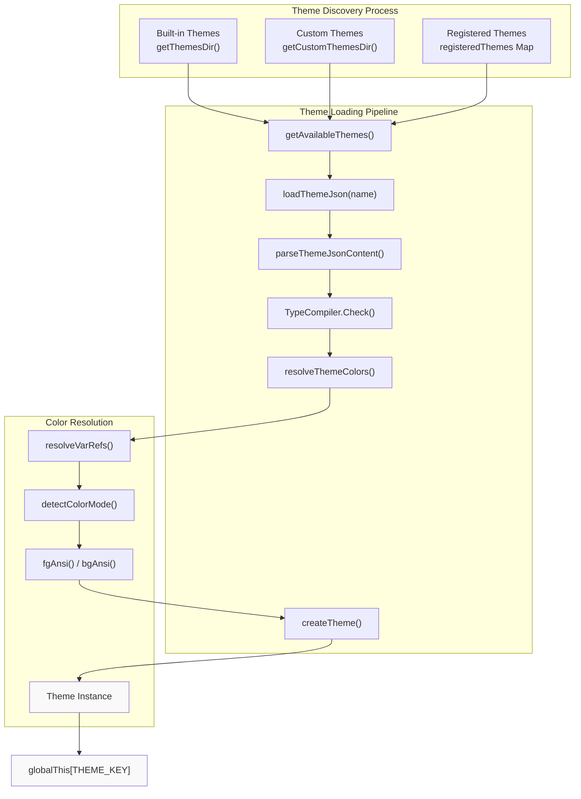
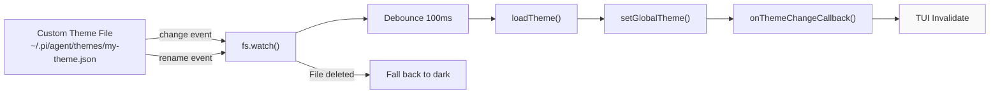

# Theme System

<details>
<summary>Relevant source files</summary>

The following files were used as context for generating this wiki page:

- [packages/coding-agent/docs/packages.md](packages/coding-agent/docs/packages.md)
- [packages/coding-agent/docs/settings.md](packages/coding-agent/docs/settings.md)
- [packages/coding-agent/src/core/package-manager.ts](packages/coding-agent/src/core/package-manager.ts)
- [packages/coding-agent/src/core/resource-loader.ts](packages/coding-agent/src/core/resource-loader.ts)
- [packages/coding-agent/src/core/settings-manager.ts](packages/coding-agent/src/core/settings-manager.ts)
- [packages/coding-agent/src/modes/interactive/components/settings-selector.ts](packages/coding-agent/src/modes/interactive/components/settings-selector.ts)
- [packages/coding-agent/src/utils/git.ts](packages/coding-agent/src/utils/git.ts)
- [packages/coding-agent/test/git-ssh-url.test.ts](packages/coding-agent/test/git-ssh-url.test.ts)
- [packages/coding-agent/test/git-update.test.ts](packages/coding-agent/test/git-update.test.ts)
- [packages/coding-agent/test/package-manager-ssh.test.ts](packages/coding-agent/test/package-manager-ssh.test.ts)
- [packages/coding-agent/test/package-manager.test.ts](packages/coding-agent/test/package-manager.test.ts)
- [packages/coding-agent/test/resource-loader.test.ts](packages/coding-agent/test/resource-loader.test.ts)

</details>

The theme system provides comprehensive color customization for the pi-coding-agent TUI. It defines 51 color tokens that control all visual elements including UI borders, markdown rendering, syntax highlighting, tool output, and thinking level indicators. Themes are JSON files with support for variable references, terminal capability detection, and hot-reloading for live editing.

For TUI rendering architecture, see [Interactive Mode & TUI Integration](#4.10). For settings management, see [Settings Management](#4.6).

---

## Theme File Format

Themes are defined as JSON files conforming to a TypeBox-validated schema. Each theme must specify all 51 required color tokens.

**Structure:**

```json
{
  "$schema": "https://raw.githubusercontent.com/badlogic/pi-mono/main/packages/coding-agent/src/modes/interactive/theme/theme-schema.json",
  "name": "my-theme",
  "vars": {
    "primary": "#00aaff",
    "secondary": 242
  },
  "colors": {
    "accent": "primary",
    "border": "primary",
    "text": "",
    ...
  },
  "export": {
    "pageBg": "#18181e",
    "cardBg": "#1e1e24",
    "infoBg": "#3c3728"
  }
}
```

### Color Value Formats

Four value types are supported:

| Format    | Example     | Usage                       |
| --------- | ----------- | --------------------------- |
| Hex       | `"#ff0000"` | 24-bit RGB color            |
| 256-color | `39`        | xterm palette index (0-255) |
| Variable  | `"primary"` | Reference to `vars` entry   |
| Default   | `""`        | Terminal default color      |

Sources: [packages/coding-agent/src/modes/interactive/theme/theme.ts:14-19](), [packages/coding-agent/src/modes/interactive/theme/theme.ts:252-334]()

### Required Color Tokens

All 51 tokens must be defined:

| Category              | Count | Tokens                                                                                                                                                                                     |
| --------------------- | ----- | ------------------------------------------------------------------------------------------------------------------------------------------------------------------------------------------ |
| Core UI               | 11    | `accent`, `border`, `borderAccent`, `borderMuted`, `success`, `error`, `warning`, `muted`, `dim`, `text`, `thinkingText`                                                                   |
| Backgrounds & Content | 11    | `selectedBg`, `userMessageBg`, `userMessageText`, `customMessageBg`, `customMessageText`, `customMessageLabel`, `toolPendingBg`, `toolSuccessBg`, `toolErrorBg`, `toolTitle`, `toolOutput` |
| Markdown              | 10    | `mdHeading`, `mdLink`, `mdLinkUrl`, `mdCode`, `mdCodeBlock`, `mdCodeBlockBorder`, `mdQuote`, `mdQuoteBorder`, `mdHr`, `mdListBullet`                                                       |
| Tool Diffs            | 3     | `toolDiffAdded`, `toolDiffRemoved`, `toolDiffContext`                                                                                                                                      |
| Syntax                | 9     | `syntaxComment`, `syntaxKeyword`, `syntaxFunction`, `syntaxVariable`, `syntaxString`, `syntaxNumber`, `syntaxType`, `syntaxOperator`, `syntaxPunctuation`                                  |
| Thinking Levels       | 6     | `thinkingOff`, `thinkingMinimal`, `thinkingLow`, `thinkingMedium`, `thinkingHigh`, `thinkingXhigh`                                                                                         |
| Bash Mode             | 1     | `bashMode`                                                                                                                                                                                 |

Sources: [packages/coding-agent/src/modes/interactive/theme/theme.ts:21-92](), [packages/coding-agent/src/modes/interactive/theme/theme-schema.json:37-89]()

### Variable References

The `vars` object allows reusable color definitions. Variables are resolved recursively with circular reference detection:

```typescript
resolveVarRefs(value: ColorValue, vars: Record<string, ColorValue>, visited = new Set<string>()): string | number
```

Example:

```json
{
  "vars": {
    "base": "#5f8787",
    "accent": "base"
  },
  "colors": {
    "border": "accent"
  }
}
```

Sources: [packages/coding-agent/src/modes/interactive/theme/theme.ts:308-324](), [packages/coding-agent/src/modes/interactive/theme/theme.ts:326-335]()

---

## Theme Discovery and Loading



**Theme Discovery Locations**

Themes are discovered from multiple sources in priority order:

1. Built-in: `dark.json`, `light.json` in `packages/coding-agent/themes/`
2. Global custom: `~/.pi/agent/themes/*.json`
3. Project custom: `.pi/themes/*.json`
4. Package manifests: `themes/` directories or `pi.themes` entries
5. Registered themes: In-memory `Theme` instances via `setRegisteredThemes()`

Discovery is implemented in:

- `getAvailableThemes()` - Returns list of theme names
- `getAvailableThemesWithPaths()` - Returns `ThemeInfo[]` with paths

Sources: [packages/coding-agent/src/modes/interactive/theme/theme.ts:459-510](), [packages/coding-agent/src/config.ts]()

**Loading Pipeline**

```mermaid
sequenceDiagram
    participant CLI as CLI/Settings
    participant Init as initTheme()
    participant Load as loadTheme()
    participant Parse as parseThemeJson()
    participant Resolve as resolveThemeColors()
    participant Create as createTheme()
    participant Global as globalThis

    CLI->>Init: themeName
    Init->>Load: name

    alt Registered Theme
        Load->>Global: Return cached instance
    else File-Based Theme
        Load->>Parse: Read & validate JSON
        Parse->>Parse: TypeCompiler.Check()
        Parse-->>Load: ThemeJson
        Load->>Resolve: colors + vars
        Resolve->>Resolve: resolveVarRefs()
        Resolve-->>Load: Resolved colors
        Load->>Create: fgColors, bgColors, mode
        Create->>Create: Convert to ANSI sequences
        Create-->>Load: Theme instance
    end

    Load-->>Init: Theme
    Init->>Global: Set THEME_KEY

    alt Enable Watcher
        Init->>Init: startThemeWatcher()
    end
```

Sources: [packages/coding-agent/src/modes/interactive/theme/theme.ts:545-616](), [packages/coding-agent/src/modes/interactive/theme/theme.ts:680-694]()

---

## Terminal Capability Detection

The system detects terminal color support and automatically converts colors to the appropriate format.

### Color Mode Detection

```mermaid
graph TB
    Start["detectColorMode()"]

    CheckColorterm{"COLORTERM env?"}
    CheckWT{"WT_SESSION env?"}
    CheckTerm{"TERM value?"}
    CheckApple{"TERM_PROGRAM?"}
    CheckScreen{"TERM starts with<br/>'screen'?"}

    Truecolor["Return 'truecolor'"]
    Color256["Return '256color'"]

    Start --> CheckColorterm
    CheckColorterm -->|"truecolor" or "24bit"| Truecolor
    CheckColorterm -->|No| CheckWT

    CheckWT -->|Windows Terminal| Truecolor
    CheckWT -->|No| CheckTerm

    CheckTerm -->|"dumb", "", "linux"| Color256
    CheckTerm -->|Other| CheckApple

    CheckApple -->|Apple_Terminal| Color256
    CheckApple -->|No| CheckScreen

    CheckScreen -->|Yes| Color256
    CheckScreen -->|No| Truecolor

    style Truecolor fill:#f9f9f9
    style Color256 fill:#f9f9f9
```

**Detection Logic:**

1. Check `COLORTERM` for explicit truecolor/24bit
2. Check `WT_SESSION` for Windows Terminal
3. Check `TERM` for limited terminals (dumb, linux)
4. Check `TERM_PROGRAM` for Apple Terminal (256-color only)
5. Check for GNU screen (256-color only)
6. Default to truecolor for modern terminals

Sources: [packages/coding-agent/src/modes/interactive/theme/theme.ts:159-184]()

### Color Conversion

**Hex to RGB Truecolor:**

```
"\x1b[38;2;R;G;Bm" for foreground
"\x1b[48;2;R;G;Bm" for background
```

**Hex to 256-Color:**
Uses nearest color approximation with weighted Euclidean distance:

- Color cube: Indices 16-231 (6×6×6 RGB)
- Grayscale: Indices 232-255 (24 shades)

Algorithm:

1. Find closest cube color using `findClosestCubeIndex()` for R, G, B
2. Find closest gray using `findClosestGrayIndex()`
3. Compare distances with weighted formula: `dr²×0.299 + dg²×0.587 + db²×0.114`
4. Prefer cube if color has saturation (spread ≥ 10)

Sources: [packages/coding-agent/src/modes/interactive/theme/theme.ts:186-306]()

### Background Detection

```typescript
function detectTerminalBackground(): 'dark' | 'light' {
  const colorfgbg = process.env.COLORFGBG || ''
  if (colorfgbg) {
    const bg = parseInt(colorfgbg.split(';')[1], 10)
    return bg < 8 ? 'dark' : 'light'
  }
  return 'dark'
}
```

Used for default theme selection on first run.

Sources: [packages/coding-agent/src/modes/interactive/theme/theme.ts:626-643]()

---

## Theme Class and API

### Theme Class

The `Theme` class provides the primary interface for color application:

```typescript
class Theme {
  readonly name?: string
  readonly sourcePath?: string
  private fgColors: Map<ThemeColor, string>
  private bgColors: Map<ThemeBg, string>
  private mode: ColorMode

  // Color application methods
  fg(color: ThemeColor, text: string): string
  bg(color: ThemeBg, text: string): string

  // Text styling
  bold(text: string): string
  italic(text: string): string
  underline(text: string): string
  inverse(text: string): string
  strikethrough(text: string): string

  // ANSI code retrieval
  getFgAnsi(color: ThemeColor): string
  getBgAnsi(color: ThemeBg): string
  getColorMode(): ColorMode

  // Special color getters
  getThinkingBorderColor(
    level: 'off' | 'minimal' | 'low' | 'medium' | 'high' | 'xhigh'
  ): (str: string) => string
  getBashModeBorderColor(): (str: string) => string
}
```

Sources: [packages/coding-agent/src/modes/interactive/theme/theme.ts:341-438]()

### Global Theme Instance

The theme is exposed as a global singleton using a Proxy for cross-module consistency:

```typescript
const THEME_KEY = Symbol.for('@mariozechner/pi-coding-agent:theme')

export const theme: Theme = new Proxy({} as Theme, {
  get(_target, prop) {
    const t = (globalThis as Record<symbol, Theme>)[THEME_KEY]
    if (!t) throw new Error('Theme not initialized. Call initTheme() first.')
    return (t as unknown as Record<string | symbol, unknown>)[prop]
  },
})
```

This ensures `tsx` and `jiti` module loaders see the same instance in development mode.

Sources: [packages/coding-agent/src/modes/interactive/theme/theme.ts:649-664]()

### Theme Management API

**Initialization:**

```typescript
initTheme(themeName?: string, enableWatcher: boolean = false): void
```

- Loads theme by name or detects default
- Falls back to "dark" on error
- Optionally enables file watcher

**Runtime Changes:**

```typescript
setTheme(name: string, enableWatcher: boolean = false): { success: boolean; error?: string }
```

- Loads new theme and updates global instance
- Triggers `onThemeChange` callback
- Returns error message if validation fails

**Direct Instance:**

```typescript
setThemeInstance(themeInstance: Theme): void
```

- Sets a programmatically created theme
- Disables file watching
- Used by extensions for custom themes

**Change Notification:**

```typescript
onThemeChange(callback: () => void): void
```

- Registers callback for theme reload events
- Used by TUI to invalidate and re-render

Sources: [packages/coding-agent/src/modes/interactive/theme/theme.ts:680-730]()

---

## Hot-Reloading

Custom themes support live reloading during editing:



**Watcher Lifecycle:**

1. `startThemeWatcher()` creates `fs.FSWatcher` for current theme file
2. Only watches custom themes (not built-in "dark"/"light")
3. "change" event triggers reload with 100ms debounce
4. "rename" event detects deletion and falls back to "dark"
5. `stopThemeWatcher()` called when switching themes

**Error Handling:**

Errors during hot-reload are silently ignored (file may be in invalid state during editing). Next change event will retry.

Sources: [packages/coding-agent/src/modes/interactive/theme/theme.ts:732-795]()

---

## TUI Integration

The theme system provides theme adapters for pi-tui components:

### MarkdownTheme Integration

```typescript
export function getMarkdownTheme(): MarkdownTheme {
  return {
    heading: (text: string) => theme.fg("mdHeading", text),
    link: (text: string) => theme.fg("mdLink", text),
    linkUrl: (text: string) => theme.fg("mdLinkUrl", text),
    code: (text: string) => theme.fg("mdCode", text),
    codeBlock: (text: string) => theme.fg("mdCodeBlock", text),
    codeBlockBorder: (text: string) => theme.fg("mdCodeBlockBorder", text),
    quote: (text: string) => theme.fg("mdQuote", text),
    quoteBorder: (text: string) => theme.fg("mdQuoteBorder", text),
    hr: (text: string) => theme.fg("mdHr", text),
    listBullet: (text: string) => theme.fg("mdListBullet", text),
    bold: (text: string) => theme.bold(text),
    italic: (text: string) => theme.italic(text),
    underline: (text: string) => theme.underline(text),
    strikethrough: (text: string) => chalk.strikethrough(text),
    highlightCode: (code: string, lang?: string): string[]
  };
}
```

Used by `Markdown` component in TUI for rendering markdown messages.

Sources: [packages/coding-agent/src/modes/interactive/theme/theme.ts:1047-1078]()

### EditorTheme Integration

```typescript
export function getEditorTheme(): EditorTheme {
  return {
    borderColor: (text: string) => theme.fg('borderMuted', text),
    selectList: getSelectListTheme(),
  }
}

export function getSelectListTheme(): SelectListTheme {
  return {
    selectedPrefix: (text: string) => theme.fg('accent', text),
    selectedText: (text: string) => theme.fg('accent', text),
    description: (text: string) => theme.fg('muted', text),
    scrollInfo: (text: string) => theme.fg('muted', text),
    noMatch: (text: string) => theme.fg('muted', text),
  }
}
```

Used by `Editor` and `SelectList` components for command palette and autocomplete.

Sources: [packages/coding-agent/src/modes/interactive/theme/theme.ts:1080-1095]()

### SettingsListTheme Integration

```typescript
export function getSettingsListTheme(): SettingsListTheme {
  return {
    label: (text: string, selected: boolean) =>
      selected ? theme.fg('accent', text) : text,
    value: (text: string, selected: boolean) =>
      selected ? theme.fg('accent', text) : theme.fg('muted', text),
    description: (text: string) => theme.fg('dim', text),
    cursor: theme.fg('accent', '→ '),
    hint: (text: string) => theme.fg('dim', text),
  }
}
```

Used by `/settings` command UI.

Sources: [packages/coding-agent/src/modes/interactive/theme/theme.ts:1097-1105]()

---

## Syntax Highlighting

The theme system integrates with `cli-highlight` for code syntax highlighting:

```typescript
function buildCliHighlightTheme(t: Theme): CliHighlightTheme {
  return {
    keyword: (s: string) => t.fg('syntaxKeyword', s),
    built_in: (s: string) => t.fg('syntaxType', s),
    literal: (s: string) => t.fg('syntaxNumber', s),
    number: (s: string) => t.fg('syntaxNumber', s),
    string: (s: string) => t.fg('syntaxString', s),
    comment: (s: string) => t.fg('syntaxComment', s),
    function: (s: string) => t.fg('syntaxFunction', s),
    title: (s: string) => t.fg('syntaxFunction', s),
    class: (s: string) => t.fg('syntaxType', s),
    type: (s: string) => t.fg('syntaxType', s),
    attr: (s: string) => t.fg('syntaxVariable', s),
    variable: (s: string) => t.fg('syntaxVariable', s),
    params: (s: string) => t.fg('syntaxVariable', s),
    operator: (s: string) => t.fg('syntaxOperator', s),
    punctuation: (s: string) => t.fg('syntaxPunctuation', s),
  }
}
```

**Language Detection:**

`getLanguageFromPath()` maps file extensions to highlight.js language identifiers:

```typescript
const extToLang: Record<string, string> = {
  ts: 'typescript',
  tsx: 'typescript',
  js: 'javascript',
  py: 'python',
  rs: 'rust',
  // ... 40+ languages
}
```

**Usage:**

```typescript
export function highlightCode(code: string, lang?: string): string[] {
  const validLang = lang && supportsLanguage(lang) ? lang : undefined
  const opts = {
    language: validLang,
    ignoreIllegals: true,
    theme: getCliHighlightTheme(theme),
  }
  return highlight(code, opts).split(
    '\
'
  )
}
```

Used by markdown code blocks and tool output rendering.

Sources: [packages/coding-agent/src/modes/interactive/theme/theme.ts:924-1045]()

---

## HTML Export

Themes provide colors for HTML export via `/export` command:

### Export Color Resolution

```typescript
export function getResolvedThemeColors(
  themeName?: string
): Record<string, string> {
  const themeJson = loadThemeJson(name)
  const resolved = resolveThemeColors(themeJson.colors, themeJson.vars)

  const cssColors: Record<string, string> = {}
  for (const [key, value] of Object.entries(resolved)) {
    if (typeof value === 'number') {
      cssColors[key] = ansi256ToHex(value) // Convert 256-color to hex
    } else if (value === '') {
      cssColors[key] = defaultText // Use default for empty
    } else {
      cssColors[key] = value // Already hex
    }
  }
  return cssColors
}
```

Converts all color values to CSS-compatible hex strings.

Sources: [packages/coding-agent/src/modes/interactive/theme/theme.ts:851-872]()

### Optional Export Section

Themes can specify custom colors for HTML export:

```json
{
  "export": {
    "pageBg": "#18181e",
    "cardBg": "#1e1e24",
    "infoBg": "#3c3728"
  }
}
```

If omitted, colors are derived from `userMessageBg`:

```typescript
export function getThemeExportColors(themeName?: string): {
  pageBg?: string
  cardBg?: string
  infoBg?: string
}
```

Sources: [packages/coding-agent/src/modes/interactive/theme/theme.ts:886-918](), [packages/coding-agent/src/modes/interactive/theme/theme-schema.json:298-316]()

### 256-Color to Hex Conversion

```typescript
function ansi256ToHex(index: number): string {
  if (index < 16) return basicColors[index] // Basic ANSI
  if (index < 232) {
    // Color cube 6x6x6
    const cubeIndex = index - 16
    const r = Math.floor(cubeIndex / 36)
    const g = Math.floor((cubeIndex % 36) / 6)
    const b = cubeIndex % 6
    const toHex = (n: number) =>
      (n === 0 ? 0 : 55 + n * 40).toString(16).padStart(2, '0')
    return `#${toHex(r)}${toHex(g)}${toHex(b)}`
  }
  // Grayscale ramp
  const gray = 8 + (index - 232) * 10
  const grayHex = gray.toString(16).padStart(2, '0')
  return `#${grayHex}${grayHex}${grayHex}`
}
```

Sources: [packages/coding-agent/src/modes/interactive/theme/theme.ts:807-845]()
