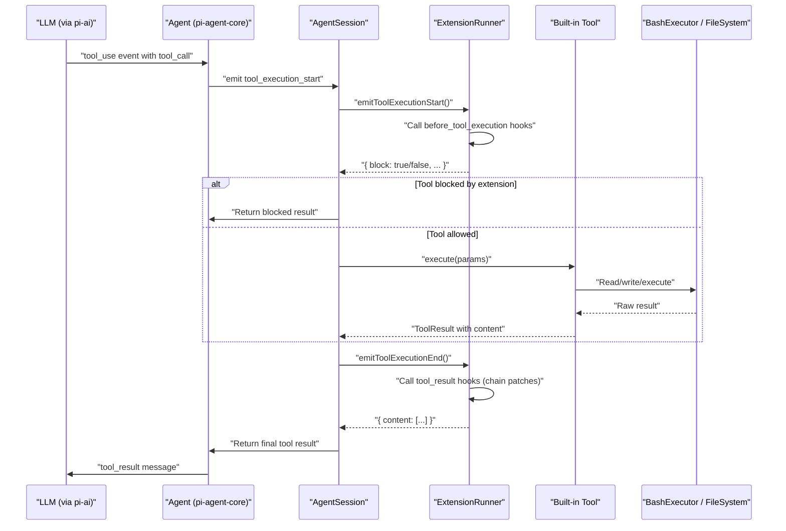
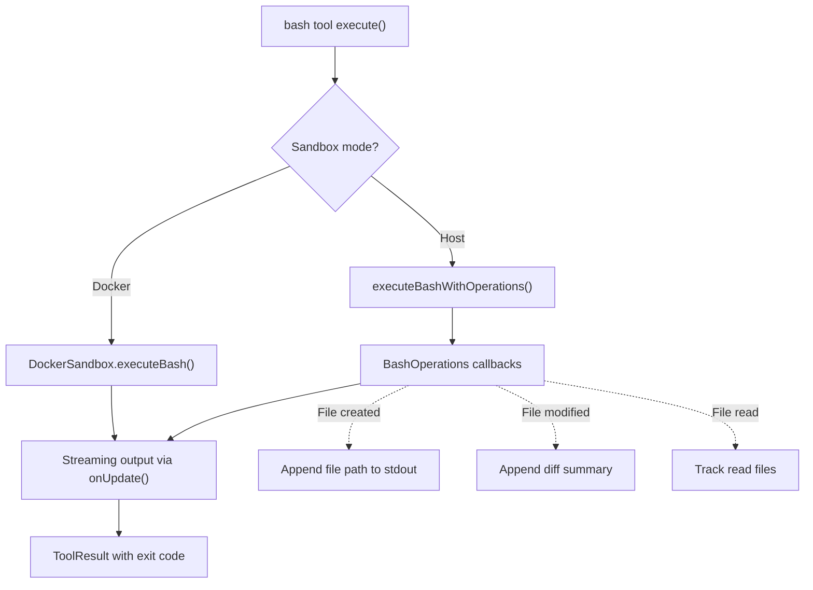
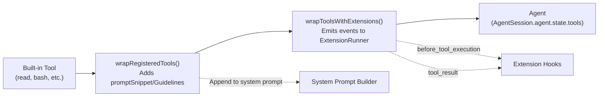

# Tool Execution & Built-in Tools

<details>
<summary>Relevant source files</summary>

The following files were used as context for generating this wiki page:

- [AGENTS.md](AGENTS.md)
- [README.md](README.md)
- [packages/coding-agent/README.md](packages/coding-agent/README.md)
- [packages/coding-agent/src/cli/args.ts](packages/coding-agent/src/cli/args.ts)
- [packages/coding-agent/src/core/agent-session.ts](packages/coding-agent/src/core/agent-session.ts)
- [packages/coding-agent/src/core/sdk.ts](packages/coding-agent/src/core/sdk.ts)
- [packages/coding-agent/src/main.ts](packages/coding-agent/src/main.ts)
- [packages/coding-agent/src/modes/interactive/interactive-mode.ts](packages/coding-agent/src/modes/interactive/interactive-mode.ts)
- [packages/coding-agent/src/modes/print-mode.ts](packages/coding-agent/src/modes/print-mode.ts)
- [packages/coding-agent/src/modes/rpc/rpc-mode.ts](packages/coding-agent/src/modes/rpc/rpc-mode.ts)

</details>

This document describes the built-in tools available in pi-coding-agent, the tool execution pipeline from LLM request to result delivery, and how extensions can intercept and modify tool behavior. For information about registering custom tools via extensions, see [Custom Tools](#4.4.2). For tool rendering in the interactive UI, see [Interactive Mode & TUI Integration](#4.10).

---

## Built-in Tools Overview

The coding agent provides seven built-in tools that give the LLM file system access, code editing, command execution, and information retrieval capabilities. Each tool is implemented as an `AgentTool` with JSON Schema parameter definitions, execution logic, and optional custom rendering.

| Tool Name    | Purpose                                                         | Key Parameters                              | Sandbox Mode |
| ------------ | --------------------------------------------------------------- | ------------------------------------------- | ------------ |
| `read`       | Read file contents with optional line range and grep filtering  | `path`, `start_line`, `end_line`, `pattern` | Both         |
| `bash`       | Execute shell commands with full terminal environment           | `command`, `no_context`, `background`       | Both         |
| `edit`       | Apply block-based edits to files with conflict detection        | `path`, `old_str`, `new_str`                | Host only    |
| `write`      | Write or create files with optional preview mode                | `path`, `content`, `preview`                | Host only    |
| `attach`     | Attach files or directories to message context (Slack bot only) | `paths`                                     | Both         |
| `grep`       | Recursive grep search with context lines                        | `pattern`, `path`, `include`, `exclude`     | Both         |
| `find`       | Find files by pattern with configurable depth                   | `pattern`, `path`, `type`, `max_depth`      | Both         |
| `ls`         | List directory contents                                         | `path`, `all`                               | Both         |
| `web_search` | Perplexity API web search (requires API key)                    | `query`                                     | N/A          |

**Tool Activation:** By default, only `read`, `bash`, `edit`, and `write` are active in new sessions. The others must be explicitly enabled via settings or extensions. Tools can be enabled/disabled at runtime through the `AgentSession.setActiveTools()` method.

**Sources:** [packages/coding-agent/src/core/tools/index.ts:1-100](), [packages/coding-agent/src/core/sdk.ts:36-122]()

---

## Tool Execution Pipeline



**Tool Execution Lifecycle:**

1. **Tool Call Reception:** The LLM emits a `tool_use` event with `toolCallId`, `name`, and `input` parameters. The Agent validates tool availability and parameter schema.

2. **Extension Pre-Execution:** `AgentSession` emits `tool_execution_start` event to the `ExtensionRunner`, which calls all registered `before_tool_execution` handlers. Extensions can:
   - Block execution by returning `{ block: true }`
   - Modify parameters by returning `{ input: { ... } }`
   - Add custom status messages

3. **Tool Execution:** If not blocked, `AgentSession` invokes the tool's `execute()` method with validated parameters. The tool performs its operation (file I/O, shell command, etc.) and returns a `ToolResult` with content blocks.

4. **Extension Post-Execution:** `AgentSession` emits `tool_execution_end` event. Extensions can modify the result content by returning patched content arrays. Multiple extension handlers chain their modifications sequentially.

5. **Result Delivery:** The final tool result (after extension patches) is returned to the Agent, which converts it to an LLM `toolResult` message and continues the conversation.

**Abort Handling:** Tools that support background operations (bash with `background: true`) respect the `AbortSignal` passed to `execute()`. When the user aborts, the signal triggers and long-running operations are terminated.

**Sources:** [packages/coding-agent/src/core/agent-session.ts:1-300](), [packages/coding-agent/src/core/extensions/extension-runner.ts:1-200](), [packages/agent/src/agent.ts:1-100]()

---

## Built-in Tool Implementations

### Read Tool

The `read` tool provides file content access with optional filtering and line range selection. It supports both text and binary files, with automatic binary detection via file extension.

**Key Features:**

- Line range extraction (`start_line`, `end_line`)
- Grep pattern filtering with context lines
- Automatic binary file detection (returns file path only for binary)
- Result truncation at 2000 lines OR 50KB with actionable notice

**Implementation:** The tool uses `fs.readFileSync()` for file access and applies line range filtering before grep matching to optimize performance. When truncated, it includes a notice suggesting more specific line ranges or grep patterns.

**Sources:** [packages/coding-agent/src/core/tools/read.ts:1-250]()

---

### Bash Tool

The `bash` tool executes shell commands in an isolated working directory with full terminal environment support. It's the most complex built-in tool, supporting background execution, real-time output streaming, and context-aware operation.



**Execution Modes:**

- **Foreground (default):** Command runs to completion, output is captured, result includes stdout/stderr and exit code.
- **Background (`background: true`):** Command is spawned with `nohup` and detached. Result confirms spawn success; actual execution continues asynchronously.
- **No-Context (`no_context: true`):** Skips file operation tracking (useful for read-only inspection commands).

**Operation Tracking:** When not in no-context mode, the bash executor intercepts file system operations and appends structured notices to the command output. This helps the LLM understand side effects:

- **File creation:** Appends full file path to stdout
- **File modification:** Appends diff summary showing changes
- **File reading:** Tracks in working memory (displayed at end)

**Output Truncation:** Bash output is truncated at 2000 lines OR 50KB (same as read tool). When truncated, the tool suggests using file redirection or piping to `head`/`tail` for more control.

**Working Directory:** Bash commands execute in a session-specific scratch directory (`cwd/.pi/sessions/<id>/scratch` for host mode, `/workspace/scratch` for Docker mode). This prevents accidental modification of project files unless the user explicitly uses relative paths like `../../src/file.ts`.

**Sources:** [packages/coding-agent/src/core/tools/bash.ts:1-350](), [packages/coding-agent/src/core/bash-executor.ts:1-500]()

---

### Edit Tool

The `edit` tool performs surgical file modifications using a search-and-replace pattern. It's designed for precision edits to existing files, with conflict detection to prevent accidental overwrites.

**Search-Replace Algorithm:**

1. Read current file contents
2. Validate that `old_str` appears exactly once (no duplicates, no missing)
3. Replace `old_str` with `new_str`
4. Write modified contents back to file
5. Return diff summary showing before/after context

**Conflict Detection:** If `old_str` doesn't match exactly (e.g., file was modified since the LLM's last read), the tool returns an error with the current file contents. The LLM must re-read and provide a corrected `old_str`.

**Limitations:** Edit tool only works in **host mode** (not Docker sandbox). This is because Docker containers have isolated file systems, and edits need to persist to the actual project directory.

**Sources:** [packages/coding-agent/src/core/tools/edit.ts:1-200]()

---

### Write Tool

The `write` tool creates new files or overwrites existing files. It supports a preview mode that shows the content without committing changes.

**Preview Mode:** When `preview: true`, the tool validates the write path and displays the content that would be written, but doesn't actually modify the file system. This allows the LLM to show the user what will be created before committing.

**Safety Checks:**

- Rejects writes to paths outside the working directory (prevents path traversal)
- Creates parent directories automatically if missing
- Overwrites existing files without prompting (LLM is responsible for checking existence first)

**Limitations:** Like the edit tool, write only works in **host mode**.

**Sources:** [packages/coding-agent/src/core/tools/write.ts:1-150]()

---

### Grep, Find, and Ls Tools

These tools provide file system search and inspection capabilities, implemented as wrappers around `rg` (ripgrep), `fd`, and standard file system operations.

**Grep Tool:** Uses `rg` (ripgrep) for high-performance recursive search. Supports:

- Include/exclude patterns (`--glob`)
- Context lines before/after matches (`-C`)
- Line number display
- Binary file skipping

**Find Tool:** Uses `fd` for fast file discovery. Supports:

- Glob pattern matching
- File type filtering (`f` for files, `d` for directories)
- Max depth control
- Hidden file inclusion

**Ls Tool:** Uses `fs.readdir()` with optional `--all` flag to include hidden files. Returns file names with type indicators (`/` for directories).

All three tools respect result size limits and include truncation notices when output exceeds thresholds.

**Sources:** [packages/coding-agent/src/core/tools/grep.ts:1-150](), [packages/coding-agent/src/core/tools/find.ts:1-150](), [packages/coding-agent/src/core/tools/ls.ts:1-100]()

---

## Sandbox Integration

The coding agent supports two execution modes for tools: **host mode** (direct file system access) and **Docker mode** (isolated container execution). Sandbox mode is configured in settings and affects how bash and file operations are executed.

### Host Mode

In host mode, tools execute directly on the host file system. The working directory is `cwd/.pi/sessions/<id>/scratch`, and all file paths are resolved relative to this location. Extensions and LLM can access project files using relative paths like `../../src/file.ts`.

**Advantages:**

- Fast execution (no container overhead)
- Full file system access
- Edit and write tools work
- Native tool availability (no need to install in container)

**Disadvantages:**

- No process isolation (runaway commands can affect host)
- Potential security risk if running untrusted code

### Docker Mode

In Docker mode, bash commands execute inside an isolated container. The workspace directory is mounted at `/workspace`, and the scratch directory is `/workspace/scratch`. File system operations use Docker volume mounts.

**Advantages:**

- Process isolation (runaway commands contained)
- Network isolation (optional)
- Reproducible environment

**Disadvantages:**

- Slower execution (container startup overhead)
- Edit and write tools disabled (would edit isolated FS)
- Must install tools in container image

**Mode Selection:** Sandbox mode is controlled by the `sandboxMode` setting. Extensions can query the current mode via `AgentSession.getSandboxMode()` but cannot change it mid-session.

**Sources:** [packages/coding-agent/src/core/bash-executor.ts:200-400](), [packages/coding-agent/docs/settings.md:1-100]()

---

## Tool Wrapping and Extension Hooks

Tools are wrapped twice before execution to enable extension interception:



### First Layer: `wrapRegisteredTools()`

This wrapper adds extension-defined prompt customization to the tool definitions:

- **`promptSnippet`**: One-line summary appended to the "Available tools" section of the system prompt
- **`promptGuidelines`**: Bulleted guidelines appended to the "Guidelines" section of the system prompt

Extensions can register tools with these fields to influence how the LLM perceives tool availability without modifying the base system prompt template.

**Sources:** [packages/coding-agent/src/core/extensions/tool-wrapper.ts:1-100]()

### Second Layer: `wrapToolsWithExtensions()`

This wrapper intercepts tool execution to emit extension events:

**Before Execution (`before_tool_execution`):**

- Emitted before tool's `execute()` method is called
- Extensions can block execution by returning `{ block: true }`
- Extensions can modify parameters by returning `{ input: { ... } }`
- Multiple handlers are called in registration order; first blocker wins

**After Execution (`tool_result`):**

- Emitted after tool's `execute()` method completes
- Extensions can patch the result content by returning `{ content: [...] }`
- Multiple handlers chain their modifications: `handler1` output → `handler2` input → `handler3` input
- Final patched content is returned to the Agent

**Example Use Cases:**

- Logging tool calls to external services
- Injecting custom tool result metadata
- Blocking dangerous operations (e.g., `rm -rf`)
- Translating tool results to different formats

**Sources:** [packages/coding-agent/src/core/extensions/tool-wrapper.ts:100-200](), [packages/coding-agent/src/core/extensions/extension-runner.ts:300-400]()

---

## Tool Result Truncation

Large tool outputs are truncated to prevent context window exhaustion and improve LLM focus. The truncation logic is consistent across read and bash tools:

**Truncation Thresholds:**

- **Line count:** 2000 lines maximum
- **Byte size:** 50KB maximum (51,200 bytes)

**Truncation Notice Format:**

```
<truncated>
Output truncated. Showing first 2000 lines (50 KB).
For bash commands, redirect output to a file or pipe through head/tail.
For file reading, use start_line/end_line parameters or pattern filtering.
</truncated>
```

The notice is actionable: it tells the LLM exactly how to avoid truncation on the next attempt. This prevents infinite retry loops where the LLM repeatedly fetches the same large output.

**Truncation Logic:** Both tools use the same `truncate()` function from the truncation module, which performs a single-pass scan to find the truncation point. Lines are split on `\
` boundaries; partial lines at the boundary are excluded to prevent mid-line cuts.

**Sources:** [packages/coding-agent/src/core/tools/truncate.ts:1-100](), [packages/coding-agent/src/core/tools/bash.ts:200-250](), [packages/coding-agent/src/core/tools/read.ts:150-200]()

---

## Tool Definition Schema

Every tool implements the `AgentTool` interface from `@mariozechner/pi-agent-core`:

```typescript
interface AgentTool {
  name: string
  description: string
  parameters: TSchema // TypeBox schema
  execute: (
    params: Static<TSchema>,
    options: {
      onUpdate?: (update: ToolResultUpdate) => void
      signal?: AbortSignal
    }
  ) => Promise<ToolResult>
}
```

**Parameter Validation:** Parameters are defined using TypeBox JSON Schema and validated before execution. The Agent automatically rejects invalid tool calls with schema violations, preventing execution of malformed requests.

**Result Structure:** Tools return a `ToolResult` with:

- `content`: Array of `TextContent` blocks (required)
- `isError`: Boolean indicating execution failure (optional)

**Update Streaming:** Tools can call `onUpdate()` during execution to stream intermediate results (e.g., bash command output as it runs). The Agent emits `tool_execution_update` events for each update, enabling real-time UI rendering.

**Sources:** [packages/agent/src/types.ts:1-100](), [packages/coding-agent/src/core/tools/bash.ts:100-150]()

---

## Custom Rendering in Interactive Mode

Tools can define custom renderers for the interactive TUI using the `rendering` field in `ToolDefinition`:

**Rendering Lifecycle:**

1. **Execution Start:** `rendering.expanded()` is called with empty content to show initial state
2. **Streaming Updates:** `rendering.expanded()` is called with each `onUpdate()` to refresh display
3. **Execution Complete:** `rendering.collapsed()` is called to show summary state

**Example: Bash Tool Renderer**

The bash tool uses a custom renderer that:

- Shows live command output during execution (with syntax highlighting)
- Collapses to a one-line summary after completion (e.g., "Command 'ls -la' (exit 0)")
- Handles long output with scrolling indicators
- Color-codes exit status (green for 0, red for non-zero)

Extensions can suppress tool output entirely by returning empty arrays from custom renderers, useful for tools that perform background operations without user-visible results.

**Sources:** [packages/coding-agent/src/modes/interactive/components/tool-execution.ts:1-300](), [packages/coding-agent/docs/extensions.md:300-400]()
