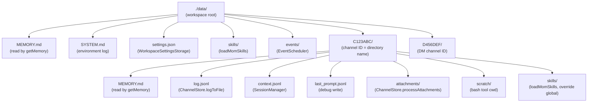
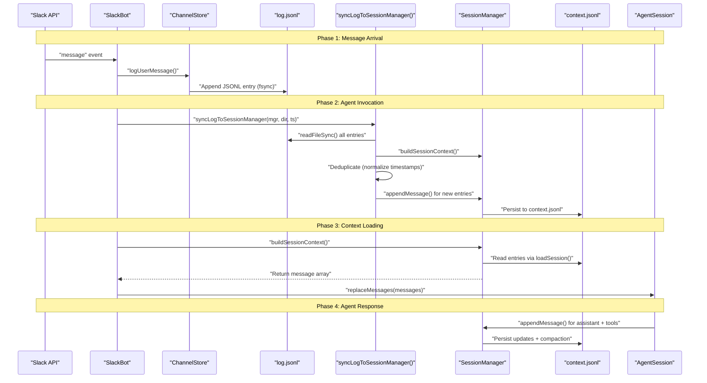
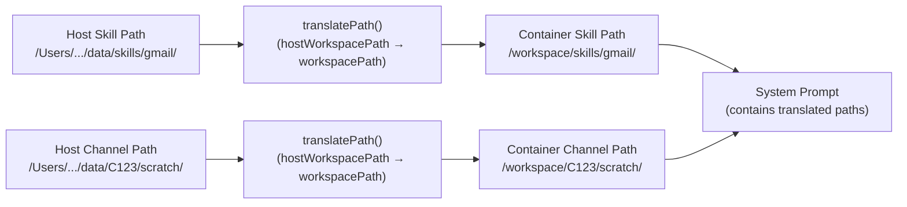
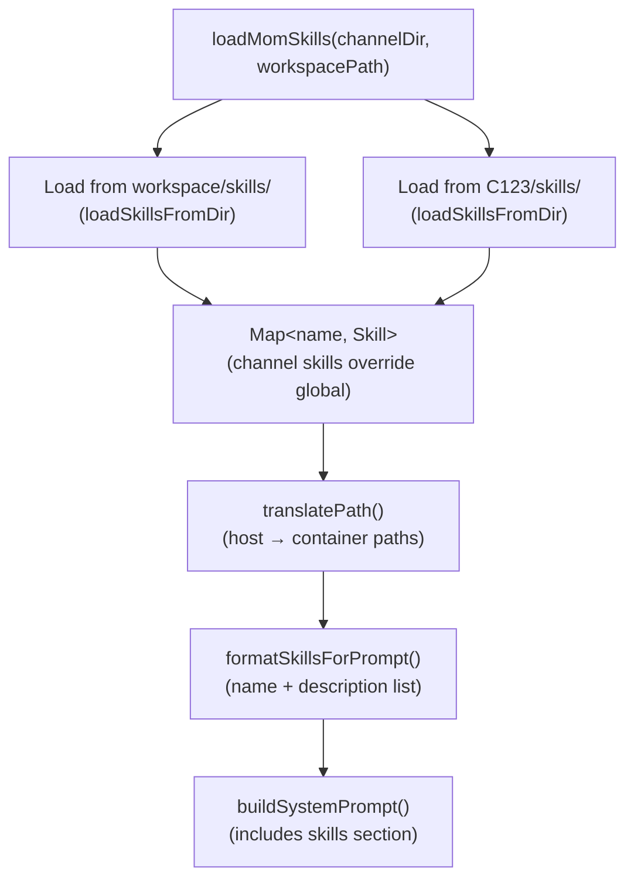
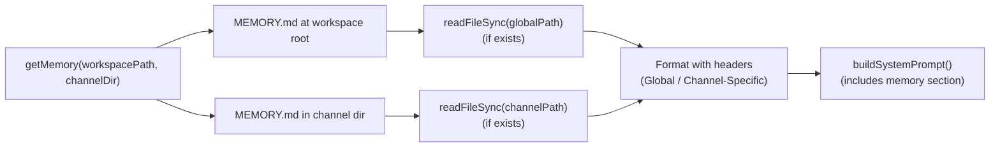
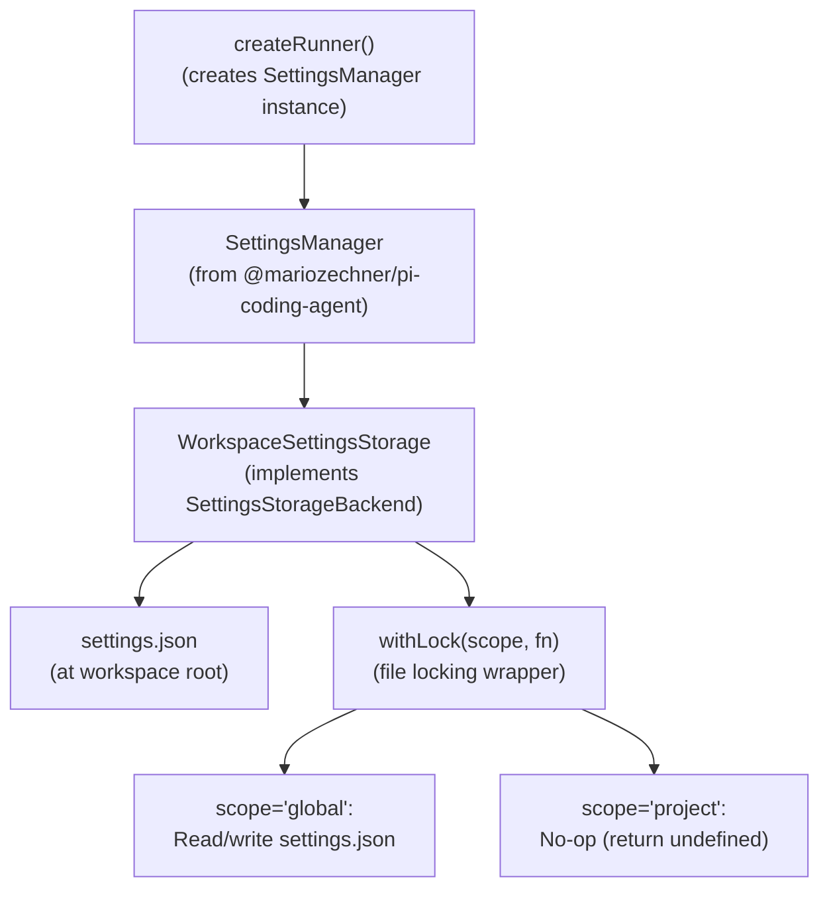
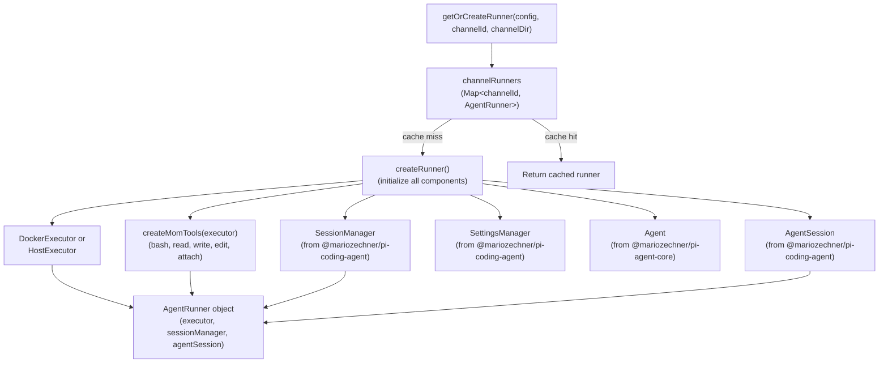
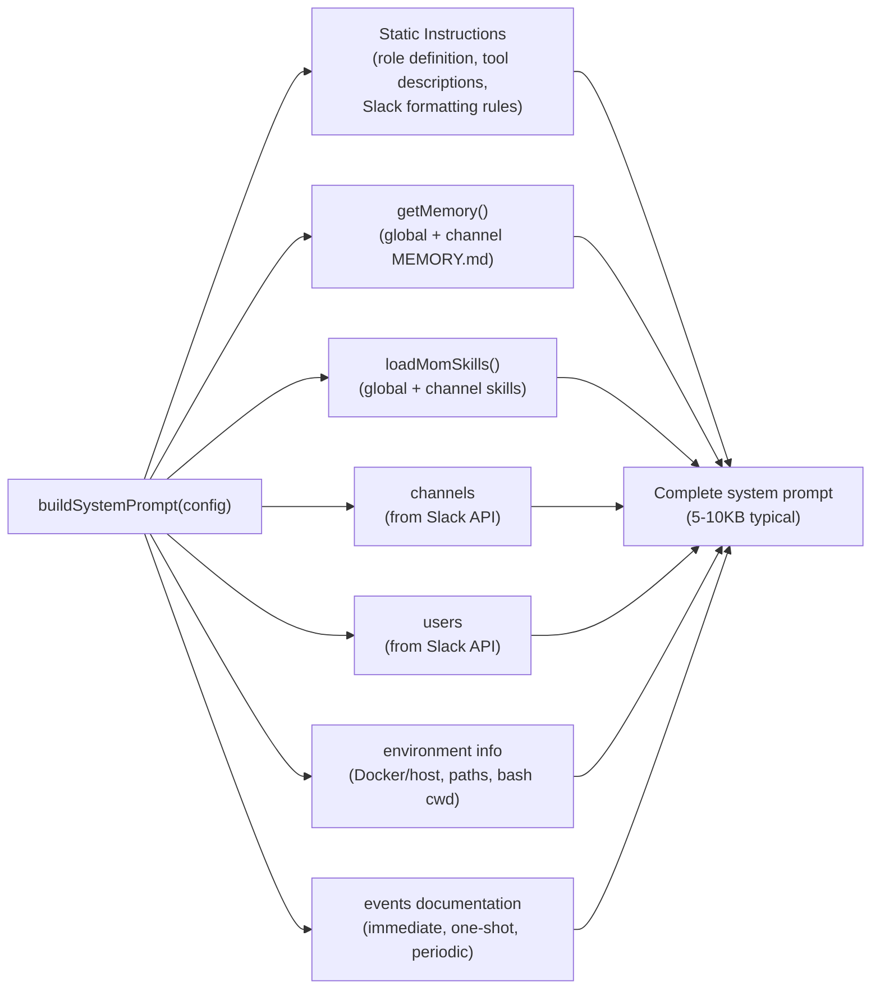
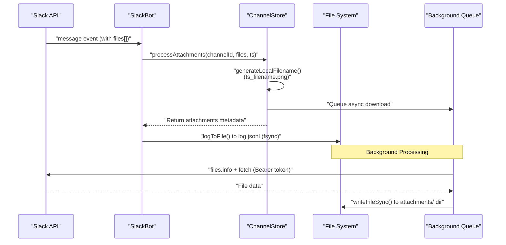

# Architecture & Workspace Structure

<details>
<summary>Relevant source files</summary>

The following files were used as context for generating this wiki page:

- [packages/agent/CHANGELOG.md](packages/agent/CHANGELOG.md)
- [packages/ai/CHANGELOG.md](packages/ai/CHANGELOG.md)
- [packages/coding-agent/CHANGELOG.md](packages/coding-agent/CHANGELOG.md)
- [packages/mom/CHANGELOG.md](packages/mom/CHANGELOG.md)
- [packages/tui/CHANGELOG.md](packages/tui/CHANGELOG.md)
- [packages/web-ui/CHANGELOG.md](packages/web-ui/CHANGELOG.md)

</details>

This page documents mom's workspace organization, per-channel directory structure, and how conversation history flows between log files and LLM context. For information about mom's integration with Slack and the coding agent runtime, see [8: pi-mom: Slack Bot](#8). For details about scheduled events, see [8.2: Events System](#8.2). For the artifacts HTTP server, see [8.3: Artifacts Server](#8.3).

## Overview

Mom is a Slack bot that creates isolated agent workspaces per Slack channel, each powered by a dedicated `AgentSession` from `@mariozechner/pi-coding-agent`. The workspace directory structure provides:

- **Per-channel isolation**: Each Slack channel (public, private, or DM) gets its own subdirectory with separate conversation history, attachments, memory, and tools
- **Dual message storage**: `log.jsonl` maintains a permanent record of all messages, while `context.jsonl` (managed by `SessionManager`) stores the LLM context with tool calls and auto-compaction
- **Skills system**: Reusable CLI tools shared globally or scoped to individual channels, using the Agent Skills standard from `@mariozechner/pi-coding-agent`
- **Memory persistence**: Global and per-channel `MEMORY.md` files that mom can read and update
- **Docker/host mode**: Path translation between host filesystem and container paths for seamless execution in both modes

Mom reuses the coding agent's core infrastructure (`AgentSession`, `SessionManager`, `SettingsManager`, skills loader) but operates without a TUI, instead interfacing through Slack's real-time messaging API.

## Workspace Directory Structure

**Workspace Root Layout**

```
./data/                         # Host workspace directory (--workspace flag)
├── MEMORY.md                   # Global memory (shared across channels)
├── SYSTEM.md                   # Environment setup log
├── settings.json               # Global settings (managed by SettingsManager)
├── skills/                     # Global skills (loaded by loadMomSkills)
│   └── <skill-name>/
│       ├── SKILL.md           # Skill metadata + documentation
│       └── *.sh, *.js, etc.   # Skill implementation scripts
├── events/                     # Scheduled events (processed by EventScheduler)
│   ├── *.json                 # Event definitions
├── C123ABC/                    # Channel workspace (one per channel ID)
│   ├── MEMORY.md              # Channel-specific memory
│   ├── log.jsonl              # Permanent message history (written by ChannelStore)
│   ├── context.jsonl          # LLM context (managed by SessionManager)
│   ├── last_prompt.jsonl      # Debug: system prompt + messages
│   ├── attachments/           # User-uploaded files (downloaded by ChannelStore)
│   │   └── 1732531234567_file.png
│   ├── scratch/               # Channel working directory (bash tool cwd)
│   └── skills/                # Channel-specific skills (override global)
│       └── <skill-name>/
└── D456DEF/                    # DM workspace (same structure)
    └── ...
```

**Directory Structure with Code Entity Mapping**



Sources: [packages/mom/README.md:183-197](), [packages/mom/src/agent.ts:419-421]()

## Per-Channel Isolation

Each channel gets a completely isolated workspace identified by Slack's channel ID:

| Channel Type    | Directory Pattern  | Example        |
| --------------- | ------------------ | -------------- |
| Public channel  | `C<ALPHANUMERIC>/` | `C0A34FL8PMH/` |
| Private channel | `G<ALPHANUMERIC>/` | `G123ABC456/`  |
| Direct message  | `D<ALPHANUMERIC>/` | `D456DEF789/`  |

The channel ID serves as both the directory name and the cache key in `channelRunners: Map<string, AgentRunner>`. Each cached runner contains:

- **Dedicated `AgentSession`**: Manages tool execution, event emission, and LLM streaming
- **Dedicated `SessionManager`**: Persists messages to `context.jsonl` with auto-compaction
- **Separate message queue**: Queued messages from one channel never interfere with another
- **Isolated tool execution**: Bash tool executes in channel-specific `scratch/` directory

Mom never shares state between channels. Each maintains its own conversation history, context, memory, and tools.

Sources: [packages/mom/src/slack.ts:29-32](), [packages/mom/src/main.ts:95-108](), [packages/mom/src/agent.ts:391-405]()

## Message History: log.jsonl vs context.jsonl

Mom uses two JSONL files per channel with different purposes:

### log.jsonl - Permanent Record

**Format:**

```json
{
  "date": "2025-11-26T10:44:00.000Z",
  "ts": "1732531234.567890",
  "user": "U123ABC",
  "userName": "mario",
  "displayName": "Mario Zechner",
  "text": "Fix the bug in parser.ts",
  "attachments": [
    {
      "original": "screenshot.png",
      "local": "C123ABC/attachments/1732531234567_screenshot.png"
    }
  ],
  "isBot": false
}
```

**Characteristics:**

- **Append-only** - never compacted or modified
- **User messages and bot responses only** - no tool calls or results
- **Written synchronously** on every message event via `SlackBot.logToFile()`
- **Source of truth** for conversation history
- **Searchable with grep/jq** for older history beyond context window

Sources: [packages/mom/src/store.ts:11-20](), [packages/mom/src/slack.ts:216-224]()

### context.jsonl - LLM Context

**Format:** Same as coding-agent session format (see [4.3: Session Management](#4.3))

**Characteristics:**

- **Includes tool calls and results** - full LLM interaction history
- **Subject to compaction** when context exceeds model limits
- **Synced from log.jsonl** before each agent run via `syncLogToSessionManager()`
- **Managed by SessionManager** from pi-coding-agent package

Sources: [packages/mom/src/context.ts:1-11](), [packages/mom/src/agent.ts:424-427]()

### Synchronization Flow

**Log-to-Context Sync Process with Code Entities**



The sync process deduplicates messages by comparing normalized text content (stripping timestamp prefixes and attachment sections) to avoid re-adding messages that already exist in context.

Sources: [packages/mom/src/context.ts:42-142](), [packages/mom/src/agent.ts:651-664]()

## Path Translation: Host vs Container

When running in Docker mode, paths differ between host and container. Mom translates paths in skill definitions and system prompts to ensure consistency.

**Path Translation Mapping**

| Location          | Host Path                               | Container Path               | Used By                  |
| ----------------- | --------------------------------------- | ---------------------------- | ------------------------ |
| Workspace root    | `/Users/mario/mom/data/`                | `/workspace/`                | `workspacePath` variable |
| Channel directory | `/Users/mario/mom/data/C123ABC/`        | `/workspace/C123ABC/`        | `channelDir` variable    |
| Global skills     | `/Users/mario/mom/data/skills/`         | `/workspace/skills/`         | `loadMomSkills()`        |
| Channel skills    | `/Users/mario/mom/data/C123ABC/skills/` | `/workspace/C123ABC/skills/` | `loadMomSkills()`        |

**Path Translation Flow**



The `loadMomSkills()` function translates skill file paths before including them in the system prompt, ensuring skills reference correct container paths in their `SKILL.md` documentation.

Sources: [packages/mom/src/agent.ts:105-139](), [packages/mom/src/agent.ts:868-884]()

## Skills System

Skills are reusable CLI tools that mom creates and uses. Each skill is a directory containing a `SKILL.md` file with metadata and documentation, plus implementation scripts.

### Skill Discovery and Loading

**Skill Loading Hierarchy with Code Entities**



**Loading Order:**

1. Load global skills from `<workspace>/skills/` - available to all channels
2. Load channel skills from `<channelId>/skills/` - override global skills with same name
3. Translate all file paths to container paths
4. Include name + description in system prompt
5. When mom uses a skill, she reads the full `SKILL.md` for detailed instructions

Sources: [packages/mom/src/agent.ts:105-139](), [packages/mom/src/agent.ts:203-224]()

### Skill Structure

Each skill directory contains:

```
/workspace/skills/gmail/
├── SKILL.md              # Required: metadata + documentation
├── send.sh               # Implementation scripts
├── read.py
└── config.json           # Optional: skill-specific config
```

**SKILL.md Format:**

```markdown
---
name: gmail
description: Read, search, and send Gmail via IMAP/SMTP
---

# Gmail Skill

Detailed usage instructions, examples, credential setup.

## Usage

Send email:
\`\`\`bash
bash {baseDir}/send.sh --to user@example.com --subject "Hello"
\`\`\`

Read inbox:
\`\`\`bash
python3 {baseDir}/read.py --folder INBOX --limit 10
\`\`\`
```

The `{baseDir}` placeholder is replaced with the skill's container path when included in the system prompt.

Sources: [packages/mom/README.md:226-286](), [packages/coding-agent/src/resources/skills.ts:1-50]()

## Memory Files

Mom uses `MEMORY.md` files to persist context across sessions. Two levels of memory exist:

### Global Memory

**Location:** `<workspace>/MEMORY.md`

**Scope:** Shared across all channels

**Typical Contents:**

- Coding conventions and preferences
- Project architecture notes
- Team member roles and responsibilities
- Common troubleshooting steps
- Tool installation instructions

### Channel Memory

**Location:** `<workspace>/<channelId>/MEMORY.md`

**Scope:** Channel-specific

**Typical Contents:**

- Ongoing work in this channel
- Channel-specific decisions
- Task lists and reminders
- Channel conventions

**Memory Loading in System Prompt**

The `getMemory()` function reads both files and formats them for inclusion in the system prompt:

```
### Global Workspace Memory
<content from workspace/MEMORY.md>

### Channel-Specific Memory
<content from C123ABC/MEMORY.md>
```

If neither file exists, the system prompt shows `(no working memory yet)`.

**Memory Loading Flow**



Sources: [packages/mom/src/agent.ts:69-103](), [packages/mom/src/agent.ts:287-294]()

## Settings Management

Mom uses a single `settings.json` file at the workspace root for configuration, managed by `SettingsManager` from pi-coding-agent.

**Settings Storage Architecture**



Mom stores all settings globally in the workspace root. The `project` scope is unused because mom doesn't have a concept of project-level settings - everything is either global or channel-specific (via separate channel directories).

**Typical Settings:**

```json
{
  "compactionThreshold": 0.8,
  "maxRetries": 3,
  "thinkingLevel": "off"
}
```

Sources: [packages/mom/src/context.ts:144-180](), [packages/mom/src/agent.ts:427-428]()

## Agent Runner Architecture

Mom creates one `AgentRunner` per channel, cached for the lifetime of the process. Each runner maintains:

**AgentRunner Creation and Caching**



Each runner subscribes to agent events once during creation and maintains internal state for the current run (pending tools, usage tracking, queue references).

Sources: [packages/mom/src/agent.ts:391-405](), [packages/mom/src/agent.ts:411-478]()

## System Prompt Construction

The system prompt is rebuilt on every agent run to include fresh state:

**System Prompt Construction Pipeline**



The prompt includes container paths, channel/user mappings, workspace layout, and comprehensive documentation for all available features.

Sources: [packages/mom/src/agent.ts:141-329](), [packages/mom/src/agent.ts:665-677]()

## Attachment Storage

User-uploaded files are downloaded to the channel's `attachments/` directory with timestamped filenames.

**Attachment Processing Flow with Code Entities**



Filenames use the pattern `{timestamp}_{originalName}` where timestamp is Slack's message timestamp converted to milliseconds. This ensures uniqueness and chronological ordering.

Sources: [packages/mom/src/store.ts:52-109](), [packages/mom/src/slack.ts:416-431]()

## Debug Instrumentation

Mom writes a `last_prompt.jsonl` file on each run for debugging:

```json
{
  "systemPrompt": "You are mom, a Slack bot...",
  "messages": [...],
  "newUserMessage": "[2025-12-14 10:30:00+01:00] [mario]: Fix the bug",
  "imageAttachmentCount": 0
}
```

This captures the exact context sent to the LLM, useful for debugging context issues or unexpected behavior.

Sources: [packages/mom/src/agent.ts:774-780]()
