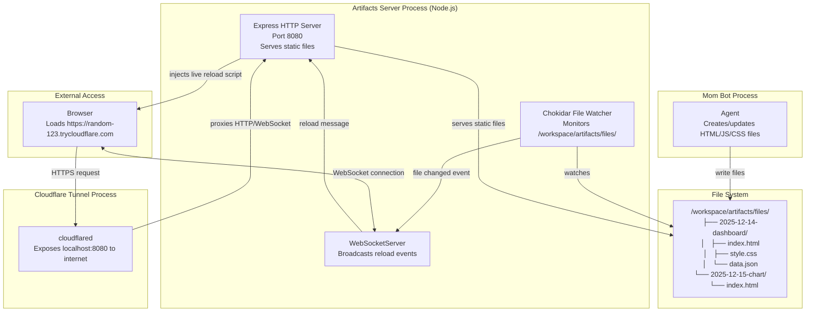
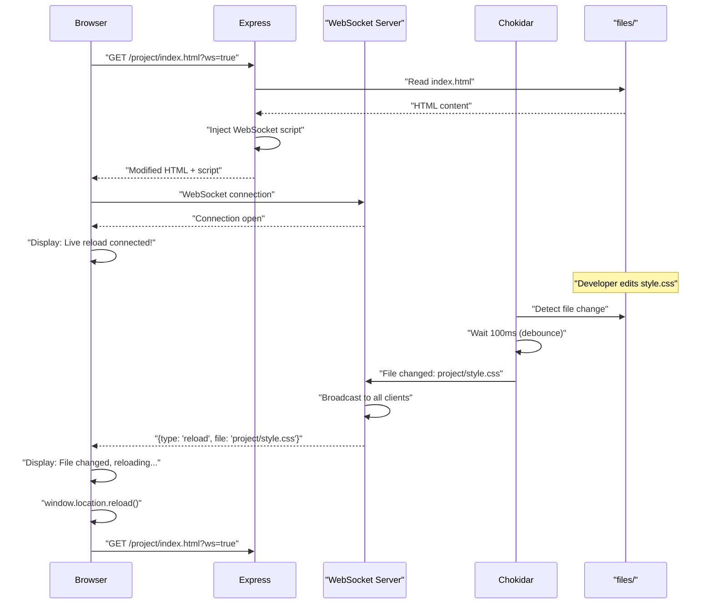
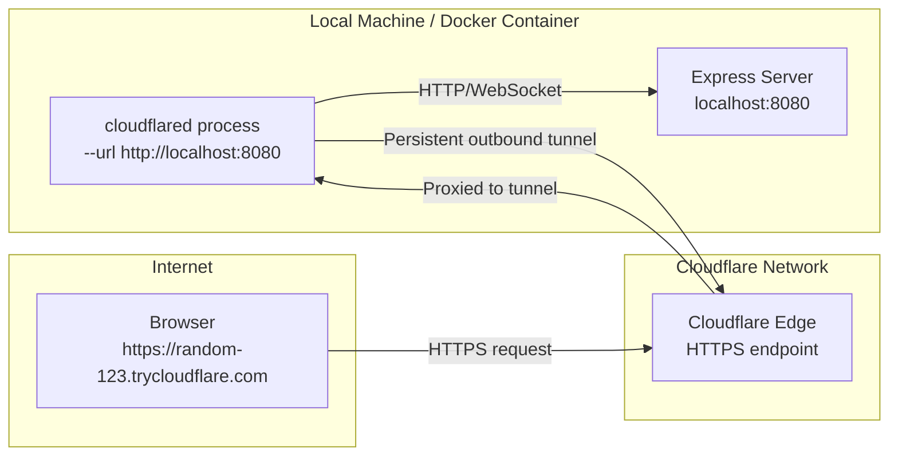
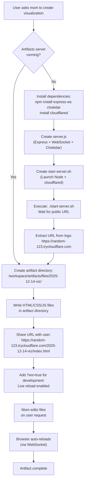

# Artifacts Server

<details>
<summary>Relevant source files</summary>

The following files were used as context for generating this wiki page:

- [packages/agent/CHANGELOG.md](packages/agent/CHANGELOG.md)
- [packages/ai/CHANGELOG.md](packages/ai/CHANGELOG.md)
- [packages/coding-agent/CHANGELOG.md](packages/coding-agent/CHANGELOG.md)
- [packages/mom/CHANGELOG.md](packages/mom/CHANGELOG.md)
- [packages/tui/CHANGELOG.md](packages/tui/CHANGELOG.md)
- [packages/web-ui/CHANGELOG.md](packages/web-ui/CHANGELOG.md)

</details>

The Artifacts Server is a separate HTTP server that allows mom to create and share HTML/JS/CSS artifacts (visualizations, dashboards, prototypes, demos) via a public URL with optional live reload support for development. It is implemented as a standalone Node.js application that mom creates, manages, and deploys within her workspace.

**Scope**: This document covers the artifacts server implementation, file organization, live reload mechanism, and Cloudflare Tunnel integration. For the overall mom bot architecture and workspace structure, see [8. pi-mom: Slack Bot](#8). For the events system that can trigger mom to update artifacts, see [8.2. Events System](#8.2).

---

## Architecture Overview

The artifacts server consists of four key components that work together to serve files with live reload capabilities and public internet access.

**Artifacts Server Architecture**



**Sources**: [packages/mom/docs/artifacts-server.md:30-245](), [packages/mom/README.md:18]()

---

## Server Components

The artifacts server is implemented as a standalone Node.js application with three main modules.

### Express HTTP Server

The Express server handles HTTP requests and serves static files from the `files/` directory with cache-busting headers.

**Key responsibilities**:

- Serve static files from `/workspace/artifacts/files/`
- Inject live reload script for HTML requests with `?ws=true`
- Set cache-control headers to prevent stale content
- Handle path traversal security checks

**Server setup** (from [packages/mom/docs/artifacts-server.md:32-50]()):

```javascript
const PORT = 8080
const FILES_DIR = path.join(__dirname, 'files')
const app = express()
const server = http.createServer(app)
```

**Live reload injection middleware** (from [packages/mom/docs/artifacts-server.md:135-197]()):

- Checks if request is for an HTML file with `?ws=true` query parameter
- Validates path is within `FILES_DIR` (prevents path traversal attacks)
- Reads HTML file, injects WebSocket client script before `</body>` tag
- Returns modified HTML with connection status indicator

**Sources**: [packages/mom/docs/artifacts-server.md:32-207]()

### WebSocket Server

The WebSocket server maintains persistent connections to browsers for live reload notifications.

**Implementation details**:

- Created as `WebSocketServer` attached to the HTTP server
- Tracks connected clients in a `Set`
- Broadcasts `{ type: 'reload', file: relativePath }` messages when files change
- Handles client errors and disconnections gracefully
- Removes disconnected clients from tracking set

**Client tracking** (from [packages/mom/docs/artifacts-server.md:54-71]()):

```javascript
const clients = new Set()

wss.on('connection', (ws) => {
  clients.add(ws)
  ws.on('error', (err) => {
    clients.delete(ws)
  })
  ws.on('close', () => {
    clients.delete(ws)
  })
})
```

**Broadcast mechanism** (from [packages/mom/docs/artifacts-server.md:99-117]()):

- Sends reload message to all connected clients
- Checks `client.readyState === 1` (OPEN state) before sending
- Removes clients with failed sends from tracking set

**Sources**: [packages/mom/docs/artifacts-server.md:52-121]()

### Chokidar File Watcher

The file watcher monitors the `files/` directory for changes and triggers reload events.

**Configuration** (from [packages/mom/docs/artifacts-server.md:78-87]()):

```javascript
const watcher = chokidar.watch(FILES_DIR, {
  persistent: true,
  ignoreInitial: true,
  depth: 99, // Watch all subdirectories
  ignorePermissionErrors: true,
  awaitWriteFinish: { stabilityThreshold: 100, pollInterval: 50 },
})
```

**Key features**:

- Watches recursively up to 99 levels deep
- Debounces write operations (waits 100ms for file stabilization)
- Explicitly adds new directories to watch list when created
- Emits events for all file operations (add, change, unlink, addDir)

**Event handling** (from [packages/mom/docs/artifacts-server.md:89-117]()):

- Listens for `'all'` events (covers add, change, unlink, addDir, etc.)
- Converts absolute paths to relative paths for broadcast
- When new directory detected, explicitly adds it to watcher
- Broadcasts file path to all WebSocket clients

**Sources**: [packages/mom/docs/artifacts-server.md:77-122]()

---

## File Organization

The artifacts server uses a date-prefixed subdirectory structure for organizing projects.

**Directory Structure**

```
/workspace/artifacts/
├── server.js              # Express + WebSocket + Chokidar server
├── start-server.sh        # Startup script (launches Node + cloudflared)
├── package.json           # Dependencies: express, ws, chokidar
├── node_modules/          # Installed packages
└── files/                 # Served via HTTP
    ├── 2025-12-14-dashboard/
    │   ├── index.html     # Main file (accessed via /2025-12-14-dashboard/index.html)
    │   ├── style.css      # Additional resources
    │   ├── logo.png
    │   └── data.json
    ├── 2025-12-15-chart/
    │   └── index.html
    └── test.html          # Standalone files also supported
```

**Naming convention**: `$(date +%Y-%m-%d)-description/` for subdirectories

**URL mapping**:

- Files map directly to URLs: `/2025-12-14-dashboard/index.html`
- Must use full `index.html` path for live reload (not just `/2025-12-14-dashboard/`)
- Subdirectory organization keeps related files together

**Sources**: [packages/mom/docs/artifacts-server.md:318-334]()

---

## Live Reload System

The live reload system uses WebSocket connections to automatically refresh the browser when files change.

**Live Reload Flow**



**Client-side implementation** (injected by server):

- Creates WebSocket connection to same host as HTTP
- Displays connection status in fixed bottom-left div
- Shows green box for success, red box for errors
- Automatically reloads page on receiving reload message
- Uses 500ms delay before reload to ensure file write is complete

**Connection status display** (from [packages/mom/docs/artifacts-server.md:157-166]()):

```javascript
const errorDiv = document.createElement('div')
errorDiv.style.cssText = 'position:fixed;bottom:10px;left:10px;...'
errorDiv.textContent = 'Live reload: connecting...'

function showStatus(msg, isError) {
  errorDiv.textContent = msg
  errorDiv.style.background = isError
    ? 'rgba(255,0,0,0.9)'
    : 'rgba(0,150,0,0.9)'
  if (!isError) setTimeout(() => (errorDiv.style.display = 'none'), 3000)
}
```

**Sources**: [packages/mom/docs/artifacts-server.md:135-197](), [packages/mom/docs/artifacts-server.md:385-393]()

---

## Public Access via Cloudflare Tunnel

Cloudflare Tunnel (`cloudflared`) exposes the local server to the internet without port forwarding or firewall configuration.

**Tunnel Integration**



**Startup process** (from [packages/mom/docs/artifacts-server.md:254-310]()):

1. Start Node.js server in background (`node server.js`)
2. Wait 2 seconds for server to be ready
3. Start cloudflared: `cloudflared tunnel --url http://localhost:8080`
4. Wait 5 seconds for tunnel to establish
5. Extract public URL from cloudflared logs: `grep 'https://.*\.trycloudflare\.com'`
6. Display URL and save to `/tmp/artifacts-url.txt`

**Free tier limitations**:

- Random subdomain on each restart (e.g., `https://concepts-rome-123.trycloudflare.com`)
- No persistent URLs without paid account
- Supports both HTTP and WebSocket traffic
- No bandwidth limits for testing

**Sources**: [packages/mom/docs/artifacts-server.md:254-310](), [packages/mom/docs/artifacts-server.md:461-476]()

---

## Usage Workflow

The typical workflow involves mom creating the server infrastructure, then creating and updating artifact files.

**Complete Usage Flow**



**Sources**: [packages/mom/docs/artifacts-server.md:336-363](), [packages/mom/docs/artifacts-server.md:440-458]()

---

## Technical Implementation Details

### Cache-Busting Headers

The server sends no-cache headers to prevent browsers from serving stale content.

**Header configuration** (from [packages/mom/docs/artifacts-server.md:124-132]()):

```javascript
app.use((req, res, next) => {
  res.set({
    'Cache-Control': 'no-store, no-cache, must-revalidate, proxy-revalidate',
    Pragma: 'no-cache',
    Expires: '0',
    'Surrogate-Control': 'no-store',
  })
  next()
})
```

**Sources**: [packages/mom/docs/artifacts-server.md:123-133]()

### Path Traversal Security

The middleware validates that requested paths are within the `FILES_DIR` to prevent directory traversal attacks.

**Security check** (from [packages/mom/docs/artifacts-server.md:142-146]()):

```javascript
const resolvedPath = path.resolve(filePath)
const resolvedBase = path.resolve(FILES_DIR)
if (!resolvedPath.startsWith(resolvedBase)) {
  return res.status(403).send('Forbidden: Path traversal detected')
}
```

**Sources**: [packages/mom/docs/artifacts-server.md:140-198]()

### Error Handling

The server includes comprehensive error handling for WebSocket, file system, and Express errors.

**Error handlers**:

- WebSocket client errors: log and remove from tracking set
- WebSocket server errors: log but continue running
- Express errors: return 500 with error message
- File watcher errors: log but continue watching
- Port conflicts (EADDRINUSE): exit with error message
- Uncaught exceptions and unhandled rejections: log to console

**Graceful shutdown** (from [packages/mom/docs/artifacts-server.md:227-237]()):

```javascript
process.on('SIGTERM', () => {
  watcher.close()
  server.close(() => process.exit(0))
})

process.on('SIGINT', () => {
  watcher.close()
  server.close(() => process.exit(0))
})
```

**Sources**: [packages/mom/docs/artifacts-server.md:58-75](), [packages/mom/docs/artifacts-server.md:119-121](), [packages/mom/docs/artifacts-server.md:202-237]()

---

## Common Troubleshooting

| Issue                    | Diagnosis                          | Resolution                                                                            |
| ------------------------ | ---------------------------------- | ------------------------------------------------------------------------------------- |
| 502 Bad Gateway          | Node server crashed                | Check `/tmp/server.log`, restart with `node server.js &`                              |
| WebSocket not connecting | Browser can't establish connection | Ensure `?ws=true` in URL, use full `index.html` path, check browser console           |
| Files not updating       | File watcher not detecting changes | Verify files are in `/workspace/artifacts/files/`, check `/tmp/server.log` for events |
| Port already in use      | Another process using port 8080    | `pkill node`, wait 2 seconds, restart                                                 |
| Browser caching          | Serving old content despite reload | Hard refresh (Ctrl+Shift+R), add version parameter `?ws=true&v=2`                     |

**Sources**: [packages/mom/docs/artifacts-server.md:415-439]()

---

## Integration with Mom's System Prompt

Mom is instructed about the artifacts server in her system prompt, though the specific documentation is not included in the files analyzed here. The server is presented as a capability mom can use to share visual work with users.

The artifacts server is independent of mom's core runtime but integrates with her workspace structure at `/workspace/artifacts/`. Mom interacts with it by:

1. Creating and managing the server files (`server.js`, `start-server.sh`)
2. Writing HTML/CSS/JS artifacts to `/workspace/artifacts/files/`
3. Starting/stopping the server process via bash commands
4. Sharing the public Cloudflare Tunnel URL with users

**Sources**: [packages/mom/docs/artifacts-server.md:1-476](), [packages/mom/README.md:16-19]()
