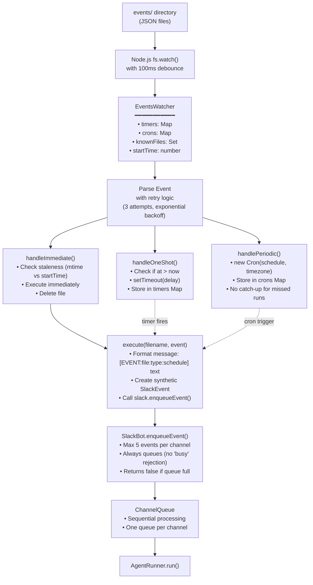
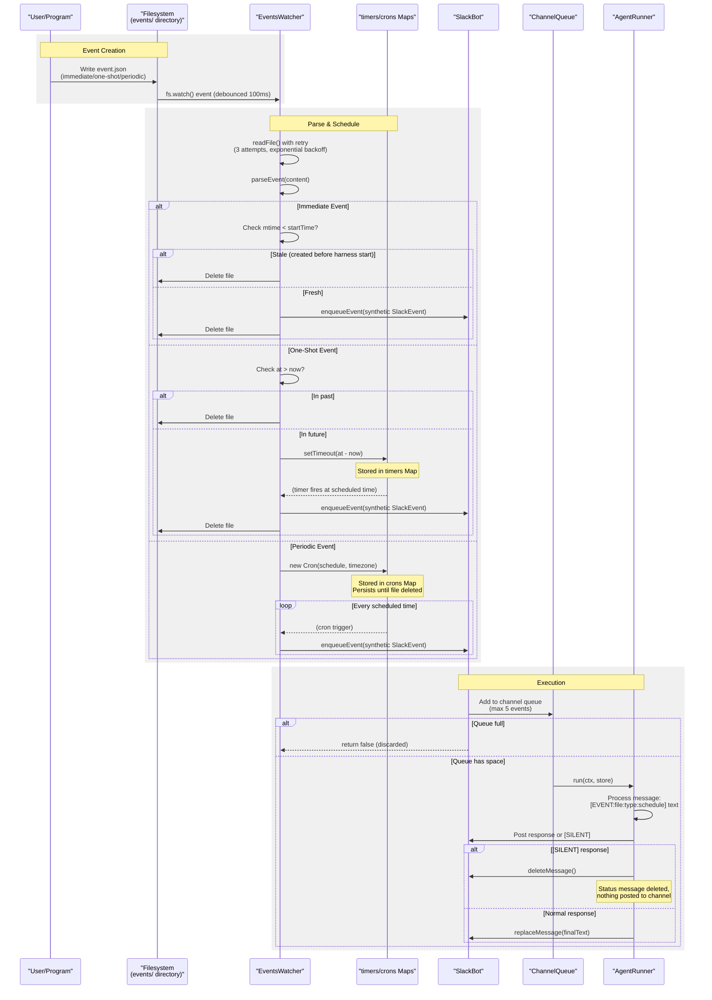

# Events System

<details>
<summary>Relevant source files</summary>

The following files were used as context for generating this wiki page:

- [packages/agent/CHANGELOG.md](packages/agent/CHANGELOG.md)
- [packages/ai/CHANGELOG.md](packages/ai/CHANGELOG.md)
- [packages/coding-agent/CHANGELOG.md](packages/coding-agent/CHANGELOG.md)
- [packages/mom/CHANGELOG.md](packages/mom/CHANGELOG.md)
- [packages/tui/CHANGELOG.md](packages/tui/CHANGELOG.md)
- [packages/web-ui/CHANGELOG.md](packages/web-ui/CHANGELOG.md)

</details>

The events system provides scheduled and immediate task execution for mom, enabling wake-ups at specific times, recurring tasks via cron schedules, and instant triggers from external programs. Events are represented as JSON files in the `workspace/events/` directory, monitored by the `EventsWatcher` class and executed through the existing `ChannelQueue` mechanism.

For information about mom's overall architecture and workspace structure, see [Architecture & Workspace Structure](#8.1). For details on the artifacts server (another scheduled service mom can manage), see [Artifacts Server](#8.3).

## Event Types

The system supports three distinct event types, each serving different use cases.

### Immediate Events

Immediate events (`ImmediateEvent`) trigger as soon as the harness detects the file. These are designed for programs mom writes to signal external events like webhooks, file watchers, or API callbacks.

```json
{
  "type": "immediate",
  "channelId": "C123ABC",
  "text": "New support ticket received: #12345"
}
```

The file is deleted after execution. Staleness detection prevents executing immediate events created before the harness started (based on file `mtime` vs `EventsWatcher.startTime`).

Sources: [packages/mom/src/events.ts:12-16](), [packages/mom/src/events.ts:258-276](), [packages/mom/docs/events.md:7-20]()

### One-Shot Events

One-shot events (`OneShotEvent`) trigger once at a specific date and time. Used for reminders, scheduled tasks, or deferred actions.

```json
{
  "type": "one-shot",
  "channelId": "C123ABC",
  "text": "Remind Mario about the dentist appointment",
  "at": "2025-12-15T09:00:00+01:00"
}
```

The `at` timestamp must be in ISO 8601 format with timezone offset. Events with past timestamps are immediately deleted without execution. The file is deleted after successful execution.

Sources: [packages/mom/src/events.ts:18-23](), [packages/mom/src/events.ts:278-299](), [packages/mom/docs/events.md:22-34]()

### Periodic Events

Periodic events (`PeriodicEvent`) trigger repeatedly on a cron schedule. Used for recurring tasks like daily summaries, inbox checks, or regular monitoring.

```json
{
  "type": "periodic",
  "channelId": "C123ABC",
  "text": "Check inbox and post summary",
  "schedule": "0 9 * * 1-5",
  "timezone": "Europe/Vienna"
}
```

The `schedule` field uses standard cron syntax (`minute hour day-of-month month day-of-week`). The `timezone` field uses IANA timezone names. The file persists until explicitly deleted. Missed scheduled times during harness downtime are not caught up.

Sources: [packages/mom/src/events.ts:25-31](), [packages/mom/src/events.ts:301-316](), [packages/mom/docs/events.md:36-62]()

## Architecture Overview

**EventsWatcher Architecture**



The `EventsWatcher` class [packages/mom/src/events.ts:43-375]() is the central orchestrator. It watches the `events/` directory using Node.js `fs.watch()` [packages/mom/src/events.ts:73-76](), maintains state for scheduled events, and coordinates with `SlackBot` for execution.

Sources: [packages/mom/src/events.ts:43-111](), [packages/mom/src/main.ts:6](), [packages/mom/src/main.ts:351-352]()

## Event Lifecycle

**Event Lifecycle Flow**



Key lifecycle stages:

1. **Creation**: User or program writes JSON file to `events/` directory
2. **Detection**: `fs.watch()` callback triggers with 100ms debounce [packages/mom/src/events.ts:113-125]()
3. **Parsing**: File read with retry logic (3 attempts, exponential backoff) [packages/mom/src/events.ts:179-219]()
4. **Scheduling**: Based on event type, stored in `timers` or `crons` Map [packages/mom/src/events.ts:44-45]()
5. **Execution**: When due, synthetic `SlackEvent` created and enqueued [packages/mom/src/events.ts:318-357]()
6. **Cleanup**: Immediate/one-shot events deleted after execution, periodic events persist

Sources: [packages/mom/src/events.ts:179-357](), [packages/mom/src/slack.ts:248-257]()

## File Format & Directory Structure

Events are JSON files stored in `<workspace>/events/`. The directory is created automatically if it doesn't exist [packages/mom/src/events.ts:63-65]().

**Directory Layout:**

```
workspace/
├── events/
│   ├── webhook-12345.json          # Immediate
│   ├── dentist-reminder.json       # One-shot
│   ├── daily-inbox-summary.json    # Periodic
│   └── ...
├── C123ABC/                         # Channel directory
│   ├── log.jsonl
│   ├── context.jsonl
│   └── ...
└── ...
```

**Type Definitions:**

The three event types are represented as TypeScript interfaces [packages/mom/src/events.ts:12-33]():

| Type             | Required Fields                                     | Optional Fields | Notes                               |
| ---------------- | --------------------------------------------------- | --------------- | ----------------------------------- |
| `ImmediateEvent` | `type`, `channelId`, `text`                         | -               | Deleted after execution             |
| `OneShotEvent`   | `type`, `channelId`, `text`, `at`                   | -               | `at` must be ISO 8601 with timezone |
| `PeriodicEvent`  | `type`, `channelId`, `text`, `schedule`, `timezone` | -               | Persists until manually deleted     |

**Validation:**

The `parseEvent()` method [packages/mom/src/events.ts:221-256]() validates:

- Required fields present for each type
- Event type is recognized (`immediate`, `one-shot`, or `periodic`)
- Format constraints (e.g., `at` field for one-shot, `schedule` and `timezone` for periodic)

Invalid events are retried 3 times with exponential backoff, then deleted and logged as errors.

Sources: [packages/mom/src/events.ts:12-33](), [packages/mom/src/events.ts:221-256](), [packages/mom/docs/events.md:150-208]()

## Execution Flow

When an event becomes due for execution, the following flow occurs:

**Message Formatting:**

The event is formatted into a message string [packages/mom/src/events.ts:318-343]():

```
[EVENT:{filename}:{type}:{schedule-info}] {text}
```

Examples:

- Immediate: `[EVENT:webhook-123.json:immediate] New support ticket`
- One-shot: `[EVENT:dentist.json:one-shot:2025-12-15T09:00:00+01:00] Remind Mario`
- Periodic: `[EVENT:daily-inbox.json:periodic:0 9 * * 1-5] Check inbox`

This formatted message becomes the `text` field of a synthetic `SlackEvent` [packages/mom/src/events.ts:336-342]().

**Queue Integration:**

The synthetic event is passed to `SlackBot.enqueueEvent()` [packages/mom/src/slack.ts:248-257](), which:

1. Checks if queue has space (max 5 events per channel) [packages/mom/src/slack.ts:250-253]()
2. If full, logs warning and returns `false` [packages/mom/src/slack.ts:251-253]()
3. If space available, adds to channel's `ChannelQueue` with `isEvent=true` flag [packages/mom/src/slack.ts:255]()
4. Returns `true` to indicate successful enqueue

Unlike user @mentions, events **always queue** rather than being rejected with "Already working" [packages/mom/docs/events.md:111-121]().

**Agent Execution:**

When the event reaches the front of the queue, `MomHandler.handleEvent()` is called [packages/mom/src/main.ts:299-331]():

1. Status message posted: `"_Starting event: {filename}_"` [packages/mom/src/main.ts:310]()
2. `AgentRunner.run()` executes with the event message in context
3. LLM receives the formatted event message and can respond or take actions
4. Response handling checks for `[SILENT]` marker [packages/mom/src/agent.ts:806-814]()

Sources: [packages/mom/src/events.ts:318-357](), [packages/mom/src/slack.ts:248-257](), [packages/mom/src/main.ts:299-331]()

## Special Behaviors

### Staleness Detection

Immediate events created before the harness started are considered stale and deleted without execution [packages/mom/src/events.ts:258-276]():

```typescript
// Check if stale (created before harness started)
const stat = statSync(filePath)
if (stat.mtimeMs < this.startTime) {
  log.logInfo(`Stale immediate event, deleting: ${filename}`)
  this.deleteFile(filename)
  return
}
```

This prevents re-executing immediate events from a previous harness session (e.g., after restart). The `startTime` is set in the constructor [packages/mom/src/events.ts:55]() to `Date.now()`.

### Silent Completion

Periodic events often check for activity (new emails, notifications, etc.) and may find nothing to report. To avoid spamming the channel with "no activity" messages, mom can respond with exactly `[SILENT]` [packages/mom/src/agent.ts:806-814]():

```typescript
// Check for [SILENT] marker - delete message and thread instead of posting
if (
  finalText.trim() === '[SILENT]' ||
  finalText.trim().startsWith('[SILENT]')
) {
  try {
    await ctx.deleteMessage()
    log.logInfo('Silent response - deleted message and thread')
  } catch (err) {
    // ...
  }
}
```

This deletes the "Starting event..." status message and posts nothing to Slack. The system prompt documents this feature [packages/mom/src/agent.ts:277-278]().

### Queue Limits

A maximum of 5 events can be queued per channel [packages/mom/src/slack.ts:250]():

```typescript
if (queue.size() >= 5) {
  log.logWarning(`Event queue full for ${event.channel}, discarding: ...`)
  return false
}
```

This prevents runaway event creation from flooding the system. The system prompt advises debouncing for programs that create many immediate events [packages/mom/src/agent.ts:280-284]().

### File Modification Handling

If an existing event file is modified, the watcher:

1. Cancels any existing timer/cron [packages/mom/src/events.ts:149]()
2. Re-parses the file [packages/mom/src/events.ts:150]()
3. Reschedules based on the new content

This allows rescheduling events by editing the JSON file.

Sources: [packages/mom/src/events.ts:258-276](), [packages/mom/src/agent.ts:806-814](), [packages/mom/src/slack.ts:248-257](), [packages/mom/src/events.ts:141-155]()

## Integration with System Prompt

The events system is extensively documented in mom's system prompt [packages/mom/src/agent.ts:226-285](), providing LLM context about:

- Event types and JSON format with examples
- Cron syntax and common schedules
- Timezone handling (IANA names for periodic, ISO 8601 with offset for one-shot)
- File creation patterns and unique naming conventions
- Management commands (`ls`, `cat`, `rm`)
- Event triggering format (`[EVENT:file:type:schedule] text`)
- Silent completion with `[SILENT]` marker
- Debouncing best practices for programs creating immediate events
- Queue limits (max 5 events)

**Cron Format Examples from System Prompt:**

```
minute hour day-of-month month day-of-week

- `0 9 * * *` = daily at 9:00
- `0 9 * * 1-5` = weekdays at 9:00
- `30 14 * * 1` = Mondays at 14:30
- `0 0 1 * *` = first of each month at midnight
```

**Debouncing Example from System Prompt:**

The prompt includes an example showing how to aggregate multiple occurrences into a single event [packages/mom/src/agent.ts:280-282]():

```bash
# Bad: Creates event per email — will flood the queue
on_email() { echo '{"type":"immediate"...}' > /workspace/events/email-$ID.json; }

# Good: Use periodic event to check for new items every N minutes
```

This ensures LLMs writing programs that create events understand the constraints and best practices.

Sources: [packages/mom/src/agent.ts:226-285](), [packages/mom/docs/events.md:216-308]()

## Error Handling

**Parse Errors:**

Failed JSON parses are retried with exponential backoff [packages/mom/src/events.ts:186-197]():

```typescript
for (let i = 0; i < MAX_RETRIES; i++) {
  // MAX_RETRIES = 3
  try {
    const content = await readFile(filePath, 'utf-8')
    event = this.parseEvent(content, filename)
    break
  } catch (err) {
    lastError = err instanceof Error ? err : new Error(String(err))
    if (i < MAX_RETRIES - 1) {
      await this.sleep(RETRY_BASE_MS * 2 ** i) // 100ms, 200ms, 400ms
    }
  }
}
```

After 3 failures, the file is deleted and an error is logged [packages/mom/src/events.ts:199-202]().

**Cron Validation:**

Invalid cron schedules are caught during `Cron` construction [packages/mom/src/events.ts:301-316]():

```typescript
try {
  const cron = new Cron(event.schedule, { timezone: event.timezone }, () => {
    // ...
  })
  // ...
} catch (err) {
  log.logWarning(
    `Invalid cron schedule for ${filename}: ${event.schedule}`,
    String(err)
  )
  this.deleteFile(filename)
}
```

**Execution Errors:**

If the agent throws an error during event execution, it's handled by the standard agent error flow. The event file is already deleted (for immediate/one-shot) or persists (for periodic) regardless of execution success.

Sources: [packages/mom/src/events.ts:179-219](), [packages/mom/src/events.ts:301-316]()

## Startup Behavior

On harness startup, `EventsWatcher.start()` [packages/mom/src/events.ts:61-79]():

1. Ensures `events/` directory exists [packages/mom/src/events.ts:63-65]()
2. Scans existing files via `scanExisting()` [packages/mom/src/events.ts:70]()
3. For each file, calls `handleFile()` which parses and schedules appropriately [packages/mom/src/events.ts:137-139]()
4. Sets up `fs.watch()` on the directory [packages/mom/src/events.ts:73-76]()

**Missed Events:**

- **Immediate**: Stale events (mtime < startTime) are deleted without execution
- **One-shot**: Past events (at < now) are deleted without execution
- **Periodic**: No catch-up for missed runs; waits for next scheduled time from cron

The watcher is started in `main.ts` after `SlackBot` initialization [packages/mom/src/main.ts:351-352]():

```typescript
const eventsWatcher = createEventsWatcher(workingDir, bot)
eventsWatcher.start()
```

**Shutdown:**

On `SIGINT` or `SIGTERM`, the watcher is stopped [packages/mom/src/main.ts:355-365](), which:

1. Closes `fs.watch()` watcher [packages/mom/src/events.ts:86-89]()
2. Clears all debounce timers [packages/mom/src/events.ts:92-95]()
3. Cancels all scheduled timers [packages/mom/src/events.ts:97-101]()
4. Stops all cron jobs [packages/mom/src/events.ts:103-107]()

Sources: [packages/mom/src/events.ts:61-111](), [packages/mom/src/main.ts:351-365]()

## Dependencies

The events system uses the `croner` library for cron scheduling [packages/mom/src/events.ts:1]():

```typescript
import { Cron } from 'croner'
```

The `Cron` constructor supports:

- Standard cron syntax (5-field format)
- Timezone option using IANA timezone names
- Callback function executed on each trigger
- `nextRun()` method to get next scheduled time

All other functionality (file watching, timers, JSON parsing) uses Node.js built-ins.

Sources: [packages/mom/src/events.ts:1](), [packages/mom/src/events.ts:303]()
